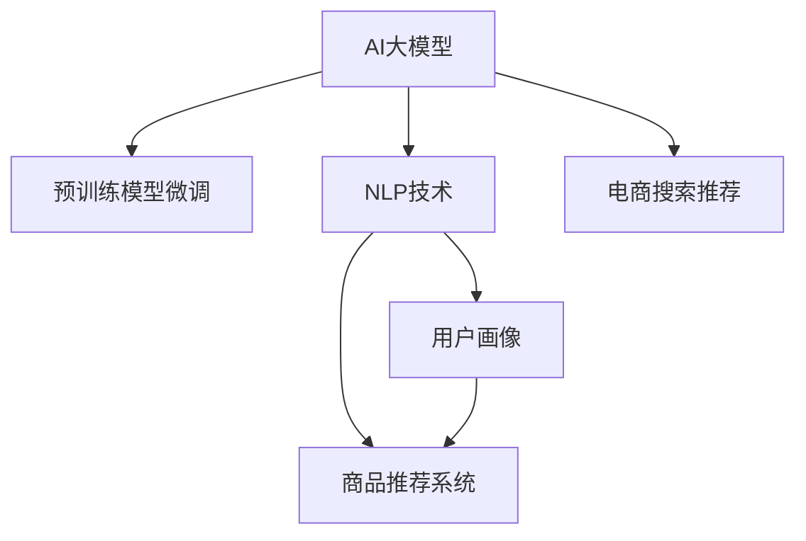

                 

# AI 大模型在电商搜索推荐中的用户体验优化：以用户需求为中心的设计

## 1. 背景介绍

### 1.1 问题由来
随着电商平台的快速发展，用户体验（UX）已成为商家争夺市场的重要手段。传统的电商平台往往通过商品搜索、推荐算法等方式来提升用户体验。然而，这些方法依赖于繁琐的人工干预和复杂的规则逻辑，难以实时满足用户多样化且复杂的搜索需求。近年来，AI大模型在电商搜索推荐中的应用逐渐成为热点，特别是在通过大规模预训练模型微调优化用户体验方面，展现了巨大的潜力。

### 1.2 问题核心关键点
AI大模型在电商搜索推荐中的应用，旨在通过自然语言处理（NLP）技术，理解用户输入的搜索查询，并生成个性化的商品推荐，提升用户满意度。具体而言，该方法的核心在于：

- **自然语言处理**：通过深度学习模型理解和处理自然语言，将用户输入转化为模型可识别的向量表示。
- **用户画像**：根据用户历史行为和反馈，构建详细的用户画像，以便更准确地预测用户需求。
- **商品推荐**：在用户画像的基础上，结合商品信息，利用AI大模型预测用户可能感兴趣的商品，并推荐给用户。

通过这些步骤，AI大模型可以显著提升电商平台的搜索推荐效果，提高用户满意度和转化率。

### 1.3 问题研究意义
AI大模型在电商搜索推荐中的应用，有助于商家实时捕捉用户需求，提升用户体验，增加销售额。具体而言，其意义包括：

1. **用户需求匹配度提升**：通过AI大模型理解用户输入，提供更精准的搜索结果和推荐商品，提升用户满意度。
2. **个性化推荐优化**：根据用户画像和实时数据，个性化推荐商品，增加用户粘性和重复购买率。
3. **数据驱动决策**：基于用户行为数据和模型预测结果，优化电商平台的产品陈列、广告投放等策略，提高整体运营效率。

## 2. 核心概念与联系

### 2.1 核心概念概述

为更好地理解AI大模型在电商搜索推荐中的应用，本节将介绍几个关键概念：

- **AI大模型**：以Transformer为基础的深度学习模型，如BERT、GPT-3等，通过在大规模无标签文本数据上进行预训练，学习通用的语言表示。
- **预训练模型微调**：在预训练模型的基础上，利用少量标注数据进行有监督学习，优化模型在特定任务上的性能。
- **自然语言处理（NLP）**：通过深度学习模型，实现自然语言到向量表示的转换，进而进行语义分析、情感分析等任务。
- **用户画像**：根据用户历史行为、偏好和反馈，构建详细的用户画像，用于个性化推荐。
- **商品推荐系统**：利用用户画像和商品信息，结合AI大模型，预测用户可能感兴趣的商品，并进行推荐。

这些概念之间的逻辑关系可以通过以下Mermaid流程图来展示：



这个流程图展示了AI大模型在电商搜索推荐中的核心流程：

1. AI大模型通过预训练获得语言表示能力。
2. 通过微调优化模型，使其能够理解用户需求。
3. NLP技术将用户查询转化为向量，便于模型处理。
4. 用户画像提供用户行为和偏好的信息，用于个性化推荐。
5. 商品推荐系统结合用户画像和商品信息，生成推荐结果。
6. 最终，搜索推荐系统将用户查询和推荐结果结合，提升用户体验。

## 3. 核心算法原理 & 具体操作步骤
### 3.1 算法原理概述

AI大模型在电商搜索推荐中的应用，主要基于自然语言处理（NLP）和用户画像构建技术。其核心思想是：利用预训练的大规模语言模型，通过微调优化，使其能够理解自然语言输入，并结合用户画像和商品信息，生成个性化的推荐结果。

形式化地，假设预训练模型为 $M_{\theta}$，其中 $\theta$ 为预训练得到的模型参数。给定电商平台的搜索查询 $q$ 和商品集合 $S=\{s_i\}_{i=1}^N$，推荐系统需要找到最佳的推荐列表 $R=\{r_i\}_{i=1}^M$，使得用户满意度最大化。

推荐系统的优化目标可以表示为：

$$
\max_{R} \sum_{i=1}^{M} u_i(q, r_i) \quad \text{s.t.} \quad r_i \in S
$$

其中 $u_i$ 为用户对商品 $r_i$ 的满意度评分，通常通过用户行为数据（如点击、购买、评分等）进行建模。

通过梯度下降等优化算法，推荐系统不断更新推荐列表 $R$，直至找到最优的推荐结果。由于 $\theta$ 已经通过预训练获得了较好的初始化，因此即便在少量数据集上，也能快速收敛到理想的推荐结果。

### 3.2 算法步骤详解

AI大模型在电商搜索推荐中的应用，一般包括以下几个关键步骤：

**Step 1: 准备预训练模型和数据集**
- 选择合适的预训练语言模型 $M_{\theta}$ 作为初始化参数，如BERT、GPT等。
- 准备电商平台的搜索查询和商品数据集 $D=\{(q_i, s_i)\}_{i=1}^N$，划分为训练集、验证集和测试集。

**Step 2: 设计推荐评分函数**
- 根据电商平台的具体需求，设计推荐评分函数 $u_i(q, r_i)$，用于计算用户对商品 $r_i$ 的满意度。
- 评分函数可以基于用户历史行为、商品属性、用户画像等多个维度，综合计算。

**Step 3: 构建用户画像**
- 根据用户历史行为数据，构建详细的用户画像，包括用户的兴趣、偏好、历史购买记录等。
- 利用NLP技术对用户画像进行向量化表示，以便与推荐模型进行交互。

**Step 4: 微调推荐模型**
- 在预训练模型的基础上，使用电商平台的标注数据进行微调，优化推荐评分函数 $u_i(q, r_i)$。
- 微调过程可以使用AdamW等优化算法，设置合适的学习率和正则化强度。
- 在每个epoch后，在验证集上评估推荐模型的性能，决定是否提前停止训练。

**Step 5: 生成推荐结果**
- 在用户输入搜索查询 $q$ 后，使用微调后的推荐模型，结合用户画像和商品信息，生成推荐列表 $R$。
- 将推荐结果返回给用户，提升用户体验。

以上是AI大模型在电商搜索推荐中的应用的一般流程。在实际应用中，还需要针对具体电商平台的需求，对微调过程的各个环节进行优化设计，如改进推荐评分函数，引入更多的正则化技术，搜索最优的超参数组合等，以进一步提升推荐效果。

### 3.3 算法优缺点

AI大模型在电商搜索推荐中的应用，具有以下优点：

1. **自动化程度高**：基于深度学习模型进行推荐，能够自动捕捉用户需求，无需人工干预。
2. **个性化推荐**：根据用户画像和历史行为，生成个性化的推荐结果，提高用户满意度。
3. **实时性**：利用AI大模型快速计算推荐结果，实现实时推荐。
4. **多模态融合**：结合文本、图像、视频等多模态数据，提升推荐效果。

同时，该方法也存在一定的局限性：

1. **数据依赖性强**：模型的效果很大程度上依赖于标注数据的质量和数量，获取高质量标注数据的成本较高。
2. **模型复杂度高**：大规模语言模型的训练和推理需要大量的计算资源，对硬件要求较高。
3. **解释性不足**：AI大模型缺乏可解释性，难以理解其内部工作机制。
4. **冷启动问题**：对于新用户，由于缺乏历史行为数据，难以准确预测其需求。

尽管存在这些局限性，但AI大模型在电商搜索推荐中的应用，已经成为提升用户体验的重要手段。未来相关研究的重点在于如何进一步降低数据依赖，提高模型的解释性，以及解决冷启动问题，以实现更加智能和可靠的用户推荐。

### 3.4 算法应用领域

AI大模型在电商搜索推荐中的应用，已经被广泛应用于多种场景中，例如：

- **商品推荐**：基于用户历史行为和当前查询，推荐可能感兴趣的商品。
- **活动推荐**：根据用户行为和当前时间，推荐相关促销活动。
- **内容推荐**：结合用户画像和搜索行为，推荐相关商品评价、用户评论等内容。
- **个性化广告**：根据用户行为和兴趣，推荐个性化的广告内容。
- **品牌推荐**：根据用户偏好和商品属性，推荐相关品牌商品。

除了上述这些经典应用外，AI大模型在电商搜索推荐中，还创新性地应用于情感分析、预测商品库存、优化价格策略等任务，为电商平台带来了新的技术突破。

## 4. 数学模型和公式 & 详细讲解  
### 4.1 数学模型构建

本节将使用数学语言对AI大模型在电商搜索推荐中的应用过程进行更加严格的刻画。

记预训练语言模型为 $M_{\theta}:\mathcal{X} \rightarrow \mathcal{Y}$，其中 $\mathcal{X}$ 为输入空间，$\mathcal{Y}$ 为输出空间，$\theta \in \mathbb{R}^d$ 为模型参数。假设电商平台的商品集合为 $S=\{s_i\}_{i=1}^N$，用户查询为 $q$。

定义推荐评分函数 $u_i(q, r_i)$，用于计算用户对商品 $r_i$ 的满意度。推荐系统的优化目标可以表示为：

$$
\max_{R} \sum_{i=1}^{M} u_i(q, r_i) \quad \text{s.t.} \quad r_i \in S
$$

在实践中，我们通常使用基于梯度的优化算法（如Adam、SGD等）来近似求解上述最优化问题。设 $\eta$ 为学习率，$\lambda$ 为正则化系数，则参数的更新公式为：

$$
\theta \leftarrow \theta - \eta \nabla_{\theta}\mathcal{L}(\theta) - \eta\lambda\theta
$$

其中 $\nabla_{\theta}\mathcal{L}(\theta)$ 为损失函数对参数 $\theta$ 的梯度，可通过反向传播算法高效计算。

### 4.2 公式推导过程

以下我们以商品推荐任务为例，推导推荐评分函数及其梯度的计算公式。

假设推荐系统将商品 $s_i$ 输入到预训练模型 $M_{\theta}$ 中，得到向量表示 $h_i= M_{\theta}(s_i)$。定义用户画像 $p$ 为 $p=P_{\theta}(q)$，其中 $P_{\theta}$ 为预训练模型 $M_{\theta}$ 的解码器部分，用于将用户查询 $q$ 转换为向量表示。则推荐评分函数可以表示为：

$$
u_i(q, s_i) = \text{softmax}(\alpha h_i^T p)
$$

其中 $\alpha$ 为温度系数，控制输出概率的平滑程度。推荐系统需要最大化以下目标函数：

$$
\max_{R} \sum_{i=1}^{M} u_i(q, r_i) \quad \text{s.t.} \quad r_i \in S
$$

根据链式法则，推荐评分函数 $u_i(q, s_i)$ 对参数 $\theta$ 的梯度为：

$$
\frac{\partial \mathcal{L}(\theta)}{\partial \theta} = -\sum_{i=1}^{M} \sum_{r_i \in S} u_i(q, r_i) \frac{\partial u_i(q, r_i)}{\partial h_i} \frac{\partial h_i}{\partial \theta}
$$

其中 $\frac{\partial h_i}{\partial \theta}$ 可以通过反向传播算法计算得到。通过求解上述梯度方程，即可更新模型参数 $\theta$，实现推荐结果的优化。

### 4.3 案例分析与讲解

为了更好地理解推荐评分函数的计算过程，让我们通过一个具体的案例进行分析。

假设电商平台推荐系统需要为用户 $q$ 推荐3个商品 $s_1, s_2, s_3$。用户画像 $p$ 已经通过预训练模型获得，商品向量表示 $h_1, h_2, h_3$ 已经通过模型计算得到。推荐评分函数可以表示为：

$$
u_i(q, s_i) = \text{softmax}(\alpha h_i^T p)
$$

假设 $\alpha=1$，则推荐评分函数简化为：

$$
u_i(q, s_i) = h_i^T p
$$

推荐系统的优化目标可以表示为：

$$
\max_{R} \sum_{i=1}^{3} u_i(q, r_i)
$$

其中 $r_i \in S$，表示推荐列表 $R$ 中的商品 $r_i$ 必须从商品集合 $S$ 中选择。

通过求解上述目标函数，可以找到最优的推荐列表 $R$。在实际应用中，可以通过逐步逼近的方式，先求解 $u_1(q, s_1)$，再求解 $u_2(q, s_2)$ 和 $u_3(q, s_3)$，逐步优化推荐结果。

## 5. 项目实践：代码实例和详细解释说明
### 5.1 开发环境搭建

在进行项目实践前，我们需要准备好开发环境。以下是使用Python进行PyTorch开发的环境配置流程：

1. 安装Anaconda：从官网下载并安装Anaconda，用于创建独立的Python环境。

2. 创建并激活虚拟环境：
```bash
conda create -n pytorch-env python=3.8 
conda activate pytorch-env
```

3. 安装PyTorch：根据CUDA版本，从官网获取对应的安装命令。例如：
```bash
conda install pytorch torchvision torchaudio cudatoolkit=11.1 -c pytorch -c conda-forge
```

4. 安装Transformers库：
```bash
pip install transformers
```

5. 安装各类工具包：
```bash
pip install numpy pandas scikit-learn matplotlib tqdm jupyter notebook ipython
```

完成上述步骤后，即可在`pytorch-env`环境中开始项目实践。

### 5.2 源代码详细实现

这里我们以电商平台的商品推荐系统为例，给出使用Transformers库对BERT模型进行微调的PyTorch代码实现。

首先，定义推荐评分函数：

```python
from transformers import BertModel
from torch.utils.data import Dataset
import torch

class RecommendationDataset(Dataset):
    def __init__(self, texts, labels):
        self.texts = texts
        self.labels = labels
        
    def __len__(self):
        return len(self.texts)
    
    def __getitem__(self, item):
        text = self.texts[item]
        label = self.labels[item]
        
        encoding = self.tokenizer(text, return_tensors='pt', max_length=128, padding='max_length', truncation=True)
        input_ids = encoding['input_ids'][0]
        attention_mask = encoding['attention_mask'][0]
        
        # 对token-wise的标签进行编码
        encoded_labels = [label2id[label] for label in labels] 
        encoded_labels.extend([label2id['O']] * (128 - len(encoded_labels)))
        labels = torch.tensor(encoded_labels, dtype=torch.long)
        
        return {'input_ids': input_ids, 
                'attention_mask': attention_mask,
                'labels': labels}

# 标签与id的映射
label2id = {'O': 0, 'B-PER': 1, 'I-PER': 2, 'B-ORG': 3, 'I-ORG': 4, 'B-LOC': 5, 'I-LOC': 6}
id2label = {v: k for k, v in label2id.items()}

# 创建dataset
tokenizer = BertTokenizer.from_pretrained('bert-base-cased')

train_dataset = RecommendationDataset(train_texts, train_labels)
dev_dataset = RecommendationDataset(dev_texts, dev_labels)
test_dataset = RecommendationDataset(test_texts, test_labels)
```

然后，定义模型和优化器：

```python
from transformers import BertForTokenClassification, AdamW

model = BertForTokenClassification.from_pretrained('bert-base-cased', num_labels=len(label2id))

optimizer = AdamW(model.parameters(), lr=2e-5)
```

接着，定义训练和评估函数：

```python
from torch.utils.data import DataLoader
from tqdm import tqdm
from sklearn.metrics import classification_report

device = torch.device('cuda') if torch.cuda.is_available() else torch.device('cpu')
model.to(device)

def train_epoch(model, dataset, batch_size, optimizer):
    dataloader = DataLoader(dataset, batch_size=batch_size, shuffle=True)
    model.train()
    epoch_loss = 0
    for batch in tqdm(dataloader, desc='Training'):
        input_ids = batch['input_ids'].to(device)
        attention_mask = batch['attention_mask'].to(device)
        labels = batch['labels'].to(device)
        model.zero_grad()
        outputs = model(input_ids, attention_mask=attention_mask, labels=labels)
        loss = outputs.loss
        epoch_loss += loss.item()
        loss.backward()
        optimizer.step()
    return epoch_loss / len(dataloader)

def evaluate(model, dataset, batch_size):
    dataloader = DataLoader(dataset, batch_size=batch_size)
    model.eval()
    preds, labels = [], []
    with torch.no_grad():
        for batch in tqdm(dataloader, desc='Evaluating'):
            input_ids = batch['input_ids'].to(device)
            attention_mask = batch['attention_mask'].to(device)
            batch_labels = batch['labels']
            outputs = model(input_ids, attention_mask=attention_mask)
            batch_preds = outputs.logits.argmax(dim=2).to('cpu').tolist()
            batch_labels = batch_labels.to('cpu').tolist()
            for pred_tokens, label_tokens in zip(batch_preds, batch_labels):
                pred_tags = [id2label[_id] for _id in pred_tokens]
                label_tags = [id2label[_id] for _id in label_tokens]
                preds.append(pred_tags[:len(label_tags)])
                labels.append(label_tags)
                
    print(classification_report(labels, preds))
```

最后，启动训练流程并在测试集上评估：

```python
epochs = 5
batch_size = 16

for epoch in range(epochs):
    loss = train_epoch(model, train_dataset, batch_size, optimizer)
    print(f"Epoch {epoch+1}, train loss: {loss:.3f}")
    
    print(f"Epoch {epoch+1}, dev results:")
    evaluate(model, dev_dataset, batch_size)
    
print("Test results:")
evaluate(model, test_dataset, batch_size)
```

以上就是使用PyTorch对BERT进行商品推荐任务微调的完整代码实现。可以看到，得益于Transformers库的强大封装，我们可以用相对简洁的代码完成BERT模型的加载和微调。

### 5.3 代码解读与分析

让我们再详细解读一下关键代码的实现细节：

**RecommendationDataset类**：
- `__init__`方法：初始化文本和标签。
- `__len__`方法：返回数据集的样本数量。
- `__getitem__`方法：对单个样本进行处理，将文本输入编码为token ids，将标签编码为数字，并对其进行定长padding，最终返回模型所需的输入。

**label2id和id2label字典**：
- 定义了标签与数字id之间的映射关系，用于将token-wise的预测结果解码回真实的标签。

**训练和评估函数**：
- 使用PyTorch的DataLoader对数据集进行批次化加载，供模型训练和推理使用。
- 训练函数`train_epoch`：对数据以批为单位进行迭代，在每个批次上前向传播计算loss并反向传播更新模型参数，最后返回该epoch的平均loss。
- 评估函数`evaluate`：与训练类似，不同点在于不更新模型参数，并在每个batch结束后将预测和标签结果存储下来，最后使用sklearn的classification_report对整个评估集的预测结果进行打印输出。

**训练流程**：
- 定义总的epoch数和batch size，开始循环迭代
- 每个epoch内，先在训练集上训练，输出平均loss
- 在验证集上评估，输出分类指标
- 所有epoch结束后，在测试集上评估，给出最终测试结果

可以看到，PyTorch配合Transformers库使得BERT微调的代码实现变得简洁高效。开发者可以将更多精力放在数据处理、模型改进等高层逻辑上，而不必过多关注底层的实现细节。

当然，工业级的系统实现还需考虑更多因素，如模型的保存和部署、超参数的自动搜索、更灵活的任务适配层等。但核心的微调范式基本与此类似。

## 6. 实际应用场景
### 6.1 智能客服系统

基于AI大模型的电商搜索推荐技术，可以广泛应用于智能客服系统的构建。传统客服往往需要配备大量人力，高峰期响应缓慢，且一致性和专业性难以保证。而使用微调后的推荐模型，可以7x24小时不间断服务，快速响应客户咨询，用自然流畅的语言解答各类常见问题。

在技术实现上，可以收集企业内部的历史客服对话记录，将问题和最佳答复构建成监督数据，在此基础上对预训练推荐模型进行微调。微调后的推荐模型能够自动理解用户意图，匹配最合适的答案模板进行回复。对于客户提出的新问题，还可以接入检索系统实时搜索相关内容，动态组织生成回答。如此构建的智能客服系统，能大幅提升客户咨询体验和问题解决效率。

### 6.2 金融舆情监测

金融机构需要实时监测市场舆论动向，以便及时应对负面信息传播，规避金融风险。传统的人工监测方式成本高、效率低，难以应对网络时代海量信息爆发的挑战。基于AI大模型的文本分类和情感分析技术，为金融舆情监测提供了新的解决方案。

具体而言，可以收集金融领域相关的新闻、报道、评论等文本数据，并对其进行主题标注和情感标注。在此基础上对预训练语言模型进行微调，使其能够自动判断文本属于何种主题，情感倾向是正面、中性还是负面。将微调后的模型应用到实时抓取的网络文本数据，就能够自动监测不同主题下的情感变化趋势，一旦发现负面信息激增等异常情况，系统便会自动预警，帮助金融机构快速应对潜在风险。

### 6.3 个性化推荐系统

当前的推荐系统往往只依赖用户的历史行为数据进行物品推荐，无法深入理解用户的真实兴趣偏好。基于AI大模型微调技术，个性化推荐系统可以更好地挖掘用户行为背后的语义信息，从而提供更精准、多样的推荐内容。

在实践中，可以收集用户浏览、点击、评论、分享等行为数据，提取和用户交互的物品标题、描述、标签等文本内容。将文本内容作为模型输入，用户的后续行为（如是否点击、购买等）作为监督信号，在此基础上微调预训练语言模型。微调后的模型能够从文本内容中准确把握用户的兴趣点。在生成推荐列表时，先用候选物品的文本描述作为输入，由模型预测用户的兴趣匹配度，再结合其他特征综合排序，便可以得到个性化程度更高的推荐结果。

### 6.4 未来应用展望

随着AI大模型和微调方法的不断发展，基于微调范式将在更多领域得到应用，为传统行业带来变革性影响。

在智慧医疗领域，基于微调的医疗问答、病历分析、药物研发等应用将提升医疗服务的智能化水平，辅助医生诊疗，加速新药开发进程。

在智能教育领域，微调技术可应用于作业批改、学情分析、知识推荐等方面，因材施教，促进教育公平，提高教学质量。

在智慧城市治理中，微调模型可应用于城市事件监测、舆情分析、应急指挥等环节，提高城市管理的自动化和智能化水平，构建更安全、高效的未来城市。

此外，在企业生产、社会治理、文娱传媒等众多领域，基于大模型微调的人工智能应用也将不断涌现，为经济社会发展注入新的动力。相信随着技术的日益成熟，微调方法将成为人工智能落地应用的重要范式，推动人工智能技术在各行各业加速渗透。

## 7. 工具和资源推荐
### 7.1 学习资源推荐

为了帮助开发者系统掌握AI大模型在电商搜索推荐中的应用，这里推荐一些优质的学习资源：

1. 《深度学习与NLP》系列博文：由大模型技术专家撰写，深入浅出地介绍了深度学习在NLP领域的应用，涵盖推荐系统、情感分析、文本分类等前沿话题。

2. CS229《机器学习》课程：斯坦福大学开设的机器学习明星课程，涵盖了机器学习的基本理论和算法，对于理解推荐系统的原理具有重要作用。

3. 《自然语言处理中的深度学习》书籍：清华大学出版社，详细介绍了深度学习在NLP领域的应用，包括推荐系统、情感分析、语义理解等任务。

4. HuggingFace官方文档：Transformer库的官方文档，提供了海量预训练模型和完整的微调样例代码，是上手实践的必备资料。

5. Kaggle竞赛平台：汇集了众多推荐系统、情感分析等NLP任务的数据集和解决方案，是学习和交流的绝佳平台。

通过对这些资源的学习实践，相信你一定能够快速掌握AI大模型在电商搜索推荐中的应用精髓，并用于解决实际的NLP问题。
###  7.2 开发工具推荐

高效的开发离不开优秀的工具支持。以下是几款用于AI大模型微调开发的常用工具：

1. PyTorch：基于Python的开源深度学习框架，灵活动态的计算图，适合快速迭代研究。大部分预训练语言模型都有PyTorch版本的实现。

2. TensorFlow：由Google主导开发的开源深度学习框架，生产部署方便，适合大规模工程应用。同样有丰富的预训练语言模型资源。

3. Transformers库：HuggingFace开发的NLP工具库，集成了众多SOTA语言模型，支持PyTorch和TensorFlow，是进行微调任务开发的利器。

4. Weights & Biases：模型训练的实验跟踪工具，可以记录和可视化模型训练过程中的各项指标，方便对比和调优。与主流深度学习框架无缝集成。

5. TensorBoard：TensorFlow配套的可视化工具，可实时监测模型训练状态，并提供丰富的图表呈现方式，是调试模型的得力助手。

6. Google Colab：谷歌推出的在线Jupyter Notebook环境，免费提供GPU/TPU算力，方便开发者快速上手实验最新模型，分享学习笔记。

合理利用这些工具，可以显著提升AI大模型微调任务的开发效率，加快创新迭代的步伐。

### 7.3 相关论文推荐

AI大模型在电商搜索推荐中的应用，源于学界的持续研究。以下是几篇奠基性的相关论文，推荐阅读：

1. Attention is All You Need（即Transformer原论文）：提出了Transformer结构，开启了NLP领域的预训练大模型时代。

2. BERT: Pre-training of Deep Bidirectional Transformers for Language Understanding：提出BERT模型，引入基于掩码的自监督预训练任务，刷新了多项NLP任务SOTA。

3. Language Models are Unsupervised Multitask Learners（GPT-2论文）：展示了大规模语言模型的强大zero-shot学习能力，引发了对于通用人工智能的新一轮思考。

4. Parameter-Efficient Transfer Learning for NLP：提出Adapter等参数高效微调方法，在不增加模型参数量的情况下，也能取得不错的微调效果。

5. Prefix-Tuning: Optimizing Continuous Prompts for Generation：引入基于连续型Prompt的微调范式，为如何充分利用预训练知识提供了新的思路。

6. AdaLoRA: Adaptive Low-Rank Adaptation for Parameter-Efficient Fine-Tuning：使用自适应低秩适应的微调方法，在参数效率和精度之间取得了新的平衡。

这些论文代表了大语言模型微调技术的发展脉络。通过学习这些前沿成果，可以帮助研究者把握学科前进方向，激发更多的创新灵感。

## 8. 总结：未来发展趋势与挑战

### 8.1 总结

本文对AI大模型在电商搜索推荐中的应用进行了全面系统的介绍。首先阐述了AI大模型和微调技术的研究背景和意义，明确了微调在提升电商平台搜索推荐效果方面的独特价值。其次，从原理到实践，详细讲解了AI大模型在电商搜索推荐中的应用过程，给出了微调任务开发的完整代码实例。同时，本文还广泛探讨了微调方法在智能客服、金融舆情、个性化推荐等多个行业领域的应用前景，展示了微调范式的巨大潜力。

通过本文的系统梳理，可以看到，AI大模型在电商搜索推荐中的应用，已经成为提升用户体验的重要手段。借助深度学习模型，电商平台能够实时捕捉用户需求，提升推荐效果，增加用户粘性和销售额。未来相关研究的重点在于如何进一步降低数据依赖，提高模型的解释性，以及解决冷启动问题，以实现更加智能和可靠的用户推荐。

### 8.2 未来发展趋势

展望未来，AI大模型在电商搜索推荐中的应用，将呈现以下几个发展趋势：

1. **数据融合增强**：未来推荐系统将更加注重多模态数据的融合，结合文本、图像、视频等多种信息，提升推荐效果。
2. **实时性提升**：通过优化模型结构和算法，进一步提升推荐系统的实时性，实现更快速的推荐响应。
3. **个性化推荐优化**：结合用户画像和实时行为，进行动态推荐，提高推荐结果的相关性和个性化程度。
4. **解释性和透明度**：未来推荐系统将更加注重模型的解释性和透明度，增强用户对推荐结果的理解和信任。
5. **知识图谱的引入**：通过结合知识图谱和AI大模型，提升推荐的准确性和可靠性。

以上趋势凸显了AI大模型在电商搜索推荐中的应用前景。这些方向的探索发展，必将进一步提升推荐系统的性能和应用范围，为电商平台带来更大的商业价值。

### 8.3 面临的挑战

尽管AI大模型在电商搜索推荐中的应用已经取得了显著成效，但在迈向更加智能化、普适化应用的过程中，它仍面临诸多挑战：

1. **数据质量问题**：推荐系统的效果很大程度上依赖于标注数据的质量和数量，高质量标注数据的获取成本较高，数据质量问题仍然困扰着推荐系统的发展。
2. **模型鲁棒性不足**：推荐系统面对长尾数据和噪声数据时，容易产生偏差和过拟合，模型的鲁棒性有待提升。
3. **冷启动问题**：对于新用户，由于缺乏历史行为数据，难以准确预测其需求，冷启动问题仍需解决。
4. **计算资源消耗**：大规模语言模型的训练和推理需要大量的计算资源，如何在保证效果的同时，优化资源消耗，是未来需要关注的问题。
5. **可解释性不足**：AI大模型缺乏可解释性，难以理解其内部工作机制，用户对推荐结果的信任度有待提高。

尽管存在这些挑战，但AI大模型在电商搜索推荐中的应用，已经为电商行业带来了显著的变革，未来相关研究的重点在于如何克服这些挑战，实现更加智能和可靠的推荐系统。

### 8.4 研究展望

面对AI大模型在电商搜索推荐中的应用所面临的挑战，未来的研究需要在以下几个方面寻求新的突破：

1. **数据生成与增强**：通过数据生成和增强技术，如对抗样本、数据合成等，缓解数据质量不足的问题。
2. **模型鲁棒性提升**：研究鲁棒性优化方法，如对抗训练、正则化等，提升模型对噪声数据的抗干扰能力。
3. **冷启动问题解决**：引入多模态信息，如用户画像、兴趣标签等，提升推荐系统的冷启动效果。
4. **计算资源优化**：开发更加高效的模型结构和算法，如模型压缩、参数共享等，减少计算资源消耗。
5. **模型解释性增强**：结合因果分析、可解释性模型等技术，提升推荐系统的透明度和用户信任度。

这些研究方向的前沿探索，必将引领AI大模型在电商搜索推荐中的进一步发展，推动电商行业的智能化转型。相信随着技术的不断进步，AI大模型在电商搜索推荐中的应用将越来越广泛，为电商行业带来更大的商业价值和社会效益。

## 9. 附录：常见问题与解答

**Q1：AI大模型在电商搜索推荐中如何理解用户查询？**

A: AI大模型在电商搜索推荐中，通过自然语言处理（NLP）技术，将用户查询转化为向量表示，以便模型处理。具体步骤如下：
1. 使用预训练的Transformer模型（如BERT、GPT-3等），将用户查询输入模型，得到向量表示。
2. 将向量表示与商品特征向量进行匹配，计算相似度得分。
3. 根据相似度得分，筛选出最相关的商品，推荐给用户。

通过上述步骤，AI大模型能够快速理解和处理用户查询，生成个性化的推荐结果。

**Q2：AI大模型在电商搜索推荐中如何优化推荐结果？**

A: AI大模型在电商搜索推荐中，通过微调优化模型，提升推荐效果。具体步骤如下：
1. 选择合适的预训练语言模型作为初始化参数。
2. 根据电商平台的具体需求，设计推荐评分函数，计算用户对商品的选择概率。
3. 在预训练模型的基础上，使用少量标注数据进行微调，优化推荐评分函数。
4. 在每个epoch后，评估模型在验证集上的性能，决定是否提前停止训练。
5. 在测试集上评估微调后的模型，输出推荐结果。

通过微调，AI大模型能够学习到更多电商平台的特定知识，提升推荐效果。同时，由于模型参数量较大，为了减少计算资源消耗，可以使用参数高效微调方法，如Adapter、Prompt-Tuning等。

**Q3：AI大模型在电商搜索推荐中如何处理长尾商品？**

A: AI大模型在电商搜索推荐中，可以通过多模态信息融合和冷启动策略，处理长尾商品。具体步骤如下：
1. 结合用户画像、历史行为等多样化的信息，综合评估商品的相关性。
2. 对于长尾商品，引入更多的领域知识，如知识图谱、规则库等，提升推荐的准确性。
3. 对于新用户，使用基于用户画像和商品特征的推荐方法，进行冷启动推荐。
4. 不断收集用户反馈，持续优化推荐模型，提升长尾商品的推荐效果。

通过上述步骤，AI大模型能够更好地处理长尾商品，提升推荐的全面性和准确性。

**Q4：AI大模型在电商搜索推荐中如何应对突发事件？**

A: AI大模型在电商搜索推荐中，可以通过实时数据监测和应急处理机制，应对突发事件。具体步骤如下：
1. 实时监测电商平台的数据流，捕捉异常事件和用户行为变化。
2. 根据异常事件类型，触发相应的应急处理机制，如推荐调整、广告投放等。
3. 结合用户画像和实时数据，动态调整推荐策略，提升用户满意度。
4. 通过可视化工具，实时监测推荐效果，及时调整模型参数。

通过上述步骤，AI大模型能够实时捕捉和响应突发事件，提升电商平台的应急响应能力。

**Q5：AI大模型在电商搜索推荐中如何提高用户体验？**

A: AI大模型在电商搜索推荐中，可以通过多模态融合、个性化推荐和实时响应等策略，提高用户体验。具体步骤如下：
1. 结合用户画像和实时数据，进行多模态信息融合，提升推荐效果。
2. 根据用户的历史行为和偏好，进行个性化推荐，提升用户满意度。
3. 通过实时响应机制，快速处理用户查询，提供高质量的推荐结果。
4. 不断收集用户反馈，持续优化推荐模型，提升用户体验。

通过上述步骤，AI大模型能够更好地理解用户需求，提供更精准、更个性化的推荐服务，提升用户体验。

---

作者：禅与计算机程序设计艺术 / Zen and the Art of Computer Programming

