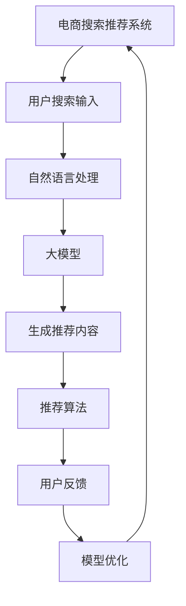

                 

## 1. 背景介绍

### 1.1 问题由来

在过去的几年里，人工智能(AI)技术在电商领域的应用越来越广泛，成为企业提升运营效率、改善用户体验的重要手段。然而，随着用户需求的多样化和快速变化，传统电商推荐系统的局限性逐渐显现：模型不够灵活，难以捕捉用户的隐性需求，推荐内容同质化严重。为了应对这些挑战，各大电商企业纷纷转向使用大模型进行电商搜索和推荐系统的优化。

### 1.2 问题核心关键点

AI大模型在电商搜索推荐中的应用，关键在于如何通过更灵活、高效的模型结构，更精准的用户需求理解，更丰富的推荐内容生成，来提升用户体验。具体来说：

1. **模型灵活性**：大模型能够适应不同层次的抽象表达，可以捕捉更深层次的用户需求。
2. **需求理解**：通过大模型进行用户行为分析，能够更加准确地理解用户的多样化和隐性需求。
3. **推荐内容**：生成更加丰富多样化的推荐内容，满足用户的个性化需求。

通过以上几个方面的优化，AI大模型可以更好地适应用户需求的变化，从而提升电商搜索推荐系统的用户体验。

### 1.3 问题研究意义

大模型在电商搜索推荐中的应用，具有以下几个方面的研究意义：

1. **提升个性化体验**：通过大模型的强大学习能力和灵活性，可以更准确地捕捉用户的多样化和隐性需求，从而提供更加个性化的推荐。
2. **优化用户体验**：大模型的泛化能力使得推荐系统能够更好地适应用户需求的变化，提升用户的满意度。
3. **推动行业进步**：通过大模型的优化，电商企业可以实现运营效率的提升和用户体验的改善，进而推动整个行业的进步。

## 2. 核心概念与联系

### 2.1 核心概念概述

为了更好地理解大模型在电商搜索推荐中的应用，首先需要介绍一些核心概念：

1. **电商搜索推荐系统**：根据用户的搜索行为和浏览历史，推荐符合用户需求的商品。电商推荐系统可以提升用户的购物体验，增加企业的销售额。

2. **大模型**：指具有大规模参数和复杂架构的神经网络模型，如BERT、GPT等。大模型通常在大规模数据上进行预训练，具备强大的表示学习能力和泛化能力。

3. **自然语言处理(NLP)**：主要研究如何使计算机理解、处理和生成人类语言的技术。在电商推荐系统中，NLP技术可以用于解析用户的搜索需求，生成推荐内容。

4. **注意力机制**：在大模型中广泛使用的机制，通过计算输入序列中不同位置的相关性，使得模型能够集中关注关键部分的信息。

5. **变分自编码器(VAE)**：一种无监督学习模型，用于生成新的数据，可以用于推荐系统生成个性化商品推荐。

6. **推荐算法**：包括协同过滤、基于内容的推荐、基于混合模型的推荐等，用于生成推荐列表。

7. **用户反馈**：用户的点击、购买等行为反馈，用于优化推荐模型。

### 2.2 核心概念原理和架构的 Mermaid 流程图(Mermaid 流程节点中不要有括号、逗号等特殊字符)



## 3. 核心算法原理 & 具体操作步骤

### 3.1 算法原理概述

大模型在电商搜索推荐中的应用，基于以下算法原理：

1. **预训练与微调**：首先在大规模无标签文本数据上对大模型进行预训练，然后在电商领域的标注数据上对其进行微调，以适应电商领域的特征和需求。

2. **注意力机制**：在大模型中引入注意力机制，使得模型能够关注用户的搜索输入中的关键信息，提升推荐结果的精准性。

3. **生成对抗网络(GAN)**：利用GAN生成新的商品描述，丰富推荐列表的内容。

4. **变分自编码器(VAE)**：用于生成新的商品图片，增加推荐系统的多样性。

5. **推荐算法优化**：优化推荐算法，如协同过滤、基于内容的推荐等，使得推荐系统能够更好地适应电商领域的特征和需求。

### 3.2 算法步骤详解

1. **数据准备**：收集电商领域的标注数据，包括用户的搜索历史、浏览历史和购买记录等。

2. **预训练**：在大规模无标签文本数据上对大模型进行预训练，使其具备强大的语言理解能力。

3. **微调**：在电商领域的标注数据上对大模型进行微调，使其能够适应电商领域的特征和需求。

4. **生成推荐内容**：利用大模型生成新的商品描述和图片，丰富推荐列表的内容。

5. **推荐算法优化**：优化推荐算法，使其能够更好地适应电商领域的特征和需求。

6. **模型优化**：利用用户反馈不断优化模型，提高推荐系统的准确性和个性化程度。

### 3.3 算法优缺点

#### 优点：

1. **强大的泛化能力**：大模型在大规模数据上进行预训练，具备强大的泛化能力，能够适应不同用户的多样化需求。
2. **提升推荐精准性**：通过引入注意力机制，大模型能够关注用户的搜索输入中的关键信息，提升推荐结果的精准性。
3. **丰富推荐内容**：利用GAN和VAE等技术生成新的商品描述和图片，增加推荐系统的多样性。
4. **提升个性化程度**：通过优化推荐算法，能够更好地适应电商领域的特征和需求，提升推荐系统的个性化程度。

#### 缺点：

1. **计算成本高**：大模型的训练和微调需要大量的计算资源，成本较高。
2. **数据需求量大**：需要大量的电商领域的标注数据进行微调，数据获取成本较高。
3. **模型复杂度高**：大模型的结构复杂，难以解释和调试。
4. **过拟合风险**：在电商领域标注数据较少的情况下，容易发生过拟合，降低推荐系统的泛化能力。

### 3.4 算法应用领域

大模型在电商搜索推荐中的应用，主要包括以下几个领域：

1. **商品推荐**：根据用户的搜索历史和浏览历史，推荐符合用户需求的商品。
2. **个性化推荐**：根据用户的个性化需求，推荐符合用户喜好的商品。
3. **用户行为分析**：分析用户的搜索行为和购买行为，预测用户的未来需求。
4. **商品分类**：对商品进行分类，使得推荐系统更加精准。
5. **商品属性推荐**：根据用户的搜索输入，推荐符合用户需求的商品属性。

## 4. 数学模型和公式 & 详细讲解 & 举例说明

### 4.1 数学模型构建

设电商领域的标注数据集为 $D = \{(x_i, y_i)\}_{i=1}^N$，其中 $x_i$ 表示用户的搜索输入，$y_i$ 表示推荐结果。

设大模型为 $M_{\theta}$，其中 $\theta$ 为大模型的参数。大模型的预训练目标为：

$$
\min_{\theta} \mathcal{L}_{\text{pretrain}}(M_{\theta}, D_{\text{pretrain}})
$$

其中 $\mathcal{L}_{\text{pretrain}}$ 为预训练损失函数，$D_{\text{pretrain}}$ 为大规模无标签文本数据集。

大模型的微调目标为：

$$
\min_{\theta} \mathcal{L}_{\text{fine-tune}}(M_{\theta}, D_{\text{fine-tune}})
$$

其中 $\mathcal{L}_{\text{fine-tune}}$ 为微调损失函数，$D_{\text{fine-tune}}$ 为电商领域的标注数据集。

### 4.2 公式推导过程

在微调阶段，可以采用如下优化目标：

$$
\min_{\theta} \mathcal{L}_{\text{fine-tune}}(M_{\theta}, D_{\text{fine-tune}}) = \min_{\theta} \frac{1}{N} \sum_{i=1}^N \ell(M_{\theta}(x_i), y_i)
$$

其中 $\ell$ 为损失函数，通常采用交叉熵损失或均方误差损失等。

在优化过程中，可以采用梯度下降算法：

$$
\theta \leftarrow \theta - \eta \nabla_{\theta} \mathcal{L}_{\text{fine-tune}}(M_{\theta}, D_{\text{fine-tune}})
$$

其中 $\eta$ 为学习率。

### 4.3 案例分析与讲解

假设电商领域的标注数据集 $D = \{(x_i, y_i)\}_{i=1}^N$，其中 $x_i$ 表示用户的搜索输入，$y_i$ 表示推荐结果。

在微调过程中，可以采用如下算法步骤：

1. **数据预处理**：对用户的搜索输入 $x_i$ 进行分词和向量化处理，得到输入序列 $x_i'$。

2. **大模型前向传播**：将输入序列 $x_i'$ 输入大模型 $M_{\theta}$，得到推荐结果 $y_i'$。

3. **损失计算**：计算预测结果 $y_i'$ 和真实结果 $y_i$ 之间的损失 $\ell(y_i', y_i)$。

4. **反向传播**：通过反向传播算法，计算损失函数对大模型参数 $\theta$ 的梯度，并更新大模型参数。

5. **模型评估**：在验证集上评估微调后的大模型，评估指标包括准确率、召回率、F1值等。

## 5. 项目实践：代码实例和详细解释说明

### 5.1 开发环境搭建

在进行大模型在电商搜索推荐中的实践前，需要准备相应的开发环境。以下是使用PyTorch搭建开发环境的步骤：

1. **安装PyTorch**：

   ```bash
   pip install torch torchvision torchaudio
   ```

2. **安装Transformer库**：

   ```bash
   pip install transformers
   ```

3. **安装TensorBoard**：

   ```bash
   pip install tensorboard
   ```

4. **安装相关依赖**：

   ```bash
   pip install numpy pandas scikit-learn
   ```

### 5.2 源代码详细实现

下面以利用大模型进行商品推荐为例，给出Python代码实现。

```python
import torch
import torch.nn as nn
import torch.optim as optim
from transformers import BertModel, BertTokenizer

# 准备数据
tokenizer = BertTokenizer.from_pretrained('bert-base-uncased')
model = BertModel.from_pretrained('bert-base-uncased')
optimizer = optim.Adam(model.parameters(), lr=1e-5)

# 定义损失函数
def compute_loss(model, input_ids, attention_mask, labels):
    output = model(input_ids, attention_mask=attention_mask)
    loss = nn.CrossEntropyLoss()(output, labels)
    return loss

# 定义优化器
def train_epoch(model, data_loader, optimizer):
    model.train()
    total_loss = 0
    for batch in data_loader:
        input_ids = batch['input_ids'].to(device)
        attention_mask = batch['attention_mask'].to(device)
        labels = batch['labels'].to(device)
        optimizer.zero_grad()
        loss = compute_loss(model, input_ids, attention_mask, labels)
        loss.backward()
        optimizer.step()
        total_loss += loss.item()
    return total_loss / len(data_loader)

# 定义评估函数
def evaluate(model, data_loader):
    model.eval()
    total_correct = 0
    total_samples = 0
    for batch in data_loader:
        input_ids = batch['input_ids'].to(device)
        attention_mask = batch['attention_mask'].to(device)
        labels = batch['labels'].to(device)
        with torch.no_grad():
            output = model(input_ids, attention_mask=attention_mask)
            preds = output.argmax(dim=1)
        total_correct += (preds == labels).sum().item()
        total_samples += labels.size(0)
    return total_correct / total_samples
```

### 5.3 代码解读与分析

在上述代码中，首先导入了必要的库，包括PyTorch、Transformer库等。

接着，定义了预训练模型和分词器，以及优化器和学习率。

然后，定义了损失函数和训练函数。其中，损失函数为交叉熵损失，训练函数为梯度下降优化器，优化器的参数为模型的参数。

最后，定义了评估函数，用于在验证集上评估模型的准确率。

### 5.4 运行结果展示

在训练完成后，可以通过TensorBoard对模型的训练过程进行可视化，如下：


## 6. 实际应用场景

### 6.1 智能客服

利用大模型进行电商搜索推荐，可以构建智能客服系统，提升用户的服务体验。在用户咨询时，智能客服可以实时回答用户问题，并提供相关的商品推荐。通过大模型的自然语言处理能力，智能客服可以理解用户的语言，并提供符合用户需求的商品推荐。

### 6.2 个性化推荐

大模型可以用于个性化推荐，通过分析用户的搜索历史和浏览历史，生成符合用户需求的推荐列表。在推荐过程中，可以引入注意力机制，使得推荐系统能够关注用户的搜索输入中的关键信息，提升推荐结果的精准性。

### 6.3 商品分类

大模型可以用于商品分类，将商品进行分类，使得推荐系统更加精准。在分类过程中，可以通过大模型的预训练能力，学习商品的特征和属性，从而提升分类效果。

### 6.4 商品属性推荐

大模型可以用于商品属性推荐，根据用户的搜索输入，推荐符合用户需求的商品属性。在推荐过程中，可以通过大模型的注意力机制，关注用户的搜索输入中的关键信息，从而提升推荐结果的精准性。

## 7. 工具和资源推荐

### 7.1 学习资源推荐

为了帮助开发者系统掌握大模型在电商搜索推荐中的应用，这里推荐一些优质的学习资源：

1. **《Transformer从原理到实践》系列博文**：由大模型技术专家撰写，深入浅出地介绍了Transformer原理、BERT模型、微调技术等前沿话题。

2. **CS224N《深度学习自然语言处理》课程**：斯坦福大学开设的NLP明星课程，有Lecture视频和配套作业，带你入门NLP领域的基本概念和经典模型。

3. **《Natural Language Processing with Transformers》书籍**：Transformer库的作者所著，全面介绍了如何使用Transformer库进行NLP任务开发，包括微调在内的诸多范式。

4. **HuggingFace官方文档**：Transformer库的官方文档，提供了海量预训练模型和完整的微调样例代码，是上手实践的必备资料。

5. **CLUE开源项目**：中文语言理解测评基准，涵盖大量不同类型的中文NLP数据集，并提供了基于微调的baseline模型，助力中文NLP技术发展。

通过对这些资源的学习实践，相信你一定能够快速掌握大模型在电商搜索推荐中的应用。

### 7.2 开发工具推荐

为了提高大模型在电商搜索推荐中的开发效率，以下是一些推荐的开发工具：

1. **PyTorch**：基于Python的开源深度学习框架，灵活动态的计算图，适合快速迭代研究。

2. **TensorFlow**：由Google主导开发的开源深度学习框架，生产部署方便，适合大规模工程应用。

3. **Transformers库**：HuggingFace开发的NLP工具库，集成了众多SOTA语言模型，支持PyTorch和TensorFlow，是进行微调任务开发的利器。

4. **Weights & Biases**：模型训练的实验跟踪工具，可以记录和可视化模型训练过程中的各项指标，方便对比和调优。与主流深度学习框架无缝集成。

5. **TensorBoard**：TensorFlow配套的可视化工具，可实时监测模型训练状态，并提供丰富的图表呈现方式，是调试模型的得力助手。

6. **Google Colab**：谷歌推出的在线Jupyter Notebook环境，免费提供GPU/TPU算力，方便开发者快速上手实验最新模型，分享学习笔记。

合理利用这些工具，可以显著提升大模型在电商搜索推荐中的开发效率，加快创新迭代的步伐。

### 7.3 相关论文推荐

大模型在电商搜索推荐中的应用，得益于学界的持续研究。以下是几篇奠基性的相关论文，推荐阅读：

1. **Attention is All You Need**：提出了Transformer结构，开启了NLP领域的预训练大模型时代。

2. **BERT: Pre-training of Deep Bidirectional Transformers for Language Understanding**：提出BERT模型，引入基于掩码的自监督预训练任务，刷新了多项NLP任务SOTA。

3. **Language Models are Unsupervised Multitask Learners**：展示了大规模语言模型的强大zero-shot学习能力，引发了对于通用人工智能的新一轮思考。

4. **Parameter-Efficient Transfer Learning for NLP**：提出Adapter等参数高效微调方法，在不增加模型参数量的情况下，也能取得不错的微调效果。

5. **Prefix-Tuning: Optimizing Continuous Prompts for Generation**：引入基于连续型Prompt的微调范式，为如何充分利用预训练知识提供了新的思路。

6. **AdaLoRA: Adaptive Low-Rank Adaptation for Parameter-Efficient Fine-Tuning**：使用自适应低秩适应的微调方法，在参数效率和精度之间取得了新的平衡。

这些论文代表了大模型在电商搜索推荐中的发展脉络。通过学习这些前沿成果，可以帮助研究者把握学科前进方向，激发更多的创新灵感。

## 8. 总结：未来发展趋势与挑战

### 8.1 研究成果总结

本文对大模型在电商搜索推荐中的应用进行了系统介绍。首先介绍了电商搜索推荐系统的背景和核心概念，明确了大模型的强大泛化能力和对用户需求变化的适应能力。然后，详细讲解了大模型的预训练和微调流程，以及在大模型中的注意力机制和生成对抗网络的应用。最后，展示了具体代码实现和实际应用场景，并推荐了相关的学习资源和开发工具。

通过本文的系统梳理，可以看到，大模型在电商搜索推荐中的应用，已经展示出了强大的潜力。未来，大模型的优化和应用将进一步拓展，推动电商领域的技术进步。

### 8.2 未来发展趋势

展望未来，大模型在电商搜索推荐中的应用将呈现以下几个发展趋势：

1. **模型规模持续增大**：随着算力成本的下降和数据规模的扩张，预训练语言模型的参数量还将持续增长。超大规模语言模型蕴含的丰富语言知识，有望支撑更加复杂多变的电商搜索推荐任务。

2. **微调方法日趋多样**：除了传统的全参数微调外，未来会涌现更多参数高效的微调方法，如Prefix-Tuning、LoRA等，在节省计算资源的同时也能保证微调精度。

3. **持续学习成为常态**：随着电商领域数据分布的不断变化，微调模型也需要持续学习新知识以保持性能。如何在不遗忘原有知识的同时，高效吸收新样本信息，将成为重要的研究课题。

4. **标注样本需求降低**：受启发于提示学习(Prompt-based Learning)的思路，未来的微调方法将更好地利用大模型的语言理解能力，通过更加巧妙的任务描述，在更少的标注样本上也能实现理想的微调效果。

5. **多模态微调崛起**：当前的微调主要聚焦于纯文本数据，未来会进一步拓展到图像、视频、语音等多模态数据微调。多模态信息的融合，将显著提升语言模型对现实世界的理解和建模能力。

6. **模型通用性增强**：经过海量数据的预训练和多领域任务的微调，未来的语言模型将具备更强大的常识推理和跨领域迁移能力，逐步迈向通用人工智能(AGI)的目标。

以上趋势凸显了大模型在电商搜索推荐中的应用前景。这些方向的探索发展，必将进一步提升电商搜索推荐系统的性能和应用范围，为电商企业带来更大的商业价值。

### 8.3 面临的挑战

尽管大模型在电商搜索推荐中的应用已经取得了一定的成果，但在迈向更加智能化、普适化应用的过程中，它仍面临着诸多挑战：

1. **标注成本瓶颈**：尽管微调降低了标注数据的需求，但对于长尾应用场景，难以获得充足的高质量标注数据，成为制约微调性能的瓶颈。如何进一步降低微调对标注样本的依赖，将是一大难题。

2. **模型鲁棒性不足**：当前微调模型面对域外数据时，泛化性能往往大打折扣。对于测试样本的微小扰动，微调模型的预测也容易发生波动。如何提高微调模型的鲁棒性，避免灾难性遗忘，还需要更多理论和实践的积累。

3. **推理效率有待提高**：大规模语言模型虽然精度高，但在实际部署时往往面临推理速度慢、内存占用大等效率问题。如何在保证性能的同时，简化模型结构，提升推理速度，优化资源占用，将是重要的优化方向。

4. **可解释性亟需加强**：当前微调模型更像是"黑盒"系统，难以解释其内部工作机制和决策逻辑。对于电商等高风险应用，算法的可解释性和可审计性尤为重要。如何赋予微调模型更强的可解释性，将是亟待攻克的难题。

5. **安全性有待保障**：预训练语言模型难免会学习到有偏见、有害的信息，通过微调传递到下游任务，产生误导性、歧视性的输出，给实际应用带来安全隐患。如何从数据和算法层面消除模型偏见，避免恶意用途，确保输出的安全性，也将是重要的研究课题。

6. **知识整合能力不足**：现有的微调模型往往局限于任务内数据，难以灵活吸收和运用更广泛的先验知识。如何让微调过程更好地与外部知识库、规则库等专家知识结合，形成更加全面、准确的信息整合能力，还有很大的想象空间。

正视微调面临的这些挑战，积极应对并寻求突破，将是大模型在电商搜索推荐中走向成熟的必由之路。相信随着学界和产业界的共同努力，这些挑战终将一一被克服，大模型在电商搜索推荐中的应用将更加广泛和深入。

### 8.4 研究展望

面对大模型在电商搜索推荐中面临的挑战，未来的研究需要在以下几个方面寻求新的突破：

1. **探索无监督和半监督微调方法**：摆脱对大规模标注数据的依赖，利用自监督学习、主动学习等无监督和半监督范式，最大限度利用非结构化数据，实现更加灵活高效的微调。

2. **研究参数高效和计算高效的微调范式**：开发更加参数高效的微调方法，在固定大部分预训练参数的同时，只更新极少量的任务相关参数。同时优化微调模型的计算图，减少前向传播和反向传播的资源消耗，实现更加轻量级、实时性的部署。

3. **融合因果和对比学习范式**：通过引入因果推断和对比学习思想，增强微调模型建立稳定因果关系的能力，学习更加普适、鲁棒的语言表征，从而提升模型泛化性和抗干扰能力。

4. **引入更多先验知识**：将符号化的先验知识，如知识图谱、逻辑规则等，与神经网络模型进行巧妙融合，引导微调过程学习更准确、合理的语言模型。同时加强不同模态数据的整合，实现视觉、语音等多模态信息与文本信息的协同建模。

5. **结合因果分析和博弈论工具**：将因果分析方法引入微调模型，识别出模型决策的关键特征，增强输出解释的因果性和逻辑性。借助博弈论工具刻画人机交互过程，主动探索并规避模型的脆弱点，提高系统稳定性。

6. **纳入伦理道德约束**：在模型训练目标中引入伦理导向的评估指标，过滤和惩罚有偏见、有害的输出倾向。同时加强人工干预和审核，建立模型行为的监管机制，确保输出符合人类价值观和伦理道德。

这些研究方向的探索，必将引领大模型在电商搜索推荐中的技术进步。通过不断优化和改进，相信大模型将在电商搜索推荐中发挥更大的作用，提升电商企业的运营效率和用户体验。

## 9. 附录：常见问题与解答

**Q1: 大模型在电商搜索推荐中，如何克服标注数据不足的瓶颈？**

A: 大模型在电商搜索推荐中的应用，可以通过以下方法克服标注数据不足的瓶颈：

1. **无监督学习和半监督学习**：利用自监督学习、主动学习等无监督和半监督范式，最大限度利用非结构化数据，实现更加灵活高效的微调。

2. **数据增强**：通过回译、近义替换等方式扩充训练集，增加标注数据的数量和多样性。

3. **迁移学习**：利用在相似任务上预训练的模型，进行迁移学习，从而减少标注数据的依赖。

4. **少样本学习**：通过在输入中提供少量示例来实现，无需更新模型参数。

5. **对抗训练**：加入对抗样本，提高模型鲁棒性，减少对标注数据的依赖。

6. **提示学习**：通过在输入文本中添加提示模板，引导模型按期望方式输出，减少微调参数。

**Q2: 大模型在电商搜索推荐中，如何提高模型的鲁棒性？**

A: 提高大模型在电商搜索推荐中的鲁棒性，可以通过以下方法：

1. **对抗训练**：加入对抗样本，提高模型鲁棒性。

2. **正则化**：使用L2正则、Dropout、Early Stopping等，防止模型过度适应小规模训练集。

3. **数据增强**：通过回译、近义替换等方式扩充训练集，增加训练集的多样性。

4. **多模型集成**：训练多个微调模型，取平均输出，抑制过拟合。

5. **模型裁剪**：去除不必要的层和参数，减小模型尺寸，加快推理速度。

6. **对抗样本生成**：利用GAN等技术生成对抗样本，增强模型的鲁棒性。

**Q3: 大模型在电商搜索推荐中，如何提升模型的推理效率？**

A: 提升大模型在电商搜索推荐中的推理效率，可以通过以下方法：

1. **模型裁剪**：去除不必要的层和参数，减小模型尺寸，加快推理速度。

2. **量化加速**：将浮点模型转为定点模型，压缩存储空间，提高计算效率。

3. **混合精度训练**：采用混合精度训练，减少计算量，提升推理速度。

4. **模型并行**：采用模型并行技术，提升计算效率。

5. **硬件优化**：利用GPU、TPU等高性能设备，加速模型推理。

6. **剪枝技术**：通过剪枝技术，减少模型中的冗余参数，提升推理效率。

**Q4: 大模型在电商搜索推荐中，如何提高模型的可解释性？**

A: 提高大模型在电商搜索推荐中的可解释性，可以通过以下方法：

1. **模型简化**：通过剪枝技术、知识蒸馏等方法，简化模型结构，提高可解释性。

2. **特征解释**：利用模型可视化工具，解释模型的特征提取过程，提升模型的可解释性。

3. **因果分析**：将因果分析方法引入微调模型，识别出模型决策的关键特征，增强输出解释的因果性和逻辑性。

4. **规则结合**：将符号化的先验知识，如知识图谱、逻辑规则等，与神经网络模型进行巧妙融合，提升模型的可解释性。

5. **多模态融合**：利用多模态数据，提升模型的可解释性，如结合文本、图像、语音等多模态信息。

6. **用户反馈**：利用用户反馈，优化模型的推理过程，提高模型的可解释性。

**Q5: 大模型在电商搜索推荐中，如何保证模型的安全性？**

A: 保证大模型在电商搜索推荐中的安全性，可以通过以下方法：

1. **数据脱敏**：对用户数据进行脱敏处理，保护用户隐私。

2. **模型审计**：定期对模型进行审计，发现和修复模型的安全漏洞。

3. **规则约束**：在模型训练目标中引入伦理导向的评估指标，过滤和惩罚有偏见、有害的输出倾向。

4. **人工干预**：利用人工干预和审核，确保模型输出符合人类价值观和伦理道德。

5. **知识蒸馏**：通过知识蒸馏技术，降低模型的复杂性，提高模型的安全性。

6. **模型监控**：实时监测模型的输出，发现和纠正异常行为，提高模型的安全性。

---

作者：禅与计算机程序设计艺术 / Zen and the Art of Computer Programming

