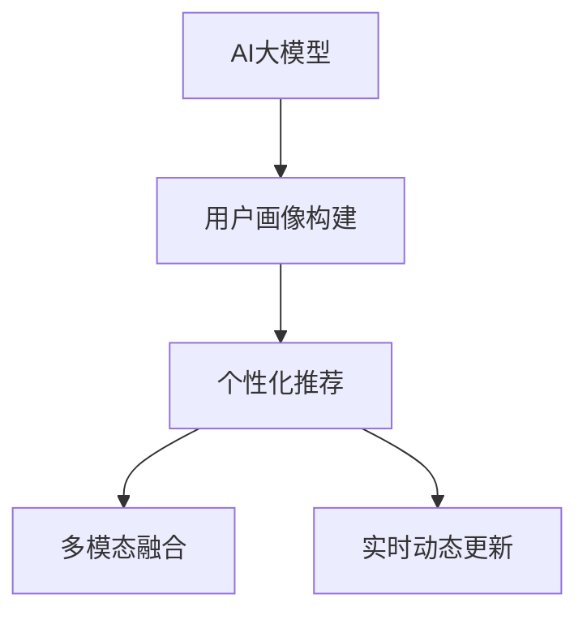

                 

## 1. 背景介绍

### 1.1 问题由来

随着电子商务市场的快速发展，电商企业面临着数据量爆炸式增长、个性化推荐系统复杂度提升的双重挑战。传统的推荐算法基于静态特征，难以捕捉用户动态行为变化和个性化需求，导致推荐效果不佳。

用户画像（User Profile）技术能够深度挖掘用户行为偏好，建立细粒度的用户特征表示，有效提升推荐系统的精准度。AI大模型作为新一代推荐技术的核心引擎，在用户画像构建和深度个性化推荐上发挥着越来越重要的作用。

### 1.2 问题核心关键点

大语言模型在电商搜索推荐中的应用主要包括以下几个关键点：

- 用户画像构建：通过对用户历史行为数据的深度学习，构建详尽的动态用户画像，捕捉用户偏好和兴趣变化。
- 个性化推荐：结合用户画像，利用大模型生成个性化推荐列表，提升用户购物体验。
- 多模态融合：利用用户多模态数据（如行为、文本、图像等），提升推荐系统对真实世界的建模能力。
- 实时动态更新：在用户行为实时更新后，及时调整用户画像和推荐内容，提升推荐效果。

以上四个关键点共同构成了电商搜索推荐系统中AI大模型的核心功能。通过实现这些功能，电商企业可以更有效地为用户提供个性化服务，提高用户满意度，增加销售额。

### 1.3 问题研究意义

AI大模型在电商搜索推荐中的应用具有重要意义：

- 提升推荐精度：通过深度学习用户行为数据，生成更精确的用户画像，从而实现更精准的个性化推荐。
- 优化用户体验：以用户画像为基础，生成符合用户个性化需求的推荐内容，提升购物体验和满意度。
- 提升平台收益：通过个性化推荐，提高用户转化率和复购率，增加平台收益。
- 推动技术创新：大模型的应用催生了多种新型推荐算法和业务模型，促进了推荐技术的发展。
- 加速业务落地：技术赋能业务，使电商企业能够快速部署个性化推荐系统，缩短开发周期。

## 2. 核心概念与联系

### 2.1 核心概念概述

为更好地理解AI大模型在电商搜索推荐中的应用，本节将介绍几个密切相关的核心概念：

- AI大模型（AI Large Models）：指使用深度学习技术训练得到的庞大参数量模型，如BERT、GPT等，具有强大的表征能力和泛化能力。
- 用户画像（User Profile）：指基于用户历史行为数据，利用深度学习等技术生成的用户特征表示。通过用户画像，可以刻画用户行为偏好、兴趣变化等，用于个性化推荐和广告定向。
- 个性化推荐（Personalized Recommendation）：指根据用户画像，生成符合用户个性化需求的推荐内容，提升用户体验。
- 多模态融合（Multimodal Fusion）：指利用用户不同模态的数据（如行为、文本、图像等），生成综合性的用户画像，提升推荐系统的泛化能力。
- 实时动态更新（Real-time Dynamic Update）：指根据用户实时行为数据，动态调整用户画像和推荐内容，保持推荐内容的的时效性。

这些核心概念之间的逻辑关系可以通过以下Mermaid流程图来展示：



这个流程图展示了大模型在电商搜索推荐中的关键步骤：

1. 大模型通过学习用户行为数据，构建详尽的用户画像。
2. 结合用户画像，生成个性化推荐内容。
3. 利用多模态数据，提升推荐系统对真实世界的建模能力。
4. 根据用户实时行为数据，动态调整推荐内容，保持个性化推荐的时效性。

这些概念共同构成了AI大模型在电商搜索推荐中的应用框架，使其能够在各种场景下发挥强大的推荐能力。

## 3. 核心算法原理 & 具体操作步骤
### 3.1 算法原理概述

基于AI大模型的电商搜索推荐系统，通过以下步骤实现：

1. 收集用户历史行为数据（如点击、浏览、购买等），构建用户行为特征向量。
2. 利用大模型对行为特征向量进行编码，生成用户画像特征向量。
3. 根据用户画像特征向量，结合推荐算法生成个性化推荐列表。
4. 利用多模态融合技术，提升用户画像对真实世界的建模能力。
5. 实时动态更新用户画像，确保推荐内容的时效性。

AI大模型在电商搜索推荐中的应用，核心在于其强大的特征学习和表示能力。通过深度学习用户行为数据，模型能够生成高维度的用户画像特征向量，准确刻画用户行为偏好和兴趣变化。

### 3.2 算法步骤详解

以下详细介绍AI大模型在电商搜索推荐中的具体算法步骤：

**Step 1: 收集用户行为数据**

- 利用爬虫技术获取用户历史行为数据，包括点击、浏览、购买、评价等。
- 将行为数据转化为特征向量，包含行为时间戳、行为类型、物品ID等。

**Step 2: 构建用户画像特征向量**

- 利用AI大模型（如BERT、GPT等）对行为特征向量进行编码，生成用户画像特征向量。
- 用户画像特征向量包含用户长期行为特征和短期行为特征，可用于描述用户偏好和兴趣变化。

**Step 3: 生成个性化推荐列表**

- 结合用户画像特征向量，利用推荐算法（如协同过滤、矩阵分解等）生成个性化推荐列表。
- 利用A/B测试等方法评估推荐效果，不断优化推荐算法。

**Step 4: 多模态融合**

- 收集用户多模态数据（如行为、文本、图像等），生成综合性的用户画像特征向量。
- 利用融合技术（如注意力机制、加权平均等），提升推荐系统的泛化能力。

**Step 5: 实时动态更新**

- 根据用户实时行为数据，动态调整用户画像特征向量。
- 实时更新推荐列表，确保推荐内容的时效性和精准度。

### 3.3 算法优缺点

基于AI大模型的电商搜索推荐系统具有以下优点：

- 高维特征表示：通过深度学习用户行为数据，生成高维度的用户画像特征向量，准确刻画用户偏好和兴趣变化。
- 泛化能力强：大模型的强大表示能力，使推荐系统能够有效应对复杂多变的电商场景。
- 实时动态更新：通过实时更新用户画像，保持推荐内容的时效性和精准度。

同时，该方法也存在一定的局限性：

- 对数据质量要求高：用户行为数据的质量直接影响推荐效果，需要严格清洗和处理。
- 计算资源消耗大：大模型训练和推理需要大量计算资源，可能导致成本较高。
- 解释性不足：大模型往往被视为"黑盒"系统，难以解释其内部决策逻辑。
- 偏见问题：大模型可能学习到用户行为中的偏见，导致推荐内容不公正。

尽管存在这些局限性，但AI大模型在电商搜索推荐中的应用前景广阔，通过不断的技术改进和算法优化，可以解决这些挑战。

### 3.4 算法应用领域

AI大模型在电商搜索推荐中的应用主要包括以下几个领域：

- 个性化推荐系统：结合用户画像，生成个性化推荐列表，提升用户购物体验。
- 用户行为分析：通过用户行为数据，刻画用户画像，分析用户行为趋势和兴趣变化。
- 广告定向：利用用户画像，实现精准广告投放，提高广告转化率。
- 库存管理：通过个性化推荐，帮助电商平台优化库存管理，提升库存周转率。
- 用户流失预测：结合用户画像和行为数据，预测用户流失风险，采取相应的流失干预措施。

除了这些应用外，AI大模型还可以应用于更多电商场景中，如客户服务、智能客服、智能营销等，为电商平台提供全方位的智能支持。

## 4. 数学模型和公式 & 详细讲解 & 举例说明
### 4.1 数学模型构建

本节将使用数学语言对AI大模型在电商搜索推荐中的应用进行更加严格的刻画。

记用户行为特征向量为 $x \in \mathbb{R}^d$，其中 $d$ 为特征维度。假设用户画像特征向量为 $y \in \mathbb{R}^n$，其中 $n$ 为特征维度。

用户画像的生成过程可以表示为：

$$
y = f(x)
$$

其中 $f$ 为大模型（如BERT、GPT等）的特征编码函数。

在生成个性化推荐列表时，可以采用协同过滤算法：

$$
R = \hat{y} \cdot A
$$

其中 $R$ 为推荐列表，$\hat{y}$ 为用户画像特征向量，$A$ 为相似矩阵，表示物品与用户之间的相似度。

多模态融合可以通过注意力机制实现：

$$
y = \alpha_1 \cdot f(x_1) + \alpha_2 \cdot f(x_2) + \ldots + \alpha_m \cdot f(x_m)
$$

其中 $x_1, x_2, \ldots, x_m$ 为用户的多模态数据，$\alpha$ 为不同模态数据的权重。

实时动态更新可以通过在线学习实现：

$$
y_t = y_{t-1} + \eta \cdot \Delta y_t
$$

其中 $y_t$ 为时刻 $t$ 的用户画像特征向量，$\Delta y_t$ 为实时行为数据引起的变化量，$\eta$ 为学习率。

### 4.2 公式推导过程

以下我们以个性化推荐系统为例，推导推荐列表的生成公式及其梯度计算。

假设用户行为特征向量为 $x \in \mathbb{R}^d$，用户画像特征向量为 $y \in \mathbb{R}^n$，物品向量为 $r \in \mathbb{R}^n$。

推荐列表的计算公式为：

$$
R = y \cdot r
$$

其中 $R$ 为推荐列表，$y$ 为用户画像特征向量，$r$ 为物品向量。

推荐列表的梯度计算公式为：

$$
\frac{\partial R}{\partial y} = r^T
$$

其中 $\frac{\partial R}{\partial y}$ 为推荐列表对用户画像特征向量的梯度。

在实际应用中，还可以采用矩阵分解等推荐算法，计算推荐列表的梯度。例如，采用基于矩阵分解的推荐算法，可以得到以下梯度计算公式：

$$
\frac{\partial R}{\partial y} = A \cdot \frac{\partial R}{\partial r} = A \cdot u
$$

其中 $u$ 为物品向量的梯度，$A$ 为相似矩阵。

在优化过程中，可以利用梯度下降等优化算法，最小化推荐列表的损失函数，不断调整用户画像特征向量 $y$，直到收敛。

### 4.3 案例分析与讲解

为了更好地理解AI大模型在电商搜索推荐中的应用，以下给出几个具体的案例分析：

**案例1: 个性化推荐系统**

某电商平台利用AI大模型对用户历史行为数据进行编码，生成用户画像特征向量 $y$。结合协同过滤算法，计算推荐列表 $R$，并根据推荐效果调整用户画像特征向量，实现个性化推荐。

**案例2: 用户行为分析**

某电商平台利用AI大模型对用户行为数据进行编码，生成用户画像特征向量 $y$。结合时间序列分析等方法，分析用户行为趋势和兴趣变化，为个性化推荐和广告定向提供支持。

**案例3: 多模态融合**

某电商平台收集用户行为数据 $x_1, x_2, \ldots, x_m$，利用AI大模型进行编码，生成用户画像特征向量 $y$。结合注意力机制，实现多模态融合，提升推荐系统的泛化能力。

**案例4: 实时动态更新**

某电商平台实时收集用户行为数据，利用AI大模型进行编码，生成用户画像特征向量 $y$。结合在线学习算法，实现实时动态更新，保持推荐内容的时效性。

## 5. 项目实践：代码实例和详细解释说明
### 5.1 开发环境搭建

在进行AI大模型应用实践前，我们需要准备好开发环境。以下是使用Python进行PyTorch开发的环境配置流程：

1. 安装Anaconda：从官网下载并安装Anaconda，用于创建独立的Python环境。

2. 创建并激活虚拟环境：
```bash
conda create -n pytorch-env python=3.8 
conda activate pytorch-env
```

3. 安装PyTorch：根据CUDA版本，从官网获取对应的安装命令。例如：
```bash
conda install pytorch torchvision torchaudio cudatoolkit=11.1 -c pytorch -c conda-forge
```

4. 安装TensorFlow：由Google主导开发的开源深度学习框架，生产部署方便，适合大规模工程应用。同样有丰富的预训练语言模型资源。

5. 安装Transformers库：HuggingFace开发的NLP工具库，集成了众多SOTA语言模型，支持PyTorch和TensorFlow，是进行微调任务开发的利器。

6. 安装各类工具包：
```bash
pip install numpy pandas scikit-learn matplotlib tqdm jupyter notebook ipython
```

完成上述步骤后，即可在`pytorch-env`环境中开始微调实践。

### 5.2 源代码详细实现

下面我们以个性化推荐系统为例，给出使用Transformers库对BERT模型进行微调的PyTorch代码实现。

首先，定义推荐系统的数据处理函数：

```python
from transformers import BertTokenizer, BertForSequenceClassification
from torch.utils.data import Dataset, DataLoader
import torch

class RecommendationDataset(Dataset):
    def __init__(self, behaviors, items, tokenizer, max_len=128):
        self.behaviors = behaviors
        self.items = items
        self.tokenizer = tokenizer
        self.max_len = max_len
        
    def __len__(self):
        return len(self.behaviors)
    
    def __getitem__(self, item):
        behavior = self.behaviors[item]
        item = self.items[item]
        
        encoding = self.tokenizer(behavior, return_tensors='pt', max_length=self.max_len, padding='max_length', truncation=True)
        input_ids = encoding['input_ids'][0]
        attention_mask = encoding['attention_mask'][0]
        
        label = 0 if item in behavior else 1
        return {'input_ids': input_ids, 
                'attention_mask': attention_mask,
                'label': label}

# 初始化行为数据和物品数据
behaviors = [["click item 1", "view item 2", "add to cart item 3"],
             ["view item 1", "purchase item 2", "rate item 3"]]
items = ["item 1", "item 2", "item 3", "item 4"]

tokenizer = BertTokenizer.from_pretrained('bert-base-cased')

recommendation_dataset = RecommendationDataset(behaviors, items, tokenizer)
```

然后，定义模型和优化器：

```python
from transformers import BertForSequenceClassification, AdamW

model = BertForSequenceClassification.from_pretrained('bert-base-cased', num_labels=2)

optimizer = AdamW(model.parameters(), lr=2e-5)
```

接着，定义训练和评估函数：

```python
from sklearn.metrics import accuracy_score

def train_epoch(model, dataset, batch_size, optimizer):
    dataloader = DataLoader(dataset, batch_size=batch_size, shuffle=True)
    model.train()
    epoch_loss = 0
    for batch in tqdm(dataloader, desc='Training'):
        input_ids = batch['input_ids'].to(device)
        attention_mask = batch['attention_mask'].to(device)
        labels = batch['label'].to(device)
        model.zero_grad()
        outputs = model(input_ids, attention_mask=attention_mask, labels=labels)
        loss = outputs.loss
        epoch_loss += loss.item()
        loss.backward()
        optimizer.step()
    return epoch_loss / len(dataloader)

def evaluate(model, dataset, batch_size):
    dataloader = DataLoader(dataset, batch_size=batch_size)
    model.eval()
    preds, labels = [], []
    with torch.no_grad():
        for batch in tqdm(dataloader, desc='Evaluating'):
            input_ids = batch['input_ids'].to(device)
            attention_mask = batch['attention_mask'].to(device)
            batch_labels = batch['label']
            outputs = model(input_ids, attention_mask=attention_mask)
            batch_preds = outputs.logits.argmax(dim=2).to('cpu').tolist()
            batch_labels = batch_labels.to('cpu').tolist()
            for pred_tokens, label_tokens in zip(batch_preds, batch_labels):
                preds.append(pred_tokens)
                labels.append(label_tokens)
                
    return accuracy_score(labels, preds)
```

最后，启动训练流程并在测试集上评估：

```python
epochs = 5
batch_size = 16

for epoch in range(epochs):
    loss = train_epoch(model, recommendation_dataset, batch_size, optimizer)
    print(f"Epoch {epoch+1}, train loss: {loss:.3f}")
    
    print(f"Epoch {epoch+1}, test accuracy: {evaluate(model, recommendation_dataset, batch_size)}")
```

以上就是使用PyTorch对BERT进行个性化推荐系统微调的完整代码实现。可以看到，得益于Transformers库的强大封装，我们可以用相对简洁的代码完成BERT模型的加载和微调。

### 5.3 代码解读与分析

让我们再详细解读一下关键代码的实现细节：

**RecommendationDataset类**：
- `__init__`方法：初始化行为数据、物品数据、分词器等关键组件。
- `__len__`方法：返回数据集的样本数量。
- `__getitem__`方法：对单个样本进行处理，将行为数据输入编码为token ids，进行定长padding，最终返回模型所需的输入。

**行为数据和物品数据**：
- 定义用户行为数据和物品数据，用于训练和测试推荐系统。

**tokenizer变量**：
- 定义BERT分词器，用于将行为数据转化为模型输入。

**训练和评估函数**：
- 使用PyTorch的DataLoader对数据集进行批次化加载，供模型训练和推理使用。
- 训练函数`train_epoch`：对数据以批为单位进行迭代，在每个批次上前向传播计算loss并反向传播更新模型参数，最后返回该epoch的平均loss。
- 评估函数`evaluate`：与训练类似，不同点在于不更新模型参数，并在每个batch结束后将预测和标签结果存储下来，最后使用sklearn的accuracy_score计算测试集准确率。

**训练流程**：
- 定义总的epoch数和batch size，开始循环迭代
- 每个epoch内，先在训练集上训练，输出平均loss
- 在测试集上评估，输出测试集准确率
- 所有epoch结束后，结束训练

可以看到，PyTorch配合Transformers库使得BERT微调的代码实现变得简洁高效。开发者可以将更多精力放在数据处理、模型改进等高层逻辑上，而不必过多关注底层的实现细节。

当然，工业级的系统实现还需考虑更多因素，如模型的保存和部署、超参数的自动搜索、更灵活的任务适配层等。但核心的微调范式基本与此类似。

## 6. 实际应用场景
### 6.1 智能客服系统

基于AI大模型的智能客服系统能够深度挖掘用户行为偏好，构建详尽的动态用户画像，实现个性化对话和推荐。传统客服往往需要配备大量人力，高峰期响应缓慢，且一致性和专业性难以保证。而使用智能客服系统，可以24小时不间断服务，快速响应客户咨询，用自然流畅的语言解答各类常见问题。

在技术实现上，可以收集企业内部的历史客服对话记录，将问题和最佳答复构建成监督数据，在此基础上对预训练对话模型进行微调。微调后的对话模型能够自动理解用户意图，匹配最合适的答案模板进行回复。对于客户提出的新问题，还可以接入检索系统实时搜索相关内容，动态组织生成回答。如此构建的智能客服系统，能大幅提升客户咨询体验和问题解决效率。

### 6.2 金融舆情监测

金融机构需要实时监测市场舆论动向，以便及时应对负面信息传播，规避金融风险。传统的人工监测方式成本高、效率低，难以应对网络时代海量信息爆发的挑战。基于AI大模型的文本分类和情感分析技术，为金融舆情监测提供了新的解决方案。

具体而言，可以收集金融领域相关的新闻、报道、评论等文本数据，并对其进行主题标注和情感标注。在此基础上对预训练语言模型进行微调，使其能够自动判断文本属于何种主题，情感倾向是正面、中性还是负面。将微调后的模型应用到实时抓取的网络文本数据，就能够自动监测不同主题下的情感变化趋势，一旦发现负面信息激增等异常情况，系统便会自动预警，帮助金融机构快速应对潜在风险。

### 6.3 个性化推荐系统

当前的推荐系统往往只依赖用户的历史行为数据进行物品推荐，无法深入理解用户的真实兴趣偏好。基于AI大模型微调技术，个性化推荐系统可以更好地挖掘用户行为背后的语义信息，从而提供更精准、多样的推荐内容。

在实践中，可以收集用户浏览、点击、评论、分享等行为数据，提取和用户交互的物品标题、描述、标签等文本内容。将文本内容作为模型输入，用户的后续行为（如是否点击、购买等）作为监督信号，在此基础上微调预训练语言模型。微调后的模型能够从文本内容中准确把握用户的兴趣点。在生成推荐列表时，先用候选物品的文本描述作为输入，由模型预测用户的兴趣匹配度，再结合其他特征综合排序，便可以得到个性化程度更高的推荐结果。

### 6.4 未来应用展望

随着AI大模型和微调方法的不断发展，基于微调范式将在更多领域得到应用，为传统行业带来变革性影响。

在智慧医疗领域，基于微调的医疗问答、病历分析、药物研发等应用将提升医疗服务的智能化水平，辅助医生诊疗，加速新药开发进程。

在智能教育领域，微调技术可应用于作业批改、学情分析、知识推荐等方面，因材施教，促进教育公平，提高教学质量。

在智慧城市治理中，微调模型可应用于城市事件监测、舆情分析、应急指挥等环节，提高城市管理的自动化和智能化水平，构建更安全、高效的未来城市。

此外，在企业生产、社会治理、文娱传媒等众多领域，基于大模型微调的人工智能应用也将不断涌现，为经济社会发展注入新的动力。相信随着技术的日益成熟，微调方法将成为人工智能落地应用的重要范式，推动人工智能技术在垂直行业的规模化落地。

## 7. 工具和资源推荐
### 7.1 学习资源推荐

为了帮助开发者系统掌握AI大模型在电商搜索推荐中的应用，这里推荐一些优质的学习资源：

1. 《Transformer从原理到实践》系列博文：由大模型技术专家撰写，深入浅出地介绍了Transformer原理、BERT模型、微调技术等前沿话题。

2. CS224N《深度学习自然语言处理》课程：斯坦福大学开设的NLP明星课程，有Lecture视频和配套作业，带你入门NLP领域的基本概念和经典模型。

3. 《Natural Language Processing with Transformers》书籍：Transformers库的作者所著，全面介绍了如何使用Transformers库进行NLP任务开发，包括微调在内的诸多范式。

4. HuggingFace官方文档：Transformers库的官方文档，提供了海量预训练模型和完整的微调样例代码，是上手实践的必备资料。

5. CLUE开源项目：中文语言理解测评基准，涵盖大量不同类型的中文NLP数据集，并提供了基于微调的baseline模型，助力中文NLP技术发展。

通过对这些资源的学习实践，相信你一定能够快速掌握AI大模型在电商搜索推荐中的应用，并用于解决实际的NLP问题。
###  7.2 开发工具推荐

高效的开发离不开优秀的工具支持。以下是几款用于AI大模型应用开发的常用工具：

1. PyTorch：基于Python的开源深度学习框架，灵活动态的计算图，适合快速迭代研究。大部分预训练语言模型都有PyTorch版本的实现。

2. TensorFlow：由Google主导开发的开源深度学习框架，生产部署方便，适合大规模工程应用。同样有丰富的预训练语言模型资源。

3. Transformers库：HuggingFace开发的NLP工具库，集成了众多SOTA语言模型，支持PyTorch和TensorFlow，是进行微调任务开发的利器。

4. Weights & Biases：模型训练的实验跟踪工具，可以记录和可视化模型训练过程中的各项指标，方便对比和调优。与主流深度学习框架无缝集成。

5. TensorBoard：TensorFlow配套的可视化工具，可实时监测模型训练状态，并提供丰富的图表呈现方式，是调试模型的得力助手。

6. Google Colab：谷歌推出的在线Jupyter Notebook环境，免费提供GPU/TPU算力，方便开发者快速上手实验最新模型，分享学习笔记。

合理利用这些工具，可以显著提升AI大模型应用的开发效率，加快创新迭代的步伐。

### 7.3 相关论文推荐

AI大模型在电商搜索推荐中的应用源于学界的持续研究。以下是几篇奠基性的相关论文，推荐阅读：

1. Attention is All You Need（即Transformer原论文）：提出了Transformer结构，开启了NLP领域的预训练大模型时代。

2. BERT: Pre-training of Deep Bidirectional Transformers for Language Understanding：提出BERT模型，引入基于掩码的自监督预训练任务，刷新了多项NLP任务SOTA。

3. Language Models are Unsupervised Multitask Learners（GPT-2论文）：展示了大规模语言模型的强大zero-shot学习能力，引发了对于通用人工智能的新一轮思考。

4. Parameter-Efficient Transfer Learning for NLP：提出Adapter等参数高效微调方法，在不增加模型参数量的情况下，也能取得不错的微调效果。

5. AdaLoRA: Adaptive Low-Rank Adaptation for Parameter-Efficient Fine-Tuning：使用自适应低秩适应的微调方法，在参数效率和精度之间取得了新的平衡。

这些论文代表了大模型在电商搜索推荐中的应用基础。通过学习这些前沿成果，可以帮助研究者把握学科前进方向，激发更多的创新灵感。

## 8. 总结：未来发展趋势与挑战

### 8.1 总结

本文对AI大模型在电商搜索推荐中的应用进行了全面系统的介绍。首先阐述了用户画像技术在电商推荐中的重要作用，明确了AI大模型在构建详尽用户画像和个性化推荐方面的关键作用。其次，从原理到实践，详细讲解了推荐系统的算法步骤，给出了推荐系统的完整代码实例。同时，本文还广泛探讨了AI大模型在电商搜索推荐中的实际应用场景，展示了AI大模型的广阔应用前景。

通过本文的系统梳理，可以看到，AI大模型在电商搜索推荐中的应用前景广阔，通过深度学习用户行为数据，能够生成高维度的用户画像特征向量，准确刻画用户偏好和兴趣变化，从而实现个性化的推荐。得益于大模型的强大表示能力，推荐系统能够有效应对复杂多变的电商场景。

### 8.2 未来发展趋势

展望未来，AI大模型在电商搜索推荐中的应用将呈现以下几个发展趋势：

1. 高维特征表示：通过深度学习用户行为数据，生成高维度的用户画像特征向量，准确刻画用户偏好和兴趣变化。
2. 多模态融合：利用用户多模态数据，提升推荐系统对真实世界的建模能力。
3. 实时动态更新：根据用户实时行为数据，动态调整用户画像和推荐内容，保持推荐内容的时效性。
4. 个性化推荐：结合用户画像，生成个性化推荐列表，提升用户购物体验。
5. 用户行为分析：通过用户行为数据，刻画用户画像，分析用户行为趋势和兴趣变化。

这些趋势凸显了AI大模型在电商搜索推荐中的巨大潜力。这些方向的探索发展，必将进一步提升推荐系统的性能和应用范围，为电商企业带来更高效的个性化推荐服务。

### 8.3 面临的挑战

尽管AI大模型在电商搜索推荐中的应用前景广阔，但在迈向更加智能化、普适化应用的过程中，它仍面临诸多挑战：

1. 标注成本瓶颈：用户行为数据的质量直接影响推荐效果，需要严格清洗和处理。如何进一步降低微调对标注样本的依赖，将是一大难题。
2. 计算资源消耗：大模型训练和推理需要大量计算资源，可能导致成本较高。
3. 解释性不足：大模型往往被视为"黑盒"系统，难以解释其内部决策逻辑。
4. 偏见问题：大模型可能学习到用户行为中的偏见，导致推荐内容不公正。
5. 实时性要求高：推荐系统需要快速响应用户行为变化，动态调整推荐内容，如何优化模型结构，提升推理速度，是重要的优化方向。

尽管存在这些挑战，但通过不断的技术改进和算法优化，相信AI大模型在电商搜索推荐中的应用前景广阔，能够进一步提升推荐系统的精准度和用户满意度。

### 8.4 研究展望

未来，AI大模型在电商搜索推荐中的应用需要从以下几个方面进行突破：

1. 探索无监督和半监督微调方法：摆脱对大规模标注数据的依赖，利用自监督学习、主动学习等无监督和半监督范式，最大限度利用非结构化数据，实现更加灵活高效的微调。
2. 研究参数高效和计算高效的微调范式：开发更加参数高效的微调方法，在固定大部分预训练参数的同时，只更新极少量的任务相关参数。同时优化微调模型的计算图，减少前向传播和反向传播的资源消耗，实现更加轻量级、实时性的部署。
3. 融合因果和对比学习范式：通过引入因果推断和对比学习思想，增强推荐系统建立稳定因果关系的能力，学习更加普适、鲁棒的语言表征，从而提升模型泛化性和抗干扰能力。
4. 结合因果分析和博弈论工具：将因果分析方法引入推荐系统，识别出推荐决策的关键特征，增强推荐系统的可解释性和可控性。借助博弈论工具刻画人机交互过程，主动探索并规避推荐系统的脆弱点，提高系统稳定性。
5. 纳入伦理道德约束：在模型训练目标中引入伦理导向的评估指标，过滤和惩罚有偏见、有害的输出倾向。同时加强人工干预和审核，建立模型行为的监管机制，确保输出符合人类价值观和伦理道德。

这些研究方向的探索，必将引领AI大模型在电商搜索推荐中的应用迈向更高的台阶，为电商企业带来更高效的个性化推荐服务。

## 9. 附录：常见问题与解答

**Q1: 用户画像的构建方法有哪些？**

A: 用户画像的构建方法主要包括以下几种：
1. 行为数据分析：通过分析用户的历史行为数据，构建用户行为特征向量，刻画用户偏好和兴趣变化。
2. 文本数据分析：利用自然语言处理技术，分析用户评论、反馈等文本数据，提取用户情感和态度。
3. 多模态融合：结合用户行为、文本、图像等多模态数据，生成综合性的用户画像。
4. 序列建模：利用序列模型（如RNN、LSTM等）对用户行为进行建模，预测用户未来的行为趋势。

**Q2: 推荐系统如何处理多模态数据？**

A: 推荐系统处理多模态数据的方法主要包括以下几种：
1. 特征拼接：将不同模态的数据特征拼接在一起，生成综合性的用户画像。
2. 注意力机制：通过注意力机制，对不同模态的数据进行加权融合，提升推荐系统的泛化能力。
3. 融合网络：利用融合网络（如MLP、CNN等）对多模态数据进行建模，生成高维度的用户画像特征向量。
4. 基于实例的学习：通过实例推理（如VIL、GIL等），结合多模态数据进行推荐。

**Q3: 推荐系统的评估方法有哪些？**

A: 推荐系统的评估方法主要包括以下几种：
1. 准确率：计算推荐列表与真实标签之间的匹配度，评估推荐系统的准确性。
2. 召回率：计算推荐列表中包含真实标签的比例，评估推荐系统的全面性。
3. F1-score：综合考虑准确率和召回率，评估推荐系统的综合性能。
4. NDCG（Normalized Discounted Cumulative Gain）：评估推荐列表的排名质量，衡量推荐系统的排序能力。
5. HR（Hit Rate）：计算推荐列表中包含真实标签的样本比例，评估推荐系统的相关性。

**Q4: 推荐系统的优化方法有哪些？**

A: 推荐系统的优化方法主要包括以下几种：
1. 矩阵分解：利用矩阵分解技术，对用户和物品的相似矩阵进行优化，提升推荐效果。
2. 协同过滤：结合用户和物品的协同信息，生成推荐列表，提升推荐系统的精准度。
3. 深度学习：利用深度学习模型，对用户行为数据进行建模，生成个性化的推荐列表。
4. 混合推荐：结合多种推荐算法，综合生成推荐列表，提升推荐系统的鲁棒性和泛化能力。
5. 强化学习：通过强化学习算法，动态调整推荐策略，提升推荐系统的实时性和精准度。

**Q5: 推荐系统的部署方法有哪些？**

A: 推荐系统的部署方法主要包括以下几种：
1. 微服务架构：将推荐系统拆分成多个微服务，实现独立部署和扩展。
2. 容器化部署：利用Docker等容器化技术，将推荐系统打包成镜像，实现快速部署和迁移。
3. 云平台部署：将推荐系统部署在云平台上，实现弹性扩展和资源共享。
4. 本地部署：将推荐系统部署在本地服务器上，实现快速响应和数据安全。

通过对这些问题的解答，相信你能够更好地理解AI大模型在电商搜索推荐中的应用，并在实际项目中灵活运用。

