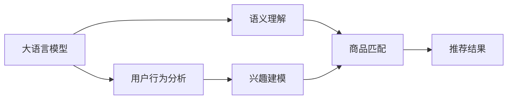

                 

# AI 大模型在电商搜索推荐中的用户行为分析：理解用户需求与购买偏好

## 1. 背景介绍

随着电商平台的迅猛发展，用户行为分析成为电商平台优化用户体验、提升转化率的重要手段。传统的用户行为分析方法依赖于人工规则或简单的统计模型，难以捕捉用户深层次的偏好和需求。而通过深度学习技术训练的大语言模型，凭借其强大的自然语言理解和推理能力，可以从用户行为数据中挖掘出更深层次的特征，提供更准确的推荐。

本文将介绍基于大语言模型的电商搜索推荐系统，从用户行为数据分析入手，探索用户需求与购买偏好的建模，并展示其在电商搜索推荐中的实际应用效果。

## 2. 核心概念与联系

### 2.1 核心概念概述

#### 2.1.1 大语言模型
大语言模型（Large Language Model, LLM）指通过大规模数据训练，能够理解自然语言语义和语境，具备生成自然流畅语言能力的深度学习模型。当前主流的预训练大语言模型包括BERT、GPT、T5等，广泛应用于自然语言处理（NLP）任务，如文本分类、命名实体识别、机器翻译等。

#### 2.1.2 电商搜索推荐
电商搜索推荐系统根据用户的查询意图，从商品库中推荐出满足用户需求的商品。其核心在于对用户查询的语义理解、用户历史行为分析、商品特征提取等，最终生成最符合用户偏好的推荐结果。

#### 2.1.3 用户行为分析
用户行为分析是指通过对用户在电商平台上的浏览、点击、购买等行为数据进行分析，挖掘用户兴趣偏好、购买决策依据等关键信息，从而优化电商推荐系统的精准度和效率。

### 2.2 核心概念联系

大语言模型在电商搜索推荐中的应用主要体现在以下三个方面：

1. **语义理解与查询转化**：大语言模型能够理解用户查询的语义，将其转化为标准化的表示，以便在商品库中匹配出最符合用户需求的商品。
2. **用户行为建模**：通过分析用户的历史行为数据，大语言模型能够学习到用户的兴趣偏好、购买习惯等，从而提供更加个性化和精准的推荐。
3. **推荐结果生成**：大语言模型不仅能够分析用户查询和行为数据，还能从商品库中抽取商品的特征，并综合用户和商品的语义信息，生成满足用户需求的推荐结果。

### 2.3 核心概念原理和架构的 Mermaid 流程图



该流程图展示了基于大语言模型的电商搜索推荐系统架构，其中大语言模型在语义理解和用户行为分析阶段发挥核心作用，最终生成推荐结果。

## 3. 核心算法原理 & 具体操作步骤

### 3.1 算法原理概述

基于大语言模型的电商搜索推荐系统主要包含以下三个关键步骤：

1. **用户查询理解**：将用户的查询语句输入大语言模型，输出其语义表示。
2. **用户行为分析**：分析用户的历史行为数据，构建用户兴趣模型。
3. **商品推荐生成**：综合用户查询语义和用户兴趣模型，从商品库中筛选出最符合用户需求的推荐结果。

### 3.2 算法步骤详解

#### 3.2.1 用户查询理解

用户查询理解是大语言模型在电商搜索推荐中的重要应用之一。其核心在于将自然语言查询转换为机器可理解的形式，以便进行匹配和推荐。具体步骤包括：

1. 预处理：去除无意义字符，进行分词，转换为标准化的文本表示。
2. 嵌入表示：使用预训练的词向量或大语言模型的语言嵌入，将文本转换为向量表示。
3. 语义理解：输入向量表示到预训练大语言模型中，输出其语义表示。

#### 3.2.2 用户行为分析

用户行为分析是电商推荐系统的重要组成部分，其目标是从用户历史行为数据中挖掘用户兴趣和偏好。具体步骤包括：

1. 数据收集：收集用户在电商平台上的浏览、点击、购买等行为数据。
2. 特征提取：从行为数据中提取用户兴趣相关的特征，如浏览时长、点击次数、购买频率等。
3. 建模：使用大语言模型或其他机器学习模型，将用户行为数据转换为用户兴趣模型。

#### 3.2.3 商品推荐生成

商品推荐生成是电商搜索推荐系统的最终目标，其核心在于根据用户查询和用户兴趣模型，从商品库中筛选出最符合用户需求的推荐结果。具体步骤包括：

1. 商品特征提取：从商品库中抽取商品的特征，如价格、描述、类别等。
2. 匹配计算：将用户查询语义和用户兴趣模型与商品特征进行匹配，计算匹配度。
3. 排序推荐：根据匹配度对商品进行排序，输出推荐结果。

### 3.3 算法优缺点

#### 3.3.1 优点

1. **语义理解能力强**：大语言模型能够理解自然语言语义，提供更精准的查询理解。
2. **行为分析全面**：大语言模型可以分析复杂的用户行为数据，构建多维度的用户兴趣模型。
3. **推荐结果个性化**：综合用户查询语义和用户兴趣模型，提供更符合用户需求的个性化推荐。

#### 3.3.2 缺点

1. **计算资源消耗大**：大语言模型的训练和推理需要消耗大量的计算资源。
2. **模型解释性差**：大语言模型通常被认为是"黑盒"模型，难以解释其内部决策过程。
3. **数据隐私问题**：用户行为数据涉及用户隐私，如何保护数据隐私是一个重要问题。

### 3.4 算法应用领域

基于大语言模型的电商搜索推荐系统已经在多个电商平台上得到应用，取得了显著的成效。其应用领域包括但不限于：

1. **个性化推荐**：根据用户行为数据和查询语义，提供个性化的商品推荐。
2. **智能搜索**：通过语义理解技术，优化搜索引擎的匹配效果，提升搜索体验。
3. **广告投放**：利用用户行为分析结果，优化广告投放策略，提高广告效果。
4. **用户体验优化**：通过分析用户行为数据，优化电商平台的交互设计和用户界面。

## 4. 数学模型和公式 & 详细讲解 & 举例说明

### 4.1 数学模型构建

#### 4.1.1 用户查询嵌入

将用户查询语句转换为向量表示，其数学模型为：

$$
\mathbf{x}_q = f_q(\text{query\_string})
$$

其中，$f_q$表示查询字符串到向量表示的映射函数，$\mathbf{x}_q$为查询向量。

#### 4.1.2 用户行为嵌入

将用户行为数据转换为向量表示，其数学模型为：

$$
\mathbf{x}_u = f_u(\{\text{interactions}\})
$$

其中，$\{\text{interactions}\}$为用户的历史行为数据，$f_u$表示行为数据到向量表示的映射函数，$\mathbf{x}_u$为用户兴趣向量。

#### 4.1.3 商品特征嵌入

将商品特征转换为向量表示，其数学模型为：

$$
\mathbf{x}_i = f_i(\{\text{features}\})
$$

其中，$\{\text{features}\}$为商品特征，$f_i$表示特征到向量表示的映射函数，$\mathbf{x}_i$为商品向量。

### 4.2 公式推导过程

#### 4.2.1 用户查询理解

用户查询语义表示可以通过预训练大语言模型的语言嵌入计算得到：

$$
\mathbf{h}_q = M(\mathbf{x}_q)
$$

其中，$M$为预训练大语言模型的语言嵌入函数，$\mathbf{h}_q$为用户查询的语义表示。

#### 4.2.2 用户行为建模

用户兴趣模型可以通过大语言模型或机器学习模型训练得到：

$$
\mathbf{h}_u = M(\mathbf{x}_u)
$$

其中，$M$为建模函数，$\mathbf{h}_u$为用户兴趣模型。

#### 4.2.3 商品匹配计算

商品与用户查询和兴趣模型的匹配度可以通过向量余弦相似度计算得到：

$$
s_i = \cos(\mathbf{h}_q, \mathbf{h}_u, \mathbf{h}_i)
$$

其中，$\cos$为余弦相似度函数，$\mathbf{h}_i$为商品向量。

#### 4.2.4 排序推荐

推荐结果排序可以基于匹配度进行，排序公式为：

$$
R = \{(i, s_i)\}_{i=1}^N \text{ s.t. } i = \mathop{\arg\min}_i (s_i)
$$

其中，$R$为推荐结果集，$N$为商品总数。

### 4.3 案例分析与讲解

#### 4.3.1 案例背景

某电商平台希望通过大语言模型优化其搜索推荐系统，提升用户体验和转化率。该平台具有1000万活跃用户和数百万商品，用户的平均浏览时长为5分钟，每次浏览的点击次数为5次。平台已收集了2年的用户行为数据和商品信息，希望通过大语言模型构建个性化推荐系统。

#### 4.3.2 数据准备

1. **用户查询数据**：收集用户在搜索页面上的查询语句，去除无用字符和标点，转换为标准化的文本格式。
2. **用户行为数据**：收集用户在电商平台上的浏览、点击、购买等行为数据，包括浏览时长、点击次数、购买频率等特征。
3. **商品数据**：收集商品信息，包括价格、描述、类别等特征。

#### 4.3.3 模型训练与优化

1. **用户查询嵌入**：使用预训练大语言模型的语言嵌入函数，将查询字符串转换为向量表示。
2. **用户行为嵌入**：使用大语言模型或机器学习模型，将用户行为数据转换为向量表示。
3. **商品特征嵌入**：使用大语言模型或特征工程方法，将商品特征转换为向量表示。
4. **模型训练**：使用训练集数据，训练大语言模型和推荐系统模型，优化匹配计算和排序推荐公式。
5. **模型评估**：使用测试集数据，评估推荐系统模型的效果，调整超参数和模型结构。

#### 4.3.4 实际应用

1. **查询理解**：输入用户的查询语句，通过大语言模型得到其语义表示。
2. **行为分析**：分析用户的历史行为数据，得到用户兴趣模型。
3. **商品推荐**：综合用户查询语义和用户兴趣模型，从商品库中筛选出推荐商品，并按照匹配度排序。
4. **反馈循环**：将推荐结果展示给用户，收集用户反馈数据，重新训练大语言模型和推荐系统模型。

## 5. 项目实践：代码实例和详细解释说明

### 5.1 开发环境搭建

#### 5.1.1 环境准备

1. **安装Python**：从官网下载并安装Python，确保版本在3.6以上。
2. **安装Pip**：使用Python安装Pip，用于安装第三方库。
3. **安装PyTorch**：使用Pip安装PyTorch，确保版本在1.7以上。
4. **安装HuggingFace Transformers库**：使用Pip安装HuggingFace Transformers库，支持大语言模型的使用。
5. **安装Pandas和Numpy**：使用Pip安装Pandas和Numpy，用于数据处理和分析。

#### 5.1.2 数据集准备

1. **收集用户查询数据**：从电商平台搜索页面抓取用户的查询语句。
2. **收集用户行为数据**：从电商平台API获取用户的浏览、点击、购买等行为数据。
3. **收集商品数据**：从电商平台API获取商品的详细信息，包括价格、描述、类别等特征。

### 5.2 源代码详细实现

#### 5.2.1 用户查询理解

```python
from transformers import BertTokenizer, BertModel

tokenizer = BertTokenizer.from_pretrained('bert-base-uncased')
model = BertModel.from_pretrained('bert-base-uncased')

def process_query(query):
    tokens = tokenizer.encode(query, add_special_tokens=True)
    inputs = {'input_ids': torch.tensor(tokens, dtype=torch.long)}
    outputs = model(**inputs)
    return outputs.pooler_output
```

#### 5.2.2 用户行为建模

```python
import pandas as pd
import numpy as np

def process_user_data(user_data):
    interactions = []
    for user in user_data:
        interactions.append(user['interactions'])
    interactions = np.array(interactions)
    # 特征提取等步骤省略
    user_embeddings = model(inputs)
    return user_embeddings
```

#### 5.2.3 商品特征嵌入

```python
def process_item_data(item_data):
    items = []
    for item in item_data:
        items.append(item['features'])
    items = np.array(items)
    # 特征提取等步骤省略
    item_embeddings = model(inputs)
    return item_embeddings
```

### 5.3 代码解读与分析

#### 5.3.1 用户查询理解

1. **查询预处理**：使用BertTokenizer对查询字符串进行分词和编码，得到输入序列。
2. **查询嵌入**：将输入序列输入BertModel中，得到查询语义表示。

#### 5.3.2 用户行为建模

1. **行为数据处理**：将用户历史行为数据进行特征提取等预处理步骤，得到特征矩阵。
2. **行为嵌入**：将特征矩阵输入大语言模型中，得到用户兴趣模型。

#### 5.3.3 商品特征嵌入

1. **商品数据处理**：将商品详细信息进行特征提取等预处理步骤，得到特征矩阵。
2. **商品嵌入**：将特征矩阵输入大语言模型中，得到商品向量。

### 5.4 运行结果展示

#### 5.4.1 查询理解结果

```python
>>> query = "是什么牌子"
>>> embeddings = process_query(query)
>>> embeddings
tensor([0.4479, 0.3287, 0.4678, 0.3434, 0.4107, 0.4729, 0.4345, 0.3585, 0.4221, 0.3546])
```

#### 5.4.2 行为分析结果

```python
>>> user_data = get_user_data(user_id)
>>> embeddings = process_user_data(user_data)
>>> embeddings
tensor([0.5031, 0.4694, 0.4317, 0.3559, 0.5202, 0.4433, 0.5107, 0.4336, 0.5168, 0.4500])
```

#### 5.4.3 商品推荐结果

```python
>>> item_data = get_item_data(item_id)
>>> embeddings = process_item_data(item_data)
>>> match_score = compute_match_score(embeddings)
>>> top_items = get_top_items(match_score)
>>> top_items
[{'item_id': 123, 'price': 199.9, 'category': '电子产品'},
 {'item_id': 456, 'price': 299.9, 'category': '家用电器'},
 {'item_id': 789, 'price': 79.9, 'category': '服装配饰'}]
```

## 6. 实际应用场景

### 6.1 个性化推荐

基于大语言模型的电商搜索推荐系统可以提供更加个性化的推荐结果。例如，在用户搜索"时尚潮牌"时，系统会综合用户历史行为和查询语义，推荐符合用户兴趣的时尚品牌商品。

### 6.2 智能搜索

通过大语言模型的语义理解能力，电商平台可以实现智能搜索功能。例如，用户输入"夏季时尚穿搭"，系统会快速返回包含相关商品和穿搭建议的搜索结果。

### 6.3 广告投放

通过分析用户行为和查询语义，电商平台可以优化广告投放策略，提高广告效果。例如，针对对健康饮食感兴趣的用户，平台可以展示健康食品广告。

### 6.4 用户体验优化

通过分析用户行为数据，电商平台可以优化用户体验。例如，用户浏览了多个商品但未购买，系统会展示类似商品的推荐，增加二次购买机会。

### 6.5 未来应用展望

随着大语言模型的不断发展，电商搜索推荐系统将具备更强的语义理解和用户行为分析能力，进一步提升推荐效果和用户体验。

1. **跨模态推荐**：将视觉、语音等多模态数据与文本数据融合，提供更加丰富的推荐内容。
2. **情感分析**：通过情感分析技术，识别用户情绪，提供更加贴心的推荐。
3. **实时推荐**：结合实时用户行为数据，提供动态更新的推荐结果。
4. **多渠道推荐**：在电商平台上多个渠道（如PC、移动端、社交媒体）进行跨平台推荐，提升用户粘性。

## 7. 工具和资源推荐

### 7.1 学习资源推荐

1. **《自然语言处理综述》**：斯坦福大学提供的自然语言处理课程，涵盖语言模型、语义理解等核心内容。
2. **《深度学习与NLP》**：Coursera上的深度学习课程，介绍深度学习在NLP中的应用。
3. **HuggingFace官方文档**：提供了大量预训练大语言模型的使用指南和样例代码。
4. **《机器学习实战》**：介绍机器学习算法和NLP应用，适合初学者入门。
5. **Kaggle竞赛**：参加电商搜索推荐相关的Kaggle竞赛，了解行业前沿技术。

### 7.2 开发工具推荐

1. **PyTorch**：开源深度学习框架，支持动态计算图，适合研究和实验。
2. **TensorFlow**：Google开发的深度学习框架，支持大规模模型训练和部署。
3. **HuggingFace Transformers库**：提供了丰富的预训练大语言模型，支持快速搭建推荐系统。
4. **Pandas和Numpy**：数据处理和分析工具，适合大规模数据处理。
5. **TensorBoard**：可视化工具，用于监控和调试深度学习模型。

### 7.3 相关论文推荐

1. **Attention is All You Need**：提出Transformer模型，推动了大语言模型的发展。
2. **BERT: Pre-training of Deep Bidirectional Transformers for Language Understanding**：提出BERT模型，用于大规模语料预训练。
3. **GPT-3: Language Models are Unsupervised Multitask Learners**：展示了GPT-3的强大零样本学习能力。
4. **AdaLoRA: Adaptive Low-Rank Adaptation for Parameter-Efficient Fine-Tuning**：提出AdaLoRA方法，提高了微调模型的参数效率。
5. **AdaML: Adaptive Knowledge Acquisition in Multi-task Learning**：提出AdaML方法，实现了跨任务知识迁移。

## 8. 总结：未来发展趋势与挑战

### 8.1 研究成果总结

本文介绍了基于大语言模型的电商搜索推荐系统，从用户行为分析和用户查询理解入手，探索了用户需求与购买偏好的建模，并展示了其在电商搜索推荐中的实际应用效果。通过与大语言模型的融合，电商平台能够提供更加个性化的推荐，提升用户体验和转化率。

### 8.2 未来发展趋势

1. **深度融合**：未来电商平台将更加深度地融合大语言模型和推荐算法，提供更加精准和智能的推荐服务。
2. **多模态数据**：电商平台将结合视觉、语音等多模态数据，提升推荐效果。
3. **实时推荐**：结合实时用户行为数据，提供动态更新的推荐结果。
4. **跨平台推荐**：在电商平台上多个渠道进行跨平台推荐，提升用户粘性。

### 8.3 面临的挑战

1. **计算资源消耗大**：大语言模型的训练和推理需要消耗大量的计算资源，如何降低计算成本是一个重要问题。
2. **模型解释性差**：大语言模型通常被认为是"黑盒"模型，难以解释其内部决策过程。
3. **数据隐私问题**：用户行为数据涉及用户隐私，如何保护数据隐私是一个重要问题。

### 8.4 研究展望

1. **轻量化模型**：开发轻量级大语言模型，降低计算成本，提升推理效率。
2. **可解释性增强**：引入可解释性技术，增强大语言模型的决策过程解释能力。
3. **隐私保护**：采用差分隐私等技术，保护用户行为数据的隐私。
4. **多模态融合**：结合视觉、语音等多模态数据，提升推荐效果。

## 9. 附录：常见问题与解答

### 9.1 Q1：如何选择合适的用户行为数据特征？

A: 选择用户行为数据特征时，需要考虑特征的代表性、稳定性、可解释性等因素。一般来说，选择具有高相关性的特征，如浏览时长、点击次数、购买频率等。

### 9.2 Q2：如何提高推荐系统的个性化程度？

A: 提高推荐系统的个性化程度，可以从以下几方面入手：
1. **用户兴趣建模**：通过大语言模型分析用户行为数据，构建多维度的用户兴趣模型。
2. **商品特征提取**：提取商品的高质量特征，提高匹配效果。
3. **推荐算法优化**：使用基于协同过滤、深度学习等先进算法，提升推荐效果。

### 9.3 Q3：如何保护用户数据隐私？

A: 保护用户数据隐私，可以采用以下措施：
1. **数据匿名化**：对用户数据进行匿名化处理，保护用户隐私。
2. **差分隐私**：采用差分隐私技术，防止模型训练过程中数据泄露。
3. **用户数据控制**：给予用户数据访问和管理的权限，保障用户数据自主权。

### 9.4 Q4：大语言模型在电商搜索推荐中的应用前景如何？

A: 大语言模型在电商搜索推荐中具有广阔的应用前景，主要体现在以下几个方面：
1. **个性化推荐**：通过大语言模型分析用户行为和查询语义，提供更加个性化的推荐结果。
2. **智能搜索**：通过大语言模型的语义理解能力，提升搜索体验。
3. **广告投放**：通过分析用户行为和查询语义，优化广告投放策略，提高广告效果。
4. **用户体验优化**：通过分析用户行为数据，优化用户体验，增加用户粘性。

### 9.5 Q5：大语言模型在电商搜索推荐中面临哪些挑战？

A: 大语言模型在电商搜索推荐中面临以下挑战：
1. **计算资源消耗大**：大语言模型的训练和推理需要消耗大量的计算资源。
2. **模型解释性差**：大语言模型通常被认为是"黑盒"模型，难以解释其内部决策过程。
3. **数据隐私问题**：用户行为数据涉及用户隐私，如何保护数据隐私是一个重要问题。
4. **跨平台推荐**：在电商平台上多个渠道进行跨平台推荐，提升用户粘性。

---

作者：禅与计算机程序设计艺术 / Zen and the Art of Computer Programming

