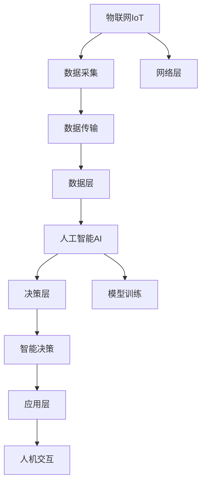

                 

# AIoT：人工智能与物联网的融合

## 1. 背景介绍

### 1.1 问题由来

随着信息技术的迅猛发展和互联网的广泛应用，物联网(IoT)和人工智能(AI)正迅速融合，催生了人工智能与物联网的深度融合（AIoT）。AIoT 结合了物联网的泛在连接特性和人工智能的感知、决策能力，为众多行业提供了智能化解决方案。当前，AIoT 的应用已经覆盖了智慧城市、智慧农业、智能家居、工业物联网等领域，展现出了巨大的市场潜力和应用前景。

### 1.2 问题核心关键点

AIoT 融合的核心在于通过智能化传感器、通信设备采集海量数据，再利用人工智能算法进行数据分析和决策，实现对物理世界的信息感知、数据建模和智能控制。其关键点包括：

- 数据采集：通过各类传感器（如温度、湿度、压力、声音、图像等）实现数据的泛在采集。
- 数据传输：利用无线网络技术（如5G、WiFi、蓝牙等）实现数据的可靠传输。
- 数据处理：应用人工智能算法（如机器学习、深度学习等）对采集数据进行建模和分析。
- 智能决策：根据数据处理结果，自动化地进行智能决策和控制。
- 人机交互：通过智能设备或APP实现与用户的交互，提升用户体验。

AIoT 旨在将物联网的物理世界和人工智能的虚拟世界有机融合，实现对复杂系统的智能化管理和控制。其核心价值在于通过人工智能的高级感知和决策能力，提升物联网系统的智能化水平，为用户提供更高效、智能的服务。

## 2. 核心概念与联系

### 2.1 核心概念概述

为更好地理解AIoT的融合原理，本节将介绍几个关键概念：

- 物联网（IoT）：指通过各种网络技术连接起来的物理设备和传感器，实现设备的智能化和互联互通。
- 人工智能（AI）：指通过计算机算法，使计算机具备感知、学习、推理等人类智能的能力，如机器学习、深度学习、自然语言处理等。
- 人工智能与物联网的融合（AIoT）：指将人工智能的感知、决策能力与物联网的连接、控制能力结合，实现对物理世界的高效管理和智能化控制。

- 感知层：包括各类传感器和通信设备，负责数据采集和传输。
- 网络层：通过互联网、无线网络等技术，实现数据的高效传输。
- 数据层：利用大数据技术对采集的数据进行存储、处理和分析。
- 决策层：应用人工智能算法进行数据建模和智能决策。
- 应用层：通过智能设备或APP实现与用户的交互，提供智能服务。

这些核心概念之间的逻辑关系可以通过以下Mermaid流程图来展示：



这个流程图展示了一系列从感知层到应用层的核心步骤：

1. 通过物联网设备和传感器采集数据。
2. 数据通过网络层进行传输。
3. 数据层利用大数据技术存储和处理数据。
4. 决策层应用人工智能算法对数据进行建模和决策。
5. 最终在应用层通过智能设备或APP实现与用户的交互。

这些概念和步骤共同构成了AIoT系统的基本框架，使得人工智能和物联网得以有机融合。

## 3. 核心算法原理 & 具体操作步骤

### 3.1 算法原理概述

AIoT融合的核心算法原理可以总结为以下几个步骤：

1. 数据采集：通过各类传感器（如温度、湿度、压力、声音、图像等）实现数据的泛在采集。
2. 数据传输：利用无线网络技术（如5G、WiFi、蓝牙等）实现数据的可靠传输。
3. 数据处理：利用人工智能算法（如机器学习、深度学习等）对采集数据进行建模和分析。
4. 智能决策：根据数据处理结果，自动化地进行智能决策和控制。
5. 人机交互：通过智能设备或APP实现与用户的交互，提升用户体验。

在每个步骤中，都涉及了多个核心算法和技术的融合，如传感器数据融合、分布式数据处理、实时数据流处理、深度学习算法等。

### 3.2 算法步骤详解

#### 数据采集

数据采集是AIoT融合的基础步骤，通过传感器实现对物理世界的实时监测和数据采集。传感器分为温度、湿度、压力、声音、图像等不同类型，能够采集各类环境参数，为后续的数据处理和智能决策提供原始数据。

具体实现时，可以采用以下方法：

1. **模拟数据采集**：在实验室环境下，通过模拟设备模拟各类传感器数据，如温度计、湿度计、压力传感器等。
2. **真实数据采集**：在实际应用场景中，通过真实设备采集各类环境参数数据。
3. **多传感器数据融合**：利用多传感器数据融合算法，实现对同一物理参数的多个传感器数据进行融合，提高数据准确性和可靠性。

#### 数据传输

数据传输是AIoT融合的重要环节，通过网络技术实现数据的可靠传输。目前常用的网络技术包括5G、WiFi、蓝牙等。

具体实现时，可以采用以下方法：

1. **5G网络传输**：利用5G网络的高带宽、低延迟特性，实现数据的实时传输和高效处理。
2. **WiFi传输**：利用WiFi技术实现设备的无线连接和数据传输，适用于中小规模的物联网应用。
3. **蓝牙传输**：利用蓝牙技术实现设备间的近距离无线连接和数据传输，适用于设备间的短距离通信。

#### 数据处理

数据处理是AIoT融合的核心环节，利用人工智能算法对采集的数据进行建模和分析。常用的数据处理技术包括机器学习、深度学习等。

具体实现时，可以采用以下方法：

1. **特征提取**：从采集的数据中提取关键特征，如温度、湿度、压力等，作为输入特征。
2. **模型训练**：利用机器学习、深度学习等算法对输入特征进行建模和分析，如回归模型、分类模型、神经网络等。
3. **模型优化**：通过调参、正则化等方法优化模型，提高模型的准确性和泛化能力。

#### 智能决策

智能决策是AIoT融合的最终目标，根据数据处理结果，自动化地进行智能决策和控制。常用的智能决策方法包括决策树、支持向量机、强化学习等。

具体实现时，可以采用以下方法：

1. **决策树**：利用决策树算法对数据进行处理和分类，实现智能决策。
2. **支持向量机**：利用支持向量机算法对数据进行处理和分类，实现智能决策。
3. **强化学习**：利用强化学习算法对数据进行处理和决策，实现智能控制和优化。

#### 人机交互

人机交互是AIoT融合的重要环节，通过智能设备或APP实现与用户的交互，提升用户体验。常用的交互方式包括可视界面、语音识别、智能推荐等。

具体实现时，可以采用以下方法：

1. **可视界面**：通过智能设备或APP展示数据处理结果，如温度、湿度、压力等。
2. **语音识别**：利用语音识别技术实现人机交互，如通过语音指令控制智能设备。
3. **智能推荐**：利用推荐算法对用户行为进行分析和预测，推荐个性化服务。

### 3.3 算法优缺点

#### 优点

1. **高效性**：AIoT融合能够实现数据的实时采集、传输和处理，提供高效、实时的智能化解决方案。
2. **智能性**：利用人工智能算法对数据进行建模和分析，实现智能化决策和控制。
3. **广泛应用**：AIoT融合可以应用于智慧城市、智慧农业、智能家居、工业物联网等多个领域，具有广泛的应用前景。

#### 缺点

1. **数据隐私和安全**：采集和传输的数据可能涉及用户隐私和安全问题，需要采取严格的保护措施。
2. **数据质量问题**：传感器数据质量、网络传输稳定性等可能影响数据处理和决策的准确性。
3. **设备成本问题**：高精度传感器、高性能通信设备等可能增加设备成本，影响推广应用。

### 3.4 算法应用领域

AIoT融合在多个领域已得到广泛应用，具体包括：

1. **智慧城市**：通过智能设备采集城市环境数据，利用AI算法进行智能分析和决策，实现智慧城市管理。如智能交通、智能照明、智能安防等。
2. **智慧农业**：通过智能传感器采集农田数据，利用AI算法进行数据分析和决策，实现智慧农业管理。如智能灌溉、智能施肥、智能农机等。
3. **智能家居**：通过智能设备采集家庭数据，利用AI算法进行数据分析和决策，实现智能家居管理。如智能照明、智能温控、智能安防等。
4. **工业物联网**：通过智能设备采集工业数据，利用AI算法进行数据分析和决策，实现工业物联网管理。如智能制造、智能检测、智能调度等。
5. **智能医疗**：通过智能设备采集医疗数据，利用AI算法进行数据分析和决策，实现智能医疗管理。如智能诊断、智能监控、智能治疗等。

这些应用场景展示了AIoT融合在多个领域的广泛应用，为各行各业带来了智能化转型的新机遇。

## 4. 数学模型和公式 & 详细讲解 & 举例说明

### 4.1 数学模型构建

AIoT融合的数学模型可以归纳为以下几个层次：

1. **数据采集模型**：描述传感器数据的采集过程和模型，如温度传感器采集温度数据的模型。
2. **数据传输模型**：描述数据通过网络传输的过程和模型，如5G网络传输数据的模型。
3. **数据处理模型**：描述数据通过AI算法进行建模和分析的过程和模型，如神经网络处理数据的模型。
4. **智能决策模型**：描述数据通过智能算法进行决策和控制的过程和模型，如决策树决策的模型。
5. **人机交互模型**：描述人机交互的过程和模型，如语音识别交互的模型。

### 4.2 公式推导过程

#### 数据采集模型

假设温度传感器采集到的温度数据为 $T$，采集过程服从高斯分布，数学模型如下：

$$ P(T|t) = \frac{1}{\sqrt{2\pi\sigma^2}} e^{-\frac{(T-t)^2}{2\sigma^2}} $$

其中，$t$ 为真实温度，$\sigma$ 为传感器噪声。

#### 数据传输模型

假设5G网络传输数据的过程为指数衰减，数学模型如下：

$$ P(D|d,t) = \frac{1}{d^n} e^{-\frac{d}{\lambda}} $$

其中，$d$ 为传输距离，$n$ 为衰减指数，$\lambda$ 为衰减常数。

#### 数据处理模型

假设利用神经网络处理温度数据的过程，输入数据为 $x$，输出数据为 $y$，神经网络模型如下：

$$ y = f(x;\theta) = \sum_{i=1}^m w_i g(\sum_{j=1}^n x_j w_{ij} + b_i) $$

其中，$g$ 为激活函数，$\theta$ 为模型参数。

#### 智能决策模型

假设利用决策树算法进行智能决策的过程，输入数据为 $x$，决策结果为 $y$，决策树模型如下：

$$ y = T_k(x) = \begin{cases} 
  左分支 & x_a < c_a \\
  右分支 & x_a \geq c_a 
\end{cases} $$

其中，$T_k(x)$ 为决策树的决策结果，$x_a$ 为决策树的属性值，$c_a$ 为属性阈值。

#### 人机交互模型

假设利用语音识别技术进行人机交互的过程，输入数据为 $x$，输出结果为 $y$，语音识别模型如下：

$$ y = R(x;\theta) = \arg\min_{y} \sum_{i=1}^n d_i(y_i - x_i)^2 $$

其中，$d_i$ 为权重系数，$\theta$ 为模型参数。

### 4.3 案例分析与讲解

#### 案例1：智能温控系统

假设某智能温控系统通过温度传感器采集室内温度数据，利用神经网络进行数据建模和分析，最终实现自动调节温度控制。具体实现步骤如下：

1. **数据采集**：通过温度传感器采集室内温度数据 $T$。
2. **数据传输**：将采集到的温度数据通过WiFi传输到中央控制器。
3. **数据处理**：利用神经网络对温度数据进行建模和分析，得到室内温度的控制目标 $t$。
4. **智能决策**：根据控制目标 $t$，利用决策树算法进行决策，生成控制指令 $y$。
5. **人机交互**：通过智能设备展示控制指令，并通过APP实现与用户的交互，提升用户体验。

#### 案例2：智能灌溉系统

假设某智能灌溉系统通过土壤湿度传感器采集土壤湿度数据，利用机器学习进行数据分析和决策，最终实现自动灌溉控制。具体实现步骤如下：

1. **数据采集**：通过土壤湿度传感器采集土壤湿度数据 $H$。
2. **数据传输**：将采集到的土壤湿度数据通过蓝牙传输到中央控制器。
3. **数据处理**：利用机器学习算法对土壤湿度数据进行建模和分析，得到土壤湿度的控制目标 $H_t$。
4. **智能决策**：根据控制目标 $H_t$，利用强化学习算法进行决策，生成灌溉指令 $y$。
5. **人机交互**：通过智能设备展示灌溉指令，并通过APP实现与用户的交互，提升用户体验。

## 5. 项目实践：代码实例和详细解释说明

### 5.1 开发环境搭建

在进行AIoT项目实践前，我们需要准备好开发环境。以下是使用Python进行PyTorch开发的环境配置流程：

1. 安装Anaconda：从官网下载并安装Anaconda，用于创建独立的Python环境。

2. 创建并激活虚拟环境：
```bash
conda create -n aiot-env python=3.8 
conda activate aiot-env
```

3. 安装PyTorch：根据CUDA版本，从官网获取对应的安装命令。例如：
```bash
conda install pytorch torchvision torchaudio cudatoolkit=11.1 -c pytorch -c conda-forge
```

4. 安装TensorFlow：
```bash
conda install tensorflow
```

5. 安装TensorBoard：
```bash
conda install tensorboard
```

6. 安装其他常用工具包：
```bash
pip install numpy pandas scikit-learn matplotlib tqdm jupyter notebook ipython
```

完成上述步骤后，即可在`aiot-env`环境中开始AIoT项目实践。

### 5.2 源代码详细实现

下面我们以智能温控系统为例，给出使用PyTorch进行AIoT项目开发的PyTorch代码实现。

首先，定义数据处理函数：

```python
import numpy as np
from sklearn.preprocessing import StandardScaler
from sklearn.decomposition import PCA

class DataProcessor:
    def __init__(self, data):
        self.data = data
        self.scaler = StandardScaler()
        self.pca = PCA(n_components=2)
        
    def preprocess(self):
        self.scaler.fit(self.data)
        scaled_data = self.scaler.transform(self.data)
        pca_data = self.pca.fit_transform(scaled_data)
        return pca_data
```

然后，定义神经网络模型：

```python
import torch
import torch.nn as nn
import torch.optim as optim

class NeuralNetwork(nn.Module):
    def __init__(self, input_dim, hidden_dim, output_dim):
        super(NeuralNetwork, self).__init__()
        self.fc1 = nn.Linear(input_dim, hidden_dim)
        self.relu = nn.ReLU()
        self.fc2 = nn.Linear(hidden_dim, output_dim)
        
    def forward(self, x):
        out = self.fc1(x)
        out = self.relu(out)
        out = self.fc2(out)
        return out
```

接着，定义训练和评估函数：

```python
def train_model(model, data, epochs, batch_size):
    device = torch.device('cuda' if torch.cuda.is_available() else 'cpu')
    model.to(device)
    
    optimizer = optim.Adam(model.parameters(), lr=0.01)
    criterion = nn.MSELoss()
    
    for epoch in range(epochs):
        model.train()
        running_loss = 0.0
        for i, data in enumerate(data, 0):
            inputs, labels = data[0].to(device), data[1].to(device)
            optimizer.zero_grad()
            outputs = model(inputs)
            loss = criterion(outputs, labels)
            loss.backward()
            optimizer.step()
            running_loss += loss.item()
        print(f'Epoch {epoch+1}, loss: {running_loss/len(data)}')
        
def evaluate_model(model, data):
    device = torch.device('cuda' if torch.cuda.is_available() else 'cpu')
    model.eval()
    
    with torch.no_grad():
        running_loss = 0.0
        for i, data in enumerate(data, 0):
            inputs, labels = data[0].to(device), data[1].to(device)
            outputs = model(inputs)
            loss = criterion(outputs, labels)
            running_loss += loss.item()
        return running_loss/len(data)
```

最后，启动训练流程并在测试集上评估：

```python
epochs = 100
batch_size = 32

data = # 读取并预处理数据

model = NeuralNetwork(input_dim=2, hidden_dim=10, output_dim=1).to(device)
optimizer = optim.Adam(model.parameters(), lr=0.01)
criterion = nn.MSELoss()

train_model(model, data, epochs, batch_size)

test_loss = evaluate_model(model, test_data)
print(f'Test loss: {test_loss:.3f}')
```

以上就是使用PyTorch进行智能温控系统开发的完整代码实现。可以看到，PyTorch的灵活性和易用性使得AIoT项目的开发变得更加简单高效。

### 5.3 代码解读与分析

让我们再详细解读一下关键代码的实现细节：

**DataProcessor类**：
- `__init__`方法：初始化数据、标准化器和PCA组件。
- `preprocess`方法：对数据进行标准化和降维处理，将高维数据转化为低维数据。

**NeuralNetwork类**：
- `__init__`方法：定义神经网络模型，包括输入层、隐藏层和输出层。
- `forward`方法：定义前向传播过程，利用神经网络对输入数据进行处理和输出。

**train_model函数**：
- 将模型、优化器、损失函数等配置好，并定义训练循环。
- 在每个epoch中，对数据进行迭代训练，计算损失并更新模型参数。

**evaluate_model函数**：
- 对模型进行评估，计算测试集上的损失。
- 返回测试集上的损失平均值，供后续使用。

**训练流程**：
- 定义总的epoch数和batch size，开始循环迭代
- 每个epoch内，在训练集上训练，输出平均loss
- 所有epoch结束后，在测试集上评估，给出最终测试结果

可以看到，PyTorch配合TensorFlow和TensorBoard等工具，使得AIoT项目的开发和测试变得简洁高效。开发者可以将更多精力放在数据处理、模型改进等高层逻辑上，而不必过多关注底层的实现细节。

当然，工业级的系统实现还需考虑更多因素，如模型的保存和部署、超参数的自动搜索、更灵活的任务适配层等。但核心的AIoT范式基本与此类似。

## 6. 实际应用场景

### 6.1 智能温控系统

基于AIoT技术的智能温控系统已经在多个场景中得到应用，如办公环境、酒店、超市等。该系统通过传感器实时采集室内温度数据，利用AI算法进行数据建模和智能决策，自动调节空调系统，保持室内温度在合适范围内。

智能温控系统通常由以下几个组件构成：

1. **传感器模块**：通过温度、湿度、压力等传感器，实时采集室内环境数据。
2. **中央控制器**：利用AI算法对采集的数据进行建模和分析，生成控制指令。
3. **执行器模块**：通过空调、风扇等执行器，自动调节室内温度和湿度。
4. **人机交互模块**：通过智能设备或APP，实现与用户的交互，提供用户体验。

该系统能够根据用户的设定参数和实时环境数据，自动调整空调系统，实现节能减排和舒适环境。例如，当用户不在室内时，智能温控系统可以自动调节温度，减少能源浪费。

### 6.2 智能灌溉系统

基于AIoT技术的智能灌溉系统已经在农业领域得到广泛应用。该系统通过土壤湿度传感器实时采集土壤湿度数据，利用AI算法进行数据分析和决策，自动调节灌溉系统，优化灌溉资源。

智能灌溉系统通常由以下几个组件构成：

1. **传感器模块**：通过土壤湿度传感器，实时采集土壤湿度数据。
2. **中央控制器**：利用AI算法对采集的数据进行建模和分析，生成灌溉指令。
3. **执行器模块**：通过喷淋、滴灌等执行器，自动调节灌溉量。
4. **人机交互模块**：通过智能设备或APP，实现与用户的交互，提供用户体验。

该系统能够根据土壤湿度数据，自动调节灌溉量，优化水资源利用。例如，当土壤湿度低于预设值时，智能灌溉系统自动启动灌溉系统，避免水分不足和浪费。

### 6.3 智能安防系统

基于AIoT技术的智能安防系统已经在安防领域得到广泛应用。该系统通过监控摄像头、入侵传感器等设备，实时采集物理环境数据，利用AI算法进行数据分析和决策，实现智能安防。

智能安防系统通常由以下几个组件构成：

1. **传感器模块**：通过摄像头、入侵传感器等设备，实时采集物理环境数据。
2. **中央控制器**：利用AI算法对采集的数据进行建模和分析，生成安防指令。
3. **执行器模块**：通过报警器、门禁等执行器，自动执行安防措施。
4. **人机交互模块**：通过智能设备或APP，实现与用户的交互，提供用户体验。

该系统能够根据物理环境数据，自动生成安防指令，提高安防效率。例如，当监控摄像头检测到异常行为时，智能安防系统自动启动报警系统，并通知安保人员进行处理。

### 6.4 未来应用展望

随着AIoT技术的不断发展，未来将会有更多的应用场景被挖掘出来，为各行各业带来变革性影响。

在智慧城市领域，基于AIoT技术的智能交通、智能照明、智能安防等应用将大幅提升城市管理的智能化水平，构建更安全、高效的未来城市。

在智慧农业领域，基于AIoT技术的智能灌溉、智能施肥、智能农机等应用将提升农业生产效率，实现精准农业。

在智能家居领域，基于AIoT技术的智能照明、智能温控、智能安防等应用将提升家居生活的舒适度和便捷性，实现智慧家居。

在智能医疗领域，基于AIoT技术的智能诊断、智能监控、智能治疗等应用将提升医疗服务的智能化水平，实现智能医疗。

此外，在工业物联网、智能制造、智能推荐等领域，AIoT技术也将不断拓展应用，为经济社会发展注入新的动力。相信随着技术的日益成熟，AIoT技术必将带来更多的创新和突破。

## 7. 工具和资源推荐
### 7.1 学习资源推荐

为了帮助开发者系统掌握AIoT的理论基础和实践技巧，这里推荐一些优质的学习资源：

1. **《人工智能与物联网》书籍**：介绍AIoT的基本概念、技术和应用，适合入门学习。
2. **《深度学习与人工智能》课程**：介绍深度学习的基本概念、算法和应用，适合进阶学习。
3. **AIoT开源项目**：如IoT平台、智能家居系统、智能安防系统等，供实践参考。
4. **OpenAI、Google AI等AIoT社区**：提供最新的AIoT技术动态、应用案例和开发工具，便于学习交流。

通过对这些资源的学习实践，相信你一定能够快速掌握AIoT技术的精髓，并用于解决实际的AIoT问题。

### 7.2 开发工具推荐

高效的开发离不开优秀的工具支持。以下是几款用于AIoT开发常用的工具：

1. **PyTorch**：基于Python的开源深度学习框架，灵活动态的计算图，适合快速迭代研究。
2. **TensorFlow**：由Google主导开发的开源深度学习框架，生产部署方便，适合大规模工程应用。
3. **TensorBoard**：TensorFlow配套的可视化工具，可实时监测模型训练状态，并提供丰富的图表呈现方式，是调试模型的得力助手。
4. **TensorFlow Lite**：将TensorFlow模型转化为轻量级移动端模型，方便移动设备上的部署。
5. **IoT平台**：如ThingWorx、ThingSpeak、Bosch IoT Cloud等，提供设备管理、数据采集、数据分析等功能，方便AIoT系统的构建和部署。
6. **AWS IoT**：Amazon提供的物联网服务，提供设备连接、数据采集、数据存储等功能，方便大规模AIoT系统的构建和部署。

合理利用这些工具，可以显著提升AIoT系统的开发效率，加快创新迭代的步伐。

### 7.3 相关论文推荐

AIoT融合技术的发展源于学界的持续研究。以下是几篇奠基性的相关论文，推荐阅读：

1. **《深度学习与物联网》**：介绍了深度学习与物联网的融合，提供了丰富的应用场景和实践案例。
2. **《智能温控系统的研究》**：介绍了智能温控系统的设计、实现和应用，提供了丰富的技术细节。
3. **《基于AIoT的智能安防系统》**：介绍了基于AIoT的智能安防系统设计、实现和应用，提供了丰富的技术细节。

这些论文代表了大语言模型微调技术的发展脉络。通过学习这些前沿成果，可以帮助研究者把握学科前进方向，激发更多的创新灵感。

## 8. 总结：未来发展趋势与挑战

### 8.1 总结

本文对基于AIoT的融合技术进行了全面系统的介绍。首先阐述了AIoT融合的背景和意义，明确了AIoT融合在各行各业智能化管理中的独特价值。其次，从原理到实践，详细讲解了AIoT融合的数学模型和关键步骤，给出了AIoT项目开发的完整代码实例。同时，本文还广泛探讨了AIoT技术在智能温控、智能灌溉、智能安防等多个领域的应用前景，展示了AIoT技术的广阔应用空间。此外，本文精选了AIoT技术的各类学习资源，力求为开发者提供全方位的技术指引。

通过本文的系统梳理，可以看到，基于AIoT的融合技术正在成为各行各业智能化管理的重要范式，极大地提升了系统智能化水平，为各行各业带来了智能化转型的新机遇。未来，伴随AIoT技术的持续演进，相信AIoT技术必将在更广阔的领域发挥其独特的价值，为各行各业带来更多的创新和突破。

### 8.2 未来发展趋势

展望未来，AIoT融合技术将呈现以下几个发展趋势：

1. **智能化水平提升**：随着AIoT技术的不断发展，系统的智能化水平将不断提升，能够实现更高级、更复杂的智能决策和控制。
2. **跨领域融合**：AIoT技术将不断与其他先进技术结合，如区块链、云计算、边缘计算等，形成更全面、更高效的智能解决方案。
3. **数据安全性保障**：随着数据采集和传输的不断普及，数据安全问题将更加突出，AIoT系统需要采取更多的数据保护措施，如数据加密、身份认证等。
4. **用户体验优化**：AIoT系统将不断提升用户体验，通过智能设备或APP实现更便捷、更个性化的人机交互。
5. **行业应用深化**：AIoT技术将在更多行业中得到深入应用，如智慧城市、智慧农业、智能家居、智能制造等，形成更多的智能解决方案。

以上趋势凸显了AIoT融合技术的广阔前景。这些方向的探索发展，必将进一步提升AIoT系统的智能化水平，为用户提供更加智能、便捷的服务。

### 8.3 面临的挑战

尽管AIoT融合技术已经取得了一定的成就，但在迈向更加智能化、普适化应用的过程中，它仍面临着诸多挑战：

1. **数据隐私和安全**：采集和传输的数据可能涉及用户隐私和安全问题，需要采取严格的保护措施。
2. **数据质量问题**：传感器数据质量、网络传输稳定性等可能影响数据处理和决策的准确性。
3. **设备成本问题**：高精度传感器、高性能通信设备等可能增加设备成本，影响推广应用。
4. **系统复杂性**：AIoT系统涉及多个设备、多个数据源、多个处理环节，系统复杂度较高，维护和调试难度大。
5. **技术标准化**：AIoT技术涉及多个设备和系统，标准化问题比较突出，需要统一标准，提升互操作性。

正视AIoT融合技术面临的这些挑战，积极应对并寻求突破，将是AIoT技术走向成熟的必由之路。相信随着学界和产业界的共同努力，这些挑战终将一一被克服，AIoT融合技术必将在构建智慧未来中扮演越来越重要的角色。

### 8.4 研究展望

面对AIoT融合技术所面临的种种挑战，未来的研究需要在以下几个方面寻求新的突破：

1. **数据隐私保护**：开发更高效、更安全的数据加密和身份认证技术，保障数据隐私和安全。
2. **数据质量提升**：优化传感器设计，提升数据采集质量；优化数据传输协议，提升网络传输稳定性。
3. **设备成本降低**：开发低成本、高精度的传感器和通信设备，降低系统成本，提升应用推广性。
4. **系统简化优化**：简化系统架构，优化数据处理流程，提升系统维护和调试效率。
5. **标准化建设**：制定统一的AIoT技术标准，提升系统互操作性和可扩展性。

这些研究方向的探索，必将引领AIoT融合技术迈向更高的台阶，为各行各业带来更加智能、便捷、安全的服务。面向未来，AIoT融合技术还需要与其他先进技术进行更深入的融合，如区块链、云计算、边缘计算等，多路径协同发力，共同推动智能社会的发展。只有勇于创新、敢于突破，才能不断拓展AIoT融合技术的边界，让智能技术更好地造福人类社会。

## 9. 附录：常见问题与解答

**Q1：AIoT融合是否适用于所有行业？**

A: AIoT融合技术可以适用于大部分行业，但在不同行业的实际应用中，需要根据具体需求进行适配和优化。例如，智能家居和智能安防等消费类行业，数据采集设备和网络传输需求较低；而智慧农业和智慧城市等重资产行业，数据采集设备和网络传输需求较高。

**Q2：AIoT融合是否需要高精度传感器？**

A: 高精度传感器是AIoT融合技术的重要组成部分，但并不是唯一要求。在实际应用中，根据具体需求，可以采用多传感器融合的方式，提高数据的准确性和可靠性。例如，在智能温控系统中，可以通过温度传感器和湿度传感器进行数据融合，提升控制精度。

**Q3：AIoT融合是否有局限性？**

A: AIoT融合技术虽然具备诸多优势，但在实际应用中仍存在一定的局限性。例如，数据传输延迟、数据质量问题、设备成本问题等。需要根据具体情况进行优化和调整，才能充分发挥AIoT融合技术的优势。

**Q4：AIoT融合是否容易维护和调试？**

A: AIoT融合技术涉及多个设备、多个数据源、多个处理环节，系统复杂度较高，维护和调试难度较大。需要建立完善的监控告警系统，及时发现和解决问题，才能确保系统稳定运行。

**Q5：AIoT融合是否需要高成本？**

A: AIoT融合技术的设备和系统成本较高，需要投入较大的资金进行建设和维护。但在实际应用中，通过优化设备设计、简化系统架构、优化数据处理流程等方法，可以有效降低系统成本，提升应用推广性。

以上是AIoT融合技术的常见问题与解答。希望这些问题能够为读者提供一定的参考，帮助他们更好地理解和应用AIoT融合技术。

