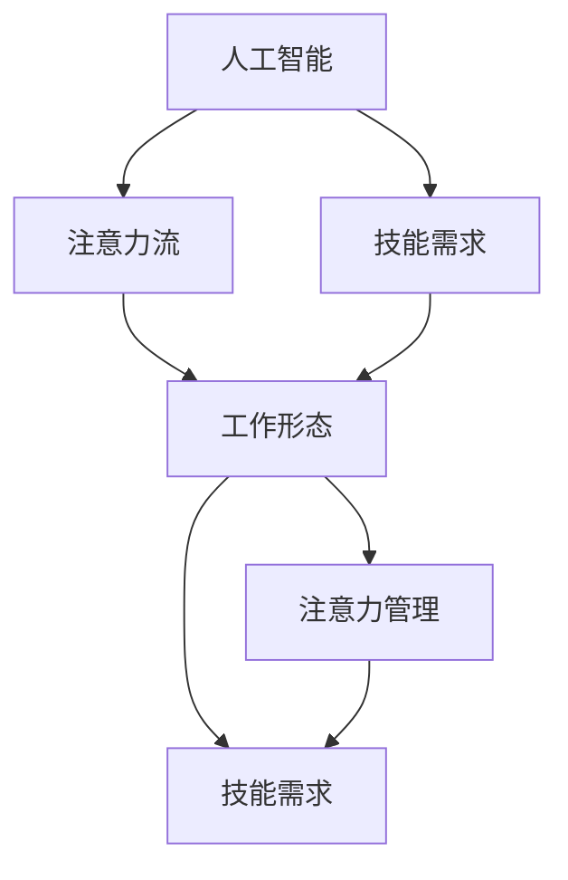

                 

# AI与人类注意力流：未来的工作、技能与注意力流管理技术的应用趋势预测

> 关键词：人工智能,注意力流,工作趋势,技能培养,注意力流管理,未来工作形态,技能转型,技术发展

## 1. 背景介绍

### 1.1 问题由来
当前，人工智能(AI)正在以迅猛的态势渗透到各行各业，深刻改变着人们的工作和生活方式。随着AI技术的不断进步，其应用已从最初的图像识别、语音识别等简单任务扩展到了复杂的自然语言处理、推荐系统、智能决策等领域。AI技术的广泛应用不仅提升了生产效率，也带来了对人类技能和劳动力市场的巨大冲击。

### 1.2 问题核心关键点
AI技术的发展和应用引发了一系列关于未来工作形态、技能需求和注意力管理的重要问题。这些问题不仅是技术问题，更是社会问题，影响着人类的就业、教育、生活质量等多个方面。

- **未来工作形态**：AI技术将如何改变人类工作方式？哪些工作将消失，哪些工作将新增？
- **技能需求变化**：AI技术的发展对人类技能需求有何影响？需要培养哪些新技能以适应AI时代的职场？
- **注意力管理**：AI技术带来了大量数据和信息，如何高效管理人类的注意力，避免信息过载？

这些问题亟需深度探讨和预测，以便为政策制定者、教育机构和企业提供指导，帮助人们更好地应对AI时代的挑战和机遇。

### 1.3 问题研究意义
深入研究AI与人类注意力流的交互，对预测未来工作形态、技能需求和管理技术的发展趋势具有重要意义：

1. **政策制定**：了解AI对就业市场的影响，有助于政府制定合适的就业政策和社会保障措施。
2. **教育改革**：基于未来工作对技能的需求，改革教育体系，培养适应未来需求的复合型人才。
3. **企业转型**：帮助企业理解和适应AI技术，实现业务流程的智能化、自动化，提升竞争力。
4. **个人发展**：引导个人调整职业规划，掌握新技能，保持职业生涯的可持续发展。

## 2. 核心概念与联系

### 2.1 核心概念概述

为了更好地理解AI与人类注意力流的交互，本节将介绍几个关键概念及其内在联系：

- **人工智能(AI)**：利用计算机技术和算法模拟人类智能行为的技术，涵盖机器学习、深度学习、自然语言处理等多个领域。
- **注意力流(Attention Flow)**：人类在信息处理过程中对不同信息的关注和聚焦，是认知和决策的重要基础。
- **工作形态**：人们在职场中执行任务的组织形式，包括职位类型、工作环境、团队协作方式等。
- **技能需求**：完成特定工作任务所需的专业知识、操作能力和思维方式。
- **注意力管理**：通过技术手段提升个体和团队在信息海洋中的注意力集中和筛选能力。

这些概念之间通过以下Mermaid流程图进行联系：



这个流程图展示了AI技术如何影响人类注意力流，进而改变工作形态和技能需求，并通过注意力管理技术进行提升。

## 3. 核心算法原理 & 具体操作步骤
### 3.1 算法原理概述

AI与人类注意力流的交互过程涉及多个环节，包括信息获取、注意力分配、任务执行和反馈调整等。其核心算法原理主要包括以下几个方面：

- **信息获取**：通过传感器、网络等手段获取外部环境的信息，是注意力流的基础。
- **注意力分配**：利用AI算法对信息进行筛选和排序，将注意力分配到最重要或最相关的信息上。
- **任务执行**：根据注意力流和目标任务，执行相应的操作或决策。
- **反馈调整**：根据任务执行结果和环境变化，调整注意力流和后续任务的执行策略。

这些环节共同构成了一个完整的AI与人类注意力流交互的系统。

### 3.2 算法步骤详解

基于上述算法原理，AI与人类注意力流的交互可以分为以下几个具体步骤：

**Step 1: 数据收集与预处理**
- 使用传感器、网络等技术收集环境信息。
- 对信息进行清洗、标注和归一化处理，以便后续算法使用。

**Step 2: 注意力模型训练**
- 选择适合的注意力模型（如Transformer、注意力机制等），对其进行训练。
- 使用标注数据和预处理后的信息进行监督学习，优化注意力分配策略。

**Step 3: 注意力流生成**
- 将处理后的信息输入训练好的注意力模型，生成注意力流。
- 注意力流可以表示为一系列权重，表示对不同信息的关注程度。

**Step 4: 任务执行与反馈**
- 根据注意力流和任务目标，执行相应的操作或决策。
- 收集任务执行结果，进行反馈分析，调整注意力分配策略。

**Step 5: 持续优化**
- 不断迭代优化注意力模型和策略，提升注意力管理的效果。

### 3.3 算法优缺点

AI与人类注意力流交互的算法具有以下优点：

- **高效性**：AI算法能够快速处理大量信息，辅助人类进行决策。
- **灵活性**：算法可以适应不同的工作任务和环境，提升任务执行效率。
- **可扩展性**：随着数据和算法的不断优化，AI与人类注意力流交互的效果将不断提升。

同时，该算法也存在一些局限性：

- **依赖数据质量**：算法的性能很大程度上取决于数据的质量和多样性，低质量或偏斜的数据可能导致错误决策。
- **人机协同难度**：AI与人类注意力流的交互需要高度的协同配合，如何保证人机交互的自然和高效是一个挑战。
- **伦理与安全**：AI在处理个人信息时可能存在隐私泄露和数据滥用的风险，需要重视伦理和安全的保障。

### 3.4 算法应用领域

AI与人类注意力流的交互技术已在多个领域得到应用，以下是几个典型应用场景：

- **智能推荐系统**：如Netflix、Amazon等，通过分析用户的注意力流，推荐个性化内容。
- **智能客服**：通过分析客户对话中的注意力流，提供个性化服务。
- **智能交通系统**：通过分析驾驶者的注意力流，优化交通信号和导航。
- **智能家居**：通过分析用户的注意力流，提供定制化服务。

这些应用场景展示了AI与人类注意力流的交互技术在提升用户体验和优化资源配置方面的巨大潜力。

## 4. 数学模型和公式 & 详细讲解 & 举例说明

### 4.1 数学模型构建

为更精确地描述AI与人类注意力流的交互过程，本节构建了一个简单的数学模型。

假设有一个信息集合 $\mathcal{I}$，其中每个信息 $i \in \mathcal{I}$ 都有一个权重 $w_i$ 表示人类对其的关注程度。AI的注意力模型 $M$ 对信息集 $\mathcal{I}$ 进行筛选和排序，输出一个注意力流 $\mathcal{A}$，其中 $\mathcal{A}=\{a_i\}_{i=1}^N$，表示对每个信息的关注权重。

设任务目标为 $T$，AI与人类注意力流的交互过程可以表示为：

$$
\mathcal{A} = M(\mathcal{I}) \\
T = \mathrm{Execute}(\mathcal{A}, T) \\
\mathcal{I} = \mathrm{Update}(T)
$$

其中 $\mathrm{Execute}(\mathcal{A}, T)$ 表示根据注意力流 $\mathcal{A}$ 和任务目标 $T$ 执行相应的操作或决策，$\mathrm{Update}(T)$ 表示根据任务执行结果更新信息集 $\mathcal{I}$。

### 4.2 公式推导过程

以智能推荐系统为例，推导注意力流生成和任务执行的具体公式：

假设信息集合 $\mathcal{I}=\{x_1,x_2,...,x_N\}$，每个信息 $x_i$ 都有一个特征向量 $f_i \in \mathbb{R}^d$，表示其多维特征。AI的注意力模型 $M$ 可以表示为：

$$
\mathcal{A} = M(\mathcal{I}) = \{\alpha_i\}_{i=1}^N
$$

其中 $\alpha_i$ 表示对信息 $x_i$ 的关注权重。

假设任务目标 $T$ 为推荐系统中的用户点击行为，每个信息 $x_i$ 对用户点击的概率为 $p_i$，则任务执行过程可以表示为：

$$
p_i = \sigma(W^T a_i + b) \\
T = \arg\max_i p_i
$$

其中 $W$ 和 $b$ 是线性回归模型的权重和偏置，$\sigma$ 是激活函数（如Sigmoid、ReLU等）。

通过上述公式，AI与人类注意力流的交互过程可以高效地完成信息筛选、任务执行和反馈调整。

### 4.3 案例分析与讲解

以智能客服为例，分析注意力流管理技术的具体应用：

假设客服系统接收到一条用户咨询，系统首先需要通过语音识别技术获取用户的语音信息，并将其转换为文本。然后，系统分析用户的注意力流，识别出用户关心的主要问题，并从知识库中检索出最相关的信息进行回答。

在回答过程中，系统不断收集用户的反馈，调整注意力流的分配，以提供更加准确和个性化的服务。最终，系统记录用户的满意度，用于优化后续的客服流程和注意力流管理策略。

通过上述分析，我们可以看到，AI与人类注意力流的交互技术在智能客服中的应用，可以有效提升客服效率和用户满意度。

## 5. 项目实践：代码实例和详细解释说明
### 5.1 开发环境搭建

在进行AI与人类注意力流的交互项目实践前，需要准备好开发环境。以下是使用Python进行TensorFlow开发的环境配置流程：

1. 安装Anaconda：从官网下载并安装Anaconda，用于创建独立的Python环境。

2. 创建并激活虚拟环境：
```bash
conda create -n ai-env python=3.8 
conda activate ai-env
```

3. 安装TensorFlow：根据CUDA版本，从官网获取对应的安装命令。例如：
```bash
conda install tensorflow -c conda-forge -c pytorch
```

4. 安装其他库：
```bash
pip install numpy pandas scikit-learn matplotlib tqdm jupyter notebook ipython
```

完成上述步骤后，即可在`ai-env`环境中开始项目实践。

### 5.2 源代码详细实现

下面以智能推荐系统为例，给出使用TensorFlow实现AI与人类注意力流交互的Python代码实现。

首先，定义信息集合和注意力模型：

```python
import tensorflow as tf

# 定义信息集合
I = tf.constant(['item1', 'item2', 'item3'])

# 定义注意力模型
W = tf.Variable(tf.random.normal([len(I), len(I)]))
b = tf.Variable(tf.random.normal([len(I)]))
model = tf.keras.Sequential([
    tf.keras.layers.Dense(len(I), activation='softmax', kernel_initializer=tf.keras.initializers.RandomNormal(stddev=0.01), weights=[W, b])
])
```

然后，定义注意力流生成和任务执行过程：

```python
# 生成注意力流
A = model.predict(I)

# 定义任务目标
T = tf.keras.layers.Dense(1, activation='sigmoid', kernel_initializer=tf.keras.initializers.RandomNormal(stddev=0.01), weights=[W, b])

# 执行任务
P = tf.nn.softmax(A, axis=1)
Y = tf.nn.sigmoid(T) * P

# 计算损失
loss = tf.reduce_mean(tf.nn.sigmoid_cross_entropy_with_logits(labels=Y, logits=T))

# 优化模型
optimizer = tf.keras.optimizers.Adam(learning_rate=0.001)
loss_fn = tf.keras.losses.BinaryCrossentropy()
model.compile(optimizer=optimizer, loss=loss_fn)
```

最后，启动训练流程：

```python
epochs = 100

for epoch in range(epochs):
    loss_value = model.train_on_batch(I, Y)
    print(f'Epoch {epoch+1}, Loss: {loss_value:.4f}')
```

以上就是使用TensorFlow实现AI与人类注意力流交互的完整代码实现。可以看到，TensorFlow提供的高效计算图和自动微分功能，使得模型构建和训练过程变得非常简洁。

### 5.3 代码解读与分析

让我们再详细解读一下关键代码的实现细节：

**信息集合定义**：
- 使用`tf.constant`定义信息集合，其中每个信息都表示为一个字符串。

**注意力模型定义**：
- 使用`tf.Variable`定义权重矩阵 $W$ 和偏置向量 $b$，作为注意力模型的一部分。
- 通过`tf.keras.layers.Dense`构建注意力模型，其中`activation='softmax'`表示输出为注意力权重，`kernel_initializer=tf.keras.initializers.RandomNormal(stddev=0.01)`表示初始化权重为随机正态分布，`weights=[W, b]`表示使用自定义的权重和偏置。

**注意力流生成**：
- 通过`model.predict(I)`生成注意力流 $\mathcal{A}$，其中 $I$ 是信息集合，$A$ 是注意力权重。

**任务执行与反馈调整**：
- 定义任务目标 $T$，并使用`tf.nn.sigmoid`和`tf.nn.softmax`计算任务执行概率 $P$ 和任务执行结果 $Y$。
- 使用`tf.reduce_mean`计算损失函数 $\mathcal{L}$。
- 使用`tf.keras.optimizers.Adam`优化器对模型进行优化。

**训练流程**：
- 使用`model.train_on_batch(I, Y)`进行模型训练，其中 $I$ 是信息集合，$Y$ 是任务执行结果。
- 循环训练100个epoch，每轮训练后输出损失值。

通过上述代码，我们可以清晰地看到AI与人类注意力流交互的具体实现步骤，包括信息集合的定义、注意力模型的训练、注意力流的生成和任务执行的反馈调整。

## 6. 实际应用场景
### 6.1 智能推荐系统

基于AI与人类注意力流的交互技术，智能推荐系统可以为用户提供个性化的信息和服务。推荐系统通过分析用户的注意力流，识别其偏好和需求，推荐相关的商品、内容或服务。

在技术实现上，推荐系统通常包括用户行为数据采集、注意力流生成、推荐模型训练和推荐结果展示等多个环节。通过高效的信息筛选和个性化的推荐，智能推荐系统可以提升用户满意度，增加用户粘性，推动业务增长。

### 6.2 智能客服

智能客服系统通过分析用户的注意力流，识别其需求和问题，提供快速准确的解决方案。客服系统通常集成了语音识别、自然语言处理和注意力流管理技术，能够全天候提供高效的服务。

在具体应用中，客服系统可以记录用户的对话历史和注意力流，用于优化后续的客服流程和注意力管理策略，提升客服效率和用户满意度。

### 6.3 智能交通系统

智能交通系统通过分析驾驶者的注意力流，优化交通信号和导航，提升道路通行效率和安全性。交通系统通常集成了摄像头、传感器和注意力流管理技术，能够实时监测和预测交通状况。

在具体应用中，交通系统可以分析驾驶者的注意力流，识别出潜在的交通风险，及时调整信号灯和导航信息，避免交通拥堵和事故发生。

### 6.4 未来应用展望

随着AI与人类注意力流交互技术的不断进步，其应用领域将进一步扩展：

1. **个性化医疗**：通过分析患者的注意力流，智能推荐个性化的治疗方案，提升医疗效果。
2. **智能家居**：通过分析家庭成员的注意力流，智能推荐家居环境配置和生活方式，提升生活质量。
3. **智慧城市**：通过分析市民的注意力流，智能优化城市管理和服务，提升城市运行效率和居民幸福感。

AI与人类注意力流的交互技术将在更多领域发挥作用，为人类社会带来更深远的影响。

## 7. 工具和资源推荐
### 7.1 学习资源推荐

为了帮助开发者系统掌握AI与人类注意力流的交互技术，这里推荐一些优质的学习资源：

1. **《Deep Learning》书籍**：Ian Goodfellow等著，全面介绍了深度学习的基本原理和实践技巧，涵盖了AI与人类注意力流的交互技术。
2. **CS231n《深度学习视觉与模式识别》课程**：斯坦福大学开设的视觉领域经典课程，讲解了深度学习在图像和视频处理中的应用，为理解AI与注意力流的交互提供了坚实基础。
3. **《Attention Is All You Need》论文**：谷歌大脑团队的论文，提出了Transformer模型，开创了注意力机制在自然语言处理中的应用。
4. **TensorFlow官方文档**：TensorFlow的官方文档，提供了详细的API参考和示例代码，是学习AI与人类注意力流交互技术的重要资源。

通过对这些资源的学习实践，相信你一定能够快速掌握AI与人类注意力流的交互技术，并用于解决实际的NLP问题。

### 7.2 开发工具推荐

高效的开发离不开优秀的工具支持。以下是几款用于AI与人类注意力流交互开发的常用工具：

1. **TensorFlow**：谷歌主导的深度学习框架，支持自动微分和分布式计算，适合大规模模型训练和部署。
2. **PyTorch**：Facebook开发的深度学习框架，灵活性高，支持动态图和GPU加速，适合研究和快速迭代。
3. **Jupyter Notebook**：交互式编程环境，支持Python和多种科学计算库，适合数据探索和模型实验。
4. **Scikit-learn**：Python机器学习库，提供简单易用的接口和丰富的机器学习算法，适合数据预处理和模型评估。

合理利用这些工具，可以显著提升AI与人类注意力流交互任务的开发效率，加快创新迭代的步伐。

### 7.3 相关论文推荐

AI与人类注意力流的交互技术的发展源于学界的持续研究。以下是几篇奠基性的相关论文，推荐阅读：

1. **Attention Is All You Need**：谷歌大脑团队的论文，提出了Transformer模型，开创了注意力机制在自然语言处理中的应用。
2. **Recurrent Models of Attention and Memory**：William H. Press等著，详细介绍了递归神经网络中的注意力机制，为理解AI与人类注意力流的交互提供了理论基础。
3. **Attention-Based Variational Inference for Deep Gaussian Processes**：Neil D. Lawrence等著，介绍了变分推断中的注意力机制，为优化注意力流管理提供了方法。

这些论文代表了大模型微调技术的发展脉络。通过学习这些前沿成果，可以帮助研究者把握学科前进方向，激发更多的创新灵感。

## 8. 总结：未来发展趋势与挑战
### 8.1 研究成果总结

本文对AI与人类注意力流的交互技术进行了全面系统的介绍。首先阐述了AI技术的发展对人类注意力流的影响，明确了AI与人类注意力流交互在提升工作效率、优化决策和改善用户体验方面的独特价值。其次，从原理到实践，详细讲解了AI与人类注意力流交互的数学模型和操作步骤，给出了具体的代码实现。同时，本文还探讨了AI与人类注意力流的交互技术在智能推荐、智能客服、智能交通等多个领域的应用前景，展示了其广阔的应用潜力。

通过本文的系统梳理，可以看到，AI与人类注意力流的交互技术正在成为AI应用的重要范式，极大地提升了AI系统在处理信息和执行任务时的效率和效果。未来，伴随技术的不断演进，该技术将在更多领域发挥作用，为人类社会带来深远的影响。

### 8.2 未来发展趋势

展望未来，AI与人类注意力流的交互技术将呈现以下几个发展趋势：

1. **更加智能化**：未来的注意力流管理技术将更加智能化，能够根据环境变化和任务需求动态调整注意力策略，提升系统的灵活性和适应性。
2. **更加个性化**：未来的系统将能够更加精准地识别用户的个性化需求，提供定制化的服务和推荐，提升用户体验。
3. **更加人性化**：未来的系统将更加注重人机协同，通过自然语言交互等方式，提升用户操作便捷性和友好性。
4. **更加自动化**：未来的系统将实现高度自动化，通过深度学习和强化学习技术，自主学习和优化注意力策略，减少人工干预。

这些趋势将使AI与人类注意力流的交互技术更加智能、高效和人性化，为人类社会带来更多便利和福祉。

### 8.3 面临的挑战

尽管AI与人类注意力流的交互技术正在迅速发展，但在实现这些目标的过程中，仍面临诸多挑战：

1. **数据隐私和安全**：AI在处理个人信息时可能存在隐私泄露和数据滥用的风险，需要重视数据安全和隐私保护。
2. **计算资源瓶颈**：大规模注意力流管理需要大量的计算资源，如何高效地利用资源，提升计算效率，仍是技术难题。
3. **算法透明性和可解释性**：AI算法的决策过程缺乏透明性和可解释性，如何增强算法的透明性和可解释性，仍需进一步研究。
4. **伦理和道德问题**：AI在处理复杂决策时，可能产生伦理和道德问题，需要建立合适的伦理框架和监管机制。

这些挑战需要通过技术创新和政策制定，不断克服，才能使AI与人类注意力流的交互技术真正服务于人类社会。

### 8.4 研究展望

面对AI与人类注意力流交互技术的挑战，未来的研究需要在以下几个方面寻求新的突破：

1. **增强数据隐私保护**：开发更加安全的数据处理和隐私保护算法，确保个人信息的隐私和安全。
2. **优化计算资源利用**：研究和应用高效计算和分布式计算技术，提升注意力流管理的计算效率。
3. **提高算法透明性和可解释性**：探索可解释性AI算法，增强算法的透明性和可解释性，提升用户信任度。
4. **建立伦理和道德框架**：制定AI伦理和道德规范，建立合适的监管机制，确保AI技术健康发展。

这些研究方向将推动AI与人类注意力流交互技术的成熟和普及，为人类社会带来更多的福祉和进步。

## 9. 附录：常见问题与解答

**Q1：AI与人类注意力流的交互技术是否适用于所有AI应用场景？**

A: AI与人类注意力流的交互技术在多个AI应用场景中具有广泛的应用前景，但并非所有场景都适合。例如，对实时性要求极高、数据量巨大的应用场景，可能需要使用其他优化技术。但大多数智能推荐、智能客服、智能交通等应用场景，AI与人类注意力流的交互技术都能发挥重要作用。

**Q2：AI与人类注意力流的交互技术如何处理数据隐私问题？**

A: 在处理数据隐私问题时，AI与人类注意力流的交互技术可以通过以下方式进行保护：
1. 匿名化处理：对个人信息进行匿名化处理，使其无法被反向识别。
2. 差分隐私：在数据处理过程中加入噪声，保护个体隐私不被泄露。
3. 联邦学习：通过分布式计算和加密技术，在本地设备上进行模型训练，保护数据隐私。

这些方法可以有效地保护数据隐私，同时确保AI系统能够高效地利用数据。

**Q3：AI与人类注意力流的交互技术如何处理计算资源瓶颈？**

A: 在处理计算资源瓶颈时，AI与人类注意力流的交互技术可以通过以下方式进行优化：
1. 模型压缩：使用模型压缩技术，减小模型参数和计算量，提升计算效率。
2. 分布式计算：利用分布式计算技术，在多台设备上并行计算，提高计算效率。
3. 混合精度计算：使用混合精度计算技术，减少计算量，提升计算速度。

这些方法可以有效地缓解计算资源瓶颈，提升AI系统的计算效率和性能。

**Q4：AI与人类注意力流的交互技术如何提高算法的透明性和可解释性？**

A: 在提高算法透明性和可解释性时，AI与人类注意力流的交互技术可以通过以下方式进行改进：
1. 可解释性算法：开发可解释性算法，使AI算法的决策过程更加透明和可解释。
2. 可视化工具：使用可视化工具，展示AI算法的内部机制和推理过程，增强用户信任度。
3. 人机协同：通过人机协同的方式，引导AI算法做出更合理和透明的决策。

这些方法可以有效地增强算法的透明性和可解释性，提升用户信任度，促进AI技术的广泛应用。

**Q5：AI与人类注意力流的交互技术如何确保伦理和道德规范？**

A: 在确保伦理和道德规范时，AI与人类注意力流的交互技术可以通过以下方式进行约束：
1. 伦理框架：建立合适的AI伦理框架，规范AI系统的行为和决策过程。
2. 监管机制：制定AI监管机制，确保AI系统的行为符合伦理和道德规范。
3. 用户反馈：收集用户反馈，及时调整AI系统的行为，确保AI系统的行为符合用户期望。

这些方法可以有效地确保AI系统的行为符合伦理和道德规范，保护用户的权益。

---

作者：禅与计算机程序设计艺术 / Zen and the Art of Computer Programming

