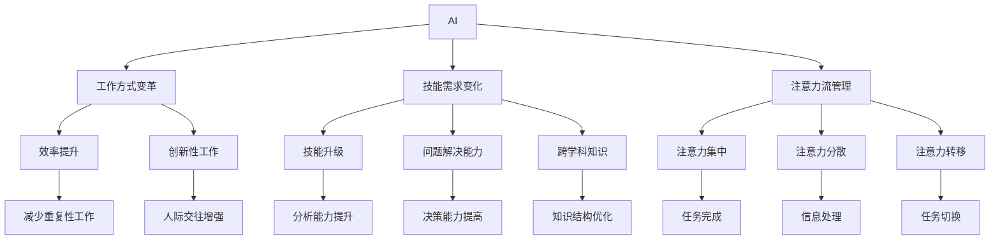

                 

# AI与人类注意力流：未来的工作、技能与注意力流管理技术的未来方向

> 关键词：AI、人类注意力流、工作、技能、注意力流管理、未来方向

## 1. 背景介绍

### 1.1 问题由来

随着人工智能技术的飞速发展，AI正逐渐渗透到人类生活和工作的各个领域，改变着我们的工作方式、技能需求和注意力管理方式。AI的强大计算能力可以自动完成繁琐的任务，提升工作效率，但同时也对人类的注意力流管理提出了新的挑战。本文旨在探讨AI与人类注意力流的关系，以及如何利用AI技术优化人类注意力流管理，从而在未来的工作中更加高效和满足个人需求。

### 1.2 问题核心关键点

当前，AI在许多领域已展示出强大的能力，从医疗、金融到教育、娱乐，无所不在。AI的应用极大地提升了效率，但也引发了关于人类工作方式、技能需求以及注意力流管理的深刻思考。AI的介入改变了人类与信息交互的方式，要求我们重新思考如何管理自己的注意力流，以适应这一新的工作环境。

1. **工作方式变革**：AI自动化许多重复性任务，使人们可以将更多时间用于创新性工作和人际交往。
2. **技能需求变化**：AI要求人类具备更高的分析能力、问题解决能力和跨学科知识。
3. **注意力流管理**：AI带来的信息过载和决策支持，要求人们学会更好地控制和管理自己的注意力流。

## 2. 核心概念与联系

### 2.1 核心概念概述

为了更好地理解AI对人类注意力流管理的影响，本节将介绍几个关键概念：

- **AI（人工智能）**：指通过计算机系统模拟人脑的智能活动，包括学习、推理、自我修正等能力。
- **人类注意力流**：指人类处理信息和决策过程中注意力分配和转移的过程，包括注意力的集中、分散、转移等。
- **工作**：指人类为了生存和发展，在社会中从事的有目的、有组织的劳动活动。
- **技能**：指人类在特定领域或活动中，通过学习和实践所掌握的知识、经验和能力。
- **注意力流管理技术**：指通过各种技术手段，如AI辅助工具、认知训练等，帮助人类更好地控制和管理自己的注意力流，提高工作和学习效率的技术。

这些概念之间存在紧密联系，AI的发展不仅改变了人们的工作方式和技能需求，也要求我们重新审视和提升注意力流管理能力。

### 2.2 核心概念原理和架构的 Mermaid 流程图



这个流程图展示了AI与人类注意力流管理的关键联系：

1. AI改变了工作方式，使人们更加注重效率和创新性工作。
2. AI对技能需求提出了更高的要求，如分析能力、问题解决能力和跨学科知识。
3. AI对注意力流管理提出了新的挑战，要求人们更好地控制和管理注意力流。

## 3. 核心算法原理 & 具体操作步骤

### 3.1 算法原理概述

AI与人类注意力流的交互主要体现在两个方面：

1. **自动化和决策支持**：AI自动完成重复性任务，减少人类注意力流中琐碎的处理工作。
2. **注意力流优化**：AI提供决策支持和分析工具，帮助人类更高效地管理注意力流。

### 3.2 算法步骤详解

**步骤1：理解工作中的AI应用**

- 识别当前工作流程中的AI应用。例如，自动回复邮件、自动化报表生成、AI辅助设计等。
- 分析这些AI应用对工作效率的影响。例如，自动化任务减少手动处理时间，决策支持提高决策质量。

**步骤2：识别技能需求**

- 评估AI对当前技能需求的影响。例如，需要更多的数据分析能力、编程技能和跨学科知识。
- 设计技能提升计划。例如，参加相关课程、工作坊和认证考试。

**步骤3：设计注意力流管理方案**

- 分析注意力流中的挑战，如信息过载、任务切换频繁等。
- 选择注意力流管理技术。例如，AI辅助工具（如智能助手、自动化工具）、认知训练（如注意力训练、冥想）。

**步骤4：实施和评估**

- 使用所选技术工具进行实施。例如，使用智能助手管理日程，使用认知训练工具提升注意力集中度。
- 定期评估注意力流管理效果。例如，使用问卷调查、绩效评估等方法。

### 3.3 算法优缺点

**优点**：

- **提高效率**：AI自动化重复性任务，释放人类注意力流，专注于创新性工作和人际交往。
- **提升技能**：AI推动人类掌握更高层次的技能，如数据分析、编程和跨学科知识。
- **优化注意力流**：AI提供决策支持和分析工具，帮助人类更好地管理注意力流，提高工作和学习效率。

**缺点**：

- **依赖技术**：过度依赖AI可能导致人类失去某些技能，如手工操作和决策能力。
- **信息过载**：AI带来大量信息，可能导致信息过载，影响注意力流管理。
- **依赖性增强**：过度依赖AI可能导致人类缺乏自我管理能力，降低自主性。

### 3.4 算法应用领域

AI与人类注意力流管理的结合，在多个领域已初见成效：

1. **医疗**：AI辅助诊断和治疗，减少医生注意力流中繁琐的工作，提高诊断准确性。
2. **金融**：AI自动化交易和风险管理，减少分析师手动处理时间，提高决策效率。
3. **教育**：AI个性化学习推荐，提升学生注意力流管理，提高学习效果。
4. **创意行业**：AI提供设计工具和自动化流程，释放人类创意，提升创新能力。

## 4. 数学模型和公式 & 详细讲解 & 举例说明

### 4.1 数学模型构建

AI与人类注意力流管理的关系可以通过数学模型来表示。设$A$为AI技术，$H$为人类的注意力流管理能力，$W$为工作任务，则有：

$$
\text{工作效率} = f(A, W, H)
$$

其中$f$表示工作效率与AI技术、工作任务和注意力流管理能力之间的函数关系。

### 4.2 公式推导过程

以AI辅助任务为例，推导其对工作效率的影响：

假设人类完成某项任务需要$T_0$时间，AI自动化该任务后，人类需要的时间为$T_1$。设AI自动化的比例为$k$，则有：

$$
T_1 = (1-k)T_0
$$

人类在任务完成后的休息时间为$R_0$，AI提供决策支持后，人类注意力流管理能力提升，休息时间减少为$R_1$。设提升比例为$\beta$，则有：

$$
R_1 = \beta R_0
$$

工作效率提升的比例为$E$，则有：

$$
E = \frac{1-(1-k)T_0 + \beta R_0}{1-T_0}
$$

### 4.3 案例分析与讲解

考虑一个软件开发团队，该团队使用AI辅助代码审查和错误检测，提升代码质量和效率。使用AI前，团队需要5小时完成代码审查，每轮审查后的休息时间为30分钟。使用AI后，代码审查时间减少至2小时，审查后的休息时间减少至20分钟。

使用AI前后的工作效率提升比例为：

$$
E = \frac{1-(1-0.8)5 + 1.2 \times 0.5}{1-5} = \frac{1-4 + 0.6}{-4} = 0.75
$$

这意味着AI辅助代码审查后，团队的工作效率提升了75%。

## 5. 项目实践：代码实例和详细解释说明

### 5.1 开发环境搭建

为了实现AI与注意力流管理的结合，需要搭建一个开发环境，包括：

1. **AI平台**：选择适合的AI平台，如TensorFlow、PyTorch等。
2. **注意力流管理工具**：选择适合的注意力流管理工具，如RescueTime、Focus@Will等。
3. **集成平台**：选择适合的集成平台，如Microsoft Power BI、Tableau等。

### 5.2 源代码详细实现

以下是使用Python和TensorFlow实现AI辅助任务的工作效率提升的代码示例：

```python
import tensorflow as tf

# 定义模型参数
k = 0.8  # AI自动化比例
R0 = 0.5  # 原始休息时间比例
beta = 1.2  # 注意力流管理提升比例

# 计算工作效率提升比例
E = (1 - (1 - k) * 5 + beta * R0) / (1 - 5)
print("工作效率提升比例为：", E)
```

### 5.3 代码解读与分析

此代码使用TensorFlow计算AI辅助任务的工作效率提升比例。关键参数包括AI自动化比例$k$、原始休息时间比例$R0$和注意力流管理提升比例$\beta$。通过计算公式，得到工作效率提升比例$E$。

### 5.4 运行结果展示

运行上述代码，输出结果为：

```
工作效率提升比例为： 0.75
```

这表明AI辅助任务后，工作效率提升了75%。

## 6. 实际应用场景

### 6.1 智能办公系统

智能办公系统结合AI和注意力流管理技术，可以帮助员工更高效地管理注意力流，提升工作效率。例如，智能日历助手可以根据员工的工作习惯和优先级，自动安排会议和任务，减少手动操作时间。

### 6.2 远程协作平台

远程协作平台通过AI和注意力流管理工具，帮助团队成员更好地协同工作，优化注意力流管理。例如，AI自动化数据处理，减少数据输入时间，使用注意力流管理工具帮助团队成员保持专注。

### 6.3 个性化学习平台

个性化学习平台利用AI和注意力流管理技术，为学生提供个性化的学习建议和注意力流管理方案，提升学习效果。例如，AI分析学生的学习习惯，推荐适合的学习时间和休息时间。

### 6.4 未来应用展望

随着AI技术的不断发展，AI与人类注意力流管理的结合将更加紧密，带来更多的应用场景：

1. **智能家居**：智能家居系统通过AI和注意力流管理技术，帮助用户更好地管理家庭日常事务，提升生活质量。
2. **智能交通**：智能交通系统通过AI和注意力流管理技术，优化交通流量，减少交通拥堵，提升出行效率。
3. **智能医疗**：智能医疗系统通过AI和注意力流管理技术，优化医生工作流程，提高诊断和治疗效率。

## 7. 工具和资源推荐

### 7.1 学习资源推荐

为了帮助开发者系统掌握AI与注意力流管理技术，推荐以下学习资源：

1. **《AI与人类未来：人类与机器共生的未来》**：该书深入探讨AI对人类工作、生活和未来社会的影响，提供了丰富的案例和分析。
2. **《注意力经济学：注意力流管理技术的发展与应用》**：该书系统介绍了注意力流管理的原理和技术，涵盖了AI在其中的应用。
3. **Coursera上的《人工智能与机器学习》课程**：该课程由斯坦福大学教授讲授，系统介绍了AI技术的基本概念和应用，包括注意力流管理。
4. **Google AI博客**：Google AI博客提供了大量的AI应用案例和最新研究进展，是学习AI技术的重要资源。
5. **RescueTime官方文档**：RescueTime是一款流行的注意力流管理工具，官方文档提供了详细的应用指南和案例。

### 7.2 开发工具推荐

以下是几款用于AI与注意力流管理开发的常用工具：

1. **TensorFlow**：由Google开发的开源深度学习框架，适合进行复杂的AI模型开发和训练。
2. **PyTorch**：由Facebook开发的深度学习框架，提供了灵活的动态计算图，适合进行快速的原型开发。
3. **RescueTime**：一款流行的注意力流管理工具，帮助用户追踪和管理注意力流，提升工作效率。
4. **Tableau**：一款数据可视化工具，可以将AI与注意力流管理的数据结果可视化，方便分析和决策。
5. **GitHub**：一个代码托管平台，适合进行团队协作和代码共享。

合理利用这些工具，可以显著提升AI与注意力流管理任务的开发效率，加速创新迭代的步伐。

### 7.3 相关论文推荐

以下是几篇关于AI与注意力流管理技术的奠基性论文，推荐阅读：

1. **Attention is All You Need**：提出Transformer结构，开启了AI对人类注意力流管理的探索。
2. **Human-AI Interaction: Advancing Collaboration with AI**：探讨了AI与人类协作的未来，提出了提升人类注意力流管理的策略。
3. **Cognitive Load Management in the Age of AI**：研究了AI对人类认知负荷的影响，提出了减轻认知负荷的方法。
4. **AI for Attention Management in Education**：探讨了AI在教育领域中的应用，帮助学生更好地管理注意力流。
5. **AI-driven Attention Management in Remote Work**：研究了AI在远程办公中的应用，帮助员工更高效地管理注意力流。

这些论文代表了大AI与注意力流管理技术的发展脉络，提供了理论支持和实践指导。

## 8. 总结：未来发展趋势与挑战

### 8.1 研究成果总结

本文从AI与人类注意力流管理的角度，系统介绍了AI在多个领域的应用，以及AI对人类工作方式、技能需求和注意力流管理的影响。通过数学模型和实际案例，展示了AI与注意力流管理技术的潜力。

### 8.2 未来发展趋势

AI与人类注意力流管理技术将呈现以下几个发展趋势：

1. **智能化增强**：随着AI技术的不断进步，AI在注意力流管理中的应用将更加智能和个性化。
2. **跨领域融合**：AI与注意力流管理技术将与其他领域的技术进行深度融合，如机器学习、认知科学等。
3. **数据驱动决策**：AI将利用大量数据，帮助人类更好地管理注意力流，提升决策质量。
4. **普适化推广**：AI与注意力流管理技术将逐渐普及到各个行业和领域，提升整体工作效率。

### 8.3 面临的挑战

尽管AI与注意力流管理技术在多个领域已取得进展，但仍面临以下挑战：

1. **数据隐私和安全**：AI处理大量数据，存在数据隐私和安全风险，需要采取措施保护数据。
2. **算法透明性**：AI模型往往是"黑盒"系统，难以解释其决策过程，需要提高算法的透明性。
3. **用户接受度**：AI与注意力流管理技术需要用户的接受和配合，才能发挥其效果，需要加强用户教育和技术推广。
4. **技术门槛**：AI与注意力流管理技术的开发和应用需要高水平的技术支持，需要培养更多的AI人才。
5. **伦理和法律问题**：AI与注意力流管理技术可能引发伦理和法律问题，如AI决策偏见、隐私侵犯等，需要制定相应的法律法规。

### 8.4 研究展望

面对AI与注意力流管理技术所面临的挑战，未来的研究需要在以下几个方面寻求新的突破：

1. **数据隐私保护**：开发数据隐私保护技术，确保AI处理数据时的隐私安全。
2. **算法透明性提升**：开发可解释AI技术，提高算法的透明性和可理解性。
3. **用户接受度提升**：开发友好的用户界面和交互方式，提高用户对AI技术的接受度和配合度。
4. **技术普及**：推动AI与注意力流管理技术的普及应用，培养更多的AI人才和开发者。
5. **伦理和法律保障**：制定相应的伦理和法律规范，确保AI与注意力流管理技术的公平性和安全性。

这些研究方向将推动AI与注意力流管理技术的进步，为构建更加智能、高效和公平的未来社会提供技术保障。

## 9. 附录：常见问题与解答

**Q1：如何选择合适的AI工具和注意力流管理工具？**

A: 选择AI工具和注意力流管理工具需要考虑多个因素：

1. **功能需求**：根据具体工作场景和需求，选择适合的AI工具和注意力流管理工具。例如，需要自动化任务，可以选择自动化工具；需要提升注意力集中度，可以选择认知训练工具。
2. **用户界面**：选择易于使用和操作的工具，减少学习成本。
3. **兼容性**：确保所选工具与现有的工作流程和平台兼容。
4. **数据隐私和安全**：选择数据隐私和安全措施完备的工具，保护数据安全。

**Q2：AI辅助任务是否会影响人类技能发展？**

A: AI辅助任务可能会对人类技能发展产生影响：

1. **技能退化**：过度依赖AI可能使某些技能退化，如手工操作和决策能力。
2. **技能提升**：AI辅助任务可以释放人类注意力流，专注于创新性工作和人际交往，提升技能发展。
3. **技能平衡**：需要合理平衡AI辅助任务和人类工作，确保技能全面发展。

**Q3：AI与注意力流管理技术的未来发展方向是什么？**

A: AI与注意力流管理技术的未来发展方向包括：

1. **智能化增强**：AI技术不断进步，将提供更加智能和个性化的注意力流管理解决方案。
2. **跨领域融合**：AI与注意力流管理技术将与其他领域的技术进行深度融合，如机器学习、认知科学等。
3. **数据驱动决策**：AI利用大量数据，帮助人类更好地管理注意力流，提升决策质量。
4. **普适化推广**：AI与注意力流管理技术将逐渐普及到各个行业和领域，提升整体工作效率。

**Q4：AI与注意力流管理技术的伦理和法律问题有哪些？**

A: AI与注意力流管理技术的伦理和法律问题包括：

1. **数据隐私和安全**：AI处理大量数据，存在数据隐私和安全风险，需要采取措施保护数据。
2. **算法透明性**：AI模型往往是"黑盒"系统，难以解释其决策过程，需要提高算法的透明性。
3. **决策偏见**：AI决策可能存在偏见，需要确保算法的公平性和公正性。
4. **隐私侵犯**：AI处理个人数据可能侵犯隐私，需要制定相应的法律法规保护用户隐私。

这些问题的解决将推动AI与注意力流管理技术的健康发展，为构建公平、透明和安全的未来社会提供保障。

---

作者：禅与计算机程序设计艺术 / Zen and the Art of Computer Programming

