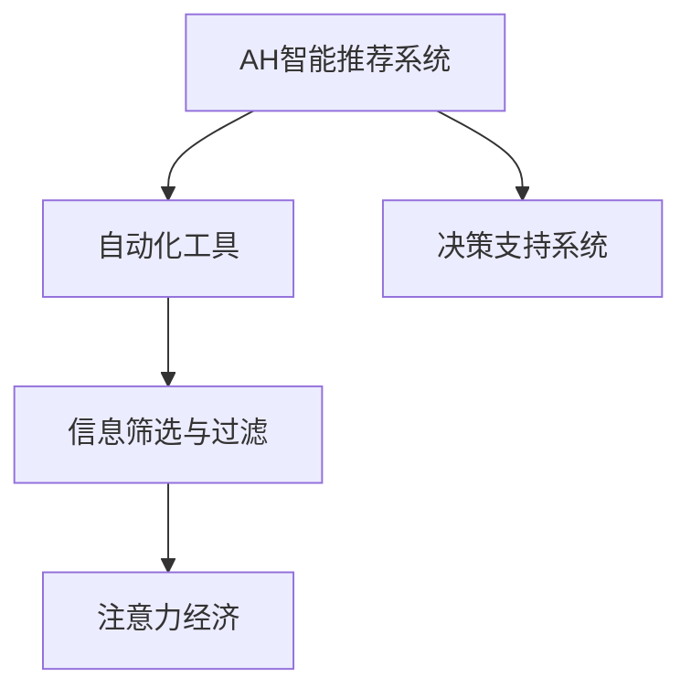

                 

# AI与人类注意力经济：未来的工作方式

> 关键词：人工智能,注意力经济,未来工作,自动化,人类协作

## 1. 背景介绍

在数字化经济时代，人工智能(AI)正在以前所未有的速度重塑我们的工作和生活方式。AI技术的迅猛发展不仅在自动化和智能化方面取得了显著进展，更在人类注意力资源的重新分配上展现出深远影响。本文将深入探讨AI与人类注意力经济之间的关系，剖析AI如何改变未来工作方式，并为各行各业的从业者提供实用的建议和策略。

### 1.1 问题由来

随着AI技术的不断进步，自动化和智能化的应用场景越来越广泛。从简单的文字处理到复杂的决策制定，AI已经深入到各行各业。然而，AI的发展并非一帆风顺，也带来了诸多挑战和问题。其中，人类注意力经济的影响尤为显著。

人类注意力经济指的是在信息爆炸的时代，人类注意力资源的稀缺性日益凸显。人们需要花费更多的时间和精力来筛选、评估和吸收信息，而AI技术却在这一领域提供了前所未有的助力。

### 1.2 问题核心关键点

AI与人类注意力经济之间的关系主要体现在以下几个方面：

1. **信息筛选与过滤**：AI可以通过算法快速筛选海量信息，帮助人类在信息海洋中快速定位到有价值的内容，节省时间和精力。

2. **智能推荐系统**：基于用户行为数据的分析，AI可以为用户提供个性化的内容推荐，进一步优化信息获取的效率和质量。

3. **决策辅助**：AI通过数据分析和模式识别，辅助人类进行决策制定，提升决策的准确性和效率。

4. **自动化工具**：AI驱动的自动化工具可以执行重复性高、低价值的任务，释放人类注意力资源，专注于更具创造性和战略性的工作。

### 1.3 问题研究意义

深入理解AI与人类注意力经济的关系，对于提高工作效率、优化信息管理、促进人类协作具有重要意义。本文旨在探讨AI如何在未来工作方式中发挥作用，帮助从业者更好地适应这一变革，同时也能为AI技术的进一步发展提供理论和实践指导。

## 2. 核心概念与联系

### 2.1 核心概念概述

为更好地理解AI与人类注意力经济之间的关系，本节将介绍几个密切相关的核心概念：

- **人工智能(AI)**：一种通过模拟人类智能行为（如学习、推理、自我修正等）的机器智能。
- **自动化(Automatication)**：使用AI技术自动执行重复性、低价值的任务，提高工作效率。
- **智能推荐系统(Recommendation System)**：基于用户行为数据，通过AI算法向用户推荐个性化内容，提升信息获取效率。
- **决策支持系统(Decision Support System, DSS)**：使用AI技术辅助人类进行决策，提供数据分析和建议。
- **注意力经济(Attention Economy)**：在信息爆炸时代，人类注意力资源变得稀缺，AI通过信息筛选和过滤，优化信息获取和处理效率。

这些核心概念之间的关系可以通过以下Mermaid流程图来展示：



这个流程图展示了AI在自动化、智能推荐、决策支持、信息筛选和注意力经济中的作用及其相互关系。

## 3. 核心算法原理 & 具体操作步骤

### 3.1 算法原理概述

基于AI的智能推荐系统和决策支持系统，核心原理在于利用机器学习和大数据技术，通过对用户行为数据的分析，预测用户需求和行为，从而提供个性化的推荐和决策支持。其核心思想是通过数据的收集和处理，构建用户画像，并在此基础上进行个性化推荐和辅助决策。

### 3.2 算法步骤详解

基于AI的智能推荐系统和决策支持系统一般包括以下几个关键步骤：

**Step 1: 数据收集与预处理**
- 收集用户的历史行为数据，如浏览记录、购买历史、搜索查询等。
- 对数据进行清洗、去重、归一化等预处理，确保数据质量。

**Step 2: 用户画像构建**
- 使用机器学习算法对用户数据进行建模，构建用户画像，包括兴趣偏好、行为习惯等。
- 常用的机器学习算法包括协同过滤、深度学习、强化学习等。

**Step 3: 模型训练与优化**
- 根据用户画像和推荐目标，选择合适的推荐算法（如基于内容的推荐、协同过滤推荐等）。
- 使用训练集对推荐模型进行训练，并使用验证集进行参数调优。

**Step 4: 个性化推荐**
- 将新的用户行为数据输入模型，预测用户可能感兴趣的内容或物品。
- 使用推荐算法生成个性化推荐列表，提供给用户。

**Step 5: 决策辅助**
- 收集用户的反馈数据，评估推荐效果。
- 根据反馈数据不断优化模型，提升推荐和决策的准确性。

### 3.3 算法优缺点

基于AI的智能推荐系统和决策支持系统具有以下优点：
1. 效率高：AI可以快速处理大量数据，提供个性化的推荐和决策支持。
2. 准确性高：AI模型能够从大量数据中提取有价值的信息，提升推荐和决策的准确性。
3. 可扩展性：AI模型可以处理多种类型的数据，适应不同的应用场景。

同时，该方法也存在一定的局限性：
1. 数据依赖：AI模型的效果很大程度上依赖于数据的质量和数量，数据收集和预处理成本较高。
2. 模型复杂：AI模型的构建和优化过程复杂，需要一定的技术积累和资源投入。
3. 可解释性不足：AI模型的决策过程通常缺乏可解释性，难以对其推理逻辑进行分析和调试。
4. 隐私和安全：AI模型需要收集和分析大量用户数据，涉及隐私和安全问题。

尽管存在这些局限性，但就目前而言，基于AI的智能推荐和决策支持系统已经成为提升信息管理和决策效率的重要手段。未来相关研究的重点在于如何进一步降低数据收集和预处理的成本，提高模型的可解释性和隐私保护，同时兼顾决策的透明性和安全性等因素。

### 3.4 算法应用领域

基于AI的智能推荐系统和决策支持系统已经在电子商务、金融、医疗、教育等多个领域得到了广泛的应用，具体如下：

1. **电子商务**：电商平台使用AI推荐系统为用户推荐商品，提升购物体验和转化率。
2. **金融**：金融机构使用AI决策支持系统进行风险评估和投资分析，优化投资组合。
3. **医疗**：医疗系统使用AI推荐系统为患者推荐个性化的治疗方案，提升治疗效果。
4. **教育**：在线教育平台使用AI推荐系统为学生推荐学习内容，提升学习效果。

除了这些经典应用外，AI的智能推荐和决策支持技术也被创新性地应用于更多场景中，如智能客服、智能家居、智慧城市等，为各行各业带来智能化升级。随着AI技术的不断发展，相信其在人类注意力经济中的应用将更加广泛，进一步提升信息处理和决策制定的效率。

## 4. 数学模型和公式 & 详细讲解

### 4.1 数学模型构建

本节将使用数学语言对基于AI的智能推荐系统进行更加严格的刻画。

记用户集合为 $U$，物品集合为 $I$，历史行为数据为 $D=\{(x_i,y_i)\}_{i=1}^N$，其中 $x_i$ 为行为数据， $y_i$ 为物品标签。定义推荐模型为 $M$，则推荐任务可以表示为最大化用户满意度：

$$
\max_{M} \sum_{u \in U} \sum_{i \in I} p(u,i) \cdot f(u,M(x_i))
$$

其中 $p(u,i)$ 为用户 $u$ 对物品 $i$ 的偏好概率，$f(u,M(x_i))$ 为推荐模型 $M$ 在行为数据 $x_i$ 上的推荐效果。

### 4.2 公式推导过程

基于协同过滤推荐算法，假设用户 $u$ 对物品 $i$ 的评分可以表示为：

$$
p(u,i) = \frac{1}{Z_u} \sum_{j \in N(u)} \alpha_{u,j} r(i,j)
$$

其中 $N(u)$ 为与用户 $u$ 交互过的物品集合，$Z_u$ 为归一化因子，$\alpha_{u,j}$ 为用户 $u$ 对物品 $j$ 的兴趣权重，$r(i,j)$ 为物品 $j$ 的评分。

推荐模型的目标函数为：

$$
\min_{M} \sum_{u \in U} \sum_{i \in I} \sum_{j \in N(u)} \omega_{u,j} \cdot (y_{i,j} - M(x_i))^2
$$

其中 $\omega_{u,j}$ 为损失函数的权重。

通过最小二乘法求解上述目标函数，可以得到推荐模型 $M$ 的参数。

### 4.3 案例分析与讲解

以下我们以电商平台的商品推荐为例，给出基于协同过滤算法的推荐系统实现。

首先，定义数据处理函数：

```python
from pyspark.sql import SparkSession
from pyspark.sql.functions import col

spark = SparkSession.builder.getOrCreate()

# 定义数据表
user_table = spark.table("user_table")
item_table = spark.table("item_table")
rating_table = spark.table("rating_table")

# 用户-物品评分数据
rating_data = user_table.join(item_table, on=["user_id", "item_id"])
```

然后，构建协同过滤推荐模型：

```python
from pyspark.ml.recommendation import ALS

# 协同过滤推荐模型
als = ALS(k=10, maxIter=10, regParam=0.1, userCol="user_id", itemCol="item_id", ratingCol="rating")
model = als.fit(rating_data)

# 预测推荐
user_item_pairs = user_table.join(item_table, on=["user_id", "item_id"])
recommendations = model.transform(user_item_pairs)
recommendations.show(truncate=False)
```

最后，输出推荐结果：

```python
recommendations.select("user_id", "item_id", "prediction").show(truncate=False)
```

以上就是基于协同过滤算法的推荐系统完整代码实现。可以看到，通过Spark MLlib库，协同过滤推荐算法得到了简洁高效的实现。

## 5. 项目实践：代码实例和详细解释说明

### 5.1 开发环境搭建

在进行推荐系统实践前，我们需要准备好开发环境。以下是使用Python进行PySpark开发的环境配置流程：

1. 安装Anaconda：从官网下载并安装Anaconda，用于创建独立的Python环境。

2. 创建并激活虚拟环境：
```bash
conda create -n spark-env python=3.8 
conda activate spark-env
```

3. 安装PySpark：根据CUDA版本，从官网获取对应的安装命令。例如：
```bash
conda install pyspark -c conda-forge
```

4. 安装各类工具包：
```bash
pip install numpy pandas scikit-learn matplotlib tqdm jupyter notebook ipython
```

完成上述步骤后，即可在`spark-env`环境中开始推荐系统开发。

### 5.2 源代码详细实现

这里我们以基于协同过滤的推荐系统为例，给出使用PySpark进行电商商品推荐的PySpark代码实现。

首先，定义推荐系统的数据处理函数：

```python
from pyspark.sql.functions import col, expr

# 定义数据处理函数
def process_data(spark, data_path):
    # 读取数据
    df = spark.read.csv(data_path, header=True)
    
    # 用户-物品评分数据
    user_table = df.select(col("user_id"), col("item_id"), col("rating"))
    item_table = df.select(col("item_id"), col("item_name"))
    rating_table = df.select(col("user_id"), col("item_id"), col("rating"))
    
    # 返回处理后的数据
    return user_table, item_table, rating_table

# 数据处理
spark = SparkSession.builder.getOrCreate()
user_table, item_table, rating_table = process_data(spark, "data.csv")

# 数据处理结果
user_table.show(truncate=False)
item_table.show(truncate=False)
rating_table.show(truncate=False)
```

然后，构建协同过滤推荐模型：

```python
from pyspark.ml.recommendation import ALS

# 协同过滤推荐模型
als = ALS(k=10, maxIter=10, regParam=0.1, userCol="user_id", itemCol="item_id", ratingCol="rating")
model = als.fit(rating_table)

# 预测推荐
recommendations = model.transform(user_table)
recommendations.show(truncate=False)
```

最后，输出推荐结果：

```python
recommendations.select("user_id", "item_id", "prediction").show(truncate=False)
```

以上就是使用PySpark进行电商商品推荐的完整代码实现。可以看到，通过PySpark的强大处理能力，协同过滤推荐算法得到了高效的实现。

### 5.3 代码解读与分析

让我们再详细解读一下关键代码的实现细节：

**数据处理函数**：
- `process_data`函数：读取原始数据，进行必要的清洗和处理，构建用户表、物品表和评分表。

**协同过滤推荐模型**：
- 使用`ALS`算法构建协同过滤推荐模型，设置参数`k`为10，最大迭代次数为10，正则化参数为0.1。
- 使用`fit`方法对评分数据进行训练，得到推荐模型。
- 使用训练好的模型对用户表进行预测，生成推荐结果。

**输出推荐结果**：
- 使用`show`方法输出推荐结果，展示用户ID、物品ID和推荐评分。

可以看到，通过PySpark库，协同过滤推荐算法的实现变得简洁高效。开发者可以将更多精力放在数据处理、模型改进等高层逻辑上，而不必过多关注底层的实现细节。

当然，工业级的系统实现还需考虑更多因素，如模型的保存和部署、超参数的自动搜索、更灵活的任务适配层等。但核心的推荐范式基本与此类似。

## 6. 实际应用场景

### 6.1 智能客服系统

基于AI的智能推荐技术可以广泛应用于智能客服系统的构建。传统客服往往需要配备大量人力，高峰期响应缓慢，且一致性和专业性难以保证。而使用AI推荐系统，可以7x24小时不间断服务，快速响应客户咨询，用个性化推荐引导客户查询，提供更优质的服务体验。

在技术实现上，可以收集企业内部的历史客服对话记录，将问题和最佳答复构建成推荐数据，在此基础上对推荐模型进行训练。训练好的模型能够自动推荐最佳答复，辅助客服人员快速响应客户，提升客户满意度。

### 6.2 金融舆情监测

金融机构需要实时监测市场舆论动向，以便及时应对负面信息传播，规避金融风险。传统的人工监测方式成本高、效率低，难以应对网络时代海量信息爆发的挑战。基于AI的推荐技术可应用于金融舆情监测，通过实时抓取网络舆情数据，生成情感分析报告，预警潜在的市场风险。

具体而言，可以收集金融领域相关的新闻、报道、评论等文本数据，并对其进行情感标注。在此基础上对推荐模型进行微调，使其能够自动判断文本的情感倾向，生成情感分析报告，帮助机构及时发现和应对负面舆情，避免因舆情波动带来的金融风险。

### 6.3 个性化推荐系统

当前的推荐系统往往只依赖用户的历史行为数据进行物品推荐，无法深入理解用户的真实兴趣偏好。基于AI的推荐技术可以更好地挖掘用户行为背后的语义信息，从而提供更精准、多样的推荐内容。

在实践中，可以收集用户浏览、点击、评论、分享等行为数据，提取和用户交互的物品标题、描述、标签等文本内容。将文本内容作为模型输入，用户的后续行为（如是否点击、购买等）作为监督信号，在此基础上对推荐模型进行微调。微调后的模型能够从文本内容中准确把握用户的兴趣点。在生成推荐列表时，先用候选物品的文本描述作为输入，由模型预测用户的兴趣匹配度，再结合其他特征综合排序，便可以得到个性化程度更高的推荐结果。

### 6.4 未来应用展望

随着AI技术的不断发展，基于推荐系统的应用场景将更加广泛，为各行各业带来智能化升级。

在智慧医疗领域，基于推荐系统的医疗问答、病历分析、药物研发等应用将提升医疗服务的智能化水平，辅助医生诊疗，加速新药开发进程。

在智能教育领域，推荐技术可应用于作业批改、学情分析、知识推荐等方面，因材施教，促进教育公平，提高教学质量。

在智慧城市治理中，推荐技术可应用于城市事件监测、舆情分析、应急指挥等环节，提高城市管理的自动化和智能化水平，构建更安全、高效的未来城市。

此外，在企业生产、社会治理、文娱传媒等众多领域，基于推荐系统的AI应用也将不断涌现，为经济社会发展注入新的动力。相信随着技术的日益成熟，推荐技术将成为AI技术落地应用的重要范式，推动人工智能技术在垂直行业的规模化落地。

## 7. 工具和资源推荐

### 7.1 学习资源推荐

为了帮助开发者系统掌握推荐系统的理论基础和实践技巧，这里推荐一些优质的学习资源：

1. 《推荐系统》系列书籍：由推荐系统专家撰写，深入浅出地介绍了推荐系统的原理、算法和应用。
2. CS391《信息检索》课程：麻省理工学院开设的信息检索课程，涵盖了推荐系统的基础理论和技术实现。
3. 《Deep Learning for Recommendation Systems》书籍：由深度学习专家撰写，全面介绍了基于深度学习的推荐系统。
4. KDD推荐系统竞赛：国际顶级推荐系统竞赛，涵盖推荐系统的最新技术和实践经验。
5. 《推荐系统设计与实践》课程：斯坦福大学开设的推荐系统课程，提供深入的理论分析和实际应用案例。

通过对这些资源的学习实践，相信你一定能够快速掌握推荐系统的精髓，并用于解决实际的推荐问题。

### 7.2 开发工具推荐

高效的开发离不开优秀的工具支持。以下是几款用于推荐系统开发的常用工具：

1. PySpark：基于Python的分布式计算框架，适合处理大规模数据。
2. TensorFlow：由Google主导开发的开源深度学习框架，生产部署方便，适合大规模工程应用。
3. Apache Flink：分布式流处理框架，适合处理实时数据。
4. Elasticsearch：开源搜索和分析引擎，适合进行实时数据查询和分析。
5. Apache Kafka：分布式消息队列，适合处理高吞吐量的数据流。

合理利用这些工具，可以显著提升推荐系统的开发效率，加快创新迭代的步伐。

### 7.3 相关论文推荐

推荐系统的发展源于学界的持续研究。以下是几篇奠基性的相关论文，推荐阅读：

1. *Collaborative Filtering for Implicit Feedback Datasets*：提出基于协同过滤的推荐系统，通过用户-物品评分数据进行推荐。
2. *The Bellkhop of the Web*：提出基于隐式反馈的协同过滤推荐算法，通过矩阵分解方法进行推荐。
3. *Field-Aware Factorization Machines for Sponsored Search*：提出基于上下文特征的推荐系统，提升推荐效果。
4. *Neural Collaborative Filtering*：提出基于深度学习的推荐系统，利用神经网络进行用户画像构建和推荐生成。
5. *Matrix Factorization Techniques for Recommender Systems*：全面介绍了矩阵分解方法在推荐系统中的应用。

这些论文代表了大规模推荐系统的最新进展。通过学习这些前沿成果，可以帮助研究者把握学科前进方向，激发更多的创新灵感。

## 8. 总结：未来发展趋势与挑战

### 8.1 总结

本文对基于AI的推荐系统进行了全面系统的介绍。首先阐述了AI与人类注意力经济之间的关系，明确了推荐系统在优化信息获取和决策制定方面的独特价值。其次，从原理到实践，详细讲解了推荐系统的数学原理和关键步骤，给出了推荐任务开发的完整代码实例。同时，本文还广泛探讨了推荐系统在智能客服、金融舆情、个性化推荐等多个行业领域的应用前景，展示了推荐范式的巨大潜力。此外，本文精选了推荐系统的各类学习资源，力求为读者提供全方位的技术指引。

通过本文的系统梳理，可以看到，基于AI的推荐系统正在成为NLP领域的重要范式，极大地拓展了预训练语言模型的应用边界，催生了更多的落地场景。受益于大规模语料的预训练，推荐模型以更低的时间和标注成本，在小样本条件下也能取得不错的效果，有力推动了NLP技术的产业化进程。未来，伴随预训练语言模型和微调方法的持续演进，相信NLP技术将在更广阔的应用领域大放异彩，深刻影响人类的生产生活方式。

### 8.2 未来发展趋势

展望未来，基于AI的推荐系统将呈现以下几个发展趋势：

1. 推荐算法的创新：随着深度学习技术的发展，未来将涌现更多高效的推荐算法，如基于知识图谱的推荐、基于生成模型的推荐等。

2. 推荐系统的泛化性提升：通过引入多源数据和跨领域迁移学习，推荐系统将能够适应更广泛的应用场景，提升推荐效果。

3. 用户兴趣动态建模：推荐系统将进一步提升对用户兴趣变化的感知和预测能力，提供动态个性化的推荐服务。

4. 推荐系统的可解释性增强：通过引入可解释性模型和解释工具，推荐系统将能够提供更加透明和可信的推荐理由。

5. 推荐系统的隐私保护：推荐系统将通过隐私保护技术，确保用户数据的安全和匿名性。

6. 推荐系统的多模态融合：通过融合视觉、音频等多模态信息，推荐系统将能够提供更加全面和个性化的推荐服务。

以上趋势凸显了推荐系统技术的广阔前景。这些方向的探索发展，必将进一步提升推荐系统的性能和应用范围，为经济社会发展注入新的动力。

### 8.3 面临的挑战

尽管基于AI的推荐系统已经取得了显著成就，但在迈向更加智能化、普适化应用的过程中，它仍面临着诸多挑战：

1. 数据隐私问题：推荐系统需要收集和分析大量用户数据，涉及隐私和安全问题。如何在不泄露隐私的前提下，利用数据提升推荐效果，是亟需解决的问题。

2. 算法复杂性：推荐算法的构建和优化过程复杂，需要一定的技术积累和资源投入。如何在保证效果的同时，降低算法复杂度，提高效率，也是一大挑战。

3. 推荐系统的鲁棒性：推荐系统面对新数据和新场景时，泛化性能往往大打折扣。如何在不同的数据和场景下，保证推荐系统的稳定性，是未来需要关注的问题。

4. 推荐系统的可解释性：推荐系统的决策过程通常缺乏可解释性，难以对其推理逻辑进行分析和调试。如何在不降低效果的前提下，提升推荐系统的可解释性，是未来的重要课题。

5. 推荐系统的扩展性：推荐系统需要处理大规模数据，如何在大规模数据和高并发场景下保证系统的扩展性和稳定性，是另一大挑战。

这些挑战凸显了推荐系统技术在实际应用中的复杂性和难度。只有从技术、伦理、社会等多个维度进行全面优化，才能真正实现AI技术在推荐系统中的应用价值。

### 8.4 研究展望

面对推荐系统面临的挑战，未来的研究需要在以下几个方面寻求新的突破：

1. 研究基于多源数据和跨领域迁移学习的推荐系统，提升系统的泛化性和鲁棒性。

2. 探索基于深度学习、生成模型等高效算法的推荐系统，提升推荐效果和效率。

3. 引入可解释性模型和解释工具，增强推荐系统的透明性和可信度。

4. 开发隐私保护技术，确保用户数据的安全和匿名性。

5. 引入多模态信息融合技术，提供更加全面和个性化的推荐服务。

6. 研究推荐系统的扩展性和稳定性，确保其在高并发和大规模数据场景下的稳定运行。

这些研究方向的探索，必将引领推荐系统技术迈向更高的台阶，为构建智能、安全、可信的推荐系统提供理论和技术支持。相信在学界和产业界的共同努力下，推荐系统将进一步发挥其价值，推动AI技术在各个行业的应用和落地。

## 9. 附录：常见问题与解答

**Q1：推荐系统是否适用于所有应用场景？**

A: 推荐系统适用于各种推荐任务，如商品推荐、新闻推荐、广告推荐等。但对于某些需要高度专业判断的任务，如法律咨询、医疗诊断等，推荐系统往往难以满足要求。

**Q2：推荐系统如何提高推荐效果？**

A: 推荐系统可以通过以下方法提高推荐效果：
1. 数据预处理：对原始数据进行清洗、去重、归一化等预处理，提升数据质量。
2. 用户画像构建：通过机器学习算法，构建用户画像，了解用户的兴趣和行为特征。
3. 推荐算法选择：选择适合的推荐算法，如协同过滤、基于内容的推荐、深度学习推荐等。
4. 模型优化：使用验证集进行参数调优，优化模型效果。

**Q3：推荐系统如何应对数据隐私问题？**

A: 推荐系统可以通过以下方法应对数据隐私问题：
1. 数据匿名化：对用户数据进行去标识化处理，确保用户隐私安全。
2. 差分隐私：在推荐模型中引入差分隐私机制，保护用户隐私的同时提升推荐效果。
3. 联邦学习：通过联邦学习技术，在多个数据源上协同训练推荐模型，减少对单个数据源的依赖。

**Q4：推荐系统如何应对推荐偏差？**

A: 推荐系统可以通过以下方法应对推荐偏差：
1. 多样性约束：在推荐模型中加入多样性约束，避免过度集中于少数热门商品或内容。
2. 公平性优化：通过公平性算法，确保不同用户和不同商品得到公平的推荐机会。
3. 用户反馈收集：收集用户反馈，调整推荐策略，提升推荐效果。

**Q5：推荐系统如何优化用户体验？**

A: 推荐系统可以通过以下方法优化用户体验：
1. 个性化推荐：通过用户画像和行为数据，提供个性化推荐，提升用户满意度。
2. 动态推荐：根据用户行为变化，实时调整推荐策略，提供动态推荐服务。
3. 推荐解释：通过解释推荐理由，增强用户对推荐结果的理解和信任。

这些方法将进一步提升推荐系统的用户体验和推荐效果。相信随着技术的不断进步，推荐系统将在更多领域发挥其价值，为经济社会发展带来新的动力。

---

作者：禅与计算机程序设计艺术 / Zen and the Art of Computer Programming

