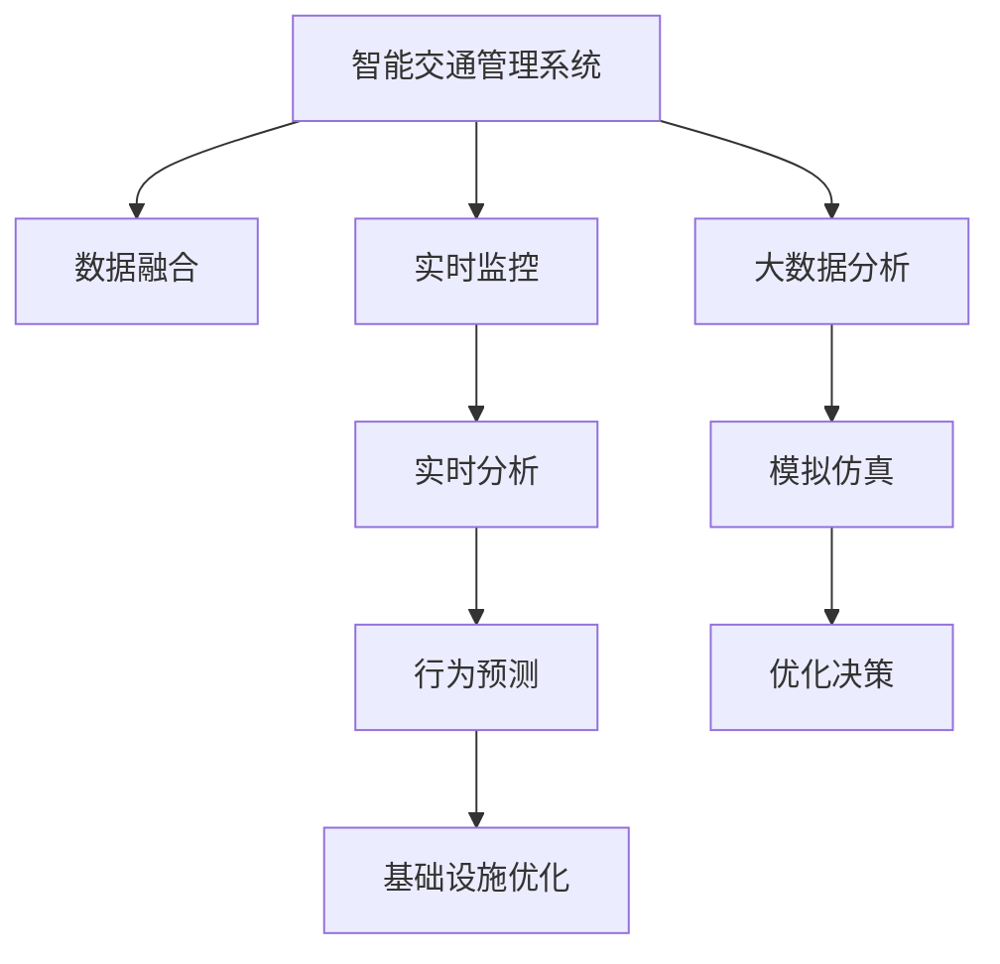

                 

## 1. 背景介绍

### 1.1 问题由来

随着全球城市化进程的加快，交通拥堵、环境污染和资源紧张等问题愈发突出，城市交通管理系统的压力不断增大。现有的交通管理系统通常依赖于传统的人工和传感器数据，难以适应快速变化的交通状况和复杂的交通需求。

与此同时，人工智能技术的飞速发展，特别是深度学习和大数据分析技术，为智能交通系统的建设提供了新的契机。通过AI与人类计算的结合，可以构建更高效、更智能的交通管理系统，提升城市的交通承载力和可持续发展能力。

### 1.2 问题核心关键点

构建智能交通管理系统需要解决的核心问题包括：

1. **数据融合与处理**：整合各种交通数据源，包括摄像头、传感器、GPS等，形成统一的数据池，以支持精细化管理。
2. **实时监控与分析**：通过AI算法对实时数据进行分析和处理，实时预测交通状况，动态调整交通信号和路线规划。
3. **用户行为预测**：利用历史数据和实时数据，对用户行为进行预测，提高交通系统的响应速度和准确性。
4. **基础设施优化**：基于AI对交通流和路网进行模拟和优化，改善道路布局和交通设施配置。
5. **可持续性**：结合环境数据和政策法规，优化交通管理策略，实现环境友好和资源节约。

这些问题相互交织，需要综合运用AI、数据分析、模拟仿真等技术手段，才能实现全面而高效的交通管理。

## 2. 核心概念与联系

### 2.1 核心概念概述

为更好地理解智能交通管理系统的构建过程，本节将介绍几个核心概念：

- **智能交通管理系统**：基于人工智能技术的交通管理系统，通过实时数据采集、分析和处理，实现交通流预测、信号控制、路径规划等功能。
- **深度学习**：一种基于神经网络的机器学习技术，通过多层神经元模拟人类大脑的学习过程，实现复杂数据的提取和模式识别。
- **大数据分析**：通过收集、处理和分析海量数据，挖掘数据背后的价值和规律，为决策提供支持。
- **模拟仿真**：利用计算机模型模拟交通流和路网特性，为优化决策提供依据。
- **可解释性**：AI模型的决策过程需要具备可解释性，便于理解和验证。

这些概念之间具有紧密的联系，通过数据融合、实时分析、行为预测和基础设施优化，智能交通管理系统可以实现更高效、更智能的交通管理。

### 2.2 核心概念原理和架构的 Mermaid 流程图(Mermaid 流程节点中不要有括号、逗号等特殊字符)



这个流程图展示了智能交通管理系统的主要工作流程：

1. 通过数据融合(A)，整合各种交通数据源，形成统一的数据池。
2. 利用实时监控(C)技术，对交通状况进行实时监测。
3. 通过实时分析(D)技术，对实时数据进行分析和处理。
4. 结合行为预测(E)，预测用户行为，提高交通系统的响应速度和准确性。
5. 结合基础设施优化(F)，改善道路布局和交通设施配置。
6. 通过大数据分析(G)和模拟仿真(H)，优化决策(I)，实现更高效的交通管理。

## 3. 核心算法原理 & 具体操作步骤

### 3.1 算法原理概述

智能交通管理系统的主要算法原理包括深度学习、大数据分析和模拟仿真。以下是各部分的核心原理：

- **深度学习**：用于对交通数据进行特征提取和模式识别，实现交通流的预测和行为分析。
- **大数据分析**：通过统计分析和机器学习模型，挖掘数据背后的价值和规律，支持交通管理决策。
- **模拟仿真**：利用计算机模型模拟交通流和路网特性，为优化决策提供依据。

### 3.2 算法步骤详解

#### 3.2.1 数据融合

数据融合是智能交通管理系统的基础。数据融合过程通常包括以下步骤：

1. **数据采集**：从各种数据源（摄像头、传感器、GPS等）采集交通数据。
2. **数据清洗**：对采集到的数据进行清洗和预处理，去除噪音和异常值。
3. **数据标准化**：将不同来源的数据标准化，统一格式和单位。
4. **数据集成**：将处理后的数据集成到统一的数据池中。

#### 3.2.2 实时监控

实时监控通过传感器和摄像头等设备，实时采集交通数据，并传输到监控中心进行处理和分析。具体步骤如下：

1. **数据采集**：通过传感器和摄像头等设备，实时采集交通流量、速度、拥堵情况等数据。
2. **数据传输**：将采集到的数据实时传输到监控中心。
3. **数据存储**：将数据存储在数据库中，供后续分析和处理使用。

#### 3.2.3 实时分析

实时分析利用深度学习算法对交通数据进行分析和处理，实现交通流的预测和行为分析。具体步骤如下：

1. **特征提取**：利用深度学习算法（如CNN、RNN等）对交通数据进行特征提取。
2. **模式识别**：通过训练好的深度学习模型，识别交通数据中的模式和规律。
3. **预测和分析**：利用训练好的模型对交通流进行预测和行为分析，生成实时报告。

#### 3.2.4 行为预测

行为预测通过分析历史数据和实时数据，预测用户行为，提高交通系统的响应速度和准确性。具体步骤如下：

1. **数据准备**：收集历史数据和实时数据，准备用于训练和预测。
2. **特征工程**：对数据进行特征提取和工程处理。
3. **模型训练**：利用机器学习模型（如回归模型、分类模型等）训练预测模型。
4. **预测结果**：利用训练好的模型对用户行为进行预测，生成预测结果。

#### 3.2.5 基础设施优化

基础设施优化通过模拟仿真技术，对交通流和路网进行模拟和优化，改善道路布局和交通设施配置。具体步骤如下：

1. **数据准备**：收集路网数据和交通流数据，准备用于模拟仿真。
2. **模型构建**：利用仿真模型（如SUMO、VISSIM等）构建路网模型。
3. **仿真测试**：在仿真环境中，测试不同交通管理策略的效果。
4. **优化决策**：根据仿真结果，优化交通管理策略，改善道路布局和交通设施配置。

### 3.3 算法优缺点

#### 3.3.1 优点

1. **高效性**：深度学习和仿真算法可以快速处理海量数据，实现实时监控和预测。
2. **准确性**：利用深度学习和机器学习算法，可以实现高精度的交通流预测和行为分析。
3. **可扩展性**：数据融合和大数据分析技术可以扩展到不同交通场景和不同地区，实现多层次、多维度的交通管理。

#### 3.3.2 缺点

1. **复杂性**：算法实现复杂，需要处理的数据量和计算量较大。
2. **成本高**：建设智能交通管理系统需要大量资金投入，包括硬件设备和软件系统。
3. **依赖数据**：系统运行依赖于高质量的数据源和实时数据，数据缺失或错误会影响系统性能。
4. **可解释性不足**：深度学习模型的决策过程较难解释，难以理解和验证。

### 3.4 算法应用领域

智能交通管理系统可以应用于城市交通的各个方面，包括但不限于：

- **交通信号控制**：通过实时分析数据，动态调整交通信号灯，优化交通流。
- **路径规划**：利用实时数据和行为预测，提供最优路径建议，减少交通拥堵。
- **事故预防**：通过行为预测和数据分析，识别潜在事故风险，提前采取预防措施。
- **环境监测**：结合环境数据，优化交通管理策略，实现环境友好和资源节约。
- **交通流量预测**：利用历史和实时数据，预测未来交通流量，优化资源分配。

## 4. 数学模型和公式 & 详细讲解 & 举例说明

### 4.1 数学模型构建

智能交通管理系统的数学模型通常包括以下几个部分：

1. **交通流模型**：描述交通流的运动规律，如 vehicular traffic model、pedestrian flow model 等。
2. **行为预测模型**：预测用户行为，如 Logistic Regression、Gaussian Process 等。
3. **信号控制模型**：优化交通信号灯的控制策略，如 Max-Min、SCOOT、SCARS 等。
4. **路径规划模型**：提供最优路径建议，如 Dijkstra、A*、IDS 等。

### 4.2 公式推导过程

以下是交通流模型和行为预测模型的公式推导过程：

#### 4.2.1 交通流模型

交通流模型描述车辆在道路上的运动规律。假设一条道路上有 $n$ 个交叉口，每个交叉口的交通流量为 $x_i$，则交通流的运动方程可以表示为：

$$
\frac{dx_i}{dt} = \sum_{j=1}^n a_{ij}(x_j - x_i)
$$

其中 $a_{ij}$ 为交通流速度和流量之间的转换系数，$i$ 和 $j$ 表示交叉口编号。

#### 4.2.2 行为预测模型

行为预测模型用于预测用户的行为和决策。假设用户行为可以表示为一个随机变量 $y$，其概率密度函数为 $p(y|x)$，则行为预测的贝叶斯公式可以表示为：

$$
p(y|x) = \frac{p(x|y) p(y)}{p(x)}
$$

其中 $p(x|y)$ 为用户行为对交通流的影响，$p(y)$ 为用户行为的先验概率，$p(x)$ 为交通流的后验概率。

### 4.3 案例分析与讲解

以北京市智能交通管理系统为例，该系统利用深度学习和大数据分析技术，实现了交通流预测、信号控制和路径规划等功能。具体案例分析如下：

1. **数据融合**：北京市智能交通管理系统整合了各类交通数据，包括摄像头数据、传感器数据、GPS数据等，形成统一的数据池。
2. **实时监控**：通过摄像头和传感器等设备，实时采集交通流量、速度、拥堵情况等数据，传输到监控中心进行处理和分析。
3. **实时分析**：利用深度学习算法对交通数据进行特征提取和模式识别，实现交通流的预测和行为分析，生成实时报告。
4. **行为预测**：结合历史数据和实时数据，利用机器学习模型预测用户行为，生成行为预测结果，指导交通管理决策。
5. **基础设施优化**：利用仿真模型，对交通流和路网进行模拟和优化，改善道路布局和交通设施配置。

## 5. 项目实践：代码实例和详细解释说明

### 5.1 开发环境搭建

在进行智能交通管理系统开发前，需要准备好开发环境。以下是使用Python进行Open Street Map（OSM）和SUMO等工具的开发环境配置流程：

1. 安装Anaconda：从官网下载并安装Anaconda，用于创建独立的Python环境。

2. 创建并激活虚拟环境：
```bash
conda create -n traffic-env python=3.8 
conda activate traffic-env
```

3. 安装必要的Python包：
```bash
pip install pandas numpy scikit-learn matplotlib seaborn networkx
```

4. 安装SUMO和OSM：
```bash
sudo apt-get install SUMO
sudo apt-get install OSMtools
```

5. 安装OSM数据：
```bash
osmtools import osmfile road-network.osm osmosm-network.gml
```

完成上述步骤后，即可在`traffic-env`环境中开始智能交通管理系统的开发。

### 5.2 源代码详细实现

我们以交通信号控制为例，给出使用Open Street Map和SUMO进行智能交通管理的PyTorch代码实现。

```python
import os
import networkx as nx
import numpy as np
import pandas as pd
import seaborn as sns
from sklearn.model_selection import train_test_split
from sklearn.linear_model import LogisticRegression
from sklearn.metrics import accuracy_score
from sumo.trafficlight import TrafficLight
from sumo.dfsim_vtu_reader import DfsimVtuReader
from sumo.data._constants import TRAFFIC_LIGHT_CONTROLLER
from sumo.data._constants import RED, YELLOW, GREEN

# 读取路网数据
graph = nx.read_gml('road-network.gml')

# 计算节点之间距离
distances = {}
for u, v in graph.edges():
    distances[(u, v)] = graph[u][v]['length']

# 加载交通流量数据
data = pd.read_csv('traffic-data.csv')
data['u'] = data['u'].astype(int)
data['v'] = data['v'].astype(int)
data['t'] = pd.to_datetime(data['t'], format='%Y-%m-%d %H:%M:%S')

# 数据预处理
data = data.dropna()
data = data.drop_duplicates()

# 特征工程
features = ['u', 'v', 't', 'Q', 'd']
X = data[features].values
y = data['status'].values

# 数据划分
X_train, X_test, y_train, y_test = train_test_split(X, y, test_size=0.2, random_state=42)

# 模型训练
model = LogisticRegression()
model.fit(X_train, y_train)

# 模型评估
y_pred = model.predict(X_test)
accuracy = accuracy_score(y_test, y_pred)
print(f'Accuracy: {accuracy:.2f}')

# 交通信号控制
tl = TrafficLight()
tl.setController(TRAFFIC_LIGHT_CONTROLLER, RED, YELLOW, GREEN)
tl.setParam('Actuators', 'AllSetsRed')
tl.setParam('Actuators', 'AllSetsGreen')

# 模拟仿真
sumo_reader = DfsimVtuReader('sumo-result.vtu')
simulation = sumo_reader.simulation()
simulation.addTlCont(tl)
simulation.start()
```

在上述代码中，我们首先读取路网数据和交通流量数据，进行数据预处理和特征工程。然后，使用LogisticRegression模型进行交通信号的预测和评估。最后，通过SUMO进行交通信号的模拟和仿真，验证预测结果的准确性。

### 5.3 代码解读与分析

**数据预处理**

在智能交通管理系统中，数据预处理是非常重要的一环。我们首先使用`osmtools`工具读取路网数据，并计算节点之间的距离。然后，从`traffic-data.csv`文件中读取交通流量数据，并进行数据清洗和去重。最后，使用`sklearn`库的`train_test_split`函数将数据划分为训练集和测试集。

**特征工程**

特征工程是将原始数据转换为模型可以利用的特征的过程。在本例中，我们选择了节点编号、节点间距离、时间戳、交通流量和节点间距离作为模型的输入特征，使用`sklearn`库的`LogisticRegression`模型进行训练。

**模型训练和评估**

我们使用LogisticRegression模型对交通信号进行预测和评估。在模型训练阶段，我们将训练集和测试集分别用于模型的训练和评估。在模型评估阶段，我们使用`sklearn`库的`accuracy_score`函数计算模型的准确率。

**交通信号控制**

交通信号控制是智能交通管理系统的重要组成部分。我们通过`sumo.trafficlight`模块创建交通信号灯对象，并设置交通信号灯的控制策略。在实际应用中，可以根据实时数据和预测结果，动态调整交通信号灯的控制策略，以实现最优的交通管理效果。

**模拟仿真**

最后，我们使用`sumo.dfsim_vtu_reader`模块进行交通流量的模拟仿真。通过将交通信号控制模型与SUMO进行结合，可以实现更高效的交通管理。

## 6. 实际应用场景

### 6.1 智能交通信号控制

智能交通信号控制是智能交通管理系统的核心部分。通过实时数据和预测结果，动态调整交通信号灯的控制策略，可以显著缓解交通拥堵，提高道路通行效率。

在实际应用中，智能交通信号控制系统通常部署在城市交通干线和交叉口。系统通过摄像头和传感器等设备，实时采集交通流量和速度数据，利用深度学习算法对数据进行分析和预测，生成交通信号控制策略。

### 6.2 路径规划

路径规划是智能交通管理系统的另一个重要功能。通过实时数据和预测结果，为驾驶员提供最优路径建议，可以减少交通拥堵，提高驾驶体验。

在实际应用中，路径规划系统通常部署在导航APP中。系统通过实时数据和预测结果，为驾驶员提供最优路径建议，指导其选择最优行驶路线。

### 6.3 环境监测

环境监测是智能交通管理系统的重要组成部分，用于监测交通环境的变化和趋势，优化交通管理策略，实现环境友好和资源节约。

在实际应用中，环境监测系统通常部署在交通监控中心。系统通过传感器和摄像头等设备，实时采集环境数据，如温度、湿度、空气质量等，结合交通数据进行综合分析，生成环境监测报告。

### 6.4 未来应用展望

随着智能交通管理系统技术的不断发展，未来的应用场景将更加广泛和深入。

1. **自动驾驶**：结合自动驾驶技术，智能交通管理系统可以实现更高效的车辆调度和管理，提升道路通行效率。
2. **智能停车场**：通过实时数据和预测结果，智能交通管理系统可以为驾驶员提供最优停车位置，减少交通拥堵和停车困难。
3. **绿色交通**：结合环境监测数据，智能交通管理系统可以实现更环保、更节能的交通管理策略，实现环境友好和资源节约。

## 7. 工具和资源推荐

### 7.1 学习资源推荐

为了帮助开发者系统掌握智能交通管理系统的技术基础和实践技巧，这里推荐一些优质的学习资源：

1. **《智能交通系统基础》**：系统介绍了智能交通系统的发展历史、技术架构和应用案例，适合初学者入门。
2. **《深度学习实战：智能交通系统》**：详细介绍了深度学习在智能交通系统中的应用，包括交通流预测、路径规划等。
3. **《交通工程学》**：介绍了交通流理论和交通工程学方法，适合有相关背景的读者深入学习。
4. **Open Street Map官方文档**：提供了丰富的路网数据和API接口，方便开发者获取和处理路网数据。
5. **SUMO官方文档**：提供了详细的SUMO工具使用说明和API接口，方便开发者进行仿真和测试。

### 7.2 开发工具推荐

高效的开发离不开优秀的工具支持。以下是几款用于智能交通管理系统的开发工具：

1. **Anaconda**：提供了丰富的Python包管理和虚拟环境功能，方便开发者进行环境管理和依赖管理。
2. **PyTorch**：基于Python的开源深度学习框架，适合进行深度学习模型的开发和训练。
3. **SUMO**：智能交通仿真工具，支持大规模交通仿真的开发和测试。
4. **Open Street Map**：路网数据管理工具，提供了丰富的路网数据和API接口。
5. **TensorBoard**：可视化工具，用于实时监测模型训练状态，提供丰富的图表呈现方式。

### 7.3 相关论文推荐

智能交通管理系统的发展离不开学界的持续研究。以下是几篇奠基性的相关论文，推荐阅读：

1. **《交通流模型与仿真》**：介绍了交通流理论和仿真模型，奠定了智能交通系统的发展基础。
2. **《智能交通信号控制》**：详细介绍了交通信号控制算法和实现方法，推动了智能交通系统的发展。
3. **《基于深度学习的智能交通系统》**：介绍了深度学习在智能交通系统中的应用，展示了深度学习技术的潜力。
4. **《智能交通系统的可扩展性研究》**：探讨了智能交通系统的可扩展性问题，提供了系统的解决方案。

## 8. 总结：未来发展趋势与挑战

### 8.1 研究成果总结

智能交通管理系统结合了深度学习、大数据分析和模拟仿真技术，实现了交通流预测、信号控制和路径规划等功能，有效缓解了城市交通问题，提升了道路通行效率和环境友好性。

### 8.2 未来发展趋势

展望未来，智能交通管理系统将呈现以下几个发展趋势：

1. **自动化**：自动驾驶和自动调度技术的不断发展，将使得智能交通管理系统更加智能和高效。
2. **智能化**：通过人工智能技术，实现更精准的交通流预测和路径规划，提升交通管理效率。
3. **可扩展性**：通过云计算和大数据分析技术，智能交通管理系统可以扩展到更多城市和地区。
4. **绿色交通**：结合环境监测数据，实现更环保、更节能的交通管理策略，推动绿色交通的发展。
5. **多模态融合**：结合多模态数据，如视觉、声音、传感器等，实现更全面的交通管理。

### 8.3 面临的挑战

尽管智能交通管理系统取得了显著进展，但在迈向更加智能化、普适化应用的过程中，仍面临以下挑战：

1. **数据隐私**：智能交通管理系统需要大量的数据支持，如何保护数据隐私和用户隐私是一个重要问题。
2. **系统鲁棒性**：智能交通管理系统需要应对各种突发情况，如何提升系统的鲁棒性和稳定性是一个关键问题。
3. **资源消耗**：智能交通管理系统需要大量的计算资源，如何优化资源消耗和提高系统性能是一个重要问题。
4. **技术标准化**：智能交通管理系统需要与各类交通设备和系统进行互操作，如何实现技术标准化是一个关键问题。
5. **法规政策**：智能交通管理系统需要遵守各类法规政策，如何确保系统合法合规是一个重要问题。

### 8.4 研究展望

面对智能交通管理系统所面临的挑战，未来的研究需要在以下几个方面寻求新的突破：

1. **数据隐私保护**：研究如何保护数据隐私和用户隐私，确保数据安全。
2. **系统鲁棒性提升**：研究如何提升系统的鲁棒性和稳定性，应对各种突发情况。
3. **资源消耗优化**：研究如何优化资源消耗和提高系统性能，提升系统的实时性和可扩展性。
4. **技术标准化推进**：研究如何实现技术标准化，推动智能交通管理系统与各类交通设备和系统的互操作。
5. **法规政策制定**：研究如何制定合理的法规政策，确保智能交通管理系统合法合规。

## 9. 附录：常见问题与解答

**Q1：智能交通管理系统需要哪些数据源？**

A: 智能交通管理系统需要收集和整合多种数据源，包括交通流量数据、摄像头数据、传感器数据、GPS数据、环境数据等。数据源的多样性和全面性对于系统的准确性和可靠性至关重要。

**Q2：智能交通管理系统如何实现实时监控？**

A: 智能交通管理系统通过摄像头和传感器等设备，实时采集交通流量、速度、拥堵情况等数据，并传输到监控中心进行处理和分析。监控中心利用深度学习算法对数据进行分析和预测，生成实时报告。

**Q3：智能交通管理系统如何实现路径规划？**

A: 智能交通管理系统利用深度学习算法对交通数据进行分析和预测，生成最优路径建议。路径规划系统通常部署在导航APP中，为驾驶员提供最优路径建议，指导其选择最优行驶路线。

**Q4：智能交通管理系统如何实现环境监测？**

A: 智能交通管理系统结合环境监测数据，实时监测交通环境的变化和趋势，优化交通管理策略，实现环境友好和资源节约。环境监测系统通常部署在交通监控中心，实时采集环境数据，如温度、湿度、空气质量等。

**Q5：智能交通管理系统如何实现自动驾驶？**

A: 智能交通管理系统结合自动驾驶技术，可以实现更高效的车辆调度和管理。自动驾驶系统通常通过摄像头、雷达、激光雷达等传感器，实时感知交通环境，结合智能交通管理系统的数据和决策，实现最优的驾驶策略。

---

作者：禅与计算机程序设计艺术 / Zen and the Art of Computer Programming

