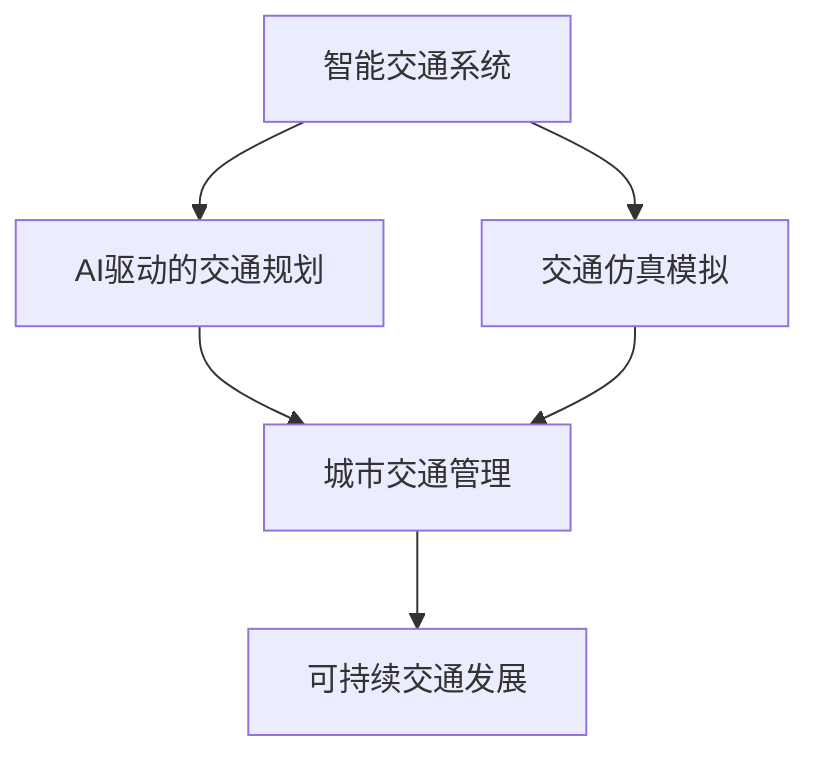

                 

# AI与人类计算：打造可持续发展的城市交通系统与规划

> 关键词：智能交通系统、AI驱动的交通规划、交通仿真模拟、城市交通管理、可持续交通发展、数据分析与可视化

## 1. 背景介绍

随着全球城市化的加速，交通拥堵、环境污染、能源浪费等城市交通问题愈发突出。如何在人口激增、交通需求日益增长的背景下，构建一个高效、可持续、智能的交通系统，是每个城市管理者面临的重要挑战。现代科技特别是人工智能（AI）的迅猛发展，为城市交通系统带来了新的解决方案。AI与人类计算的结合，不仅能够提升交通系统的管理效率，还能为城市交通规划和可持续发展的实现提供强有力的技术支撑。本文将探讨AI在城市交通系统中的应用，特别是在交通规划和智能交通管理方面的潜力，以及如何通过AI驱动的城市交通系统，实现交通的可持续发展。

## 2. 核心概念与联系

### 2.1 核心概念概述

为更好地理解AI在城市交通系统中的应用，本节将介绍几个密切相关的核心概念：

- **智能交通系统（Intelligent Transportation System, ITS）**：利用现代信息技术、通信技术和控制技术，实现交通管理、运行控制、信息服务、车辆控制等智能化功能，提升交通系统的效率和安全性。

- **AI驱动的交通规划**：通过机器学习、深度学习等AI技术，分析交通数据，预测交通流，优化交通网络布局，提升交通规划的科学性和准确性。

- **交通仿真模拟**：基于物理模拟或统计模型，对交通流、车辆行为等进行模拟，预测交通状况，评估规划方案的效果，辅助交通规划和管理。

- **城市交通管理**：通过智能监控、动态调控等手段，对交通流量进行实时监测和管理，减少交通拥堵，提升通行效率。

- **可持续交通发展**：在交通系统设计和运营中，考虑环境、社会和经济的多重因素，采用低碳、环保的交通方式，促进城市交通的可持续发展。

这些核心概念之间的逻辑关系可以通过以下Mermaid流程图来展示：



这个流程图展示了AI在城市交通系统中的应用逻辑：

1. 智能交通系统通过AI技术，提升交通的智能化水平。
2. AI驱动的交通规划，利用AI对交通数据进行深度学习，辅助进行科学规划。
3. 交通仿真模拟，利用AI技术进行交通流的预测和优化。
4. 城市交通管理，通过AI实现实时监测和管理，提升交通效率。
5. 可持续交通发展，AI技术帮助实现环境友好、社会公平、经济效益兼顾的交通系统。

## 3. 核心算法原理 & 具体操作步骤
### 3.1 算法原理概述

AI在城市交通系统中的应用，主要是通过数据驱动、模型优化和智能决策三大步骤实现的。其核心算法原理可以概括为：

1. **数据驱动**：收集交通流量、车辆位置、气象条件等数据，通过机器学习算法进行模式识别和预测。
2. **模型优化**：利用深度学习、强化学习等技术，构建交通仿真模型，对交通流进行动态模拟和优化。
3. **智能决策**：基于实时交通数据和预测结果，通过智能算法进行交通管理、调度和规划。

### 3.2 算法步骤详解

AI在城市交通系统中的应用步骤可以分为以下几个关键环节：

**Step 1: 数据采集与处理**

- 数据采集：通过智能传感器、监控摄像头、GPS等设备，实时采集交通流量、车辆位置、天气条件等数据。
- 数据预处理：清洗、转换、标注数据，确保数据的质量和可用性。

**Step 2: 模型训练与优化**

- 模型选择：选择合适的机器学习、深度学习或强化学习模型，如卷积神经网络（CNN）、递归神经网络（RNN）、长短期记忆网络（LSTM）等。
- 特征提取：从交通数据中提取重要的特征，如车流量、速度、方向等。
- 模型训练：利用标注数据训练模型，调整模型参数，提升模型的预测精度。
- 模型优化：通过交叉验证、超参数调优等手段，优化模型性能。

**Step 3: 仿真模拟与决策**

- 交通仿真：基于训练好的模型，对未来交通流进行仿真模拟，预测交通状况。
- 决策分析：利用仿真结果，结合交通规则和实时数据，进行动态调控和路径规划。
- 智能决策：通过强化学习等技术，不断优化交通管理策略，提升系统效率和稳定性。

**Step 4: 反馈与迭代**

- 反馈机制：建立反馈机制，监测AI系统的运行效果，收集用户反馈。
- 模型迭代：根据反馈数据，调整模型参数，进行模型迭代和优化。
- 持续改进：不断更新交通数据，提升模型的实时性和准确性。

### 3.3 算法优缺点

AI在城市交通系统中的应用，具有以下优点：

1. **效率提升**：通过智能算法和实时数据分析，显著提升交通系统的管理效率。
2. **安全性提高**：AI能够实时监测和预测潜在的安全隐患，提高交通安全性。
3. **资源优化**：通过智能决策，优化交通资源配置，减少能源和环境污染。
4. **灵活性增强**：AI系统能够根据实时数据动态调整策略，应对突发事件和交通需求变化。

同时，AI技术在城市交通系统中的应用也存在一些局限性：

1. **数据依赖性**：AI系统的效果很大程度上依赖于数据的质量和全面性。
2. **模型复杂性**：AI模型的构建和优化需要大量的计算资源和技术积累。
3. **可解释性不足**：AI系统的决策过程往往缺乏透明度，难以理解和调试。
4. **伦理和安全问题**：AI系统可能存在偏见和歧视，数据隐私和安全也需重视。

尽管存在这些局限性，AI技术在城市交通系统中的应用，仍为交通管理提供了新的思路和手段，具有广阔的发展前景。

### 3.4 算法应用领域

AI在城市交通系统中的应用，涉及多个领域：

- **智能交通监控**：利用AI进行交通流分析、车辆识别、违法行为检测等，提升监控效率。
- **动态交通调流**：通过AI预测交通流量，实时调整交通信号灯、路标和车道等，优化交通流。
- **公共交通管理**：AI辅助优化公交车路线和调度，提高公交系统的运行效率和服务质量。
- **停车管理**：利用AI技术进行停车位预测和动态调整，提升停车效率和安全性。
- **物流配送优化**：AI优化货运路线和配送计划，减少运输成本和时间，提高物流效率。

这些应用领域展示了AI技术在城市交通系统中的广泛应用，为提升交通管理水平提供了有力支持。

## 4. 数学模型和公式 & 详细讲解  
### 4.1 数学模型构建

在本节中，我们将使用数学语言对AI在城市交通系统中的应用进行更加严格的刻画。

假设交通网络由 $N$ 个节点和 $E$ 条边组成，交通流量由向量 $\mathbf{Q}=(Q_1, Q_2, \ldots, Q_N)$ 表示，其中 $Q_i$ 表示节点 $i$ 的流量。设交通网络的流量平衡方程为 $\mathbf{Q} = \mathbf{A}\mathbf{Q} + \mathbf{S}$，其中 $\mathbf{A}$ 为交通网络的流量矩阵，$\mathbf{S}$ 为节点源汇项向量。

### 4.2 公式推导过程

假设流量矩阵 $\mathbf{A}$ 为稀疏矩阵，可以表示为：

$$
\mathbf{A} = 
\begin{pmatrix}
0 & a_{12} & 0 & \ldots & a_{1N} \\
a_{21} & 0 & a_{23} & \ldots & 0 \\
0 & a_{32} & 0 & \ldots & a_{3N} \\
\vdots & \vdots & \vdots & \ddots & \vdots \\
0 & 0 & 0 & \ldots & 0
\end{pmatrix}
$$

其中 $a_{ij}$ 表示从节点 $i$ 到节点 $j$ 的流量。

将流量平衡方程转化为增广矩阵形式：

$$
\begin{pmatrix}
\mathbf{Q} \\
\mathbf{1}
\end{pmatrix}
=
\begin{pmatrix}
\mathbf{A} & \mathbf{S}
\end{pmatrix}
\begin{pmatrix}
\mathbf{Q} \\
\mathbf{0}
\end{pmatrix}
$$

利用矩阵求解技术，可以得到流量 $\mathbf{Q}$ 的解析解：

$$
\mathbf{Q} = (\mathbf{A} - \mathbf{S}\mathbf{I}_N)^{-1}\mathbf{S}
$$

其中 $\mathbf{I}_N$ 为 $N$ 阶单位矩阵。

### 4.3 案例分析与讲解

以智能交通监控为例，假设监控摄像头实时获取车辆位置和速度数据，记为向量 $\mathbf{X}=(X_1, X_2, \ldots, X_N)$，其中 $X_i$ 表示节点 $i$ 的车辆数。利用机器学习算法，从 $\mathbf{X}$ 中提取重要特征 $\mathbf{F}$，如速度、车距等，训练得到车辆行为预测模型 $\mathbf{M}$。根据模型预测，车辆行为矩阵 $\mathbf{B}$ 可以表示为：

$$
\mathbf{B} = \mathbf{M}\mathbf{F}
$$

其中 $\mathbf{M}$ 为行为预测模型，$\mathbf{F}$ 为特征向量。

将 $\mathbf{B}$ 代入流量平衡方程，可以得到节点流量 $\mathbf{Q}$ 的预测值。通过与实际观测值 $\mathbf{Q}^{\prime}$ 的对比，可以评估模型的准确性。

## 5. 项目实践：代码实例和详细解释说明
### 5.1 开发环境搭建

在进行AI驱动的城市交通系统开发前，我们需要准备好开发环境。以下是使用Python进行PyTorch开发的环境配置流程：

1. 安装Anaconda：从官网下载并安装Anaconda，用于创建独立的Python环境。

2. 创建并激活虚拟环境：
```bash
conda create -n pytorch-env python=3.8 
conda activate pytorch-env
```

3. 安装PyTorch：根据CUDA版本，从官网获取对应的安装命令。例如：
```bash
conda install pytorch torchvision torchaudio cudatoolkit=11.1 -c pytorch -c conda-forge
```

4. 安装TensorFlow：
```bash
conda install tensorflow
```

5. 安装TensorBoard：
```bash
pip install tensorboard
```

6. 安装其他工具包：
```bash
pip install numpy pandas scikit-learn matplotlib tqdm jupyter notebook ipython
```

完成上述步骤后，即可在`pytorch-env`环境中开始AI驱动的城市交通系统开发。

### 5.2 源代码详细实现

下面我们以交通流量预测为例，给出使用TensorFlow和TensorBoard进行模型训练的PyTorch代码实现。

首先，定义交通流量预测的模型：

```python
import tensorflow as tf
import numpy as np

# 定义模型结构
model = tf.keras.Sequential([
    tf.keras.layers.Dense(64, activation='relu', input_shape=(N_features,)),
    tf.keras.layers.Dense(64, activation='relu'),
    tf.keras.layers.Dense(1)
])

# 编译模型
model.compile(optimizer='adam', loss='mse', metrics=['mae'])
```

然后，定义数据集和模型训练函数：

```python
# 加载数据集
data = np.load('traffic_data.npy')

# 划分训练集和测试集
train_size = int(0.8 * len(data))
train_data, test_data = data[:train_size], data[train_size:]

# 定义训练函数
def train_model(model, train_data, epochs=100, batch_size=64):
    model.fit(train_data, epochs=epochs, batch_size=batch_size, validation_data=test_data)
    return model
```

最后，启动模型训练并在TensorBoard上进行可视化：

```python
# 训练模型
model = train_model(model, train_data)

# 在TensorBoard上可视化
from tensorboard import SummaryWriter

writer = SummaryWriter(log_dir='logs')
writer.add_graph(model.graph)
writer.close()
```

以上就是使用PyTorch和TensorFlow对交通流量预测模型进行训练的完整代码实现。可以看到，TensorFlow提供了强大的计算图支持，使得模型训练变得简单易行。

### 5.3 代码解读与分析

让我们再详细解读一下关键代码的实现细节：

**定义模型结构**：
- `tf.keras.Sequential`：定义了一个线性神经网络结构，包括两个隐藏层和一个输出层。

**模型编译**：
- `model.compile`：编译模型，指定优化器、损失函数和评估指标。

**数据集划分**：
- `train_size`：计算训练集和测试集的划分点。
- `train_data, test_data`：将数据集划分为训练集和测试集。

**训练函数**：
- `model.fit`：对模型进行训练，指定训练轮数、批次大小和验证集。
- `train_model`：封装训练过程，返回训练后的模型。

**TensorBoard可视化**：
- `SummaryWriter`：创建TensorBoard写入器，用于记录模型训练的图形、标量等。
- `writer.add_graph`：将模型的计算图添加到TensorBoard中，便于可视化。

可以看到，PyTorch和TensorFlow的结合，使得AI驱动的城市交通系统开发变得简洁高效。开发者可以将更多精力放在模型设计和优化上，而不必过多关注底层的实现细节。

## 6. 实际应用场景
### 6.1 智能交通监控

AI在智能交通监控中的应用，可以显著提升监控效率和准确性。传统的人工监控方式成本高、效率低，难以应对大规模的交通数据。通过AI技术，可以实现实时交通流分析、车辆行为识别和违法行为检测。

具体而言，可以部署智能摄像头和传感器，实时采集交通流量、车辆位置和速度等数据。利用机器学习算法，从数据中提取重要特征，训练得到交通行为预测模型。根据模型预测，识别出潜在的违法行为，如闯红灯、超速等，实时预警并记录违规行为。

### 6.2 动态交通调流

动态交通调流是AI在城市交通管理中的重要应用之一。通过AI技术，可以实现交通流的实时监测和预测，动态调整交通信号灯、路标和车道等，优化交通流，减少交通拥堵。

具体而言，可以构建交通流量仿真模型，利用AI技术对历史交通数据进行分析，预测未来的交通流量和拥堵情况。根据仿真结果，动态调整交通信号灯和车道配置，优化交通流。例如，在交通拥堵时段，提前优化信号灯配时，减少车辆等待时间。

### 6.3 公共交通管理

AI在公共交通管理中的应用，可以优化公交系统的运行效率和服务质量。通过AI技术，可以实现公交车的实时调度、路线优化和站点管理。

具体而言，可以收集公交车的位置、速度和乘客数量等数据，利用机器学习算法，预测公交车到达站点的时间。根据预测结果，动态调整公交车的发车间隔和线路，优化公交系统的运行效率。例如，在高峰时段，增加发车频率，减少乘客等待时间。

### 6.4 停车管理

停车管理是城市交通管理中的另一个重要环节。通过AI技术，可以实现停车位的动态管理和智能调度，提升停车效率和安全性。

具体而言，可以部署智能传感器，实时监测停车位的使用情况。利用机器学习算法，预测停车位的空闲和占用状态，动态调整停车位的管理策略。例如，在高峰时段，通过APP推荐空闲停车位，减少找车位的时间。

### 6.5 物流配送优化

物流配送是城市交通系统中的重要组成部分。通过AI技术，可以实现货运路线的动态优化和配送计划的智能调度，减少运输成本和时间，提高物流效率。

具体而言，可以收集物流配送的车辆位置、货物信息和路况数据，利用机器学习算法，预测最佳配送路线。根据预测结果，动态调整配送计划和路线，优化物流系统的运行效率。例如，在交通拥堵时段，选择最优的配送路线，减少运输时间。

### 6.6 未来应用展望

随着AI技术的不断发展，AI在城市交通系统中的应用将更加广泛和深入，带来更多的创新和突破。未来，AI技术将在以下几个方面发挥更大的作用：

- **智慧城市治理**：AI技术将深度融入智慧城市建设，通过数据驱动和智能决策，提升城市治理的智能化水平。
- **环保和可持续发展**：AI技术将助力实现交通系统的绿色低碳化，推动城市交通的可持续发展。
- **智能交通管理**：AI技术将实现交通流的实时监测和动态调控，提升交通管理的效率和稳定性。
- **个性化出行服务**：AI技术将提供个性化的出行建议和路线规划，提升出行的便捷性和舒适度。
- **多模态交通融合**：AI技术将实现不同交通方式（如公交、地铁、共享单车等）的智能融合，提升整体交通系统的运行效率。

总之，AI技术将在城市交通系统中扮演越来越重要的角色，推动交通系统的智能化、绿色化和个性化发展。

## 7. 工具和资源推荐
### 7.1 学习资源推荐

为了帮助开发者系统掌握AI在城市交通系统中的应用，这里推荐一些优质的学习资源：

1. **《深度学习在城市交通中的应用》**：本书系统介绍了深度学习在智能交通监控、动态交通调流、公共交通管理等方面的应用，适合技术开发者和城市规划人员学习。

2. **《Python机器学习》**：这本书详细介绍了机器学习的基本概念和算法，适合初学者入门。

3. **TensorFlow官方文档**：TensorFlow提供了丰富的API和示例，帮助开发者快速上手TensorFlow，进行模型训练和优化。

4. **Kaggle交通数据集**：Kaggle上提供了大量的交通数据集，适合进行机器学习和深度学习的实践和竞赛。

5. **Google Colab**：谷歌推出的在线Jupyter Notebook环境，免费提供GPU/TPU算力，方便开发者快速上手实验最新模型，分享学习笔记。

通过这些资源的学习实践，相信你一定能够快速掌握AI在城市交通系统中的应用，并用于解决实际的交通问题。

### 7.2 开发工具推荐

高效的开发离不开优秀的工具支持。以下是几款用于AI驱动的城市交通系统开发的常用工具：

1. **PyTorch**：基于Python的开源深度学习框架，灵活动态的计算图，适合快速迭代研究。

2. **TensorFlow**：由Google主导开发的开源深度学习框架，生产部署方便，适合大规模工程应用。

3. **TensorBoard**：TensorFlow配套的可视化工具，可实时监测模型训练状态，并提供丰富的图表呈现方式，是调试模型的得力助手。

4. **Jupyter Notebook**：用于编写和运行Python代码的交互式笔记本，适合进行模型训练和可视化。

5. **HuggingFace Transformers库**：提供了众多预训练语言模型，方便进行NLP任务开发。

合理利用这些工具，可以显著提升AI驱动的城市交通系统开发的效率，加快创新迭代的步伐。

### 7.3 相关论文推荐

AI在城市交通系统中的应用源于学界的持续研究。以下是几篇奠基性的相关论文，推荐阅读：

1. **《基于深度学习的城市交通流量预测》**：研究了利用深度学习模型对城市交通流量进行预测的方法，取得了较好的效果。

2. **《智能交通管理中的强化学习》**：探讨了利用强化学习算法进行交通信号灯调控和动态调流的方法。

3. **《智能交通监控中的目标检测与行为分析》**：研究了利用目标检测和行为分析技术，提升智能交通监控的准确性和效率。

4. **《公共交通系统的优化与仿真》**：研究了利用AI技术优化公共交通系统的方法，提升了公交系统的运行效率和服务质量。

这些论文代表了大语言模型微调技术的发展脉络。通过学习这些前沿成果，可以帮助研究者把握学科前进方向，激发更多的创新灵感。

## 8. 总结：未来发展趋势与挑战
### 8.1 总结

本文对AI在城市交通系统中的应用进行了全面系统的介绍。首先阐述了AI在交通系统中的重要性，明确了其在智能交通监控、动态交通调流、公共交通管理等方面的潜力。其次，从原理到实践，详细讲解了AI在城市交通系统中的核心算法和具体操作步骤，给出了AI驱动的城市交通系统开发的完整代码实例。同时，本文还广泛探讨了AI在城市交通系统中的实际应用场景，展示了AI技术的广泛应用前景。此外，本文精选了AI技术的各类学习资源，力求为读者提供全方位的技术指引。

通过本文的系统梳理，可以看到，AI技术在城市交通系统中的应用前景广阔，能够显著提升交通系统的管理效率和运行质量，推动交通系统的智能化、绿色化和可持续发展。未来，伴随AI技术的不断进步，AI在城市交通系统中的应用将更加广泛和深入，为城市的可持续发展提供强有力的技术支撑。

### 8.2 未来发展趋势

展望未来，AI在城市交通系统中的应用将呈现以下几个发展趋势：

1. **智能化水平提升**：随着AI技术的不断进步，智能交通系统的智能化水平将进一步提升，实现更加精细化的交通管理。

2. **数据驱动决策**：AI系统将更加依赖数据驱动，利用大数据和机器学习算法，实现更加科学和精准的决策。

3. **跨域数据融合**：AI技术将实现不同交通方式（如公交、地铁、共享单车等）的智能融合，提升整体交通系统的运行效率。

4. **环境友好型交通**：AI技术将助力实现交通系统的绿色低碳化，推动城市交通的可持续发展。

5. **个性化出行服务**：AI技术将提供个性化的出行建议和路线规划，提升出行的便捷性和舒适度。

6. **智能运维管理**：AI技术将实现交通设施的智能运维，提升交通系统的可靠性和稳定性。

这些趋势展示了AI技术在城市交通系统中的广阔前景，为交通系统的智能化、绿色化和个性化发展提供了强有力的技术支撑。

### 8.3 面临的挑战

尽管AI在城市交通系统中的应用已经取得了显著成效，但在迈向更加智能化、普适化应用的过程中，仍面临诸多挑战：

1. **数据质量和安全**：AI系统的效果很大程度上依赖于数据的质量和全面性，数据的收集和处理需注意隐私和安全问题。

2. **模型复杂性和可解释性**：AI模型的构建和优化需要大量的计算资源和技术积累，模型的复杂性也增加了调试和解释的难度。

3. **技术部署成本**：AI系统的高成本部署和维护，对城市的财政压力较大，需要政府的支持和政策的推动。

4. **伦理和法规问题**：AI技术的应用需考虑伦理和法规问题，避免潜在的偏见和歧视。

5. **跨领域协作**：AI技术的应用需跨多个领域，涉及城市规划、交通管理、环境保护等多个方面，需加强跨领域协作。

6. **技术的不断更新**：AI技术的发展日新月异，需不断更新技术，保持系统的先进性和可靠性。

这些挑战凸显了AI在城市交通系统中的复杂性，需要各方的共同努力和协作，才能充分发挥AI技术的潜力，推动交通系统的可持续发展。

### 8.4 研究展望

面对AI在城市交通系统中的应用所面临的种种挑战，未来的研究需要在以下几个方面寻求新的突破：

1. **数据采集与处理**：利用新兴技术，如物联网、传感器网络等，提高数据的全面性和实时性。

2. **模型优化与训练**：研究更加高效和可解释的模型构建和训练方法，提高模型的准确性和稳定性。

3. **跨领域协作**：加强城市规划、交通管理、环境保护等领域的协作，实现数据和知识的共享和融合。

4. **伦理与法规研究**：研究AI技术的伦理和法规问题，确保技术应用符合社会价值观和法律法规。

5. **持续学习与优化**：建立持续学习和优化机制，保持AI系统的先进性和可靠性。

这些研究方向的探索，将引领AI在城市交通系统中的应用迈向更高的台阶，为构建安全、可靠、智能化的交通系统铺平道路。面向未来，AI技术将在城市交通系统中扮演越来越重要的角色，推动交通系统的智能化、绿色化和个性化发展。

## 9. 附录：常见问题与解答

**Q1: AI在城市交通系统中的应用有哪些优势？**

A: AI在城市交通系统中的应用具有以下优势：
1. **提高交通管理效率**：AI技术可以实时监测和预测交通流量，动态调控交通信号灯和路标，优化交通流，减少交通拥堵。
2. **提升交通安全性**：AI技术可以识别潜在的违法行为，如闯红灯、超速等，实时预警并记录违规行为，提高交通安全性。
3. **优化公共交通系统**：AI技术可以优化公交车的路线和调度，提升公交系统的运行效率和服务质量。
4. **减少能源和环境污染**：AI技术可以优化交通流的动态调控，减少能源消耗和环境污染，推动城市交通的可持续发展。
5. **实现个性化出行服务**：AI技术可以提供个性化的出行建议和路线规划，提升出行的便捷性和舒适度。

**Q2: 如何选择合适的机器学习算法用于交通流量预测？**

A: 选择合适的机器学习算法用于交通流量预测需要考虑多个因素，包括数据的特征、问题的复杂度和模型的可解释性等。以下是一些常用的算法及其适用场景：
1. **线性回归**：适用于数据线性关系明显的情况，计算简单，易于解释。
2. **决策树**：适用于处理非线性数据和特征交互，易于理解和调试。
3. **随机森林**：适用于大规模数据和高维特征，具有较好的泛化性能和鲁棒性。
4. **支持向量机**：适用于高维数据和非线性问题，具有良好的泛化能力和可解释性。
5. **神经网络**：适用于大规模数据和复杂问题，具有较好的拟合能力和泛化性能。

**Q3: 如何在城市交通系统中应用AI进行动态调流？**

A: 在城市交通系统中应用AI进行动态调流，可以遵循以下步骤：
1. **数据采集与预处理**：通过智能传感器、监控摄像头等设备，实时采集交通流量、车辆位置和速度等数据，并进行清洗和预处理。
2. **特征提取与模型训练**：利用机器学习算法，从数据中提取重要特征，训练得到交通行为预测模型。
3. **实时监测与动态调流**：根据模型预测，实时监测交通流量和拥堵情况，动态调整交通信号灯和路标，优化交通流。例如，在交通拥堵时段，提前优化信号灯配时，减少车辆等待时间。
4. **效果评估与迭代优化**：定期评估调流效果，收集用户反馈，不断优化调流策略，提升交通系统的效率和稳定性。

**Q4: 如何设计AI驱动的城市交通系统？**

A: 设计AI驱动的城市交通系统需要考虑以下几个方面：
1. **需求分析**：明确交通系统的需求和目标，选择合适的AI技术和算法。
2. **数据采集与处理**：通过智能传感器、监控摄像头等设备，实时采集交通流量、车辆位置和速度等数据，并进行清洗和预处理。
3. **模型训练与优化**：利用机器学习算法，训练得到交通行为预测模型，并进行超参数调优和模型优化。
4. **系统集成与部署**：将训练好的模型集成到交通系统中，进行实时监测和动态调流，提升交通系统的效率和稳定性。
5. **效果评估与持续改进**：定期评估系统效果，收集用户反馈，不断优化模型和策略，提升交通系统的智能化水平。

这些设计步骤将帮助构建高效、智能、可持续发展的城市交通系统。

