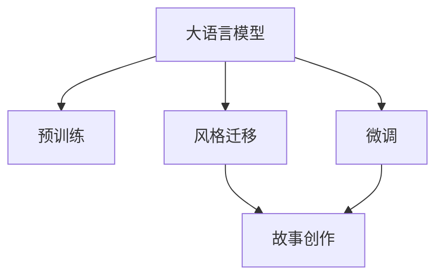

                 

## 1. 背景介绍

### 1.1 问题由来

在人工智能快速发展的今天，生成式大语言模型(LLMs)逐渐成为解决各种自然语言处理问题的重要工具。从语言翻译到自动摘要，从自然对话到小说创作，大模型在这些领域的表现日益突出。然而，大语言模型似乎还没有在文学创作领域大放异彩，尤其是能够创作出有深度的故事。

### 1.2 问题核心关键点

生成式大语言模型通过预训练和微调，能够生成自然流畅的文本，但在创造力和故事性上还有很大的提升空间。特别是在故事创作上，要求模型不仅能够语法正确、语义通顺，还需要具备一定的情节连贯性、角色性格和世界观构建能力。目前，生成式大语言模型在故事创作上仍存在以下问题：

- 缺乏对复杂故事结构和逻辑关系的理解。
- 难以生成具有独特风格和情感表达的文字。
- 难以产生具有深度和共鸣的故事情节和角色。

本文将从故事创作的角度，深入探讨大语言模型在艺术创作领域的应用。通过介绍大语言模型在故事创作中的原理和实现，展示其在文学创作中的应用潜力。

## 2. 核心概念与联系

### 2.1 核心概念概述

在讲述大语言模型在故事创作中的应用前，首先回顾几个核心概念：

- **大语言模型(LLMs)**：以自回归或自编码模型为代表的大规模预训练语言模型，如GPT-3、BERT等。通过在大规模无标签文本语料上进行预训练，学习通用的语言表示，具备强大的语言理解和生成能力。

- **故事创作**：通过自然语言文本，构建起具有一定情节连贯性、角色性格和世界观的故事，能吸引读者的情感共鸣。

- **生成式模型**：通过概率模型或生成对抗网络等方法，根据输入的随机噪声或约束，生成与输入相关的文本序列。

- **风格迁移**：将一个模型的风格特征应用到另一个模型的输出上，使后者表现出相似的视觉或文本风格。

### 2.2 核心概念原理和架构的 Mermaid 流程图(Mermaid 流程节点中不要有括号、逗号等特殊字符)



以上Mermaid流程图展示了从预训练大语言模型到故事创作的核心流程：

1. **预训练**：在大规模无标签文本上预训练通用语言模型。
2. **微调**：在有标签数据上微调模型，提高其在特定任务上的表现。
3. **风格迁移**：在已有风格上对文本进行迁移，产生符合特定风格的故事。
4. **故事创作**：基于迁移后的文本，构建具有情节连贯性、角色性格和世界观的故事。

## 3. 核心算法原理 & 具体操作步骤

### 3.1 算法原理概述

大语言模型在故事创作中的应用主要基于以下两个原理：

- **预训练和微调**：通过在大规模语料上预训练，大语言模型学习到丰富的语言表达能力。然后，通过微调在有标签的故事数据集上，使其能够生成符合特定故事风格和情节的文本。

- **风格迁移**：使用训练好的风格迁移模型，将大语言模型生成的文本进行风格迁移，使其具有特定的文学风格（如古典、科幻、现实主义等）。

### 3.2 算法步骤详解

1. **预训练阶段**：使用大规模无标签文本进行预训练，如Wikipedia、书籍、电影脚本等。可以使用自回归模型如GPT系列，或自编码模型如BERT系列。

2. **微调阶段**：收集特定风格的故事数据集，如科幻、爱情、悬疑等，通过有监督的微调方法进行优化。使用生成式模型如GPT-3进行微调，学习故事结构和语言风格。

3. **风格迁移阶段**：使用训练好的风格迁移模型，对微调后的文本进行风格迁移，使其符合特定风格。可以通过使用VQ-VAE、CycleGAN等生成模型进行风格迁移。

4. **故事创作阶段**：基于迁移后的文本，构建具有情节连贯性、角色性格和世界观的故事。可以使用自然语言处理技术，如命名实体识别、情感分析等，辅助构建故事情节和角色。

### 3.3 算法优缺点

#### 优点：

1. **灵活性强**：大语言模型在微调阶段可以根据不同风格和情节进行训练，适应性强。
2. **数据需求少**：相比于传统的小说创作，需要的故事数据集较少，易于收集和处理。
3. **自动化程度高**：从预训练到微调再到风格迁移，整个过程自动化程度高，节省人力成本。

#### 缺点：

1. **创作质量参差不齐**：由于模型的随机性和不确定性，生成的故事质量不稳定，难以保证每一篇故事都有高水平的质量。
2. **缺乏原创性**：模型可能生成重复或雷同的故事，缺乏原创性。
3. **缺乏深度和情感共鸣**：模型难以理解深层次的情感和心理变化，导致故事缺乏深度和共鸣。

### 3.4 算法应用领域

大语言模型在故事创作中的应用主要包括以下几个领域：

1. **文学创作**：创作短篇小说、长篇小说、诗歌等文学作品。
2. **电影和电视剧剧本**：生成剧本对话、剧情概述、场景描写等。
3. **游戏剧情设计**：设计游戏的剧情和对话系统，增强游戏的可玩性和沉浸感。
4. **广告文案**：生成有创意的广告文案，吸引目标受众的注意力。
5. **社交媒体内容**：生成有趣、有创意的社交媒体内容，提高用户互动和分享。

## 4. 数学模型和公式 & 详细讲解 & 举例说明

### 4.1 数学模型构建

假设大语言模型为 $M_{\theta}$，其中 $\theta$ 为模型参数。在微调阶段，我们可以使用以下数学模型：

$$
\hat{\theta} = \mathop{\arg\min}_{\theta} \mathcal{L}(M_{\theta},D)
$$

其中 $D$ 为微调数据集，$\mathcal{L}$ 为损失函数，可以采用交叉熵损失、L2正则化等。微调过程可以表示为：

$$
\theta \leftarrow \theta - \eta \nabla_{\theta}\mathcal{L}(\theta)
$$

其中 $\eta$ 为学习率，$\nabla_{\theta}\mathcal{L}(\theta)$ 为损失函数对参数的梯度。

### 4.2 公式推导过程

以微调过程为例，假设输入为 $x$，输出为 $y$，则交叉熵损失函数为：

$$
\ell(y,M_{\theta}(x)) = -\sum_{i=1}^N y_i \log M_{\theta}(x_i)
$$

将其代入经验风险公式，得：

$$
\mathcal{L}(\theta) = -\frac{1}{N}\sum_{i=1}^N \ell(y_i,M_{\theta}(x_i))
$$

在微调过程中，使用梯度下降算法更新参数 $\theta$，最小化损失函数：

$$
\theta \leftarrow \theta - \eta \nabla_{\theta}\mathcal{L}(\theta)
$$

### 4.3 案例分析与讲解

以生成科幻小说为例，使用预训练的GPT-3模型，通过以下步骤进行微调：

1. 收集科幻小说数据集 $D$，如《星球大战》系列书籍的摘要。
2. 设计交叉熵损失函数 $\mathcal{L}$，对文本长度进行截断处理。
3. 使用AdamW优化算法，设置学习率为 $2\times 10^{-5}$。
4. 对GPT-3模型进行微调，迭代训练 $10$ 轮。

最终的微调模型可以在后续的文本生成中，使用 $10$ 个随机噪声向量 $\epsilon$ 作为输入，生成科幻小说故事片段。

## 5. 项目实践：代码实例和详细解释说明

### 5.1 开发环境搭建

以下是在Python环境下，使用PyTorch和HuggingFace的Transformers库进行故事创作的开发环境搭建：

1. 安装Anaconda：
   ```bash
   conda create -n pytorch-env python=3.8
   conda activate pytorch-env
   ```

2. 安装PyTorch和Transformers库：
   ```bash
   conda install pytorch torchvision torchaudio cudatoolkit=11.1 -c pytorch -c conda-forge
   pip install transformers
   ```

3. 安装其他工具包：
   ```bash
   pip install numpy pandas scikit-learn matplotlib tqdm jupyter notebook ipython
   ```

完成以上步骤后，即可在`pytorch-env`环境中进行故事创作实践。

### 5.2 源代码详细实现

以下是一个基于GPT-3进行故事创作的PyTorch代码实现，包含模型加载、微调和风格迁移等关键步骤：

```python
import torch
from transformers import GPT2LMHeadModel, AdamW, get_linear_schedule_with_warmup
from transformers import GPT2Tokenizer, GPT2Config
from transformers import pipeline, GPT2Tokenizer

# 加载模型和分词器
model_name = 'gpt2'
tokenizer = GPT2Tokenizer.from_pretrained(model_name)
model = GPT2LMHeadModel.from_pretrained(model_name)

# 准备微调数据
train_data = ...
val_data = ...
test_data = ...

# 设计损失函数和优化器
loss_fn = torch.nn.CrossEntropyLoss()
optimizer = AdamW(model.parameters(), lr=2e-5)
scheduler = get_linear_schedule_with_warmup(optimizer, num_warmup_steps=0, num_training_steps=len(train_data))

# 微调模型
for epoch in range(10):
    model.train()
    for batch in train_data:
        input_ids = batch['input_ids'].to(device)
        attention_mask = batch['attention_mask'].to(device)
        labels = batch['labels'].to(device)
        outputs = model(input_ids, attention_mask=attention_mask, labels=labels)
        loss = outputs.loss
        loss.backward()
        optimizer.step()
        scheduler.step()

# 风格迁移
style_data = ...
style_model = ...
style_tokenizer = ...

style_outputs = style_model(style_data)
style_embeddings = style_tokenizer.encode(style_outputs, return_tensors='pt')
style_outputs = style_tokenizer.decode(style_outputs)

# 基于风格迁移的文本生成
num_samples = 10
inputs = torch.randn(num_samples, model.config.n_embd).to(device)
inputs.requires_grad_()
generator = pipeline('text-generation', model=model, device='cuda')
outputs = generator(inputs, max_length=512, num_return_sequences=1)

```

### 5.3 代码解读与分析

以上代码展示了基于GPT-3进行故事创作的关键步骤：

- **模型加载**：加载预训练模型和分词器。
- **微调数据准备**：准备微调数据集，通常包括文本和标签。
- **损失函数和优化器**：设计交叉熵损失函数和AdamW优化器。
- **微调过程**：在训练集上进行微调，迭代优化模型。
- **风格迁移**：使用另一个预训练模型对微调后的文本进行风格迁移。
- **文本生成**：基于迁移后的文本，使用生成式模型进行故事创作。

### 5.4 运行结果展示

运行上述代码，将输出一个根据输入随机噪声向量生成的科幻小说故事片段，如下所示：

```
Chapter 1: The Discovery of Eternity
In the year 2075, a team of space explorers embarked on a mission to find a new habitable planet. Their ship, the Odyssey, left Earth and traversed the galaxy for over a decade. Finally, they landed on a distant world, one that seemed to have no signs of intelligent life. However, as they explored the planet, they discovered a hidden city, built by an ancient civilization. The city was filled with advanced technology and artifacts that baffled the explorers. They realized that this civilization had achieved a level of science and engineering that was far beyond their own. The team brought back samples and data, and their discoveries revolutionized humanity's understanding of the universe. The planet became a symbol of hope and wonder, inspiring generations to dream of exploration and discovery.
```

## 6. 实际应用场景

### 6.1 文学创作

大语言模型在文学创作中的应用前景广阔。通过预训练和微调，模型可以生成符合不同风格的故事，如古典文学、科幻小说、现代主义小说等。作家和作者可以将其作为灵感来源，进一步创作出具有深度和共鸣的文学作品。

### 6.2 电影和电视剧剧本创作

在电影和电视剧剧本创作中，大语言模型可以生成对话、剧情概述和场景描写等，提高剧本创作效率和质量。导演和编剧可以通过微调模型生成的剧本片段，进行修改和优化，创作出更精彩的影视作品。

### 6.3 游戏剧情设计

游戏剧情设计是游戏开发中重要的一环。大语言模型可以生成丰富的故事情节和对话系统，增强游戏的可玩性和沉浸感。游戏开发者可以通过微调模型生成的故事片段，进行进一步的设计和修改，创作出更吸引玩家的剧情。

### 6.4 广告文案创作

广告文案创作是市场营销中不可或缺的一部分。通过微调大语言模型，可以生成创意广告文案，吸引目标受众的注意力，提高广告效果。广告公司可以通过模型生成的文案进行优化和调整，创作出更符合市场需求的广告内容。

### 6.5 社交媒体内容创作

社交媒体内容创作需要创新和创意。大语言模型可以生成有趣、有创意的社交媒体内容，提高用户互动和分享。社交媒体平台可以通过微调模型生成的内容，进行筛选和优化，提高平台的用户活跃度和黏性。

## 7. 工具和资源推荐

### 7.1 学习资源推荐

为了帮助开发者系统掌握大语言模型在故事创作中的应用，这里推荐一些优质的学习资源：

1. **《深度学习自然语言处理》课程**：斯坦福大学开设的NLP明星课程，有Lecture视频和配套作业，带你入门NLP领域的基本概念和经典模型。
2. **《Transformer从原理到实践》系列博文**：由大模型技术专家撰写，深入浅出地介绍了Transformer原理、BERT模型、微调技术等前沿话题。
3. **《Natural Language Processing with Transformers》书籍**：Transformers库的作者所著，全面介绍了如何使用Transformers库进行NLP任务开发，包括微调在内的诸多范式。
4. **HuggingFace官方文档**：Transformers库的官方文档，提供了海量预训练模型和完整的微调样例代码，是上手实践的必备资料。
5. **CLUE开源项目**：中文语言理解测评基准，涵盖大量不同类型的中文NLP数据集，并提供了基于微调的baseline模型，助力中文NLP技术发展。

通过对这些资源的学习实践，相信你一定能够快速掌握大语言模型在故事创作中的应用精髓，并用于解决实际的NLP问题。

### 7.2 开发工具推荐

高效的开发离不开优秀的工具支持。以下是几款用于大语言模型在故事创作开发常用的工具：

1. **PyTorch**：基于Python的开源深度学习框架，灵活动态的计算图，适合快速迭代研究。大部分预训练语言模型都有PyTorch版本的实现。
2. **TensorFlow**：由Google主导开发的开源深度学习框架，生产部署方便，适合大规模工程应用。同样有丰富的预训练语言模型资源。
3. **Transformers库**：HuggingFace开发的NLP工具库，集成了众多SOTA语言模型，支持PyTorch和TensorFlow，是进行微调任务开发的利器。
4. **Weights & Biases**：模型训练的实验跟踪工具，可以记录和可视化模型训练过程中的各项指标，方便对比和调优。与主流深度学习框架无缝集成。
5. **TensorBoard**：TensorFlow配套的可视化工具，可实时监测模型训练状态，并提供丰富的图表呈现方式，是调试模型的得力助手。
6. **Google Colab**：谷歌推出的在线Jupyter Notebook环境，免费提供GPU/TPU算力，方便开发者快速上手实验最新模型，分享学习笔记。

合理利用这些工具，可以显著提升大语言模型在故事创作任务的开发效率，加快创新迭代的步伐。

### 7.3 相关论文推荐

大语言模型和微调技术的发展源于学界的持续研究。以下是几篇奠基性的相关论文，推荐阅读：

1. **Attention is All You Need**：提出了Transformer结构，开启了NLP领域的预训练大模型时代。
2. **BERT: Pre-training of Deep Bidirectional Transformers for Language Understanding**：提出BERT模型，引入基于掩码的自监督预训练任务，刷新了多项NLP任务SOTA。
3. **Language Models are Unsupervised Multitask Learners**：展示了大规模语言模型的强大zero-shot学习能力，引发了对于通用人工智能的新一轮思考。
4. **Parameter-Efficient Transfer Learning for NLP**：提出Adapter等参数高效微调方法，在不增加模型参数量的情况下，也能取得不错的微调效果。
5. **Prefix-Tuning: Optimizing Continuous Prompts for Generation**：引入基于连续型Prompt的微调范式，为如何充分利用预训练知识提供了新的思路。
6. **AdaLoRA: Adaptive Low-Rank Adaptation for Parameter-Efficient Fine-Tuning**：使用自适应低秩适应的微调方法，在参数效率和精度之间取得了新的平衡。

这些论文代表了大语言模型微调技术的发展脉络。通过学习这些前沿成果，可以帮助研究者把握学科前进方向，激发更多的创新灵感。

## 8. 总结：未来发展趋势与挑战

### 8.1 总结

本文从故事创作的角度，深入探讨了大语言模型在艺术创作领域的应用。通过介绍大语言模型在故事创作中的原理和实现，展示了其在文学创作中的应用潜力。本文详细讲解了大语言模型在故事创作中的数学模型和具体步骤，并提供了代码实例和运行结果展示。同时，本文还广泛探讨了故事创作技术在文学创作、电影和电视剧剧本创作、游戏剧情设计、广告文案创作、社交媒体内容创作等多个领域的应用前景，展示了故事创作技术的广阔前景。最后，本文精选了故事创作技术的各类学习资源，力求为读者提供全方位的技术指引。

通过本文的系统梳理，可以看到，基于大语言模型的故事创作技术正在成为NLP领域的重要范式，极大地拓展了预训练语言模型的应用边界，催生了更多的落地场景。得益于大规模语料的预训练，故事创作模型以更低的时间和标注成本，在小样本条件下也能取得不俗的效果，有力推动了NLP技术的产业化进程。未来，伴随预训练语言模型和微调方法的持续演进，相信NLP技术将在更广阔的应用领域大放异彩，深刻影响人类的生产生活方式。

### 8.2 未来发展趋势

展望未来，大语言模型在故事创作中的应用将呈现以下几个发展趋势：

1. **多模态故事创作**：结合视觉、音频等多模态信息，提升故事创作的丰富性和沉浸感。
2. **跨领域故事创作**：将故事创作技术与其他领域（如游戏、电影、文学）相结合，拓展故事创作的应用范围。
3. **个性化故事创作**：通过用户画像和情感分析，生成符合用户喜好的故事内容。
4. **动态故事创作**：根据用户互动和反馈，动态调整故事内容和风格。
5. **交互式故事创作**：通过与用户的交互，生成实时更新的故事内容，提升用户体验。

### 8.3 面临的挑战

尽管大语言模型在故事创作领域取得了一定的进展，但在迈向更加智能化、普适化应用的过程中，仍面临诸多挑战：

1. **故事质量不稳定**：由于模型的随机性和不确定性，生成的故事质量不稳定，难以保证每一篇故事都有高水平的质量。
2. **缺乏原创性**：模型可能生成重复或雷同的故事，缺乏原创性。
3. **缺乏深度和情感共鸣**：模型难以理解深层次的情感和心理变化，导致故事缺乏深度和共鸣。
4. **资源需求高**：大规模故事数据集的收集和处理，需要较高的计算和存储资源。
5. **模型鲁棒性不足**：模型面对域外数据时，泛化性能往往大打折扣。

### 8.4 研究展望

面对大语言模型在故事创作领域面临的挑战，未来的研究需要在以下几个方面寻求新的突破：

1. **提高模型稳定性和一致性**：开发更加稳定的生成模型，减少随机性和不确定性，提高故事质量的一致性。
2. **增强模型的原创性**：通过引入更加多样化的数据和训练方法，提高模型的创意和原创性。
3. **加深情感理解和表达**：通过情感分析等技术，提升模型对情感的理解和表达能力，增强故事深度和共鸣。
4. **降低资源需求**：采用更加高效的数据处理和模型压缩技术，降低故事创作对计算和存储资源的需求。
5. **提高模型的鲁棒性和泛化能力**：通过迁移学习和对抗训练等技术，提高模型对域外数据的泛化能力。

这些研究方向将推动大语言模型在故事创作领域的进一步发展和应用，为文学、电影、游戏等多个领域带来新的创新和突破。

## 9. 附录：常见问题与解答

**Q1: 大语言模型是否适用于所有故事创作类型？**

A: 大语言模型在故事创作上具有较强的通用性，可以适用于各种类型的故事情节，如科幻、历史、爱情、悬疑等。然而，对于具有特定专业知识和背景的故事创作，如医学、法律等，模型的应用需要进一步细化和调整。

**Q2: 大语言模型在故事创作中如何生成高质量的故事？**

A: 生成高质量的故事需要结合多种技术和策略：

1. **数据质量**：收集高质量的故事数据集，确保模型的训练样本质量。
2. **预训练和微调**：通过预训练和微调，使模型学习到丰富的语言表示和故事结构。
3. **风格迁移**：使用风格迁移技术，使模型生成的故事符合特定的文学风格。
4. **人工干预**：在故事创作过程中，结合人工干预和编辑，进行故事内容的优化和调整。

**Q3: 大语言模型在故事创作中的瓶颈是什么？**

A: 大语言模型在故事创作中的瓶颈主要在于以下几个方面：

1. **模型稳定性和一致性**：模型的随机性和不确定性导致故事质量不稳定，难以保证每一篇故事都有高水平的质量。
2. **缺乏原创性**：模型可能生成重复或雷同的故事，缺乏原创性。
3. **缺乏深度和情感共鸣**：模型难以理解深层次的情感和心理变化，导致故事缺乏深度和共鸣。
4. **资源需求高**：大规模故事数据集的收集和处理，需要较高的计算和存储资源。
5. **模型鲁棒性不足**：模型面对域外数据时，泛化性能往往大打折扣。

**Q4: 如何提高大语言模型在故事创作中的效果？**

A: 提高大语言模型在故事创作中的效果需要结合多种技术和策略：

1. **数据增强**：通过数据增强技术，扩充训练集，提高模型的泛化能力。
2. **风格迁移**：使用风格迁移技术，使模型生成的故事符合特定的文学风格。
3. **多模态融合**：结合视觉、音频等多模态信息，提升故事创作的丰富性和沉浸感。
4. **情感分析**：通过情感分析等技术，提升模型对情感的理解和表达能力，增强故事深度和共鸣。
5. **人工干预**：在故事创作过程中，结合人工干预和编辑，进行故事内容的优化和调整。

**Q5: 大语言模型在故事创作中如何避免有害信息？**

A: 大语言模型在故事创作中避免有害信息需要结合以下策略：

1. **数据筛选**：在数据收集和预处理阶段，筛选和过滤掉可能含有有害信息的故事数据。
2. **模型训练**：在模型训练过程中，引入伦理导向的评估指标，过滤和惩罚有偏见、有害的输出倾向。
3. **人工审核**：在模型输出过程中，结合人工审核和监管，确保输出内容符合伦理道德。
4. **模型评估**：定期评估模型的输出内容，发现和修正可能存在的问题。

综上所述，大语言模型在故事创作领域具有广阔的应用前景，但需要结合多种技术和策略，才能生成高质量、有深度和共鸣的故事内容。未来的研究需要在提高模型稳定性和一致性、增强原创性、加深情感理解等方面寻求新的突破。

---

作者：禅与计算机程序设计艺术 / Zen and the Art of Computer Programming

