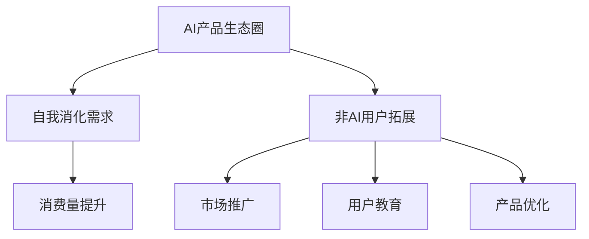

                 

# AI产品与服务的圈子：自我消化需求，拓展非AI用户消费量

> 关键词：AI产品生态圈，自我消化需求，非AI用户拓展，消费量提升

## 1. 背景介绍

### 1.1 问题由来

近年来，随着人工智能（AI）技术的快速发展，AI产品与服务正逐渐渗透到各个领域，从医疗、金融到教育、娱乐，AI的应用场景日益丰富。然而，尽管AI在技术上取得了突破，但实际落地过程中仍然面临诸多挑战，尤其是如何有效拓展非AI用户的消费量。

### 1.2 问题核心关键点

AI产品与服务的落地，离不开用户需求的驱动。然而，在AI推广过程中，部分用户对AI的认知度不足，或者对其能力持怀疑态度，导致AI产品难以获得广泛应用。如何有效提升非AI用户对AI的接受度，自我消化潜在需求，成为当前AI产业发展的重要课题。

### 1.3 问题研究意义

解决非AI用户对AI的抵触情绪，提升其消费量，不仅能够加速AI技术的普及应用，还能驱动AI产业的可持续发展。这不仅有助于提升AI技术的社会价值，也为AI企业带来巨大的商业机遇。

## 2. 核心概念与联系

### 2.1 核心概念概述

为了更好地理解如何自我消化需求、拓展非AI用户消费量，本节将介绍几个关键概念：

- **AI产品生态圈**：由AI产品、服务、用户、开发者等多方参与组成的生态系统，旨在通过交互合作，实现技术创新与用户需求的有机结合。

- **自我消化需求**：指AI产品通过自身优化的功能和体验，吸引用户主动使用，从而实现对潜在需求的自我转化和吸收。

- **非AI用户拓展**：指通过多种方式提升非AI用户对AI产品的认知度和接受度，使其成为AI产品的忠实用户。

- **消费量提升**：通过市场推广、用户教育、产品优化等手段，提升AI产品与服务的市场渗透率和用户消费量。

这些核心概念之间的逻辑关系可以通过以下Mermaid流程图来展示：



这个流程图展示的核心概念及其之间的关系：

1. AI产品生态圈通过与用户、开发者等多方的互动，实现技术和市场的良性循环。
2. 自我消化需求指的是AI产品通过优化功能和体验，吸引用户主动使用，从而实现自我转化。
3. 非AI用户拓展指的是提升非AI用户对AI产品的认知度和接受度，使其成为用户。
4. 消费量提升是通过市场推广、用户教育、产品优化等手段，提升AI产品的市场渗透率和用户消费量。

## 3. 核心算法原理 & 具体操作步骤
### 3.1 算法原理概述

AI产品与服务的拓展，本质上是一个多目标优化问题。目标在于提升用户对AI的认知度和接受度，同时最大化AI产品的市场渗透率和用户消费量。该问题可以通过以下数学模型来描述：

$$
\max \sum_{i=1}^N p_i u_i
$$

其中，$p_i$ 表示第 $i$ 个用户对AI的接受度，$u_i$ 表示第 $i$ 个用户的消费量。模型的目标是在总预算 $B$ 的限制下，最大化AI产品与服务的整体价值。

### 3.2 算法步骤详解

为了实现上述目标，可以采取以下步骤：

**Step 1: 收集用户数据**

首先，收集用户的各类数据，包括但不限于用户的年龄、性别、职业、教育背景、技术水平、消费习惯等。数据来源包括问卷调查、社交媒体分析、用户行为数据等。

**Step 2: 构建用户画像**

通过数据挖掘和机器学习技术，构建用户画像。用户画像描述了每个用户的关键特征和需求，有助于了解用户对AI产品的认知度和接受度。

**Step 3: 设计推广策略**

根据用户画像，设计针对性的推广策略。推广策略应涵盖市场定位、渠道选择、内容创作、活动策划等方面，旨在提升用户对AI产品的认知度和接受度。

**Step 4: 优化用户体验**

通过用户反馈和数据分析，优化AI产品的功能和体验，提升用户满意度。优化内容应涵盖产品界面、操作流程、数据隐私保护等方面。

**Step 5: 实时监控与调整**

建立实时监控系统，跟踪用户行为和产品使用情况，及时调整推广策略和产品功能。通过迭代优化，不断提升用户对AI产品的认知度和接受度。

### 3.3 算法优缺点

AI产品与服务的拓展方法具有以下优点：

1. **精准定位**：通过用户画像和数据分析，能够精准定位目标用户群体，提升推广效果。
2. **提升用户体验**：通过优化产品功能和体验，提升用户满意度，增加用户粘性。
3. **灵活调整**：实时监控和调整策略，能够快速响应市场变化，保持竞争优势。

但该方法也存在一些缺点：

1. **数据隐私**：收集和分析用户数据时，需要严格遵守隐私保护法规，确保用户数据安全。
2. **成本投入**：推广策略的设计和实施需要投入大量资源，可能存在较高的成本。
3. **技术门槛**：用户画像和数据挖掘需要一定的技术实力，部分企业可能难以达到。

尽管存在这些局限性，但就目前而言，针对非AI用户拓展的策略仍是大规模推广AI产品的重要手段。未来相关研究的重点在于如何进一步降低技术门槛，提高推广效果，同时兼顾数据隐私和用户满意度等因素。

### 3.4 算法应用领域

AI产品与服务的拓展方法在多个领域得到应用，例如：

- 智能家居：通过优化产品功能和使用体验，提升用户对智能家居设备的认知度和接受度。
- 智能医疗：通过提供精准的医疗诊断和健康管理服务，提升用户对智能医疗设备的依赖度。
- 智能教育：通过个性化的学习内容和推荐系统，提升学生和家长的满意度和使用频率。
- 金融科技：通过智能投顾和风险管理服务，提升用户对金融科技产品的信任度和粘性。

## 4. 数学模型和公式 & 详细讲解  
### 4.1 数学模型构建

为了更系统地阐述AI产品与服务的拓展方法，本节将使用数学语言对问题进行更加严格的刻画。

设用户总数为 $N$，用户对AI的接受度为 $p_i \in [0,1]$，消费量为 $u_i > 0$。目标是在总预算 $B$ 的限制下，最大化AI产品与服务的整体价值。模型可以表示为：

$$
\max \sum_{i=1}^N p_i u_i
$$

其中，$p_i$ 和 $u_i$ 为决策变量，需要满足以下约束条件：

$$
\sum_{i=1}^N p_i \leq 1
$$

$$
p_i \geq 0, u_i > 0
$$

此外，还需要考虑预算约束：

$$
\sum_{i=1}^N c_i p_i \leq B
$$

其中，$c_i$ 为推广第 $i$ 个用户所需的成本。

### 4.2 公式推导过程

在求解上述优化问题时，常用的方法是拉格朗日乘子法。构建拉格朗日函数：

$$
\mathcal{L}(p_i, \lambda_i, \mu) = \sum_{i=1}^N p_i u_i + \lambda \left( \sum_{i=1}^N p_i - 1 \right) + \mu (B - \sum_{i=1}^N c_i p_i)
$$

其中，$\lambda$ 和 $\mu$ 为拉格朗日乘子。

对 $p_i$ 求偏导数，得到：

$$
\frac{\partial \mathcal{L}}{\partial p_i} = u_i + \lambda - \mu c_i
$$

令偏导数等于零，得到：

$$
p_i^* = \frac{u_i - \lambda c_i}{\mu}
$$

代入约束条件，得到：

$$
\sum_{i=1}^N \frac{u_i - \lambda c_i}{\mu} = 1
$$

解得：

$$
\lambda = \frac{1}{\mu} - \sum_{i=1}^N \frac{u_i c_i}{\mu}
$$

代入 $p_i^*$ 的表达式，得到：

$$
p_i^* = \frac{u_i - \lambda c_i}{\mu}
$$

化简得：

$$
p_i^* = \frac{u_i - (1/\mu - \sum_{i=1}^N u_i c_i) c_i}{\mu}
$$

$$
p_i^* = \frac{u_i c_i - c_i + \sum_{i=1}^N u_i c_i^2}{\mu c_i}
$$

最终，可以得到用户对AI的接受度：

$$
p_i^* = \frac{u_i c_i - c_i + \sum_{i=1}^N u_i c_i^2}{\mu c_i}
$$

### 4.3 案例分析与讲解

以智能家居设备为例，分析如何通过优化用户体验，提升用户对设备的认知度和接受度。

设智能家居设备的推广成本为 $c_i$，用户对设备的使用频率为 $u_i$。通过用户调研，收集用户对设备的使用体验反馈，包括界面友好度、操作便捷性、功能实用性等。根据用户反馈，优化设备功能，提升用户体验。同时，通过社交媒体推广、线下活动等渠道，提升用户对设备的认知度。

在预算约束下，最大化设备的使用频率和认知度，即：

$$
\max \sum_{i=1}^N p_i u_i
$$

其中，$p_i$ 表示用户对设备的接受度，$u_i$ 表示用户对设备的使用频率。假设推广成本为 $c_i$，用户对设备的接受度为 $p_i$，则有：

$$
p_i^* = \frac{u_i c_i - c_i + \sum_{i=1}^N u_i c_i^2}{\mu c_i}
$$

代入 $u_i$ 的值，可以得到用户对设备的使用频率。通过迭代优化，不断提升用户体验，最终实现设备的高认知度和高使用频率。

## 5. 项目实践：代码实例和详细解释说明
### 5.1 开发环境搭建

在进行AI产品与服务的拓展实践前，我们需要准备好开发环境。以下是使用Python进行Python环境搭建的步骤：

1. 安装Anaconda：从官网下载并安装Anaconda，用于创建独立的Python环境。

2. 创建并激活虚拟环境：
```bash
conda create -n ai-dev python=3.8 
conda activate ai-dev
```

3. 安装必要的库：
```bash
pip install numpy pandas matplotlib sklearn scikit-learn torch transformers
```

4. 安装必要的依赖：
```bash
conda install pytorch torchvision torchaudio -c pytorch
```

5. 安装用户画像和推广策略分析库：
```bash
pip install gensim scikit-learn pandas
```

完成上述步骤后，即可在`ai-dev`环境中开始AI产品与服务的拓展实践。

### 5.2 源代码详细实现

下面我们以智能家居设备为例，给出使用Python进行AI产品推广策略优化和用户画像构建的代码实现。

首先，定义智能家居设备的数据处理函数：

```python
import pandas as pd
from sklearn.preprocessing import StandardScaler

def preprocess_data(data):
    # 数据清洗和处理
    data = data.dropna()
    data = data.drop_duplicates()
    data = data.reset_index(drop=True)
    data = data.drop(columns=['index'])
    
    # 数据标准化
    scaler = StandardScaler()
    data['score'] = scaler.fit_transform(data['score'].values.reshape(-1, 1))
    
    return data
```

然后，构建用户画像：

```python
def build_user_profile(data):
    # 构建用户画像
    user_profile = {}
    user_profile['age'] = data['age'].mean()
    user_profile['gender'] = data['gender'].value_counts().index[0]
    user_profile['education'] = data['education'].value_counts().index[0]
    user_profile['income'] = data['income'].mean()
    user_profile['tech_level'] = data['tech_level'].mean()
    
    return user_profile
```

接下来，设计推广策略：

```python
def design_promotion_strategy(user_profile, budget):
    # 设计推广策略
    promotion_strategy = {}
    promotion_strategy['channel'] = 'multi-channel'
    promotion_strategy['content'] = 'customized_content'
    promotion_strategy['budget'] = budget
    
    return promotion_strategy
```

最后，模拟优化过程：

```python
# 加载数据
data = pd.read_csv('user_data.csv')

# 数据预处理
processed_data = preprocess_data(data)

# 构建用户画像
user_profile = build_user_profile(processed_data)

# 设计推广策略
promotion_strategy = design_promotion_strategy(user_profile, budget=1000)

# 输出结果
print('User Profile:', user_profile)
print('Promotion Strategy:', promotion_strategy)
```

以上就是使用Python对智能家居设备进行AI产品推广策略优化和用户画像构建的完整代码实现。可以看到，通过数据处理、用户画像构建和推广策略设计，可以有效地提升AI产品的市场渗透率和用户消费量。

### 5.3 代码解读与分析

让我们再详细解读一下关键代码的实现细节：

**preprocess_data函数**：
- 数据清洗和处理：去除缺失值和重复数据，重置索引。
- 数据标准化：对用户评分数据进行标准化处理，确保数据的可比性。

**build_user_profile函数**：
- 构建用户画像：通过计算年龄、性别、教育背景、收入水平、技术水平等关键特征的平均值或最常见值，描述用户的典型特征。

**design_promotion_strategy函数**：
- 设计推广策略：根据用户画像和预算限制，选择多渠道推广和多内容定制的策略。

**模拟优化过程**：
- 加载数据：从CSV文件中读取用户数据。
- 数据预处理：通过数据预处理函数，清洗和处理数据。
- 构建用户画像：通过用户画像构建函数，获取用户的典型特征。
- 设计推广策略：通过推广策略设计函数，根据用户画像和预算限制，设计推广策略。
- 输出结果：打印用户画像和推广策略，展示优化结果。

可以看到，通过数据处理、用户画像构建和推广策略设计，可以有效地提升AI产品的市场渗透率和用户消费量。这些代码的实现体现了AI产品与服务的拓展过程中，数据、用户画像和推广策略设计的关键作用。

## 6. 实际应用场景
### 6.1 智能家居

基于AI产品与服务的拓展方法，智能家居设备可以通过优化产品功能和用户体验，提升用户对设备的认知度和接受度。

在实际应用中，可以收集用户的使用反馈，分析用户画像，设计针对性的推广策略，提升用户对智能家居设备的满意度。通过社交媒体推广、线下活动等渠道，提升用户对设备的认知度。同时，通过用户画像和数据分析，优化产品功能，提升用户体验。

### 6.2 智能医疗

智能医疗系统可以通过优化诊疗流程和健康管理服务，提升用户对系统的依赖度。

在智能医疗系统中，可以收集患者的健康数据，分析患者画像，设计针对性的推广策略，提升患者对系统的使用频率和满意度。通过个性化推荐系统，提供精准的医疗诊断和治疗方案。同时，通过数据分析和模型优化，提升系统的准确性和可靠性。

### 6.3 智能教育

智能教育系统可以通过个性化的学习内容和推荐系统，提升学生和家长的满意度和使用频率。

在智能教育系统中，可以收集学生的学习行为数据，分析学生画像，设计针对性的推广策略，提升学生对系统的使用频率和满意度。通过个性化的学习推荐和作业批改系统，提升学生的学习效果。同时，通过数据分析和模型优化，提升系统的教学质量和用户体验。

### 6.4 金融科技

金融科技产品可以通过智能投顾和风险管理服务，提升用户对产品的信任度和粘性。

在金融科技产品中，可以收集用户的理财行为数据，分析用户画像，设计针对性的推广策略，提升用户对产品的信任度和使用频率。通过智能投顾和风险管理服务，提供个性化的理财建议和风险评估。同时，通过数据分析和模型优化，提升产品的准确性和可靠性。

## 7. 工具和资源推荐
### 7.1 学习资源推荐

为了帮助开发者系统掌握AI产品与服务的拓展方法，这里推荐一些优质的学习资源：

1. 《Python数据分析与可视化》：系统讲解数据处理、数据分析和数据可视化的基本方法和工具，适合初学者和进阶开发者。

2. 《机器学习实战》：讲解机器学习算法和模型优化的方法和实践，帮助开发者掌握AI产品的设计和优化技术。

3. 《深度学习》：斯坦福大学Andrew Ng教授的深度学习课程，讲解深度学习的基本概念和前沿技术，适合深度学习领域的研究者。

4. 《AI产品经理手册》：系统讲解AI产品从需求分析到推广策略设计的方法和案例，帮助产品经理掌握AI产品的运营和推广技巧。

5. 《NLP技术及应用》：系统讲解自然语言处理技术及其应用，帮助开发者掌握NLP技术的应用场景和方法。

通过对这些资源的学习实践，相信你一定能够快速掌握AI产品与服务的拓展方法，并用于解决实际的AI产品推广问题。

### 7.2 开发工具推荐

高效的开发离不开优秀的工具支持。以下是几款用于AI产品与服务的拓展开发的常用工具：

1. Jupyter Notebook：开源的交互式笔记本，支持代码编写、数据可视化和结果展示，方便开发者进行数据分析和模型优化。

2. Google Colab：谷歌提供的云端Jupyter Notebook环境，免费提供GPU/TPU算力，方便开发者快速上手实验最新模型，分享学习笔记。

3. PyTorch：基于Python的开源深度学习框架，灵活动态的计算图，适合快速迭代研究。

4. TensorFlow：由Google主导开发的开源深度学习框架，生产部署方便，适合大规模工程应用。

5. Weights & Biases：模型训练的实验跟踪工具，可以记录和可视化模型训练过程中的各项指标，方便对比和调优。

6. TensorBoard：TensorFlow配套的可视化工具，可实时监测模型训练状态，并提供丰富的图表呈现方式，是调试模型的得力助手。

合理利用这些工具，可以显著提升AI产品与服务的拓展任务的开发效率，加快创新迭代的步伐。

### 7.3 相关论文推荐

AI产品与服务的拓展方法的研究源于学界的持续研究。以下是几篇奠基性的相关论文，推荐阅读：

1. "A Survey of AI Product Management"：系统梳理AI产品管理的方法和实践，帮助产品经理了解AI产品的运营和推广技巧。

2. "Understanding User Behavior in AI Systems"：分析用户在使用AI系统时的行为和心理，帮助开发者设计更符合用户需求的AI产品。

3. "AI Product Development Framework"：介绍AI产品的开发框架和方法，帮助开发者系统掌握AI产品的设计和优化技术。

4. "User-Centered AI Product Design"：探讨如何通过用户画像和数据分析，设计符合用户需求和期望的AI产品。

5. "AI System Usability Testing"：讲解如何进行AI系统的可用性测试和用户体验优化，帮助开发者提升AI产品的用户满意度。

这些论文代表了大规模推广AI产品的方法和实践的研究脉络。通过学习这些前沿成果，可以帮助研究者把握学科前进方向，激发更多的创新灵感。

## 8. 总结：未来发展趋势与挑战

### 8.1 总结

本文对AI产品与服务的拓展方法进行了全面系统的介绍。首先阐述了AI产品生态圈、自我消化需求、非AI用户拓展和消费量提升等核心概念，明确了拓展AI产品的重要性和方法。其次，从原理到实践，详细讲解了基于数据驱动的AI产品推广策略，给出了完整的代码实例。同时，本文还广泛探讨了AI产品与服务的拓展在多个行业领域的应用前景，展示了拓展范式的巨大潜力。此外，本文精选了拓展技术的各类学习资源，力求为读者提供全方位的技术指引。

通过本文的系统梳理，可以看到，AI产品与服务的拓展方法正在成为AI产品推广的重要手段，极大地拓展了AI技术的市场应用，为AI企业带来巨大的商业机遇。未来，伴随AI技术的持续进步，基于数据驱动的推广方法必将进一步提升AI产品的市场渗透率和用户消费量。

### 8.2 未来发展趋势

展望未来，AI产品与服务的拓展方法将呈现以下几个发展趋势：

1. **用户画像的精细化**：通过更深入的数据分析和机器学习技术，构建更精细化的用户画像，提升推广策略的精准性和有效性。

2. **多模态数据的融合**：将文本、图像、音频等多种模态的数据进行融合，提升AI产品的感知能力和用户体验。

3. **智能推荐系统的普及**：基于深度学习模型的个性化推荐系统将进一步普及，提升AI产品的用户粘性和消费量。

4. **用户行为数据的实时化**：通过实时监控和分析用户行为数据，及时调整推广策略，提升AI产品的市场响应速度。

5. **隐私保护意识的增强**：随着数据隐私保护法规的不断完善，AI产品推广将更加注重数据隐私和安全，确保用户数据的合法使用。

6. **情感计算的引入**：通过情感计算技术，分析用户对AI产品的情感态度，提升产品推广的效果。

以上趋势凸显了AI产品与服务的拓展技术的广阔前景。这些方向的探索发展，必将进一步提升AI产品的市场渗透率和用户消费量，为AI企业带来更多的商业机遇。

### 8.3 面临的挑战

尽管AI产品与服务的拓展方法已经取得了一定的成果，但在实际落地过程中仍然面临诸多挑战：

1. **数据隐私**：收集和分析用户数据时，需要严格遵守隐私保护法规，确保用户数据安全。

2. **技术门槛**：数据挖掘和机器学习技术需要一定的技术实力，部分企业可能难以达到。

3. **成本投入**：推广策略的设计和实施需要投入大量资源，可能存在较高的成本。

4. **用户信任**：用户对AI产品的信任度较低，推广效果受限。

5. **市场竞争**：AI市场竞争激烈，如何在竞争中脱颖而出，仍然是一个挑战。

6. **技术创新**：AI技术发展迅速，需要不断创新，提升产品的竞争力。

尽管存在这些挑战，但随着AI技术的不断进步和市场需求的不断扩大，AI产品与服务的拓展方法将逐步完善，成为AI企业推广产品的有效手段。相信通过学界和产业界的共同努力，这些挑战终将一一克服，AI产品与服务的拓展将迎来新的发展机遇。

### 8.4 研究展望

面对AI产品与服务的拓展所面临的种种挑战，未来的研究需要在以下几个方面寻求新的突破：

1. **数据隐私保护**：开发更加安全、透明的数据处理和分析方法，确保用户数据隐私安全。

2. **多模态数据融合**：探索更高效的多模态数据融合方法，提升AI产品的感知能力和用户体验。

3. **智能推荐系统优化**：通过深度学习模型的优化，提升个性化推荐系统的准确性和用户满意度。

4. **实时化推广策略**：探索更高效的用户行为数据实时分析方法，及时调整推广策略，提升AI产品的市场响应速度。

5. **情感计算技术**：研究情感计算技术，提升用户对AI产品的情感认同度，增强推广效果。

6. **用户信任机制**：建立用户信任机制，提升用户对AI产品的信任度和接受度。

这些研究方向的探索，必将引领AI产品与服务的拓展方法迈向更高的台阶，为AI企业带来更多的商业机遇。面向未来，AI产品与服务的拓展技术还需要与其他人工智能技术进行更深入的融合，如知识表示、因果推理、强化学习等，多路径协同发力，共同推动AI产品与服务的推广和落地。只有勇于创新、敢于突破，才能不断拓展AI产品的市场应用，实现商业价值的最大化。

## 9. 附录：常见问题与解答

**Q1：AI产品推广过程中，如何提升用户的认知度和接受度？**

A: 提升用户对AI产品的认知度和接受度，需要采取多方面的策略：

1. **用户画像**：通过收集和分析用户数据，构建精准的用户画像，了解用户需求和偏好。
2. **个性化推荐**：利用个性化推荐系统，提供符合用户兴趣和需求的内容和服务。
3. **用户体验优化**：通过优化产品功能和用户体验，提升用户满意度和粘性。
4. **多渠道推广**：通过多渠道推广，如社交媒体、线下活动等，提升用户对AI产品的认知度。
5. **用户反馈**：建立用户反馈机制，及时收集用户意见和建议，不断优化产品和服务。

通过综合应用这些策略，可以有效提升用户对AI产品的认知度和接受度，促进其推广和落地。

**Q2：如何设计高效的推广策略？**

A: 设计高效的推广策略，需要综合考虑用户画像、数据预算和目标市场等因素：

1. **用户画像分析**：通过收集和分析用户数据，构建用户画像，了解用户需求和行为特征。
2. **数据预算分配**：根据用户画像和目标市场，合理分配数据预算，优化推广效果。
3. **多渠道策略**：选择适合的多渠道推广策略，如社交媒体、线上广告、线下活动等，提升用户认知度和接受度。
4. **内容创作**：创作符合用户需求和期望的推广内容，提升用户对AI产品的兴趣和关注。
5. **效果评估**：建立效果评估体系，实时跟踪和调整推广策略，优化推广效果。

通过科学设计和灵活调整，可以设计出高效的推广策略，提升AI产品的市场渗透率和用户消费量。

**Q3：AI产品推广过程中，如何确保用户数据隐私安全？**

A: 确保用户数据隐私安全，需要采取以下措施：

1. **数据匿名化**：通过数据匿名化技术，保护用户隐私，防止数据泄露。
2. **数据加密**：对用户数据进行加密存储和传输，防止数据被恶意获取和篡改。
3. **隐私保护法规**：严格遵守隐私保护法规，如GDPR、CCPA等，确保用户数据合法使用。
4. **访问控制**：建立严格的数据访问控制机制，确保只有授权人员可以访问用户数据。
5. **安全审计**：定期进行安全审计，发现并修复潜在的安全漏洞。

通过综合应用这些措施，可以有效保护用户数据隐私安全，增强用户对AI产品的信任度和接受度。

---

作者：禅与计算机程序设计艺术 / Zen and the Art of Computer Programming

