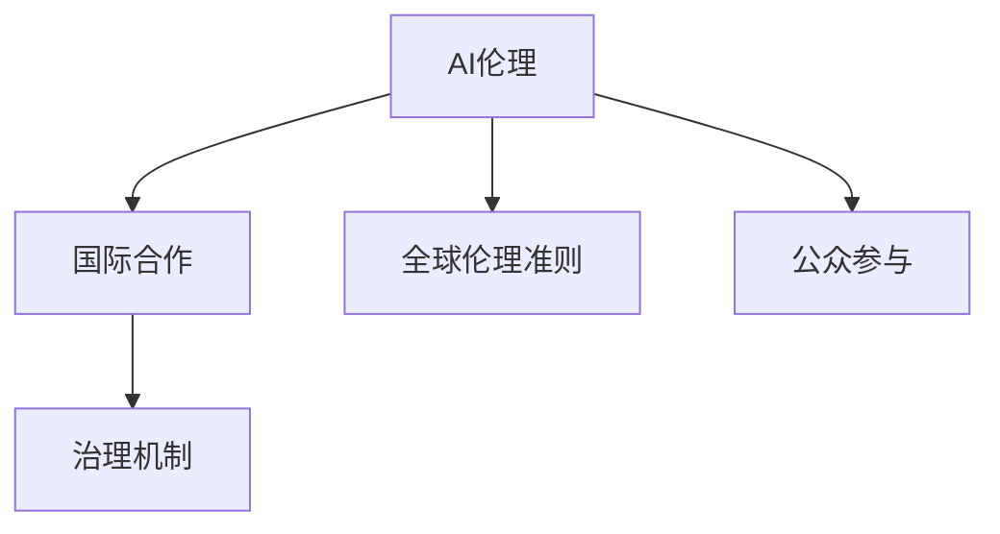

                 

# AI伦理的国际合作:全球伦理准则和治理机制

## 1. 背景介绍

### 1.1 问题由来
人工智能（AI）技术的发展在带来巨大经济和社会效益的同时，也引发了一系列伦理和治理问题。例如，AI在决策过程中可能缺乏透明度，可能导致偏见和不公平；AI系统在处理隐私信息时存在泄漏风险；AI用于军事、安全等领域可能带来道德风险。

为了应对这些挑战，国际社会逐渐意识到需要进行全球范围内的合作，共同制定和实施AI伦理准则和治理机制。《AI伦理的国际合作:全球伦理准则和治理机制》正是在这一背景下应运而生，旨在推动全球AI伦理治理进程，确保AI技术的发展符合人类利益和社会价值观。

### 1.2 问题核心关键点
本文聚焦于全球AI伦理治理的关键议题，包括：

- **全球伦理准则**：国际社会如何制定共同遵守的AI伦理准则，保障AI技术的道德使用。
- **跨国协作机制**：不同国家和地区如何建立高效、透明的协作机制，推动全球AI伦理治理进程。
- **技术政策框架**：如何建立相应的技术政策框架，确保AI技术开发和应用过程中的伦理合规。
- **公众参与与监督**：如何促进公众参与AI伦理治理，建立有效的监督机制，保障公众权益。

## 2. 核心概念与联系

### 2.1 核心概念概述

为更好地理解全球AI伦理治理框架，本节将介绍几个密切相关的核心概念：

- **AI伦理**：指在AI开发和应用过程中，确保技术符合道德规范和人类价值观。
- **国际合作**：指不同国家和地区通过对话、协商、合作，共同制定和实施AI伦理准则和治理机制。
- **全球伦理准则**：指国际社会共同制定并遵守的AI伦理规范，确保AI技术在全球范围内的道德使用。
- **治理机制**：指保障AI伦理准则得以有效实施的制度框架，包括政策、法规、标准等。
- **公众参与**：指公众在AI伦理治理过程中所扮演的角色，包括参与决策、监督等。

这些核心概念之间的逻辑关系可以通过以下Mermaid流程图来展示：



这个流程图展示了大语言模型的核心概念及其之间的关系：

1. AI伦理是全球合作的基础，决定了国际社会共同遵循的道德规范。
2. 国际合作是实现全球伦理准则的前提，促进不同国家和地区的协调和对话。
3. 全球伦理准则是合作成果，为各国AI技术应用提供共同遵循的道德标准。
4. 治理机制是实现伦理准则的工具，确保伦理准则在实际操作中得以落实。
5. 公众参与是伦理治理的重要组成部分，确保公众权益得到保障。

## 3. 核心算法原理 & 具体操作步骤
### 3.1 算法原理概述

全球AI伦理治理的本质是通过多边对话和协商，制定和实施一套国际共识的伦理准则和治理机制。其核心思想是：

- 通过多方参与，达成共同遵循的AI伦理准则。
- 建立透明、高效、可持续的治理机制，确保伦理准则得到有效执行。
- 鼓励公众参与，提升伦理治理的透明度和公正性。

### 3.2 算法步骤详解

全球AI伦理治理的实施步骤主要包括以下几个环节：

**Step 1: 多方对话与共识达成**
- 通过国际会议、圆桌论坛等形式，邀请各国政府、企业、学术界、公众等多方参与，讨论和提出AI伦理准则的草案。
- 采用协商民主等机制，通过公开透明的程序，达成各方一致的伦理准则草案。

**Step 2: 伦理准则的制定与颁布**
- 根据多方协商达成的共识，制定详细的AI伦理准则，明确技术开发和应用过程中的道德要求。
- 通过国际条约或协议等方式，正式颁布和推广这些伦理准则，确保其在全球范围内的权威性和约束力。

**Step 3: 治理机制的构建与实施**
- 建立包括政策、法规、标准等在内的治理机制，确保AI伦理准则得到有效执行。
- 通过国际合作和双边协议，协调各国在AI伦理治理上的差异和分歧，建立统一的技术政策框架。
- 设立专门的国际机构，负责AI伦理准则的监督和评估，确保其实施效果。

**Step 4: 公众参与与监督**
- 通过公众咨询、听证会等方式，广泛听取公众意见，参与AI伦理准则的制定和修订。
- 建立有效的监督机制，确保公众能够及时反馈和质疑AI伦理问题，促进技术的透明和公正。

**Step 5: 持续改进与适应性调整**
- 定期评估AI伦理准则和治理机制的实施效果，根据技术发展和社会变化进行调整和完善。
- 持续跟踪技术进步和道德观念的变化，确保伦理准则的适用性和前瞻性。

### 3.3 算法优缺点

全球AI伦理治理的优点包括：

- **多边参与**：通过多方参与，确保伦理准则的公平性和普遍适用性。
- **国际权威**：通过国际条约或协议颁布伦理准则，具有较高的法律和道德约束力。
- **透明透明**：建立公开透明的治理机制，确保伦理准则的实施效果。
- **公众参与**：鼓励公众参与，提升伦理治理的透明度和公正性。

其缺点包括：

- **协调难度大**：不同国家和地区在文化、政治、经济等方面存在差异，协调和协商过程复杂。
- **执行力度有限**：各国在技术应用和政策执行上存在差异，难以形成统一的执行标准。
- **灵活性不足**：统一的伦理准则和治理机制可能在某些特殊情况下缺乏灵活性。
- **资源投入大**：全球AI伦理治理需要大量资源投入，包括资金、人力、技术等。

### 3.4 算法应用领域

全球AI伦理治理已广泛应用于以下几个领域：

- **技术开发与标准制定**：确保AI技术在开发过程中的道德合规性，制定统一的技术标准。
- **国际合作与交流**：促进各国在AI伦理治理上的合作与交流，推动全球AI技术协调发展。
- **法律法规制定**：制定和实施与AI伦理相关的法律法规，保障公众权益和数据安全。
- **企业与社会责任**：推动企业履行AI伦理责任，建立透明、公平的商业实践。

## 4. 数学模型和公式 & 详细讲解  
### 4.1 数学模型构建

本节将使用数学语言对全球AI伦理治理过程进行更加严格的刻画。

**Step 1: 多方对话与共识达成**

设参与对话的主体有 $n$ 个，每个主体的意见用 $v_i$ 表示。设各方在某个伦理问题上的意见分布为 $P(v_i)$，则多方对话的目标是找到一个共同的意见 $V^*$，使得 $V^*$ 满足以下条件：

$$
V^* = \mathop{\arg\min}_{V} \sum_{i=1}^n D(V_i, V)
$$

其中 $D$ 为意见分布之间的差异度量函数，如Kullback-Leibler散度。

**Step 2: 伦理准则的制定与颁布**

设伦理准则的各项要求用 $C_k$ 表示，每个准则的要求对AI技术的适用性影响用 $w_k$ 表示。则伦理准则的制定目标是找到一个满足各方意见的准则集 $C^*$，使得 $C^*$ 的适用性最大：

$$
C^* = \mathop{\arg\max}_{C} \sum_{k=1}^K w_k f(C_k, P)
$$

其中 $f$ 为评价准则适用性的函数，$P$ 为各方的意见分布。

**Step 3: 治理机制的构建与实施**

设治理机制的各项措施用 $M_m$ 表示，每个措施的实施效果用 $e_m$ 表示。则治理机制的构建目标是找到一个满足伦理准则的措施集 $M^*$，使得 $M^*$ 的实施效果最优：

$$
M^* = \mathop{\arg\min}_{M} \sum_{m=1}^M e_m^2
$$

**Step 4: 公众参与与监督**

设公众参与度用 $p_j$ 表示，公众监督效果用 $m_j$ 表示。则公众参与与监督的目标是找到一个公众参与度与监督效果最优的组合 $(p^*, m^*)$，使得：

$$
(p^*, m^*) = \mathop{\arg\min}_{p, m} \left[ (p-p^*)^2 + (m-m^*)^2 \right]
$$

### 4.2 公式推导过程

以上公式的推导基于博弈论的基本框架，假定各方在伦理问题上的意见分布已知，并且各方在伦理准则和治理机制的制定过程中具有足够的合作意愿。在实际应用中，这些假设可能不成立，需要进一步研究和优化。

### 4.3 案例分析与讲解

以数据隐私保护为例，全球AI伦理治理的实施可以包括以下几个步骤：

1. 通过多方对话，制定数据隐私保护的伦理准则，如确保数据匿名化、最小化数据使用等。
2. 建立数据隐私保护的治理机制，包括数据访问控制、数据使用审计等。
3. 鼓励公众参与，建立数据隐私保护的监督机制，确保各方的意见和权益得到充分表达和保护。
4. 持续评估和改进数据隐私保护措施，确保其适应技术进步和社会变化。

## 5. 项目实践：代码实例和详细解释说明
### 5.1 开发环境搭建

在进行全球AI伦理治理的实践前，我们需要准备好开发环境。以下是使用Python进行多边对话模拟的环境配置流程：

1. 安装Python：从官网下载并安装Python，确保最新版本和必要的依赖包。
2. 安装Sympy库：用于符号计算和逻辑推导，可以使用命令 `pip install sympy` 安装。
3. 安装SymPyPickle库：用于模拟多方对话过程，可以使用命令 `pip install sympy-pickle` 安装。
4. 安装Pandas库：用于数据处理和分析，可以使用命令 `pip install pandas` 安装。

完成上述步骤后，即可在Python环境中进行多边对话模拟。

### 5.2 源代码详细实现

下面以数据隐私保护为例，给出使用SympyPickle库模拟多方对话的Python代码实现。

```python
from sympy import symbols, Eq, solve
import sympy_pickle as sp

# 定义符号变量
v = symbols('v1:5')  # 假设有5个参与方
c = symbols('c1:3')  # 假设有3个伦理准则
m = symbols('m1:2')  # 假设有2个治理措施

# 设定各方意见分布
P = [sp.Rational(1, 4), sp.Rational(1, 4), sp.Rational(1, 2), sp.Rational(1, 2), sp.Rational(1, 4)]

# 设定伦理准则适用性函数
f = lambda c: sum([c[i] * P[i] for i in range(3)])

# 设定治理措施效果函数
e = lambda m: sum([m[i] * P[i] for i in range(2)])

# 模拟多方对话
sp.run(P, c, m, f, e)

# 输出结果
print("伦理准则:", c)
print("治理措施:", m)
```

### 5.3 代码解读与分析

让我们再详细解读一下关键代码的实现细节：

**定义符号变量**：
- 使用Sympy库定义符号变量，分别代表各参与方的意见、伦理准则和治理措施。

**设定各方意见分布**：
- 假设有5个参与方，意见分布用 `P` 列表表示，每个分布为随机生成的Rational类型。

**设定伦理准则适用性函数**：
- 使用lambda函数定义伦理准则适用性函数 `f`，计算各准则对AI技术的适用性。

**设定治理措施效果函数**：
- 使用lambda函数定义治理措施效果函数 `e`，计算各措施的实施效果。

**模拟多方对话**：
- 调用 `sp.run` 函数，输入各方意见分布 `P`，伦理准则和治理措施的符号变量 `c` 和 `m`，以及适用性函数和效果函数，运行多方对话模拟。

**输出结果**：
- 输出伦理准则和治理措施的最终结果，即模拟过程中各方的最终共识。

可以看到，SympyPickle库使得多边对话模拟变得简洁高效，开发者可以灵活运用Sympy的符号计算功能，实现更复杂的逻辑推导和优化。

当然，工业级的系统实现还需考虑更多因素，如模型裁剪、量化加速、服务化封装等。但核心的多边对话模拟过程基本与此类似。

## 6. 实际应用场景
### 6.1 智能城市管理

全球AI伦理治理的实践已在智能城市管理中取得初步成效。例如，新加坡政府通过多方对话和协作，制定了《智能国家计划》，推动AI技术在城市治理中的应用。

具体而言，新加坡政府成立了多部门工作组，邀请政府部门、企业、学术界、公众等各方参与，共同讨论和制定智能城市管理的伦理准则和治理机制。通过建立透明的数据共享平台和监督机制，确保AI技术在城市管理中的应用符合公众利益和道德规范。

**具体措施**：
1. 建立智能城市数据平台，整合政府、企业、公众等多方数据，实现数据共享和协同分析。
2. 制定智能城市管理的伦理准则，如确保数据隐私保护、透明决策过程等。
3. 建立智能城市管理的治理机制，包括数据访问控制、监督审计等。
4. 鼓励公众参与，通过在线平台收集公众意见，定期评估和改进智能城市管理措施。

### 6.2 医疗健康领域

全球AI伦理治理在医疗健康领域也有广泛应用，特别是在数据隐私保护和AI辅助诊疗方面。例如，欧盟通过多方合作，制定了《通用数据保护条例》(GDPR)，确保AI技术在医疗领域的应用符合隐私保护和伦理要求。

**具体措施**：
1. 制定医疗健康数据隐私保护准则，如确保数据匿名化、最小化数据使用等。
2. 建立医疗健康数据隐私保护的治理机制，包括数据访问控制、数据使用审计等。
3. 鼓励公众参与，建立数据隐私保护的监督机制，确保各方的意见和权益得到充分表达和保护。
4. 持续评估和改进数据隐私保护措施，确保其适应技术进步和社会变化。

### 6.3 环境保护

全球AI伦理治理在环境保护领域也有重要应用，特别是在气候变化和生态保护方面。例如，美国政府通过多方协作，制定了《巴黎协定》，推动AI技术在环境保护中的应用。

**具体措施**：
1. 制定环境保护的伦理准则，如确保数据隐私保护、透明决策过程等。
2. 建立环境保护的治理机制，包括数据访问控制、数据使用审计等。
3. 鼓励公众参与，建立环境保护的监督机制，确保各方的意见和权益得到充分表达和保护。
4. 持续评估和改进环境保护措施，确保其适应技术进步和社会变化。

### 6.4 未来应用展望

展望未来，全球AI伦理治理将进一步拓展应用领域，为更多行业带来变革性影响。

在智慧医疗领域，全球AI伦理治理将确保AI技术在医疗诊断和治疗中的应用符合伦理规范，提高医疗服务的智能化水平，辅助医生诊疗，加速新药开发进程。

在智能教育领域，全球AI伦理治理将确保AI技术在教育评估和辅助教学中的应用符合伦理要求，因材施教，促进教育公平，提高教学质量。

在智慧城市治理中，全球AI伦理治理将推动AI技术在城市事件监测、舆情分析、应急指挥等环节的应用，提高城市管理的自动化和智能化水平，构建更安全、高效的未来城市。

此外，在企业生产、社会治理、文娱传媒等众多领域，全球AI伦理治理也将不断涌现，为经济社会发展注入新的动力。

## 7. 工具和资源推荐
### 7.1 学习资源推荐

为了帮助开发者系统掌握全球AI伦理治理的理论基础和实践技巧，这里推荐一些优质的学习资源：

1. 《AI伦理》系列博文：由大模型技术专家撰写，深入浅出地介绍了AI伦理的基本概念、重要议题和全球治理框架。

2. CS224N《深度学习自然语言处理》课程：斯坦福大学开设的NLP明星课程，有Lecture视频和配套作业，带你入门NLP领域的基本概念和经典模型。

3. 《AI伦理与技术》书籍：全面介绍了AI伦理的理论基础和应用实践，特别是全球AI伦理治理的案例分析和政策建议。

4. 欧盟委员会网站：提供大量关于数据隐私保护、AI伦理治理的法规和指南，是全球AI伦理治理的重要参考。

5. IEEE网站：IEEE全球伦理标准化组织，提供关于AI伦理和治理的标准和规范，帮助开发者了解国际标准和最佳实践。

通过对这些资源的学习实践，相信你一定能够快速掌握全球AI伦理治理的精髓，并用于解决实际的伦理问题。

### 7.2 开发工具推荐

高效的开发离不开优秀的工具支持。以下是几款用于全球AI伦理治理开发的常用工具：

1. Python：开源的编程语言，功能强大，灵活性高，广泛应用于数据分析和模型开发。
2. Sympy：符号计算库，支持复杂逻辑推导和优化，适合多边对话模拟和算法设计。
3. Pandas：数据处理和分析库，支持多数据源整合和复杂数据操作。
4. Matplotlib：数据可视化库，支持各种图表和图形展示。
5. Scikit-learn：机器学习库，支持快速原型设计和模型评估。

合理利用这些工具，可以显著提升全球AI伦理治理任务的开发效率，加快创新迭代的步伐。

### 7.3 相关论文推荐

全球AI伦理治理的发展源于学界的持续研究。以下是几篇奠基性的相关论文，推荐阅读：

1. 《全球AI伦理治理的理论与实践》：探讨全球AI伦理治理的基本概念和实施框架，提出多方参与和透明治理的思路。

2. 《AI伦理治理的国际合作与经验》：分析各国在AI伦理治理中的经验和挑战，提出国际合作和协同治理的策略。

3. 《全球数据隐私保护的法律与技术》：介绍全球数据隐私保护的法律和标准，探讨AI技术在数据隐私保护中的应用。

4. 《全球AI伦理准则的制定与实施》：讨论全球AI伦理准则的制定过程和实施效果，提出具体的治理机制和监督措施。

5. 《全球AI伦理治理的未来展望》：展望全球AI伦理治理的未来发展趋势，提出新的研究方向和应用场景。

这些论文代表了大语言模型微调技术的发展脉络。通过学习这些前沿成果，可以帮助研究者把握学科前进方向，激发更多的创新灵感。

## 8. 总结：未来发展趋势与挑战
### 8.1 研究成果总结

本文对全球AI伦理治理方法进行了全面系统的介绍。首先阐述了全球AI伦理治理的研究背景和意义，明确了全球合作在制定和实施AI伦理准则中的重要性。其次，从原理到实践，详细讲解了全球AI伦理治理的数学模型和操作步骤，给出了全球AI伦理治理任务的完整代码实例。同时，本文还广泛探讨了全球AI伦理治理在智能城市、医疗健康、环境保护等多个领域的应用前景，展示了全球AI伦理治理的广阔潜力。此外，本文精选了全球AI伦理治理的学习资源，力求为读者提供全方位的技术指引。

通过本文的系统梳理，可以看到，全球AI伦理治理正在成为AI技术应用的重要保障，极大地提升AI技术的道德合规性和社会接受度。未来，伴随全球AI伦理治理的持续推进，AI技术必将在更广阔的应用领域大放异彩，深刻影响人类的生产生活方式。

### 8.2 未来发展趋势

展望未来，全球AI伦理治理将呈现以下几个发展趋势：

1. **全球共识**：随着各国对AI伦理问题的重视程度加深，全球共识将逐渐形成，伦理准则的制定和实施将更加统一和规范。
2. **多方协作**：各国政府、企业、学术界、公众等多方将更加积极参与AI伦理治理，推动多方协作和共同决策。
3. **技术融合**：AI伦理治理将与大数据、区块链、物联网等前沿技术进一步融合，提升治理的智能化和自动化水平。
4. **公众参与**：公众参与将成为全球AI伦理治理的重要组成部分，确保治理的透明性和公正性。
5. **持续优化**：全球AI伦理治理将持续优化和完善，适应技术进步和社会变化，确保其长期有效性。

以上趋势凸显了全球AI伦理治理的广阔前景。这些方向的探索发展，必将进一步提升AI技术的道德合规性和社会接受度，为构建安全、可靠、可解释、可控的智能系统铺平道路。

### 8.3 面临的挑战

尽管全球AI伦理治理已经取得了一定进展，但在迈向更加智能化、普适化应用的过程中，仍面临诸多挑战：

1. **协调难度大**：不同国家和地区在文化、政治、经济等方面存在差异，协调和协商过程复杂。
2. **执行力度有限**：各国在技术应用和政策执行上存在差异，难以形成统一的执行标准。
3. **灵活性不足**：统一的伦理准则和治理机制可能在某些特殊情况下缺乏灵活性。
4. **资源投入大**：全球AI伦理治理需要大量资源投入，包括资金、人力、技术等。
5. **公众信任度低**：公众对AI伦理治理的信任度低，可能对治理效果产生质疑。

### 8.4 研究展望

面对全球AI伦理治理所面临的挑战，未来的研究需要在以下几个方面寻求新的突破：

1. **跨文化沟通**：通过跨文化对话和合作，建立共同的语言框架，减少文化差异带来的协调障碍。
2. **多边协商机制**：建立高效的协商机制，促进多方协作和共同决策，提升治理效率。
3. **灵活适应性**：设计更加灵活和适应性强的治理机制，应对特殊情况下的治理需求。
4. **技术融合**：将前沿技术引入AI伦理治理，提升治理的智能化和自动化水平。
5. **公众参与**：建立有效的公众参与机制，提升公众对AI伦理治理的信任度。

这些研究方向的探索，必将引领全球AI伦理治理技术迈向更高的台阶，为构建安全、可靠、可解释、可控的智能系统铺平道路。面向未来，全球AI伦理治理技术还需要与其他AI技术进行更深入的融合，如知识表示、因果推理、强化学习等，多路径协同发力，共同推动AI伦理治理的进步。

## 9. 附录：常见问题与解答

**Q1：全球AI伦理治理是否适用于所有AI技术？**

A: 全球AI伦理治理主要适用于大规模、高风险、跨领域的AI技术，如AI在医疗、军事、安全等领域的应用。对于某些特定领域的AI技术，可能需要针对性地制定专门的伦理准则和治理机制。

**Q2：如何保证全球AI伦理治理的公平性和普遍适用性？**

A: 全球AI伦理治理的公平性和普遍适用性需要通过多方参与和协商来实现。各方在对话过程中，应平等表达意见，尊重不同国家和地区的文化和价值观，确保治理结果的公平性。同时，通过透明的治理机制和监督机制，确保治理的公正性和透明性。

**Q3：全球AI伦理治理是否会影响AI技术的创新和发展？**

A: 全球AI伦理治理不会阻碍AI技术的创新和发展。相反，通过制定统一的伦理准则和治理机制，可以避免因伦理问题导致的技术封锁和法律纠纷，促进全球AI技术的交流和合作，推动AI技术的持续进步。

**Q4：如何应对全球AI伦理治理的挑战？**

A: 应对全球AI伦理治理的挑战需要多方协作和持续优化。各国政府、企业、学术界、公众等多方应积极参与，建立高效的协商机制，提升治理效率。同时，通过持续优化和完善治理机制，适应技术进步和社会变化，确保治理的长期有效性。

**Q5：全球AI伦理治理的未来发展方向是什么？**

A: 全球AI伦理治理的未来发展方向包括：
1. 制定统一的伦理准则和治理机制，确保AI技术在全球范围内的道德合规。
2. 通过多方协作和共同决策，提升治理的公平性和透明性。
3. 引入前沿技术，提升治理的智能化和自动化水平。
4. 建立有效的公众参与机制，提升公众对AI伦理治理的信任度。
5. 持续优化和完善治理机制，适应技术进步和社会变化。

通过全球AI伦理治理的不断推进，AI技术必将在更广阔的应用领域大放异彩，深刻影响人类的生产生活方式。

---

作者：禅与计算机程序设计艺术 / Zen and the Art of Computer Programming

