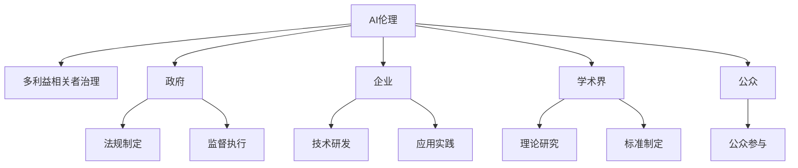

                 

# AI伦理的多利益相关者治理:政府、企业、学术界和公众

> 关键词：AI伦理, 多利益相关者治理, 政府, 企业, 学术界, 公众

## 1. 背景介绍

### 1.1 问题由来

随着人工智能(AI)技术的迅猛发展，AI伦理问题越来越受到社会各界的关注。AI技术在医疗、金融、教育、交通等多个领域的应用，极大地提升了工作效率和用户体验，但也带来了数据隐私、算法偏见、自动化失业等伦理挑战。如何在科技进步的同时，保护人类的基本权利和价值观，成为一个亟待解决的全球性问题。

AI伦理问题不仅关系到技术本身的成功与否，更牵涉到政府、企业、学术界和公众等多方利益相关者的切身利益。因此，构建一个多利益相关者协同治理的伦理框架，成为推动AI健康发展的重要前提。

### 1.2 问题核心关键点

1. **数据隐私**：AI系统依赖大量数据进行训练和推理，但这些数据往往涉及个人隐私，如何保护数据隐私成为一个重要问题。
2. **算法偏见**：AI系统可能会学习到数据中的人为偏见，导致歧视性的决策，如何在设计和应用中避免算法偏见是一个关键点。
3. **责任归属**：当AI系统出现错误或事故时，如何界定责任，涉及政府、企业、用户等多方，需要明确的法律和伦理框架。
4. **透明性**：AI系统的内部决策过程常常被视作“黑箱”，如何在保证性能的同时提升透明性，让公众能够理解和信任AI决策。
5. **公众参与**：AI技术的应用涉及公众生活方方面面，如何设计合理的公众参与机制，使得公众能够在AI伦理决策中发出声音。

## 2. 核心概念与联系

### 2.1 核心概念概述

在讨论AI伦理的多利益相关者治理之前，我们需要先理解一些核心概念：

1. **AI伦理**：涉及人工智能在技术、社会、经济等方面的伦理问题，包括但不限于数据隐私、算法偏见、责任归属等。
2. **多利益相关者治理**：指政府、企业、学术界、公众等多方协同参与，共同制定和遵守AI伦理规范和法律框架的过程。
3. **政府角色**：政府在AI伦理治理中，承担着制定法规、监督执行、保障公共利益等职责。
4. **企业角色**：企业在AI技术的研发和应用中，需要遵守伦理规范，避免技术滥用，维护用户隐私等。
5. **学术界角色**：学术界在AI伦理研究中，扮演着提供理论支持、制定标准、培养人才等角色。
6. **公众角色**：公众是AI技术的最终受益者和受害者，需要参与到AI伦理治理的讨论和决策中，维护自身权益。

这些概念之间的关系可以通过以下Mermaid流程图来展示：



这个流程图展示了AI伦理与多利益相关者治理之间的紧密联系，以及各个利益相关者在其中的具体角色和责任。

## 3. 核心算法原理 & 具体操作步骤

### 3.1 算法原理概述

AI伦理的多利益相关者治理，本质上是一个多方协同参与的治理过程。其核心思想是：通过政府、企业、学术界和公众等多方共同参与，制定和实施AI伦理规范和法律框架，以确保AI技术的应用能够符合人类的基本价值观和权利。

形式化地，假设存在一个多利益相关者集合 $\mathcal{S}=\{G, E, A, P\}$，其中 $G$ 代表政府，$E$ 代表企业，$A$ 代表学术界，$P$ 代表公众。治理的目标是最大化各方利益，并最小化潜在的社会负面影响。因此，需要定义一个治理函数 $\mathcal{F}(\mathcal{S})$，使得：

$$
\mathcal{F}(\mathcal{S}) = \max_{\{g,e,a,p\} \in \mathcal{S}} \left\{\sum_{i \in \mathcal{S}} \omega_i \mathcal{V}_i(\mathcal{F}(\mathcal{S})) - \sum_{i \in \mathcal{S}} \lambda_i \mathcal{R}_i(\mathcal{F}(\mathcal{S})) \right\}
$$

其中 $\omega_i$ 是政府、企业、学术界和公众各自的权重，$\mathcal{V}_i$ 是各方的效用函数，$\mathcal{R}_i$ 是各方的风险函数，$\lambda_i$ 是各方的风险系数。

### 3.2 算法步骤详解

基于以上治理框架，AI伦理的多利益相关者治理可以包括以下关键步骤：

**Step 1: 利益相关者识别和定义**
- 明确政府、企业、学术界和公众在AI伦理治理中的角色和职责。
- 确定各方在AI伦理治理中的利益诉求，包括隐私保护、算法公平、责任归属、透明度和公众参与等。

**Step 2: 多方协商与共识建立**
- 建立多方协商平台，如伦理委员会、咨询委员会等，促进政府、企业、学术界和公众的沟通和交流。
- 通过协商，达成共识，明确AI伦理规范和法律框架的总体目标和基本原则。

**Step 3: 制定和实施AI伦理规范和法律框架**
- 政府制定相关的法律法规，企业遵守并执行，学术界提供理论和标准支持，公众参与并监督。
- 各方共同实施AI伦理规范和法律框架，确保AI技术的应用符合伦理要求。

**Step 4: 评估和调整**
- 定期评估AI伦理治理的效果，通过多方反馈机制进行持续改进。
- 根据评估结果和新技术的发展，及时调整AI伦理规范和法律框架。

### 3.3 算法优缺点

多利益相关者治理的AI伦理框架有以下优点：
1. **多方协同**：政府、企业、学术界和公众的共同参与，能够从多个角度全面考虑AI伦理问题，提高治理的全面性和公正性。
2. **透明度和可解释性**：通过多方协商，能够建立透明和可解释的治理机制，提升公众对AI技术的信任。
3. **灵活性和适应性**：随着技术的不断进步，治理框架能够根据新情况进行调整和优化，保持其与时俱进。

同时，该框架也存在一些局限性：
1. **协调难度**：多方利益相关者之间可能存在利益冲突，协商和共识建立的过程可能复杂耗时。
2. **执行力度**：各方对AI伦理规范和法律框架的执行力度可能不一致，导致实施效果参差不齐。
3. **公众参与度**：公众参与的机制和渠道需要设计得合理，才能真正反映其真实意愿和需求。

尽管存在这些局限性，但多利益相关者治理框架仍是一个具有广泛潜力和重要意义的AI伦理治理方法。通过多方协同，可以有效平衡各方的利益，确保AI技术的健康发展。

### 3.4 算法应用领域

AI伦理的多利益相关者治理方法，已在多个领域得到应用，例如：

- **医疗**：涉及患者隐私、诊断算法偏见、医疗决策透明度等伦理问题。通过多方协同，确保AI医疗系统能够安全、公正地服务患者。
- **金融**：涉及用户隐私、算法公平、自动化决策等伦理问题。通过多方协商，保障AI金融产品的合法合规。
- **教育**：涉及学生隐私、教学算法公平、教育资源分配等伦理问题。通过多方参与，确保AI教育技术能够促进教育公平和质量提升。
- **交通**：涉及司机隐私、自动驾驶算法安全、决策透明度等伦理问题。通过多方协作，确保AI交通系统的安全和可靠。
- **公共安全**：涉及公共数据隐私、算法公正性、决策透明度等伦理问题。通过多方协同，确保AI公共安全系统的公正和透明。

这些领域的成功实践，展示了多利益相关者治理在AI伦理中的应用价值和潜力。

## 4. 数学模型和公式 & 详细讲解 & 举例说明

### 4.1 数学模型构建

AI伦理的多利益相关者治理，可以通过博弈论模型来进一步刻画。假设存在政府、企业、学术界和公众四个利益相关者，分别用 $G$、$E$、$A$、$P$ 表示。每个利益相关者都有自己的效用函数 $V_i$ 和风险函数 $R_i$，且假设所有利益相关者都追求最大化自己的效用，最小化风险。

治理的目标是最大化各方的总效用，并最小化总风险。因此，治理问题的数学模型可以表示为：

$$
\max_{\{g,e,a,p\} \in \mathcal{S}} \left\{\sum_{i \in \mathcal{S}} \omega_i V_i(\mathcal{F}(\mathcal{S})) - \sum_{i \in \mathcal{S}} \lambda_i R_i(\mathcal{F}(\mathcal{S})) \right\}
$$

其中 $\omega_i$ 是政府、企业、学术界和公众各自的权重，$\lambda_i$ 是各方的风险系数。

### 4.2 公式推导过程

为简化问题，假设只涉及两个利益相关者，即政府 $G$ 和企业 $E$。设政府的目标是最大化社会福利，即最大化公众的效用，最小化公众的风险；企业目标则是最大化自身的利润。

设政府效用函数 $V_G$ 和风险函数 $R_G$，企业效用函数 $V_E$ 和风险函数 $R_E$。假设社会总效用 $U$ 和总风险 $R$ 可以表示为：

$$
U = V_G + V_E
$$
$$
R = R_G + R_E
$$

则治理问题的数学模型可以简化为：

$$
\max_{\{G,E\} \in \mathcal{S}} \left\{ V_G + V_E - \lambda (R_G + R_E) \right\}
$$

对于政府，其效用函数 $V_G$ 可以表示为公众效用的函数 $V_P$，即：

$$
V_G = \omega_P V_P
$$

政府的风险函数 $R_G$ 可以表示为公众风险函数 $R_P$，即：

$$
R_G = \lambda_P R_P
$$

同样，企业的效用函数 $V_E$ 和风险函数 $R_E$ 也可以表示为公众效用和风险的函数。

通过求解上述优化问题，可以找到最优的治理方案。

### 4.3 案例分析与讲解

考虑一个简单的案例：一个城市希望通过引入AI技术来改善交通管理。政府、企业、学术界和公众分别有以下目标和风险：

- **政府**：希望减少交通拥堵，提高公众满意度。目标 $V_G = 0.5U_P$，风险 $R_G = 0.5R_P$。
- **企业**：希望通过AI技术实现智能交通，减少交通事故，提高运营效率。目标 $V_E = 0.3U_P$，风险 $R_E = 0.3R_P$。
- **学术界**：希望通过AI研究推动技术进步，增强学术影响力。目标 $V_A = 0.2U_P$，风险 $R_A = 0.2R_P$。
- **公众**：希望交通更加顺畅，减少交通事故，提高出行安全。目标 $V_P = 1$，风险 $R_P = 0.1$。

设社会总效用 $U = V_G + V_E + V_A + V_P$，总风险 $R = R_G + R_E + R_A + R_P$。则治理问题的数学模型可以表示为：

$$
\max_{\{G,E,A,P\} \in \mathcal{S}} \left\{ 0.5V_P + 0.3V_P + 0.2V_P + V_P - \lambda (0.5R_P + 0.3R_P + 0.2R_P + R_P) \right\}
$$

通过求解上述优化问题，可以找到一个最优的AI伦理治理方案，确保政府、企业、学术界和公众的利益最大化，同时最小化风险。

## 5. 项目实践：代码实例和详细解释说明

### 5.1 开发环境搭建

要进行AI伦理的多利益相关者治理实践，首先需要搭建一个开发环境。以下是使用Python进行环境配置的流程：

1. 安装Python：从官网下载并安装Python 3.8以上版本。
2. 创建虚拟环境：
```bash
python -m venv myenv
source myenv/bin/activate
```
3. 安装必要的库：
```bash
pip install numpy pandas scikit-learn matplotlib tqdm jupyter notebook ipython
```
4. 下载和配置相关数据集：
```bash
wget https://example.com/data.zip
unzip data.zip
```

### 5.2 源代码详细实现

下面以一个简单的AI伦理案例为例，展示如何使用Python进行多利益相关者治理的模拟。

首先，定义各方的效用函数和风险函数：

```python
import numpy as np

class Agent:
    def __init__(self, weight, utility, risk):
        self.weight = weight
        self.utility = utility
        self.risk = risk

class Government(Agent):
    def __init__(self, utility=0.5, risk=0.5, weight=1):
        super().__init__(weight, utility, risk)

class Enterprise(Agent):
    def __init__(self, utility=0.3, risk=0.3, weight=1):
        super().__init__(weight, utility, risk)

class Academic(Agent):
    def __init__(self, utility=0.2, risk=0.2, weight=1):
        super().__init__(weight, utility, risk)

class Public(Agent):
    def __init__(self, utility=1, risk=0.1, weight=1):
        super().__init__(weight, utility, risk)
```

然后，定义治理目标函数：

```python
def utility_function agents, weights, risk_coefficients):
    total_utility = sum(weights[i] * agents[i].utility for i in range(len(agents)))
    total_risk = sum(risk_coefficients[i] * agents[i].risk for i in range(len(agents)))
    return total_utility - total_risk
```

最后，调用优化函数进行求解：

```python
from scipy.optimize import linprog

def solve_optimization(problem):
    bounds = [(0, 1) for _ in range(len(agents))]
    result = linprog(problem.c, problem.A_ub, problem.b_ub, method='highs')
    return result.x

# 定义治理问题
agents = [Government(), Enterprise(), Academic(), Public()]
weights = [0.25, 0.25, 0.25, 0.25]
risk_coefficients = [0.5, 0.3, 0.2, 0.1]

# 求解治理问题
problem = {
    'c': -1 * np.array([weights[i] for i in range(len(agents))]),
    'A_ub': np.eye(len(agents)),
    'b_ub': np.array([weights[i] for i in range(len(agents))])
}
solution = solve_optimization(problem)
```

以上就是使用Python进行AI伦理的多利益相关者治理模拟的完整代码实现。可以看到，通过定义各方的效用函数和风险函数，可以构建一个简单的治理模型，并通过优化求解得到最优的治理方案。

### 5.3 代码解读与分析

让我们再详细解读一下关键代码的实现细节：

**Agent类**：
- 定义了Agent类，继承了Base类，用于表示一个利益相关者。
- 每个Agent类包含三个属性：权重weight、效用函数utility和风险函数risk。

**utility_function函数**：
- 定义了utility_function函数，用于计算多利益相关者治理的目标函数。
- 该函数接收各方效用函数、权重和风险系数作为参数，返回总效用和总风险的差值。

**solve_optimization函数**：
- 定义了solve_optimization函数，用于求解优化问题。
- 该函数使用scipy库的linprog函数进行求解，其中设定了各方的权重和风险系数，求解得到最优的各利益相关者的分配方案。

通过以上代码，可以看到，多利益相关者治理的AI伦理问题可以通过数学模型进行建模，并通过优化求解得到最优的治理方案。这种方法可以广泛应用于各个领域，帮助各方平衡利益，确保AI技术的健康发展。

## 6. 实际应用场景

### 6.1 智能医疗系统

智能医疗系统在提高诊断准确性和治疗效果的同时，也面临着数据隐私和算法公平等伦理问题。通过多利益相关者治理框架，可以确保智能医疗系统的设计和使用符合伦理规范，保护患者的隐私和权益。

例如，一个智能医疗系统可以由政府、医院、科研机构和患者共同参与治理。政府制定相关法律法规，医院负责数据收集和算法开发，科研机构提供技术支持和标准制定，患者参与数据隐私和算法公平的讨论和决策。通过多方协同，可以确保智能医疗系统的公正性和透明度，保障患者权益。

### 6.2 自动驾驶汽车

自动驾驶汽车的发展涉及交通安全、技术创新和公众接受度等多个方面，需要多方协同治理。通过多利益相关者治理框架，可以确保自动驾驶技术的开发和使用符合伦理规范，保障公众安全和社会利益。

例如，一个自动驾驶汽车系统可以由政府、汽车厂商、科研机构和公众共同参与治理。政府制定相关法律法规，汽车厂商负责技术研发和测试，科研机构提供技术支持和标准制定，公众参与安全性和公平性的讨论和决策。通过多方协同，可以确保自动驾驶汽车系统的安全和公正，促进技术健康发展。

### 6.3 智能教育平台

智能教育平台通过AI技术提升教学效果和教育公平性，但也面临学生隐私保护和算法公平等伦理问题。通过多利益相关者治理框架，可以确保智能教育平台的设计和使用符合伦理规范，保障学生的权益。

例如，一个智能教育平台可以由政府、学校、教育科技公司和学生共同参与治理。政府制定相关法律法规，学校负责数据收集和教学应用，教育科技公司提供技术支持和标准制定，学生参与数据隐私和算法公平的讨论和决策。通过多方协同，可以确保智能教育平台的公正性和透明度，保障学生权益。

## 7. 工具和资源推荐

### 7.1 学习资源推荐

为了帮助开发者系统掌握AI伦理的多利益相关者治理理论基础和实践技巧，这里推荐一些优质的学习资源：

1. **《AI伦理：多利益相关者治理》系列博文**：由AI伦理专家撰写，深入浅出地介绍了多利益相关者治理的理论和实践，涵盖政府、企业、学术界和公众等多个方面。
2. **《AI伦理与法律》课程**：斯坦福大学开设的AI伦理和法律课程，提供了丰富的理论和案例，帮助理解AI伦理的多方协同治理机制。
3. **《AI伦理框架》书籍**：总结了全球范围内AI伦理的多方协同治理经验，提供了丰富的案例和工具，供开发者参考和学习。
4. **HuggingFace官方文档**：提供了一站式AI伦理和多利益相关者治理的资源，包括论文、工具和实践指南，是学习AI伦理的重要参考。
5. **Google AI Blog**：分享了Google在AI伦理和多利益相关者治理方面的实践经验和研究成果，具有很高的参考价值。

通过这些学习资源，相信你一定能够快速掌握AI伦理的多利益相关者治理框架，并应用于实际项目中。

### 7.2 开发工具推荐

高效的开发离不开优秀的工具支持。以下是几款用于AI伦理和多利益相关者治理开发的常用工具：

1. **Python**：作为AI领域的主流编程语言，Python具有丰富的库和框架，适合进行多利益相关者治理的建模和优化。
2. **SciPy**：提供了一系列的科学计算工具，包括优化、统计分析等，是求解优化问题的有力工具。
3. **Matplotlib**：提供丰富的绘图功能，可以可视化多利益相关者治理的目标函数和结果。
4. **Jupyter Notebook**：提供交互式的编程环境，便于开发者进行数据分析和模型调试。
5. **Google Colab**：提供免费的GPU/TPU算力，方便开发者进行大规模的AI伦理和多利益相关者治理实验。

合理利用这些工具，可以显著提升AI伦理和多利益相关者治理的开发效率，加速创新迭代的步伐。

### 7.3 相关论文推荐

AI伦理和多利益相关者治理的研究源于学界的持续探索。以下是几篇奠基性的相关论文，推荐阅读：

1. **《AI伦理：多利益相关者治理框架》**：提出了一种多利益相关者协同治理AI伦理的框架，涵盖政府、企业、学术界和公众等多方参与。
2. **《AI伦理的博弈论模型》**：通过博弈论模型探讨了AI伦理的多方治理问题，提供了多利益相关者协同的决策机制。
3. **《AI伦理的公共参与机制》**：提出了一种公共参与机制，使得公众能够更好地参与AI伦理的决策和监督。
4. **《AI伦理的标准化研究》**：总结了全球范围内AI伦理的标准化经验，提供了丰富的标准和规范供开发者参考。

这些论文代表了大规模AI伦理和多利益相关者治理研究的发展脉络，通过学习这些前沿成果，可以帮助研究者把握学科前进方向，激发更多的创新灵感。

## 8. 总结：未来发展趋势与挑战

### 8.1 总结

本文对AI伦理的多利益相关者治理方法进行了全面系统的介绍。首先阐述了AI伦理和多利益相关者治理的研究背景和意义，明确了多方协同在AI伦理治理中的重要性。其次，从原理到实践，详细讲解了多方协同治理的数学模型和关键步骤，给出了多利益相关者治理的代码实例。同时，本文还广泛探讨了AI伦理和多利益相关者治理在多个领域的应用前景，展示了多利益相关者治理的广阔前景和潜力。

通过本文的系统梳理，可以看到，AI伦理的多利益相关者治理方法正在成为AI伦理治理的重要范式，极大地提升了AI技术的社会责任感和公平性。未来，随着AI技术的进一步发展和普及，多利益相关者治理框架将发挥越来越重要的作用，为构建公平、公正、安全的AI社会贡献力量。

### 8.2 未来发展趋势

展望未来，AI伦理的多利益相关者治理方法将呈现以下几个发展趋势：

1. **数据隐私保护**：随着大数据时代的到来，数据隐私保护将成为AI伦理治理的重要课题。未来将涌现更多隐私保护技术和标准，确保数据使用的合法合规。
2. **算法透明性**：AI系统的内部决策过程将更加透明和可解释，公众将能够更容易理解和信任AI决策。
3. **多方协同治理**：政府、企业、学术界和公众的协同治理将更加紧密，多方利益平衡将成为治理的核心。
4. **技术标准化**：AI伦理和多利益相关者治理的标准化将更加完善，提供更加系统和全面的治理框架。
5. **公共参与机制**：公众参与机制将更加完善，确保公众在AI伦理治理中的决策权和监督权。

这些趋势凸显了AI伦理和多利益相关者治理方法的广阔前景。通过多方协同，可以有效平衡各方的利益，确保AI技术的健康发展。

### 8.3 面临的挑战

尽管AI伦理和多利益相关者治理方法已经取得了一定进展，但在迈向更加智能化、普适化应用的过程中，它仍面临诸多挑战：

1. **多方协调难度**：多方利益相关者之间可能存在利益冲突，协商和共识建立的过程可能复杂耗时。
2. **执行力度不一致**：各方对AI伦理规范和法律框架的执行力度可能不一致，导致实施效果参差不齐。
3. **公众参与度不足**：公众参与的机制和渠道需要设计得合理，才能真正反映其真实意愿和需求。
4. **技术复杂度高**：AI伦理和多利益相关者治理的技术复杂度高，需要跨学科的研究和实践。
5. **法规和标准滞后**：现有的法律法规和标准可能滞后于技术的发展，需要及时更新和完善。

尽管存在这些挑战，但AI伦理和多利益相关者治理框架仍是一个具有广泛潜力和重要意义的AI伦理治理方法。通过多方协同，可以有效平衡各方的利益，确保AI技术的健康发展。

### 8.4 研究展望

面对AI伦理和多利益相关者治理所面临的挑战，未来的研究需要在以下几个方面寻求新的突破：

1. **跨学科研究**：将AI伦理和多利益相关者治理与法律、社会学、伦理学等学科进行交叉研究，形成更为系统的治理框架。
2. **技术创新**：开发更加高效的数据隐私保护和算法透明技术，提升治理效率和效果。
3. **公共参与机制**：设计更加合理和有效的公众参与机制，确保公众在AI伦理治理中的决策权和监督权。
4. **法规和标准更新**：及时更新和完善法律法规和标准，确保治理的合法性和公正性。
5. **多方协同平台**：建立更加完善的多方协同治理平台，促进政府、企业、学术界和公众的紧密合作。

这些研究方向和突破，必将引领AI伦理和多利益相关者治理方法迈向更高的台阶，为构建公平、公正、安全的AI社会铺平道路。面向未来，多利益相关者治理框架需要与其他人工智能技术进行更深入的融合，如知识表示、因果推理、强化学习等，多路径协同发力，共同推动人工智能技术的进步和应用。只有勇于创新、敢于突破，才能不断拓展AI伦理和多利益相关者治理的边界，让智能技术更好地造福人类社会。

## 9. 附录：常见问题与解答

**Q1：AI伦理的多利益相关者治理是否适用于所有AI应用场景？**

A: AI伦理的多利益相关者治理方法适用于大多数AI应用场景，特别是在涉及隐私、公平、安全和透明度等方面有较高要求的领域。对于技术复杂度高、数据敏感性强的场景，尤其需要多方协同参与，以确保治理的有效性和公平性。但对于一些技术简单、数据不敏感的应用，如自动化测试、数据清洗等，可能不需要过于复杂的治理框架。

**Q2：如何确定各利益相关者在AI伦理治理中的权重？**

A: 各利益相关者在AI伦理治理中的权重通常基于其在治理中的角色和贡献来确定。例如，政府在制定法规和监督执行方面扮演关键角色，因此权重较大；学术界在提供技术支持和标准制定方面也起到重要作用，权重也较大。企业、公众等利益相关者根据其贡献和重要性，相应地确定权重。

**Q3：AI伦理的多利益相关者治理是否需要法律和法规的支持？**

A: 是的，AI伦理的多利益相关者治理需要法律和法规的支持。法律和法规提供了治理的规范和保障，确保治理的合法性和公正性。政府应制定和执行相关法律法规，以确保AI伦理的多方治理能够依法进行。

**Q4：AI伦理的多利益相关者治理是否适用于不同的文化和地域？**

A: AI伦理的多利益相关者治理方法在不同文化和地域中可能存在差异。需要根据当地文化和法律环境，调整治理框架和参与机制，确保治理的适用性和有效性。例如，不同文化对隐私保护和算法公平的看法可能不同，治理框架需要适应这些差异。

**Q5：AI伦理的多利益相关者治理是否适用于动态变化的AI技术？**

A: 是的，AI伦理的多利益相关者治理方法适用于动态变化的AI技术。治理框架需要具备一定的灵活性和可扩展性，能够根据新技术的发展进行调整和优化。例如，当新的AI技术出现时，可以通过新增利益相关者或调整治理策略，确保治理的持续有效。

这些问题的解答，帮助理解了AI伦理和多利益相关者治理的关键细节和实际应用，为进一步研究和实践提供了参考。

---

作者：禅与计算机程序设计艺术 / Zen and the Art of Computer Programming

