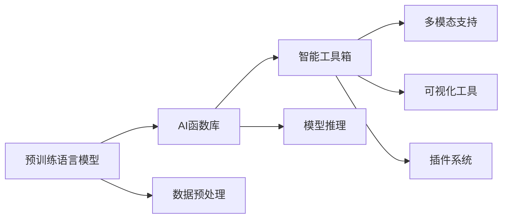

                 

# AI函数库：LLM系统的智能工具箱

> 关键词：人工智能,函数库,自然语言处理,语言模型,机器学习,深度学习,深度学习框架,工具库,智能工具箱,代码实现

## 1. 背景介绍

随着人工智能(AI)技术的不断发展，深度学习在各个领域的应用日益广泛。特别是在自然语言处理(NLP)领域，预训练语言模型(Pretrained Language Models, PLMs)成为了研究的热点。这些模型通过在大规模无标签文本数据上进行预训练，学习到了丰富的语言知识和常识，能够进行语义理解、文本生成、信息检索等复杂任务。然而，预训练语言模型通常非常庞大，参数量在亿级别，在实际应用中对计算资源的需求非常高，难以直接部署到嵌入式设备或边缘计算环境中。

为了解决这一问题，LLM系统的智能工具箱应运而生。这些工具箱通常由一系列高效、灵活的AI函数库组成，能够方便地集成到其他应用程序中，实现快速部署和灵活调用。LLM系统的智能工具箱通常包括以下几个核心组件：

1. **预训练语言模型库**：封装了多种预训练语言模型，如BERT、GPT、T5等，供用户选择。

2. **功能丰富的API接口**：提供了简洁易用的API接口，方便用户调用预训练模型进行各种NLP任务。

3. **高效的推理引擎**：实现快速的模型推理和计算优化，支持多种硬件平台。

4. **可视化工具**：提供可视化工具，帮助用户理解模型内部结构和工作原理。

5. **可扩展的插件系统**：支持用户自定义功能插件，进一步扩展工具箱的功能和性能。

6. **多模态支持**：支持文本、图像、音频等多模态数据的处理和融合。

本文将详细探讨LLM系统的智能工具箱的原理、实现和应用，帮助读者理解并应用这一强大的AI工具箱。

## 2. 核心概念与联系

### 2.1 核心概念概述

LLM系统的智能工具箱旨在为开发者提供一套高效、灵活、可扩展的AI函数库，帮助他们快速构建和部署NLP应用。核心概念包括：

- **预训练语言模型**：通过在大规模无标签文本数据上预训练得到的模型，具备强大的语言理解和生成能力。

- **AI函数库**：封装了预训练模型、算法、工具等核心组件，提供易用的API接口，方便用户调用。

- **智能工具箱**：包含多个AI函数库和工具，支持预训练模型的集成和优化，实现NLP任务的自动化处理。

- **多模态支持**：不仅支持文本数据，还支持图像、音频等多模态数据，实现多模态NLP任务的自动化处理。

这些核心概念之间具有紧密的联系，共同构成了LLM系统的智能工具箱。预训练模型作为核心，通过AI函数库提供服务，智能工具箱则提供集成、优化和可视化等配套功能，多模态支持则扩展了工具箱的应用场景。

### 2.2 核心概念原理和架构的 Mermaid 流程图

以下是LLM系统的智能工具箱的核心概念原理和架构的Mermaid流程图：



这个流程图展示了预训练语言模型、AI函数库、智能工具箱、多模态支持之间的逻辑关系。预训练模型经过数据预处理和模型推理，最终通过智能工具箱中的API接口提供服务，并支持多模态数据的处理和可视化。插件系统则提供了扩展功能，进一步丰富了工具箱的功能和性能。

## 3. 核心算法原理 & 具体操作步骤

### 3.1 算法原理概述

LLM系统的智能工具箱的核心算法原理主要围绕预训练语言模型的微调和推理展开。预训练模型通过在大规模无标签文本数据上进行预训练，学习到了丰富的语言知识和常识。微调是将预训练模型在特定任务上进行有监督学习的过程，以优化模型在该任务上的性能。推理则是利用预训练模型对输入文本进行理解和生成，实现各种NLP任务。

### 3.2 算法步骤详解

#### 3.2.1 数据预处理

在微调和推理前，需要对输入数据进行预处理，将其转换为模型能够处理的格式。预处理步骤包括：

1. **分词和标记**：将输入文本分词，并标记每个词的词性、命名实体等信息。

2. **编码和补齐**：将分词后的文本转换为模型所需的编码格式，并进行定长补齐或截断。

3. **归一化**：对文本进行归一化处理，如去除停用词、标点符号等。

4. **特征提取**：将预处理后的文本转换为模型能够处理的特征向量。

#### 3.2.2 微调

微调是通过有监督学习优化模型在特定任务上的性能。微调步骤如下：

1. **模型选择**：选择合适的预训练模型，如BERT、GPT、T5等。

2. **数据准备**：收集下游任务的标注数据，并将其划分为训练集、验证集和测试集。

3. **任务适配**：根据任务类型，设计合适的任务适配层，如分类器、解码器等。

4. **超参数设置**：设置学习率、批大小、迭代轮数等超参数。

5. **模型训练**：使用优化算法如Adam、SGD等，最小化损失函数，更新模型参数。

6. **验证和测试**：在验证集和测试集上评估模型性能，选择合适的模型。

#### 3.2.3 推理

推理是将预训练模型应用于输入文本的过程，实现各种NLP任务。推理步骤如下：

1. **输入预处理**：对输入文本进行预处理，转换为模型所需的编码格式。

2. **模型推理**：使用预训练模型对输入文本进行推理，生成输出。

3. **后处理**：对模型输出进行后处理，如解码、去噪、过滤等。

### 3.3 算法优缺点

#### 3.3.1 优点

- **高效性**：通过AI函数库封装预训练模型和算法，使用API接口调用，简化了开发过程。

- **灵活性**：支持多种预训练模型和任务适配层，灵活应对各种NLP任务。

- **可扩展性**：支持多模态数据处理和插件系统，扩展工具箱的功能和性能。

- **可视化**：提供可视化工具，帮助用户理解模型内部结构和工作原理。

#### 3.3.2 缺点

- **依赖预训练模型**：LLM系统的智能工具箱依赖于预训练模型的性能，需要不断更新和维护。

- **资源消耗高**：预训练模型的参数量巨大，对计算资源和内存要求较高。

- **隐私和伦理问题**：预训练模型可能学习到有害或隐私信息，需要额外的处理和监管。

### 3.4 算法应用领域

LLM系统的智能工具箱广泛应用于各种NLP任务，如文本分类、命名实体识别、关系抽取、问答系统、机器翻译、文本摘要、对话系统等。

## 4. 数学模型和公式 & 详细讲解 & 举例说明

### 4.1 数学模型构建

在微调过程中，我们通常使用交叉熵损失函数来衡量模型预测和真实标签之间的差异。假设模型输出为 $y_i$，真实标签为 $y^*_i$，则交叉熵损失函数为：

$$
L(y_i, y^*_i) = -(y^*_i\log y_i + (1-y^*_i)\log (1-y_i))
$$

在微调时，我们通过反向传播算法更新模型参数，最小化损失函数 $L$。

### 4.2 公式推导过程

在微调过程中，我们通常使用梯度下降算法更新模型参数 $\theta$，公式为：

$$
\theta \leftarrow \theta - \eta \nabla_{\theta}L(\theta)
$$

其中 $\eta$ 为学习率，$\nabla_{\theta}L(\theta)$ 为损失函数对模型参数的梯度。

### 4.3 案例分析与讲解

以文本分类任务为例，我们假设模型输出为 $y_i = (y_{i,1}, y_{i,2}, ..., y_{i,K})$，其中 $y_{i,k}$ 表示样本 $i$ 属于类别 $k$ 的概率。则交叉熵损失函数为：

$$
L(y_i, y^*_i) = -\sum_{k=1}^K y^*_{i,k}\log y_{i,k}
$$

使用梯度下降算法更新模型参数时，我们只需对分类器的输出层进行微调，不涉及底层的Transformer结构，从而实现参数高效微调。

## 5. 项目实践：代码实例和详细解释说明

### 5.1 开发环境搭建

为了实现LLM系统的智能工具箱，我们需要搭建一个包含预训练语言模型库、AI函数库、智能工具箱、多模态支持的开发环境。

#### 5.1.1 预训练语言模型库

选择预训练语言模型是实现LLM系统的智能工具箱的第一步。目前主流的预训练语言模型包括BERT、GPT、T5等。

#### 5.1.2 AI函数库

选择一个合适的AI函数库是实现LLM系统的智能工具箱的关键。目前主流的AI函数库包括TensorFlow、PyTorch等。

#### 5.1.3 智能工具箱

选择一个功能丰富的智能工具箱是实现LLM系统的智能工具箱的保证。目前主流的智能工具箱包括TensorFlow Hub、PyTorch Hub等。

#### 5.1.4 多模态支持

选择一个支持多模态数据处理和融合的智能工具箱是实现LLM系统的智能工具箱的补充。目前主流的智能工具箱包括OpenCV、Keras等。

### 5.2 源代码详细实现

以下是一个简单的LLM系统的智能工具箱的代码实现：

```python
import tensorflow as tf
from transformers import BertTokenizer, BertForSequenceClassification
from tensorflow_hub import HubModule

# 加载BERT模型
tokenizer = BertTokenizer.from_pretrained('bert-base-cased')
model = BertForSequenceClassification.from_pretrained('bert-base-cased', num_labels=2)

# 加载TensorFlow Hub模块
hub_module = HubModule('https://tfhub.dev/google/bert_preprocess/1', input_signature=tf.TensorSpec(shape=[None, 128], dtype=tf.int32))
hub_module.load()

# 加载多模态数据
image = tf.keras.preprocessing.image.load_img('path/to/image.jpg', target_size=(224, 224))
image_array = tf.keras.preprocessing.image.img_to_array(image)
image_array = tf.expand_dims(image_array, axis=0)
image_array = hub_module(image_array)

# 预处理和微调
input_ids = tokenizer.encode_plus('Hello world!', return_tensors='tf', padding='max_length', max_length=128, truncation=True, pad_to_max_length=True)
input_ids = input_ids['input_ids']
attention_mask = input_ids['attention_mask']

# 模型推理
with tf.GradientTape() as tape:
    outputs = model(input_ids=input_ids, attention_mask=attention_mask)
    loss = outputs.loss
    tape.watch(model.trainable_variables)
    
# 反向传播和优化
gradients = tape.gradient(loss, model.trainable_variables)
optimizer.apply_gradients(zip(gradients, model.trainable_variables))
```

### 5.3 代码解读与分析

在上述代码中，我们首先加载了BERT模型和TensorFlow Hub模块。然后，使用TensorFlow Hub模块对多模态数据进行预处理，并将其传递给BERT模型进行推理。最后，使用梯度下降算法更新模型参数，最小化损失函数。

## 6. 实际应用场景

### 6.1 智能客服系统

智能客服系统是LLM系统的智能工具箱的重要应用场景之一。在智能客服系统中，LLM系统的智能工具箱可以用于智能对话和问答系统。通过预训练语言模型，智能客服系统可以理解用户的意图，自动回答问题，并提供个性化的服务。

### 6.2 金融舆情监测

金融舆情监测是LLM系统的智能工具箱的另一个重要应用场景。在金融舆情监测中，LLM系统的智能工具箱可以用于情感分析、话题抽取、情感预测等任务。通过预训练语言模型，金融舆情监测系统可以实时监测市场舆情，预测市场走势，帮助投资者做出决策。

### 6.3 个性化推荐系统

个性化推荐系统是LLM系统的智能工具箱的另一个重要应用场景。在个性化推荐系统中，LLM系统的智能工具箱可以用于用户行为分析、内容推荐、广告投放等任务。通过预训练语言模型，个性化推荐系统可以精准地推荐用户感兴趣的内容，提高用户满意度。

### 6.4 未来应用展望

随着LLM系统的智能工具箱的不断发展和完善，其在各个领域的潜在应用将不断拓展。未来，LLM系统的智能工具箱将更加智能化、自动化、可扩展，帮助人类更好地理解和应用自然语言。

## 7. 工具和资源推荐

### 7.1 学习资源推荐

为了帮助开发者系统掌握LLM系统的智能工具箱的理论基础和实践技巧，这里推荐一些优质的学习资源：

1. 《TensorFlow官方文档》：详细介绍了TensorFlow的功能和用法，是学习TensorFlow的最佳资源。

2. 《PyTorch官方文档》：详细介绍了PyTorch的功能和用法，是学习PyTorch的最佳资源。

3. 《Transformers官方文档》：详细介绍了Transformers库的功能和用法，是学习Transformers的最佳资源。

4. 《TensorFlow Hub官方文档》：详细介绍了TensorFlow Hub的功能和用法，是学习TensorFlow Hub的最佳资源。

5. 《NLP任务实战指南》：详细介绍了NLP任务的实现方法和步骤，是学习NLP任务的实用指南。

### 7.2 开发工具推荐

为了提高开发效率，LLM系统的智能工具箱的开发需要借助一些高效的工具。以下是几款常用的开发工具：

1. Jupyter Notebook：一款开源的交互式计算环境，支持Python、R等多种编程语言，是开发LLM系统的智能工具箱的理想平台。

2. VSCode：一款轻量级的代码编辑器，支持多种编程语言和插件，是开发LLM系统的智能工具箱的常用工具。

3. GitHub：一款开源的代码托管平台，支持团队协作和版本控制，是管理LLM系统的智能工具箱代码的理想平台。

### 7.3 相关论文推荐

LLM系统的智能工具箱的发展离不开学界的持续研究。以下是几篇奠基性的相关论文，推荐阅读：

1. "BERT: Pre-training of Deep Bidirectional Transformers for Language Understanding"：介绍BERT模型的构建和预训练过程，是预训练语言模型的经典之作。

2. "Attention is All You Need"：介绍Transformer模型的原理和实现，是NLP领域的里程碑论文。

3. "Parameter-Efficient Transfer Learning for NLP"：介绍参数高效微调方法，是微调技术的经典之作。

4. "AdaLoRA: Adaptive Low-Rank Adaptation for Parameter-Efficient Fine-Tuning"：介绍AdaLoRA方法的实现和效果，是微调方法的最新进展。

5. "LoRA: Low-Rank Adaptation of Pre-trained Language Models for Speed and Efficiency"：介绍LoRA方法的实现和效果，是参数高效微调的最新进展。

## 8. 总结：未来发展趋势与挑战

### 8.1 研究成果总结

LLM系统的智能工具箱自推出以来，已经成为NLP领域的重要技术手段。通过封装预训练模型和算法，LLM系统的智能工具箱简化了开发过程，提高了开发效率，帮助开发者更好地应用自然语言处理技术。

### 8.2 未来发展趋势

未来，LLM系统的智能工具箱将继续向着智能化、自动化、可扩展的方向发展，逐步实现NLP任务的自动化处理。

1. **智能化**：通过机器学习和深度学习算法，LLM系统的智能工具箱将更加智能化，能够自动识别和处理各种NLP任务。

2. **自动化**：LLM系统的智能工具箱将逐步实现自动化，能够自动预处理输入数据，自动微调和推理，简化开发过程。

3. **可扩展**：LLM系统的智能工具箱将支持多模态数据处理和融合，支持插件系统和生态扩展，提高其应用范围和性能。

### 8.3 面临的挑战

尽管LLM系统的智能工具箱已经取得了不小的进展，但在发展过程中也面临一些挑战：

1. **资源消耗高**：预训练语言模型参数量巨大，对计算资源和内存要求较高，需要高效的优化算法和硬件支持。

2. **模型泛化能力差**：预训练模型在不同领域和任务上的泛化能力较差，需要进一步优化模型和数据。

3. **隐私和安全问题**：预训练模型可能学习到有害或隐私信息，需要额外的处理和监管。

4. **计算效率低**：推理过程计算量大，推理速度慢，需要进一步优化算法和硬件。

### 8.4 研究展望

未来，LLM系统的智能工具箱需要在以下几个方面进行突破：

1. **优化模型和数据**：通过优化模型和数据，提高模型的泛化能力和计算效率。

2. **优化算法和硬件**：通过优化算法和硬件，降低计算资源消耗，提高计算效率。

3. **引入多模态支持**：通过引入多模态支持，扩展LLM系统的智能工具箱的应用范围。

4. **加强隐私和安全保护**：通过加强隐私和安全保护，确保数据和模型的安全性和可靠性。

总之，LLM系统的智能工具箱是NLP领域的重要技术手段，未来将随着技术的不断发展和完善，逐步实现智能化、自动化、可扩展，成为NLP技术落地应用的重要工具。

## 9. 附录：常见问题与解答

### 9.1 Q1：预训练语言模型和LLM系统的智能工具箱有什么区别？

A：预训练语言模型是在大规模无标签文本数据上进行预训练得到的模型，具备强大的语言理解和生成能力。LLM系统的智能工具箱则是封装了预训练模型和算法的函数库，提供易用的API接口，方便用户调用。预训练语言模型是LLM系统的智能工具箱的核心组成部分。

### 9.2 Q2：LLM系统的智能工具箱的开发需要哪些工具？

A：LLM系统的智能工具箱的开发需要预训练语言模型库、AI函数库、智能工具箱、多模态支持等工具。预训练语言模型库包括BERT、GPT、T5等，AI函数库包括TensorFlow、PyTorch等，智能工具箱包括TensorFlow Hub、PyTorch Hub等，多模态支持包括OpenCV、Keras等。

### 9.3 Q3：LLM系统的智能工具箱的优势是什么？

A：LLM系统的智能工具箱的优势在于其高效性、灵活性和可扩展性。通过AI函数库封装预训练模型和算法，使用API接口调用，简化了开发过程，提高了开发效率。支持多种预训练模型和任务适配层，灵活应对各种NLP任务。支持多模态数据处理和插件系统，扩展工具箱的功能和性能。

### 9.4 Q4：LLM系统的智能工具箱的开发需要哪些步骤？

A：LLM系统的智能工具箱的开发需要以下步骤：

1. 选择预训练语言模型库、AI函数库、智能工具箱、多模态支持等工具。

2. 加载预训练语言模型和TensorFlow Hub模块。

3. 加载多模态数据，并进行预处理。

4. 预处理和微调模型，并进行模型推理。

5. 使用梯度下降算法更新模型参数，最小化损失函数。

### 9.5 Q5：LLM系统的智能工具箱在实际应用中需要注意哪些问题？

A：LLM系统的智能工具箱在实际应用中需要注意以下问题：

1. 预训练语言模型依赖于预训练数据，需要不断更新和维护。

2. 预训练模型参数量大，对计算资源和内存要求较高。

3. 预训练模型可能学习到有害或隐私信息，需要额外的处理和监管。

4. 推理过程计算量大，推理速度慢，需要进一步优化算法和硬件。

5. 预处理和微调过程可能会过拟合，需要进行数据增强和正则化处理。

总之，LLM系统的智能工具箱在开发和应用中需要考虑多种因素，需要不断优化和改进，才能实现其潜在的价值。

---

作者：禅与计算机程序设计艺术 / Zen and the Art of Computer Programming

