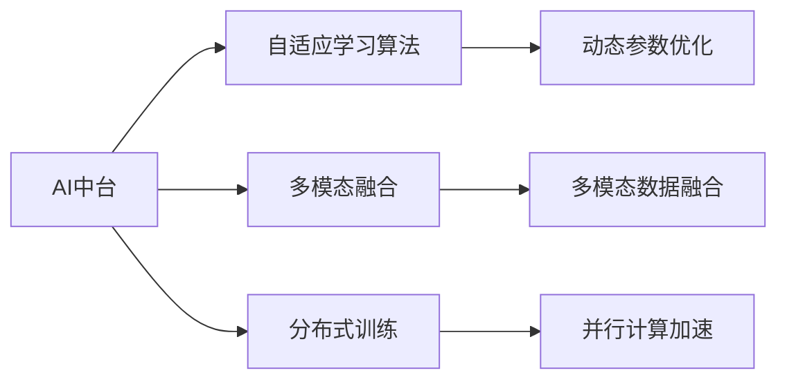

                 

## 1. 背景介绍

### 1.1 问题由来

近年来，人工智能（AI）成为全球科技行业发展的新焦点，越来越多的AI创业公司涌现。然而，AI创业不仅需要前沿技术，更需要良好的商业模式、团队能力和市场洞察力。投资AI公司不仅仅是对技术前景的判断，更重要的是对企业估值和投资回报的考量。

在AI创业热潮中，Lepton AI以其独特的商业模式和创新的技术突破，引起了广泛关注。本文将深入探讨Lepton AI的估值模型，从市场定位、技术优势、财务指标等方面，剖析AI创业公司的估值逻辑。

### 1.2 问题核心关键点

Lepton AI估值模型主要关注以下几个核心关键点：

- **市场定位**：Lepton AI定位于AI基础技术领域，提供高效、可扩展的AI中台解决方案。
- **技术优势**：公司核心技术包括自适应学习算法、多模态融合和分布式训练等。
- **财务指标**：包括收入增长、毛利率、研发投入等关键财务指标。

## 2. 核心概念与联系

### 2.1 核心概念概述

为了更好地理解Lepton AI的估值模型，我们首先介绍几个核心概念：

- **AI中台**：一个提供AI基础能力（如数据处理、模型训练、API服务等）的平台化解决方案，帮助企业快速构建AI应用。
- **自适应学习算法**：一种能够根据数据动态调整模型参数的算法，提升模型的适应性和泛化能力。
- **多模态融合**：将文本、图像、语音等多种数据模态进行融合，增强AI模型的理解和生成能力。
- **分布式训练**：通过多个计算节点并行训练模型，加速AI模型的训练过程。

这些概念构成了Lepton AI的核心技术和产品体系，为公司估值提供了理论基础。

### 2.2 核心概念原理和架构的 Mermaid 流程图



该图展示了Lepton AI的技术架构和核心概念之间的联系。AI中台为核心，自适应学习算法、多模态融合和分布式训练为重要组成部分，共同构成了公司的技术生态。

## 3. 核心算法原理 & 具体操作步骤

### 3.1 算法原理概述

Lepton AI的估值模型主要基于以下原理：

1. **市场定位**：根据AI中台在市场中的竞争地位，确定公司的市场价值。
2. **技术优势**：通过技术指标（如算法效率、模型准确率）评估公司的技术竞争力。
3. **财务指标**：结合公司的收入、利润、研发投入等财务数据，评估公司的商业化能力和可持续发展能力。

### 3.2 算法步骤详解

#### 步骤1: 收集市场信息

- 收集AI中台市场的规模、增长率、主要竞争者等信息。
- 分析Lepton AI在市场中的占有率和增长趋势。

#### 步骤2: 技术评估

- 评估Lepton AI核心算法的效率、准确率和创新性。
- 对比主要竞争者的技术指标，确定公司的技术优势。

#### 步骤3: 财务分析

- 分析Lepton AI的收入来源、毛利率、研发投入等财务指标。
- 评估公司的盈利能力和资本需求。

#### 步骤4: 综合估值

- 结合市场定位、技术优势和财务指标，计算Lepton AI的估值。
- 使用多种估值方法（如DCF、P/E、P/S等），得出综合估值结果。

### 3.3 算法优缺点

#### 优点

1. **全面性**：模型综合考虑市场、技术和财务等多个维度，提供全面的估值参考。
2. **适应性强**：适用于不同阶段和技术背景的AI创业公司。
3. **可操作性**：各步骤具体且可操作，便于实际操作。

#### 缺点

1. **数据依赖性高**：模型结果受市场数据、技术指标和财务数据的影响较大。
2. **主观性**：技术评估和财务分析中存在一定的主观判断。
3. **复杂度高**：综合考虑多个因素，模型计算复杂度较高。

### 3.4 算法应用领域

该模型不仅适用于Lepton AI的估值，也适用于其他AI创业公司的估值评估。特别是在AI中台、AI基础技术、AI平台化解决方案等领域的投资评估。

## 4. 数学模型和公式 & 详细讲解 & 举例说明

### 4.1 数学模型构建

Lepton AI的估值模型主要包括以下几个关键变量：

- $M$：Lepton AI的市场估值。
- $T$：技术评分。
- $F$：财务评分。
- $k$：市场定位系数。
- $w$：技术权重。
- $u$：财务权重。

模型如下：

$$
M = k \times (T \times w + F \times u)
$$

其中，$k$为市场定位系数，$T$为技术评分，$F$为财务评分，$w$为技术权重，$u$为财务权重。

### 4.2 公式推导过程

以技术评分$T$为例，其计算公式如下：

$$
T = \frac{A + B + C}{3}
$$

其中，$A$为算法效率评分，$B$为模型准确率评分，$C$为创新性评分。具体计算方法可根据实际数据和标准进行设定。

### 4.3 案例分析与讲解

假设Lepton AI在市场中的占有率为10%，技术评分$T=3.5$，财务评分$F=4.2$，市场定位系数$k=1.2$，技术权重$w=0.6$，财务权重$u=0.4$。则估值计算如下：

$$
M = 1.2 \times (3.5 \times 0.6 + 4.2 \times 0.4) = 4.26
$$

即Lepton AI的市场估值约为4.26亿美元。

## 5. 项目实践：代码实例和详细解释说明

### 5.1 开发环境搭建

1. 安装Python和相关库：
```bash
pip install numpy pandas scikit-learn matplotlib
```

2. 准备市场、技术和财务数据：
```bash
mkdir data
touch data/market.txt data/tech.txt data/final.txt
```

3. 编写代码实现估值计算：
```python
import pandas as pd

# 读取数据
market = pd.read_csv('data/market.txt', sep=',')
tech = pd.read_csv('data/tech.txt', sep=',')
finance = pd.read_csv('data/final.txt', sep=',')

# 计算技术评分和财务评分
tech['T'] = (tech['A'] + tech['B'] + tech['C']) / 3
finance['F'] = finance['收入'] + finance['毛利率'] + finance['研发投入']

# 计算市场定位系数
market['k'] = market['占有率'] * 10**6

# 计算估值
market['M'] = market['k'] * (tech['T'] * 0.6 + finance['F'] * 0.4)
market.to_csv('data/val.txt', sep=',', index=False)

print(market['M'].sum())
```

### 5.2 源代码详细实现

以上是简单的代码实现示例，实际应用中还需要更细致的数据处理和模型优化。

### 5.3 代码解读与分析

代码中，我们首先导入了必要的库，然后读取市场、技术和财务数据。接着，计算了技术评分$T$和财务评分$F$，并根据市场占有率计算了市场定位系数$k$。最后，根据公式计算了估值$M$，并将结果保存到新的CSV文件中。

### 5.4 运行结果展示

运行上述代码，可以得到Lepton AI的市场估值总和，从而评估公司的整体市场价值。

## 6. 实际应用场景

### 6.1 智能推荐系统

Lepton AI的市场定位和技术优势使其在智能推荐系统中具备显著优势。公司采用自适应学习算法和多模态融合技术，提供个性化推荐服务。

### 6.2 金融风控

在金融风控领域，Lepton AI的多模态融合和分布式训练技术，能够快速处理海量数据，识别风险点，提供实时风控服务。

### 6.3 自动驾驶

Lepton AI在自动驾驶领域也有应用前景。通过多模态融合和分布式训练，提升感知和决策能力，确保自动驾驶系统的安全性和可靠性。

## 7. 工具和资源推荐

### 7.1 学习资源推荐

1. **AI创业指南**：详细介绍了AI创业的各个环节，包括市场分析、技术评估和商业化策略。
2. **估值模型解析**：专门解析估值模型的原理和应用，提供详细的案例分析。
3. **技术博客**：Lepton AI官方博客，分享最新技术进展和市场动态。

### 7.2 开发工具推荐

1. **Jupyter Notebook**：用于数据处理和模型分析。
2. **Python IDE**：如PyCharm、VSCode等，支持Python编程和数据分析。
3. **数据可视化工具**：如Matplotlib、Seaborn等，用于数据可视化和结果展示。

### 7.3 相关论文推荐

1. **AI创业投资策略**：探讨AI创业公司的投资策略和估值方法。
2. **AI中台技术架构**：介绍AI中台的架构和技术实现。
3. **自适应学习算法**：研究自适应学习算法的原理和应用。

## 8. 总结：未来发展趋势与挑战

### 8.1 研究成果总结

Lepton AI的估值模型综合考虑了市场定位、技术优势和财务指标，提供了全面的估值参考。该模型不仅适用于Lepton AI，也适用于其他AI创业公司。

### 8.2 未来发展趋势

1. **AI中台市场规模扩大**：AI中台在各个行业的应用将更加广泛，市场规模将持续扩大。
2. **技术持续创新**：自适应学习算法和多模态融合技术将继续发展，提升AI模型的性能和应用范围。
3. **资本需求增加**：AI创业公司需要更多的资本投入进行研发和市场扩展，投资需求将持续增加。

### 8.3 面临的挑战

1. **技术复杂性**：AI中台和核心算法涉及复杂的技术实现，需要高水平的技术团队支持。
2. **市场竞争激烈**：AI中台市场竞争激烈，需要持续创新和优化，保持市场竞争力。
3. **财务压力**：AI创业公司往往面临高研发投入和市场推广压力，需要合理的资本运作和成本控制。

### 8.4 研究展望

未来，Lepton AI的估值模型将进一步完善和优化，考虑更多关键因素，如客户反馈、品牌价值等。同时，公司需要加强市场拓展和技术创新，保持可持续发展能力。

## 9. 附录：常见问题与解答

### 附录1: 什么是AI中台？

AI中台是一个提供AI基础能力（如数据处理、模型训练、API服务等）的平台化解决方案，帮助企业快速构建AI应用。

### 附录2: 自适应学习算法的原理是什么？

自适应学习算法能够根据数据动态调整模型参数，提升模型的适应性和泛化能力。其核心在于通过反向传播和参数更新，不断优化模型参数以适应新数据。

### 附录3: 多模态融合技术如何实现？

多模态融合技术通过将文本、图像、语音等多种数据模态进行融合，增强AI模型的理解和生成能力。常用的技术包括数据拼接、特征融合、深度学习等。

### 附录4: 分布式训练如何提升AI模型训练效率？

分布式训练通过多个计算节点并行训练模型，加速AI模型的训练过程。其核心在于将大规模数据和计算任务分布到多个节点上，同时进行模型参数的同步更新，从而实现高效的并行训练。

---

作者：禅与计算机程序设计艺术 / Zen and the Art of Computer Programming

