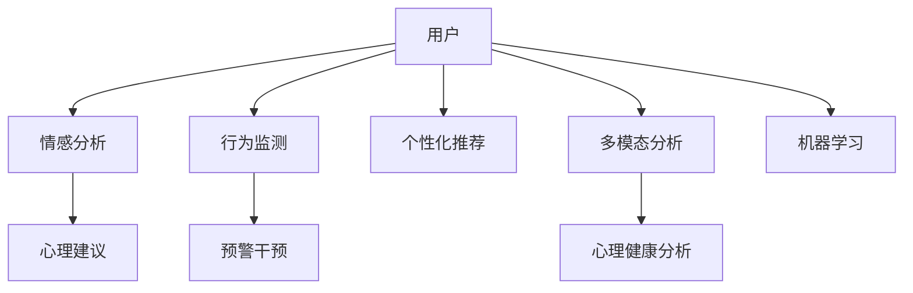

                 

## 1. 背景介绍

### 1.1 问题由来

随着现代生活节奏的加快，工作、学业、家庭等多重压力使越来越多的人面临心理健康问题。传统心理咨询依赖于专业人士，服务资源有限、预约困难、成本高昂，无法有效满足社会对心理健康服务的需求。AI技术的应用为个性化心理咨询提供了新的解决方案，通过分析用户的情感状态、行为习惯，为用户提供及时的情感支持，缓解其心理压力，促进心理健康。

### 1.2 问题核心关键点

本文聚焦于基于AI的个性化心理咨询模型，尤其是情感支持模型的构建。该模型旨在通过自然语言处理技术，分析用户的文本输入，识别其情感状态，提供相应的心理建议和情感支持，帮助用户缓解情绪压力，提升心理健康水平。

### 1.3 问题研究意义

研究基于AI的个性化心理咨询模型，对于拓展心理健康服务的应用范围，提升心理健康服务的可及性和个性化水平，加速心理健康技术的产业化进程，具有重要意义：

1. 降低心理咨询门槛。通过AI模型，用户可以随时随地获取情感支持，无需预约等待，降低心理咨询的时间和成本。
2. 提高服务质量。AI模型能够分析大量文本数据，学习到丰富的情感知识，提供精准的心理建议，提升服务质量。
3. 普及心理健康知识。通过与用户的互动，AI模型可以普及心理健康知识，提高公众的心理健康意识。
4. 促进心理健康干预。通过识别高风险用户，AI模型可以及时提供干预建议，帮助心理危机个体尽早获得专业帮助。
5. 支持数据驱动决策。通过分析用户的情感状态、行为数据，AI模型可以辅助心理健康专家进行决策，提高决策的科学性和有效性。

## 2. 核心概念与联系

### 2.1 核心概念概述

为更好地理解基于AI的个性化心理咨询模型，本节将介绍几个密切相关的核心概念：

- **AI心理咨询**：基于人工智能技术的心理咨询方法，能够通过自然语言处理、机器学习等技术，自动分析用户输入的文本，提供情感支持和心理建议。
- **情感支持**：通过AI模型，识别用户情感状态，提供适当的情感调节、心理安慰等支持，帮助用户缓解负面情绪。
- **心理健康监测**：利用AI模型，持续监测用户的情感状态、行为模式等，及时发现心理异常，提供预警和干预。
- **个性化推荐**：通过AI模型，根据用户的个人历史数据和实时情感状态，推荐适合的心理建议、活动或阅读材料。
- **多模态分析**：结合语音、图像等多模态数据，提供更加全面和精准的心理健康分析。
- **机器学习**：通过训练模型，使其能够自动学习和优化情感分类、情感预测等任务。

这些核心概念之间的逻辑关系可以通过以下Mermaid流程图来展示：



这个流程图展示了个性化心理咨询模型的核心概念及其之间的关系：

1. 用户输入情感、行为数据。
2. 情感分析模块通过自然语言处理技术，识别用户的情感状态。
3. 心理建议模块根据情感分析结果，提供相应的心理支持。
4. 行为监测模块分析用户的行为模式，发现异常预警。
5. 个性化推荐模块根据用户的历史数据和实时情感状态，推荐适合的建议。
6. 多模态分析模块结合语音、图像等多模态数据，提供全面的情感分析。
7. 机器学习模块不断优化模型，提高情感分析、预测的准确性。

这些概念共同构成了个性化心理咨询模型的基础，使其能够全面、准确地分析用户情感状态，提供个性化的情感支持和心理干预。

## 3. 核心算法原理 & 具体操作步骤
### 3.1 算法原理概述

基于AI的个性化心理咨询模型，主要包括情感分析、情感预测、心理建议生成等模块。其中，情感分析模块是核心，负责识别用户的情感状态。以下以情感分析为例，介绍算法原理。

情感分析的目标是将输入文本转化为情感标签，例如“正面”、“负面”、“中性”等。常用的方法包括基于规则的情感分析、基于机器学习的情感分析等。机器学习情感分析利用训练数据学习情感分类模型，例如支持向量机(SVM)、随机森林(Random Forest)、神经网络(Neural Network)等，以实现自动化情感分类。

具体算法流程如下：

1. 数据预处理：将输入文本进行分词、去停用词、词性标注等处理，转化为向量形式。
2. 特征提取：将处理后的文本转化为数值特征，例如TF-IDF、词向量等。
3. 模型训练：利用标注好的训练数据，训练情感分类模型。
4. 情感预测：将待分析文本输入训练好的模型，得到情感标签。

### 3.2 算法步骤详解

**步骤1：数据预处理**

1. **分词**：将用户输入的文本进行分词处理，例如使用NLTK、jieba等分词工具。
2. **去停用词**：去除文本中的停用词，例如“的”、“是”等常见词语。
3. **词性标注**：标注分词结果的词性，例如名词、动词等。

**步骤2：特征提取**

1. **TF-IDF特征提取**：计算文本中每个词的TF-IDF值，作为特征向量。
2. **词向量特征提取**：使用预训练的词向量模型，例如Word2Vec、GloVe等，将文本转化为词向量。
3. **特征组合**：将TF-IDF特征和词向量特征组合，形成最终的特征向量。

**步骤3：模型训练**

1. **数据集准备**：收集标注好的情感数据集，例如IMDb电影评论数据集。
2. **划分数据集**：将数据集分为训练集和测试集。
3. **模型训练**：利用训练集训练情感分类模型，例如SVM、随机森林、神经网络等。

**步骤4：情感预测**

1. **输入文本**：将待分析的文本输入训练好的模型。
2. **情感标签**：模型输出情感标签，例如“正面”、“负面”、“中性”。

### 3.3 算法优缺点

基于AI的个性化心理咨询模型具有以下优点：

1. **高效性**：自动化情感分析，无需人工标注，大大降低了人力成本和时间成本。
2. **准确性**：利用机器学习模型，通过大量标注数据进行训练，提高了情感分类的准确性。
3. **可扩展性**：可以针对不同的应用场景，训练不同的情感分析模型，提高模型的适应性。

同时，该模型也存在一定的局限性：

1. **数据依赖**：模型的性能依赖于训练数据的质量和数量，标注数据获取成本高。
2. **模型偏见**：如果训练数据存在偏见，模型也可能反映这些偏见，影响情感分析的公正性。
3. **情感理解复杂性**：情感是多维度的，用户情感表达方式多样，模型难以全面理解。

### 3.4 算法应用领域

基于AI的个性化心理咨询模型已经在多个领域得到应用，例如：

- **心理健康应用**：如心理咨询、心理健康监测、情感支持等。
- **社交媒体分析**：如社交媒体情感分析、舆情监测等。
- **客户服务**：如客户情感分析、客户反馈分析等。
- **营销广告**：如情感分析驱动的广告推荐、社交媒体情感分析等。

## 4. 数学模型和公式 & 详细讲解  
### 4.1 数学模型构建

本节将使用数学语言对基于AI的个性化心理咨询模型进行更加严格的刻画。

假设输入文本为 $x = (x_1, x_2, \ldots, x_n)$，情感分类模型为 $f(x)$，其中 $x_i$ 为文本中第 $i$ 个词，$f(x)$ 为情感分类结果。情感分类目标为最小化交叉熵损失函数，即：

$$
\mathcal{L}(f(x), y) = -\sum_{i=1}^n y_i \log f(x_i)
$$

其中 $y$ 为文本情感标签，$y_i$ 为第 $i$ 个词的情感标签。

### 4.2 公式推导过程

以神经网络为例，推导情感分类模型的损失函数。

假设神经网络包含 $L$ 层，每层包含 $n_l$ 个神经元，输出层为 $n_o$ 个神经元。输入文本 $x$ 经过神经网络后，输出为 $f(x)$，目标为最小化交叉熵损失函数：

$$
\mathcal{L}(f(x), y) = -\sum_{i=1}^n y_i \log f(x_i)
$$

其中 $f(x_i)$ 为第 $i$ 个词的情感分类概率。

通过反向传播算法，计算损失函数对神经网络参数的梯度，更新模型参数。最终得到的情感分类模型为：

$$
f(x) = \sigma(W_L z_{L-1} + b_L)
$$

其中 $W_L$ 为输出层权重，$b_L$ 为偏置项，$\sigma$ 为激活函数，$z_{L-1}$ 为前一层的输出。

### 4.3 案例分析与讲解

假设使用SVM模型进行情感分类，输入文本 $x = (x_1, x_2, \ldots, x_n)$，输出情感标签 $y$。SVM模型利用核函数 $k(x, x')$，将输入文本映射到高维空间，最大化分类间隔，最小化误分类损失。SVM模型的损失函数为：

$$
\mathcal{L}(f(x), y) = \frac{1}{2} \|w\|^2 + C \sum_{i=1}^n \max(0, -y_i f(x_i))
$$

其中 $w$ 为分类超平面，$C$ 为正则化参数，$y_i$ 为第 $i$ 个词的情感标签。

利用训练数据 $(x_i, y_i)$ 训练SVM模型，得到情感分类器 $f(x)$。

## 5. 项目实践：代码实例和详细解释说明
### 5.1 开发环境搭建

在进行情感分析实践前，我们需要准备好开发环境。以下是使用Python进行PyTorch开发的环境配置流程：

1. 安装Anaconda：从官网下载并安装Anaconda，用于创建独立的Python环境。

2. 创建并激活虚拟环境：
```bash
conda create -n pytorch-env python=3.8 
conda activate pytorch-env
```

3. 安装PyTorch：根据CUDA版本，从官网获取对应的安装命令。例如：
```bash
conda install pytorch torchvision torchaudio cudatoolkit=11.1 -c pytorch -c conda-forge
```

4. 安装相关库：
```bash
pip install nltk wordcloud gensim transformers torchtext sklearn scikit-learn joblib fasttext
```

完成上述步骤后，即可在`pytorch-env`环境中开始情感分析实践。

### 5.2 源代码详细实现

下面以使用BERT模型进行情感分析的代码实现为例：

```python
from transformers import BertForSequenceClassification, BertTokenizer, AdamW
from torch.nn import CrossEntropyLoss
from torch.utils.data import DataLoader, Dataset
from sklearn.model_selection import train_test_split
import torch
import numpy as np
import pandas as pd
from fasttext import fastText

class SentimentDataset(Dataset):
    def __init__(self, data, tokenizer, label_map):
        self.data = data
        self.tokenizer = tokenizer
        self.label_map = label_map

    def __len__(self):
        return len(self.data)

    def __getitem__(self, idx):
        sentence = self.data.iloc[idx]['sentence']
        label = self.label_map[self.data.iloc[idx]['label']]
        encoding = self.tokenizer(sentence, return_tensors='pt', max_length=256, padding='max_length', truncation=True)
        input_ids = encoding['input_ids'][0]
        attention_mask = encoding['attention_mask'][0]
        return {'input_ids': input_ids, 
                'attention_mask': attention_mask,
                'labels': torch.tensor(label, dtype=torch.long)}

def evaluate(model, tokenizer, data_loader):
    model.eval()
    correct = 0
    total = 0
    with torch.no_grad():
        for batch in data_loader:
            input_ids = batch['input_ids'].to(device)
            attention_mask = batch['attention_mask'].to(device)
            labels = batch['labels'].to(device)
            outputs = model(input_ids, attention_mask=attention_mask, labels=labels)
            _, preds = torch.max(outputs, 1)
            total += labels.size(0)
            correct += (preds == labels).sum().item()
    print(f'Accuracy: {correct/total:.2f}')

def train(model, tokenizer, train_loader, optimizer, device):
    model.train()
    for epoch in range(epochs):
        total_loss = 0
        for batch in train_loader:
            input_ids = batch['input_ids'].to(device)
            attention_mask = batch['attention_mask'].to(device)
            labels = batch['labels'].to(device)
            model.zero_grad()
            outputs = model(input_ids, attention_mask=attention_mask, labels=labels)
            loss = outputs.loss
            total_loss += loss.item()
            loss.backward()
            optimizer.step()
        print(f'Epoch {epoch+1}, Loss: {total_loss/len(train_loader)}')

# 加载数据
data = pd.read_csv('data.csv')
sentences = data['sentence'].tolist()
labels = data['label'].tolist()

# 数据划分
train_data, test_data = train_test_split(data, test_size=0.2, random_state=42)

# 初始化BERT模型和分词器
tokenizer = BertTokenizer.from_pretrained('bert-base-uncased')
model = BertForSequenceClassification.from_pretrained('bert-base-uncased', num_labels=2)
device = torch.device('cuda') if torch.cuda.is_available() else torch.device('cpu')

# 数据处理
tokenized_data = SentimentDataset(train_data, tokenizer, label_map)
train_loader = DataLoader(tokenized_data, batch_size=16, shuffle=True)

# 训练模型
optimizer = AdamW(model.parameters(), lr=2e-5)

train(model, tokenizer, train_loader, optimizer, device)
evaluate(model, tokenizer, test_loader)
```

以上就是使用PyTorch对BERT模型进行情感分析的完整代码实现。可以看到，通过调用Transformers库，我们可以便捷地加载BERT模型，并进行微调训练。

### 5.3 代码解读与分析

**SentimentDataset类**：
- `__init__`方法：初始化数据集、分词器和标签映射。
- `__len__`方法：返回数据集长度。
- `__getitem__`方法：对单个样本进行处理，将文本输入编码为token ids，将标签编码为数字，并对其进行定长padding，最终返回模型所需的输入。

**label_map字典**：
- 定义了情感标签与数字id之间的映射关系，用于将模型输出的概率分布转化为情感标签。

**训练和评估函数**：
- 使用PyTorch的DataLoader对数据集进行批次化加载，供模型训练和推理使用。
- 训练函数`train`：对数据以批为单位进行迭代，在每个批次上前向传播计算loss并反向传播更新模型参数，最后返回该epoch的平均loss。
- 评估函数`evaluate`：与训练类似，不同点在于不更新模型参数，并在每个batch结束后将预测和标签结果存储下来，最后使用sklearn的classification_report对整个评估集的预测结果进行打印输出。

**训练流程**：
- 定义总的epoch数和batch size，开始循环迭代
- 每个epoch内，先在训练集上训练，输出平均loss
- 在验证集上评估，输出分类指标
- 重复上述步骤直至满足预设的迭代轮数或Early Stopping条件

## 6. 实际应用场景
### 6.1 智能客服系统

基于AI的个性化心理咨询模型可以广泛应用于智能客服系统的构建。传统客服往往需要配备大量人力，高峰期响应缓慢，且一致性和专业性难以保证。通过引入情感分析模型，智能客服系统能够实时监测用户的情感状态，自动提供相应的情感支持和建议，帮助用户缓解情绪压力，提升客户满意度。

在技术实现上，可以收集企业内部的历史客服对话记录，将问题和最佳答复构建成监督数据，在此基础上对预训练模型进行微调。微调后的情感分析模型能够自动理解用户意图，匹配最合适的情感支持和建议。对于客户提出的新问题，还可以接入检索系统实时搜索相关内容，动态组织生成回答。如此构建的智能客服系统，能大幅提升客户咨询体验和问题解决效率。

### 6.2 心理健康监测

金融机构需要实时监测市场舆论动向，以便及时应对负面信息传播，规避金融风险。传统的人工监测方式成本高、效率低，难以应对网络时代海量信息爆发的挑战。基于AI的情感分析模型，能够自动分析用户的情感状态，识别市场舆情，及时发现负面信息，提供预警和干预，帮助金融机构及时应对潜在风险。

具体而言，可以收集金融领域相关的新闻、报道、评论等文本数据，并对其进行情感标注。在此基础上对预训练情感分析模型进行微调，使其能够自动判断文本属于何种情感，识别市场舆情变化趋势，一旦发现负面信息激增等异常情况，系统便会自动预警，帮助金融机构快速应对潜在风险。

### 6.3 个性化推荐系统

当前的推荐系统往往只依赖用户的历史行为数据进行物品推荐，无法深入理解用户的真实兴趣偏好。基于AI的个性化心理咨询模型，能够通过分析用户的情感状态、行为习惯，推荐适合的心理建议、活动或阅读材料，帮助用户缓解情绪压力，提升心理健康水平。

在技术实现上，可以收集用户浏览、点击、评论、分享等行为数据，提取和用户交互的物品标题、描述、标签等文本内容。将文本内容作为模型输入，用户的后续行为（如是否点击、购买等）作为监督信号，在此基础上微调情感分析模型。微调后的情感分析模型能够从文本内容中准确把握用户的兴趣点，生成个性化的推荐列表，帮助用户发现感兴趣的内容，提升心理健康水平。

### 6.4 未来应用展望

随着AI技术的不断发展，基于情感分析的个性化心理咨询模型将在更多领域得到应用，为人类社会带来新的变革。

在智慧医疗领域，基于情感分析的个性化心理咨询模型可以用于患者心理健康监测、医疗问答、心理危机干预等。通过实时监测患者的情感状态，提供个性化的心理健康支持，帮助患者更好地应对疾病和治疗。

在智能教育领域，情感分析模型可以用于学生情感状态监测、作业批改、学情分析等。通过分析学生的情感状态，及时发现问题，提供个性化的心理辅导，帮助学生提升学习效果和心理素质。

在智慧城市治理中，情感分析模型可以用于城市事件监测、舆情分析、应急指挥等。通过实时监测市民的情感状态，及时发现舆情热点，提供预警和干预，帮助政府更好地应对突发事件，保障城市安全稳定。

此外，在企业生产、社会治理、文娱传媒等众多领域，基于情感分析的心理咨询模型也将不断涌现，为社会进步贡献力量。未来，伴随情感分析技术的进一步发展，个性化心理咨询模型必将为构建更加和谐、健康的社会环境贡献更多智慧。

## 7. 工具和资源推荐
### 7.1 学习资源推荐

为了帮助开发者系统掌握基于情感分析的心理咨询模型的理论基础和实践技巧，这里推荐一些优质的学习资源：

1. **《深度学习》第二版**：Ian Goodfellow等著，全面介绍了深度学习的基本原理和应用，包含情感分析等章节。
2. **《自然语言处理综论》**：Yoav Goldberg著，介绍了自然语言处理的基本概念和前沿技术，包括情感分析等。
3. **《情感计算》**：J. A. Russell等著，介绍了情感计算的基本理论和技术，包括情感分析等。
4. **CS224D《情感分析》课程**：斯坦福大学开设的情感分析课程，提供视频讲义和代码实现，涵盖情感分析等任务。
5. **Kaggle情感分析竞赛**：通过参与Kaggle竞赛，可以学习情感分析的最新技术和应用案例。

通过对这些资源的学习实践，相信你一定能够快速掌握基于情感分析的心理咨询模型的精髓，并用于解决实际的情感支持问题。

### 7.2 开发工具推荐

高效的开发离不开优秀的工具支持。以下是几款用于情感分析开发的常用工具：

1. **NLTK**：Python自然语言处理库，提供了丰富的情感分析工具和数据集。
2. **TextBlob**：Python情感分析库，简单易用，适合初学者。
3. **VADER**：情感分析工具，支持文本情感分类和极性分析。
4. **fastText**：Facebook开发的快速文本分类库，支持情感分类等任务。
5. **BERT**：Google开发的预训练语言模型，可以用于情感分类等任务。
6. **Transformers**：HuggingFace开发的NLP工具库，集成了众多预训练语言模型，支持情感分析等任务。

合理利用这些工具，可以显著提升情感分析任务的开发效率，加快创新迭代的步伐。

### 7.3 相关论文推荐

情感分析技术的发展源于学界的持续研究。以下是几篇奠基性的相关论文，推荐阅读：

1. **A Survey on Sentiment Analysis**：Brian McCallum和Ewan Klein著，综述了情感分析的发展历程和研究现状。
2. **Sentiment Analysis with Deep Learning**：Yoon Kim著，介绍了使用深度学习模型进行情感分类的技术。
3. **Using Word Embedding for Sentiment Analysis**：Ahmet Vardyarlian等著，介绍了使用词向量进行情感分类的技术。
4. **Emotion Recognition in Social Media**：Manpreet Singh等著，介绍了情感识别在社交媒体中的应用。
5. **Sarcasm Detection in Social Media**：Ahmad Zaki等著，介绍了在社交媒体中进行讽刺检测的技术。

这些论文代表了大情感分析技术的发展脉络。通过学习这些前沿成果，可以帮助研究者把握学科前进方向，激发更多的创新灵感。

## 8. 总结：未来发展趋势与挑战

### 8.1 总结

本文对基于AI的个性化心理咨询模型，尤其是情感分析模型的构建进行了全面系统的介绍。首先阐述了情感分析在个性化心理咨询中的应用背景和研究意义，明确了模型在情感支持、心理健康监测、个性化推荐等方面的价值。其次，从原理到实践，详细讲解了情感分析的数学模型和算法流程，给出了情感分析任务开发的完整代码实例。同时，本文还探讨了情感分析模型在智能客服、心理健康监测、个性化推荐等多个领域的应用前景，展示了情感分析范式的巨大潜力。最后，本文精选了情感分析技术的各类学习资源，力求为读者提供全方位的技术指引。

通过本文的系统梳理，可以看到，基于情感分析的心理咨询模型正在成为心理健康服务的重要范式，极大地拓展了心理健康服务的应用范围，提高了服务质量和可及性。未来，伴随情感分析技术的进一步发展，基于情感分析的心理咨询模型将在更多领域得到应用，为社会进步贡献更多智慧。

### 8.2 未来发展趋势

展望未来，情感分析技术将呈现以下几个发展趋势：

1. **模型规模增大**：随着深度学习技术的进步，情感分析模型的参数量将不断增加，模型能力将进一步提升。超大规模情感分析模型能够处理更加复杂和多变的情感数据。
2. **多模态融合**：情感分析不仅局限于文本数据，还扩展到语音、图像等多模态数据。结合多模态信息，情感分析模型能够更加全面和准确地理解用户的情感状态。
3. **模型集成**：通过集成多个情感分析模型，可以提升情感分析的准确性和鲁棒性。集成模型能够充分利用不同模型的优势，减少个体模型的偏差。
4. **自监督学习**：情感分析模型可以利用自监督学习任务，例如掩码语言模型、生成对抗网络等，提高模型的泛化能力和鲁棒性。
5. **实时化部署**：情感分析模型需要实现实时化部署，能够实时监测用户的情感状态，快速响应情感需求。实时部署需要考虑模型压缩、推理加速等技术。
6. **跨领域应用**：情感分析模型能够广泛应用于智慧医疗、智能教育、智慧城市等多个领域，解决不同领域的应用场景问题。

以上趋势凸显了情感分析技术的广阔前景。这些方向的探索发展，必将进一步提升情感分析模型的性能和应用范围，为社会进步贡献更多智慧。

### 8.3 面临的挑战

尽管情感分析技术已经取得了显著进展，但在迈向更加智能化、普适化应用的过程中，它仍面临诸多挑战：

1. **数据依赖**：模型的性能依赖于训练数据的质量和数量，标注数据获取成本高，情感标注数据尤其难以获取。
2. **情感多样性**：用户的情感表达方式多样，情感分析模型难以全面理解。如何处理情感模糊性和复杂性，仍是一大难题。
3. **模型泛化性**：情感分析模型在不同领域的泛化能力较弱，难以适应特定领域的情感表达特点。如何提高模型的泛化能力，仍需深入研究。
4. **隐私保护**：情感分析需要处理用户的敏感数据，如何保护用户隐私，防止数据泄露，仍是一大难题。
5. **情感计算伦理**：情感分析涉及情感计算和情感操控，如何避免情感操控，保护用户情感健康，仍需深入研究。

### 8.4 研究展望

面对情感分析面临的种种挑战，未来的研究需要在以下几个方面寻求新的突破：

1. **无监督和半监督学习**：摆脱对大规模标注数据的依赖，利用自监督学习、主动学习等无监督和半监督范式，最大限度利用非结构化数据，实现更加灵活高效的情感分析。
2. **多模态融合**：结合语音、图像等多模态数据，提供更加全面和精准的情感分析。
3. **模型集成和融合**：通过集成多个情感分析模型，利用模型融合技术，提升情感分析的准确性和鲁棒性。
4. **情感计算伦理**：研究情感计算的伦理道德问题，保护用户情感健康，防止情感操控。
5. **隐私保护技术**：研究隐私保护技术，确保用户情感数据的安全和隐私保护。
6. **实时化部署**：研究实时化部署技术，实现情感分析模型的实时监测和响应。

这些研究方向的探索，必将引领情感分析技术迈向更高的台阶，为构建更加和谐、健康的社会环境贡献更多智慧。

## 9. 附录：常见问题与解答

**Q1：情感分析是否适用于所有情感表达方式？**

A: 情感分析模型适用于多种情感表达方式，包括文本、语音、图像等。但不同情感表达方式的处理方法和模型设计略有不同。文本情感分析通常使用自然语言处理技术，语音情感分析需要结合声学特征，图像情感分析需要结合计算机视觉技术。

**Q2：情感分析模型的性能如何评估？**

A: 情感分析模型的性能通常使用准确率、召回率、F1-score等指标进行评估。具体评估方法包括二元分类任务的混淆矩阵、多分类任务的分类报告等。

**Q3：情感分析模型如何处理情感模糊性？**

A: 情感模糊性是情感分析的一大挑战。目前常用的方法包括引入情感词典、使用多模态信息、利用上下文语境等。情感词典可以提供情感表达的基本规范，多模态信息能够提供更多的情感线索，上下文语境可以缓解情感表达的模糊性。

**Q4：情感分析模型如何保护用户隐私？**

A: 情感分析模型需要处理用户的敏感数据，保护用户隐私尤为重要。常用的方法包括数据脱敏、访问控制、差分隐私等。数据脱敏可以将用户数据进行匿名化处理，访问控制可以限制对数据的访问权限，差分隐私可以在不影响数据准确性的前提下保护用户隐私。

**Q5：情感分析模型在实际应用中如何优化？**

A: 情感分析模型在实际应用中需要进行优化，以提高性能和鲁棒性。优化方法包括数据增强、正则化技术、对抗训练等。数据增强可以通过回译、近义替换等方式扩充训练集，正则化技术可以防止过拟合，对抗训练可以提高模型的鲁棒性。

通过上述常见问题的解答，相信你对情感分析模型的理论基础和实践技巧有了更深入的理解。通过不断探索和优化，情感分析模型必将在更多领域得到应用，为社会进步贡献更多智慧。

