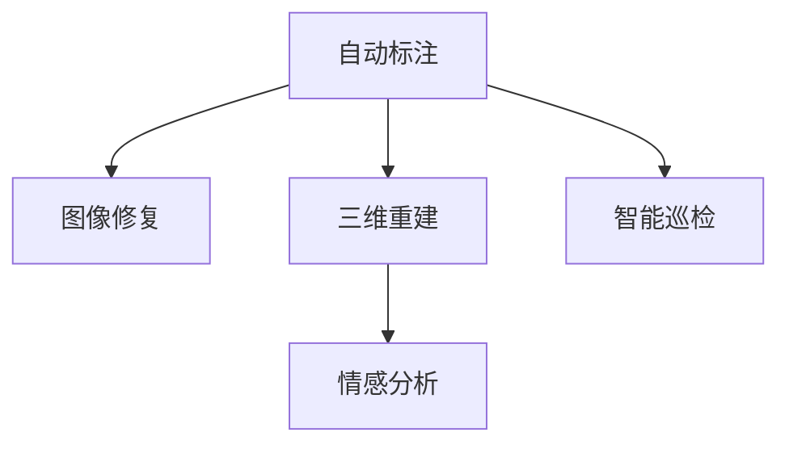

                 

# AI在文化遗产保护中的应用

## 1. 背景介绍

### 1.1 问题由来
文化遗产的保护与传承是人类文明的重要课题。传统上，文化遗产的保护主要依赖于人力物力的投入，如定期维护、修复、数字化等。然而，面对快速增长的文化遗产数量和复杂的保护需求，传统方法显得力不从心。尤其是在数字化过程中，大量的文本、图像、音频等数据需要专业人才进行人工标注和处理，成本高昂，效率低下。

### 1.2 问题核心关键点
近年来，人工智能技术在文化遗产保护中的应用逐渐成为热点。AI可以通过对大量数据的学习，实现自动标注、修复、数字化等任务，大幅提高工作效率，降低成本。AI在文化遗产保护中的应用，主要包括以下几个方面：

1. **自动标注**：利用AI对文化遗产数据进行自动标注，包括文本分类、图像识别等。
2. **图像修复**：使用AI对损坏的文化遗产图像进行修复，提升图像质量。
3. **三维重建**：通过AI对文化遗产的三维模型进行重建和优化，提高数字化精度。
4. **情感分析**：利用AI对文化遗产相关的文本数据进行情感分析，了解公众对文化遗产的态度和需求。
5. **智能巡检**：使用AI对文化遗产进行实时监控和巡检，提高保护效率。

## 2. 核心概念与联系

### 2.1 核心概念概述

为更好地理解AI在文化遗产保护中的应用，本节将介绍几个密切相关的核心概念：

- **自动标注**：利用AI技术对文化遗产数据进行自动分类和标注，如文本分类、图像识别等。常见的自动标注技术包括基于规则的标注、基于监督学习的标注等。

- **图像修复**：使用AI技术对损坏的文化遗产图像进行修复，恢复其原始状态。常见的图像修复技术包括基于深度学习的修复算法、基于像素级别的修复算法等。

- **三维重建**：通过AI技术对文化遗产的三维模型进行重建和优化，提升数字化的精度和细节。常见的三维重建技术包括基于点云的重建、基于深度学习的重建等。

- **情感分析**：利用AI技术对文化遗产相关的文本数据进行情感分析，了解公众对文化遗产的态度和需求。常见的情感分析技术包括基于规则的情感分析、基于深度学习的情感分析等。

- **智能巡检**：使用AI技术对文化遗产进行实时监控和巡检，提高保护效率。常见的智能巡检技术包括基于计算机视觉的巡检、基于无人机的巡检等。

这些核心概念之间的逻辑关系可以通过以下Mermaid流程图来展示：



这个流程图展示了几类AI技术在文化遗产保护中的应用：

1. 自动标注可以为图像修复、三维重建等任务提供必要的数据支持。
2. 图像修复和三维重建是文化遗产数字化的关键技术。
3. 情感分析有助于了解公众对文化遗产的情感需求。
4. 智能巡检可以实时监控文化遗产的状态，提高保护效率。

这些概念共同构成了AI在文化遗产保护中的应用框架，使得AI技术能够在文化遗产保护中发挥重要作用。

## 3. 核心算法原理 & 具体操作步骤
### 3.1 算法原理概述

AI在文化遗产保护中的应用，主要基于深度学习和计算机视觉等技术。其核心思想是：利用AI技术对文化遗产数据进行自动化的处理和分析，从而提升文化遗产保护和传承的效率和精度。

具体而言，AI技术在文化遗产保护中的应用可以分为以下几个步骤：

1. **数据收集**：从文化遗产中收集文本、图像、音频等数据。
2. **预处理**：对收集到的数据进行清洗、归一化、分割等预处理操作，以便于后续的模型训练。
3. **模型训练**：在预处理后的数据集上训练深度学习模型，如卷积神经网络(CNN)、循环神经网络(RNN)、变换器(Transformer)等。
4. **模型微调**：在训练好的模型上，利用少量的标注数据进行微调，优化模型在特定任务上的性能。
5. **应用部署**：将训练好的模型部署到实际应用中，进行自动标注、图像修复、三维重建等任务。

### 3.2 算法步骤详解

以下将详细介绍AI在文化遗产保护中的应用流程：

**Step 1: 数据收集和预处理**
- 从文化遗产中收集文本、图像、音频等数据。
- 对数据进行清洗、归一化、分割等预处理操作，以便于后续的模型训练。

**Step 2: 模型选择与训练**
- 选择合适的深度学习模型，如CNN、RNN、Transformer等。
- 在预处理后的数据集上，利用GPU/TPU等高性能设备进行模型训练，以提高训练效率。

**Step 3: 模型微调**
- 利用少量的标注数据对训练好的模型进行微调，优化模型在特定任务上的性能。
- 选择合适的优化算法及其参数，如AdamW、SGD等，设置学习率、批大小、迭代轮数等。
- 设置正则化技术及强度，包括权重衰减、Dropout、Early Stopping等，防止模型过度适应小规模训练集。

**Step 4: 应用部署**
- 将微调后的模型部署到实际应用中，进行自动标注、图像修复、三维重建等任务。
- 持续收集新的数据，定期重新微调模型，以适应数据分布的变化。

### 3.3 算法优缺点

AI在文化遗产保护中的应用具有以下优点：
1. 高效快捷：利用AI技术可以大幅提高文化遗产保护和传承的效率，降低人力物力成本。
2. 精准可靠：AI技术能够通过深度学习模型，对文化遗产数据进行自动化的处理和分析，提高数据的精度和一致性。
3. 灵活可扩展：AI技术可以根据具体任务的需求，选择和调整模型架构和参数，灵活应对各种保护场景。
4. 实时监测：AI技术可以实现对文化遗产的实时监测和巡检，及时发现和处理潜在问题。

同时，AI在文化遗产保护中也存在一些局限性：
1. 数据依赖性强：AI技术的应用效果很大程度上取决于数据的质量和数量，高质量标注数据的获取成本较高。
2. 模型复杂度高：深度学习模型参数量大，对计算资源的需求较高，需要高性能设备支持。
3. 模型泛化性差：AI技术对特定领域和数据集的泛化能力有限，需要结合领域专家的知识和经验进行调整。
4. 伦理与安全问题：AI技术在文化遗产保护中的应用，可能涉及到隐私保护、数据安全等问题，需要特别注意。

尽管存在这些局限性，但AI在文化遗产保护中的应用仍然具有广阔的前景和深远的意义。未来相关研究的方向包括如何进一步降低对标注数据的依赖，提高模型的跨领域迁移能力和泛化能力，同时兼顾伦理和安全等问题。

### 3.4 算法应用领域

AI在文化遗产保护中的应用涵盖了多个领域，主要包括：

- **自动标注**：应用于文本分类、图像识别等任务，如对考古文献、历史照片进行分类和标注。
- **图像修复**：应用于文化遗产图像的修复和重建，如对损坏的古籍、壁画等进行修复。
- **三维重建**：应用于文化遗产三维模型的重建和优化，如对历史建筑、艺术品等进行数字化重建。
- **情感分析**：应用于文化遗产相关文本的情感分析，了解公众对文化遗产的态度和需求。
- **智能巡检**：应用于文化遗产的实时监控和巡检，如对历史建筑、文物等进行实时监测。

## 4. 数学模型和公式 & 详细讲解
### 4.1 数学模型构建

本节将使用数学语言对AI在文化遗产保护中的应用过程进行更加严格的刻画。

假设文化遗产数据集为 $D=\{(x_i,y_i)\}_{i=1}^N$，其中 $x_i$ 为输入，$y_i$ 为标注。以图像修复任务为例，输入 $x_i$ 为一幅损坏的图像，$y_i$ 为修复后的图像。

定义图像修复任务的目标函数为 $F(x_i,y_i)$，其中 $F$ 为修复函数的损失函数。在数据集 $D$ 上的经验风险为：

$$
\mathcal{L}(F) = \frac{1}{N}\sum_{i=1}^N \ell(F(x_i),y_i)
$$

其中 $\ell$ 为修复函数与标注之间的损失函数，通常为均方误差损失。

### 4.2 公式推导过程

以图像修复为例，假设修复函数为 $F(x_i)$，其中 $x_i$ 为输入的损坏图像，$y_i$ 为修复后的图像。则修复函数与标注之间的损失函数 $\ell$ 可以表示为：

$$
\ell(F(x_i),y_i) = ||F(x_i) - y_i||^2
$$

其中 $||\cdot||$ 表示欧式距离。

将损失函数带入经验风险公式，得：

$$
\mathcal{L}(F) = \frac{1}{N}\sum_{i=1}^N ||F(x_i) - y_i||^2
$$

假设修复函数为卷积神经网络(CNN)，网络的输出为 $F(x_i)=F_{\theta}(x_i)$，其中 $\theta$ 为网络参数。则目标函数可以表示为：

$$
\mathcal{L}(F_{\theta}) = \frac{1}{N}\sum_{i=1}^N ||F_{\theta}(x_i) - y_i||^2
$$

利用梯度下降等优化算法，最小化目标函数 $\mathcal{L}(F_{\theta})$，更新网络参数 $\theta$，即：

$$
\theta \leftarrow \theta - \eta \nabla_{\theta}\mathcal{L}(F_{\theta})
$$

其中 $\eta$ 为学习率，$\nabla_{\theta}\mathcal{L}(F_{\theta})$ 为损失函数对网络参数 $\theta$ 的梯度，可以通过反向传播算法高效计算。

### 4.3 案例分析与讲解

以图像修复为例，假设有两张损坏的古籍图片 $x_1$ 和 $x_2$，修复后的图片分别为 $y_1$ 和 $y_2$。

**Step 1: 数据收集和预处理**

从文化遗产中收集两张损坏的古籍图片 $x_1$ 和 $x_2$，以及修复后的图片 $y_1$ 和 $y_2$。对图片进行归一化、分割等预处理操作，以便于后续的模型训练。

**Step 2: 模型选择与训练**

选择卷积神经网络(CNN)作为图像修复模型，使用GPU/TPU等高性能设备进行模型训练，以提高训练效率。利用大量损坏的古籍图片数据进行预训练，学习图像修复的基本规律。

**Step 3: 模型微调**

利用少量的标注数据对训练好的模型进行微调，优化模型在特定任务上的性能。选择合适的优化算法及其参数，如AdamW、SGD等，设置学习率、批大小、迭代轮数等。设置正则化技术及强度，包括权重衰减、Dropout、Early Stopping等，防止模型过度适应小规模训练集。

**Step 4: 应用部署**

将微调后的模型部署到实际应用中，对新的损坏的古籍图片进行修复。利用训练好的模型对损坏的图片 $x_1$ 和 $x_2$ 进行修复，得到修复后的图片 $y_1'$ 和 $y_2'$。将修复后的图片与标注的图片 $y_1$ 和 $y_2$ 进行比较，计算损失函数的值，评估模型效果。

## 5. 项目实践：代码实例和详细解释说明
### 5.1 开发环境搭建

在进行AI在文化遗产保护中的应用实践前，我们需要准备好开发环境。以下是使用Python进行TensorFlow开发的环境配置流程：

1. 安装Anaconda：从官网下载并安装Anaconda，用于创建独立的Python环境。

2. 创建并激活虚拟环境：
```bash
conda create -n tf-env python=3.8 
conda activate tf-env
```

3. 安装TensorFlow：根据CUDA版本，从官网获取对应的安装命令。例如：
```bash
conda install tensorflow -c tensorflow
```

4. 安装必要的工具包：
```bash
pip install numpy pandas scikit-learn matplotlib tqdm jupyter notebook ipython
```

完成上述步骤后，即可在`tf-env`环境中开始AI在文化遗产保护中的应用实践。

### 5.2 源代码详细实现

这里我们以图像修复为例，给出使用TensorFlow进行图像修复的PyTorch代码实现。

首先，定义数据处理函数：

```python
import tensorflow as tf
from tensorflow.keras import layers
import numpy as np

def load_and_preprocess_image(path):
    image = tf.io.read_file(path)
    image = tf.image.decode_jpeg(image, channels=3)
    image = tf.image.resize(image, [256, 256])
    image /= 255.0
    return image.numpy()
```

然后，定义图像修复模型：

```python
model = tf.keras.Sequential([
    layers.Conv2D(64, (3,3), activation='relu', input_shape=(256, 256, 3)),
    layers.MaxPooling2D((2,2)),
    layers.Conv2D(32, (3,3), activation='relu'),
    layers.MaxPooling2D((2,2)),
    layers.Conv2D(16, (3,3), activation='relu'),
    layers.MaxPooling2D((2,2)),
    layers.Conv2D(8, (3,3), activation='relu'),
    layers.MaxPooling2D((2,2)),
    layers.Conv2D(4, (3,3), activation='relu'),
    layers.MaxPooling2D((2,2)),
    layers.Conv2D(2, (3,3), activation='relu'),
    layers.MaxPooling2D((2,2)),
    layers.Conv2D(1, (3,3), activation='sigmoid')
])
```

接着，定义优化器和损失函数：

```python
optimizer = tf.keras.optimizers.Adam(learning_rate=0.001)
loss_fn = tf.keras.losses.MeanSquaredError()
```

最后，定义训练和评估函数：

```python
def train_step(x, y):
    with tf.GradientTape() as tape:
        predictions = model(x)
        loss = loss_fn(y, predictions)
    gradients = tape.gradient(loss, model.trainable_variables)
    optimizer.apply_gradients(zip(gradients, model.trainable_variables))
    return loss

def evaluate(model, test_data):
    total_loss = 0.0
    for x, y in test_data:
        loss = train_step(x, y)
        total_loss += loss
    return total_loss / len(test_data)
```

启动训练流程并在测试集上评估：

```python
epochs = 10
batch_size = 32

for epoch in range(epochs):
    total_loss = 0.0
    for x, y in train_data:
        loss = train_step(x, y)
        total_loss += loss
    print(f'Epoch {epoch+1}, train loss: {total_loss / len(train_data)}')
    
    print(f'Epoch {epoch+1}, test results:')
    evaluate(model, test_data)
    
print("Training complete.")
```

以上就是使用TensorFlow进行图像修复的完整代码实现。可以看到，TensorFlow提供了便捷的Keras API，使得模型训练和评估变得非常简单。

### 5.3 代码解读与分析

让我们再详细解读一下关键代码的实现细节：

**load_and_preprocess_image函数**：
- 读取图片路径，并解码成RGB格式。
- 将图片大小调整为256x256，并进行归一化处理。

**train_step函数**：
- 定义优化器和损失函数，计算模型预测值和真实标签之间的均方误差。
- 通过反向传播算法计算梯度，并应用梯度更新模型参数。

**evaluate函数**：
- 对测试集中的每张图片进行训练步骤，计算损失函数的总和。
- 计算平均损失函数，评估模型效果。

**训练流程**：
- 定义总的epoch数和batch size，开始循环迭代
- 每个epoch内，先对训练集进行训练，输出平均loss
- 在测试集上评估，输出模型效果
- 所有epoch结束后，输出训练完成信息

可以看到，TensorFlow的Keras API使得模型训练和评估变得非常高效和简洁。开发者可以将更多精力放在数据处理和模型优化上，而不必过多关注底层的实现细节。

## 6. 实际应用场景
### 6.1 智慧博物馆

智慧博物馆是AI在文化遗产保护中的典型应用场景之一。利用AI技术，博物馆可以实现对藏品的智能管理和展示，提高观众的参观体验。

具体而言，智慧博物馆可以应用AI技术进行：

- **自动标注**：对博物馆的藏品信息进行自动分类和标注，如对文物、艺术品等进行分类和标签标注。
- **图像修复**：对损坏的藏品图片进行修复，恢复其原始状态。
- **三维重建**：对藏品的3D模型进行重建和优化，提高数字化精度。
- **智能导览**：利用AI技术对藏品的数字资料进行整理和展示，提供智能导览服务，增强参观互动性。

### 6.2 历史建筑保护

历史建筑保护是AI在文化遗产保护中的另一重要应用场景。AI技术可以用于对历史建筑进行数字化保护和修复，提升其使用寿命和观赏价值。

具体而言，历史建筑保护可以应用AI技术进行：

- **图像修复**：对历史建筑损坏的图片进行修复，恢复其原始状态。
- **三维重建**：对历史建筑的三维模型进行重建和优化，提高数字化精度。
- **情感分析**：对公众对历史建筑的态度和需求进行情感分析，了解公众需求，优化保护措施。
- **智能巡检**：对历史建筑进行实时监控和巡检，及时发现和处理潜在问题。

### 6.3 文物数字化

文物数字化是AI在文化遗产保护中的又一重要应用场景。AI技术可以用于对文物进行数字化保护和修复，提升文物的保存和展示效果。

具体而言，文物数字化可以应用AI技术进行：

- **自动标注**：对文物的数字资料进行自动分类和标注，如对古迹、手稿等进行分类和标签标注。
- **图像修复**：对损坏的文物图片进行修复，恢复其原始状态。
- **三维重建**：对文物的三维模型进行重建和优化，提高数字化精度。
- **情感分析**：对公众对文物的态度和需求进行情感分析，了解公众需求，优化保护措施。

## 7. 工具和资源推荐
### 7.1 学习资源推荐

为了帮助开发者系统掌握AI在文化遗产保护中的应用理论基础和实践技巧，这里推荐一些优质的学习资源：

1. **《深度学习》课程**：斯坦福大学开设的深度学习课程，涵盖深度学习的基础理论和经典模型。
2. **《自然语言处理》书籍**：中文自然语言处理领域的经典书籍，涵盖NLP的基本概念和应用。
3. **《计算机视觉》课程**：斯坦福大学开设的计算机视觉课程，涵盖计算机视觉的基本理论和经典算法。
4. **《TensorFlow官方文档》**：TensorFlow官方文档，提供了丰富的教程和样例代码，适合初学者和进阶者。
5. **《Keras官方文档》**：Keras官方文档，提供了便捷的Keras API和丰富的应用场景，适合模型训练和部署。

通过对这些资源的学习实践，相信你一定能够快速掌握AI在文化遗产保护中的应用精髓，并用于解决实际的遗产保护问题。

### 7.2 开发工具推荐

高效的开发离不开优秀的工具支持。以下是几款用于AI在文化遗产保护中的应用开发的常用工具：

1. **TensorFlow**：由Google主导开发的深度学习框架，生产部署方便，适合大规模工程应用。提供了丰富的模型和工具，适合构建复杂的AI应用。
2. **Keras**：基于TensorFlow和Theano的高级API，提供了便捷的模型训练和部署接口，适合快速迭代研究。
3. **PyTorch**：基于Python的开源深度学习框架，灵活动态的计算图，适合快速迭代研究。
4. **Jupyter Notebook**：Jupyter Notebook提供了交互式的代码执行环境，适合开发和调试复杂模型。
5. **GitHub**：GitHub提供了代码托管和协作平台，适合团队开发和项目管理。

合理利用这些工具，可以显著提升AI在文化遗产保护中的应用开发效率，加快创新迭代的步伐。

### 7.3 相关论文推荐

AI在文化遗产保护中的应用源于学界的持续研究。以下是几篇奠基性的相关论文，推荐阅读：

1. **《用于历史建筑保护的深度学习方法》**：提出基于深度学习的图像修复和三维重建方法，用于历史建筑的数字化保护。
2. **《用于文物数字化的深度学习方法》**：提出基于深度学习的自动标注和图像修复方法，用于文物的数字化保护。
3. **《用于智能博物馆的计算机视觉技术》**：提出基于计算机视觉的智能导览和情感分析方法，用于智慧博物馆的建设。
4. **《用于历史建筑巡检的计算机视觉技术》**：提出基于计算机视觉的实时监控和巡检方法，用于历史建筑的保护。

这些论文代表了大语言模型微调技术的发展脉络。通过学习这些前沿成果，可以帮助研究者把握学科前进方向，激发更多的创新灵感。

## 8. 总结：未来发展趋势与挑战

### 8.1 总结

本文对AI在文化遗产保护中的应用进行了全面系统的介绍。首先阐述了AI在文化遗产保护中的应用背景和意义，明确了AI技术在文化遗产数字化和保护中发挥的独特价值。其次，从原理到实践，详细讲解了AI在文化遗产保护中的应用流程，包括数据收集、预处理、模型训练、微调和部署等关键步骤，给出了具体的代码实现和分析。同时，本文还广泛探讨了AI在智慧博物馆、历史建筑保护、文物数字化等多个领域的应用前景，展示了AI技术在文化遗产保护中的广阔前景。

通过本文的系统梳理，可以看到，AI在文化遗产保护中的应用正在成为文化遗产保护的重要手段，极大地提升了文化遗产保护和传承的效率和精度。未来，伴随AI技术的不断进步，文化遗产保护将迎来新的发展机遇，为人类文明的保护和传承注入新的动力。

### 8.2 未来发展趋势

展望未来，AI在文化遗产保护中的应用将呈现以下几个发展趋势：

1. **智能化水平提升**：随着深度学习和计算机视觉技术的发展，AI在文化遗产保护中的应用将更加智能化，能够更好地理解文化遗产的多样性和复杂性。
2. **数据驱动与知识融合**：AI将更多地结合文化遗产专家的知识和经验，进行数据驱动和知识融合，提升文化遗产保护的效果和精度。
3. **跨领域应用拓展**：AI在文化遗产保护中的应用将不再局限于某个领域，而是向多领域、跨学科的方向发展，提升文化遗产保护的广度和深度。
4. **技术标准化与规范化**：AI在文化遗产保护中的应用将逐步走向标准化和规范化，制定相应的技术标准和规范，保障应用的质量和安全。
5. **数据隐私与伦理保护**：AI在文化遗产保护中的应用将更加注重数据隐私和伦理保护，确保文化遗产数据的安全和合规使用。

以上趋势凸显了AI在文化遗产保护中的应用前景，将进一步推动文化遗产保护和传承的数字化进程。

### 8.3 面临的挑战

尽管AI在文化遗产保护中的应用已经取得了一定的进展，但在迈向更加智能化、普适化应用的过程中，仍然面临诸多挑战：

1. **数据质量问题**：AI在文化遗产保护中的应用效果很大程度上取决于数据的质量和数量，高质量标注数据的获取成本较高，数据的真实性和完整性也存在一定的挑战。
2. **模型泛化能力不足**：AI技术对特定领域和数据集的泛化能力有限，需要结合领域专家的知识和经验进行调整。
3. **技术复杂度高**：深度学习模型参数量大，对计算资源的需求较高，需要高性能设备支持，技术实现复杂度较高。
4. **伦理与安全问题**：AI在文化遗产保护中的应用，可能涉及到隐私保护、数据安全等问题，需要特别注意。
5. **标准化与规范化不足**：AI在文化遗产保护中的应用尚未完全标准化和规范化，存在一定的技术壁垒和应用风险。

尽管存在这些挑战，但AI在文化遗产保护中的应用仍然具有广阔的前景和深远的意义。未来相关研究的方向包括如何进一步降低对标注数据的依赖，提高模型的跨领域迁移能力和泛化能力，同时兼顾伦理和安全等问题。

### 8.4 研究展望

面对AI在文化遗产保护中所面临的挑战，未来的研究需要在以下几个方面寻求新的突破：

1. **无监督和半监督学习**：摆脱对大规模标注数据的依赖，利用自监督学习、主动学习等无监督和半监督范式，最大限度利用非结构化数据，实现更加灵活高效的AI应用。
2. **模型压缩与优化**：开发更加参数高效的AI模型，通过模型压缩、量化加速等技术，减少计算资源的需求，实现更加轻量级、实时性的部署。
3. **数据增强与生成**：利用数据增强、生成对抗网络(GAN)等技术，扩充数据集，提升AI模型的泛化能力和鲁棒性。
4. **跨领域知识融合**：将符号化的先验知识，如知识图谱、逻辑规则等，与神经网络模型进行巧妙融合，引导AI模型学习更准确、合理的语言模型。
5. **数据隐私与伦理保护**：在AI技术应用过程中，注重数据隐私和伦理保护，确保文化遗产数据的安全和合规使用。

这些研究方向的探索，必将引领AI在文化遗产保护中的应用技术迈向更高的台阶，为文化遗产保护和传承注入新的动力。面向未来，AI在文化遗产保护中的应用需要与其他AI技术进行更深入的融合，如知识表示、因果推理、强化学习等，多路径协同发力，共同推动文化遗产保护和传承的数字化进程。只有勇于创新、敢于突破，才能不断拓展AI技术在文化遗产保护中的应用边界，让文化遗产保护和传承事业更加丰富多彩。

## 9. 附录：常见问题与解答

**Q1：AI在文化遗产保护中的应用效果如何？**

A: AI在文化遗产保护中的应用效果显著。通过深度学习模型和计算机视觉技术，AI可以实现自动标注、图像修复、三维重建等任务，大幅提高文化遗产保护和传承的效率和精度。例如，利用AI技术，可以对文物进行高精度数字化，恢复其原始状态，对历史建筑进行自动标注和修复，提升其使用寿命和观赏价值，对博物馆藏品进行智能导览和情感分析，提升观众的参观体验。

**Q2：AI在文化遗产保护中需要哪些数据支持？**

A: AI在文化遗产保护中需要大量的数据支持。这些数据包括文物、艺术品、历史建筑等的数字资料，如图像、文本、视频等。数据的真实性和完整性对AI应用效果至关重要，需要在数据收集和预处理过程中进行严格的审核和清洗。同时，高质量标注数据的获取成本较高，需要在数据收集和标注过程中投入大量人力物力。

**Q3：AI在文化遗产保护中面临哪些挑战？**

A: AI在文化遗产保护中面临诸多挑战：
1. 数据质量问题：AI在文化遗产保护中的应用效果很大程度上取决于数据的质量和数量，高质量标注数据的获取成本较高。
2. 模型泛化能力不足：AI技术对特定领域和数据集的泛化能力有限，需要结合领域专家的知识和经验进行调整。
3. 技术复杂度高：深度学习模型参数量大，对计算资源的需求较高，需要高性能设备支持，技术实现复杂度较高。
4. 伦理与安全问题：AI在文化遗产保护中的应用，可能涉及到隐私保护、数据安全等问题，需要特别注意。
5. 标准化与规范化不足：AI在文化遗产保护中的应用尚未完全标准化和规范化，存在一定的技术壁垒和应用风险。

尽管存在这些挑战，但AI在文化遗产保护中的应用仍然具有广阔的前景和深远的意义。未来相关研究的方向包括如何进一步降低对标注数据的依赖，提高模型的跨领域迁移能力和泛化能力，同时兼顾伦理和安全等问题。

**Q4：AI在文化遗产保护中的应用未来发展方向是什么？**

A: AI在文化遗产保护中的应用未来发展方向包括：
1. 智能化水平提升：随着深度学习和计算机视觉技术的发展，AI在文化遗产保护中的应用将更加智能化，能够更好地理解文化遗产的多样性和复杂性。
2. 数据驱动与知识融合：AI将更多地结合文化遗产专家的知识和经验，进行数据驱动和知识融合，提升文化遗产保护的效果和精度。
3. 跨领域应用拓展：AI在文化遗产保护中的应用将不再局限于某个领域，而是向多领域、跨学科的方向发展，提升文化遗产保护的广度和深度。
4. 技术标准化与规范化：AI在文化遗产保护中的应用将逐步走向标准化和规范化，制定相应的技术标准和规范，保障应用的质量和安全。
5. 数据隐私与伦理保护：AI在文化遗产保护中的应用将更加注重数据隐私和伦理保护，确保文化遗产数据的安全和合规使用。

这些发展方向将进一步推动AI在文化遗产保护中的应用，为文化遗产保护和传承注入新的动力。

---

作者：禅与计算机程序设计艺术 / Zen and the Art of Computer Programming

