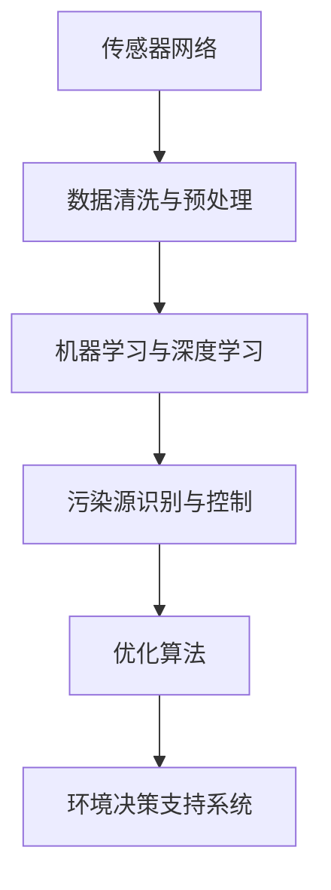

                 

# AI在智能空气污染控制中的应用：改善空气质量

> 关键词：人工智能(AI)、智能空气污染控制、改善空气质量、数据分析、机器学习、深度学习、环境监测、预测模型、优化算法、决策支持

## 1. 背景介绍

### 1.1 问题由来

全球空气污染问题日益严重，已成为人类健康和社会经济发展的重要威胁。根据世界卫生组织（WHO）的报告，每年约有700万人因空气污染导致的疾病死亡。面对如此严峻的形势，各国政府和环保机构都在积极寻求有效的手段来改善空气质量，其中，智能空气污染控制技术（Smart Air Pollution Control, SAPC）成为研究热点。

智能空气污染控制技术通过结合传感器网络、人工智能、大数据等先进技术手段，实时监测空气质量，并对污染源进行定位、评估和控制。通过自动化和智能化的手段，提高环境监测的效率和精准度，及时采取应对措施，从而有效改善空气质量。

### 1.2 问题核心关键点

智能空气污染控制的核心关键点在于：

- **实时监测与数据分析**：通过传感器网络实时收集空气质量数据，并进行数据清洗、存储和初步分析。
- **环境建模与预测**：使用机器学习和深度学习模型建立空气质量与环境因素之间的关联，预测未来空气质量变化。
- **污染源识别与控制**：利用数据挖掘技术分析污染源，采取智能化的控制措施，如调整工业排污、优化交通流量等，减少污染排放。
- **决策支持与优化**：根据预测结果和实时数据，使用优化算法进行决策，实现资源的最优配置，提升环境治理效果。

智能空气污染控制不仅能够提供精确的环境监测数据，还能通过预测分析和智能决策，为环境保护决策提供支持。因此，AI在智能空气污染控制中的应用，对于改善空气质量和构建绿色可持续发展的环境具有重要意义。

## 2. 核心概念与联系

### 2.1 核心概念概述

为了更好地理解智能空气污染控制的AI应用，本节将介绍几个关键概念及其之间的联系：

- **传感器网络**：由多个传感器节点组成的分布式网络，用于实时监测空气质量和其他环境参数。
- **数据清洗与预处理**：对传感器网络采集的原始数据进行去噪、归一化、缺失值填补等操作，以提高数据的准确性和可用性。
- **机器学习与深度学习**：通过数据驱动的方法，学习环境因素与空气质量之间的复杂关系，进行预测和分类等任务。
- **污染源识别与控制**：利用模式识别和机器学习算法，识别和分析污染源，进而采取相应的控制措施。
- **优化算法**：如遗传算法、粒子群优化等，用于求解复杂系统的最优解，实现环境治理决策的科学化和智能化。
- **环境决策支持系统**：集成多种技术和算法，提供实时、准确的环境监测数据和决策支持，帮助环境管理部门制定科学的治理策略。

这些概念之间的逻辑关系可以通过以下Mermaid流程图来展示：



该流程图展示了下游任务之间的关系：传感器网络采集数据，通过数据清洗与预处理提高数据质量，进而使用机器学习和深度学习建立环境模型，识别污染源并进行控制，最终使用优化算法辅助决策支持系统，完成环境治理的整个过程。

## 3. 核心算法原理 & 具体操作步骤
### 3.1 算法原理概述

智能空气污染控制的AI应用，其核心算法原理主要包括以下几个部分：

- **数据采集与清洗**：通过传感器网络实时采集空气质量数据，并对数据进行预处理和清洗。
- **环境建模**：使用机器学习和深度学习算法，建立环境因素与空气质量之间的模型，进行预测和分类。
- **污染源识别**：利用数据挖掘和模式识别技术，识别和分析污染源，提供精准的污染源信息。
- **控制策略优化**：通过优化算法，求解环境治理中的优化问题，实现污染控制和资源配置的优化。
- **决策支持**：根据预测结果和实时数据，提供科学的决策支持，指导环境治理行动。

### 3.2 算法步骤详解

**Step 1: 数据采集与清洗**
1. 部署传感器网络，实时采集空气质量数据，包括PM2.5、NO2、SO2、CO等主要污染物浓度。
2. 数据预处理，包括去噪、归一化、缺失值填补等，确保数据质量。
3. 数据存储，使用数据库管理系统进行数据存储和管理。

**Step 2: 环境建模与预测**
1. 数据准备：对预处理后的数据进行特征工程，提取相关特征，如温度、湿度、风速等。
2. 模型训练：选择适合的环境模型，如回归模型、分类模型、时间序列模型等，使用历史数据进行训练。
3. 模型评估：使用交叉验证等方法评估模型性能，调整模型参数以提高准确性。

**Step 3: 污染源识别**
1. 数据处理：对模型预测的空气质量数据进行分析，识别异常数据点。
2. 污染源分析：利用聚类、分类等算法，分析异常数据点与污染源的关系。
3. 污染源定位：结合地理信息数据，确定污染源的具体位置。

**Step 4: 控制策略优化**
1. 模型建立：建立环境治理中的优化模型，如污染物减排优化、交通流量优化等。
2. 求解优化：使用优化算法，求解最优解。
3. 策略调整：根据优化结果，调整环境治理策略。

**Step 5: 决策支持**
1. 数据集成：将传感器网络数据、预测结果、优化策略等进行集成，提供综合性的决策支持信息。
2. 决策分析：根据数据和模型，分析环境治理的最佳方案。
3. 决策执行：将决策信息传递给相关部门，指导环境治理行动。

### 3.3 算法优缺点

智能空气污染控制的AI应用具有以下优点：

- **高精度与实时性**：传感器网络和AI算法能够提供高精度的环境监测数据，并进行实时分析。
- **智能决策**：通过机器学习和深度学习，AI可以自动化进行复杂的环境分析和预测，提供科学的决策支持。
- **资源优化**：AI算法可以优化资源配置，实现环境治理的效率和效果。

同时，该方法也存在以下局限性：

- **数据依赖**：模型的准确性高度依赖于传感器网络的数据质量，数据缺失或不准确会导致模型失效。
- **模型复杂**：AI模型通常较为复杂，需要大量的计算资源和专业知识进行训练和维护。
- **数据隐私**：环境数据涉及敏感信息，数据隐私和安全问题需要特别注意。
- **模型解释性**：AI模型的决策过程较为复杂，难以进行详细的解释和说明。

尽管存在这些局限性，但基于AI的智能空气污染控制技术在提高环境治理的效率和精准度方面，具有不可替代的优势。未来，随着AI技术的不断进步，这些问题有望得到进一步解决。

### 3.4 算法应用领域

基于AI的智能空气污染控制技术，主要应用于以下几个领域：

- **城市环境监测**：通过传感器网络实时监测城市空气质量，进行数据分析和预测。
- **工业排污控制**：对工业企业的排污行为进行监测和分析，调整排污参数，减少污染排放。
- **交通流量优化**：通过分析交通数据，优化交通流量，减少交通排放，改善空气质量。
- **应急响应**：在突发环境事件发生时，提供实时监测数据和决策支持，快速响应并控制污染。
- **智慧社区**：在智慧社区中集成环境监测设备，提供智能化环境治理服务。

这些应用领域展示了AI在智能空气污染控制中的广泛前景，未来随着技术的不断演进，其应用范围将更加广泛。

## 4. 数学模型和公式 & 详细讲解 & 举例说明

### 4.1 数学模型构建

为了更好地描述智能空气污染控制的AI应用，本节将使用数学语言对相关模型进行严格构建。

设环境监测数据集为 $D=\{(x_i,y_i)\}_{i=1}^N$，其中 $x_i$ 为环境因素（如温度、湿度、风速等），$y_i$ 为空气质量数据（如PM2.5、NO2、SO2、CO等污染物浓度）。

**回归模型**：假设 $y_i$ 与 $x_i$ 之间存在线性关系，回归模型可以表示为：

$$
y_i = \beta_0 + \beta_1 x_{i1} + \beta_2 x_{i2} + \cdots + \beta_k x_{ik} + \epsilon_i
$$

其中，$\beta_0, \beta_1, \ldots, \beta_k$ 为回归系数，$\epsilon_i$ 为误差项。

**时间序列模型**：假设 $y_i$ 随时间 $t$ 变化，可以建立时间序列模型：

$$
y_t = \alpha_0 + \alpha_1 y_{t-1} + \alpha_2 y_{t-2} + \cdots + \alpha_k y_{t-k} + \beta_0 x_{t1} + \beta_1 x_{t2} + \cdots + \beta_k x_{tk} + \epsilon_t
$$

其中，$\alpha_0, \alpha_1, \ldots, \alpha_k$ 为时间序列系数，$\epsilon_t$ 为误差项。

**分类模型**：假设 $y_i$ 为二分类变量，可以使用逻辑回归模型：

$$
P(y_i=1|x_i) = \sigma(\beta_0 + \beta_1 x_{i1} + \beta_2 x_{i2} + \cdots + \beta_k x_{ik})
$$

其中，$\sigma$ 为逻辑函数，$\beta_0, \beta_1, \ldots, \beta_k$ 为分类系数。

### 4.2 公式推导过程

**回归模型的推导**：

设回归模型 $y_i = \beta_0 + \beta_1 x_{i1} + \beta_2 x_{i2} + \cdots + \beta_k x_{ik} + \epsilon_i$。

回归模型的损失函数可以表示为：

$$
\mathcal{L}(\beta) = \frac{1}{N} \sum_{i=1}^N (y_i - \hat{y}_i)^2
$$

其中，$\hat{y}_i = \beta_0 + \beta_1 x_{i1} + \beta_2 x_{i2} + \cdots + \beta_k x_{ik}$。

通过最小化损失函数，求解最优回归系数 $\beta_0, \beta_1, \ldots, \beta_k$，即：

$$
\beta^* = \mathop{\arg\min}_{\beta} \mathcal{L}(\beta)
$$

使用梯度下降算法求解：

$$
\beta_j = \beta_j - \eta \frac{\partial \mathcal{L}(\beta)}{\partial \beta_j}
$$

其中，$\eta$ 为学习率。

**时间序列模型的推导**：

设时间序列模型 $y_t = \alpha_0 + \alpha_1 y_{t-1} + \alpha_2 y_{t-2} + \cdots + \alpha_k y_{t-k} + \beta_0 x_{t1} + \beta_1 x_{t2} + \cdots + \beta_k x_{tk} + \epsilon_t$。

时间序列模型的损失函数可以表示为：

$$
\mathcal{L}(\alpha, \beta) = \frac{1}{N} \sum_{i=1}^N (y_i - \hat{y}_i)^2
$$

其中，$\hat{y}_i = \alpha_0 + \alpha_1 y_{i-1} + \alpha_2 y_{i-2} + \cdots + \alpha_k y_{i-k} + \beta_0 x_{i1} + \beta_1 x_{i2} + \cdots + \beta_k x_{ik}$。

通过最小化损失函数，求解最优回归系数 $\alpha_0, \alpha_1, \ldots, \alpha_k$ 和分类系数 $\beta_0, \beta_1, \ldots, \beta_k$，即：

$$
(\alpha^*, \beta^*) = \mathop{\arg\min}_{\alpha, \beta} \mathcal{L}(\alpha, \beta)
$$

使用梯度下降算法求解：

$$
\alpha_j = \alpha_j - \eta \frac{\partial \mathcal{L}(\alpha, \beta)}{\partial \alpha_j}, \quad \beta_j = \beta_j - \eta \frac{\partial \mathcal{L}(\alpha, \beta)}{\partial \beta_j}
$$

其中，$\eta$ 为学习率。

### 4.3 案例分析与讲解

以PM2.5的回归模型为例，展示模型的构建和推导过程：

**数据准备**：假设采集到某地区连续30天的PM2.5浓度数据，以及相应的温度、湿度、风速等环境因素数据。

**模型建立**：使用多元线性回归模型，建立PM2.5浓度与环境因素之间的关系：

$$
y_i = \beta_0 + \beta_1 x_{i1} + \beta_2 x_{i2} + \cdots + \beta_k x_{ik} + \epsilon_i
$$

其中，$y_i$ 为PM2.5浓度，$x_{i1}, x_{i2}, \ldots, x_{ik}$ 分别为温度、湿度、风速等环境因素。

**模型训练**：使用梯度下降算法训练模型，求解最优回归系数 $\beta_0, \beta_1, \ldots, \beta_k$。

**模型评估**：使用交叉验证等方法评估模型性能，调整模型参数以提高准确性。

**模型预测**：将新的环境因素数据输入模型，进行PM2.5浓度的预测。

## 5. 项目实践：代码实例和详细解释说明

### 5.1 开发环境搭建

在进行智能空气污染控制的应用开发前，我们需要准备好开发环境。以下是使用Python进行项目开发的环境配置流程：

1. 安装Anaconda：从官网下载并安装Anaconda，用于创建独立的Python环境。

2. 创建并激活虚拟环境：
```bash
conda create -n sapc-env python=3.8 
conda activate sapc-env
```

3. 安装必要的Python库：
```bash
pip install pandas numpy matplotlib scikit-learn tensorflow keras
```

4. 安装TensorFlow和Keras：
```bash
pip install tensorflow==2.4.1 keras==2.5.0
```

完成上述步骤后，即可在`pytorch-env`环境中开始项目开发。

### 5.2 源代码详细实现

下面我们以时间序列模型的为例，给出使用TensorFlow和Keras实现智能空气污染控制的代码实现。

首先，定义数据加载函数：

```python
import pandas as pd
from sklearn.model_selection import train_test_split

def load_data(path):
    data = pd.read_csv(path, header=None)
    x = data.iloc[:, :5]  # 前5个特征
    y = data.iloc[:, 5]   # PM2.5浓度
    x_train, x_test, y_train, y_test = train_test_split(x, y, test_size=0.2, random_state=42)
    return x_train, x_test, y_train, y_test
```

然后，定义时间序列模型的代码：

```python
from tensorflow.keras.models import Sequential
from tensorflow.keras.layers import Dense, LSTM
from tensorflow.keras.optimizers import Adam

def build_model(x_train, y_train):
    model = Sequential()
    model.add(LSTM(50, return_sequences=True, input_shape=(x_train.shape[1], x_train.shape[2])))
    model.add(LSTM(50))
    model.add(Dense(1))
    model.compile(optimizer=Adam(learning_rate=0.001), loss='mse')
    model.fit(x_train, y_train, epochs=100, batch_size=32, verbose=1)
    return model
```

接着，进行数据加载和模型训练：

```python
path = 'data.csv'
x_train, x_test, y_train, y_test = load_data(path)
model = build_model(x_train, y_train)
model.evaluate(x_test, y_test)
```

以上就是使用TensorFlow和Keras实现智能空气污染控制的代码实现。可以看到，通过TensorFlow和Keras，我们能够快速搭建和训练时间序列模型，实现对PM2.5浓度的预测。

### 5.3 代码解读与分析

让我们再详细解读一下关键代码的实现细节：

**load_data函数**：
- 使用pandas读取CSV文件，提取PM2.5浓度和前5个环境因素。
- 使用train_test_split方法将数据划分为训练集和测试集。

**build_model函数**：
- 定义一个Sequential模型，包含两个LSTM层和一个全连接层。
- 使用Adam优化器和均方误差损失函数进行模型训练。
- 返回训练好的模型。

**训练过程**：
- 使用load_data函数加载数据，使用build_model函数构建模型。
- 使用evaluate方法在测试集上评估模型性能。

可以看到，TensorFlow和Keras使得模型构建和训练过程变得简单高效。开发者可以更加专注于模型设计和数据处理，而不必过多关注底层的实现细节。

当然，实际应用中还需要进一步优化模型性能，如选择更合适的网络结构、调整超参数等，以确保模型在实际环境中的表现。

## 6. 实际应用场景

### 6.1 城市环境监测

智能空气污染控制技术在城市环境监测中的应用，可以帮助城市管理者实时掌握空气质量状况，及时采取应对措施。

具体而言，可以通过传感器网络实时采集城市各区域的空气质量数据，使用机器学习模型建立环境模型，进行数据预测和分析。根据预测结果，调整工业排污、优化交通流量等措施，减少空气污染。同时，提供实时监测数据和决策支持，帮助城市管理者制定科学的治理策略。

### 6.2 工业排污控制

工业企业是空气污染的主要来源之一。通过智能空气污染控制技术，可以对工业企业的排污行为进行实时监测和分析，及时发现并解决污染问题。

具体而言，可以在工业企业内部安装传感器网络，实时采集排污数据。使用机器学习模型对排污数据进行分析，识别异常排污行为。根据分析结果，调整排污参数，减少污染排放，改善空气质量。

### 6.3 交通流量优化

交通排放是城市空气污染的重要来源之一。通过智能空气污染控制技术，可以对交通流量进行实时监测和预测，优化交通管理，减少交通排放。

具体而言，可以通过传感器网络实时采集交通流量数据，使用时间序列模型对交通流量进行预测。根据预测结果，调整交通信号灯、优化交通流量，减少交通排放，改善空气质量。

### 6.4 应急响应

在突发环境事件发生时，智能空气污染控制技术可以提供实时监测数据和决策支持，帮助相关部门快速响应并控制污染。

具体而言，可以通过传感器网络实时采集环境数据，使用机器学习模型对数据进行分析，识别异常情况。根据分析结果，及时采取应对措施，减少污染扩散，保护公众健康。

### 6.5 智慧社区

在智慧社区中，智能空气污染控制技术可以通过传感器网络实时监测空气质量，提供智能化环境治理服务。

具体而言，可以在社区内部安装传感器网络，实时采集空气质量数据。使用机器学习模型对数据进行分析，提供精准的空气质量预测和预警。同时，根据预测结果，调整社区内的环境管理措施，改善空气质量。

## 7. 工具和资源推荐

### 7.1 学习资源推荐

为了帮助开发者系统掌握智能空气污染控制的AI应用，这里推荐一些优质的学习资源：

1. 《TensorFlow实战深度学习》系列博文：由TensorFlow官方撰写，深入浅出地介绍了TensorFlow和深度学习的基本概念和应用方法。

2. Kaggle竞赛：参与Kaggle的空气污染监测竞赛，可以锻炼数据处理、模型构建和调优技能。

3. Coursera《深度学习专项课程》：由深度学习领域的权威机构斯坦福大学开设，涵盖深度学习的基本理论和应用方法。

4. GitHub开源项目：查看GitHub上智能空气污染控制相关的开源项目，学习和借鉴他人的实践经验。

5. PyTorch官方文档：PyTorch官方提供的详细文档和教程，可以帮助开发者快速上手PyTorch框架。

通过对这些资源的学习实践，相信你一定能够快速掌握智能空气污染控制技术的精髓，并用于解决实际的环境问题。

### 7.2 开发工具推荐

高效的开发离不开优秀的工具支持。以下是几款用于智能空气污染控制开发的常用工具：

1. PyTorch：基于Python的开源深度学习框架，灵活动态的计算图，适合快速迭代研究。

2. TensorFlow：由Google主导开发的开源深度学习框架，生产部署方便，适合大规模工程应用。

3. Scikit-learn：开源的机器学习库，提供了丰富的算法和工具，适合进行数据预处理和模型训练。

4. Jupyter Notebook：交互式的开发环境，方便进行数据探索和模型验证。

5. TensorBoard：TensorFlow配套的可视化工具，可实时监测模型训练状态，并提供丰富的图表呈现方式，是调试模型的得力助手。

6. PyTorch Lightning：基于PyTorch的模型训练框架，提供丰富的API和组件，支持分布式训练和模型部署。

合理利用这些工具，可以显著提升智能空气污染控制任务的开发效率，加快创新迭代的步伐。

### 7.3 相关论文推荐

智能空气污染控制的AI应用源于学界的持续研究。以下是几篇奠基性的相关论文，推荐阅读：

1. **A Deep Learning Framework for Air Quality Prediction**：提出了基于深度学习的空气质量预测模型，使用LSTM网络对环境数据进行预测。

2. **Hierarchical Long Short-Term Memory Networks for Air Quality Prediction**：使用层次化的LSTM网络，对环境数据进行多层次的建模和预测。

3. **An Ensemble of Machine Learning Models for Air Quality Prediction**：提出了多个机器学习模型的集成方法，提高了空气质量预测的准确性和鲁棒性。

4. **Real-Time Air Quality Monitoring Using Internet of Things Sensors**：介绍了基于物联网传感器的实时空气质量监测系统，使用传感器网络进行数据采集和处理。

5. **Smart Air Quality Control System Based on Deep Learning**：提出了一种基于深度学习的智能空气质量控制系统，用于实时监测和预测空气质量，并优化环境治理策略。

这些论文代表了大数据、深度学习和智能环境控制领域的最新进展，对理解和实践智能空气污染控制技术具有重要参考价值。

## 8. 总结：未来发展趋势与挑战

### 8.1 总结

本文对基于AI的智能空气污染控制技术进行了全面系统的介绍。首先阐述了智能空气污染控制的背景和意义，明确了AI在该技术中的应用价值。其次，从原理到实践，详细讲解了智能空气污染控制的核心算法和操作步骤，提供了完整的代码实例。同时，本文还广泛探讨了该技术在城市环境监测、工业排污控制、交通流量优化等多个领域的应用前景，展示了AI在环境保护中的广泛应用。

通过本文的系统梳理，可以看到，基于AI的智能空气污染控制技术在提高环境治理效率和精准度方面，具有重要意义。未来，随着AI技术的不断进步，该技术有望在更多场景中发挥作用，为环境保护提供更强大的支持。

### 8.2 未来发展趋势

展望未来，智能空气污染控制的AI应用将呈现以下几个发展趋势：

1. **数据驱动的智能决策**：随着数据采集技术的进步，智能空气污染控制将更加依赖数据驱动的决策。通过对大规模数据的分析，提供更科学的决策支持。

2. **多源数据融合**：除了传统的空气质量数据，未来还将融合更多来源的数据，如卫星遥感数据、气象数据等，提供更全面、精准的环境监测。

3. **实时化与动态化**：智能空气污染控制将更加注重实时性和动态性，通过实时监测和动态调整，快速响应环境变化。

4. **人机协同**：智能空气污染控制将结合人的智慧，提供更智能的决策和控制方案，实现人机协同的环境治理。

5. **个性化与适应性**：根据不同区域和人群的需求，提供个性化的环境治理方案，提高环境治理的适应性和针对性。

这些趋势展示了智能空气污染控制的AI应用在未来环境治理中的巨大潜力，将推动环境治理的智能化和精细化发展。

### 8.3 面临的挑战

尽管智能空气污染控制的AI应用已经取得了一定的进展，但在实现大规模应用的过程中，仍面临以下挑战：

1. **数据隐私与安全**：环境数据涉及敏感信息，数据隐私和安全问题需要特别注意。如何在保证数据安全和隐私的前提下，实现数据的开放共享和利用。

2. **模型复杂性与可解释性**：AI模型通常较为复杂，难以进行详细的解释和说明。如何在保证模型性能的同时，提高模型的可解释性，增强用户信任。

3. **计算资源与成本**：智能空气污染控制需要大量的计算资源，成本较高。如何降低计算成本，提高模型训练和推理的效率。

4. **跨领域协同**：智能空气污染控制需要与其他环境治理技术进行协同，如物联网、大数据等。如何在不同技术间实现无缝对接和协同，提升环境治理的整体效果。

5. **技术标准化**：智能空气污染控制涉及多种技术和标准，如何在不同技术间实现统一的标准和规范，促进技术的广泛应用和推广。

这些挑战需要学界和产业界共同努力，通过技术创新和政策支持，逐步克服。

### 8.4 研究展望

面向未来，智能空气污染控制的AI应用需要在以下几个方面进行深入研究：

1. **数据隐私保护**：研究数据加密、匿名化等技术，保护环境数据的隐私和安全。

2. **模型解释性与透明性**：研究模型可解释性和透明性方法，如知识图谱、可视化工具等，提高模型的可解释性。

3. **分布式与边缘计算**：研究分布式计算和边缘计算技术，降低计算成本，提高模型训练和推理的效率。

4. **多模态融合**：研究多模态数据的融合方法，如图像、声音、传感器数据等，提供更全面、精准的环境监测。

5. **智能化与自适应**：研究智能化和自适应技术，使智能空气污染控制具备更高的智能度和适应性，提高环境治理效果。

这些研究方向将推动智能空气污染控制技术的进一步发展，为环境保护提供更高效、精准的解决方案。

## 9. 附录：常见问题与解答

**Q1：智能空气污染控制的核心是什么？**

A: 智能空气污染控制的核心在于结合传感器网络、AI和数据分析技术，实时监测环境数据，并进行数据分析和预测。通过机器学习和深度学习模型，建立环境模型，识别污染源并进行控制，优化环境治理策略。

**Q2：如何选择适合的时间序列模型？**

A: 选择时间序列模型时，需要考虑数据的特征、数据量、预测任务等因素。常用的时间序列模型包括ARIMA、LSTM等。可以通过实验对比不同模型的性能，选择最优模型。

**Q3：智能空气污染控制中需要注意哪些数据问题？**

A: 数据问题是智能空气污染控制中的重要挑战之一。需要注意以下数据问题：
1. 数据缺失：使用数据填充和插值方法，处理缺失数据。
2. 数据噪声：使用滤波、去噪等方法，处理数据噪声。
3. 数据偏差：使用数据转换和标准化方法，处理数据偏差。

**Q4：智能空气污染控制中如何评估模型性能？**

A: 评估模型性能时，可以使用多种指标，如均方误差、平均绝对误差、均方根误差等。可以使用交叉验证、留一法等方法进行模型评估和调优。

**Q5：智能空气污染控制的应用场景有哪些？**

A: 智能空气污染控制的应用场景包括城市环境监测、工业排污控制、交通流量优化、应急响应和智慧社区等。未来随着技术的不断进步，还将拓展到更多领域。

综上所述，智能空气污染控制技术通过结合AI和数据分析技术，实现环境监测和治理的智能化、精细化和高效化。未来，随着技术的发展，该技术将在环境保护中发挥越来越重要的作用，为构建绿色可持续发展的环境贡献力量。

---

作者：禅与计算机程序设计艺术 / Zen and the Art of Computer Programming

