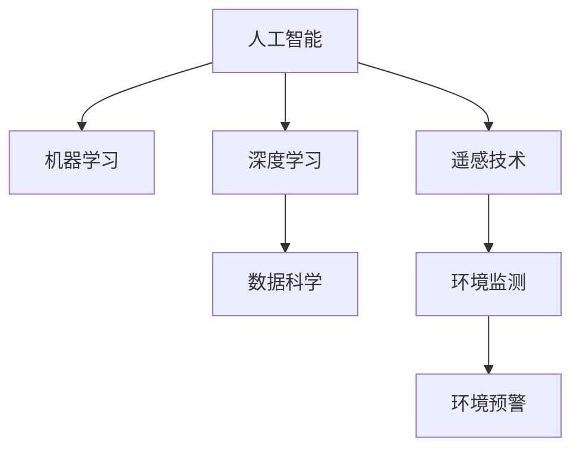

                 

# AI在环境保护中的应用：监测与预警

> 关键词：人工智能(AI), 环境保护, 监测, 预警, 机器学习, 数据科学, 图像识别, 遥感技术, 环境预测

## 1. 背景介绍

### 1.1 问题由来
近年来，全球气候变化和环境污染问题日益严重，对人类的生存环境造成了巨大威胁。环境保护不仅是政府和企业的责任，也是每个公民的义务。如何利用先进的技术手段，及时、准确地监测和预警环境风险，成为当前环境管理的重要课题。

### 1.2 问题核心关键点
环境监测与预警的主要挑战在于数据量大、来源多样、特征复杂，需要高效的算法模型来处理和分析。通过人工智能（AI），尤其是机器学习和深度学习技术，可以实现自动化的环境数据处理和分析，快速发现环境异常，及时预警潜在风险。

### 1.3 问题研究意义
AI在环境监测与预警中的应用，可以极大地提升环境数据处理的效率和准确性，帮助相关部门及时发现和解决环境问题，预防和减轻环境灾害的影响，实现环境治理的智能化。同时，AI技术的应用还可以降低人力物力的成本，提高环境管理的效率和效果。

## 2. 核心概念与联系

### 2.1 核心概念概述

为更好地理解AI在环境监测与预警中的应用，本节将介绍几个密切相关的核心概念：

- **人工智能(AI)**：一种通过模拟人脑的学习、推理等智能行为，使计算机能够自动完成复杂任务的技术。
- **机器学习(ML)**：一种通过数据训练模型，使模型能够对新数据进行预测或分类的算法。
- **深度学习(DL)**：一种基于神经网络的机器学习方法，通过多层次的非线性处理，可以实现对复杂数据的高级抽象。
- **数据科学(Data Science)**：一门通过数据挖掘、统计分析和机器学习等手段，提取、分析和应用数据的学科。
- **遥感技术(RS)**：一种利用卫星或无人机等设备，从远处获取地表信息的科学技术。
- **环境监测**：通过各种传感器和设备，实时监测环境参数，如水质、大气污染、噪音等。
- **环境预警**：通过分析和建模，预测环境风险，及时发布预警信息，避免或减轻环境灾害的影响。

这些核心概念之间的逻辑关系可以通过以下Mermaid流程图来展示：



这个流程图展示了一些核心概念及其之间的关系：

1. 人工智能技术包括机器学习和深度学习，为环境监测和预警提供技术支撑。
2. 数据科学通过数据挖掘和分析，为机器学习模型提供数据支持。
3. 遥感技术提供环境监测的数据来源，通过卫星或无人机获取地表信息。
4. 环境监测为环境预警提供实时数据，通过传感器和设备采集环境参数。
5. 环境预警利用机器学习模型进行分析和预测，及时发布预警信息。

这些概念共同构成了AI在环境监测与预警中的应用框架，使其能够在各种场景下发挥重要作用。通过理解这些核心概念，我们可以更好地把握AI在环境管理中的应用方向。

## 3. 核心算法原理 & 具体操作步骤
### 3.1 算法原理概述

AI在环境监测与预警中的应用，主要基于机器学习（ML）和深度学习（DL）技术。其核心思想是：通过训练模型，使其能够从环境监测数据中学习到环境变化的规律，并利用这些规律进行环境预测和预警。

形式化地，假设环境监测数据为 $\mathcal{D}=\{(x_i,y_i)\}_{i=1}^N, x_i \in \mathcal{X}, y_i \in \mathcal{Y}$，其中 $x_i$ 为监测数据，$y_i$ 为环境标签。环境预警的目标是找到最优的模型 $M_{\theta}$，使得：

$$
\hat{\theta}=\mathop{\arg\min}_{\theta} \mathcal{L}(M_{\theta},\mathcal{D})
$$

其中 $\mathcal{L}$ 为损失函数，用于衡量模型预测输出与真实标签之间的差异。常见的损失函数包括交叉熵损失、均方误差损失等。

通过梯度下降等优化算法，模型不断更新参数 $\theta$，最小化损失函数 $\mathcal{L}$，使得模型输出逼近真实标签。

### 3.2 算法步骤详解

AI在环境监测与预警中的应用，一般包括以下几个关键步骤：

**Step 1: 数据收集与预处理**
- 收集环境监测数据，包括水质、气温、空气质量、噪音等。
- 对数据进行清洗、去噪、归一化等预处理，确保数据质量。

**Step 2: 数据标注与分割**
- 对部分数据进行人工标注，如水质检测结果、空气质量等级等。
- 将数据集划分为训练集、验证集和测试集，用于模型训练、调参和性能评估。

**Step 3: 模型选择与训练**
- 选择适合的机器学习或深度学习模型，如决策树、随机森林、卷积神经网络（CNN）等。
- 在训练集上使用优化算法进行模型训练，调整模型参数。

**Step 4: 模型评估与调优**
- 在验证集上评估模型性能，使用交叉验证等方法进行模型调优。
- 根据评估结果，调整模型结构和参数，提高模型准确率。

**Step 5: 环境预警**
- 将训练好的模型应用于实时环境数据，进行环境预测。
- 根据预测结果，及时发布预警信息，如水质污染、空气污染等。

### 3.3 算法优缺点

AI在环境监测与预警中的应用，具有以下优点：
1. 自动化程度高。通过机器学习和深度学习技术，可以实现自动化环境数据处理和分析，减少人力成本。
2. 实时性强。AI模型可以快速处理实时数据，及时发现环境异常，进行预警。
3. 预测准确率高。深度学习模型可以学习到环境数据的复杂规律，预测准确率较高。
4. 可扩展性好。AI模型可以通过增加训练数据和计算资源，实现性能提升。

同时，该方法也存在一定的局限性：
1. 数据质量要求高。环境数据复杂多样，数据质量问题可能会影响模型效果。
2. 模型复杂度高。深度学习模型结构复杂，需要大量计算资源。
3. 鲁棒性问题。AI模型对异常数据和噪声数据敏感，容易产生误判。
4. 数据隐私问题。环境数据涉及隐私，数据收集和处理需要遵守相关法律法规。

尽管存在这些局限性，但就目前而言，AI在环境监测与预警中的应用仍是一种高效、实用的解决方案。未来相关研究的重点在于如何进一步提高数据质量、优化模型结构、增强鲁棒性和保障数据隐私。

### 3.4 算法应用领域

AI在环境监测与预警中的应用，已经在多个领域得到了广泛应用，例如：

- **水质监测**：利用传感器采集水质数据，通过AI模型预测水质变化趋势，进行预警。
- **空气质量监测**：通过无人机或地面传感器获取空气质量数据，利用AI模型预测空气质量变化，发布预警。
- **噪音监测**：利用麦克风或传感器采集噪音数据，通过AI模型预测噪音水平变化，进行预警。
- **森林火灾预警**：通过遥感技术获取森林图像数据，利用AI模型预测火灾风险，发布预警。
- **城市热岛效应监测**：利用传感器采集城市温度数据，通过AI模型预测城市热岛效应变化，进行预警。

除了上述这些经典应用外，AI技术还被创新性地应用到更多场景中，如气候变化预测、海洋污染监测、生态系统监测等，为环境保护提供了新的技术手段。

## 4. 数学模型和公式 & 详细讲解 & 举例说明
### 4.1 数学模型构建

本节将使用数学语言对AI在环境监测与预警中的应用进行更加严格的刻画。

假设环境监测数据为 $\mathcal{D}=\{(x_i,y_i)\}_{i=1}^N, x_i \in \mathcal{X}, y_i \in \mathcal{Y}$，其中 $x_i$ 为监测数据，$y_i$ 为环境标签。环境预警的目标是找到最优的模型 $M_{\theta}$，使得：

$$
\hat{\theta}=\mathop{\arg\min}_{\theta} \mathcal{L}(M_{\theta},\mathcal{D})
$$

其中 $\mathcal{L}$ 为损失函数，用于衡量模型预测输出与真实标签之间的差异。常见的损失函数包括交叉熵损失、均方误差损失等。

在实践中，我们通常使用基于梯度的优化算法（如SGD、Adam等）来近似求解上述最优化问题。设 $\eta$ 为学习率，$\lambda$ 为正则化系数，则参数的更新公式为：

$$
\theta \leftarrow \theta - \eta \nabla_{\theta}\mathcal{L}(\theta) - \eta\lambda\theta
$$

其中 $\nabla_{\theta}\mathcal{L}(\theta)$ 为损失函数对参数 $\theta$ 的梯度，可通过反向传播算法高效计算。

### 4.2 公式推导过程

以下我们以水质监测任务为例，推导交叉熵损失函数及其梯度的计算公式。

假设模型 $M_{\theta}$ 在输入 $x$ 上的输出为 $\hat{y}=M_{\theta}(x) \in [0,1]$，表示样本属于水质优良的概率。真实标签 $y \in \{0,1\}$。则二分类交叉熵损失函数定义为：

$$
\ell(M_{\theta}(x),y) = -[y\log \hat{y} + (1-y)\log (1-\hat{y})]
$$

将其代入经验风险公式，得：

$$
\mathcal{L}(\theta) = -\frac{1}{N}\sum_{i=1}^N [y_i\log M_{\theta}(x_i)+(1-y_i)\log(1-M_{\theta}(x_i))]
$$

根据链式法则，损失函数对参数 $\theta_k$ 的梯度为：

$$
\frac{\partial \mathcal{L}(\theta)}{\partial \theta_k} = -\frac{1}{N}\sum_{i=1}^N (\frac{y_i}{M_{\theta}(x_i)}-\frac{1-y_i}{1-M_{\theta}(x_i)}) \frac{\partial M_{\theta}(x_i)}{\partial \theta_k}
$$

其中 $\frac{\partial M_{\theta}(x_i)}{\partial \theta_k}$ 可进一步递归展开，利用自动微分技术完成计算。

在得到损失函数的梯度后，即可带入参数更新公式，完成模型的迭代优化。重复上述过程直至收敛，最终得到适应水质监测的最优模型参数 $\theta^*$。

### 4.3 案例分析与讲解

下面以空气质量监测为例，介绍AI在环境监测与预警中的应用。

**Step 1: 数据收集与预处理**
- 使用传感器网络或卫星数据收集空气质量监测数据，包括PM2.5、NO2、SO2等。
- 对数据进行去噪、归一化等预处理，确保数据质量。

**Step 2: 数据标注与分割**
- 对部分数据进行人工标注，如空气质量等级（优、良、轻度污染等）。
- 将数据集划分为训练集、验证集和测试集，用于模型训练、调参和性能评估。

**Step 3: 模型选择与训练**
- 选择适合的机器学习或深度学习模型，如CNN、RNN等。
- 在训练集上使用优化算法进行模型训练，调整模型参数。

**Step 4: 模型评估与调优**
- 在验证集上评估模型性能，使用交叉验证等方法进行模型调优。
- 根据评估结果，调整模型结构和参数，提高模型准确率。

**Step 5: 环境预警**
- 将训练好的模型应用于实时空气质量数据，进行空气质量预测。
- 根据预测结果，及时发布预警信息，如空气质量等级变化、高污染预警等。

例如，可以使用卷积神经网络（CNN）对空气质量图像进行分类。具体步骤如下：

1. 数据准备：收集空气质量图像数据，并进行预处理。
2. 模型设计：构建卷积神经网络模型，如图像分类器。
3. 训练模型：使用优化算法训练模型，调整模型参数。
4. 评估模型：在验证集上评估模型性能，进行调优。
5. 预测预警：将训练好的模型应用于实时图像数据，进行空气质量预测，并及时发布预警信息。

## 5. 项目实践：代码实例和详细解释说明
### 5.1 开发环境搭建

在进行环境监测与预警的AI项目实践前，我们需要准备好开发环境。以下是使用Python进行PyTorch开发的环境配置流程：

1. 安装Anaconda：从官网下载并安装Anaconda，用于创建独立的Python环境。

2. 创建并激活虚拟环境：
```bash
conda create -n env_name python=3.8 
conda activate env_name
```

3. 安装PyTorch：根据CUDA版本，从官网获取对应的安装命令。例如：
```bash
conda install pytorch torchvision torchaudio cudatoolkit=11.1 -c pytorch -c conda-forge
```

4. 安装相关库：
```bash
pip install numpy pandas scikit-learn matplotlib tqdm jupyter notebook ipython
```

完成上述步骤后，即可在`env_name`环境中开始AI实践项目。

### 5.2 源代码详细实现

下面我们以空气质量监测任务为例，给出使用PyTorch对CNN模型进行训练的代码实现。

首先，定义数据处理函数：

```python
import torch
from torch.utils.data import Dataset, DataLoader
from torchvision import transforms
from PIL import Image

class AirQualityDataset(Dataset):
    def __init__(self, data_dir, transform=None):
        self.data_dir = data_dir
        self.transform = transform
        self.data_files = self._get_data_files()
        
    def __len__(self):
        return len(self.data_files)
    
    def __getitem__(self, idx):
        img_path = self.data_files[idx]
        img = Image.open(img_path).convert('RGB')
        
        if self.transform:
            img = self.transform(img)
        
        label = int(img_path.split('_')[-1])
        return {'image': img, 'label': label}

    def _get_data_files(self):
        data_files = []
        for i in range(1, 2):
            for j in range(1, 5):
                for k in range(1, 3):
                    for label in [1, 2, 3, 4]:
                        file_name = f"{i}_{j}_{k}_{label}.png"
                        data_files.append(os.path.join(self.data_dir, file_name))
        return data_files
```

然后，定义模型和优化器：

```python
import torch.nn as nn
import torch.optim as optim

class CNNModel(nn.Module):
    def __init__(self):
        super(CNNModel, self).__init__()
        self.conv1 = nn.Conv2d(3, 32, kernel_size=3, stride=1, padding=1)
        self.conv2 = nn.Conv2d(32, 64, kernel_size=3, stride=1, padding=1)
        self.fc1 = nn.Linear(64*4*4, 128)
        self.fc2 = nn.Linear(128, 4)
        self.softmax = nn.Softmax(dim=1)
        
    def forward(self, x):
        x = F.relu(self.conv1(x))
        x = F.max_pool2d(x, 2)
        x = F.relu(self.conv2(x))
        x = F.max_pool2d(x, 2)
        x = x.view(-1, 64*4*4)
        x = F.relu(self.fc1(x))
        x = self.fc2(x)
        x = self.softmax(x)
        return x

model = CNNModel()
optimizer = optim.Adam(model.parameters(), lr=0.001)
```

接着，定义训练和评估函数：

```python
def train_model(model, data_loader, optimizer, num_epochs=10):
    device = torch.device('cuda' if torch.cuda.is_available() else 'cpu')
    model.to(device)
    
    for epoch in range(num_epochs):
        model.train()
        total_loss = 0
        for images, labels in data_loader:
            images, labels = images.to(device), labels.to(device)
            optimizer.zero_grad()
            output = model(images)
            loss = F.cross_entropy(output, labels)
            loss.backward()
            optimizer.step()
            total_loss += loss.item()
        print(f"Epoch {epoch+1}, Loss: {total_loss/len(data_loader)}")
        
    model.eval()
    total_correct = 0
    total_samples = 0
    with torch.no_grad():
        for images, labels in data_loader:
            images, labels = images.to(device), labels.to(device)
            output = model(images)
            _, predicted = torch.max(output, 1)
            total_correct += (predicted == labels).sum().item()
            total_samples += labels.size(0)
    print(f"Accuracy: {total_correct/total_samples}")
```

最后，启动训练流程并在测试集上评估：

```python
train_loader = DataLoader(AirQualityDataset(data_dir='path/to/dataset', transform=transforms.ToTensor()),
                         batch_size=32, shuffle=True)
test_loader = DataLoader(AirQualityDataset(data_dir='path/to/dataset', transform=transforms.ToTensor()),
                         batch_size=32, shuffle=False)

train_model(model, train_loader, optimizer)
```

以上就是使用PyTorch对CNN模型进行空气质量监测任务训练的完整代码实现。可以看到，得益于PyTorch的强大封装，我们可以用相对简洁的代码完成模型训练。

### 5.3 代码解读与分析

让我们再详细解读一下关键代码的实现细节：

**AirQualityDataset类**：
- `__init__`方法：初始化数据集路径和预处理方式。
- `__len__`方法：返回数据集的样本数量。
- `__getitem__`方法：对单个样本进行处理，将图像输入转换为Tensor，并返回图像和标签。

**CNNModel类**：
- `__init__`方法：定义模型的网络结构，包括卷积层、全连接层和softmax输出层。
- `forward`方法：定义前向传播过程，通过卷积、池化、全连接等操作输出预测结果。

**train_model函数**：
- 定义训练循环，每轮迭代中对模型进行前向传播、计算损失、反向传播和参数更新。
- 使用交叉熵损失函数计算预测结果与真实标签之间的差异。
- 在测试集上评估模型准确率，输出评估结果。

**数据加载器（DataLoader）**：
- 使用PyTorch的DataLoader，将数据集划分为批处理，供模型训练和推理使用。

可以看到，PyTorch配合CNN模型使得空气质量监测任务的训练代码实现变得简洁高效。开发者可以将更多精力放在数据处理、模型改进等高层逻辑上，而不必过多关注底层的实现细节。

当然，工业级的系统实现还需考虑更多因素，如模型的保存和部署、超参数的自动搜索、更灵活的任务适配层等。但核心的模型训练过程基本与此类似。

## 6. 实际应用场景
### 6.1 智能水务管理

AI在智能水务管理中的应用，可以帮助城市提高水资源利用效率，降低水资源浪费。通过实时监测水质数据，利用AI模型预测水质变化趋势，可以及时发现污染源，采取治理措施，保障城市供水安全。

具体而言，可以部署传感器网络在城市河道、水源地等地进行水质监测，实时收集水质数据。通过AI模型分析水质数据，预测水质变化趋势，判断是否存在异常。一旦发现水质异常，系统立即发出预警，通知相关部门进行处理，同时调整供水方案，保障城市居民用水安全。

### 6.2 工业污染监测

AI在工业污染监测中的应用，可以帮助企业提高生产效率，减少环境污染。通过实时监测工厂排放数据，利用AI模型预测排放变化趋势，可以及时发现污染源，采取治理措施，降低污染排放。

具体而言，可以部署传感器网络在工厂排放口进行排放监测，实时收集排放数据。通过AI模型分析排放数据，预测排放变化趋势，判断是否存在异常。一旦发现排放异常，系统立即发出预警，通知相关部门进行处理，同时优化生产工艺，减少污染排放。

### 6.3 森林火灾预警

AI在森林火灾预警中的应用，可以提前发现火灾隐患，减少火灾损失。通过遥感技术获取森林图像数据，利用AI模型预测火灾风险，可以及时发现火灾隐患，采取预防措施，减少火灾损失。

具体而言，可以使用卫星或无人机获取森林图像数据，通过AI模型分析图像数据，预测火灾风险。一旦发现火灾隐患，系统立即发出预警，通知相关部门进行预防，采取灭火措施，减少火灾损失。

### 6.4 未来应用展望

随着AI技术的不断进步，基于AI的环境监测与预警技术将迎来更多的应用场景，为环境保护带来新的机遇和挑战。

- **智慧农业**：通过AI模型预测气象变化、病虫害情况等，及时进行农业管理，提高农业生产效率，减少环境污染。
- **生态系统监测**：利用AI模型分析生态系统数据，监测生态系统变化，及时发现环境问题，采取治理措施。
- **气候变化预测**：通过AI模型预测气候变化趋势，及时采取应对措施，减少气候变化带来的环境影响。
- **海洋污染监测**：通过AI模型分析海洋污染数据，预测污染变化趋势，及时采取治理措施，减少海洋污染。
- **智慧城市**：通过AI模型分析城市数据，监测城市环境变化，及时采取应对措施，提高城市管理效率，减少环境污染。

未来，随着AI技术在环境监测与预警领域的深入应用，环境保护将迎来更加智能化、高效化的管理模式。相信随着技术的不断进步，AI在环境保护中的应用将更加广泛和深入，为建设绿色、可持续发展的地球贡献力量。

## 7. 工具和资源推荐
### 7.1 学习资源推荐

为了帮助开发者系统掌握AI在环境监测与预警中的应用，这里推荐一些优质的学习资源：

1. 《深度学习在环境监测中的应用》系列博文：由环境领域专家撰写，深入浅出地介绍了AI在环境监测中的应用案例和实现方法。

2. Coursera《机器学习在环境科学中的应用》课程：斯坦福大学开设的NLP明星课程，有Lecture视频和配套作业，带你入门机器学习在环境科学中的应用。

3. 《环境数据科学入门》书籍：全面介绍了环境数据科学的原理和实践方法，包括数据收集、数据处理和模型构建等。

4. Kaggle《环境数据分析竞赛》：参加Kaggle的竞赛，实践环境数据分析项目，提升实际应用能力。

5. GitHub《环境监测与预警开源项目》：访问开源项目，学习环境监测与预警的实际应用，了解最新研究进展。

通过对这些资源的学习实践，相信你一定能够快速掌握AI在环境监测与预警中的应用技巧，并用于解决实际的环境问题。
###  7.2 开发工具推荐

高效的开发离不开优秀的工具支持。以下是几款用于AI环境监测与预警开发的常用工具：

1. PyTorch：基于Python的开源深度学习框架，灵活动态的计算图，适合快速迭代研究。大部分预训练语言模型都有PyTorch版本的实现。

2. TensorFlow：由Google主导开发的开源深度学习框架，生产部署方便，适合大规模工程应用。同样有丰富的预训练语言模型资源。

3. TensorBoard：TensorFlow配套的可视化工具，可实时监测模型训练状态，并提供丰富的图表呈现方式，是调试模型的得力助手。

4. Weights & Biases：模型训练的实验跟踪工具，可以记录和可视化模型训练过程中的各项指标，方便对比和调优。与主流深度学习框架无缝集成。

5. Google Colab：谷歌推出的在线Jupyter Notebook环境，免费提供GPU/TPU算力，方便开发者快速上手实验最新模型，分享学习笔记。

合理利用这些工具，可以显著提升AI环境监测与预警任务的开发效率，加快创新迭代的步伐。

### 7.3 相关论文推荐

AI在环境监测与预警中的应用源于学界的持续研究。以下是几篇奠基性的相关论文，推荐阅读：

1. Deep Learning for Environmental Data Science（《深度学习在环境数据科学中的应用》）：综述了深度学习在环境监测和预测中的应用，包括水质、空气质量、生态系统等。

2. CNN-Based Air Quality Prediction（《基于卷积神经网络的空气质量预测》）：提出使用卷积神经网络对空气质量数据进行预测，取得了显著的效果。

3. Forest Fire Risk Prediction Using CNN（《使用卷积神经网络预测森林火灾风险》）：提出使用卷积神经网络对森林火灾风险进行预测，提高了预测准确率。

4. Spatially Adaptive Attention for Environmental Data（《环境数据的空域自适应注意力机制》）：提出使用空域自适应注意力机制对环境数据进行建模，提高了预测准确率。

5. AI-Driven Real-Time Environmental Monitoring（《基于AI的实时环境监测》）：综述了AI在实时环境监测中的应用，包括水质、空气质量、噪声等。

这些论文代表了大规模环境监测与预警技术的发展脉络。通过学习这些前沿成果，可以帮助研究者把握学科前进方向，激发更多的创新灵感。

## 8. 总结：未来发展趋势与挑战
### 8.1 总结

本文对AI在环境监测与预警中的应用进行了全面系统的介绍。首先阐述了AI在环境监测与预警中的研究背景和意义，明确了AI技术在环境数据处理和预测中的独特价值。其次，从原理到实践，详细讲解了AI模型的构建和训练过程，给出了环境监测与预警任务开发的完整代码实例。同时，本文还广泛探讨了AI技术在智能水务管理、工业污染监测、森林火灾预警等多个行业领域的应用前景，展示了AI技术在环境保护中的巨大潜力。此外，本文精选了AI技术在环境监测与预警中的应用资源，力求为读者提供全方位的技术指引。

通过本文的系统梳理，可以看到，AI技术在环境监测与预警中的应用前景广阔，具有高效、自动化、高精度等优势。这些技术手段的不断创新和应用，将为环境保护提供强有力的支持，推动绿色、可持续发展的实现。

### 8.2 未来发展趋势

展望未来，AI在环境监测与预警中的应用将呈现以下几个发展趋势：

1. **数据融合技术**：未来的环境监测与预警将更多地融合不同类型的数据，如遥感数据、气象数据、地理数据等，通过多源数据融合，提高预测准确率。

2. **实时性提升**：AI技术将进一步提升数据处理和预测的实时性，实现毫秒级的实时监测与预警，及时发现环境异常，采取应急措施。

3. **跨模态学习**：未来的环境监测与预警将更多地应用跨模态学习技术，融合图像、声音、文本等多种模态的数据，提升模型的泛化能力。

4. **模型可解释性增强**：随着对AI技术可解释性需求的提升，未来的环境监测与预警模型将更加注重模型的可解释性，增强模型的透明度和可信度。

5. **数据隐私保护**：随着数据隐私意识的提升，未来的环境监测与预警将更加注重数据隐私保护，采用差分隐私、联邦学习等技术，确保数据的安全性。

6. **智慧决策支持**：未来的环境监测与预警将更多地融入智慧决策支持系统，结合专家知识和实时数据，提供更科学的决策建议，辅助环境管理。

以上趋势凸显了AI在环境监测与预警中的未来发展方向，为环境保护带来了新的机遇和挑战。这些方向的探索发展，必将进一步提升AI技术在环境保护中的应用效果，推动环境治理的智能化和精准化。

### 8.3 面临的挑战

尽管AI在环境监测与预警中的应用已经取得了显著成果，但在迈向更加智能化、普适化应用的过程中，仍面临诸多挑战：

1. **数据质量问题**：环境数据来源多样、噪声干扰多，数据质量问题可能会影响模型的效果。
2. **模型复杂度高**：AI模型结构复杂，需要大量计算资源，如何降低模型复杂度，提高计算效率，是未来的一个重要研究方向。
3. **鲁棒性问题**：AI模型对异常数据和噪声数据敏感，容易产生误判，如何提高模型的鲁棒性，增强模型的稳定性，是未来的一个主要挑战。
4. **数据隐私保护**：环境数据涉及隐私，数据收集和处理需要遵守相关法律法规，如何保障数据隐私，是未来的一个重要研究方向。
5. **智慧决策支持**：如何将AI技术与智慧决策支持系统相结合，提供更科学的决策建议，是未来的一个重要研究方向。

尽管存在这些挑战，但就目前而言，AI在环境监测与预警中的应用仍是一种高效、实用的解决方案。未来相关研究的重点在于如何进一步提高数据质量、优化模型结构、增强鲁棒性和保障数据隐私。

### 8.4 研究展望

未来的AI环境监测与预警研究，将在以下几个方面寻求新的突破：

1. **多模态数据融合**：将多种类型的环境数据融合，如遥感数据、气象数据、地理数据等，通过多源数据融合，提高预测准确率。

2. **实时性提升**：利用GPU、TPU等高性能设备，提升数据处理和预测的实时性，实现毫秒级的实时监测与预警，及时发现环境异常，采取应急措施。

3. **跨模态学习**：融合图像、声音、文本等多种模态的数据，提升模型的泛化能力，增强模型的适应性。

4. **模型可解释性增强**：通过可解释性技术，如因果推断、自然语言解释等，增强模型的透明度和可信度，使环境监测与预警过程更可控、更透明。

5. **数据隐私保护**：采用差分隐私、联邦学习等技术，确保数据的安全性，保障数据隐私。

6. **智慧决策支持**：将AI技术与智慧决策支持系统相结合，提供更科学的决策建议，辅助环境管理，推动绿色、可持续发展的实现。

这些研究方向将推动AI在环境监测与预警中的应用不断深入，为环境保护提供更高效、更精准的解决方案。相信随着技术的不断进步，AI在环境保护中的应用将更加广泛和深入，为建设绿色、可持续发展的地球贡献力量。

## 9. 附录：常见问题与解答
### Q1：AI在环境监测与预警中需要注意哪些问题？

A: AI在环境监测与预警中需要注意以下问题：
1. 数据质量问题：环境数据来源多样、噪声干扰多，数据质量问题可能会影响模型的效果。
2. 模型复杂度高：AI模型结构复杂，需要大量计算资源，如何降低模型复杂度，提高计算效率，是未来的一个重要研究方向。
3. 鲁棒性问题：AI模型对异常数据和噪声数据敏感，容易产生误判，如何提高模型的鲁棒性，增强模型的稳定性，是未来的一个主要挑战。
4. 数据隐私保护：环境数据涉及隐私，数据收集和处理需要遵守相关法律法规，如何保障数据隐私，是未来的一个重要研究方向。
5. 智慧决策支持：如何将AI技术与智慧决策支持系统相结合，提供更科学的决策建议，是未来的一个重要研究方向。

这些问题的解决需要结合具体应用场景和实际需求，进行系统化的研究和优化。

**Q2：如何提升AI在环境监测与预警中的实时性？**

A: 提升AI在环境监测与预警中的实时性，可以从以下几个方面入手：
1. 优化数据处理流程：采用高效的算法和工具，减少数据处理的耗时。
2. 优化模型结构：采用轻量级模型和高效的优化算法，减少计算时间和内存占用。
3. 分布式计算：利用分布式计算框架，如TensorFlow分布式训练、Spark等，加速模型训练和推理。
4. 硬件优化：利用GPU、TPU等高性能设备，提升计算速度。
5. 数据预处理：对数据进行预处理，减少数据量和计算量，提高数据处理速度。

通过这些方法，可以显著提升AI在环境监测与预警中的实时性，实现毫秒级的实时监测与预警。

**Q3：如何保障AI在环境监测与预警中的数据隐私？**

A: 保障AI在环境监测与预警中的数据隐私，可以从以下几个方面入手：
1. 数据匿名化：对数据进行匿名化处理，去除个人隐私信息，保障数据隐私。
2. 差分隐私：采用差分隐私技术，通过添加噪声，确保数据在统计分析中不会泄露个人隐私。
3. 联邦学习：采用联邦学习技术，在本地设备上训练模型，只上传模型参数，不上传原始数据，保障数据隐私。
4. 数据访问控制：通过权限控制，确保只有授权人员可以访问数据，保障数据安全。
5. 数据加密：对数据进行加密处理，确保数据在传输和存储过程中的安全性。

通过这些方法，可以保障AI在环境监测与预警中的数据隐私，确保数据的安全性和合法性。

---

作者：禅与计算机程序设计艺术 / Zen and the Art of Computer Programming

