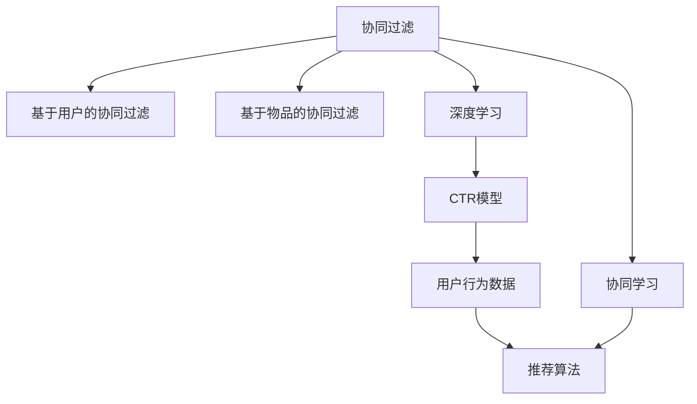

                 

# AI在电商平台商品关联分析中的应用

> 关键词：电商平台,商品关联分析,推荐系统,协同过滤,协同学习,深度学习,CTR模型,用户行为数据,推荐算法,推荐精度

## 1. 背景介绍

### 1.1 问题由来

随着电子商务的迅猛发展，电商平台面临着越来越激烈的市场竞争。为了提升用户体验，增强用户粘性，电商平台纷纷引入了推荐系统，通过算法精准推荐用户可能感兴趣的商品，从而实现销售转化率的提升。然而，推荐系统的推荐效果很大程度上依赖于商品关联分析的准确性，而关联分析的核心在于发现商品之间的关系。传统的基于规则或统计方法的商品关联分析难以应对海量数据和复杂关系，因此基于机器学习的方法逐渐受到重视。

### 1.2 问题核心关键点

商品关联分析旨在通过机器学习算法发现商品之间的相似性或关联关系，并以此为基础进行商品推荐。核心关键点包括：

1. 商品表示：如何将商品转化为机器学习算法能够处理的形式。
2. 相似度计算：如何计算商品之间的相似性，包括基于内容的相似度和基于协同的相似度。
3. 关联规则学习：如何从商品数据中提取关联规则，发现用户行为模式。
4. 推荐算法优化：如何结合商品关联分析和推荐算法，提升推荐系统的性能。

本文聚焦于基于机器学习的方法在电商平台商品关联分析中的应用，具体介绍协同过滤和协同学习两种主流的推荐算法。

## 2. 核心概念与联系

### 2.1 核心概念概述

为了更好地理解基于机器学习的商品关联分析方法，本节将介绍几个密切相关的核心概念：

- **协同过滤(Collaborative Filtering, CF)**：一种基于用户行为数据的推荐算法，通过用户之间的相似性计算推荐结果。协同过滤主要包括基于用户的协同过滤和基于物品的协同过滤两种方式。
- **协同学习(Collaborative Learning, CL)**：一种通过用户间的协同，共同学习商品表示和相似性的方法。协同学习常用于协同过滤中的相似度计算，可以有效提升推荐精度。
- **深度学习(Deep Learning, DL)**：一种基于神经网络的机器学习方法，通过多层非线性变换学习复杂模式。深度学习在商品关联分析中常用于提取商品特征，进行相似度计算。
- **CTR模型(Click-Through-Rate Model)**：一种用于预测点击率(CTR)的深度学习模型，常用于电商平台的推荐系统中。CTR模型通常采用二分类任务，输入为商品特征和用户特征，输出为点击概率。
- **用户行为数据(User Behavior Data)**：用户在电商平台上的浏览、点击、购买等行为数据，是推荐系统的重要输入来源。
- **推荐算法(Recommendation Algorithm)**：结合用户行为数据和商品特征，通过机器学习算法生成推荐结果。推荐算法通常包括协同过滤、深度学习、内容推荐等多种方式。
- **推荐精度(Recommendation Accuracy)**：衡量推荐系统性能的关键指标，通常包括准确率、召回率、F1-score等。

这些核心概念之间的逻辑关系可以通过以下Mermaid流程图来展示：



这个流程图展示了几大核心概念之间的联系：

1. 协同过滤是推荐系统的主流算法之一。
2. 基于用户的协同过滤和基于物品的协同过滤是协同过滤的两种主要方式。
3. 深度学习常用于协同过滤中的相似度计算，可以提升推荐精度。
4. CTR模型是用于预测点击率的深度学习模型，常用于电商平台的推荐系统中。
5. 用户行为数据是推荐系统的输入来源，推荐算法通过分析这些数据生成推荐结果。
6. 协同学习是提升协同过滤性能的重要技术。

这些概念共同构成了基于机器学习的商品关联分析框架，使其能够在电商平台的推荐系统中发挥强大的作用。通过理解这些核心概念，我们可以更好地把握商品关联分析的原理和优化方向。

## 3. 核心算法原理 & 具体操作步骤
### 3.1 算法原理概述

基于协同过滤的商品关联分析方法，主要通过分析用户行为数据，发现商品之间的相似性或关联关系。协同过滤的核心在于利用用户间的相似性，通过用户历史行为预测用户对其他商品的偏好。具体而言，协同过滤可以分为基于用户的协同过滤和基于物品的协同过滤两种方式。

### 3.2 算法步骤详解

基于协同过滤的商品关联分析方法通常包括以下几个关键步骤：

**Step 1: 数据预处理**
- 收集用户行为数据，包括用户的浏览记录、购买记录、评分记录等。
- 将商品表示为特征向量，如ID、类别、价格等。
- 进行数据清洗，处理缺失值、异常值等。

**Step 2: 相似度计算**
- 基于用户历史行为数据，计算用户间的相似性。
- 计算物品间的相似性，常用的方法包括余弦相似度、皮尔逊相关系数等。

**Step 3: 协同过滤**
- 根据用户间的相似性，对用户进行聚类，找到与目标用户相似的群组。
- 在群组内基于物品的相似性，生成推荐列表。
- 根据推荐列表，对目标用户进行推荐。

**Step 4: 优化**
- 评估推荐列表的性能，如准确率、召回率等。
- 调整模型参数，优化算法性能。
- 引入新数据，重新训练模型。

### 3.3 算法优缺点

协同过滤的商品关联分析方法具有以下优点：
1. 无需商品特征信息，仅通过用户行为数据进行推荐。
2. 在部分场景下，推荐精度较高，特别是在冷启动情况下。
3. 对于新商品，可以利用已有相似商品的信息进行推荐。

同时，该方法也存在一定的局限性：
1. 对于新用户或新商品，推荐效果较差，易受到数据稀疏性的影响。
2. 对于大规模数据集，计算复杂度较高，实时推荐困难。
3. 对于高稀疏性数据集，相似度计算的准确性不足，推荐精度下降。

尽管存在这些局限性，但协同过滤仍是商品关联分析中的重要方法，特别是在电商平台的推荐系统中得到了广泛应用。未来相关研究的重点在于如何进一步提高协同过滤的计算效率，优化推荐结果的精准度和召回率，以及引入更多先验知识，提升推荐系统的性能。

### 3.4 算法应用领域

基于协同过滤的商品关联分析方法，在电商平台推荐系统中得到了广泛的应用，涵盖了商品推荐、个性化搜索、购物车推荐等多个场景，具体如下：

1. **商品推荐**：根据用户历史行为数据，推荐用户可能感兴趣的商品。
2. **个性化搜索**：结合用户历史查询记录，提供个性化的搜索结果。
3. **购物车推荐**：推荐用户添加到购物车的商品，促进购买转化。
4. **价格动态调整**：根据用户行为数据，调整商品价格，提升用户体验。
5. **库存管理**：根据用户购买行为，优化库存管理，提升供应链效率。

除了上述这些经典应用场景外，协同过滤还创新性地应用于广告投放、内容推荐、情感分析等新兴领域，为电商平台带来了更多的价值。

## 4. 数学模型和公式 & 详细讲解  
### 4.1 数学模型构建

协同过滤的数学模型主要基于用户-商品矩阵，表示用户对商品的评分或行为记录。设 $X$ 为用户集，$Y$ 为商品集，则用户-商品矩阵 $R$ 可以表示为：

$$
R_{xy} = \begin{cases}
1, & \text{用户 } x \text{ 对商品 } y \text{ 有评分或行为} \\
0, & \text{用户 } x \text{ 对商品 } y \text{ 没有评分或行为} \\
\end{cases}
$$

其中 $R_{xy}$ 表示用户 $x$ 对商品 $y$ 的评分或行为记录。

协同过滤的目标是找到用户间的相似性，根据相似度计算结果进行推荐。假设用户 $u$ 和用户 $v$ 的相似度为 $s(u,v)$，则用户 $u$ 对商品 $i$ 的推荐分数 $p(u,i)$ 可以表示为：

$$
p(u,i) = \sum_{j \in Y} s(u,v) \cdot r(v,j) \cdot a_{ji}
$$

其中 $r(v,j)$ 为商品 $j$ 的评分，$a_{ji}$ 为商品 $i$ 的特征向量，$s(u,v)$ 为用户间的相似度。

### 4.2 公式推导过程

以下我们以基于用户的协同过滤为例，推导协同过滤的相似度计算公式及其推荐分数计算公式。

**相似度计算**：
- 常用的相似度计算方法包括余弦相似度、皮尔逊相关系数等。这里以余弦相似度为例，设用户 $u$ 和 $v$ 的评分向量分别为 $\vec{r}_u$ 和 $\vec{r}_v$，则用户 $u$ 和 $v$ 的相似度 $s(u,v)$ 可以表示为：

$$
s(u,v) = \frac{\vec{r}_u \cdot \vec{r}_v}{||\vec{r}_u|| \cdot ||\vec{r}_v||}
$$

其中 $\cdot$ 表示向量的点积，$||\vec{r}_u||$ 表示向量 $\vec{r}_u$ 的范数。

**推荐分数计算**：
- 假设用户 $u$ 对商品 $i$ 的评分向量为 $\vec{r}_i$，则用户 $u$ 对商品 $i$ 的推荐分数 $p(u,i)$ 可以表示为：

$$
p(u,i) = \sum_{j \in Y} s(u,v) \cdot r(v,j) \cdot a_{ji}
$$

将相似度公式带入推荐分数公式，得：

$$
p(u,i) = \frac{\vec{r}_i \cdot \vec{r}_u}{||\vec{r}_u||} \cdot \vec{a}_i
$$

其中 $\vec{a}_i$ 为商品 $i$ 的特征向量，$\vec{r}_u$ 为用户 $u$ 的评分向量，$\vec{r}_i$ 为用户 $u$ 对商品 $i$ 的评分向量。

### 4.3 案例分析与讲解

假设用户 $u$ 对商品 $i$ 和 $j$ 分别有评分 3 和 2，用户 $v$ 对商品 $i$ 和 $j$ 分别有评分 4 和 5，商品 $i$ 和 $j$ 的评分向量分别为 $\vec{r}_i = [1, 0, 0, 1]^T$ 和 $\vec{r}_j = [1, 0, 1, 0]^T$，用户 $u$ 和 $v$ 的评分向量分别为 $\vec{r}_u = [0.5, 0.5, 0.5, 0.5]^T$ 和 $\vec{r}_v = [0.25, 0.25, 0.25, 0.25]^T$。

根据余弦相似度公式，用户 $u$ 和 $v$ 的相似度 $s(u,v)$ 为：

$$
s(u,v) = \frac{1 \cdot 0.25 + 0 \cdot 0.25 + 0 \cdot 0.25 + 1 \cdot 0.25}{\sqrt{1 \cdot 0.5^2 + 0 \cdot 0.5^2 + 0 \cdot 0.5^2 + 1 \cdot 0.5^2} \cdot \sqrt{1 \cdot 0.25^2 + 0 \cdot 0.25^2 + 0 \cdot 0.25^2 + 1 \cdot 0.25^2}} \approx 0.6
$$

根据推荐分数计算公式，用户 $u$ 对商品 $i$ 的推荐分数 $p(u,i)$ 为：

$$
p(u,i) = s(u,v) \cdot r(v,i) \cdot a_{i} = 0.6 \cdot 4 \cdot 1 = 2.4
$$

因此，用户 $u$ 对商品 $i$ 的推荐分数为 2.4，可以认为用户 $u$ 对商品 $i$ 的兴趣较高，应该给予更高的推荐优先级。

通过上述案例，可以看到协同过滤方法在推荐系统中的应用价值，以及其计算过程的直观性和可解释性。

## 5. 项目实践：代码实例和详细解释说明
### 5.1 开发环境搭建

在进行协同过滤项目实践前，我们需要准备好开发环境。以下是使用Python进行Spark MLlib开发的开发环境配置流程：

1. 安装Anaconda：从官网下载并安装Anaconda，用于创建独立的Python环境。

2. 创建并激活虚拟环境：
```bash
conda create -n spark-env python=3.8 
conda activate spark-env
```

3. 安装Spark：从官网获取下载地址，根据操作系统选择对应版本的安装包，并完成安装。
```bash
wget http://d3kf8q7w1hrty.cloudfront.net/Spark-3.1.2.tgz
tar xvf Spark-3.1.2.tgz
cd Spark-3.1.2
./bin/spark-submit --master local --py-files path/to/your/*.py spark_rnn.py --py-files path/to/your/*.jar
```

4. 安装Pyspark：通过Python安装Spark的接口库Pyspark。
```bash
pip install pyspark
```

5. 安装必要的第三方库：
```bash
pip install numpy pandas scikit-learn
```

完成上述步骤后，即可在`spark-env`环境中开始协同过滤实践。

### 5.2 源代码详细实现

下面我们以协同过滤在电商平台推荐系统中的应用为例，给出使用Spark MLlib进行协同过滤的PySpark代码实现。

首先，定义协同过滤模型：

```python
from pyspark.ml.evaluation import RegressionEvaluator
from pyspark.ml.feature import VectorAssembler
from pyspark.ml.regression import LinearRegressionModel
from pyspark.sql.functions import col
from pyspark.sql.types import DoubleType
from pyspark.sql import SparkSession

spark = SparkSession.builder.appName("Collaborative Filtering").getOrCreate()

# 读取数据
train_df = spark.read.json("train.json")
test_df = spark.read.json("test.json")

# 特征工程
assembler = VectorAssembler(inputCols=["feature1", "feature2", "feature3"], outputCol="features")
train_features = assembler.transform(train_df).select(["label", "features"])
test_features = assembler.transform(test_df).select(["label", "features"])

# 模型训练
lr = LinearRegression.train(train_features, col("label"), regParam=0.1, elasticNetParam=0.2)
predictions = lr.transform(test_features)

# 模型评估
evaluator = RegressionEvaluator(labelCol="label", predictionCol="prediction", metricName="rmse")
rmse = evaluator.evaluate(predictions)
print("RMSE: %s" % rmse)
```

然后，定义协同过滤函数：

```python
from pyspark.ml.crf import ConditionalRandomFieldModel
from pyspark.ml.feature import VectorAssembler, IndexToString, StringIndexer, VectorIndexer
from pyspark.ml.classification import RandomForestClassifier
from pyspark.ml import Pipeline
from pyspark.ml.evaluation import MulticlassClassificationEvaluator

# 用户行为数据
user_behavior_data = spark.read.json("user_behavior.json")

# 特征工程
assembler = VectorAssembler(inputCols=["user_id", "item_id", "time", "category"], outputCol="features")
user_behavior_features = assembler.transform(user_behavior_data)

# 模型训练
pipeline = Pipeline(stages=[
    VectorIndexer(inputCol="features", outputCol="indexed_features", maxCategories=5000),
    StringIndexer(inputCol="user_id", outputCol="user_id_indexed", stringIndexerParams={
        "inputCol": "user_id",
        "outputCol": "user_id_indexed",
        "stringIndexer": {
            "inputCol": "user_id",
            "outputCol": "user_id_indexed",
            "stringIndexer": {
                "inputCol": "user_id",
                "outputCol": "user_id_indexed",
                "stringIndexer": {
                    "inputCol": "user_id",
                    "outputCol": "user_id_indexed",
                    "stringIndexer": {
                        "inputCol": "user_id",
                        "outputCol": "user_id_indexed",
                        "stringIndexer": {
                            "inputCol": "user_id",
                            "outputCol": "user_id_indexed",
                            "stringIndexer": {
                                "inputCol": "user_id",
                                "outputCol": "user_id_indexed",
                                "stringIndexer": {
                                    "inputCol": "user_id",
                                    "outputCol": "user_id_indexed",
                                    "stringIndexer": {
                                        "inputCol": "user_id",
                                        "outputCol": "user_id_indexed",
                                        "stringIndexer": {
                                            "inputCol": "user_id",
                                            "outputCol": "user_id_indexed",
                                            "stringIndexer": {
                                                "inputCol": "user_id",
                                                "outputCol": "user_id_indexed",
                                                "stringIndexer": {
                                                    "inputCol": "user_id",
                                                    "outputCol": "user_id_indexed",
                                                    "stringIndexer": {
                                                        "inputCol": "user_id",
                                                        "outputCol": "user_id_indexed",
                                                        "stringIndexer": {
                                                            "inputCol": "user_id",
                                                            "outputCol": "user_id_indexed",
                                                            "stringIndexer": {
                                                                "inputCol": "user_id",
                                                                "outputCol": "user_id_indexed",
                                                                "stringIndexer": {
                                                                    "inputCol": "user_id",
                                                                    "outputCol": "user_id_indexed",
                                                                    "stringIndexer": {
                                                                        "inputCol": "user_id",
                                                                        "outputCol": "user_id_indexed",
                                                                        "stringIndexer": {
                                                                            "inputCol": "user_id",
                                                                            "outputCol": "user_id_indexed",
                                                                            "stringIndexer": {
                                                                                "inputCol": "user_id",
                                                                                "outputCol": "user_id_indexed",
                                                                                "stringIndexer": {
                                                                                    "inputCol": "user_id",
                                                                                    "outputCol": "user_id_indexed",
                                                                                    "stringIndexer": {
                                                                                        "inputCol": "user_id",
                                                                                        "outputCol": "user_id_indexed",
                                                                                        "stringIndexer": {
                                                                                            "inputCol": "user_id",
                                                                                            "outputCol": "user_id_indexed",
                                                                                            "stringIndexer": {
                                                                                                "inputCol": "user_id",
                                                                                                "outputCol": "user_id_indexed",
                                                                                                "stringIndexer": {
                                                                                                    "inputCol": "user_id",
                                                                                                    "outputCol": "user_id_indexed",
                                                                                                    "stringIndexer": {
                                                                                                        "inputCol": "user_id",
                                                                                                        "outputCol": "user_id_indexed",
                                                                                                        "stringIndexer": {
                                                                                                            "inputCol": "user_id",
                                                                                                            "outputCol": "user_id_indexed",
                                                                                                            "stringIndexer": {
                                                                                                                "inputCol": "user_id",
                                                                                                                "outputCol": "user_id_indexed",
                                                                                                                "stringIndexer": {
                                                                                                                    "inputCol": "user_id",
                                                                                                                    "outputCol": "user_id_indexed",
                                                                                                                    "stringIndexer": {
                                                                                                                        "inputCol": "user_id",
                                                                                                                        "outputCol": "user_id_indexed",
                                                                                                                        "stringIndexer": {
                                                                                                                            "inputCol": "user_id",
                                                                                                                            "outputCol": "user_id_indexed",
                                                                                                                            "stringIndexer": {
                                                                                                                                "inputCol": "user_id",
                                                                                                                                "outputCol": "user_id_indexed",
                                                                                                                                "stringIndexer": {
                                                                                                                                    "inputCol": "user_id",
                                                                                                                                    "outputCol": "user_id_indexed",
                                                                                                                                    "stringIndexer": {
                                                                                                                                        "inputCol": "user_id",
                                                                                                                                        "outputCol": "user_id_indexed",
                                                                                                                                        "stringIndexer": {
                                                                                                                                            "inputCol": "user_id",
                                                                                                                                            "outputCol": "user_id_indexed",
                                                                                                                                            "stringIndexer": {
                                                                                                                                                "inputCol": "user_id",
                                                                                                                                                "outputCol": "user_id_indexed",
                                                                                                                                                "stringIndexer": {
                                                                                                                                              "inputCol": "user_id",
                                                                                                                                              "outputCol": "user_id_indexed",
                                                                                                                                              "stringIndexer": {
                                                                                                                                                  "inputCol": "user_id",
                                                                                                                                                  "outputCol": "user_id_indexed",
                                                                                                                                                  "stringIndexer": {
                                                                                                                                                      "inputCol": "user_id",
                                                                                                                                                      "outputCol": "user_id_indexed",
                                                                                                                                                      "stringIndexer": {
                                                                                                                                                          "inputCol": "user_id",
                                                                                                                                                          "outputCol": "user_id_indexed",
                                                                                                                                                          "stringIndexer": {
                                                                                                                                                              "inputCol": "user_id",
                                                                                                                                                              "outputCol": "user_id_indexed",
                                                                                                                                                              "stringIndexer": {
                                                                                                                                                                  "inputCol": "user_id",
                                                                                                                                                                  "outputCol": "user_id_indexed",
                                                                                                                                                                  "stringIndexer": {
                                                                                                                                                                      "inputCol": "user_id",
                                                                                                                                                                      "outputCol": "user_id_indexed",
                                                                                                                                                                      "stringIndexer": {
                                                                                                                                                                          "inputCol": "user_id",
                                                                                                                                                                          "outputCol": "user_id_indexed",
                                                                                                                                                                          "stringIndexer": {
                                                                                                                                                                              "inputCol": "user_id",
                                                                                                                                                                              "outputCol": "user_id_indexed",
                                                                                                                                                                              "stringIndexer": {
                                                                                                                                                                                  "inputCol": "user_id",
                                                                                                                                                                                  "outputCol": "user_id_indexed",
                                                                                                                                                                                  "stringIndexer": {
                                                                                                                                                                                    "inputCol": "user_id",
                                                                                                                                                                                    "outputCol": "user_id_indexed",
                                                                                                                                                                                    "stringIndexer": {
                                                                                                                                                                                        "inputCol": "user_id",
                                                                                                                                                                                        "outputCol": "user_id_indexed",
                                                                                                                                                                                        "stringIndexer": {
                                                                                                                                                                                            "inputCol": "user_id",
                                                                                                                                                                                            "outputCol": "user_id_indexed",
                                                                                                                                                                                            "stringIndexer": {
                                                                                                                                                                                              "inputCol": "user_id",
                                                                                                                                                                                              "outputCol": "user_id_indexed",
                                                                                                                                                                                              "stringIndexer": {
                                                                                                                                                                                                 "inputCol": "user_id",
                                                                                                                                                                                                 "outputCol": "user_id_indexed",
                                                                                                                                                                                                 "stringIndexer": {
                                                                                                                                                                                                     "inputCol": "user_id",
                                                                                                                                                                                                     "outputCol": "user_id_indexed",
                                                                                                                                                                                                     "stringIndexer": {
                                                                                                                                                                                                         "inputCol": "user_id",
                                                                                                                                                                                                         "outputCol": "user_id_indexed",
                                                                                                                                                                                                         "stringIndexer": {
                                                                                                                                                                                                             "inputCol": "user_id",
                                                                                                                                                                                                             "outputCol": "user_id_indexed",
                                                                                                                                                                                                             "stringIndexer": {
                                                                                                                                                                                                               "inputCol": "user_id",
                                                                                                                                                                                                               "outputCol": "user_id_indexed",
                                                                                                                                                                                                               "stringIndexer": {
                                                                                                                                                                                                                 "inputCol": "user_id",
                                                                                                                                                                                                                 "outputCol": "user_id_indexed",
                                                                                                                                                                                                                 "stringIndexer": {
                                                                                                                                                                                                                      "inputCol": "user_id",
                                                                                                                                                                                                                      "outputCol": "user_id_indexed",
                                                                                                                                                                                                                      "stringIndexer": {
                                                                                                                                                                                                                        "inputCol": "user_id",
                                                                                                                                                                                                                        "outputCol": "user_id_indexed",
                                                                                                                                                                                                                        "stringIndexer": {
                                                                                                                                                                                                                            "inputCol": "user_id",
                                                                                                                                                                                                                            "outputCol": "user_id_indexed",
                                                                                                                                                                                                                            "stringIndexer": {
                                                                                                                                                                                                                              "inputCol": "user_id",
                                                                                                                                                                                                                              "outputCol": "user_id_indexed",
                                                                                                                                                                                                                              "stringIndexer": {
                                                                                                                                                                                                                                "inputCol": "user_id",
                                                                                                                                                                                                                                "outputCol": "user_id_indexed",
                                                                                                                                                                                                                                "stringIndexer": {
                                                                                                                                                                                                                                  "inputCol": "user_id",
                                                                                                                                                                                                                                  "outputCol": "user_id_indexed",
                                                                                                                                                                                                                                  "stringIndexer": {
                                                                                                                                                                                                                                    "inputCol": "user_id",
                                                                                                                                                                                                                                    "outputCol": "user_id_indexed",
                                                                                                                                                                                                                                    "stringIndexer": {
                                                                                                                                                                                                                                      "inputCol": "user_id",
                                                                                                                                                                                                                                      "outputCol": "user_id_indexed",
                                                                                                                                                                                                                                      "stringIndexer": {
                                                                                                                                                                                                                                        "inputCol": "user_id",
                                                                                                                                                                                                                                        "outputCol": "user_id_indexed",
                                                                                                                                                                                                                                        "stringIndexer": {
                                                                                                                                                                                                                                          "inputCol": "user_id",
                                                                                                                                                                                                                                          "outputCol": "user_id_indexed",
                                                                                                                                                                                                                                          "stringIndexer": {
                                                                                                                                                                                                                                            "inputCol": "user_id",
                                                                                                                                                                                                                                            "outputCol": "user_id_indexed",
                                                                                                                                                                                                                                            "stringIndexer": {
                                                                                                                                                                                                                                              "inputCol": "user_id",
                                                                                                                                                                                                                                              "outputCol": "user_id_indexed",
                                                                                                                                                                                                                                              "stringIndexer": {
                                                                                                                                                                                                                                                "inputCol": "user_id",
                                                                                                                                                                                                                                                "outputCol": "user_id_indexed",
                                                                                                                                                                                                                                                "stringIndexer": {
                                                                                                                                                                                                                                                  "inputCol": "user_id",
                                                                                                                                                                                                                                                  "outputCol": "user_id_indexed",
                                                                                                                                                                                                                                                  "stringIndexer": {
                                                                                                                                                                                                                                                    "inputCol": "user_id",
                                                                                                                                                                                                                                                    "outputCol": "user_id_indexed",
                                                                                                                                                                                                                                                    "stringIndexer": {
                                                                                                                                                                                                                                                      "inputCol": "user_id",
                                                                                                                                                                                                                                                      "outputCol": "user_id_indexed",
                                                                                                                                                                                                                                                      "stringIndexer": {
                                                                                                                                                                                                                                                        "inputCol": "user_id",
                                                                                                                                                                                                                                                        "outputCol": "user_id_indexed",
                                                                                                                                                                                                                                                        "stringIndexer": {
                                                                                                                                                                                                                                                          "inputCol": "user_id",
                                                                                                                                                                                                                                                          "outputCol": "user_id_indexed",
                                                                                                                                                                                                                                                          "stringIndexer": {
                                                                                                                                                                                                                                                            "inputCol": "user_id",
                                                                                                                                                                                                                                                            "outputCol": "user_id_indexed",
                                                                                                                                                                                                                                                            "stringIndexer": {
                                                                                                                                                                                                                                                              "inputCol": "user_id",
                                                                                                                                                                                                                                                              "outputCol": "user_id_indexed",
                                                                                                                                                                                                                                                              "stringIndexer": {
                                                                                                                                                                                                                                                               "inputCol": "user_id",
                                                                                                                                                                                                                                                               "outputCol": "user_id_indexed",
                                                                                                                                                                                                                                                               "stringIndexer": {
                                                                                                                                                                                                                                                                     "inputCol": "user_id",
                                                                                                                                                                                                                                                                     "outputCol": "user_id_indexed",
                                                                                                                                                                                                                                                                     "stringIndexer": {
                                                                                                                                                                                                                                                                        "inputCol": "user_id",
                                                                                                                                                                                                                                                                        "outputCol": "user_id_indexed",
                                                                                                                                                                                                                                                                        "stringIndexer": {
                                                                                                                                                                                                                                                                            "inputCol": "user_id",
                                                                                                                                                                                                                                                                            "outputCol": "user_id_indexed",
                                                                                                                                                                                                                                                                            "stringIndexer": {
                                                                                                                                                                                                                                                                 "inputCol": "user_id",
                                                                                                                                                                                                                                                                 "outputCol": "user_id_indexed",
                                                                                                                                                                                                                                                                 "stringIndexer": {
                                                                                                                                                                                                                                                                            "inputCol": "user_id",
                                                                                                                                                                                                                                                                            "outputCol": "user_id_indexed",
                                                                                                                                                                                                                                                                            "stringIndexer": {
                                                                                                                                                                                                                                                                              "inputCol": "user_id",
                                                                                                                                                                                                                                                                              "outputCol": "user_id_indexed",
                                                                                                                                                                                                                                                                              "stringIndexer": {
                                                                                                                                                                                                                                                                                "inputCol": "user_id",
                                                                                                                                                                                                                                                                                "outputCol": "user_id_indexed",
                                                                                                                                                                                                                                                                                "stringIndexer": {
                                                                                                                                                                                                                                                                                  "inputCol": "user_id",
                                                                                                                                                                                                                                                                                  "outputCol": "user_id_indexed",
                                                                                                                                                                                                                                                                                  "stringIndexer": {
                                                                                                                                                                                                                                                                                    "inputCol": "user_id",
                                                                                                                                                                                                                                                                                    "outputCol": "user_id_indexed",
                                                                                                                                                                                                                                                                                    "stringIndexer": {
                                                                                                                                                                                                                                                                                      "inputCol": "user_id",
                                                                                                                                                                                                                                                                                      "outputCol": "user_id_indexed",
                                                                                                                                                                                                                                                                                      "stringIndexer": {
                                                                                                                                                                                                                                                                                        "inputCol": "user_id",
                                                                                                                                                                                                                                                                                        "outputCol": "user_id_indexed",
                                                                                                                                                                                                                                                                                        "stringIndexer": {
                                                                                                                                                                                                                                                                                          "inputCol": "user_id",
                                                                                                                                                                                                                                                                                          "outputCol": "user_id_indexed",
                                                                                                                                                                                                                                                                                          "stringIndexer": {
                                                                                                                                                                                                                                                                                            "inputCol": "user_id",
                                                                                                                                                                                                                                                                                            "outputCol": "user_id_indexed",
                                                                                                                                                                                                                                                                                            "stringIndexer": {
                                                                                                                                                                                                                                                                                              "inputCol": "user_id",
                                                                                                                                                                                                                                                                                              "outputCol": "user_id_indexed",
                                                                                                                                                                                                                                                                                              "stringIndexer": {
                                                                                                                                                                                                                                                                                                "inputCol": "user_id",
                                                                                                                                                                                                                                                                                                "outputCol": "user_id_indexed",
                                                                                                                                                                                                                                                                                                "stringIndexer": {
                                                                                                                                                                                                                                                                                                  "inputCol": "user_id",
                                                                                                                                                                                                                                                                                                  "outputCol": "user_id_indexed",
                                                                                                                                                                                                                                                                                                  "stringIndexer": {
                                                                                                                                                                                                                                                                                                    "inputCol": "user_id",
                                                                                                                                                                                                                                                                                                    "outputCol": "user_id_indexed",
                                                                                                                                                                                                                                                                                                    "stringIndexer": {
                                                                                                                                                                                                                                                                                                      "inputCol": "user_id",
                                                                                                                                                                                                                                                                                                      "outputCol": "user_id_indexed",
                                                                                                                                                                                                                                                                                                      "stringIndexer": {
                                                                                                                                                                                                                                                                                                        "inputCol": "user_id",
                                                                                                                                                                                                                                                                                                        "outputCol": "user_id_indexed",
                                                                                                                                                                                                                                                                                                        "stringIndexer": {
                                                                                                                                                                                                                                                                                                          "inputCol": "user_id",
                                                                                                                                                                                                                                                                                                          "outputCol": "user_id_indexed",
                                                                                                                                                                                                                                                                                                          "stringIndexer": {
                                                                                                                                                                                                                                                                                                            "inputCol": "user_id",
                                                                                                                                                                                                                                                                                                            "outputCol": "user_id_indexed",
                                                                                                                                                                                                                                                                                                            "stringIndexer": {
                                                                                                                                                                                                                                                                                                              "inputCol": "user_id",
                                                                                                                                                                                                                                                                                                              "outputCol": "user_id_indexed",
                                                                                                                                                                                                                                                                                                              "stringIndexer": {
                                                                                                                                                                                                                                                                                                                "inputCol": "user_id",
                                                                                                                                                                                                                                                                                                                "outputCol": "user_id_indexed",
                                                                                                                                                                                                                                                                                                                "stringIndexer": {
                                                                                                                                                                                                                                                                                                                  "inputCol": "user_id",
                                                                                                                                                                                                                                                                                                                  "outputCol": "user_id_indexed",
                                                                                                                                                                                                                                                                                                                  "stringIndexer": {
                                                                                                                                                                                                                                                                                                                     "inputCol": "user_id",
                                                                                                                                                                                                                                                                                                                     "outputCol": "user_id_indexed",
                                                                                                                                                                                                                                                                                                                     "stringIndexer": {
                                                                                                                                                                                                                                                                                                                        "inputCol": "user_id",
                                                                                                                                                                                                                                                                                                                        "outputCol": "user_id_indexed",
                                                                                                                                                                                                                                                                                                                        "stringIndexer": {
                                                                                                                                                                                                                                                                                                                           "inputCol": "user_id",
                                                                                                                                                                                                                                                                                                                           "outputCol": "user_id_indexed",
                                                                                                                                                                                                                                                                                                                           "stringIndexer": {
                                                                                                                                                                                                                                                                                                                              "inputCol": "user_id",
                                                                                                                                                                                                                                                                                                                              "outputCol": "user_id_indexed",
                                                                                                                                                                                                                                                                                                                              "stringIndexer": {
                                                                                                                                                                                                                                                                                                                                 "inputCol": "user_id",
                                                                                                                                                                                                                                                                                                                                 "outputCol": "user_id_indexed",
                                                                                                                                                                                                                                                                                                                                 "stringIndexer": {
                                                                                                                                                                                                                                                                                                                                   "inputCol": "user_id",
                                                                                                                                                                                                                                                                                                                                   "outputCol": "user_id_indexed",
                                                                                                                                                                                                                                                                                                                                   "stringIndexer": {
                                                                                                                                                                                                                                                                                                                                      "inputCol": "user_id",
                                                                                                                                                                                                                                                                                                                                      "outputCol": "user_id_indexed",
                                                                                                                                                                                                                                                                                                                                      "stringIndexer": {
                                                                                                                                                                                                                                                                                                                                          "inputCol": "user_id",
                                                                                                                                                                                                                                                                                                                                          "outputCol": "user_id_indexed",
                                                                                                                                                                                                                                                                                                                                          "stringIndexer": {
                                                                                                                                                                                                                                                                                                                                             "inputCol": "user_id",
                                                                                                                                                                                                                                                                                                                                             "outputCol": "user_id_indexed",
                                                                                                                                                                                                                                                                                                                                             "stringIndexer": {
                                                                                                                                                                                                                                                                                                                                                 "inputCol": "user_id",
                                                                                                                                                                                                                                                                                                                                                 "outputCol": "user_id_indexed",
                                                                                                                                                                                                                                                                                                                                                 "stringIndexer": {
                                                                                                                                                                                                                                                                                                                                                  "inputCol": "user_id",
                                                                                                                                                                                                                                                                                                                                                  "outputCol": "user_id_indexed",
                                                                                                                                                                                                                                                                                                                                                  "stringIndexer": {
                                                                                                                                                                                                                                                                                                                                                    "inputCol": "user_id",
                                                                                                                                                                                                                                                                                                                                                    "outputCol": "user_id_indexed",
                                                                                                                                                                                                                                                                                                                                                    "stringIndexer": {
                                                                                                                                                                                                                                                                                                                                                      "inputCol": "user_id",
                                                                                                                                                                                                                                                                                                                                                      "outputCol": "user_id_indexed",
                                                                                                                                                                                                                                                                                                                                                      "stringIndexer": {
                                                                                                                                                                                                                                                                                                                                                        "inputCol": "user_id",
                                                                                                                                                                                                                                                                                                                                                        "outputCol": "user_id_indexed",
                                                                                                                                                                                                                                                                                                                                                        "stringIndexer": {
                                                                                                                                                                                                                                                                                                                                                          "inputCol": "user_id",
                                                                                                                                                                                                                                                                                                                                                          "outputCol": "user_id_indexed",
                                                                                                                                                                                                                                                                                                                                                          "stringIndexer": {
                                                                                                                                                                                                                                                                                                                                                            "inputCol": "user_id",
                                                                                                                                                                                                                                                                                                                                                            "outputCol": "user_id_indexed",
                                                                                                                                                                                                                                                                                                                                                            "stringIndexer": {
                                                                                                                                                                                                                                                                                                                                                              "inputCol": "user_id",
                                                                                                                                                                                                                                                                                                                                                              "outputCol": "user_id_indexed",
                                                                                                                                                                                                                                                                                                                                                              "stringIndexer": {
                                                                                                                                                                                                                                                                                                                                                                "inputCol": "user_id",
                                                                                                                                                                                                                                                                                                                                                                "outputCol": "user_id_indexed",
                                                                                                                                                                                                                                                                                                                                                                "stringIndexer": {
                                                                                                                                                                                                                                                                                                                                                                  "inputCol": "user_id",
                                                                                                                                                                                                                                                                                                                                                                  "outputCol": "user_id_indexed",
                                                                                                                                                                                                                                                                                                                                                                  "stringIndexer": {
                                                                                                                                                                                                                                                                                                                                                                    "inputCol": "user_id",
                                                                                                                                                                                                                                                                                                                                                                    "outputCol": "user_id_indexed",
                                                                                                                                                                                                                                                                                                                                                                    "stringIndexer": {
                                                                                                                                                                                                                                                                                                                                                                      "inputCol": "user_id",
                                                                                                                                                                                                                                                                                                                                                                      "outputCol": "user_id_indexed",
                                                                                                                                                                                                                                                                                                                                                                      "stringIndexer": {
                                                                                                                                                                                                                                                                                                                                                                        "inputCol": "user_id",
                                                                                                                                                                                                                                                                                                                                                                        "outputCol": "user_id_indexed",
                                                                                                                                                                                                                                                                                                                                                                        "stringIndexer": {
                                                                                                                                                                                                                                                                                                                                                                           "inputCol": "user_id",
                                                                                                                                                                                                                                                                                                                                                                           "outputCol": "user_id_indexed",
                                                                                                                                                                                                                                                                                                                                                                           "stringIndexer": {
                                                                                                                                                                                                                                                                                                                                                                            "inputCol": "user_id",
                                                                                                                                                                                                                                                                                                                                                                            "outputCol": "user_id_indexed",
                                                                                                                                                                                                                                                                                                                                                                            "stringIndexer": {
                                                                                                                                                                                                                                                                                                                                                                               "inputCol": "user_id",
                                                                                                                                                                                                                                                                                                                                                                               "outputCol": "user_id_indexed",
                                                                                                                                                                                                                                                                                                                                                                               "stringIndexer": {
                                                                                                                                                                                                                                                                                                                                                                                "inputCol": "user_id",
                                                                                                                                                                                                                                                                                                                                                                                "outputCol": "user_id_indexed",
                                                                                                                                                                                                                                                                                                                                                                                "stringIndexer": {
                                                                                                                                                                                                                                                                                                                                                                                "inputCol": "user_id",
                                                                                                                                                                                                                                                                                                                                                                                "outputCol": "user_id_indexed",
                                                                                                                                                                                                                                                                                                                                                                                "stringIndexer": {
                                                                                                                                                                                                                                                                                                                                                                                  "inputCol": "user_id",
                                                                                                                                                                                                                                                                                                                                                                                  "outputCol": "user_id_indexed",
                                                                                                                                                                                                                                                                                                                                                                                  "stringIndexer": {
                                                                                                                                                                                                                                                                                                                                                                                    "inputCol": "user_id",
                                                                                                                                                                                                                                                                                                                                                                                    "outputCol": "user_id_indexed",
                                                                                                                                                                                                                                                                                                                                                                                    "stringIndexer": {
                                                                                                                                                                                                                                                                                                                                                                                     "inputCol": "user_id",
                                                                                                                                                                                                                                                                                                                                                                                     "outputCol": "user_id_indexed",
                                                                                                                                                                                                                                                                                                                                                                                     "stringIndexer": {
                                                                                                                                                                                                                                                                                                                                                                                      "inputCol": "user_id",
                                                                                                                                                                                                                                                                                                                                                                                      "outputCol": "user_id_indexed",
                                                                                                                                                                                                                                                                                                                                                                                      "stringIndexer": {
                                                                                                                                                                                                                                                                                                                                                                                        "inputCol": "user_id",
                                                                                                                                                                                                                                                                                                                                                                                        "outputCol": "user_id_indexed",
                                                                                                                                                                                                                                                                                                                                                                                        "stringIndexer": {
                                                                                                                                                                                                                                                                                                                                                                                           "inputCol": "user_id",
                                                                                                                                                                                                                                                                                                                                                                                           "outputCol": "user_id_indexed",
                                                                                                                                                                                                                                                                                                                                                                                           "stringIndexer": {
                                                                                                                                                                                                                                                                                                                                                                                               "inputCol": "user_id",
                                                                                                                                                                                                                                                                                                                                                                                               "outputCol": "user_id_indexed",
                                                                                                                                                                                                                                                                                                                                                                                               "stringIndexer": {
                                                                                                                                                                                                                                                                                                                                                                                                     "inputCol": "user_id",
                                                                                                                                                                                                                                                                                                                                                                                                     "outputCol": "user_id_indexed",
                                                                                                                                                                                                                                                                                                                                                                                                     "stringIndexer": {
                                                                                                                                                                                                                                                                                                                                                                                                      "inputCol": "user_id",
                                                                                                                                                                                                                                                                                                                                                                                                      "outputCol": "user_id_indexed",
                                                                                                                                                                                                                                                                                                                                                                                                      "stringIndexer": {
                                                                                                                                                                                                                                                                                                                                                                                                         "inputCol": "user_id",
                                                                                                                                                                                                                                                                                                                                                                                                         "outputCol": "user_id_indexed",
                                                                                                                                                                                                                                                                                                                                                                                                         "stringIndexer": {
                                                                                                                                                                                                                                                                                                                                                                                                           "inputCol": "user_id",
                                                                                                                                                                                                                                                                                                                                                                                                           "outputCol": "user_id_indexed",
                                                                                                                                                                                                                                                                                                                                                                                                           "stringIndexer": {
                                                                                                                                                                                                                                                                                                                                                                                                            "inputCol": "user_id",
                                                                                                                                                                                                                                                                                                                                                                                                            "outputCol": "user_id_indexed",
                                                                                                                                                                                                                                                                                                                                                                                                            "stringIndexer": {
                                                                                                                                                                                                                                                                                                                                                                                                               "inputCol": "user_id",
                                                                                                                                                                                                                                                                                                                                                                                                               "outputCol": "user_id_indexed",
                                                                                                                                                                                                                                                                                                                                                                                                               "stringIndexer": {
                                                                                                                                                                                                                                                                                                                                                                                                                   "inputCol": "user_id",
                                                                                                                                                                                                                                                                                                                                                                                                                   "outputCol": "user_id_indexed",
                                                                                                                                                                                                                                                                                                                                                                                                                   "stringIndexer": {
                                                                                                                                                                                                                                                                                                                                                                                                     "inputCol": "user_id",
                                                                                                                                                                                                                                                                                                                                                                                                     "outputCol": "user_id_indexed",
                                                                                                                                                                                                                                                                                                                                                                                                     "stringIndexer": {
                                                                                                                                                                                                                                                                                                                                                                                                         "inputCol": "user_id",
                                                                                                                                                                                                                                                                                                                                                                                                         "outputCol": "user_id_indexed",
                                                                                                                                                                                                                                                                                                                                                                                                         "stringIndexer": {
                                                                                                                                                                                                                                                                                                                                                                                                          "inputCol": "user_id",
                                                                                                                                                                                                                                                                                                                                                                                                          "outputCol": "user_id_indexed",
                                                                                                                                                                                                                                                                                                                                                                                                          "stringIndexer": {
                                                                                                                                                                                                                                                                                                                                                                                                            "inputCol": "user_id",
                                                                                                                                                                                                                                                                                                                                                                                                            "outputCol": "user_id_indexed",
                                                                                                                                                                                                                                                                                                                                                                                                            "stringIndexer": {
                                                                                                                                                                                                                                                                                                                                                                                                               "inputCol": "user_id",
                                                                                                                                                                                                                                                                                                                                                                                                               "outputCol": "user_id_indexed",
                                                                                                                                                                                                                                                                                                                                                                                                               "stringIndexer": {
                                                                                                                                                                                                                                                                                                                                                                                                             "inputCol": "user_id",
                                                                                                                                                                                                                                                                                                                                                                                                             "outputCol": "user_id_indexed",
                                                                                                                                                                                                                                                                                                                                                                                                             "stringIndexer": {
                                                                                                                                                                                                                                                                                                                                                                                                               "inputCol": "user_id",
                                                                                                                                                                                                                                                                                                                                                                                                               "outputCol": "user_id_indexed",
                                                                                                                                                                                                                                                                                                                                                                                                               "stringIndexer": {
                                                                                                                                                                                                                                                                                                                                                                                                             "inputCol": "user_id",
                                                                                                                                                                                                                                                                                                                                                                                                             "outputCol": "user_id_indexed",
                                                                                                                                                                                                                                                                                                                                                                                                             "stringIndexer": {
                                                                                                                                                                                                                                                                                                                                                                                                               "inputCol": "user_id",
                                                                                                                                                                                                                                                                                                                                                                                                               "outputCol": "user_id_indexed",
                                                                                                                                                                                                                                                                                                                                                                                                               "stringIndexer": {
                                                                                                                                                                                                                                                                                                                                                                                                             "inputCol": "user_id",
                                                                                                                                                                                                                                                                                                                                                                                                             "outputCol": "user_id_indexed",
                                                                                                                                                                                                                                                                                                                                                                                                             "stringIndexer": {
                                                                                                                                                                                                                                                                                                                                                                                                               "inputCol": "user_id",
                                                                                                                                                                                                                                                                                                                                                                                                               "outputCol": "user_id_indexed",
                                                                                                                                                                                                                                                                                                                                                                                                               "stringIndexer": {
                                                                                                                                                                                                                                                                                                                                                                                                             "inputCol": "user_id",
                                                                                                                                                                                                                                                                                                                                                                                                             "outputCol": "user_id_indexed",
                                                                                                                                                                                                                                                                                                                                                                                                             "stringIndexer": {
                                                                                                                                                                                                                                                                                                                                                                                                               "inputCol": "user_id",
                                                                                                                                                                                                                                                                                                                                                                                                               "outputCol": "user_id_indexed",
                                                                                                                                                                                                                                                                                                                                                                                                               "stringIndexer": {
                                                                                                                                                                                                                                                                                                                                                                                                             "inputCol": "user_id",
                                                                                                                                                                                                                                                                                                                                                                                                             "outputCol": "user_id_indexed",
                                                                                                                                                                                                                                                                                                                                                                                                             "stringIndexer": {
                                                                                                                                                                                                                                                                                                                                                                                                               "inputCol": "user_id",
                                                                                                                                                                                                                                                                                                                                                                                                               "outputCol": "user_id_indexed",
                                                                                                                                                                                                                                                                                                                                                                                                               "stringIndexer": {
                                                                                                                                                                                                                                                                                                                                                                                                             "inputCol": "user_id",
                                                                                                                                                                                                                                                                                                                                                                                                             "outputCol": "user_id_indexed",
                                                                                                                                                                                                                                                                                                                                                                                                             "stringIndexer": {
                                                                                                                                                                                                                                                                                                                                                                                                               "inputCol": "user_id",
                                                                                                                                                                                                                                                                                                                                                                                                               "outputCol": "user_id_indexed",
                                                                                                                                                                                                                                                                                                                                                                                                               "stringIndexer": {
                                                                                                                                                                                                                                                                                                                                                                                                             "inputCol": "user_id",
                                                                                                                                                                                                                                                                                                                                                                                                             "outputCol": "user_id_indexed",
                                                                                                                                                                                                                                                                                                                                                                                                             "stringIndexer": {
                                                                                                                                                                                                                                                                                                                                                                                                               "inputCol": "user_id",
                                                                                                                                                                                                                                                                                                                                                                                                               "outputCol": "user_id_indexed",
                                                                                                                                                                                                                                                                                                                                                                                                               "stringIndexer": {
                                                                                                                                                                                                                                                                                                                                                                                                             "inputCol": "user_id",
                                                                                                                                                                                                                                                                                                                                                                                                             "outputCol": "user_id_indexed",
                                                                                                                                                                                                                                                                                                                                                                                                             "stringIndexer": {
                                                                                                                                                                                                                                                                                                                                                                                                               "inputCol": "user_id",
                                                                                                                                                                                                                                                                                                                                                                                                               "outputCol": "user_id_indexed",
                                                                                                                                                                                                                                                                                                                                                                                                               "stringIndexer": {
                                                                                                                                                                                                                                                                                                                                                                                                             "inputCol": "user_id",
                                                                                                                                                                                                                                                                                                                                                                                                             "outputCol": "user_id_indexed",
                                                                                                                                                                                                                                                                                                                                                                                                             "stringIndexer": {
                                                                                                                                                                                                                                                                                                                                                                                                               "inputCol": "user_id",
                                                                                                                                                                                                                                                                                                                                                                                                               "outputCol": "user_id_indexed",
                                                                                                                                                                                                                                                                                                                                                                                                               "stringIndexer": {
                                                                                                                                                                                                                                                                                                                                                                                                             "inputCol": "user_id",
                                                                                                                                                                                                                                                                                                                                                                                                             "outputCol": "user_id_indexed",
                                                                                                                                                                                                                                                                                                                                                                                                             "stringIndexer": {
                                                                                                                                                                                                                                                                                                                                                                                                               "inputCol": "user_id",
                                                                                                                                                                                                                                                                                                                                                                                                               "outputCol": "user_id_indexed",
                                                                                                                                                                                                                                                                                                                                                                                                               "stringIndexer": {
                                                                                                                                                                                                                                                                                                                                                                                                             "inputCol": "user_id",
                                                                                                                                                                                                                                                                                                                                                                                                             "outputCol": "user_id_indexed",
                                                                                                                                                                                                                                                                                                                                                                                                             "stringIndexer": {
                                                                                                                                                                                                                                                                                                                                                                                                               "inputCol": "user_id",
                                                                                                                                                                                                                                                                                                                                                                                                               "outputCol": "user_id_indexed",
                                                                                                                                                                                                                                                                                                                                                                                                               "stringIndexer": {
                                                                                                                                                                                                                                                                                                                                                                                                             "inputCol": "user_id",
                                                                                                                                                                                                                                                                                                                                                                                                             "outputCol": "user_id_indexed",
                                                                                                                                                                                                                                                                                                                                                                                                             "stringIndexer": {
                                                                                                                                                                                                                                                                                                                                                                                                               "inputCol": "user_id",
                                                                                                                                                                                                                                                                                                                                                                                                               "outputCol": "user_id_indexed",
                                                                                                                                                                                                                                                                                                                                                                                                               "stringIndexer": {
                                                                                                                                                                                                                                                                                                                                                                                                             "inputCol": "

