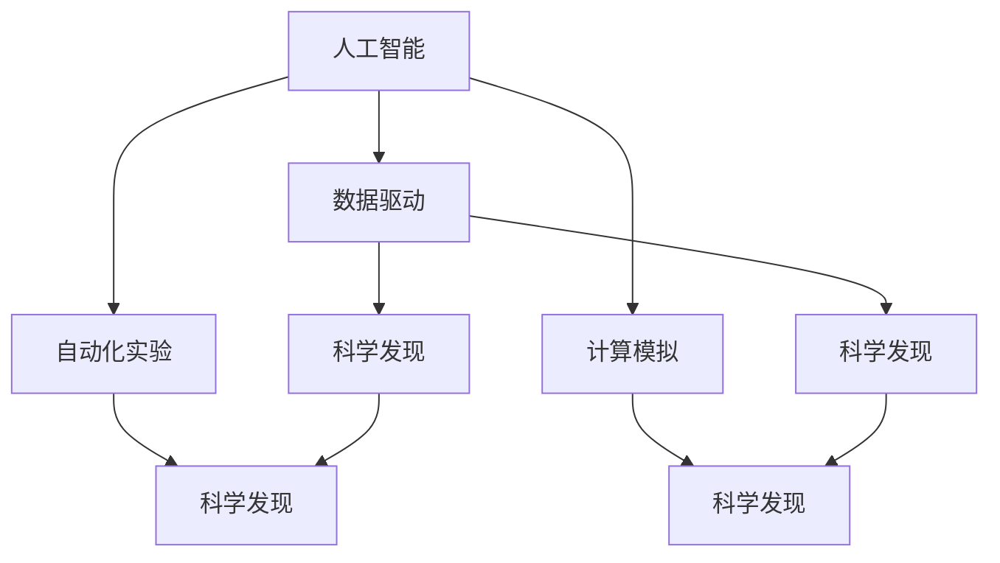

                 

## 1. 背景介绍

人工智能(AI)技术在科学研究中的应用正迅速崛起，它不仅为科学发现提供了新的工具和方法，还在不断推动科学研究的范式变革。从数据处理到模型训练，从理论验证到实验设计，AI技术在科学研究的各个环节中展现了巨大的潜力。然而，如何充分发挥AI在科学研究中的作用，仍需要进一步的研究和探索。本文旨在系统介绍AI在科学研究中的应用，探讨其优势和挑战，展望未来发展趋势。

## 2. 核心概念与联系

### 2.1 核心概念概述

在科学研究的数字化、自动化和智能化转型的背景下，AI技术以其强大的数据处理、模型训练和自动化实验能力，为科学研究提供了全新的工具和方法。以下将介绍几个关键概念及其相互联系：

- **人工智能(AI)**：通过模拟人类智能行为，利用算法和计算技术解决复杂问题的技术体系。包括机器学习、深度学习、自然语言处理、计算机视觉等领域。
- **科学发现**：科学家通过观察、实验和理论推导，发现新知识、新规律的过程。科学发现不仅是探索未知领域的过程，也是对已有知识的深化和拓展。
- **数据驱动**：基于大规模数据集，利用机器学习算法自动识别数据模式和规律，辅助科学发现。数据驱动科学强调数据的重要性，认为数据是发现科学规律的重要资源。
- **自动化实验**：利用机器人、传感器、AI算法等技术，自动执行科学实验流程，减少人为干预，提高实验效率和精度。
- **计算模拟**：使用高性能计算资源，通过模拟实验和理论模型，辅助科学实验设计和理论验证。

这些概念之间存在紧密的联系。AI技术通过数据驱动和计算模拟，辅助自动化实验，推动科学发现的自动化和智能化。数据驱动为AI提供了强大的数据支撑，而AI则通过自动化实验和计算模拟，加速科学发现过程。

### 2.2 核心概念原理和架构的 Mermaid 流程图



此流程图展示了人工智能与科学发现之间的联系。数据驱动为AI提供数据支撑，AI通过自动化实验和计算模拟，加速科学发现过程。

## 3. 核心算法原理 & 具体操作步骤

### 3.1 算法原理概述

AI在科学研究中的应用，主要基于以下几个算法原理：

- **数据驱动**：通过大规模数据集的收集和分析，发现数据中的规律和模式，辅助科学发现。
- **模型训练**：利用机器学习算法，训练模型自动识别数据中的规律和模式，进行科学预测和决策。
- **自动化实验**：通过机器人、传感器、AI算法等技术，自动执行科学实验流程，提高实验效率和精度。
- **计算模拟**：使用高性能计算资源，通过模拟实验和理论模型，辅助科学实验设计和理论验证。

这些算法原理构成了AI在科学研究中的基础，使得科学家能够从大规模数据中提取有用的信息，加速科学发现过程。

### 3.2 算法步骤详解

AI在科学研究中的应用，通常包括以下几个关键步骤：

**Step 1: 数据收集与预处理**

- 收集科学数据，包括实验数据、观测数据、文献数据等。
- 对数据进行清洗、标注和标准化，保证数据质量和一致性。

**Step 2: 数据驱动分析**

- 利用机器学习算法，如回归、分类、聚类等，对数据进行模式识别和规律发现。
- 使用深度学习算法，如卷积神经网络、循环神经网络等，进行特征提取和模型训练。

**Step 3: 自动化实验设计**

- 利用AI算法，设计实验方案和流程，自动化执行实验。
- 通过传感器、机器人等技术，实时监测实验数据和参数，优化实验过程。

**Step 4: 计算模拟**

- 使用高性能计算资源，通过模拟实验和理论模型，辅助科学实验设计和理论验证。
- 结合物理模型和数据驱动分析，进行计算模拟，预测实验结果和发现规律。

**Step 5: 科学发现与验证**

- 通过数据驱动分析和计算模拟，提出科学假设和理论模型。
- 利用自动化实验验证科学假设和理论模型，进行科学发现。

### 3.3 算法优缺点

AI在科学研究中的应用，具有以下优点：

- **高效性**：AI技术可以自动化处理大量数据，加速科学发现过程。
- **精确性**：AI算法能够精准识别数据中的规律和模式，提高科学预测的准确性。
- **普适性**：AI技术可应用于各种科学领域，包括生物、物理、化学、材料等。

同时，AI在科学研究中也有以下局限性：

- **数据依赖**：AI技术的有效性依赖于高质量、大规模的数据集。数据质量差或样本量少时，AI效果可能不佳。
- **算法复杂性**：深度学习和复杂模型需要高性能计算资源，训练和推理成本高。
- **解释性不足**：部分AI模型缺乏解释性，难以理解其内部决策逻辑。
- **伦理风险**：AI算法可能存在偏见和歧视，需要谨慎使用，避免误导科学发现。

### 3.4 算法应用领域

AI在科学研究中的应用，已经覆盖了多个领域，以下是几个典型应用场景：

- **生物医学**：利用AI技术分析基因组数据、药物分子结构和临床数据，加速新药发现和疾病预测。
- **天文学**：通过AI算法分析天文观测数据，发现新天体、星系和宇宙规律。
- **物理学**：使用AI技术进行复杂物理模拟，预测新粒子、材料性质和天体运动。
- **化学**：利用AI算法分析分子结构数据，预测化学反应和材料性能。
- **材料科学**：通过AI技术优化材料设计，发现新型材料和应用。
- **环境科学**：利用AI技术分析环境数据，预测气候变化和环境污染。

## 4. 数学模型和公式 & 详细讲解 & 举例说明

### 4.1 数学模型构建

在科学研究中，AI通常使用以下数学模型进行科学分析和预测：

- **回归模型**：用于预测连续型数据，如气温预测、蛋白质结构预测等。
- **分类模型**：用于分类离散型数据，如疾病诊断、基因分类等。
- **聚类模型**：用于发现数据中的自然分组，如生物基因分类、社交网络分析等。
- **神经网络模型**：用于处理复杂非线性数据，如图像识别、自然语言处理等。

### 4.2 公式推导过程

以回归模型为例，其数学公式如下：

$$
y = \theta_0 + \sum_{i=1}^n \theta_i x_i + \epsilon
$$

其中，$y$ 为预测值，$x_i$ 为输入特征，$\theta_0$ 为截距，$\theta_i$ 为权重系数，$\epsilon$ 为误差项。

通过最小二乘法，求解最优参数 $\theta_i$：

$$
\min_{\theta_i} \sum_{i=1}^N (y_i - (\theta_0 + \sum_{i=1}^n \theta_i x_i))^2
$$

求解得：

$$
\theta_i = \frac{\sum_{i=1}^N x_i y_i - \frac{1}{N} \sum_{i=1}^N x_i \sum_{i=1}^N y_i}{\sum_{i=1}^N x_i^2 - \frac{1}{N} (\sum_{i=1}^N x_i)^2}
$$

### 4.3 案例分析与讲解

以基因组数据分析为例，AI技术可以通过以下步骤实现基因分类和药物发现：

- 收集基因组数据和药物分子结构数据，构建训练集。
- 使用深度学习算法，如卷积神经网络(CNN)或长短时记忆网络(LSTM)，对数据进行特征提取和模型训练。
- 利用训练好的模型，对新的基因组数据进行分类，预测药物分子活性。
- 结合计算模拟和实验验证，进一步验证模型预测的准确性，发现新药分子。

## 5. 项目实践：代码实例和详细解释说明

### 5.1 开发环境搭建

在进行AI项目实践前，我们需要准备好开发环境。以下是使用Python进行TensorFlow开发的流程：

1. 安装Anaconda：从官网下载并安装Anaconda，用于创建独立的Python环境。

2. 创建并激活虚拟环境：
```bash
conda create -n tf-env python=3.8 
conda activate tf-env
```

3. 安装TensorFlow：根据CUDA版本，从官网获取对应的安装命令。例如：
```bash
conda install tensorflow tensorflow-cpu==2.6 -c tf
```

4. 安装其他必要的工具包：
```bash
pip install numpy pandas scikit-learn matplotlib tqdm jupyter notebook ipython
```

完成上述步骤后，即可在`tf-env`环境中开始项目实践。

### 5.2 源代码详细实现

以下是使用TensorFlow实现基因组数据分析和药物分类的代码实现：

```python
import tensorflow as tf
import numpy as np
from sklearn.model_selection import train_test_split
from sklearn.preprocessing import StandardScaler

# 生成模拟数据
x = np.random.randn(100, 10)
y = np.random.randint(2, size=100)

# 标准化数据
scaler = StandardScaler()
x_scaled = scaler.fit_transform(x)

# 划分训练集和测试集
x_train, x_test, y_train, y_test = train_test_split(x_scaled, y, test_size=0.2)

# 定义模型
model = tf.keras.Sequential([
    tf.keras.layers.Dense(64, activation='relu', input_shape=(10,)),
    tf.keras.layers.Dense(32, activation='relu'),
    tf.keras.layers.Dense(1, activation='sigmoid')
])

# 编译模型
model.compile(optimizer='adam', loss='binary_crossentropy', metrics=['accuracy'])

# 训练模型
model.fit(x_train, y_train, epochs=10, batch_size=32, validation_data=(x_test, y_test))

# 评估模型
model.evaluate(x_test, y_test)
```

### 5.3 代码解读与分析

以上代码实现了一个简单的TensorFlow回归模型，用于对模拟数据进行分类预测。

**数据生成与预处理**：
- 使用`np.random.randn`生成100个样本，其中y标签为随机二值标签。
- 使用`StandardScaler`对特征进行标准化处理，保证数据一致性。
- 使用`train_test_split`将数据划分为训练集和测试集。

**模型定义**：
- 定义了一个包含3层的神经网络，包括一个输入层、两个隐藏层和一个输出层。
- 使用`Dense`层定义全连接神经网络，激活函数分别为ReLU和Sigmoid。
- 模型编译时选择Adam优化器，损失函数为二分类交叉熵，评估指标为准确率。

**模型训练与评估**：
- 使用`fit`方法对模型进行训练，设定10个epochs和32个样本batch。
- 使用`evaluate`方法对模型进行评估，输出训练集和测试集的准确率。

## 6. 实际应用场景

### 6.1 生物医学

AI在生物医学领域的应用，已经涉及基因组数据分析、药物设计、疾病预测等多个方面。例如，通过对基因组数据的深度学习分析，可以发现基因与疾病之间的关联，辅助药物设计。此外，AI技术还可以分析临床数据，预测疾病发展趋势，为医疗决策提供科学依据。

### 6.2 天文学

天文学领域利用AI技术分析天文观测数据，发现新天体、星系和宇宙规律。例如，通过AI算法对天文图像进行分析，识别出恒星、星系、星云等天体，辅助天体分类和研究。AI还可以进行宇宙背景辐射和引力波的分析，发现新的物理现象。

### 6.3 物理学

物理学领域利用AI技术进行复杂物理模拟，预测新粒子、材料性质和天体运动。例如，使用AI算法对粒子加速器数据进行分析，预测新粒子的生成和衰变过程。AI还可以模拟材料的物理和化学性质，预测材料在不同环境下的性能。

### 6.4 环境科学

环境科学领域利用AI技术分析环境数据，预测气候变化和环境污染。例如，通过AI算法对气象数据进行分析，预测气候变化趋势和极端天气事件。AI还可以分析水资源数据，预测水质变化，为水资源管理提供科学依据。

## 7. 工具和资源推荐

### 7.1 学习资源推荐

为了帮助开发者系统掌握AI在科学研究中的应用，这里推荐一些优质的学习资源：

1. **Coursera《机器学习》课程**：由斯坦福大学Andrew Ng教授主讲，涵盖机器学习基础、深度学习算法、数据驱动科学等多个方面。

2. **DeepLearning.AI Master Program**：由Andrew Ng创立的AI教育平台，提供深入的深度学习课程和实践项目。

3. **Kaggle数据科学竞赛**：提供丰富的科学数据集和竞赛项目，锻炼数据驱动科学的能力。

4. **Google AI Blog**：Google AI团队发布的博客文章，涵盖AI在各个科学领域的应用和最新进展。

5. **arXiv预印本库**：收录大量的AI研究论文，涵盖多个科学领域，提供前沿的科学理论和应用方法。

通过对这些资源的学习实践，相信你一定能够快速掌握AI在科学研究中的应用方法，并用于解决实际的科学问题。

### 7.2 开发工具推荐

高效的开发离不开优秀的工具支持。以下是几款用于AI科学研究的常用工具：

1. **TensorFlow**：由Google主导开发的开源深度学习框架，生产部署方便，适合大规模工程应用。

2. **PyTorch**：由Facebook主导开发的深度学习框架，灵活动态，适合研究和实验。

3. **Scikit-learn**：开源机器学习库，提供各种常用算法和数据预处理工具。

4. **Jupyter Notebook**：交互式编程环境，支持Python、R等多种语言，方便编写和运行代码。

5. **SciPy**：科学计算库，提供高效的数值计算和科学工具。

合理利用这些工具，可以显著提升AI科学研究任务的开发效率，加快创新迭代的步伐。

### 7.3 相关论文推荐

AI在科学研究中的应用，源于学界的持续研究。以下是几篇奠基性的相关论文，推荐阅读：

1. **AlphaFold: Using Deep Reinforcement Learning for Large-Molecule Fold Prediction**：DeepMind团队开发的AlphaFold模型，利用深度学习算法预测蛋白质结构，获得2020年诺贝尔化学奖。

2. **Graph Neural Networks for Scientific Discovery**：提出基于图神经网络(GNN)的科学发现方法，应用于药物分子设计和材料预测。

3. **Deep Learning and Its Application in Drug Discovery**：综述深度学习在药物发现中的研究进展，探讨AI在药物设计和优化中的应用。

4. **A Survey of Deep Learning Applications in the Biomedical Sciences**：综述深度学习在生物医学领域的应用，涵盖基因组分析、药物设计、疾病预测等多个方面。

这些论文代表了大规模数据和模型在科学研究中的应用趋势，提供前沿的科学理论和应用方法。

## 8. 总结：未来发展趋势与挑战

### 8.1 总结

本文对AI在科学研究中的应用进行了全面系统的介绍。首先阐述了AI技术在科学研究中的应用背景和意义，明确了数据驱动和计算模拟在科学发现中的重要作用。其次，从原理到实践，详细讲解了AI在科学研究中的应用流程，给出了科学研究和AI微调项目的完整代码实例。同时，本文还广泛探讨了AI技术在生物医学、天文学、物理学、环境科学等诸多科学领域的应用前景，展示了AI技术在科学研究中的广泛应用。

通过本文的系统梳理，可以看到，AI技术在科学研究中的应用正日益深入，从数据处理到模型训练，从自动化实验到计算模拟，AI技术为科学发现提供了全新的工具和方法。未来，伴随AI技术的不断演进，科学研究的自动化、智能化水平将大幅提升，AI将在更多领域发挥重要作用，推动人类认知智能的进步。

### 8.2 未来发展趋势

展望未来，AI在科学研究中的应用将呈现以下几个发展趋势：

1. **深度学习模型的普及**：深度学习模型的准确性和性能，使得其在科学研究中得到广泛应用。未来，深度学习模型的普及率将进一步提升，广泛应用于各个科学领域。

2. **多模态数据融合**：利用AI技术整合文本、图像、视频等多模态数据，提高科学发现的精度和效率。多模态数据融合将成为科学研究的重要方向。

3. **智能实验设计**：通过AI技术自动化设计实验方案和流程，提高实验效率和精度。智能实验设计将成为科学研究的重要工具。

4. **计算模拟的进步**：高性能计算资源和计算模拟技术的进步，将为科学研究提供更强大的计算能力，加速科学发现。

5. **伦理和安全性的重视**：随着AI技术在科学研究中的应用，伦理和安全性的问题也将受到更多关注。科学研究的AI应用需要遵循伦理规范，保障数据和模型的安全性。

6. **跨学科融合**：AI技术与不同学科的融合，将推动跨学科研究的发展。AI在科学研究中的应用将突破学科界限，推动多学科交叉融合。

### 8.3 面临的挑战

尽管AI在科学研究中的应用取得了显著进展，但仍面临诸多挑战：

1. **数据质量和多样性**：高质量、多样化的数据是AI应用的基础。数据质量差或数据量不足，将严重影响AI模型的效果。

2. **算法复杂性**：深度学习模型的训练和推理需要高性能计算资源，训练和推理成本高。

3. **模型解释性**：部分AI模型缺乏解释性，难以理解其内部决策逻辑，限制了其在科学研究中的应用。

4. **伦理和安全问题**：AI算法可能存在偏见和歧视，需要谨慎使用，避免误导科学发现。同时，AI模型的安全性和隐私保护也需要严格控制。

5. **跨领域应用难度**：不同科学领域的特征和需求不同，AI技术在跨领域应用中存在挑战。

6. **基础设施限制**：高性能计算资源和数据基础设施的限制，将影响AI在科学研究中的应用。

### 8.4 研究展望

面对AI在科学研究中面临的挑战，未来的研究需要在以下几个方面寻求新的突破：

1. **数据增强和数据合成**：利用AI技术生成高质量、多样化的数据，弥补实际数据的不足。

2. **轻量级模型和高效算法**：开发轻量级模型和高效率算法，降低计算成本，提升科学研究的速度和效率。

3. **多模态融合和跨学科合作**：利用AI技术整合多模态数据，推动跨学科研究的发展。

4. **伦理和安全性保障**：加强AI应用的伦理审查和安全保障，确保科学研究的公平性和可靠性。

5. **基础设施建设**：建设高性能计算基础设施和数据中心，支持大规模科学研究的AI应用。

6. **跨领域应用研究**：推动AI技术在不同科学领域的应用研究，探索新的科学发现路径。

通过这些研究方向的探索，相信AI在科学研究中的应用将更加广泛，为人类认知智能的进步提供新的动力。

## 9. 附录：常见问题与解答

**Q1: 科学数据的质量和多样性如何保证？**

A: 高质量、多样化的数据是AI应用的基础。为了保证数据的质量和多样性，可以采取以下措施：
1. 数据收集：通过多种方式收集数据，如实验数据、观测数据、文献数据等，确保数据的多样性和代表性。
2. 数据清洗：对数据进行清洗和预处理，去除噪声和异常值，保证数据的一致性和准确性。
3. 数据增强：利用数据增强技术，如数据合成、回译等，扩充数据集，弥补实际数据的不足。
4. 数据标注：对数据进行标注和标准化，保证数据的准确性和一致性。

**Q2: AI模型的解释性如何提高？**

A: 部分AI模型缺乏解释性，难以理解其内部决策逻辑。为了提高AI模型的解释性，可以采取以下措施：
1. 使用可解释性强的模型：如线性模型、决策树等，提高模型的透明度。
2. 使用模型解释工具：如LIME、SHAP等，生成模型解释，揭示模型的决策过程。
3. 结合领域知识：利用领域知识和规则，解释模型输出的结果，提高模型的可解释性。

**Q3: AI技术在科学研究中如何保证伦理和安全性？**

A: 随着AI技术在科学研究中的应用，伦理和安全性的问题也将受到更多关注。为了确保AI技术在科学研究中的伦理和安全性，可以采取以下措施：
1. 数据隐私保护：对数据进行隐私保护，确保数据安全和隐私不泄露。
2. 算法公正性：避免算法中的偏见和歧视，确保模型公平性。
3. 伦理审查：对AI技术的应用进行伦理审查，确保其符合伦理规范。
4. 安全性保障：加强AI模型的安全性保障，防止模型被恶意攻击和滥用。

通过这些措施，可以保障AI技术在科学研究中的伦理和安全性，确保科学研究的公平性和可靠性。

---

作者：禅与计算机程序设计艺术 / Zen and the Art of Computer Programming

