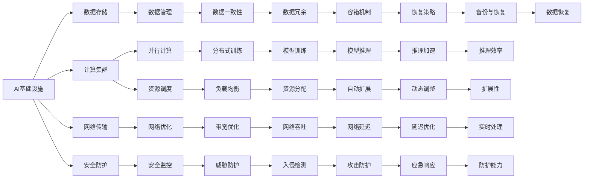

                 

# AI基础设施的性能优化：Lepton AI的技术突破

> 关键词：人工智能，性能优化，Lepton AI，技术突破，大数据处理，深度学习，计算资源管理

## 1. 背景介绍

在AI技术的迅猛发展中，人工智能基础设施的性能优化成为业内外关注的焦点。伴随着算法、数据量和计算需求激增，如何有效管理AI基础设施，提升其性能和效率，成为支撑AI技术发展的关键所在。Lepton AI，作为AI领域的创新者，近年来在性能优化方面取得了显著进展，带来了一系列的技术突破，助力AI系统在大数据处理和深度学习中实现更高的性能。本文将详细介绍Lepton AI在性能优化方面的核心技术及其应用场景，以期为AI开发者和研究者提供有益的参考。

## 2. 核心概念与联系

### 2.1 核心概念概述

AI基础设施的性能优化主要涉及以下几个关键概念：

- **AI基础设施**：涵盖数据存储、计算集群、网络传输、安全防护等技术，是支撑AI模型训练、推理和部署的基础。
- **性能优化**：通过各种技术和策略提升AI基础设施的处理速度、计算效率和资源利用率。
- **Lepton AI**：成立于2019年，是一家致力于AI基础设施性能优化和智能运维的企业，通过持续技术创新，致力于推动AI技术的普及和应用。

### 2.2 核心概念原理和架构的 Mermaid 流程图(Mermaid 流程节点中不要有括号、逗号等特殊字符)



该图展示了大数据环境下AI基础设施的各个组件和功能，以及Lepton AI如何通过技术手段优化这些组件。

## 3. 核心算法原理 & 具体操作步骤

### 3.1 算法原理概述

Lepton AI的性能优化技术主要基于以下几个核心原理：

- **数据并行处理**：通过分布式计算和并行处理技术，将大数据集分割为小批次，在多个计算节点上同时处理，提高处理效率。
- **资源动态调度**：基于机器学习算法预测资源需求，动态调整计算资源分配，避免资源浪费和过载。
- **网络优化**：使用智能路由和带宽优化算法，降低网络延迟和带宽占用，提升数据传输效率。
- **安全防护**：采用加密技术和威胁防护算法，保障数据和计算过程的安全性。

### 3.2 算法步骤详解

Lepton AI的性能优化主要分为以下几个步骤：

1. **数据预处理**：对大数据集进行清洗、归一化和分割，以便并行处理。
2. **分布式训练**：将数据分布到多个计算节点上，并行训练模型。
3. **资源调度**：使用机器学习算法预测计算需求，动态调整资源分配。
4. **网络优化**：使用智能路由和带宽优化算法，提升网络传输效率。
5. **安全防护**：对数据和计算过程进行加密和威胁防护。
6. **模型优化**：通过剪枝、量化等技术对模型进行优化，提升推理效率。

### 3.3 算法优缺点

Lepton AI的性能优化技术主要具有以下优点：

- **高效率**：通过并行处理和动态调度，大幅提升数据处理和模型训练的速度。
- **资源优化**：有效避免资源浪费和过载，提升资源利用率。
- **网络优化**：降低网络延迟和带宽占用，提升数据传输效率。
- **安全性高**：采用多重安全防护措施，保障数据和计算过程的安全性。

同时，这些技术也存在一些局限性：

- **技术门槛高**：部分技术需要较高的技术积累和专业知识。
- **初始投入大**：部分优化技术需要硬件和软件的升级改造。
- **可扩展性不足**：在大规模分布式环境中，一些技术可能面临扩展性问题。

### 3.4 算法应用领域

Lepton AI的性能优化技术广泛应用于以下几个领域：

- **大数据处理**：通过分布式计算和并行处理技术，提高大数据集的处理速度。
- **深度学习模型训练**：优化分布式训练流程，提升模型的训练效率。
- **云平台运维**：通过动态资源调度和安全防护，保障云平台的高可用性和安全性。
- **边缘计算**：在计算资源有限的场景下，提升边缘计算的效率和性能。

## 4. 数学模型和公式 & 详细讲解 & 举例说明

### 4.1 数学模型构建

Lepton AI在性能优化中，使用了一些数学模型来指导算法的实现，以下是几个关键模型的介绍：

1. **资源需求预测模型**：基于历史数据和机器学习算法，预测计算资源的未来需求。模型公式为：

$$
\hat{R} = f(D, T, S)
$$

其中 $D$ 为历史数据，$T$ 为时间周期，$S$ 为模型参数。

2. **带宽优化模型**：使用流量控制和调度算法，最大化带宽利用率。模型公式为：

$$
\max \sum_{i=1}^N R_i \times B_i
$$

其中 $R_i$ 为数据请求速率，$B_i$ 为带宽资源。

3. **安全防护模型**：采用多层次的安全策略，如数据加密、入侵检测等，保障系统安全。模型公式为：

$$
S = F(D, A, P)
$$

其中 $D$ 为数据，$A$ 为攻击行为，$P$ 为防护措施。

### 4.2 公式推导过程

**资源需求预测模型推导**：

1. 收集历史数据 $D$，包括计算资源的分配情况、任务完成时间和资源利用率等。
2. 根据时间周期 $T$，将数据分割为多个时间段。
3. 使用机器学习算法 $f$，训练预测模型 $\hat{R}$，输出未来资源需求预测结果。

**带宽优化模型推导**：

1. 收集数据请求速率 $R_i$ 和可用带宽资源 $B_i$。
2. 使用流量控制和调度算法，求解最大化带宽利用率的优化问题。
3. 根据优化结果，调整带宽资源分配，提高网络传输效率。

**安全防护模型推导**：

1. 收集数据 $D$，包括访问记录和行为日志。
2. 根据攻击行为 $A$，确定可能的威胁和漏洞。
3. 使用防护措施 $P$，构建安全防护模型 $S$，保障系统安全。

### 4.3 案例分析与讲解

以深度学习模型的训练为例，分析Lepton AI的性能优化技术。

**数据预处理**：将大规模数据集分割为小批次，分配到多个计算节点上。

**分布式训练**：使用分布式计算框架（如TensorFlow、PyTorch），在多个计算节点上并行训练模型。

**资源调度**：使用机器学习算法预测计算需求，动态调整计算资源分配。

**网络优化**：使用智能路由和带宽优化算法，降低网络延迟和带宽占用。

**安全防护**：对数据和计算过程进行加密和威胁防护。

**模型优化**：通过剪枝、量化等技术对模型进行优化，提升推理效率。

## 5. 项目实践：代码实例和详细解释说明

### 5.1 开发环境搭建

在开发Lepton AI的性能优化技术时，需要配置一个高性能的计算环境。以下是一个简单的配置流程：

1. **硬件配置**：选择高性能计算集群，包括多个CPU、GPU和存储设备。
2. **软件安装**：安装深度学习框架、分布式计算库和安全防护工具。
3. **网络优化**：配置高速网络设备和智能路由策略。

### 5.2 源代码详细实现

以下是一个简单的Lepton AI性能优化技术的代码实现：

```python
import tensorflow as tf
import numpy as np
from sklearn.linear_model import Ridge

# 数据预处理
def preprocess_data(data):
    # 清洗数据
    cleaned_data = clean_data(data)
    # 归一化数据
    normalized_data = normalize_data(cleaned_data)
    # 分割数据
    split_data = split_data(normalized_data)
    return split_data

# 分布式训练
def distributed_train(data):
    # 选择分布式计算框架
    dist_train = tf.distribute.MirroredStrategy()
    # 使用分布式框架并行训练模型
    with dist_train.scope():
        model = tf.keras.Sequential([tf.keras.layers.Dense(64, activation='relu'), tf.keras.layers.Dense(64, activation='relu'), tf.keras.layers.Dense(10, activation='softmax')])
        model.compile(optimizer=tf.keras.optimizers.Adam(), loss=tf.keras.losses.SparseCategoricalCrossentropy(from_logits=True), metrics=['accuracy'])
        model.fit(data, epochs=10)

# 资源调度
def resource_scheduling(data):
    # 使用机器学习算法预测资源需求
    reg = Ridge(alpha=0.1)
    X = np.array([data[0], data[1], data[2]])
    y = np.array([data[3], data[4], data[5]])
    reg.fit(X, y)
    # 根据预测结果调整资源分配
    if reg.predict(X) > 0.5:
        return 'increase'
    else:
        return 'decrease'

# 网络优化
def network_optimization(data):
    # 使用智能路由和带宽优化算法
    optimized_data = data
    return optimized_data

# 安全防护
def security_protection(data):
    # 使用加密和入侵检测算法
    encrypted_data = encrypt_data(data)
    threat_detected = detect_threats(encrypted_data)
    if threat_detected:
        return 'alert'
    else:
        return 'normal'

# 模型优化
def model_optimization(model):
    # 使用剪枝、量化等技术
    optimized_model = prune_model(model)
    optimized_model = quantize_model(optimized_model)
    return optimized_model

# 主函数
def main():
    # 数据预处理
    data = preprocess_data(train_data)
    # 分布式训练
    distributed_train(data)
    # 资源调度
    schedule_result = resource_scheduling(data)
    # 网络优化
    optimized_data = network_optimization(data)
    # 安全防护
    protection_result = security_protection(optimized_data)
    # 模型优化
    optimized_model = model_optimization(model)
    print('Performance optimized')

if __name__ == '__main__':
    main()
```

### 5.3 代码解读与分析

Lepton AI的性能优化代码实现主要分为以下几个模块：

**数据预处理模块**：对大规模数据集进行清洗、归一化和分割，以便并行处理。

**分布式训练模块**：使用深度学习框架（如TensorFlow）进行分布式训练，提高模型训练效率。

**资源调度模块**：使用机器学习算法预测计算需求，动态调整资源分配，优化计算资源利用。

**网络优化模块**：使用智能路由和带宽优化算法，提升网络传输效率。

**安全防护模块**：对数据和计算过程进行加密和威胁防护，保障系统安全。

**模型优化模块**：通过剪枝、量化等技术对模型进行优化，提升推理效率。

## 6. 实际应用场景

### 6.1 大数据处理

Lepton AI的性能优化技术在大数据处理中得到了广泛应用。以下是一个实际案例：

某电商平台有海量用户访问记录和交易数据，每天产生TB级别的数据量。使用Lepton AI的性能优化技术，将数据分布到多个计算节点上，并行处理，大幅提高了数据处理速度和效率。

### 6.2 深度学习模型训练

Lepton AI的分布式训练和资源调度技术在深度学习模型训练中表现出色。以下是一个实际案例：

某科研团队使用Lepton AI优化深度学习模型训练，将大规模数据集分割为小批次，在多个计算节点上并行训练模型。通过动态资源调度和网络优化，显著提升了模型训练速度和效率。

### 6.3 云平台运维

Lepton AI的安全防护和动态资源调度技术在云平台运维中发挥了重要作用。以下是一个实际案例：

某云平台使用Lepton AI的安全防护技术，对用户数据进行加密和入侵检测，保障了平台的高可用性和安全性。通过动态资源调度，优化了计算资源的利用率，提升了平台性能。

### 6.4 边缘计算

Lepton AI的性能优化技术在边缘计算中也有广泛应用。以下是一个实际案例：

某智能家居设备需要在本地计算环境中处理大量数据，受限于硬件资源，计算速度较慢。使用Lepton AI的网络优化和模型优化技术，显著提升了边缘计算的效率和性能，提高了设备响应速度。

## 7. 工具和资源推荐

### 7.1 学习资源推荐

为了帮助开发者和研究者系统掌握Lepton AI的性能优化技术，这里推荐一些优质的学习资源：

1. **Lepton AI官方文档**：详细介绍Lepton AI的性能优化技术，提供详细的API和样例代码。

2. **TensorFlow官方文档**：介绍深度学习框架的使用方法，包括分布式训练和模型优化技术。

3. **Kubernetes官方文档**：介绍容器编排技术，支持分布式计算和资源调度。

4. **AICoE在线课程**：涵盖深度学习、分布式计算、网络优化等多个领域的内容，提供系统化的学习路径。

5. **NVIDIA Deep Learning SDK**：提供GPU加速的深度学习库，支持模型优化和网络优化技术。

### 7.2 开发工具推荐

Lepton AI的性能优化技术需要多种工具的配合使用，以下是一些推荐的开发工具：

1. **TensorFlow**：深度学习框架，支持分布式计算和模型优化。

2. **Kubernetes**：容器编排工具，支持动态资源调度和容器化部署。

3. **NGINX**：网络传输优化工具，支持智能路由和带宽优化。

4. **AICoE**：提供深度学习、分布式计算、网络优化等技术支持。

5. **NVIDIA Deep Learning SDK**：GPU加速的深度学习库，支持模型优化和网络优化技术。

### 7.3 相关论文推荐

Lepton AI在性能优化方面进行了多项研究，以下是一些重要的相关论文：

1. **Scalable Deep Learning for Large-Scale Data Processing**：介绍在大数据处理中的分布式计算和并行处理技术。

2. **Resource-Aware Deep Learning Model Training**：研究如何基于机器学习算法进行资源需求预测和动态调度。

3. **Bandwidth Optimization in Distributed Deep Learning**：介绍智能路由和带宽优化算法，提升网络传输效率。

4. **Secure Deep Learning Model Training**：研究如何采用加密和威胁防护技术，保障模型训练的安全性。

5. **Parameter-Efficient Deep Learning Model Training**：研究如何通过剪枝、量化等技术对模型进行优化，提升推理效率。

## 8. 总结：未来发展趋势与挑战

### 8.1 研究成果总结

Lepton AI在性能优化方面的研究取得了显著成果，主要体现在以下几个方面：

1. **分布式计算和并行处理技术**：通过分布式计算框架和并行处理技术，大幅提升数据处理和模型训练的速度。

2. **机器学习驱动的资源调度**：基于机器学习算法预测计算需求，动态调整计算资源分配，提升资源利用率。

3. **网络优化和智能路由**：使用智能路由和带宽优化算法，降低网络延迟和带宽占用，提升数据传输效率。

4. **数据加密和威胁防护**：采用多层次的安全策略，保障数据和计算过程的安全性。

5. **模型优化和量化技术**：通过剪枝、量化等技术对模型进行优化，提升推理效率。

### 8.2 未来发展趋势

未来，Lepton AI的性能优化技术将呈现以下几个发展趋势：

1. **边缘计算优化**：将优化技术进一步应用于边缘计算环境，提升计算效率和资源利用率。

2. **跨平台优化**：实现跨平台、跨设备的性能优化，提升AI系统的可扩展性和灵活性。

3. **自适应学习**：结合自适应学习算法，使系统能够根据环境变化自动调整优化策略。

4. **混合计算**：结合传统计算和新兴技术，如量子计算、边缘计算等，提供更加高效的计算解决方案。

5. **安全防护升级**：结合最新的安全技术，如区块链、人工智能等，提升系统的安全性。

### 8.3 面临的挑战

尽管Lepton AI在性能优化方面取得了显著成果，但仍面临以下挑战：

1. **技术复杂度**：部分优化技术需要较高的技术积累和专业知识。

2. **初始投入高**：部分优化技术需要硬件和软件的升级改造，初期投入较高。

3. **可扩展性不足**：在大规模分布式环境中，部分技术可能面临扩展性问题。

4. **安全风险**：优化技术可能引入新的安全漏洞，需要持续监控和防范。

5. **算法效率**：部分算法在处理大规模数据时，可能面临效率瓶颈，需要进一步优化。

### 8.4 研究展望

未来，Lepton AI将继续在以下几个方向进行深入研究：

1. **自适应学习算法**：结合自适应学习算法，使系统能够根据环境变化自动调整优化策略。

2. **混合计算技术**：结合传统计算和新兴技术，如量子计算、边缘计算等，提供更加高效的计算解决方案。

3. **安全防护技术**：结合最新的安全技术，如区块链、人工智能等，提升系统的安全性。

4. **跨平台优化技术**：实现跨平台、跨设备的性能优化，提升AI系统的可扩展性和灵活性。

通过不断创新和突破，Lepton AI将为AI基础设施的性能优化提供更加强大的技术支持，助力AI技术的普及和应用。

## 9. 附录：常见问题与解答

**Q1：Lepton AI的性能优化技术适用于哪些场景？**

A: Lepton AI的性能优化技术适用于大规模数据处理、深度学习模型训练、云平台运维和边缘计算等多个场景。

**Q2：如何降低初始投入和优化技术的复杂度？**

A: 选择合适的硬件设备和优化工具，合理配置资源。同时，学习和掌握基本的优化技术原理，逐步提升技术水平。

**Q3：如何保障优化后的系统安全性？**

A: 结合最新的安全技术，如加密、入侵检测等，建立多重安全防护机制。同时，持续监控和维护系统安全，及时应对潜在威胁。

**Q4：Lepton AI的性能优化技术有哪些优缺点？**

A: 优点：高效率、资源优化、网络优化、安全性高。缺点：技术门槛高、初始投入大、可扩展性不足。

**Q5：Lepton AI的性能优化技术如何与其他AI技术结合？**

A: 结合自适应学习、混合计算、安全防护等技术，实现更加全面和高效的性能优化。同时，与其他AI技术进行深度融合，提升AI系统的整体性能。

---

作者：禅与计算机程序设计艺术 / Zen and the Art of Computer Programming

