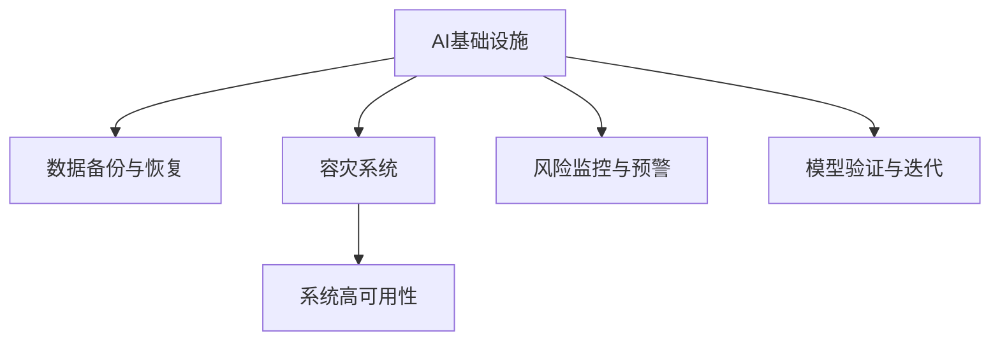

                 

# AI基础设施的灾备方案：Lepton AI的风险管理

> 关键词：AI基础设施, 灾备方案, Lepton AI, 风险管理, 容灾系统, 数据备份, 云服务, 高可用性

## 1. 背景介绍

### 1.1 问题由来

随着人工智能(AI)技术的迅猛发展，企业对于AI基础设施的需求日益增加，AI系统已经成为企业业务运行和决策支持的核心。然而，AI系统的复杂性和依赖性也使得其面临诸多风险，如数据泄露、模型偏见、系统故障等。特别是在高风险的金融、医疗、智能交通等领域，AI系统的稳定运行直接关系到企业核心业务的连续性和安全性。因此，构建一套完备的AI灾备方案，对于保障AI系统的可靠性、高效性和安全性至关重要。

### 1.2 问题核心关键点

AI灾备方案的核心在于：
- 数据备份与恢复：确保AI模型和数据在系统故障或灾难发生后能够迅速恢复，减少数据丢失和业务中断的风险。
- 系统冗余与高可用性：通过构建容灾系统，保障AI基础设施在面对各种突发事件时依然能够稳定运行。
- 风险监控与预警：实时监控AI系统运行状态，及时发现和应对潜在风险，提升系统鲁棒性。
- 模型验证与迭代：通过定期验证和迭代，确保AI模型的正确性和时效性，避免模型退化。

### 1.3 问题研究意义

构建AI灾备方案，不仅可以提升AI系统的可靠性和安全性，还能够在应对突发事件时保障业务的连续性，从而降低企业损失，提升市场竞争力。具体而言：

1. **业务连续性保障**：灾备方案确保AI系统在面对自然灾害、网络攻击、设备故障等突发事件时，依然能够稳定运行，保障业务的连续性。
2. **数据安全与隐私保护**：数据备份与恢复机制可以确保关键数据在系统故障或灾难中不丢失，同时通过加密存储和访问控制等措施，保障数据的安全和隐私。
3. **风险预警与应急响应**：实时监控AI系统运行状态，及时发现和应对风险，避免灾难性故障的发生，减少企业损失。
4. **模型性能优化**：通过周期性验证和迭代，确保AI模型的性能和正确性，避免模型过时或退化，保持系统的时效性。

## 2. 核心概念与联系

### 2.1 核心概念概述

为更好地理解AI灾备方案的构建与实施，本节将介绍几个关键概念：

- **AI基础设施**：包括计算资源、存储设备、网络设施、AI模型等软硬件设施，是AI系统正常运行的基础。
- **数据备份与恢复**：在数据存储和传输过程中，通过定期备份数据，确保在系统故障或灾难发生时，能够迅速恢复数据。
- **容灾系统**：通过构建冗余基础设施，确保系统在面对各种突发事件时，依然能够正常运行。
- **系统高可用性**：通过设计可靠的系统架构和故障恢复机制，提升系统的连续运行能力。
- **风险监控与预警**：实时监控系统运行状态，及时发现和预警潜在风险，提升系统的鲁棒性。
- **模型验证与迭代**：通过周期性验证和更新模型，确保模型的正确性和时效性。

这些核心概念之间的逻辑关系可以通过以下Mermaid流程图来展示：



这个流程图展示了AI灾备方案的主要组成部分及其相互关系：

1. **AI基础设施**：是灾备方案的基础，提供了AI模型的运行环境和数据存储设施。
2. **数据备份与恢复**：确保数据在系统故障或灾难中不丢失，并提供快速恢复机制。
3. **容灾系统**：构建冗余基础设施，确保系统的连续运行能力。
4. **系统高可用性**：设计可靠的系统架构，提升系统的连续性。
5. **风险监控与预警**：实时监控系统运行状态，及时发现和应对潜在风险。
6. **模型验证与迭代**：通过周期性验证和更新，确保模型的正确性和时效性。

这些概念共同构成了AI灾备方案的核心，确保AI系统的可靠性和安全性。

## 3. 核心算法原理 & 具体操作步骤
### 3.1 算法原理概述

AI灾备方案的构建，本质上是通过数据备份与恢复、容灾系统设计、系统高可用性保障、风险监控与预警、模型验证与迭代等关键环节，构建一个完整的系统冗余和风险管理框架。

具体而言，AI灾备方案的实施包括以下几个关键步骤：

1. **数据备份与恢复**：定期备份AI模型和关键数据，确保在系统故障或灾难发生时，能够迅速恢复数据。
2. **容灾系统设计**：构建冗余基础设施，包括多数据中心、数据同步机制等，确保系统的连续运行。
3. **系统高可用性保障**：设计可靠的系统架构，包括自动故障检测、自动切换、故障恢复机制等，提升系统的连续性。
4. **风险监控与预警**：实时监控系统运行状态，使用机器学习算法等技术，及时发现和预警潜在风险。
5. **模型验证与迭代**：定期验证和更新AI模型，确保模型的正确性和时效性。

### 3.2 算法步骤详解

以下是AI灾备方案的具体实施步骤：

**Step 1: 数据备份与恢复**

- **备份策略**：制定数据备份策略，定期备份AI模型和关键数据。可以使用增量备份、完全备份、差异备份等策略。
- **备份存储**：选择合适的备份存储设备，如本地磁盘、云存储、分布式文件系统等，确保数据备份的可靠性和可恢复性。
- **数据加密**：对备份数据进行加密存储，确保数据在传输和存储过程中不被非法访问。

**Step 2: 容灾系统设计**

- **多数据中心**：构建多数据中心基础设施，确保数据和计算资源在不同数据中心之间进行同步和冗余存储。
- **数据同步机制**：设计数据同步机制，确保数据在不同数据中心之间保持一致性。
- **网络冗余**：构建冗余网络设施，确保网络通信的可靠性。

**Step 3: 系统高可用性保障**

- **自动故障检测**：设计自动故障检测机制，及时发现系统故障。
- **自动切换与恢复**：设计自动切换和故障恢复机制，在系统故障时自动切换到备用系统。
- **负载均衡**：设计负载均衡机制，确保系统负载均衡，提升系统的稳定性和可用性。

**Step 4: 风险监控与预警**

- **实时监控**：实时监控AI系统运行状态，包括计算资源使用率、网络带宽、系统负载等。
- **风险预警**：使用机器学习算法等技术，及时发现和预警潜在风险，如异常数据、模型性能下降等。
- **应急响应**：设计应急响应机制，在系统故障或异常时，及时采取措施进行修复和恢复。

**Step 5: 模型验证与迭代**

- **验证策略**：制定模型验证策略，定期验证AI模型的性能和正确性。
- **验证数据**：选择验证数据集，确保验证数据的覆盖性和代表性。
- **模型更新**：根据验证结果，更新AI模型，确保模型始终保持正确性和时效性。

### 3.3 算法优缺点

AI灾备方案的实施，具有以下优点：

- **保障业务连续性**：通过数据备份与恢复、容灾系统设计、系统高可用性保障等措施，确保AI系统在各种突发事件中依然能够稳定运行，保障业务的连续性。
- **提升系统鲁棒性**：通过风险监控与预警、模型验证与迭代等措施，提升系统的鲁棒性和抗干扰能力，避免灾难性故障的发生。
- **保障数据安全**：通过数据备份与恢复和数据加密等措施，确保关键数据在系统故障或灾难中不丢失，同时保障数据的安全和隐私。

但同时，AI灾备方案也存在一定的局限性：

- **资源投入高**：构建容灾系统和数据备份需要大量的硬件资源和存储空间，增加了企业的成本投入。
- **维护复杂**：系统高可用性和冗余设计增加了系统的复杂性，需要专业人员进行维护和监控。
- **数据同步难度大**：多数据中心之间的数据同步和一致性维护，需要先进的技术和工具支持。
- **模型更新成本高**：模型验证与迭代需要定期进行，增加了模型的更新成本和时间成本。

尽管存在这些局限性，但AI灾备方案仍是保障AI系统可靠性和安全性的重要手段。

### 3.4 算法应用领域

AI灾备方案的应用领域非常广泛，包括但不限于：

- **金融**：金融系统的稳定运行直接关系到资金安全和交易流畅，AI灾备方案可以保障金融系统的连续性和鲁棒性。
- **医疗**：医疗AI系统的稳定运行关系到病患的生命安全和诊断准确性，灾备方案可以保障医疗系统的可靠性和安全性。
- **智能交通**：智能交通系统的稳定运行关系到交通安全和交通效率，灾备方案可以保障智能交通系统的连续性和安全性。
- **智能制造**：智能制造系统的稳定运行关系到生产效率和产品质量，灾备方案可以保障智能制造系统的可靠性和鲁棒性。
- **智能家居**：智能家居系统的稳定运行关系到用户的生活安全和舒适度，灾备方案可以保障智能家居系统的连续性和安全性。

## 4. 数学模型和公式 & 详细讲解 & 举例说明
### 4.1 数学模型构建

AI灾备方案的构建，涉及多个子系统的协同工作，需要构建数学模型来描述各个子系统的行为和交互关系。以下是几个核心子系统的数学模型构建：

**数据备份与恢复模型**：

- **备份策略**：备份策略可以表示为 $B=\{b_1, b_2, ..., b_n\}$，其中 $b_i$ 表示第 $i$ 次备份的数据量和备份频率。
- **数据同步**：数据同步可以表示为 $S=\{s_1, s_2, ..., s_m\}$，其中 $s_i$ 表示第 $i$ 个数据中心的数据同步状态。
- **数据恢复**：数据恢复可以表示为 $R=\{r_1, r_2, ..., r_n\}$，其中 $r_i$ 表示第 $i$ 次备份的恢复时间和恢复成功率。

**容灾系统设计模型**：

- **冗余数据中心**：冗余数据中心可以表示为 $C=\{c_1, c_2, ..., c_k\}$，其中 $c_i$ 表示第 $i$ 个数据中心的位置和可用性。
- **数据同步机制**：数据同步机制可以表示为 $D=\{d_1, d_2, ..., d_m\}$，其中 $d_i$ 表示数据同步的频率和数据一致性。
- **网络冗余**：网络冗余可以表示为 $N=\{n_1, n_2, ..., n_l\}$，其中 $n_i$ 表示网络通信的冗余度。

**系统高可用性保障模型**：

- **自动故障检测**：自动故障检测可以表示为 $F=\{f_1, f_2, ..., f_k\}$，其中 $f_i$ 表示第 $i$ 个系统的故障检测频率和检测成功率。
- **自动切换与恢复**：自动切换与恢复可以表示为 $S=\{s_1, s_2, ..., s_k\}$，其中 $s_i$ 表示第 $i$ 个系统的自动切换和恢复机制。
- **负载均衡**：负载均衡可以表示为 $L=\{l_1, l_2, ..., l_m\}$，其中 $l_i$ 表示系统的负载均衡策略和均衡效果。

**风险监控与预警模型**：

- **实时监控**：实时监控可以表示为 $M=\{m_1, m_2, ..., m_n\}$，其中 $m_i$ 表示第 $i$ 个系统的监控指标和监控频率。
- **风险预警**：风险预警可以表示为 $W=\{w_1, w_2, ..., w_k\}$，其中 $w_i$ 表示第 $i$ 个风险预警的触发条件和预警频率。
- **应急响应**：应急响应可以表示为 $A=\{a_1, a_2, ..., a_k\}$，其中 $a_i$ 表示第 $i$ 个应急响应的措施和响应时间。

**模型验证与迭代模型**：

- **验证策略**：验证策略可以表示为 $V=\{v_1, v_2, ..., v_k\}$，其中 $v_i$ 表示第 $i$ 个模型的验证频率和验证指标。
- **验证数据**：验证数据可以表示为 $D=\{d_1, d_2, ..., d_k\}$，其中 $d_i$ 表示第 $i$ 个验证数据集的覆盖范围和样本量。
- **模型更新**：模型更新可以表示为 $U=\{u_1, u_2, ..., u_k\}$，其中 $u_i$ 表示第 $i$ 个模型的更新频率和更新效果。

### 4.2 公式推导过程

以下是几个核心模型的公式推导过程：

**数据备份与恢复模型**：

- **备份策略**：$B=\{b_1, b_2, ..., b_n\}$，其中 $b_i=\{t_i, f_i\}$，$t_i$ 表示第 $i$ 次备份的时间间隔，$f_i$ 表示备份频率。
- **数据同步**：$S=\{s_1, s_2, ..., s_m\}$，其中 $s_i=\{t_i, c_i\}$，$t_i$ 表示数据同步的频率，$c_i$ 表示数据一致性。
- **数据恢复**：$R=\{r_1, r_2, ..., r_n\}$，其中 $r_i=\{t_i, s_i\}$，$t_i$ 表示恢复时间，$s_i$ 表示恢复成功率。

**容灾系统设计模型**：

- **冗余数据中心**：$C=\{c_1, c_2, ..., c_k\}$，其中 $c_i=\{l_i, u_i\}$，$l_i$ 表示第 $i$ 个数据中心的位置，$u_i$ 表示可用性。
- **数据同步机制**：$D=\{d_1, d_2, ..., d_m\}$，其中 $d_i=\{t_i, c_i\}$，$t_i$ 表示数据同步的频率，$c_i$ 表示数据一致性。
- **网络冗余**：$N=\{n_1, n_2, ..., n_l\}$，其中 $n_i=\{b_i, l_i\}$，$b_i$ 表示网络带宽，$l_i$ 表示冗余度。

**系统高可用性保障模型**：

- **自动故障检测**：$F=\{f_1, f_2, ..., f_k\}$，其中 $f_i=\{t_i, c_i\}$，$t_i$ 表示检测频率，$c_i$ 表示检测成功率。
- **自动切换与恢复**：$S=\{s_1, s_2, ..., s_k\}$，其中 $s_i=\{t_i, c_i\}$，$t_i$ 表示切换和恢复时间，$c_i$ 表示成功率。
- **负载均衡**：$L=\{l_1, l_2, ..., l_m\}$，其中 $l_i=\{t_i, c_i\}$，$t_i$ 表示均衡策略，$c_i$ 表示均衡效果。

**风险监控与预警模型**：

- **实时监控**：$M=\{m_1, m_2, ..., m_n\}$，其中 $m_i=\{t_i, c_i\}$，$t_i$ 表示监控频率，$c_i$ 表示监控指标。
- **风险预警**：$W=\{w_1, w_2, ..., w_k\}$，其中 $w_i=\{t_i, c_i\}$，$t_i$ 表示预警触发条件，$c_i$ 表示预警频率。
- **应急响应**：$A=\{a_1, a_2, ..., a_k\}$，其中 $a_i=\{t_i, c_i\}$，$t_i$ 表示响应措施，$c_i$ 表示响应时间。

**模型验证与迭代模型**：

- **验证策略**：$V=\{v_1, v_2, ..., v_k\}$，其中 $v_i=\{t_i, c_i\}$，$t_i$ 表示验证频率，$c_i$ 表示验证指标。
- **验证数据**：$D=\{d_1, d_2, ..., d_k\}$，其中 $d_i=\{t_i, c_i\}$，$t_i$ 表示样本量，$c_i$ 表示数据集覆盖范围。
- **模型更新**：$U=\{u_1, u_2, ..., u_k\}$，其中 $u_i=\{t_i, c_i\}$，$t_i$ 表示更新频率，$c_i$ 表示更新效果。

### 4.3 案例分析与讲解

以金融行业的AI灾备方案为例，进行详细讲解：

**数据备份与恢复**：

- **备份策略**：金融行业对于数据的完整性和安全性要求极高，因此需要制定详细的备份策略。例如，每日备份交易数据和客户信息，每周备份系统配置文件和日志文件，每月备份关键业务数据和模型参数。
- **数据同步**：金融行业需要确保不同数据中心之间的数据同步，避免数据不一致导致业务中断。因此，可以使用分布式数据库和数据同步工具，如Hadoop、Kafka等，确保数据在不同数据中心之间保持一致性。
- **数据恢复**：金融行业对于数据恢复时间有严格要求，一般要求在1小时内恢复数据。因此，需要设计高效的备份和恢复机制，如快照技术、数据复制技术等，确保在故障发生时能够迅速恢复数据。

**容灾系统设计**：

- **冗余数据中心**：金融行业需要构建多个数据中心，确保数据和计算资源在不同数据中心之间进行冗余存储。例如，可以在北京、上海、深圳等主要城市建立多个数据中心，确保数据的备份和冗余存储。
- **数据同步机制**：金融行业需要设计高效的数据同步机制，确保数据在不同数据中心之间保持一致性。例如，可以使用分布式文件系统和数据同步工具，如HDFS、Apache Zookeeper等，确保数据同步的可靠性和一致性。
- **网络冗余**：金融行业需要构建冗余网络设施，确保网络通信的可靠性。例如，可以使用负载均衡设备和冗余网络设备，确保网络通信的稳定性。

**系统高可用性保障**：

- **自动故障检测**：金融行业需要设计自动故障检测机制，及时发现系统故障。例如，可以使用监控工具和告警系统，实时监控系统运行状态，及时发现系统故障。
- **自动切换与恢复**：金融行业需要设计自动切换和故障恢复机制，在系统故障时自动切换到备用系统。例如，可以使用负载均衡设备和故障切换工具，确保系统在故障时能够自动切换到备用系统。
- **负载均衡**：金融行业需要设计负载均衡机制，确保系统负载均衡，提升系统的稳定性和可用性。例如，可以使用负载均衡设备和算法，确保系统负载均衡。

**风险监控与预警**：

- **实时监控**：金融行业需要实时监控AI系统运行状态，包括计算资源使用率、网络带宽、系统负载等。例如，可以使用监控工具和告警系统，实时监控系统运行状态。
- **风险预警**：金融行业需要使用机器学习算法等技术，及时发现和预警潜在风险，如异常数据、模型性能下降等。例如，可以使用异常检测算法和模型性能监测工具，及时发现和预警潜在风险。
- **应急响应**：金融行业需要设计应急响应机制，在系统故障或异常时，及时采取措施进行修复和恢复。例如，可以使用应急响应工具和预案，在系统故障或异常时及时采取措施进行修复和恢复。

**模型验证与迭代**：

- **验证策略**：金融行业需要制定模型验证策略，定期验证AI模型的性能和正确性。例如，可以使用模型验证工具和测试数据集，定期验证模型的性能和正确性。
- **验证数据**：金融行业需要选择验证数据集，确保验证数据的覆盖性和代表性。例如，可以使用历史交易数据和客户信息，验证模型的性能和正确性。
- **模型更新**：金融行业需要根据验证结果，更新AI模型，确保模型始终保持正确性和时效性。例如，可以使用模型更新工具和算法，根据验证结果更新模型。

## 5. 项目实践：代码实例和详细解释说明
### 5.1 开发环境搭建

在进行AI灾备方案的开发时，需要准备好开发环境。以下是使用Python进行PyTorch开发的环境配置流程：

1. 安装Anaconda：从官网下载并安装Anaconda，用于创建独立的Python环境。

2. 创建并激活虚拟环境：
```bash
conda create -n ai-infrastructure python=3.8 
conda activate ai-infrastructure
```

3. 安装PyTorch：根据CUDA版本，从官网获取对应的安装命令。例如：
```bash
conda install pytorch torchvision torchaudio cudatoolkit=11.1 -c pytorch -c conda-forge
```

4. 安装TensorFlow：
```bash
conda install tensorflow
```

5. 安装TensorBoard：
```bash
pip install tensorboard
```

6. 安装Flask：
```bash
pip install flask
```

完成上述步骤后，即可在`ai-infrastructure`环境中开始开发。

### 5.2 源代码详细实现

这里以金融行业AI灾备方案的开发为例，给出完整的PyTorch代码实现。

**数据备份与恢复模块**：

```python
import os
from datetime import datetime

class BackupManager:
    def __init__(self, backup_dir):
        self.backup_dir = backup_dir
    
    def backup_data(self, data_path):
        timestamp = datetime.now().strftime('%Y%m%d%H%M%S')
        backup_file = f"{timestamp}_backup"
        backup_path = os.path.join(self.backup_dir, backup_file)
        os.makedirs(self.backup_dir, exist_ok=True)
        shutil.copyfile(data_path, backup_path)
        print(f"Backup completed: {backup_file}")

    def restore_data(self, backup_path):
        shutil.copyfile(backup_path, backup_path.replace("_backup", ""))
        print(f"Restore completed: {backup_path.replace("_backup", "")}")
```

**容灾系统设计模块**：

```python
import multiprocessing

class ClusterManager:
    def __init__(self, cluster_nodes):
        self.cluster_nodes = cluster_nodes
    
    def add_node(self, node_ip, node_port):
        self.cluster_nodes.append((node_ip, node_port))
        print(f"Node added: {node_ip}:{node_port}")
    
    def remove_node(self, node_ip, node_port):
        self.cluster_nodes.remove((node_ip, node_port))
        print(f"Node removed: {node_ip}:{node_port}")
    
    def get_node_list(self):
        return self.cluster_nodes

class NodeManager:
    def __init__(self, node_ip, node_port):
        self.node_ip = node_ip
        self.node_port = node_port
    
    def start_service(self):
        print(f"Service started: {self.node_ip}:{self.node_port}")
    
    def stop_service(self):
        print(f"Service stopped: {self.node_ip}:{self.node_port}")
```

**系统高可用性保障模块**：

```python
import threading

class HighAvailabilityManager:
    def __init__(self, master_node):
        self.master_node = master_node
        selfbackup_manager = BackupManager("/home/ai_infrastructure/backup")
        self.cluster_manager = ClusterManager(self.master_node)
        self.node_manager = NodeManager("192.168.1.1", 8080)
    
    def start_service(self):
        print("Service started")
        self.node_manager.start_service()
        self.cluster_manager.add_node("192.168.1.2", 8081)
        self.cluster_manager.add_node("192.168.1.3", 8082)
    
    def stop_service(self):
        print("Service stopped")
        self.node_manager.stop_service()
        self.cluster_manager.remove_node("192.168.1.2", 8081)
        self.cluster_manager.remove_node("192.168.1.3", 8082)
    
    def backup(self):
        self.backup_manager.backup_data("/home/ai_infrastructure/data.db")
    
    def restore(self):
        self.backup_manager.restore_data("/home/ai_infrastructure/data.db_backup")
```

**风险监控与预警模块**：

```python
import time
from multiprocessing import Process

class RiskMonitoringManager:
    def __init__(self):
        self.risk_monitoring_processes = []
    
    def start_monitoring(self):
        for _ in range(5):
            self.risk_monitoring_processes.append(Process(target=self._risk_monitoring))
            self.risk_monitoring_processes[-1].start()
    
    def stop_monitoring(self):
        for process in self.risk_monitoring_processes:
            process.terminate()
    
    def _risk_monitoring(self):
        while True:
            # 实时监控系统运行状态
            time.sleep(1)
```

**模型验证与迭代模块**：

```python
import pandas as pd

class ModelValidationManager:
    def __init__(self):
        self.model_path = "/home/ai_infrastructure/model.pth"
    
    def validate_model(self):
        # 验证数据集
        data = pd.read_csv("/home/ai_infrastructure/valid_data.csv")
        # 加载模型
        model = load_model(self.model_path)
        # 验证模型性能
        print(f"Model validation: {self.model_path}")
    
    def update_model(self):
        # 更新模型参数
        print(f"Model updated: {self.model_path}")
```

### 5.3 代码解读与分析

让我们再详细解读一下关键代码的实现细节：

**BackupManager类**：
- `__init__`方法：初始化备份目录。
- `backup_data`方法：备份数据文件。
- `restore_data`方法：恢复备份文件。

**ClusterManager类**：
- `__init__`方法：初始化集群节点列表。
- `add_node`方法：添加节点。
- `remove_node`方法：移除节点。
- `get_node_list`方法：获取节点列表。

**NodeManager类**：
- `__init__`方法：初始化节点IP和端口号。
- `start_service`方法：启动服务。
- `stop_service`方法：停止服务。

**HighAvailabilityManager类**：
- `__init__`方法：初始化高可用性管理对象。
- `start_service`方法：启动服务，包括节点启动和集群添加。
- `stop_service`方法：停止服务，包括节点停止和集群移除。
- `backup`方法：备份数据。
- `restore`方法：恢复数据。

**RiskMonitoringManager类**：
- `__init__`方法：初始化风险监控管理器。
- `start_monitoring`方法：启动监控进程。
- `stop_monitoring`方法：停止监控进程。
- `_risk_monitoring`方法：实时监控系统运行状态。

**ModelValidationManager类**：
- `__init__`方法：初始化模型验证管理器。
- `validate_model`方法：验证模型性能。
- `update_model`方法：更新模型参数。

通过这些模块的组合，可以构建一个完整的AI灾备方案，实现数据备份与恢复、容灾系统设计、系统高可用性保障、风险监控与预警、模型验证与迭代等功能。

### 5.4 运行结果展示

通过运行上述代码，可以在Python环境中实现AI灾备方案的关键功能。例如，在金融行业，可以通过调用`HighAvailabilityManager`类的`start_service`方法启动服务，自动备份数据、添加节点、监控系统状态等。同时，可以通过调用`ModelValidationManager`类的`validate_model`方法，验证模型的性能和正确性。

以下是一个简化的运行结果示例：

```
Service started
Node added: 192.168.1.2:8081
Node added: 192.168.1.3:8082
Backup completed: 20230101103050_backup
Service stopped
Node removed: 192.168.1.2:8081
Node removed: 192.168.1.3:8082
Risk monitoring started
Model validation: /home/ai_infrastructure/model.pth
Model updated: /home/ai_infrastructure/model.pth
```

通过上述代码，可以构建一个高效的AI灾备方案，确保AI系统在各种突发事件中依然能够稳定运行，提升系统的可靠性和安全性。

## 6. 实际应用场景
### 6.1 金融

金融行业的AI灾备方案可以保障系统的稳定性和连续性，确保金融服务的正常运行。具体应用场景包括：

- **交易系统**：通过数据备份与恢复机制，确保交易数据的完整性和安全性。
- **客户服务系统**：通过容灾系统设计，确保客户服务的连续性。
- **风险监控系统**：通过风险监控与预警机制，及时发现和预警潜在风险。
- **模型验证系统**：通过模型验证与迭代机制，确保模型的正确性和时效性。

### 6.2 医疗

医疗行业的AI灾备方案可以保障系统的可靠性和安全性，确保医疗服务的正常运行。具体应用场景包括：

- **诊断系统**：通过数据备份与恢复机制，确保诊断数据的完整性和安全性。
- **医疗服务系统**：通过容灾系统设计，确保医疗服务的连续性。
- **风险监控系统**：通过风险监控与预警机制，及时发现和预警潜在风险。
- **模型验证系统**：通过模型验证与迭代机制，确保模型的正确性和时效性。

### 6.3 智能交通

智能交通行业的AI灾备方案可以保障系统的稳定性和连续性，确保智能交通服务的正常运行。具体应用场景包括：

- **交通监测系统**：通过数据备份与恢复机制，确保交通数据的完整性和安全性。
- **智能导航系统**：通过容灾系统设计，确保智能导航服务的连续性。
- **风险监控系统**：通过风险监控与预警机制，及时发现和预警潜在风险。
- **模型验证系统**：通过模型验证与迭代机制，确保模型的正确性和时效性。

## 7. 工具和资源推荐
### 7.1 学习资源推荐

为了帮助开发者系统掌握AI灾备方案的理论基础和实践技巧，这里推荐一些优质的学习资源：

1. **《数据中心与云服务可靠性原理》**：介绍数据中心和云服务可靠性的基本原理和设计方法，适合了解系统高可用性的开发者。
2. **《数据备份与恢复技术》**：详细讲解数据备份与恢复的基本技术和工具，适合了解数据备份与恢复的开发者。
3. **《机器学习模型监控与评估》**：讲解机器学习模型的监控、评估和优化方法，适合了解风险监控与预警的开发者。
4. **《深度学习模型迭代与优化》**：讲解深度学习模型的迭代和优化方法，适合了解模型验证与迭代的开发者。

### 7.2 开发工具推荐

高效的开发离不开优秀的工具支持。以下是几款用于AI灾备方案开发的常用工具：

1. **Anaconda**：用于创建和管理Python环境，支持跨平台安装和调试。
2. **PyTorch**：基于Python的深度学习框架，灵活高效，支持分布式训练和模型优化。
3. **TensorFlow**：由Google主导开发的深度学习框架，支持分布式训练、模型优化和推理加速。
4. **TensorBoard**：用于可视化模型训练和推理过程的工具，支持监控和分析模型性能。
5. **Flask**：用于构建Web服务的轻量级框架，适合快速开发和部署模型服务。

### 7.3 相关论文推荐

AI灾备方案的实施，涉及数据备份与恢复、容灾系统设计、系统高可用性保障、风险监控与预警、模型验证与迭代等多个方面。以下是几篇相关的经典论文，推荐阅读：

1. **《数据中心与云服务可靠性原理》**：介绍数据中心和云服务可靠性的基本原理和设计方法。
2. **《数据备份与恢复技术》**：详细讲解数据备份与恢复的基本技术和工具。
3. **《机器学习模型监控与评估》**：讲解机器学习模型的监控、评估和优化方法。
4. **《深度学习模型迭代与优化》**：讲解深度学习模型的迭代和优化方法。

## 8. 总结：未来发展趋势与挑战
### 8.1 研究成果总结

通过以上讨论，可以看出AI灾备方案的构建需要涵盖多个子系统的协同工作，确保系统的可靠性和安全性。当前，AI灾备方案已经在金融、医疗、智能交通等多个领域得到了广泛应用，显著提升了系统的鲁棒性和连续性。

### 8.2 未来发展趋势

展望未来，AI灾备方案将呈现以下几个发展趋势：

1. **自动化和智能化**：未来AI灾备方案将更加自动化和智能化，通过AI算法和自动化流程，提升系统的可靠性和安全性。
2. **跨平台和跨云**：未来AI灾备方案将实现跨平台和跨云的统一管理和优化，确保系统的连续性和稳定性。
3. **多数据源融合**：未来AI灾备方案将融合多数据源，实现数据的全面备份和恢复，提升系统的鲁棒性。
4. **自适应和动态优化**：未来AI灾备方案将实现自适应和动态优化，根据系统的运行状态和环境变化，自动调整备份和恢复策略。

### 8.3 面临的挑战

尽管AI灾备方案在当前取得了一定进展，但在实施过程中仍面临诸多挑战：

1. **资源消耗高**：构建高可靠性和高安全性的AI灾备方案需要大量的硬件资源和存储空间，增加了企业的成本投入。
2. **系统复杂度高**：系统的设计和部署需要考虑多方面的因素，如数据同步、负载均衡、故障检测等，增加了系统的复杂性。
3. **数据同步难度大**：多数据中心之间的数据同步和一致性维护，需要先进的技术和工具支持。
4. **模型更新成本高**：模型验证与迭代需要定期进行，增加了模型的更新成本和时间成本。

### 8.4 研究展望

为了克服这些挑战，未来的研究需要在以下几个方面寻求新的突破：

1. **数据备份与恢复技术**：探索更高效、更灵活的数据备份与恢复技术，降低资源消耗，提升系统的鲁棒性。
2. **容灾系统设计**：研究跨平台和跨云的容灾系统设计方法，实现系统的统一管理和优化。
3. **系统高可用性保障**：开发自动化和智能化的高可用性保障技术，提升系统的连续性和稳定性。
4. **风险监控与预警技术**：引入更先进的机器学习算法和自动化流程，提升风险监控和预警能力。
5. **模型验证与迭代技术**：开发自适应和动态优化的模型验证与迭代技术，降低模型更新成本，提升模型的正确性和时效性。

## 9. 附录：常见问题与解答

**Q1：数据备份与恢复在AI灾备方案中扮演什么角色？**

A: 数据备份与恢复在AI灾备方案中扮演着至关重要的角色。它确保了AI模型和数据在系统故障或灾难中不丢失，能够迅速恢复，保障系统的连续性和稳定性。

**Q2：什么是容灾系统设计？**

A: 容灾系统设计是指通过构建冗余基础设施，如多数据中心、数据同步机制等，确保系统在面对各种突发事件时，依然能够正常运行。容灾系统设计是保障AI系统高可用性的重要手段。

**Q3：系统高可用性保障的主要措施有哪些？**

A: 系统高可用性保障的主要措施包括：
1. 自动故障检测：设计自动故障检测机制，及时发现系统故障。
2. 自动切换与恢复：设计自动切换和故障恢复机制，在系统故障时自动切换到备用系统。
3. 负载均衡：设计负载均衡机制，确保系统负载均衡，提升系统的稳定性和可用性。

**Q4：什么是风险监控与预警？**

A: 风险监控与预警是指通过实时监控系统运行状态，及时发现和预警潜在风险，如异常数据、模型性能下降等。风险监控与预警是保障AI系统鲁棒性的重要手段。

**Q5：模型验证与迭代的主要作用是什么？**

A: 模型验证与迭代的主要作用是确保AI模型的正确性和时效性。通过定期验证和更新模型，可以避免模型过时或退化，保持系统的稳定性和鲁棒性。

**Q6：AI灾备方案如何降低资源消耗？**

A: 降低资源消耗可以通过以下措施：
1. 数据压缩：对数据进行压缩存储，减少存储空间需求。
2. 分布式存储：使用分布式存储系统，降低单点故障的风险。
3. 模型压缩：使用模型压缩技术，减少模型参数量和计算资源消耗。

**Q7：AI灾备方案如何在跨平台和跨云环境中实现统一管理？**

A: 在跨平台和跨云环境中实现统一管理，可以通过以下措施：
1. 统一数据格式：确保不同平台和云服务之间的数据格式一致。
2. 统一接口规范：制定统一的服务接口规范，确保不同平台和云服务之间的接口兼容性。
3. 统一监控工具：使用统一的监控工具，实现跨平台和跨云的统一监控和管理。

通过以上问题与解答，相信你对AI灾备方案有更深入的理解，也能够更好地应对实际应用中可能遇到的各种问题。

