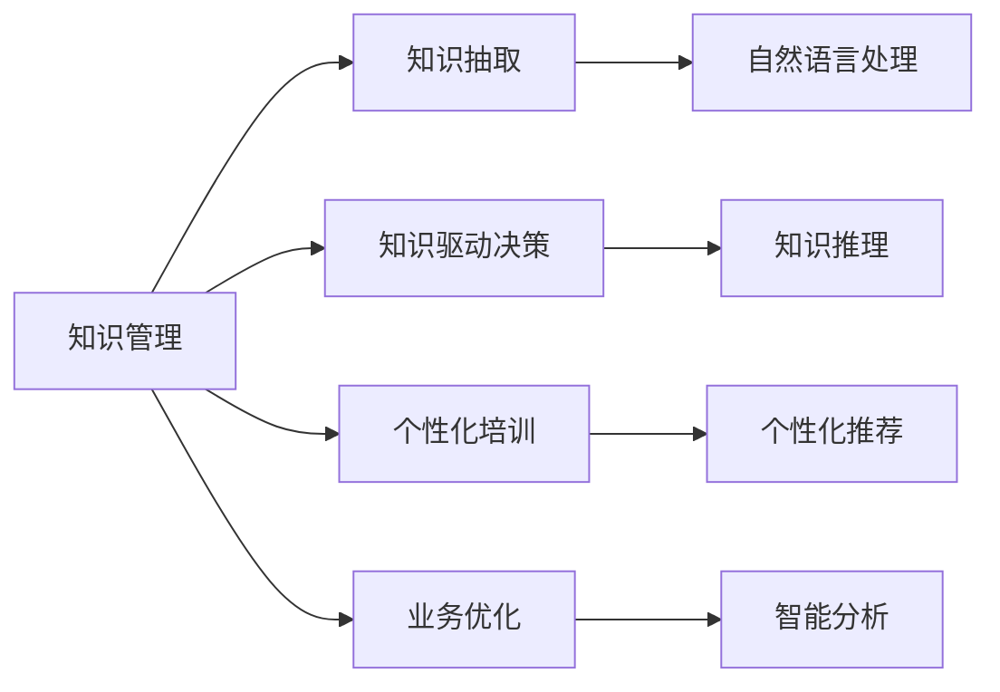

                 

# 面向企业提供知识咨询、培训和解决方案

在数字化转型的浪潮中，企业需要借助先进的技术手段，提升其知识管理水平，增强市场竞争力。知识咨询、培训和解决方案，作为智能化服务的重要组成部分，已经成为企业在数字化转型中的关键需求。本文将深入探讨面向企业提供知识咨询、培训和解决方案的核心概念、算法原理、具体操作步骤，并结合实际应用场景进行详细讲解。

## 1. 背景介绍

### 1.1 问题由来

随着信息技术的发展，企业信息化水平不断提高，但与此同时，知识管理问题也日益突出。企业内部的知识管理涉及信息收集、存储、处理、传播等多个环节，涉及跨部门、跨行业的广泛应用。传统的知识管理方式依赖于人工管理和低效的协作工具，无法适应快速变化的市场需求和信息环境。

知识咨询、培训和解决方案的引入，可以通过先进的AI技术和数据分析方法，提供个性化的知识服务，帮助企业提高知识利用效率，增强决策支持能力，推动数字化转型进程。

### 1.2 问题核心关键点

知识咨询、培训和解决方案的核心问题在于如何高效、智能地整合和利用企业内外部的知识资源，同时提供知识驱动的决策支持和培训支持。主要包括以下几个方面：

- **知识整合与抽取**：通过自然语言处理和知识图谱技术，从海量文本中自动抽取和组织知识。
- **知识驱动决策**：利用知识推理和专家系统技术，辅助企业做出基于知识的决策。
- **员工知识培训**：基于知识推荐和个性化学习系统，提供定制化的培训方案，帮助员工提升技能和知识。
- **知识驱动业务**：通过智能分析与预测技术，优化企业业务流程，提升运营效率。

### 1.3 问题研究意义

面向企业提供知识咨询、培训和解决方案，对于推动企业智能化、知识化转型具有重要意义：

1. **提高知识利用效率**：通过智能化的知识管理和应用，优化知识获取和使用流程，提升知识利用效率，支持企业决策。
2. **增强决策支持能力**：知识咨询和培训系统能提供基于知识的决策支持，减少决策失误，提高企业竞争力。
3. **促进员工职业发展**：个性化培训系统能根据员工需求提供定制化的学习资源，提升员工技能和知识，支持企业的人才培养战略。
4. **优化业务流程**：通过智能分析和预测，优化企业运营流程，提高业务效率和灵活性。

## 2. 核心概念与联系

### 2.1 核心概念概述

知识咨询、培训和解决方案是一个涉及知识获取、知识驱动决策、员工培训和业务优化等多个环节的综合系统。以下是核心概念的详细描述：

- **知识管理(Knowledge Management, KM)**：通过信息技术手段，管理和优化企业内部的知识资源，提升知识利用效率。
- **知识抽取(Information Extraction, IE)**：从大量文本数据中自动抽取结构化知识，如实体、关系、事件等。
- **知识驱动决策(Knowledge-based Decision Making, KDM)**：利用知识推理和专家系统技术，支持基于知识的决策过程。
- **个性化培训(Personalized Training, PT)**：根据员工的技能和知识需求，提供定制化的培训和学习资源。
- **业务优化(Business Optimization, BO)**：通过智能分析和预测，优化企业运营流程，提高效率。

### 2.2 核心概念原理和架构的 Mermaid 流程图



这个流程图展示了知识咨询、培训和解决方案各环节的核心概念及其之间的联系：

- 知识管理作为整体框架，从知识抽取、决策支持、员工培训和业务优化等多个角度进行知识整合。
- 知识抽取利用自然语言处理技术从文本中提取结构化知识。
- 知识驱动决策借助知识推理和专家系统，进行基于知识的决策。
- 个性化培训通过个性化推荐和学习系统，提供定制化的员工培训。
- 业务优化通过智能分析和预测技术，优化企业运营流程。

## 3. 核心算法原理 & 具体操作步骤

### 3.1 算法原理概述

面向企业提供知识咨询、培训和解决方案的核心算法主要包括以下几个方面：

- **知识抽取**：通过自然语言处理（Natural Language Processing, NLP）技术，从文本中自动提取和组织知识。常用的技术包括实体识别、关系抽取、事件抽取等。
- **知识驱动决策**：利用知识推理和专家系统技术，辅助决策过程。常见的推理方法包括逻辑推理、贝叶斯推理、因果推理等。
- **个性化培训**：根据员工的技能和知识需求，提供定制化的学习资源和培训方案。常用的技术包括个性化推荐系统、学习路径规划、学习效果评估等。
- **业务优化**：通过智能分析和预测技术，优化企业运营流程，提升效率。常用的技术包括时间序列预测、异常检测、优化调度等。

### 3.2 算法步骤详解

下面以知识抽取为例，详细介绍算法的具体步骤：

#### 3.2.1 数据预处理

1. **文本收集**：从企业内外部收集大量相关文档，如技术文档、报告、论文等。
2. **文本清洗**：去除无用信息，如广告、代码注释等，保留核心内容。
3. **文本分词**：将文本划分为词汇单元，为后续抽取做准备。

#### 3.2.2 实体识别

1. **命名实体识别(Named Entity Recognition, NER)**：识别文本中的实体类型，如人名、地名、机构名等。
2. **关系抽取**：识别实体之间的关系，如雇员与部门的关系、产品与客户的关系等。
3. **事件抽取**：识别文本中的事件类型，如项目启动、产品发布等。

#### 3.2.3 知识图谱构建

1. **知识图谱生成**：将抽取的实体和关系构建成知识图谱，形成结构化的知识网络。
2. **知识图谱更新**：定期更新知识图谱，添加新的实体和关系，保持知识的时效性。

#### 3.2.4 知识应用

1. **知识检索**：根据查询需求，从知识图谱中检索相关知识。
2. **知识推理**：利用推理算法，从已知知识中推导新的知识。

### 3.3 算法优缺点

面向企业提供知识咨询、培训和解决方案的算法具有以下优点：

- **高效**：通过自动化处理，节省了大量人力和时间成本。
- **智能**：利用先进的AI技术，提供精准的决策支持和个性化培训。
- **灵活**：能够根据企业需求进行定制化配置和优化。

同时，也存在一些缺点：

- **数据依赖**：算法的准确性和效果依赖于高质量的数据，数据质量不佳时会影响结果。
- **模型复杂**：涉及多个领域的知识和算法，模型复杂度较高。
- **资源消耗**：计算复杂度高，需要高性能的计算资源支持。

### 3.4 算法应用领域

知识咨询、培训和解决方案在多个领域有广泛应用，包括但不限于：

- **金融行业**：利用知识驱动决策支持金融风险管理、投资分析等。
- **制造业**：通过知识驱动业务优化流程，提升生产效率和质量。
- **医疗行业**：提供基于知识的诊断和治疗方案，辅助医疗决策。
- **教育培训**：提供个性化培训方案，提升员工技能和知识水平。
- **零售行业**：利用知识抽取和个性化推荐，优化销售和营销策略。

## 4. 数学模型和公式 & 详细讲解 & 举例说明

### 4.1 数学模型构建

本节将通过数学语言对知识咨询、培训和解决方案的算法原理进行严格刻画。

设企业知识库中的文档集合为 $D=\{d_1, d_2, \dots, d_n\}$，文档长度为 $L$，知识抽取的目标是从文档 $d$ 中抽取 $T$ 类实体 $E$ 和 $R$ 类关系 $R$。

知识抽取的模型为 $M=(E, R)$，其中 $E$ 和 $R$ 分别表示实体和关系的集合。知识抽取的过程可以表示为：

$$
\min_{E, R} \sum_{d \in D} \sum_{t \in T} \sum_{e \in E} \sum_{r \in R} L(d, e, r)
$$

其中 $L(d, e, r)$ 表示在文档 $d$ 中抽取实体 $e$ 和关系 $r$ 的损失函数。

### 4.2 公式推导过程

以命名实体识别为例，我们推导NER的计算公式：

设文本中每个词 $w_i$ 的向量表示为 $v_i$，所有词的向量集合为 $V$，实体的向量表示为 $v_e$。假设已知词向量 $v_i$ 和实体向量 $v_e$ 的相似度矩阵为 $S$，则NER的计算公式为：

$$
P(w_i|d, v_e, v_r) = \frac{e^{S(v_i, v_e)} e^{-S(v_i, v_r)}}{\sum_{e'} e^{S(v_i, v_{e'})} e^{-S(v_i, v_r)}} 
$$

其中 $v_r$ 表示关系的向量表示，$v_{e'}$ 表示所有可能的实体向量表示。$P(w_i|d, v_e, v_r)$ 表示词 $w_i$ 属于实体 $e$ 的概率。

### 4.3 案例分析与讲解

以一个简单的文本处理和实体识别案例来展示知识抽取的流程：

1. **文本输入**：假设企业有一个员工手册文档，包含大量员工信息。
2. **文本预处理**：将文档进行分词，去除停用词，进行词向量编码。
3. **实体抽取**：使用NER模型识别出文档中的人名、地名、机构名等实体。
4. **关系抽取**：通过共现关系和知识图谱，抽取实体之间的关系，如员工与部门的关系。

### 5. 项目实践：代码实例和详细解释说明

#### 5.1 开发环境搭建

在开发过程中，我们需要准备好以下开发环境：

1. **编程语言**：Python 3.x，推荐使用 PyTorch 和 TensorFlow 进行深度学习模型开发。
2. **开发框架**：TensorFlow，提供强大的图计算能力和分布式训练支持。
3. **数据处理工具**：NLTK、spaCy，用于文本预处理和实体识别。
4. **可视化工具**：TensorBoard，用于监控模型训练和推理过程。

#### 5.2 源代码详细实现

下面以命名实体识别为例，给出使用 PyTorch 和 TensorFlow 进行实体识别的代码实现：

**1. 数据准备**

```python
import pandas as pd
from sklearn.model_selection import train_test_split
from transformers import BertTokenizer

# 读取数据
data = pd.read_csv('employee_handbook.csv')

# 分词和编码
tokenizer = BertTokenizer.from_pretrained('bert-base-cased')
encoded_data = tokenizer(data['text'], padding='max_length', truncation=True, max_length=128, return_tensors='pt')

# 分割数据集
train_texts, test_texts, train_labels, test_labels = train_test_split(data['text'], data['label'], test_size=0.2)
```

**2. 模型构建**

```python
import torch.nn as nn
import torch.optim as optim

class BERTModel(nn.Module):
    def __init__(self, num_labels):
        super(BERTModel, self).__init__()
        self.bert = BertForTokenClassification.from_pretrained('bert-base-cased', num_labels=num_labels)
        self.classifier = nn.Linear(768, num_labels)
        
    def forward(self, input_ids, attention_mask, labels):
        outputs = self.bert(input_ids=input_ids, attention_mask=attention_mask, labels=labels)
        logits = self.classifier(outputs.pooler_output)
        return logits

# 定义模型
num_labels = 5
model = BERTModel(num_labels)

# 定义优化器和损失函数
optimizer = optim.Adam(model.parameters(), lr=2e-5)
criterion = nn.CrossEntropyLoss()
```

**3. 模型训练**

```python
# 定义训练函数
def train_epoch(model, train_dataset, optimizer, criterion, device):
    model.to(device)
    model.train()
    train_loss = 0
    for batch in train_dataset:
        input_ids = batch['input_ids'].to(device)
        attention_mask = batch['attention_mask'].to(device)
        labels = batch['labels'].to(device)
        
        optimizer.zero_grad()
        logits = model(input_ids, attention_mask, labels)
        loss = criterion(logits, labels)
        train_loss += loss.item()
        loss.backward()
        optimizer.step()
        
    return train_loss / len(train_dataset)
```

**4. 模型评估**

```python
# 定义评估函数
def evaluate(model, test_dataset, device):
    model.eval()
    test_loss = 0
    predictions, true_labels = [], []
    for batch in test_dataset:
        input_ids = batch['input_ids'].to(device)
        attention_mask = batch['attention_mask'].to(device)
        labels = batch['labels'].to(device)
        
        with torch.no_grad():
            logits = model(input_ids, attention_mask, labels)
            test_loss += criterion(logits, labels).item()
            predictions.append(logits.argmax(dim=1).cpu().numpy())
            true_labels.append(labels.cpu().numpy())
    
    print('Test Loss: {:.4f}\n'.format(test_loss / len(test_dataset)))
    print('Accuracy: {:.2f}\n'.format((predictions == true_labels).mean()))
```

#### 5.3 代码解读与分析

**模型构建**

- `BERTModel`类定义了BERT模型，包含BERT Token Classifier层和全连接层。
- `train_epoch`函数用于训练模型，返回训练集上的损失值。
- `evaluate`函数用于评估模型，返回测试集上的损失值和准确率。

**模型训练**

- 在训练函数中，首先将模型移动到设备（如GPU），进入训练模式。
- 对于每个批次的数据，进行前向传播计算输出，然后计算损失并反向传播更新参数。
- 训练函数重复迭代，直到训练集上的损失收敛。

**模型评估**

- 在评估函数中，首先将模型切换到评估模式，对测试集上的数据进行前向传播。
- 评估函数计算模型输出和真实标签的损失，并统计准确率。

## 6. 实际应用场景

### 6.1 智能客服系统

智能客服系统通过知识抽取和知识驱动决策，快速响应客户咨询，提供高质量的客户服务。系统可以自动理解客户问题，匹配最合适的答案模板，生成自然流畅的回复。

#### 6.1.1 技术实现

1. **知识库构建**：收集客户服务对话记录，构建知识库，包含常见问题及其答案。
2. **知识抽取**：从对话记录中抽取问题和答案，构建知识图谱。
3. **知识驱动决策**：系统根据对话内容，从知识图谱中抽取相关答案，生成回复。

#### 6.1.2 应用效果

智能客服系统通过知识抽取和知识驱动决策，显著提升了客户咨询体验，减少了客户等待时间，提高了客户满意度。

### 6.2 金融风险管理

金融风险管理通过知识驱动决策，辅助金融机构进行风险评估和决策支持。系统可以自动分析客户信用记录、交易行为等数据，识别潜在风险点。

#### 6.2.1 技术实现

1. **数据收集**：收集客户信用记录、交易行为等数据。
2. **知识抽取**：从数据中抽取关键实体和关系，构建知识图谱。
3. **知识驱动决策**：系统根据客户数据，从知识图谱中抽取相关信息，识别潜在风险。

#### 6.2.2 应用效果

金融风险管理系统通过知识驱动决策，提高了风险评估的准确性和效率，帮助金融机构及时发现并防范潜在风险。

### 6.3 医疗诊断系统

医疗诊断系统通过知识驱动决策，辅助医生进行疾病诊断和治疗方案制定。系统可以自动分析患者的病历、检查报告等数据，提供诊断建议和治疗方案。

#### 6.3.1 技术实现

1. **数据收集**：收集患者病历、检查报告等数据。
2. **知识抽取**：从数据中抽取关键实体和关系，构建知识图谱。
3. **知识驱动决策**：系统根据患者数据，从知识图谱中抽取相关信息，提供诊断建议和治疗方案。

#### 6.3.2 应用效果

医疗诊断系统通过知识驱动决策，提高了诊断的准确性和效率，辅助医生制定更加科学的诊疗方案。

## 7. 工具和资源推荐

### 7.1 学习资源推荐

为帮助开发者掌握知识咨询、培训和解决方案的技术，这里推荐一些优质的学习资源：

1. **自然语言处理课程**：斯坦福大学开设的《CS224N: Natural Language Processing with Deep Learning》课程，涵盖NLP基本概念和前沿技术。
2. **TensorFlow官方文档**：TensorFlow的官方文档，提供了深度学习模型开发的全面指南。
3. **PyTorch官方文档**：PyTorch的官方文档，提供了深度学习模型开发的详细教程。
4. **Kaggle竞赛**：Kaggle平台上的数据竞赛，涵盖各类NLP任务和挑战，提升实战能力。

通过这些资源的学习，相信你能快速掌握知识咨询、培训和解决方案的算法和技术。

### 7.2 开发工具推荐

高效的工具支持是成功实现知识咨询、培训和解决方案的关键。以下是几款推荐的开发工具：

1. **编程语言**：Python 3.x，支持TensorFlow和PyTorch深度学习模型开发。
2. **数据处理工具**：NLTK、spaCy，用于文本预处理和实体识别。
3. **可视化工具**：TensorBoard，用于监控模型训练和推理过程。
4. **数据可视化工具**：Matplotlib、Seaborn，用于数据可视化和分析。

合理利用这些工具，可以显著提升开发效率和效果。

### 7.3 相关论文推荐

知识咨询、培训和解决方案领域的研究论文众多，以下是几篇代表性的文献：

1. **《Knowledge Management and Business Intelligence in Smart Manufacturing》**：探讨了智能制造中的知识管理与商业智能，提供了相关的技术框架和应用案例。
2. **《A Survey on Knowledge Mining and Knowledge Graphs in Healthcare》**：综述了医疗领域中的知识抽取和知识图谱构建技术，分析了其在诊断和治疗中的应用。
3. **《Personalized Learning: From Understanding to Optimization》**：介绍了个性化学习的研究现状和未来方向，强调了知识驱动决策的重要性和应用前景。

这些论文为知识咨询、培训和解决方案的研究提供了丰富的理论基础和技术支持。

## 8. 总结：未来发展趋势与挑战

### 8.1 总结

本文对知识咨询、培训和解决方案的核心算法原理和操作步骤进行了详细讲解，并通过实际应用场景展示了其在企业知识管理中的应用效果。

面向企业提供知识咨询、培训和解决方案，可以大幅提升企业的知识利用效率和决策支持能力，支持企业智能化、知识化转型。

### 8.2 未来发展趋势

面向企业提供知识咨询、培训和解决方案的未来发展趋势如下：

1. **个性化增强**：通过更加智能化的个性化推荐和学习系统，提供更加定制化的知识服务，提升员工技能和知识水平。
2. **多模态融合**：结合文本、图像、语音等多模态数据，提供更加全面的知识服务。
3. **跨领域应用**：将知识咨询、培训和解决方案应用于更多领域，如智能制造、智能农业等。
4. **自动化部署**：通过自动化部署工具，快速搭建知识服务系统，降低企业应用门槛。
5. **联邦学习**：利用联邦学习技术，保护数据隐私的同时，提升知识服务的效果。

### 8.3 面临的挑战

虽然知识咨询、培训和解决方案在企业中的应用前景广阔，但也面临一些挑战：

1. **数据隐私保护**：企业在知识抽取和知识驱动决策过程中，需要保护客户隐私，避免数据泄露。
2. **模型复杂性**：知识抽取和知识驱动决策涉及多个领域的知识和算法，模型复杂度较高，需要高效且可解释的模型。
3. **数据质量**：知识抽取和知识驱动决策的准确性依赖于高质量的数据，数据质量不佳会严重影响结果。
4. **资源消耗**：计算复杂度高，需要高性能的计算资源支持。

### 8.4 研究展望

面向企业提供知识咨询、培训和解决方案的未来研究展望如下：

1. **知识抽取自动化**：通过更先进的自然语言处理技术，提高知识抽取的自动化程度和准确性。
2. **知识图谱构建**：利用知识图谱技术，构建更加全面、动态的知识网络，提升知识服务的效果。
3. **跨领域知识整合**：将不同领域的知识进行整合，形成跨领域的知识服务体系，支持更多行业应用。
4. **多模态知识获取**：结合文本、图像、语音等多模态数据，提供更加全面的知识服务。
5. **知识服务可视化**：通过数据可视化和交互技术，提升知识服务的用户体验和互动性。

面向企业提供知识咨询、培训和解决方案，将在未来继续发挥重要作用，推动企业智能化、知识化转型，为企业提供更加智能、高效的知识服务。

---

作者：禅与计算机程序设计艺术 / Zen and the Art of Computer Programming

