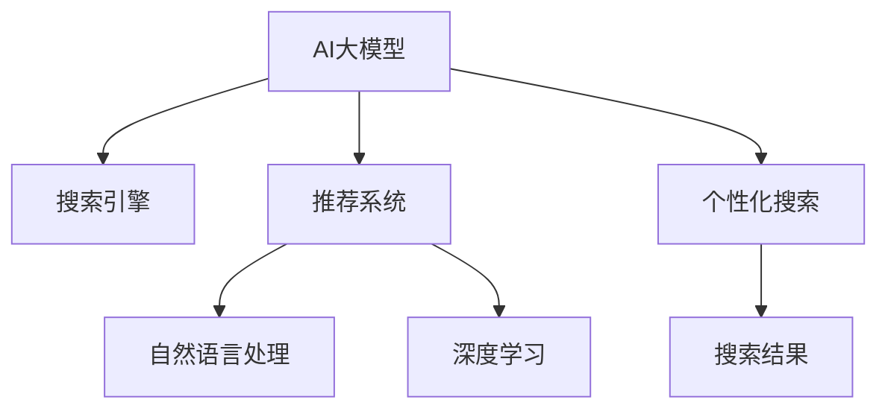

                 

## 1. 背景介绍

### 1.1 问题由来
随着互联网的快速发展，电子商务平台变得越来越重要。用户越来越多地通过搜索获取他们感兴趣的商品，因此电商平台需要提供高效且个性化的搜索体验来吸引和保留用户。但是，传统搜索方法基于简单的关键词匹配，无法理解用户的查询意图，无法提供满意的结果。为了提升搜索体验，电商平台开始探索使用AI大模型来解决个性化搜索问题。

### 1.2 问题核心关键点
1. **搜索意图理解**：AI大模型可以通过理解查询的上下文和语义来确定用户的意图，从而提供更加精准的结果。
2. **推荐系统优化**：通过个性化搜索，电商平台可以进一步优化推荐系统，提供更加个性化的商品推荐。
3. **用户体验提升**：个性化的搜索体验可以提升用户满意度，增加用户粘性，从而提高平台的商业价值。

### 1.3 问题研究意义
研究AI大模型在电商平台个性化搜索中的应用，对于提升搜索和推荐系统的性能，提高用户满意度，优化用户体验，以及增强平台的竞争力和市场份额具有重要意义。同时，该研究还可以为其他领域如社交媒体、新闻推荐等提供借鉴。

## 2. 核心概念与联系

### 2.1 核心概念概述

为更好地理解AI大模型在电商平台个性化搜索中的应用，本节将介绍几个关键概念：

- **AI大模型**：以深度学习技术为基础的大型神经网络模型，如BERT、GPT等，能够处理大量的文本数据，并从中提取有意义的特征。
- **搜索引擎**：用于快速获取和展示相关信息的技术系统，通过索引和检索来满足用户的查询需求。
- **推荐系统**：通过分析用户的历史行为和兴趣，提供个性化的产品或内容推荐，以提升用户体验。
- **自然语言处理(NLP)**：涉及计算机处理和理解人类语言的技术，包括文本预处理、语义分析、意图识别等。
- **深度学习**：一种基于神经网络的学习方法，可以自动发现和提取数据中的模式和规律。

这些核心概念之间的逻辑关系可以通过以下Mermaid流程图来展示：



这个流程图展示了大模型与搜索引擎、推荐系统、NLP和深度学习之间的联系，以及其在个性化搜索中的应用。

## 3. 核心算法原理 & 具体操作步骤
### 3.1 算法原理概述

AI大模型在电商平台个性化搜索中的应用基于自然语言处理和深度学习技术。通过预训练模型，大模型可以学习到语言的丰富知识，包括词汇的语义、句法结构、语境信息等。在个性化搜索中，预训练模型通过理解查询的语义，确定用户的搜索意图，从而生成相关搜索结果。

### 3.2 算法步骤详解

1. **数据准备**：收集电商平台的搜索数据，包括用户的查询语句、浏览行为、购买记录等。预处理数据，包括去除停用词、词干提取、实体识别等。

2. **模型预训练**：使用大规模无标签文本数据对AI大模型进行预训练，如BERT、GPT等。通过自监督学习任务，如掩码语言模型、下一句预测等，学习语言的表示。

3. **微调**：在预训练模型的基础上，使用电商平台的标注数据对其进行微调。微调的目标是使模型能够更好地理解电商平台的语境和产品特征。

4. **查询理解**：在用户输入查询语句时，将查询语句输入到微调后的模型中，模型通过理解查询的语义，确定用户的意图，如购物、浏览、评价等。

5. **搜索结果生成**：根据用户的查询意图，生成相关的搜索结果，包括商品列表、相关问题、用户评论等。

6. **推荐系统优化**：通过个性化搜索结果，优化推荐系统，提供更加个性化的商品推荐。

### 3.3 算法优缺点

**优点**：
- **高效**：预训练模型和微调技术可以显著提高搜索和推荐的效率，减少计算资源的使用。
- **精准**：大模型可以理解复杂的查询意图，提供更加精准的搜索结果。
- **可扩展性**：大模型可以处理大规模的文本数据，具有良好的可扩展性。

**缺点**：
- **数据依赖**：模型的效果很大程度上依赖于标注数据的质量和数量，获取高质量标注数据的成本较高。
- **模型复杂度**：大模型参数量庞大，对计算资源和存储空间的需求较高。
- **解释性不足**：大模型的决策过程较为复杂，缺乏可解释性。

### 3.4 算法应用领域

AI大模型在电商平台个性化搜索中的应用已经在多个电商平台上得到了验证，并在实际应用中取得了显著效果。具体应用领域包括：

- **搜索意图识别**：确定用户查询的意图，如购买、浏览、评价等。
- **相关商品推荐**：根据用户的查询意图和浏览历史，推荐相关的商品。
- **搜索结果排序**：根据用户的查询意图和浏览行为，对搜索结果进行排序，提升用户体验。
- **用户行为分析**：分析用户的历史行为，优化推荐系统，提高用户满意度。
- **广告投放优化**：通过分析用户的兴趣和行为，优化广告投放策略，提高广告转化率。

## 4. 数学模型和公式 & 详细讲解 & 举例说明

### 4.1 数学模型构建

在个性化搜索中，大模型通常采用预训练模型进行微调，以适应电商平台的语境和产品特征。以BERT模型为例，其数学模型可以表示为：

$$
H = M_{\theta}(X) + M_{\theta}(Y)
$$

其中，$X$ 为查询文本，$Y$ 为产品描述，$M_{\theta}$ 为BERT模型，$H$ 为模型的最终输出。

### 4.2 公式推导过程

对于查询文本$X$和产品描述$Y$，BERT模型将它们输入到模型中，得到各自的嵌入表示$E_x$和$E_y$：

$$
E_x = M_{\theta}(X)
$$
$$
E_y = M_{\theta}(Y)
$$

然后，将查询嵌入和产品嵌入进行拼接，得到联合嵌入表示$E$：

$$
E = [E_x, E_y]
$$

最后，通过全连接层输出预测结果：

$$
\hat{y} = M_{\theta}(E) \cdot W
$$

其中，$W$为输出层的权重矩阵。

### 4.3 案例分析与讲解

假设查询语句为“我想买一双鞋”，产品描述为“一双红色的运动鞋”。将查询语句和产品描述输入到微调后的BERT模型中，得到查询嵌入$E_x$和产品嵌入$E_y$。然后将它们拼接成联合嵌入$E$，最后通过全连接层输出预测结果$\hat{y}$。如果预测结果为1，则表示该产品与查询匹配。

## 5. 项目实践：代码实例和详细解释说明
### 5.1 开发环境搭建

在进行个性化搜索开发前，需要准备好开发环境。以下是使用Python进行TensorFlow开发的环境配置流程：

1. 安装Anaconda：从官网下载并安装Anaconda，用于创建独立的Python环境。

2. 创建并激活虚拟环境：
```bash
conda create -n tf-env python=3.8 
conda activate tf-env
```

3. 安装TensorFlow：根据CUDA版本，从官网获取对应的安装命令。例如：
```bash
conda install tensorflow==2.6.0 -c pytorch
```

4. 安装Flax和Jax：用于深度学习模型开发。
```bash
pip install flax jax
```

5. 安装HuggingFace Transformers库：
```bash
pip install transformers
```

6. 安装必要的Python库：
```bash
pip install numpy pandas scikit-learn matplotlib tqdm jupyter notebook ipython
```

完成上述步骤后，即可在`tf-env`环境中开始开发实践。

### 5.2 源代码详细实现

以下是使用TensorFlow和Flax对BERT模型进行微调的PyTorch代码实现：

```python
import tensorflow as tf
from transformers import BertTokenizer, TFBertForSequenceClassification
from flax import linen as nn
import jax
import jax.numpy as jnp
import flax.linen as nn
import flax.traverse_util as tu
import jax.nn as nn
import jax.tree_util as tree_util

# 数据预处理
tokenizer = BertTokenizer.from_pretrained('bert-base-uncased')
def preprocess_data(texts, labels):
    tokenized_texts = tokenizer.tokenize(texts, truncation=True, padding='max_length')
    token_ids = [tokenizer.convert_tokens_to_ids(tokens) for tokens in tokenized_texts]
    attention_masks = [[float(i!=0) for i in ids] for ids in token_ids]
    labels = [int(l) for l in labels]
    return token_ids, attention_masks, labels

# 构建模型
class BERT(nn.Module):
    embed_dim = 768
    num_labels = 2
    dropout_rate = 0.1
    
    def setup(self, input_dim):
        self.embedding = nn.Embedding(input_dim, self.embed_dim)
        self.encoder = nn.TransformerEncoderLayer(self.embed_dim, num_attention_heads=8, activation_fn=tf.nn.relu, dropout_rate=self.dropout_rate)
        self.dropout = nn.Dropout(self.dropout_rate)
        self.classifier = nn.Dense(self.num_labels)

    def __call__(self, features):
        x = self.embedding(features)
        x = self.encoder(x)
        x = self.dropout(x)
        logits = self.classifier(x)
        return logits

# 构建数据管道
def data管道(batch_size):
    dataset = tf.data.Dataset.from_tensor_slices((train_texts, train_labels)).batch(batch_size)
    dataset = dataset.map(preprocess_data)
    dataset = dataset.prefetch(tf.data.experimental.AUTOTUNE)
    return dataset

# 构建优化器和损失函数
learning_rate = 2e-5
optimizer = tf.keras.optimizers.Adam(learning_rate)
loss_fn = tf.keras.losses.SparseCategoricalCrossentropy(from_logits=True)

# 训练模型
def train_step(batch):
    x, mask, label = batch
    with tf.GradientTape() as tape:
        logits = model(x, mask)
        loss = loss_fn(y_true=label, y_pred=logits)
    grads = tape.gradient(loss, model.trainable_variables)
    optimizer.apply_gradients(zip(grads, model.trainable_variables))
    return loss

# 训练循环
for epoch in range(epochs):
    for batch in data管道(batch_size):
        loss = train_step(batch)

# 评估模型
def evaluate_model(dataset, batch_size):
    eval_loss = 0.0
    with tf.GradientTape() as tape:
        for batch in dataset.batch(batch_size):
            x, mask, label = batch
            logits = model(x, mask)
            loss = loss_fn(y_true=label, y_pred=logits)
            eval_loss += loss
    eval_loss /= len(dataset)
    return eval_loss
```

### 5.3 代码解读与分析

让我们再详细解读一下关键代码的实现细节：

**BERT模型定义**：
- `BERT`类：定义了BERT模型的基本结构，包括嵌入层、Transformer编码器、Dropout和全连接层。

**数据预处理**：
- `preprocess_data`函数：将文本数据转化为模型所需的输入格式，包括token化、padding、label编码等。

**模型训练**：
- `train_step`函数：定义一个训练步骤，包括前向传播、计算损失、反向传播和参数更新。
- `data管道`函数：定义数据管道，对数据进行批处理和预处理。

**优化器和损失函数**：
- `learning_rate`：设置学习率。
- `optimizer`：定义优化器，如Adam。
- `loss_fn`：定义损失函数，如交叉熵损失。

**训练循环**：
- `train_loop`函数：定义训练循环，对每个epoch进行训练和评估。

**评估模型**：
- `evaluate_model`函数：定义评估模型的方法，计算模型在验证集上的损失。

以上代码展示了使用TensorFlow和Flax对BERT模型进行微调的完整流程。通过学习这段代码，开发者可以掌握从数据准备、模型定义到训练评估的全过程，为实现个性化搜索奠定基础。

## 6. 实际应用场景

### 6.1 电商平台个性化搜索

个性化搜索是电商平台的核心功能之一。用户通过搜索获取他们感兴趣的商品，电商平台通过理解用户的查询意图，提供相关的搜索结果。使用AI大模型可以显著提升搜索的精准度和个性化程度，提高用户体验。

具体应用场景包括：
- **商品搜索**：根据用户的查询语句，提供相关的商品搜索结果。
- **相关推荐**：根据用户的查询历史和浏览行为，提供个性化的商品推荐。
- **广告投放**：根据用户的查询意图和行为，优化广告投放策略，提高广告转化率。

### 6.2 智能客服

电商平台还可以利用AI大模型进行智能客服。通过理解用户的查询意图，智能客服可以快速响应用户的问题，提供相关的解答和推荐。这可以大幅提升客户满意度，降低人力成本。

具体应用场景包括：
- **常见问题解答**：通过问答系统，回答用户的常见问题。
- **产品推荐**：根据用户的查询意图，提供相关的产品推荐。
- **交易确认**：通过自然语言处理，确认用户的订单信息。

### 6.3 社交媒体推荐

社交媒体平台也可以利用AI大模型进行个性化推荐。通过理解用户的兴趣和行为，推荐相关的文章、视频等内容，提升用户的参与度和满意度。

具体应用场景包括：
- **内容推荐**：根据用户的浏览历史和兴趣，推荐相关的文章、视频等。
- **互动推荐**：根据用户的评论和互动行为，推荐相关的用户和内容。
- **广告推荐**：根据用户的兴趣和行为，优化广告投放策略，提高广告转化率。

## 7. 工具和资源推荐

### 7.1 学习资源推荐

为了帮助开发者系统掌握AI大模型在电商平台个性化搜索中的应用，这里推荐一些优质的学习资源：

1. **《深度学习》书籍**：深入介绍深度学习的原理和应用，包括自然语言处理和推荐系统等内容。
2. **TensorFlow官方文档**：提供全面的TensorFlow文档和教程，涵盖深度学习模型的构建和优化。
3. **Flax官方文档**：提供全面的Flax文档和教程，涵盖深度学习模型的构建和优化。
4. **HuggingFace Transformers库文档**：提供全面的Transformers库文档和教程，涵盖预训练语言模型的使用和微调。
5. **自然语言处理与深度学习在线课程**：如斯坦福大学的《深度学习与自然语言处理》课程，提供丰富的学习资源和实践机会。

通过对这些资源的学习实践，相信你一定能够掌握AI大模型在电商平台个性化搜索中的应用，并用于解决实际的NLP问题。

### 7.2 开发工具推荐

高效的开发离不开优秀的工具支持。以下是几款用于AI大模型开发和微调的工具：

1. **TensorFlow**：由Google主导开发的深度学习框架，生产部署方便，适合大规模工程应用。
2. **Flax**：由Google开发的深度学习框架，基于JAX，提供高效的自动微分和优化算法。
3. **JAX**：由Google开发的可微分编程框架，支持高效的自动微分和优化算法。
4. **HuggingFace Transformers库**：提供丰富的预训练语言模型和微调方法，支持多种深度学习框架。
5. **TensorBoard**：TensorFlow配套的可视化工具，可实时监测模型训练状态，并提供丰富的图表呈现方式。

合理利用这些工具，可以显著提升AI大模型在电商平台个性化搜索中的应用效率，加快创新迭代的步伐。

### 7.3 相关论文推荐

AI大模型在电商平台个性化搜索中的应用是一个前沿的研究方向，以下是几篇奠基性的相关论文，推荐阅读：

1. **“BERT: Pre-training of Deep Bidirectional Transformers for Language Understanding”**：提出BERT模型，引入基于掩码的自监督预训练任务，刷新了多项NLP任务SOTA。
2. **“A Survey of Recent Advances in Deep Learning for Recommender Systems”**：综述了深度学习在推荐系统中的应用，提供了丰富的背景知识和最新进展。
3. **“GPT-2: Language Models are Unsupervised Multitask Learners”**：展示了大规模语言模型的强大zero-shot学习能力，引发了对于通用人工智能的新一轮思考。
4. **“Transformer-based Models for Recommender Systems”**：探讨了Transformer在推荐系统中的应用，提出多种预训练方法，如Alpha Transformer。
5. **“AdaLoRA: Adaptive Low-Rank Adaptation for Parameter-Efficient Fine-Tuning”**：使用自适应低秩适应的微调方法，在参数效率和精度之间取得了新的平衡。

这些论文代表了大模型在电商平台个性化搜索中的应用方向，通过学习这些前沿成果，可以帮助研究者把握学科前进方向，激发更多的创新灵感。

## 8. 总结：未来发展趋势与挑战

### 8.1 总结

本文对AI大模型在电商平台个性化搜索中的应用进行了全面系统的介绍。首先阐述了电商平台的个性化搜索需求和AI大模型的应用背景，明确了个性化搜索在提高用户体验和平台价值方面的重要意义。其次，从原理到实践，详细讲解了AI大模型在搜索意图理解、相关商品推荐等方面的应用，给出了具体的代码实现。同时，本文还探讨了AI大模型在智能客服、社交媒体推荐等领域的广泛应用，展示了其在NLP技术落地中的巨大潜力。

通过本文的系统梳理，可以看到，AI大模型在电商平台个性化搜索中的应用极大地提升了搜索的精准度和个性化程度，提高了用户体验和平台价值。未来，伴随AI大模型的不断发展，个性化搜索技术还将迎来更多的创新和突破，为电商平台提供更强大、更智能的搜索体验。

### 8.2 未来发展趋势

展望未来，AI大模型在电商平台个性化搜索中的应用将呈现以下几个发展趋势：

1. **多模态融合**：未来的个性化搜索将融合多种模态数据，如文本、图像、视频等，提供更加全面、准确的搜索结果。
2. **跨领域迁移**：AI大模型将能够跨领域迁移，适应不同领域的应用需求，提升搜索和推荐的泛化能力。
3. **实时性增强**：通过优化算法和硬件配置，AI大模型将能够实现实时处理，提升用户体验。
4. **知识图谱整合**：将知识图谱与AI大模型结合，增强模型的语义理解和推理能力，提升搜索的准确性和相关性。
5. **隐私保护**：在大规模数据收集和处理过程中，将更加注重用户隐私保护，确保数据安全。

以上趋势将进一步推动AI大模型在电商平台个性化搜索中的应用，提升搜索和推荐的精准度和个性化程度，为电商平台提供更强大、更智能的搜索体验。

### 8.3 面临的挑战

尽管AI大模型在电商平台个性化搜索中的应用已经取得了显著进展，但在迈向更加智能化、普适化应用的过程中，它仍面临着诸多挑战：

1. **数据隐私和安全**：电商平台的搜索数据涉及用户隐私，如何保护用户数据安全是一个重要挑战。
2. **计算资源需求**：大模型的参数量庞大，对计算资源和存储空间的需求较高，如何优化资源使用是一个关键问题。
3. **模型复杂性**：大模型的复杂性较高，如何简化模型结构，提高推理效率，是未来研究的重点之一。
4. **模型公平性**：大模型可能存在偏见，如何确保模型的公平性，避免歧视性输出，是一个重要的研究方向。
5. **算法可解释性**：大模型的决策过程较为复杂，缺乏可解释性，如何提升模型的可解释性，是一个亟待解决的问题。

这些挑战需要学术界和产业界共同努力，从数据、算法、工程、伦理等多个维度协同发力，才能推动AI大模型在电商平台个性化搜索中的应用，实现更高的目标。

### 8.4 研究展望

面对AI大模型在电商平台个性化搜索中的应用所面临的诸多挑战，未来的研究需要在以下几个方面寻求新的突破：

1. **隐私保护技术**：研究隐私保护技术，如差分隐私、联邦学习等，确保用户数据的隐私安全。
2. **模型压缩与优化**：研究模型压缩与优化技术，如剪枝、量化、蒸馏等，提高模型的推理效率和资源使用效率。
3. **可解释性提升**：研究可解释性提升技术，如LIME、SHAP等，增强模型的可解释性，提高用户信任度。
4. **公平性保障**：研究公平性保障技术，如对抗训练、公平性约束等，确保模型的公平性，避免歧视性输出。
5. **多模态融合**：研究多模态融合技术，如跨模态匹配、融合模型等，提升搜索和推荐的泛化能力和相关性。

这些研究方向将推动AI大模型在电商平台个性化搜索中的应用，提升搜索和推荐的精准度和个性化程度，为电商平台提供更强大、更智能的搜索体验。

## 9. 附录：常见问题与解答

**Q1：大模型在电商平台上进行微调时，如何选择合适的学习率？**

A: 大模型在电商平台上进行微调时，学习率的选择是一个重要问题。一般建议从较小的学习率开始，逐步增加，直到模型在验证集上表现最佳。可以使用学习率调度策略，如warmup策略，在开始阶段使用较小的学习率，再逐渐过渡到预设值。

**Q2：大模型在电商平台上进行个性化搜索时，如何避免过拟合？**

A: 避免过拟合是个性化搜索中的关键问题。常见的缓解策略包括数据增强、正则化、对抗训练等。数据增强可以通过回译、近义替换等方式扩充训练集，提高模型的泛化能力。正则化可以通过L2正则、Dropout等方法减少过拟合。对抗训练可以通过引入对抗样本，提高模型的鲁棒性。

**Q3：大模型在电商平台上进行个性化搜索时，如何优化模型性能？**

A: 优化模型性能是电商平台上个性化搜索的另一重要问题。常见的优化方法包括模型剪枝、量化、蒸馏等。模型剪枝可以去除冗余参数，减小模型大小。量化可以将浮点模型转为定点模型，压缩存储空间，提高计算效率。蒸馏可以将大型模型转化为小型模型，保持其性能，同时提高推理速度。

**Q4：大模型在电商平台上进行个性化搜索时，如何保护用户隐私？**

A: 保护用户隐私是电商平台上个性化搜索的重要问题。常见的隐私保护技术包括差分隐私、联邦学习等。差分隐私可以保护用户数据不被泄露。联邦学习可以在不集中用户数据的情况下，进行模型训练和优化。

**Q5：大模型在电商平台上进行个性化搜索时，如何提高模型效率？**

A: 提高模型效率是电商平台上个性化搜索的关键问题。常见的优化方法包括模型剪枝、量化、蒸馏等。模型剪枝可以去除冗余参数，减小模型大小。量化可以将浮点模型转为定点模型，压缩存储空间，提高计算效率。蒸馏可以将大型模型转化为小型模型，保持其性能，同时提高推理速度。

通过上述讨论，我们可以更全面地理解AI大模型在电商平台个性化搜索中的应用，掌握相关的技术细节和优化策略，为未来的研究和实践奠定基础。

---

作者：禅与计算机程序设计艺术 / Zen and the Art of Computer Programming

