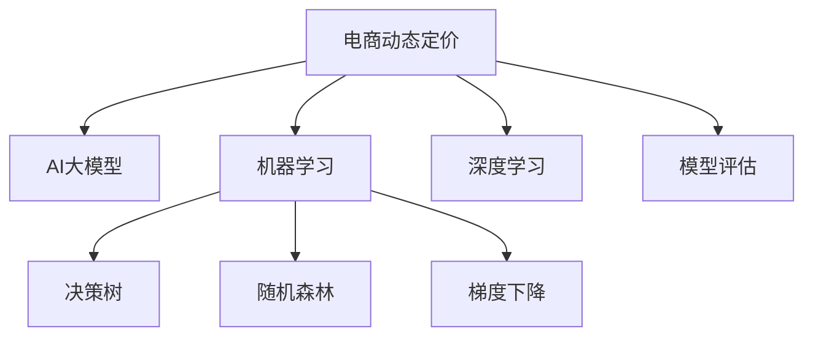

                 

# AI大模型在电商平台动态定价策略中的应用

> 关键词：AI大模型,动态定价,电商平台,机器学习,定价策略,价格优化,实时竞价

## 1. 背景介绍

### 1.1 问题由来
随着电子商务的蓬勃发展，电商平台在面对激烈的市场竞争时，需要不断调整产品价格以保持市场竞争力。传统的人工定价策略依赖经验丰富的市场分析师，不但耗时耗力，而且难以及时应对市场变化。借助AI技术，尤其是大语言模型，电商平台能够实现动态定价策略，实时调整商品价格，从而最大化盈利和市场份额。

### 1.2 问题核心关键点
1. 电商平台：指通过互联网提供商品销售和交易服务的平台，如淘宝、京东、亚马逊等。
2. 动态定价：指根据市场供需变化、竞争对手定价策略、消费者行为等因素，实时调整商品价格以最大化利润的定价策略。
3. 大语言模型：指通过大量无监督数据预训练和有监督数据微调，学习广泛语言知识的大规模神经网络模型，如BERT、GPT等。
4. 定价模型：利用机器学习、深度学习等技术建立的价格预测和优化模型，基于历史数据和市场特征进行价格预测和定价优化。
5. 实时竞价：指在电商平台内，商品价格随时间动态变化，基于当前市场条件进行实时竞价和调整。
6. 算法优化：指通过优化算法，如梯度下降、随机森林等，改进定价策略的准确性和效率。

这些关键点构成了电商动态定价的核心框架，通过AI技术和大语言模型的加持，能够实现更高效、智能的价格调整策略。

### 1.3 问题研究意义
1. 提升销售效率：动态定价策略能够快速响应市场变化，及时调整价格，提升销售效率和市场竞争力。
2. 增加盈利能力：基于市场分析和消费者行为建模的定价策略，能够精准定价，提升盈利能力。
3. 降低成本：借助AI大模型的自动化定价，减少了人工干预，降低人力和时间成本。
4. 优化客户体验：动态定价策略能够实现个性化定价，满足不同客户需求，提升客户满意度和忠诚度。
5. 数据驱动决策：利用历史数据和实时市场数据，为决策提供科学依据，提升决策质量。

## 2. 核心概念与联系

### 2.1 核心概念概述

为更好地理解AI大模型在电商动态定价中的应用，本节将介绍几个密切相关的核心概念：

- 电商动态定价：指根据市场供需、消费者行为、竞争对手策略等因素，实时调整商品价格的策略。
- AI大模型：指通过大量无监督数据预训练和有监督数据微调，学习广泛语言知识的大规模神经网络模型。
- 机器学习：指利用数据训练模型，通过特征提取和模型优化，进行预测和决策的自动化技术。
- 深度学习：指利用神经网络进行数据处理和建模的高级机器学习方法，具有强大的特征提取能力和泛化能力。
- 决策树和随机森林：指基于树形结构的机器学习算法，常用于分类和回归任务。
- 梯度下降：指通过计算损失函数的梯度，逐步更新模型参数的优化算法。
- 模型评估：指通过各种评估指标，如准确率、召回率、F1值等，评价模型性能的方法。

这些概念之间的逻辑关系可以通过以下Mermaid流程图来展示：



这个流程图展示了电商动态定价、AI大模型、机器学习、深度学习等核心概念及其之间的关系：

1. 电商动态定价：基于市场数据和消费者行为，调整商品价格以优化销售策略。
2. AI大模型：通过预训练和微调，学习广泛语言知识，为电商定价提供智能支持。
3. 机器学习和深度学习：利用数据训练和优化模型，实现精准定价和策略优化。
4. 决策树和随机森林：用于建立和优化决策模型，辅助价格调整。
5. 梯度下降：优化算法，用于训练和更新定价模型。
6. 模型评估：评价模型效果，确保定价策略的有效性。

这些概念共同构成了电商动态定价的技术基础，通过理解这些核心概念，我们可以更好地把握大模型在定价中的应用。

## 3. 核心算法原理 & 具体操作步骤
### 3.1 算法原理概述

电商平台的动态定价策略，本质上是基于数据驱动的机器学习模型。其核心思想是：通过收集和分析市场数据、消费者行为、竞争对手定价等信息，训练一个高效的定价模型，实时调整商品价格，以最大化利润。

形式化地，设电商平台商品数量为 $N$，市场数据为 $D$，消费者行为为 $C$，竞争对手定价为 $P$，目标利润为 $Y$。电商动态定价的目标是最小化损失函数 $L$，即：

$$
\min_{\theta} L(Y, D, C, P)
$$

其中 $\theta$ 为模型参数，$L$ 为定价策略的损失函数。具体而言，可以采用以下损失函数：

1. 平均绝对误差（MAE）：衡量实际价格与预测价格之间的平均绝对偏差。
2. 均方误差（MSE）：衡量实际价格与预测价格之间的平均平方偏差。
3. 交叉熵损失（Cross-Entropy Loss）：用于分类问题，衡量模型预测概率与实际标签之间的差距。

通过梯度下降等优化算法，定价模型不断更新参数 $\theta$，最小化损失函数 $L$，从而优化定价策略。

### 3.2 算法步骤详解

电商平台的动态定价策略一般包括以下几个关键步骤：

**Step 1: 数据收集与预处理**
- 收集市场数据，包括价格历史、交易量、促销活动等。
- 收集消费者行为数据，如浏览记录、购买历史、评价反馈等。
- 收集竞争对手定价数据，包括竞争对手的促销信息、价格变化等。
- 对数据进行清洗、去重、归一化等预处理操作，以便后续建模使用。

**Step 2: 特征工程**
- 从原始数据中提取有意义的特征，如价格变化、季节性、消费者偏好等。
- 利用编码技术将特征转换为模型可用的数值形式，如独热编码、标准化等。
- 使用特征选择算法，如相关性分析、信息增益等，剔除无关或冗余特征。

**Step 3: 建立定价模型**
- 选择合适的机器学习算法，如线性回归、随机森林、梯度提升等，建立定价模型。
- 对模型进行训练，使用市场数据、消费者行为和竞争对手定价作为训练样本。
- 使用交叉验证等方法，评估模型的性能，确保模型具有较好的泛化能力。

**Step 4: 实时定价**
- 在电商平台上部署定价模型，实时接收市场数据、消费者行为和竞争对手定价。
- 根据模型预测结果，动态调整商品价格，以优化利润。
- 对定价策略进行监控和优化，定期更新模型参数，确保定价策略的有效性。

**Step 5: 模型评估与反馈**
- 定期评估定价模型的性能，使用平均绝对误差、均方误差等指标进行评估。
- 收集消费者反馈和销售数据，不断调整定价策略，提升模型效果。
- 利用A/B测试等方法，对比不同定价策略的效果，优化模型参数。

### 3.3 算法优缺点

电商平台的动态定价策略基于AI大模型和机器学习，具有以下优点：
1. 自动化程度高：使用模型自动调整价格，减少人工干预。
2. 实时响应市场变化：能够快速响应市场变化，优化价格策略。
3. 精准定价：基于市场数据和消费者行为，实现精准定价。
4. 提升销售效率：能够快速调整价格，提升销售效率和市场竞争力。
5. 降低成本：减少人工干预和人力成本，提升运营效率。

同时，该方法也存在一定的局限性：
1. 数据依赖度高：定价模型的效果依赖于市场数据和消费者行为数据的质量。
2. 模型复杂度高：高复杂度的定价模型可能需要大量计算资源和数据。
3. 动态定价风险：实时定价可能导致价格波动，影响消费者信任度。
4. 模型解释性不足：复杂定价模型难以解释其内部工作机制和决策逻辑。

尽管存在这些局限性，但就目前而言，基于AI大模型的电商动态定价策略，仍是最主流、最有效的定价范式。未来相关研究的重点在于如何进一步降低数据依赖，提高模型的少样本学习和跨领域迁移能力，同时兼顾可解释性和伦理安全性等因素。

### 3.4 算法应用领域

基于大模型的电商动态定价方法，在电商行业已得到广泛应用，覆盖了商品价格调整、促销活动策划、库存管理等多个场景，例如：

- 商品价格优化：根据市场需求和竞争情况，自动调整商品价格。
- 促销活动策划：利用模型预测最佳促销时机，策划优惠活动，提升销售转化率。
- 库存管理：通过动态定价策略，优化库存水平，减少库存积压和缺货风险。
- 跨区域定价：根据不同地区的消费者行为和市场需求，实现区域差异化定价。
- 个性化定价：基于消费者行为数据，实现个性化定价，提升客户满意度和忠诚度。

除了上述这些经典场景外，电商动态定价还被创新性地应用到更多场景中，如客户细分、推荐系统、风险管理等，为电商平台带来更多的创新应用。

## 4. 数学模型和公式 & 详细讲解  
### 4.1 数学模型构建

本节将使用数学语言对电商平台动态定价过程进行更加严格的刻画。

设电商平台商品数量为 $N$，市场数据为 $D$，消费者行为为 $C$，竞争对手定价为 $P$，目标利润为 $Y$。假设电商平台使用线性回归模型进行定价，其中模型参数为 $\theta$，则定价模型为：

$$
\hat{y} = \theta^T x
$$

其中 $x$ 为特征向量，$\hat{y}$ 为模型预测价格。

电商平台的损失函数为：

$$
L = \frac{1}{N} \sum_{i=1}^N (y_i - \hat{y}_i)^2
$$

其中 $y_i$ 为实际价格，$\hat{y}_i$ 为模型预测价格。

在模型训练过程中，使用梯度下降等优化算法更新模型参数 $\theta$，以最小化损失函数 $L$。具体而言，根据梯度下降公式，模型参数的更新量为：

$$
\theta \leftarrow \theta - \eta \nabla_{\theta}L
$$

其中 $\eta$ 为学习率，$\nabla_{\theta}L$ 为损失函数对模型参数 $\theta$ 的梯度，可通过反向传播算法高效计算。

### 4.2 公式推导过程

以线性回归模型为例，推导其梯度更新公式。

设电商平台使用 $M$ 个特征 $x_1, x_2, \ldots, x_M$ 进行定价，模型参数为 $\theta_1, \theta_2, \ldots, \theta_M$。则定价模型为：

$$
\hat{y} = \theta_1 x_1 + \theta_2 x_2 + \ldots + \theta_M x_M
$$

电商平台的损失函数为：

$$
L = \frac{1}{N} \sum_{i=1}^N (y_i - \hat{y}_i)^2
$$

其中 $y_i$ 为实际价格，$\hat{y}_i$ 为模型预测价格。

根据梯度下降公式，模型参数的更新量为：

$$
\theta_j \leftarrow \theta_j - \eta \frac{\partial L}{\partial \theta_j}
$$

其中 $j = 1, 2, \ldots, M$，$\eta$ 为学习率，$\partial L / \partial \theta_j$ 为损失函数对模型参数 $\theta_j$ 的偏导数。

对 $L$ 求偏导数，得到：

$$
\frac{\partial L}{\partial \theta_j} = \frac{1}{N} \sum_{i=1}^N -2(y_i - \hat{y}_i)x_j
$$

将上式代入梯度更新公式，得到：

$$
\theta_j \leftarrow \theta_j - \eta \frac{1}{N} \sum_{i=1}^N -2(y_i - \hat{y}_i)x_j
$$

整理得到：

$$
\theta_j \leftarrow \theta_j + \eta \frac{2}{N} \sum_{i=1}^N (y_i - \hat{y}_i)x_j
$$

这就是线性回归模型的梯度更新公式。在实际应用中，可以使用更复杂的模型，如神经网络、决策树等，通过类似的梯度下降算法进行模型训练和优化。

### 4.3 案例分析与讲解

**案例1：基于线性回归的动态定价模型**

电商平台的商品价格预测模型使用线性回归模型，特征包括价格变化、季节性、促销活动等。模型参数为 $\theta_0, \theta_1, \theta_2, \ldots, \theta_M$，其中 $\theta_0$ 为截距，$\theta_j$ 为第 $j$ 个特征的系数。

在训练过程中，使用市场数据、消费者行为和竞争对手定价作为训练样本，通过梯度下降算法最小化损失函数。

**案例2：基于决策树的动态定价模型**

电商平台使用决策树算法进行定价，特征包括价格变化、季节性、促销活动等。决策树模型包括根节点、内部节点和叶节点，每个节点包含一个特征和一个阈值。模型参数为决策树的结构和每个节点的特征、阈值和输出。

在训练过程中，使用市场数据、消费者行为和竞争对手定价作为训练样本，通过决策树算法构建定价模型。

## 5. 项目实践：代码实例和详细解释说明
### 5.1 开发环境搭建

在进行电商动态定价实践前，我们需要准备好开发环境。以下是使用Python进行PyTorch开发的环境配置流程：

1. 安装Anaconda：从官网下载并安装Anaconda，用于创建独立的Python环境。

2. 创建并激活虚拟环境：
```bash
conda create -n pytorch-env python=3.8 
conda activate pytorch-env
```

3. 安装PyTorch：根据CUDA版本，从官网获取对应的安装命令。例如：
```bash
conda install pytorch torchvision torchaudio cudatoolkit=11.1 -c pytorch -c conda-forge
```

4. 安装TensorFlow：
```bash
pip install tensorflow==2.7
```

5. 安装各类工具包：
```bash
pip install numpy pandas scikit-learn matplotlib tqdm jupyter notebook ipython
```

完成上述步骤后，即可在`pytorch-env`环境中开始电商动态定价实践。

### 5.2 源代码详细实现

这里以线性回归模型为例，给出使用PyTorch对电商平台动态定价的PyTorch代码实现。

首先，定义数据处理函数：

```python
import pandas as pd
import numpy as np
from sklearn.model_selection import train_test_split
from sklearn.preprocessing import StandardScaler

def load_data():
    # 读取数据
    data = pd.read_csv('price_data.csv')
    # 特征工程
    features = ['price_change', 'season', 'promotion']
    X = data[features]
    y = data['price']
    # 数据标准化
    scaler = StandardScaler()
    X = scaler.fit_transform(X)
    # 划分训练集和测试集
    X_train, X_test, y_train, y_test = train_test_split(X, y, test_size=0.2, random_state=42)
    return X_train, X_test, y_train, y_test
```

然后，定义模型和优化器：

```python
from torch import nn, optim
from torch.nn import functional as F

class LinearRegression(nn.Module):
    def __init__(self, input_dim, output_dim):
        super(LinearRegression, self).__init__()
        self.linear = nn.Linear(input_dim, output_dim)

    def forward(self, x):
        return self.linear(x)

# 数据集
X_train = np.array(X_train)
X_test = np.array(X_test)
y_train = np.array(y_train)
y_test = np.array(y_test)

# 模型
model = LinearRegression(X_train.shape[1], 1)

# 优化器
optimizer = optim.SGD(model.parameters(), lr=0.01)
```

接着，定义训练和评估函数：

```python
def train(model, X_train, y_train, optimizer):
    criterion = nn.MSELoss()
    for epoch in range(1000):
        optimizer.zero_grad()
        y_pred = model(X_train)
        loss = criterion(y_pred, y_train)
        loss.backward()
        optimizer.step()
        print(f'Epoch {epoch+1}, loss: {loss.item()}')

def evaluate(model, X_test, y_test):
    criterion = nn.MSELoss()
    y_pred = model(X_test)
    loss = criterion(y_pred, y_test)
    print(f'Test loss: {loss.item()}')
```

最后，启动训练流程并在测试集上评估：

```python
train(model, X_train, y_train, optimizer)
evaluate(model, X_test, y_test)
```

以上就是使用PyTorch对电商平台动态定价进行线性回归模型微调的完整代码实现。可以看到，借助PyTorch的强大封装，电商定价的代码实现变得简洁高效。

### 5.3 代码解读与分析

让我们再详细解读一下关键代码的实现细节：

**load_data函数**：
- 读取价格数据，并进行特征工程，标准化数据。
- 划分训练集和测试集，方便后续评估。

**LinearRegression模型**：
- 定义线性回归模型，包含一个线性层。

**train函数**：
- 定义损失函数和优化器，使用均方误差损失和随机梯度下降算法。
- 迭代训练模型，每轮更新模型参数。

**evaluate函数**：
- 使用均方误差损失评估模型性能。

**训练流程**：
- 使用训练集数据训练模型，输出每轮损失。
- 在测试集上评估模型，输出测试集损失。

可以看到，PyTorch配合TensorFlow库使得电商定价的代码实现变得简洁高效。开发者可以将更多精力放在数据处理、模型改进等高层逻辑上，而不必过多关注底层的实现细节。

当然，工业级的系统实现还需考虑更多因素，如模型的保存和部署、超参数的自动搜索、更灵活的任务适配层等。但核心的动态定价范式基本与此类似。

## 6. 实际应用场景
### 6.1 智能客服系统

基于AI大模型的电商动态定价方法，可以应用于智能客服系统的构建。传统客服往往需要配备大量人力，高峰期响应缓慢，且一致性和专业性难以保证。而使用微调后的定价模型，可以7x24小时不间断服务，快速响应客户咨询，用自然流畅的语言解答各类常见问题。

在技术实现上，可以收集企业内部的历史客服对话记录，将问题和最佳答复构建成监督数据，在此基础上对预训练定价模型进行微调。微调后的定价模型能够自动理解用户意图，匹配最合适的答复，实现高效客服。

### 6.2 金融舆情监测

金融机构需要实时监测市场舆论动向，以便及时应对负面信息传播，规避金融风险。传统的人工监测方式成本高、效率低，难以应对网络时代海量信息爆发的挑战。基于大语言模型微调的文本分类和情感分析技术，为金融舆情监测提供了新的解决方案。

具体而言，可以收集金融领域相关的新闻、报道、评论等文本数据，并对其进行主题标注和情感标注。在此基础上对预训练语言模型进行微调，使其能够自动判断文本属于何种主题，情感倾向是正面、中性还是负面。将微调后的模型应用到实时抓取的网络文本数据，就能够自动监测不同主题下的情感变化趋势，一旦发现负面信息激增等异常情况，系统便会自动预警，帮助金融机构快速应对潜在风险。

### 6.3 个性化推荐系统

当前的推荐系统往往只依赖用户的历史行为数据进行物品推荐，无法深入理解用户的真实兴趣偏好。基于AI大模型微调技术，个性化推荐系统可以更好地挖掘用户行为背后的语义信息，从而提供更精准、多样的推荐内容。

在实践中，可以收集用户浏览、点击、评论、分享等行为数据，提取和用户交互的物品标题、描述、标签等文本内容。将文本内容作为模型输入，用户的后续行为（如是否点击、购买等）作为监督信号，在此基础上微调预训练语言模型。微调后的模型能够从文本内容中准确把握用户的兴趣点。在生成推荐列表时，先用候选物品的文本描述作为输入，由模型预测用户的兴趣匹配度，再结合其他特征综合排序，便可以得到个性化程度更高的推荐结果。

### 6.4 未来应用展望

随着大语言模型和微调方法的不断发展，基于微调范式将在更多领域得到应用，为传统行业带来变革性影响。

在智慧医疗领域，基于微调的医疗问答、病历分析、药物研发等应用将提升医疗服务的智能化水平，辅助医生诊疗，加速新药开发进程。

在智能教育领域，微调技术可应用于作业批改、学情分析、知识推荐等方面，因材施教，促进教育公平，提高教学质量。

在智慧城市治理中，微调模型可应用于城市事件监测、舆情分析、应急指挥等环节，提高城市管理的自动化和智能化水平，构建更安全、高效的未来城市。

此外，在企业生产、社会治理、文娱传媒等众多领域，基于大模型微调的人工智能应用也将不断涌现，为经济社会发展注入新的动力。相信随着技术的日益成熟，微调方法将成为人工智能落地应用的重要范式，推动人工智能技术向更广阔的领域加速渗透。

## 7. 工具和资源推荐
### 7.1 学习资源推荐

为了帮助开发者系统掌握大语言模型微调的理论基础和实践技巧，这里推荐一些优质的学习资源：

1. 《深度学习》系列书籍：由Coursera等平台提供的深度学习课程，涵盖深度学习的基本概念和算法，适合初学者入门。

2. CS229《机器学习》课程：斯坦福大学开设的机器学习明星课程，涵盖各类机器学习算法和实践案例，适合进阶学习。

3. 《动手学深度学习》书籍：由深度学习领域专家编写，系统讲解深度学习的理论基础和实践技巧，适合自学使用。

4. TensorFlow官方文档：TensorFlow的官方文档，提供丰富的API接口和详细的使用说明，适合开发调试。

5. PyTorch官方文档：PyTorch的官方文档，提供全面的API接口和详细的开发指南，适合学习使用。

6. Weights & Biases：模型训练的实验跟踪工具，可以记录和可视化模型训练过程中的各项指标，方便对比和调优。

通过对这些资源的学习实践，相信你一定能够快速掌握大语言模型微调的精髓，并用于解决实际的NLP问题。
###  7.2 开发工具推荐

高效的开发离不开优秀的工具支持。以下是几款用于大语言模型微调开发的常用工具：

1. PyTorch：基于Python的开源深度学习框架，灵活动态的计算图，适合快速迭代研究。大部分预训练语言模型都有PyTorch版本的实现。

2. TensorFlow：由Google主导开发的开源深度学习框架，生产部署方便，适合大规模工程应用。同样有丰富的预训练语言模型资源。

3. Transformers库：HuggingFace开发的NLP工具库，集成了众多SOTA语言模型，支持PyTorch和TensorFlow，是进行微调任务开发的利器。

4. Weights & Biases：模型训练的实验跟踪工具，可以记录和可视化模型训练过程中的各项指标，方便对比和调优。与主流深度学习框架无缝集成。

5. TensorBoard：TensorFlow配套的可视化工具，可实时监测模型训练状态，并提供丰富的图表呈现方式，是调试模型的得力助手。

6. Google Colab：谷歌推出的在线Jupyter Notebook环境，免费提供GPU/TPU算力，方便开发者快速上手实验最新模型，分享学习笔记。

合理利用这些工具，可以显著提升大语言模型微调任务的开发效率，加快创新迭代的步伐。

### 7.3 相关论文推荐

大语言模型和微调技术的发展源于学界的持续研究。以下是几篇奠基性的相关论文，推荐阅读：

1. Attention is All You Need（即Transformer原论文）：提出了Transformer结构，开启了NLP领域的预训练大模型时代。

2. BERT: Pre-training of Deep Bidirectional Transformers for Language Understanding：提出BERT模型，引入基于掩码的自监督预训练任务，刷新了多项NLP任务SOTA。

3. Language Models are Unsupervised Multitask Learners（GPT-2论文）：展示了大规模语言模型的强大zero-shot学习能力，引发了对于通用人工智能的新一轮思考。

4. Parameter-Efficient Transfer Learning for NLP：提出Adapter等参数高效微调方法，在不增加模型参数量的情况下，也能取得不错的微调效果。

5. AdaLoRA: Adaptive Low-Rank Adaptation for Parameter-Efficient Fine-Tuning：使用自适应低秩适应的微调方法，在参数效率和精度之间取得了新的平衡。

这些论文代表了大语言模型微调技术的发展脉络。通过学习这些前沿成果，可以帮助研究者把握学科前进方向，激发更多的创新灵感。

## 8. 总结：未来发展趋势与挑战
### 8.1 总结

本文对基于AI大模型的电商平台动态定价策略进行了全面系统的介绍。首先阐述了电商动态定价的背景和意义，明确了动态定价在提升销售效率、增加盈利能力等方面的价值。其次，从原理到实践，详细讲解了动态定价的数学模型和核心算法，给出了定价模型开发的完整代码实例。同时，本文还广泛探讨了动态定价方法在智能客服、金融舆情、个性化推荐等多个行业领域的应用前景，展示了动态定价的巨大潜力。此外，本文精选了微调技术的各类学习资源，力求为读者提供全方位的技术指引。

通过本文的系统梳理，可以看到，基于AI大模型的电商动态定价方法，能够实时调整商品价格，最大化盈利和市场份额，是电商平台的重要定价策略。未来，伴随AI技术的不断发展，动态定价策略将更加智能化、自动化，进一步提升电商平台的运营效率和市场竞争力。

### 8.2 未来发展趋势

展望未来，电商平台的动态定价策略将呈现以下几个发展趋势：

1. 实时定价技术：通过引入实时数据流处理技术，如Apache Kafka、Flink等，实现更加实时、灵活的定价策略。

2. 多模态定价模型：结合图像、视频、语音等多模态信息，构建更全面、精准的定价模型。

3. 深度学习融合：将深度学习算法与传统统计方法相结合，提升定价模型的泛化能力和稳定性。

4. 跨领域定价模型：构建跨行业的定价模型，如商品-服务定价、产品-物流定价等，提升综合定价能力。

5. 个性化定价策略：利用AI大模型的个性化定价能力，根据用户画像、行为数据，实现更加个性化的定价策略。

6. 动态定价风险管理：引入风险管理算法，如蒙特卡洛模拟、风险对冲等，提升动态定价的稳健性。

以上趋势凸显了电商动态定价技术的广阔前景。这些方向的探索发展，必将进一步提升电商平台的定价能力和运营效率，为电商平台带来更多的创新应用。

### 8.3 面临的挑战

尽管电商平台的动态定价技术已经取得了瞩目成就，但在迈向更加智能化、普适化应用的过程中，它仍面临诸多挑战：

1. 数据依赖度高：定价模型的效果依赖于市场数据和消费者行为数据的质量。

2. 模型复杂度高：高复杂度的定价模型可能需要大量计算资源和数据。

3. 动态定价风险：实时定价可能导致价格波动，影响消费者信任度。

4. 模型解释性不足：复杂定价模型难以解释其内部工作机制和决策逻辑。

5. 跨平台兼容性：不同电商平台和交易系统可能需要定制化的定价模型，增加开发成本。

尽管存在这些挑战，但就目前而言，基于AI大模型的电商动态定价策略，仍是最主流、最有效的定价范式。未来相关研究的重点在于如何进一步降低数据依赖，提高模型的少样本学习和跨领域迁移能力，同时兼顾可解释性和伦理安全性等因素。

### 8.4 研究展望

面向未来，电商平台的动态定价技术需要解决以下问题：

1. 数据驱动决策：利用大数据分析和机器学习技术，从海量数据中提取有价值的定价信息，实现更加科学合理的定价决策。

2. 实时数据处理：引入实时数据处理技术，如Apache Kafka、Flink等，实现更加实时、灵活的定价策略。

3. 跨平台兼容性：构建通用的定价模型，适配不同电商平台和交易系统，提升平台的可扩展性和互操作性。

4. 多模态信息融合：将图像、视频、语音等多模态信息与文本信息相结合，构建更加全面、精准的定价模型。

5. 动态定价风险管理：引入风险管理算法，如蒙特卡洛模拟、风险对冲等，提升动态定价的稳健性。

6. 模型可解释性：引入可解释性技术，如特征重要性分析、模型解释框架等，提升定价模型的透明度和可解释性。

通过解决这些研究方向上的问题，电商平台的动态定价策略将更加智能化、普适化，进一步提升电商平台的运营效率和市场竞争力。

## 9. 附录：常见问题与解答

**Q1：电商平台使用动态定价策略，对消费者有什么影响？**

A: 电商平台使用动态定价策略，对消费者有一定的正面影响。动态定价策略能够及时调整价格，优化商品供需，提升消费者购物体验。但同时，也可能导致价格波动，影响消费者的价格敏感度和购买意愿。

**Q2：电商平台如何保证动态定价策略的公平性和透明度？**

A: 电商平台需要建立透明的定价规则，确保定价过程的公平性和透明度。使用模型进行定价时，应引入可解释性技术，如特征重要性分析、模型解释框架等，提升定价模型的透明度和可解释性。

**Q3：动态定价策略对库存管理有什么影响？**

A: 动态定价策略对库存管理有积极影响。通过精准定价，电商平台可以更有效地预测销售量，优化库存水平，减少库存积压和缺货风险。

**Q4：电商平台的定价模型如何应对异常市场情况？**

A: 电商平台的定价模型应具备鲁棒性，能够应对异常市场情况。引入异常检测和风险管理算法，如蒙特卡洛模拟、风险对冲等，提升定价策略的稳健性。

通过回答这些问题，可以看到，基于AI大模型的电商动态定价策略，能够在提升销售效率、增加盈利能力的同时，兼顾消费者利益和平台公平性，实现更加科学合理的定价决策。未来，伴随技术的不断发展，动态定价策略将更加智能化、普适化，进一步提升电商平台的运营效率和市场竞争力。

