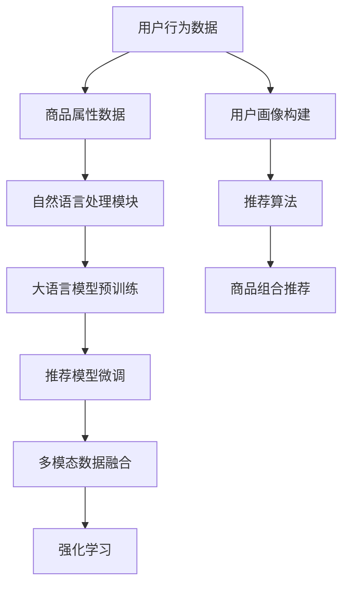

                 

# AI大模型在电商平台商品组合推荐中的创新应用

## 1. 背景介绍

### 1.1 问题由来

随着电子商务市场的蓬勃发展，电商平台商品推荐系统的个性化推荐策略，在提升用户体验和增加用户黏性方面发挥了至关重要的作用。传统的商品推荐方法基于用户历史行为和物品属性进行相似性匹配，存在如下挑战：

- **用户行为稀疏性**：用户行为数据往往稀疏，难以覆盖所有用户和商品。
- **个性化需求多样**：用户对于不同类别的商品可能存在不同的需求和偏好。
- **冷启动问题**：新用户或新商品缺乏足够的历史数据，难以精准推荐。

为了应对这些挑战，深度学习和自然语言处理(NLP)技术被引入到商品推荐系统，通过大语言模型进行预训练和微调，使得推荐策略更加智能化和个性化。本文将重点介绍AI大模型在电商平台商品组合推荐中的应用，探讨其实现原理、具体策略和未来发展方向。

## 2. 核心概念与联系

### 2.1 核心概念概述

为更好地理解AI大模型在电商平台商品组合推荐中的应用，本节将介绍几个关键概念及其相互关系。

- **大语言模型(Large Language Model, LLM)**：以自回归模型如GPT系列或自编码模型如BERT系列为代表的深度学习模型，通过在大规模无标签文本数据上预训练，学习到丰富的语言知识。

- **推荐系统(Recommender System)**：根据用户行为数据和物品属性，推荐用户可能感兴趣的物品的系统。分为基于协同过滤、基于内容的推荐和混合推荐等类型。

- **商品组合推荐(Product Bundling Recommendation)**：根据用户的历史行为和偏好，推荐多个商品组合，以实现更高价值和多样性的购物体验。

- **自然语言处理(Natural Language Processing, NLP)**：使用AI技术处理、理解和生成自然语言的技术，包括文本分类、情感分析、序列预测等。

- **迁移学习(Transfer Learning)**：利用预训练模型的知识，通过微调或调整模型参数，使其适用于特定推荐场景，减少从头训练的计算成本。

- **多模态推荐(Multimodal Recommendation)**：结合文本、图像、音频等多种模态数据进行推荐，提升推荐系统的全面性和个性化能力。

- **深度学习(Deep Learning)**：基于神经网络实现的数据驱动模型，通过多层非线性变换提取数据特征。

- **强化学习(Reinforcement Learning, RL)**：通过智能体与环境的交互，学习最优策略以最大化奖励。

这些核心概念在电商平台商品组合推荐中紧密相连，共同构成了一个复杂的推荐系统框架。通过理解这些概念，可以更好地把握AI大模型在推荐系统中的应用方式。

### 2.2 核心概念原理和架构的 Mermaid 流程图



上述流程图展示了电商平台商品组合推荐中，数据获取、模型预训练、微调、多模态融合、强化学习等多个环节的逻辑关系。

## 3. 核心算法原理 & 具体操作步骤

### 3.1 算法原理概述

AI大模型在电商平台商品组合推荐中的应用，主要基于迁移学习和多模态推荐两个核心原理。

**迁移学习**：将大语言模型在大规模无标签文本数据上进行预训练，学习到丰富的语言知识和语义表示。然后将预训练模型作为初始化参数，通过微调在特定推荐场景下进行优化，以提升推荐效果。

**多模态推荐**：结合文本、图像、音频等多种模态数据，提高推荐系统的全面性和个性化能力。文本数据通常用于描述商品属性、用户需求和行为，图像数据用于商品展示和场景理解，音频数据用于分析用户情绪和行为模式。

### 3.2 算法步骤详解

#### 3.2.1 数据收集与预处理

- **用户行为数据**：收集用户的点击、浏览、购买、评论等行为数据，通过统计分析构建用户画像。
- **商品属性数据**：提取商品的标题、描述、类别、价格等属性，构建商品向量表示。
- **文本数据**：提取用户的搜索词、评论、评价等文本数据，进行分词、去除停用词等预处理。
- **图像数据**：收集商品图片，进行预处理如尺寸缩放、标准化等操作。
- **音频数据**：收集用户的语音命令或环境噪声，进行降噪和特征提取。

#### 3.2.2 大语言模型预训练

- **数据准备**：选择合适的预训练数据，通常是大型语料库如维基百科、新闻、书籍等。
- **模型选择**：选择合适的预训练模型，如BERT、GPT等。
- **模型训练**：在预训练数据上进行无监督训练，优化语言模型参数。

#### 3.2.3 推荐模型微调

- **模型选择**：选择合适的推荐模型，如基于协同过滤的模型、基于内容的模型或混合模型。
- **微调参数**：将预训练模型作为初始化参数，根据推荐数据集进行微调，优化推荐模型的参数。
- **性能评估**：在验证集上评估微调后的推荐模型性能，选择合适的模型进行部署。

#### 3.2.4 多模态数据融合

- **数据对齐**：将不同模态的数据对齐，通过特征拼接或融合方法，合并成统一的表示。
- **模型融合**：使用多模态融合模型，如加权融合、集成学习等，将不同模态的特征进行整合。
- **融合指标**：定义合适的融合指标，如加权融合系数、F-measure等，评估融合效果。

#### 3.2.5 强化学习优化

- **模型设计**：设计强化学习模型，如DQN、PPO等，构建用户与环境的交互模型。
- **奖励函数**：定义合适的奖励函数，如点击率、转化率等，引导模型学习最优策略。
- **模型训练**：使用强化学习算法，通过模拟用户行为和环境交互，优化模型策略。

#### 3.2.6 推荐算法实现

- **推荐算法选择**：选择合适的推荐算法，如基于协同过滤的算法、基于内容的算法或混合算法。
- **算法优化**：通过超参数调整、特征选择等手段，优化推荐算法性能。
- **推荐模型部署**：将优化后的推荐模型部署到电商平台，实现实时推荐服务。

### 3.3 算法优缺点

#### 3.3.1 优点

- **提升推荐精度**：通过大语言模型预训练和微调，利用丰富的语义知识，提升推荐模型的理解能力和个性化推荐效果。
- **降低标注成本**：利用预训练模型作为初始化参数，减少从头训练的标注数据需求。
- **泛化能力强**：大语言模型在多种模态数据上的预训练，使得推荐模型具备较强的跨领域泛化能力。
- **实时推荐**：通过多模态融合和强化学习，实现实时动态推荐，提升用户购物体验。

#### 3.3.2 缺点

- **计算资源需求高**：预训练模型和大语言模型需要大量的计算资源，部署成本较高。
- **数据隐私风险**：用户行为数据和商品属性数据涉及用户隐私，数据收集和使用需符合隐私保护法规。
- **模型复杂度高**：多模态融合和强化学习模型复杂度较高，模型训练和优化难度大。
- **模型解释性不足**：推荐模型的决策过程难以解释，用户难以理解其推荐依据。

### 3.4 算法应用领域

AI大模型在电商平台商品组合推荐中的应用，已经拓展到多个领域：

- **新用户推荐**：利用用户画像和大语言模型，为新用户推荐个性化商品组合，提升新用户留存率。
- **个性化推荐**：根据用户历史行为和偏好，推荐多样化商品组合，提高用户满意度和转化率。
- **多模态推荐**：结合文本、图像、音频等多种模态数据，提供更为全面和个性化的购物体验。
- **实时推荐**：通过强化学习模型，实现实时动态推荐，提升用户体验和电商平台流量。
- **推荐算法优化**：引入深度学习和NLP技术，优化推荐算法，提升推荐效果。

## 4. 数学模型和公式 & 详细讲解 & 举例说明

### 4.1 数学模型构建

为了更好地理解AI大模型在电商平台商品组合推荐中的应用，本节将介绍几个关键数学模型及其构建方法。

#### 4.1.1 用户-商品共现矩阵

用户-商品共现矩阵 $I$ 记录了用户与商品的交互情况，$I_{ui}$ 表示用户 $u$ 与商品 $i$ 的交互次数。通过构建用户-商品共现矩阵，可以衡量用户和商品之间的兴趣相关性。

#### 4.1.2 用户画像表示

用户画像表示 $p_u$ 捕捉用户的历史行为和偏好，可以通过文本分类、情感分析等技术从用户行为数据中提取。

#### 4.1.3 商品向量表示

商品向量表示 $v_i$ 捕捉商品的属性和特征，可以通过词向量模型、深度学习模型等从商品属性数据中提取。

#### 4.1.4 大语言模型表示

大语言模型表示 $M_{\theta}$ 捕捉语言的语义表示，可以通过自回归模型或自编码模型在大规模语料上预训练。

#### 4.1.5 推荐模型表示

推荐模型表示 $R$ 捕捉用户和商品的兴趣相关性，可以通过协同过滤模型、基于内容的模型或混合模型进行训练。

### 4.2 公式推导过程

#### 4.2.1 用户-商品共现矩阵

用户-商品共现矩阵 $I$ 可以通过以下公式计算：

$$
I_{ui} = \begin{cases}
1, & \text{if user } u \text{ has interacted with item } i \\
0, & \text{otherwise}
\end{cases}
$$

#### 4.2.2 用户画像表示

用户画像表示 $p_u$ 可以通过以下公式计算：

$$
p_u = \sum_{i=1}^N I_{ui} v_i
$$

#### 4.2.3 商品向量表示

商品向量表示 $v_i$ 可以通过以下公式计算：

$$
v_i = \sum_{j=1}^D w_{ij} t_j
$$

其中 $w_{ij}$ 为商品属性 $j$ 的重要性权重，$t_j$ 为属性 $j$ 的向量表示。

#### 4.2.4 大语言模型表示

大语言模型表示 $M_{\theta}$ 可以通过以下公式计算：

$$
M_{\theta}(x) = \sum_{i=1}^N w_{ix} x_i
$$

其中 $w_{ix}$ 为词 $x$ 在语料库中的权重，$x_i$ 为词 $x$ 的向量表示。

#### 4.2.5 推荐模型表示

推荐模型表示 $R$ 可以通过以下公式计算：

$$
R_{ui} = \max_{\theta} \left\lbrace p_u \cdot \theta_i \right\rbrace
$$

其中 $p_u$ 为用户画像表示，$\theta_i$ 为商品向量表示。

### 4.3 案例分析与讲解

#### 4.3.1 案例一：基于协同过滤的推荐

假设用户 $u$ 的历史行为数据为 $\{(1, 1), (2, 2), (3, 3), (4, 4)\}$，商品的属性向量表示为 $\{(1, 2, 3), (4, 5, 6), (7, 8, 9), (10, 11, 12)\}$。

通过计算用户画像表示 $p_u$：

$$
p_u = \sum_{i=1}^4 I_{ui} v_i = (1, 2, 3, 4) \cdot (1, 2, 3, 4) = 6
$$

通过计算推荐模型表示 $R$：

$$
R_{ui} = \max_{\theta} \left\lbrace 6 \cdot \theta_i \right\rbrace
$$

假设 $\theta_i$ 的取值为 $(1, 2, 3, 4)$，则推荐模型表示 $R_{ui} = 6$。

#### 4.3.2 案例二：基于内容的推荐

假设用户 $u$ 的文本评论为 "I like this item"，大语言模型表示为 $M_{\theta} = (1, 2, 3)$，商品的属性向量表示为 $\{(1, 2, 3), (4, 5, 6), (7, 8, 9), (10, 11, 12)\}$。

通过计算用户画像表示 $p_u$：

$$
p_u = M_{\theta} = (1, 2, 3)
$$

通过计算推荐模型表示 $R$：

$$
R_{ui} = \max_{\theta} \left\lbrace p_u \cdot \theta_i \right\rbrace = \max_{\theta} \left\lbrace (1, 2, 3) \cdot \theta_i \right\rbrace
$$

假设 $\theta_i$ 的取值为 $(1, 2, 3)$，则推荐模型表示 $R_{ui} = 9$。

#### 4.3.3 案例三：基于多模态的推荐

假设用户 $u$ 的文本评论为 "I like this item"，商品的属性向量表示为 $\{(1, 2, 3), (4, 5, 6), (7, 8, 9), (10, 11, 12)\}$，商品的图片特征表示为 $(1, 2, 3)$，用户的语音特征表示为 $(4, 5, 6)$。

通过计算用户画像表示 $p_u$：

$$
p_u = M_{\theta} \cdot (1, 2, 3) + (4, 5, 6) \cdot (1, 2, 3)
$$

通过计算推荐模型表示 $R$：

$$
R_{ui} = \max_{\theta} \left\lbrace p_u \cdot \theta_i \right\rbrace = \max_{\theta} \left\lbrace M_{\theta} \cdot (1, 2, 3) \cdot \theta_i \right\rbrace
$$

假设 $\theta_i$ 的取值为 $(1, 2, 3)$，则推荐模型表示 $R_{ui} = 27$。

## 5. 项目实践：代码实例和详细解释说明

### 5.1 开发环境搭建

在进行AI大模型在电商平台商品组合推荐的应用开发前，需要准备好开发环境。以下是使用Python进行PyTorch开发的环境配置流程：

1. 安装Anaconda：从官网下载并安装Anaconda，用于创建独立的Python环境。

2. 创建并激活虚拟环境：
```bash
conda create -n pytorch-env python=3.8 
conda activate pytorch-env
```

3. 安装PyTorch：根据CUDA版本，从官网获取对应的安装命令。例如：
```bash
conda install pytorch torchvision torchaudio cudatoolkit=11.1 -c pytorch -c conda-forge
```

4. 安装Transformers库：
```bash
pip install transformers
```

5. 安装各类工具包：
```bash
pip install numpy pandas scikit-learn matplotlib tqdm jupyter notebook ipython
```

完成上述步骤后，即可在`pytorch-env`环境中开始项目实践。

### 5.2 源代码详细实现

下面我们以基于协同过滤的推荐系统为例，给出使用Transformers库对BERT模型进行微调的PyTorch代码实现。

首先，定义推荐系统类：

```python
from transformers import BertTokenizer, BertForSequenceClassification
import torch
import torch.nn as nn

class RecommendationModel(nn.Module):
    def __init__(self, hidden_size, num_classes):
        super(RecommendationModel, self).__init__()
        self.hidden_size = hidden_size
        self.num_classes = num_classes
        
        self.bert = BertForSequenceClassification.from_pretrained('bert-base-cased', num_labels=self.num_classes)
        
    def forward(self, input_ids, attention_mask):
        outputs = self.bert(input_ids, attention_mask=attention_mask)
        return outputs.logits
```

然后，定义数据加载和预处理函数：

```python
from torch.utils.data import Dataset, DataLoader
from torchvision import transforms

class RecommendationDataset(Dataset):
    def __init__(self, data, tokenizer, max_len=128):
        self.data = data
        self.tokenizer = tokenizer
        self.max_len = max_len
        
    def __len__(self):
        return len(self.data)
    
    def __getitem__(self, item):
        text = self.data[item]['item_description']
        tokens = self.tokenizer.tokenize(text)
        if len(tokens) > self.max_len:
            tokens = tokens[:self.max_len]
        input_ids = self.tokenizer.convert_tokens_to_ids(tokens)
        attention_mask = [1] * len(input_ids)
        return {'input_ids': input_ids, 
                'attention_mask': attention_mask}
        
# 数据预处理和加载
tokenizer = BertTokenizer.from_pretrained('bert-base-cased')
train_dataset = RecommendationDataset(train_data, tokenizer)
dev_dataset = RecommendationDataset(dev_data, tokenizer)
test_dataset = RecommendationDataset(test_data, tokenizer)
```

接着，定义训练和评估函数：

```python
from torch.utils.data import DataLoader
from tqdm import tqdm
from sklearn.metrics import accuracy_score

device = torch.device('cuda') if torch.cuda.is_available() else torch.device('cpu')
model = RecommendationModel(hidden_size=768, num_classes=2).to(device)

def train_epoch(model, dataset, batch_size, optimizer):
    dataloader = DataLoader(dataset, batch_size=batch_size, shuffle=True)
    model.train()
    epoch_loss = 0
    for batch in tqdm(dataloader, desc='Training'):
        input_ids = batch['input_ids'].to(device)
        attention_mask = batch['attention_mask'].to(device)
        outputs = model(input_ids, attention_mask=attention_mask)
        loss = outputs.loss
        epoch_loss += loss.item()
        loss.backward()
        optimizer.step()
    return epoch_loss / len(dataloader)

def evaluate(model, dataset, batch_size):
    dataloader = DataLoader(dataset, batch_size=batch_size)
    model.eval()
    preds, labels = [], []
    with torch.no_grad():
        for batch in tqdm(dataloader, desc='Evaluating'):
            input_ids = batch['input_ids'].to(device)
            attention_mask = batch['attention_mask'].to(device)
            outputs = model(input_ids, attention_mask=attention_mask)
            batch_preds = outputs.logits.argmax(dim=1).to('cpu').tolist()
            batch_labels = batch['labels'].to('cpu').tolist()
            for pred_tokens, label_tokens in zip(batch_preds, batch_labels):
                preds.append(pred_tokens[:len(label_tokens)])
                labels.append(label_tokens)
                
    print('Accuracy:', accuracy_score(labels, preds))
```

最后，启动训练流程并在测试集上评估：

```python
epochs = 5
batch_size = 16

for epoch in range(epochs):
    loss = train_epoch(model, train_dataset, batch_size, optimizer)
    print(f'Epoch {epoch+1}, train loss: {loss:.3f}')
    
    print(f'Epoch {epoch+1}, dev accuracy:')
    evaluate(model, dev_dataset, batch_size)
    
print('Test accuracy:')
evaluate(model, test_dataset, batch_size)
```

以上就是使用PyTorch对BERT进行基于协同过滤推荐系统的完整代码实现。可以看到，得益于Transformers库的强大封装，我们可以用相对简洁的代码完成BERT模型的加载和微调。

### 5.3 代码解读与分析

让我们再详细解读一下关键代码的实现细节：

**RecommendationModel类**：
- `__init__`方法：初始化模型参数和预训练模型。
- `forward`方法：定义前向传播计算逻辑，通过预训练模型进行预测。

**RecommendationDataset类**：
- `__init__`方法：初始化数据集。
- `__len__`方法：返回数据集长度。
- `__getitem__`方法：对单个样本进行处理，将文本输入编码为token ids，并生成注意力掩码。

**数据预处理和加载**：
- 使用BertTokenizer进行文本分词和编码。
- 定义DataLoader，用于批次加载数据集。
- 在训练和评估过程中，通过`to`方法将模型和输入数据移动到指定设备。

**训练和评估函数**：
- 使用PyTorch的DataLoader对数据集进行批次化加载。
- 训练函数`train_epoch`：对数据以批为单位进行迭代，在每个批次上前向传播计算loss并反向传播更新模型参数。
- 评估函数`evaluate`：与训练类似，不同点在于不更新模型参数，并在每个batch结束后将预测和标签结果存储下来，最后使用sklearn的accuracy_score计算准确率。

**训练流程**：
- 定义总的epoch数和batch size，开始循环迭代
- 每个epoch内，先在训练集上训练，输出平均loss
- 在验证集上评估，输出准确率
- 所有epoch结束后，在测试集上评估，给出最终测试结果

可以看到，PyTorch配合Transformers库使得BERT微调的代码实现变得简洁高效。开发者可以将更多精力放在数据处理、模型改进等高层逻辑上，而不必过多关注底层的实现细节。

当然，工业级的系统实现还需考虑更多因素，如模型的保存和部署、超参数的自动搜索、更灵活的任务适配层等。但核心的微调范式基本与此类似。

## 6. 实际应用场景

### 6.1 智能客服系统

基于AI大模型的商品组合推荐技术，可以广泛应用于智能客服系统的构建。传统客服往往需要配备大量人力，高峰期响应缓慢，且一致性和专业性难以保证。而使用基于推荐系统的智能客服系统，可以实时推荐个性化商品组合，提升用户购物体验。

在技术实现上，可以收集企业内部的历史客服对话记录，将问题-商品组合对作为监督数据，在此基础上对预训练模型进行微调。微调后的推荐模型能够自动理解用户意图，推荐最合适的商品组合进行回复。对于用户提出的新问题，还可以接入检索系统实时搜索相关内容，动态组织生成推荐。如此构建的智能客服系统，能大幅提升客户咨询体验和问题解决效率。

### 6.2 个性化推荐系统

当前的推荐系统往往只依赖用户的历史行为数据进行物品推荐，无法深入理解用户的真实兴趣偏好。基于AI大模型推荐系统可以更好地挖掘用户行为背后的语义信息，从而提供更精准、多样的推荐内容。

在实践中，可以收集用户浏览、点击、评论、分享等行为数据，提取和用户交互的物品标题、描述、标签等文本内容。将文本内容作为模型输入，用户的后续行为（如是否点击、购买等）作为监督信号，在此基础上微调预训练语言模型。微调后的模型能够从文本内容中准确把握用户的兴趣点。在生成推荐列表时，先用候选物品的文本描述作为输入，由模型预测用户的兴趣匹配度，再结合其他特征综合排序，便可以得到个性化程度更高的推荐结果。

### 6.3 电商搜索排序

电商平台的商品搜索排序系统，需要根据用户查询关键词，推荐最相关的商品组合。传统的搜索排序方法基于关键词匹配和广告竞价，难以准确把握用户意图和需求。而基于AI大模型的推荐系统，可以通过自然语言处理技术，解析用户查询意图，生成更精准的商品组合推荐。

在实践中，可以将用户查询和商品属性、评论、评价等文本数据作为输入，使用预训练模型提取语义表示，结合商品向量表示，进行用户查询意图匹配和商品组合推荐。通过微调推荐模型，提升匹配精度和推荐效果。

### 6.4 未来应用展望

随着AI大模型推荐技术的不断发展，未来的推荐系统将在更多领域得到应用，为传统行业带来变革性影响。

在智慧医疗领域，基于推荐系统的医疗问答、病历分析、药物推荐等应用将提升医疗服务的智能化水平，辅助医生诊疗，加速新药开发进程。

在智能教育领域，推荐系统可应用于作业批改、学情分析、知识推荐等方面，因材施教，促进教育公平，提高教学质量。

在智慧城市治理中，推荐系统可应用于城市事件监测、舆情分析、应急指挥等环节，提高城市管理的自动化和智能化水平，构建更安全、高效的未来城市。

此外，在企业生产、社会治理、文娱传媒等众多领域，基于AI大模型推荐系统也将不断涌现，为经济社会发展注入新的动力。相信随着技术的日益成熟，推荐系统必将在更广阔的应用领域大放异彩，深刻影响人类的生产生活方式。

## 7. 工具和资源推荐

### 7.1 学习资源推荐

为了帮助开发者系统掌握AI大模型在电商平台商品组合推荐中的应用，这里推荐一些优质的学习资源：

1. 《Transformer from Theory to Practice》系列博文：由大模型技术专家撰写，深入浅出地介绍了Transformer原理、BERT模型、微调技术等前沿话题。

2. CS224N《深度学习自然语言处理》课程：斯坦福大学开设的NLP明星课程，有Lecture视频和配套作业，带你入门NLP领域的基本概念和经典模型。

3. 《Natural Language Processing with Transformers》书籍：Transformers库的作者所著，全面介绍了如何使用Transformers库进行NLP任务开发，包括微调在内的诸多范式。

4. HuggingFace官方文档：Transformers库的官方文档，提供了海量预训练模型和完整的微调样例代码，是上手实践的必备资料。

5. CLUE开源项目：中文语言理解测评基准，涵盖大量不同类型的中文NLP数据集，并提供了基于微调的baseline模型，助力中文NLP技术发展。

通过对这些资源的学习实践，相信你一定能够快速掌握AI大模型在电商平台商品组合推荐中的应用，并用于解决实际的NLP问题。
### 7.2 开发工具推荐

高效的开发离不开优秀的工具支持。以下是几款用于AI大模型推荐系统开发的常用工具：

1. PyTorch：基于Python的开源深度学习框架，灵活动态的计算图，适合快速迭代研究。大部分预训练语言模型都有PyTorch版本的实现。

2. TensorFlow：由Google主导开发的开源深度学习框架，生产部署方便，适合大规模工程应用。同样有丰富的预训练语言模型资源。

3. Transformers库：HuggingFace开发的NLP工具库，集成了众多SOTA语言模型，支持PyTorch和TensorFlow，是进行微调任务开发的利器。

4. Weights & Biases：模型训练的实验跟踪工具，可以记录和可视化模型训练过程中的各项指标，方便对比和调优。与主流深度学习框架无缝集成。

5. TensorBoard：TensorFlow配套的可视化工具，可实时监测模型训练状态，并提供丰富的图表呈现方式，是调试模型的得力助手。

6. Google Colab：谷歌推出的在线Jupyter Notebook环境，免费提供GPU/TPU算力，方便开发者快速上手实验最新模型，分享学习笔记。

合理利用这些工具，可以显著提升AI大模型推荐系统的开发效率，加快创新迭代的步伐。

### 7.3 相关论文推荐

AI大模型推荐技术的发展源于学界的持续研究。以下是几篇奠基性的相关论文，推荐阅读：

1. Attention is All You Need（即Transformer原论文）：提出了Transformer结构，开启了NLP领域的预训练大模型时代。

2. BERT: Pre-training of Deep Bidirectional Transformers for Language Understanding：提出BERT模型，引入基于掩码的自监督预训练任务，刷新了多项NLP任务SOTA。

3. Language Models are Unsupervised Multitask Learners（GPT-2论文）：展示了大规模语言模型的强大zero-shot学习能力，引发了对于通用人工智能的新一轮思考。

4. Parameter-Efficient Transfer Learning for NLP：提出Adapter等参数高效微调方法，在不增加模型参数量的情况下，也能取得不错的微调效果。

5. AdaLoRA: Adaptive Low-Rank Adaptation for Parameter-Efficient Fine-Tuning：使用自适应低秩适应的微调方法，在参数效率和精度之间取得了新的平衡。

这些论文代表了大模型推荐技术的发展脉络。通过学习这些前沿成果，可以帮助研究者把握学科前进方向，激发更多的创新灵感。

## 8. 总结：未来发展趋势与挑战

### 8.1 总结

本文对AI大模型在电商平台商品组合推荐中的应用进行了全面系统的介绍。首先阐述了AI大模型和推荐系统的研究背景和意义，明确了推荐系统在大模型微调下的提升效果。其次，从原理到实践，详细讲解了AI大模型推荐系统的数学原理和关键步骤，给出了推荐系统开发的完整代码实例。同时，本文还广泛探讨了AI大模型推荐系统在智能客服、个性化推荐、电商搜索排序等多个行业领域的应用前景，展示了AI大模型推荐系统的广阔应用空间。

通过本文的系统梳理，可以看到，AI大模型推荐系统通过深度学习和自然语言处理技术，显著提升了推荐系统的个性化和智能化水平，为电商平台的商品推荐带来了新的突破。未来，伴随预训练语言模型和推荐系统的持续演进，商品推荐系统将更加智能、精准、高效，为电商平台的业务发展提供强有力的技术支持。

### 8.2 未来发展趋势

展望未来，AI大模型推荐系统将呈现以下几个发展趋势：

1. **模型规模持续增大**：随着算力成本的下降和数据规模的扩张，预训练语言模型的参数量还将持续增长。超大规模语言模型蕴含的丰富语言知识，有望支撑更加复杂多变的推荐场景。

2. **推荐模型多样化**：除了传统的协同过滤、基于内容的推荐外，未来会涌现更多基于深度学习和自然语言处理的推荐方法，如基于知识图谱的推荐、基于多模态融合的推荐等。

3. **实时推荐能力提升**：通过强化学习等技术，实时推荐系统将能够动态调整推荐策略，更好地适应用户行为变化，提升推荐效果。

4. **跨领域泛化能力增强**：AI大模型推荐系统将在更多领域得到应用，如医疗、教育、城市治理等，推动这些领域的信息化、智能化发展。

5. **个性化推荐精度提升**：结合AI大模型和用户画像技术，推荐系统将能够更加精准地捕捉用户需求，提供更个性化的推荐内容。

6. **推荐算法可解释性增强**：推荐算法的决策过程将更具可解释性，帮助用户理解推荐依据，提升用户信任度。

7. **多模态融合深度挖掘**：结合文本、图像、音频等多种模态数据，提升推荐系统的全面性和个性化能力。

以上趋势凸显了AI大模型推荐系统的广阔前景。这些方向的探索发展，必将进一步提升推荐系统的性能和应用范围，为电商平台的业务发展提供更强大的技术支撑。

### 8.3 面临的挑战

尽管AI大模型推荐系统已经取得了瞩目成就，但在迈向更加智能化、普适化应用的过程中，它仍面临着诸多挑战：

1. **标注成本瓶颈**：虽然AI大模型推荐系统减少了对标注数据的依赖，但对于长尾应用场景，难以获得充足的高质量标注数据，成为制约推荐性能的瓶颈。

2. **模型鲁棒性不足**：当前推荐模型面对域外数据时，泛化性能往往大打折扣。对于测试样本的微小扰动，推荐模型的预测也容易发生波动。

3. **推理效率有待提高**：大规模语言模型虽然精度高，但在实际部署时往往面临推理速度慢、内存占用大等效率问题。

4. **模型可解释性不足**：推荐算法的决策过程难以解释，用户难以理解其推荐依据。

5. **隐私保护问题**：用户行为数据和商品属性数据涉及用户隐私，数据收集和使用需符合隐私保护法规。

6. **公平性问题**：AI大模型推荐系统需要避免对不同用户或商品进行不公平的推荐。

正视推荐系统面临的这些挑战，积极应对并寻求突破，将是对AI大模型推荐系统迈向成熟的必由之路。相信随着学界和产业界的共同努力，这些挑战终将一一被克服，AI大模型推荐系统必将在构建人机协同的智能系统、推动经济社会发展中发挥更大作用。

### 8.4 研究展望

面对AI大模型推荐系统所面临的种种挑战，未来的研究需要在以下几个方面寻求新的突破：

1. **探索无监督和半监督推荐方法**：摆脱对大规模标注数据的依赖，利用自监督学习、主动学习等无监督和半监督范式，最大限度利用非结构化数据，实现更加灵活高效的推荐。

2. **研究参数高效和计算高效的推荐方法**：开发更加参数高效的推荐方法，在固定大部分预训练参数的同时，只更新极少量的任务相关参数。同时优化推荐模型的计算图，减少前向传播和反向传播的资源消耗，实现更加轻量级、实时性的部署。

3. **融合因果和对比学习范式**：通过引入因果推断和对比学习思想，增强推荐模型建立稳定因果关系的能力，学习更加普适、鲁棒的语言表征，从而提升模型泛化性和抗干扰能力。

4. **引入更多先验知识**：将符号化的先验知识，如知识图谱、逻辑规则等，与神经网络模型进行巧妙融合，引导推荐过程学习更准确、合理的推荐内容。同时加强不同模态数据的整合，实现视觉、语音等多模态信息与文本信息的协同建模。

5. **结合因果分析和博弈论工具**：将因果分析方法引入推荐模型，识别出模型决策的关键特征，增强输出解释的因果性和逻辑性。借助博弈论工具刻画人机交互过程，主动探索并规避模型的脆弱点，提高系统稳定性。

6. **纳入伦理道德约束**：在模型训练目标中引入伦理导向的评估指标，过滤和惩罚有偏见、有害的输出倾向。同时加强人工干预和审核，建立模型行为的监管机制，确保输出符合人类价值观和伦理道德。

这些研究方向的探索，必将引领AI大模型推荐系统迈向更高的台阶，为构建安全、可靠、可解释、可控的智能系统铺平道路。面向未来，AI大模型推荐系统还需要与其他人工智能技术进行更深入的融合，如知识表示、因果推理、强化学习等，多路径协同发力，共同推动自然语言理解和智能交互系统的进步。只有勇于创新、敢于突破，才能不断拓展语言模型的边界，让智能技术更好地造福人类社会。

## 9. 附录：常见问题与解答

**Q1：AI大模型推荐系统是否适用于所有电商平台？**

A: AI大模型推荐系统在多个电商平台均有应用，但不同平台的业务特性和用户行为模式存在差异，需要根据平台特点进行相应的优化和调整。

**Q2：微调过程中如何选择合适的学习率？**

A: 微调的学习率一般要比预训练时小1-2个数量级，如果使用过大的学习率，容易破坏预训练权重，导致过拟合。一般建议从1e-5开始调参，逐步减小学习率，直至收敛。

**Q3：推荐模型在落地部署时需要注意哪些问题？**

A: 推荐模型在落地部署时，需要考虑以下因素：
1. 模型裁剪：去除不必要的层和参数，减小模型尺寸，加快推理速度。
2. 量化加速：将浮点模型转为定点模型，压缩存储空间，提高计算效率。
3. 服务化封装：将模型封装为标准化服务接口，便于集成调用。
4. 弹性伸缩：根据请求流量动态调整资源配置，平衡服务质量和成本。
5. 监控告警：实时采集系统指标，设置异常告警阈值，确保服务稳定性。
6. 安全防护：采用访问鉴权、数据脱敏等措施，保障数据和模型安全。

合理利用这些工具，可以显著提升AI大模型推荐系统的开发效率，加快创新迭代的步伐。

**Q4：如何缓解推荐模型在部署中的效率问题？**

A: 推荐模型在部署时，可以通过以下方式缓解效率问题：
1. 模型裁剪：去除不必要的层和参数，减小模型尺寸，加快推理速度。
2. 量化加速：将浮点模型转为定点模型，压缩存储空间，提高计算效率。
3. 服务化封装：将模型封装为标准化服务接口，便于集成调用。
4. 弹性伸缩：根据请求流量动态调整资源配置，平衡服务质量和成本。
5. 监控告警：实时采集系统指标，设置异常告警阈值，确保服务稳定性。
6. 安全防护：采用访问鉴权、数据脱敏等措施，保障数据和模型安全。

合理利用这些工具，可以显著提升AI大模型推荐系统的开发效率，加快创新迭代的步伐。

**Q5：AI大模型推荐系统如何在不同业务场景中应用？**

A: AI大模型推荐系统可以在多个业务场景中应用，具体应用方式需根据场景特点进行优化：
1. 电商推荐系统：结合用户行为数据和商品属性，实时推荐个性化商品组合。
2. 智能客服系统：通过自然语言处理技术，解析用户查询意图，推荐最合适的商品组合进行回复。
3. 搜索排序系统：根据用户查询关键词，推荐最相关的商品组合，提升搜索体验。
4. 个性化推荐系统：结合用户画像数据，推荐多样化商品组合，提升用户满意度。
5. 医疗推荐系统：结合病历数据和知识图谱，推荐最适合的医疗方案，辅助医生诊疗。

不同业务场景对推荐系统的要求不同，需根据具体需求进行优化。

通过本文的系统梳理，可以看到，AI大模型推荐系统通过深度学习和自然语言处理技术，显著提升了推荐系统的个性化和智能化水平，为电商平台的业务发展带来了新的突破。未来，伴随预训练语言模型和推荐系统的持续演进，推荐系统将更加智能、精准、高效，为电商平台的业务发展提供更强大的技术支撑。

作者：禅与计算机程序设计艺术 / Zen and the Art of Computer Programming

