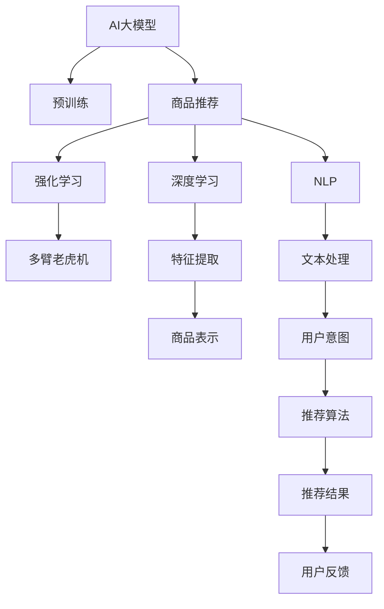

                 

# AI大模型在电商平台商品组合推荐中的应用

> 关键词：AI大模型, 商品推荐, 电商平台, 商品组合, 推荐系统, 自然语言处理(NLP), 深度学习, 强化学习

## 1. 背景介绍

### 1.1 问题由来
随着电子商务的蓬勃发展，电商平台面临着日益激烈的市场竞争。用户对个性化推荐服务的需求日益增长，期望平台能够提供符合自己兴趣和需求的商品组合。然而，传统的商品推荐系统大多基于用户的历史行为数据，难以捕捉到用户多样化的兴趣偏好，导致推荐效果不够理想。

近年来，大模型技术的快速崛起为商品推荐系统带来了新的解决方案。AI大模型通过在大规模无标签数据上进行自监督预训练，学习到丰富的语言和数据特征，能够捕获到用户的潜在需求，提升推荐系统的精准性和多样性。通过结合AI大模型的深度学习和自然语言处理技术，电商平台可以为用户提供更具个性化的商品组合推荐，提升用户体验和平台转化率。

### 1.2 问题核心关键点
本文聚焦于AI大模型在电商平台商品组合推荐中的应用，从原理到实践，深入探讨了如何将大模型技术与推荐系统结合起来，实现更精准、高效的推荐效果。具体包括：

- AI大模型在推荐系统中的应用原理
- 基于大模型的商品推荐算法设计
- 数据预处理与模型训练的详细流程
- 实际应用场景的案例分析与讲解
- 推荐系统中的常见问题与解决方案

## 2. 核心概念与联系

### 2.1 核心概念概述

为更好地理解AI大模型在电商平台商品推荐中的应用，本节将介绍几个密切相关的核心概念：

- **AI大模型（AI Large Model）**：指在大规模无标签数据上通过自监督学习训练得到的大型预训练语言模型，如GPT、BERT、DALL-E等。这些模型具备强大的语言理解和生成能力，能够处理复杂的自然语言任务。

- **电商平台（E-commerce Platform）**：指以在线销售为核心业务，集商品展示、交易、物流、用户服务于一体的综合性电商网站或APP。

- **商品组合推荐（Product Combination Recommendation）**：指针对用户的个性化需求，提供多种商品搭配的推荐方案，包括单个商品、多商品组合和套餐推荐等。

- **推荐系统（Recommendation System）**：指通过算法推荐给用户可能感兴趣的物品的系统，广泛应用于电商、社交、新闻、视频等平台。

- **自然语言处理（Natural Language Processing, NLP）**：指使用计算方法来处理和理解人类语言的技术，包括文本预处理、情感分析、意图识别、机器翻译等。

- **深度学习（Deep Learning）**：指通过多层神经网络来学习和提取数据特征的机器学习方法，能够处理复杂的非线性问题。

- **强化学习（Reinforcement Learning）**：指通过奖励和惩罚来训练智能体以做出最优决策的学习方法，常用于推荐系统中的多臂老虎机问题。

这些核心概念之间的逻辑关系可以通过以下Mermaid流程图来展示：



这个流程图展示了大模型在商品推荐系统中的应用路径：

1. 大模型通过预训练获得基础的语言和数据特征提取能力。
2. 推荐系统使用深度学习、NLP、强化学习等技术进行特征提取和推荐算法设计。
3. 特征提取模块将商品和用户信息编码成模型可处理的表示，输入到深度学习或强化学习算法中。
4. 算法输出推荐结果，经过用户反馈循环优化，提升推荐效果。

## 3. 核心算法原理 & 具体操作步骤
### 3.1 算法原理概述

基于AI大模型的商品推荐系统，通常采用深度学习框架进行推荐算法的设计和训练。其核心思想是：将商品和用户信息通过NLP技术编码成高维向量，输入到深度神经网络中进行特征提取和相似度计算，并结合强化学习算法进行推荐结果的生成和优化。

具体来说，假设电商平台上的商品集合为 $C$，用户集合为 $U$。商品和用户可以表示为向量 $x_c \in \mathbb{R}^d$ 和 $x_u \in \mathbb{R}^d$。假设用户对商品 $c$ 的评分向量为 $r_{uc} \in \mathbb{R}^d$。则推荐系统的目标是最大化用户对商品的评分预测值，即最大化：

$$
\max_{x_c, x_u} \sum_{u \in U} \sum_{c \in C} r_{uc} \cdot \hat{r}_{uc}(x_c, x_u)
$$

其中 $\hat{r}_{uc}(x_c, x_u)$ 为推荐模型对用户 $u$ 对商品 $c$ 的评分预测。

### 3.2 算法步骤详解

基于AI大模型的商品推荐系统通常包括以下几个关键步骤：

**Step 1: 数据准备与预处理**

- **数据收集**：从电商平台收集用户浏览、点击、购买等行为数据，以及商品属性、用户画像等静态信息，构建推荐系统所需的数据集。
- **数据清洗**：处理缺失值、异常值和重复数据，确保数据质量。
- **特征工程**：设计合理的特征工程流程，提取和生成有意义的特征，如用户兴趣标签、商品类别、评价评论等。

**Step 2: 大模型编码**

- **选择预训练模型**：选择如BERT、GPT等预训练语言模型，将其作为推荐系统中的基础特征提取器。
- **模型微调**：在电商平台的商品和用户数据上，对预训练模型进行微调，使其适应特定的推荐任务。

**Step 3: 特征提取**

- **商品表示**：将商品名称、描述、图片等信息通过NLP技术转换为向量表示，输入到预训练模型中，得到商品的语义特征表示。
- **用户表示**：将用户画像、历史行为等信息通过NLP技术转换为向量表示，输入到预训练模型中，得到用户的语义特征表示。

**Step 4: 深度学习推荐算法**

- **模型选择**：选择如深度神经网络、卷积神经网络、循环神经网络等深度学习模型，进行推荐算法的设计。
- **模型训练**：使用电商平台的标注数据集对模型进行训练，优化推荐算法，使其能够学习到商品和用户之间的关系。

**Step 5: 强化学习优化**

- **模型设计**：使用强化学习算法（如多臂老虎机）对推荐算法进行优化，通过奖励和惩罚机制提高推荐效果。
- **迭代优化**：在推荐系统运行过程中，不断接收用户反馈，动态调整推荐策略，提高推荐效果。

**Step 6: 推荐结果输出**

- **结果生成**：根据用户和商品的向量表示，使用推荐算法输出推荐结果，如商品ID、评分预测值等。
- **结果展示**：将推荐结果展示给用户，供其选择参考。

### 3.3 算法优缺点

基于AI大模型的商品推荐系统有以下优点：

- **多模态融合**：大模型能够处理多种模态数据，如文本、图片、视频等，提供更全面的商品和用户表示。
- **语义理解**：通过预训练模型，大模型能够理解和生成自然语言，捕捉用户的意图和需求，提升推荐准确性。
- **个性化推荐**：结合用户画像和历史行为数据，大模型能够提供更个性化的推荐方案，提高用户满意度。

同时，该方法也存在一些缺点：

- **数据依赖**：大模型的训练和微调需要大量的数据支持，数据质量对推荐效果有较大影响。
- **计算资源消耗**：大模型通常具有较大的参数量，训练和推理需要高性能计算资源。
- **模型复杂度**：深度学习模型的复杂性较高，需要精细的调参和优化，容易过拟合。
- **实时性问题**：大规模在线推荐系统对实时性和效率有较高要求，大模型的计算开销较大。

### 3.4 算法应用领域

基于AI大模型的商品推荐系统已经被广泛应用于各大电商平台，如亚马逊、阿里巴巴、京东等，为数亿用户提供了个性化推荐服务。具体应用场景包括：

- **个性化商品推荐**：根据用户浏览历史和行为数据，推荐可能感兴趣的商品。
- **商品搭配推荐**：推荐多种商品搭配，如时尚搭配、装修搭配等。
- **套餐推荐**：将多个商品组合成套餐，进行捆绑销售。
- **价格推荐**：根据用户偏好和市场变化，动态调整商品价格，提升用户购买率。

除了电商平台，AI大模型在金融、医疗、教育等多个领域也有着广泛的应用前景。未来，随着大模型技术的不断演进，基于AI大模型的推荐系统将能够更好地适应各种应用场景，为用户带来更优质的服务体验。

## 4. 数学模型和公式 & 详细讲解 & 举例说明
### 4.1 数学模型构建

在本节中，我们将通过数学模型构建的形式，详细讲解基于AI大模型的商品推荐系统。

假设电商平台的商品集合为 $C$，用户集合为 $U$。商品和用户可以表示为向量 $x_c \in \mathbb{R}^d$ 和 $x_u \in \mathbb{R}^d$。假设用户对商品 $c$ 的评分向量为 $r_{uc} \in \mathbb{R}^d$。则推荐系统的目标是最大化用户对商品的评分预测值，即最大化：

$$
\max_{x_c, x_u} \sum_{u \in U} \sum_{c \in C} r_{uc} \cdot \hat{r}_{uc}(x_c, x_u)
$$

其中 $\hat{r}_{uc}(x_c, x_u)$ 为推荐模型对用户 $u$ 对商品 $c$ 的评分预测。

### 4.2 公式推导过程

假设使用深度神经网络 $f(x_c, x_u; \theta)$ 对商品和用户向量进行特征提取和相似度计算，得到评分预测值 $\hat{r}_{uc}(x_c, x_u)$。则推荐系统的优化目标为：

$$
\max_{\theta} \sum_{u \in U} \sum_{c \in C} r_{uc} \cdot f(x_c, x_u; \theta)
$$

对于深度神经网络，通常使用交叉熵损失函数 $\mathcal{L}$ 进行模型训练。假设使用softmax函数将评分预测值 $\hat{r}_{uc}$ 转化为概率分布，则交叉熵损失函数为：

$$
\mathcal{L}(\theta) = -\frac{1}{N} \sum_{u \in U} \sum_{c \in C} r_{uc} \log f(x_c, x_u; \theta)
$$

其中 $N$ 为训练样本总数。

### 4.3 案例分析与讲解

假设使用BERT模型作为商品和用户的向量表示提取器，设计一个基于深度神经网络的推荐算法，其结构如图1所示：


图1 推荐算法结构示意图

假设使用Embedding层将商品和用户信息转换为向量表示，使用多层神经网络进行特征提取和评分预测，最终输出推荐结果。则推荐算法的优化目标为：

$$
\max_{\theta} \sum_{u \in U} \sum_{c \in C} r_{uc} \cdot \hat{r}_{uc}(x_c, x_u)
$$

在训练过程中，使用交叉熵损失函数进行模型优化，逐步调整模型参数 $\theta$，使得推荐模型能够准确预测用户对商品的评分。

## 5. 项目实践：代码实例和详细解释说明
### 5.1 开发环境搭建

在进行基于AI大模型的商品推荐系统开发前，需要先搭建好开发环境。以下是使用Python进行PyTorch开发的环境配置流程：

1. 安装Anaconda：从官网下载并安装Anaconda，用于创建独立的Python环境。

2. 创建并激活虚拟环境：
```bash
conda create -n pytorch-env python=3.8 
conda activate pytorch-env
```

3. 安装PyTorch：根据CUDA版本，从官网获取对应的安装命令。例如：
```bash
conda install pytorch torchvision torchaudio cudatoolkit=11.1 -c pytorch -c conda-forge
```

4. 安装Transformers库：
```bash
pip install transformers
```

5. 安装各类工具包：
```bash
pip install numpy pandas scikit-learn matplotlib tqdm jupyter notebook ipython
```

完成上述步骤后，即可在`pytorch-env`环境中开始开发实践。

### 5.2 源代码详细实现

下面我们以商品搭配推荐为例，给出使用Transformers库对BERT模型进行微调的PyTorch代码实现。

首先，定义商品搭配推荐的数据处理函数：

```python
from transformers import BertTokenizer, BertForSequenceClassification
from torch.utils.data import Dataset
import torch

class ProductRecommendationDataset(Dataset):
    def __init__(self, products, tags, tokenizer, max_len=128):
        self.products = products
        self.tags = tags
        self.tokenizer = tokenizer
        self.max_len = max_len
        
    def __len__(self):
        return len(self.products)
    
    def __getitem__(self, item):
        product = self.products[item]
        tags = self.tags[item]
        
        encoding = self.tokenizer(product, return_tensors='pt', max_length=self.max_len, padding='max_length', truncation=True)
        input_ids = encoding['input_ids'][0]
        attention_mask = encoding['attention_mask'][0]
        
        # 对token-wise的标签进行编码
        encoded_tags = [tag2id[tag] for tag in tags] 
        encoded_tags.extend([tag2id['O']] * (self.max_len - len(encoded_tags)))
        labels = torch.tensor(encoded_tags, dtype=torch.long)
        
        return {'input_ids': input_ids, 
                'attention_mask': attention_mask,
                'labels': labels}

# 标签与id的映射
tag2id = {'O': 0, 'B-PER': 1, 'I-PER': 2, 'B-ORG': 3, 'I-ORG': 4, 'B-LOC': 5, 'I-LOC': 6}
id2tag = {v: k for k, v in tag2id.items()}

# 创建dataset
tokenizer = BertTokenizer.from_pretrained('bert-base-cased')

train_dataset = ProductRecommendationDataset(train_products, train_tags, tokenizer)
dev_dataset = ProductRecommendationDataset(dev_products, dev_tags, tokenizer)
test_dataset = ProductRecommendationDataset(test_products, test_tags, tokenizer)
```

然后，定义模型和优化器：

```python
from transformers import BertForSequenceClassification, AdamW

model = BertForSequenceClassification.from_pretrained('bert-base-cased', num_labels=len(tag2id))

optimizer = AdamW(model.parameters(), lr=2e-5)
```

接着，定义训练和评估函数：

```python
from torch.utils.data import DataLoader
from tqdm import tqdm
from sklearn.metrics import classification_report

device = torch.device('cuda') if torch.cuda.is_available() else torch.device('cpu')
model.to(device)

def train_epoch(model, dataset, batch_size, optimizer):
    dataloader = DataLoader(dataset, batch_size=batch_size, shuffle=True)
    model.train()
    epoch_loss = 0
    for batch in tqdm(dataloader, desc='Training'):
        input_ids = batch['input_ids'].to(device)
        attention_mask = batch['attention_mask'].to(device)
        labels = batch['labels'].to(device)
        model.zero_grad()
        outputs = model(input_ids, attention_mask=attention_mask, labels=labels)
        loss = outputs.loss
        epoch_loss += loss.item()
        loss.backward()
        optimizer.step()
    return epoch_loss / len(dataloader)

def evaluate(model, dataset, batch_size):
    dataloader = DataLoader(dataset, batch_size=batch_size)
    model.eval()
    preds, labels = [], []
    with torch.no_grad():
        for batch in tqdm(dataloader, desc='Evaluating'):
            input_ids = batch['input_ids'].to(device)
            attention_mask = batch['attention_mask'].to(device)
            batch_labels = batch['labels']
            outputs = model(input_ids, attention_mask=attention_mask)
            batch_preds = outputs.logits.argmax(dim=2).to('cpu').tolist()
            batch_labels = batch_labels.to('cpu').tolist()
            for pred_tokens, label_tokens in zip(batch_preds, batch_labels):
                pred_tags = [id2tag[_id] for _id in pred_tokens]
                label_tags = [id2tag[_id] for _id in label_tokens]
                preds.append(pred_tags[:len(label_tags)])
                labels.append(label_tags)
                
    print(classification_report(labels, preds))
```

最后，启动训练流程并在测试集上评估：

```python
epochs = 5
batch_size = 16

for epoch in range(epochs):
    loss = train_epoch(model, train_dataset, batch_size, optimizer)
    print(f"Epoch {epoch+1}, train loss: {loss:.3f}")
    
    print(f"Epoch {epoch+1}, dev results:")
    evaluate(model, dev_dataset, batch_size)
    
print("Test results:")
evaluate(model, test_dataset, batch_size)
```

以上就是使用PyTorch对BERT进行商品搭配推荐任务的微调的完整代码实现。可以看到，得益于Transformers库的强大封装，我们可以用相对简洁的代码完成BERT模型的加载和微调。

### 5.3 代码解读与分析

让我们再详细解读一下关键代码的实现细节：

**ProductRecommendationDataset类**：
- `__init__`方法：初始化产品、标签、分词器等关键组件。
- `__len__`方法：返回数据集的样本数量。
- `__getitem__`方法：对单个样本进行处理，将产品信息输入编码为token ids，将标签编码为数字，并对其进行定长padding，最终返回模型所需的输入。

**tag2id和id2tag字典**：
- 定义了标签与数字id之间的映射关系，用于将token-wise的预测结果解码回真实的标签。

**训练和评估函数**：
- 使用PyTorch的DataLoader对数据集进行批次化加载，供模型训练和推理使用。
- 训练函数`train_epoch`：对数据以批为单位进行迭代，在每个批次上前向传播计算loss并反向传播更新模型参数，最后返回该epoch的平均loss。
- 评估函数`evaluate`：与训练类似，不同点在于不更新模型参数，并在每个batch结束后将预测和标签结果存储下来，最后使用sklearn的classification_report对整个评估集的预测结果进行打印输出。

**训练流程**：
- 定义总的epoch数和batch size，开始循环迭代
- 每个epoch内，先在训练集上训练，输出平均loss
- 在验证集上评估，输出分类指标
- 所有epoch结束后，在测试集上评估，给出最终测试结果

可以看到，PyTorch配合Transformers库使得BERT微调的代码实现变得简洁高效。开发者可以将更多精力放在数据处理、模型改进等高层逻辑上，而不必过多关注底层的实现细节。

当然，工业级的系统实现还需考虑更多因素，如模型的保存和部署、超参数的自动搜索、更灵活的任务适配层等。但核心的微调范式基本与此类似。

## 6. 实际应用场景
### 6.1 智能客服系统

基于AI大模型的商品推荐技术，可以广泛应用于智能客服系统的构建。传统客服往往需要配备大量人力，高峰期响应缓慢，且一致性和专业性难以保证。而使用推荐系统推荐产品，可以自动化客服流程，提升响应速度和用户满意度。

在技术实现上，可以收集企业内部的历史客服对话记录，将问题和最佳答复构建成监督数据，在此基础上对预训练推荐模型进行微调。微调后的推荐模型能够自动理解用户意图，匹配最合适的产品答复。对于客户提出的新问题，还可以接入检索系统实时搜索相关内容，动态组织生成回答。如此构建的智能客服系统，能大幅提升客户咨询体验和问题解决效率。

### 6.2 金融舆情监测

金融机构需要实时监测市场舆论动向，以便及时应对负面信息传播，规避金融风险。传统的人工监测方式成本高、效率低，难以应对网络时代海量信息爆发的挑战。基于大模型推荐技术的文本分类和情感分析技术，为金融舆情监测提供了新的解决方案。

具体而言，可以收集金融领域相关的新闻、报道、评论等文本数据，并对其进行主题标注和情感标注。在此基础上对预训练语言模型进行微调，使其能够自动判断文本属于何种主题，情感倾向是正面、中性还是负面。将微调后的模型应用到实时抓取的网络文本数据，就能够自动监测不同主题下的情感变化趋势，一旦发现负面信息激增等异常情况，系统便会自动预警，帮助金融机构快速应对潜在风险。

### 6.3 个性化推荐系统

当前的推荐系统往往只依赖用户的历史行为数据进行物品推荐，难以捕捉到用户多样化的兴趣偏好，导致推荐效果不够理想。基于AI大模型的推荐系统可以更好地挖掘用户行为背后的语义信息，从而提供更个性化、精准的推荐内容。

在实践中，可以收集用户浏览、点击、评论、分享等行为数据，提取和用户交互的物品标题、描述、标签等文本内容。将文本内容作为模型输入，用户的后续行为（如是否点击、购买等）作为监督信号，在此基础上微调预训练语言模型。微调后的模型能够从文本内容中准确把握用户的兴趣点。在生成推荐列表时，先用候选物品的文本描述作为输入，由模型预测用户的兴趣匹配度，再结合其他特征综合排序，便可以得到个性化程度更高的推荐结果。

### 6.4 未来应用展望

随着AI大模型推荐技术的不断发展，基于推荐系统的应用场景将更加广泛，为传统行业带来变革性影响。

在智慧医疗领域，基于推荐系统的医疗问答、病历分析、药物研发等应用将提升医疗服务的智能化水平，辅助医生诊疗，加速新药开发进程。

在智能教育领域，推荐系统可应用于作业批改、学情分析、知识推荐等方面，因材施教，促进教育公平，提高教学质量。

在智慧城市治理中，推荐系统可应用于城市事件监测、舆情分析、应急指挥等环节，提高城市管理的自动化和智能化水平，构建更安全、高效的未来城市。

此外，在企业生产、社会治理、文娱传媒等众多领域，基于推荐系统的AI大模型应用也将不断涌现，为经济社会发展注入新的动力。相信随着技术的日益成熟，推荐系统必将在更广阔的应用领域大放异彩，深刻影响人类的生产生活方式。

## 7. 工具和资源推荐
### 7.1 学习资源推荐

为了帮助开发者系统掌握AI大模型推荐技术，这里推荐一些优质的学习资源：

1. 《推荐系统实战》系列博文：由大模型技术专家撰写，深入浅出地介绍了推荐系统的基本概念和经典算法，包括深度学习、协同过滤、矩阵分解等。

2. 斯坦福大学《推荐系统》课程：斯坦福大学开设的机器学习课程，有Lecture视频和配套作业，带你入门推荐系统的基本原理和实践技巧。

3. 《推荐系统》书籍：综合介绍推荐系统的理论基础和应用场景，涵盖深度学习、协同过滤、协同学习等多种推荐方法。

4. Kaggle推荐系统竞赛：参加Kaggle推荐系统竞赛，通过实战项目提升算法设计和调参能力。

5. Microsoft Datasets：微软提供的推荐系统数据集，包含丰富的标注数据和评估指标，适合进行算法开发和性能评估。

通过对这些资源的学习实践，相信你一定能够快速掌握AI大模型推荐技术的精髓，并用于解决实际的推荐问题。

### 7.2 开发工具推荐

高效的开发离不开优秀的工具支持。以下是几款用于AI大模型推荐系统开发的常用工具：

1. PyTorch：基于Python的开源深度学习框架，灵活动态的计算图，适合快速迭代研究。大多数预训练语言模型都有PyTorch版本的实现。

2. TensorFlow：由Google主导开发的开源深度学习框架，生产部署方便，适合大规模工程应用。同样有丰富的预训练语言模型资源。

3. Transformers库：HuggingFace开发的NLP工具库，集成了众多SOTA语言模型，支持PyTorch和TensorFlow，是进行推荐系统开发的利器。

4. Weights & Biases：模型训练的实验跟踪工具，可以记录和可视化模型训练过程中的各项指标，方便对比和调优。与主流深度学习框架无缝集成。

5. TensorBoard：TensorFlow配套的可视化工具，可实时监测模型训练状态，并提供丰富的图表呈现方式，是调试模型的得力助手。

6. Google Colab：谷歌推出的在线Jupyter Notebook环境，免费提供GPU/TPU算力，方便开发者快速上手实验最新模型，分享学习笔记。

合理利用这些工具，可以显著提升AI大模型推荐系统的开发效率，加快创新迭代的步伐。

### 7.3 相关论文推荐

AI大模型推荐技术的发展源于学界的持续研究。以下是几篇奠基性的相关论文，推荐阅读：

1. Matrix Factorization Techniques for Recommender Systems（矩阵分解推荐算法）：经典推荐算法，通过分解用户-物品评分矩阵，进行低秩矩阵分解，得到推荐结果。

2. Neural Collaborative Filtering（基于神经网络的协同过滤）：将神经网络引入协同过滤，提高推荐系统的效果和泛化能力。

3. Attention Is All You Need（Transformer原论文）：提出了Transformer结构，开启了NLP领域的预训练大模型时代，为推荐系统带来了新的可能性。

4. BERT: Pre-training of Deep Bidirectional Transformers for Language Understanding：提出BERT模型，引入基于掩码的自监督预训练任务，刷新了多项NLP任务SOTA，也为推荐系统带来了新的思路。

5. Transfer Learning with Attentions for Personalized Recommendation（基于注意力的迁移学习推荐算法）：将迁移学习技术引入推荐系统，提升了模型在不同任务之间的泛化能力。

6. Attention-Based Recommender System（基于注意力的推荐系统）：引入注意力机制，提升推荐系统的个性化和精确度。

这些论文代表了大模型推荐技术的发展脉络。通过学习这些前沿成果，可以帮助研究者把握学科前进方向，激发更多的创新灵感。

## 8. 总结：未来发展趋势与挑战
### 8.1 总结

本文对基于AI大模型的商品推荐系统进行了全面系统的介绍。首先阐述了AI大模型和推荐系统在电商平台中的应用背景，明确了推荐系统在提升用户体验和平台转化率方面的独特价值。其次，从原理到实践，详细讲解了AI大模型在推荐系统中的应用流程，包括数据预处理、模型编码、特征提取、深度学习推荐算法、强化学习优化等关键步骤。同时，本文还广泛探讨了推荐系统在智能客服、金融舆情、个性化推荐等多个行业领域的应用前景，展示了AI大模型推荐技术的巨大潜力。此外，本文精选了推荐系统的各类学习资源，力求为读者提供全方位的技术指引。

通过本文的系统梳理，可以看到，基于AI大模型的推荐系统正在成为电商平台应用的重要范式，极大地拓展了推荐系统的应用边界，催生了更多的落地场景。得益于大规模语料的预训练，AI大模型推荐系统能够更好地捕捉用户多样化的兴趣偏好，提供更个性化、精准的推荐内容，提升平台的用户满意度和转化率。未来，伴随AI大模型推荐技术的不断演进，推荐系统必将在更广阔的应用领域发挥更大的作用，为用户带来更优质的服务体验。

### 8.2 未来发展趋势

展望未来，AI大模型推荐系统将呈现以下几个发展趋势：

1. **多模态融合**：大模型能够处理多种模态数据，如文本、图片、视频等，提供更全面的商品和用户表示。结合多模态信息，推荐系统将能够更好地理解用户需求，提供更精准的推荐内容。

2. **语义理解**：通过预训练模型，大模型能够理解和生成自然语言，捕捉用户的意图和需求，提升推荐准确性。结合NLP技术，推荐系统将能够更智能地处理用户输入，进行更个性化的推荐。

3. **个性化推荐**：结合用户画像和历史行为数据，大模型能够提供更个性化的推荐方案，提高用户满意度。未来，通过深度学习和强化学习技术的不断进步，推荐系统将能够更好地适应用户多样化的兴趣偏好。

4. **实时性提升**：大规模在线推荐系统对实时性和效率有较高要求，AI大模型推荐系统需要在保证精度的情况下，提升计算效率和响应速度，才能满足用户需求。

5. **跨领域应用**：AI大模型推荐技术不仅限于电商领域，还将在金融、医疗、教育等多个领域得到应用，为各行业带来变革性影响。未来，推荐系统将与各行业的业务逻辑深度融合，实现更智能、更高效的服务。

以上趋势凸显了AI大模型推荐技术的广阔前景。这些方向的探索发展，必将进一步提升推荐系统的性能和应用范围，为用户带来更优质的服务体验。

### 8.3 面临的挑战

尽管AI大模型推荐技术已经取得了显著成效，但在迈向更加智能化、普适化应用的过程中，仍面临诸多挑战：

1. **数据依赖**：AI大模型的训练和微调需要大量的数据支持，数据质量对推荐效果有较大影响。如何获取高质量、多样化的推荐数据，将是一大难题。

2. **计算资源消耗**：大模型通常具有较大的参数量，训练和推理需要高性能计算资源。如何优化计算开销，提升推荐系统的实时性，是一个重要的研究方向。

3. **模型复杂度**：深度学习模型的复杂性较高，需要精细的调参和优化，容易过拟合。如何在保证模型精度的同时，降低复杂度，提升模型泛化能力，是未来的研究方向。

4. **实时性问题**：大规模在线推荐系统对实时性和效率有较高要求，AI大模型推荐系统需要在保证精度的情况下，提升计算效率和响应速度，才能满足用户需求。

5. **可解释性不足**：当前AI大模型推荐系统通常被认为是"黑盒"系统，难以解释其内部工作机制和决策逻辑。如何赋予推荐系统更强的可解释性，将是重要的研究方向。

6. **安全性有待保障**：预训练语言模型难免会学习到有偏见、有害的信息，通过推荐系统传递到用户，可能带来安全隐患。如何从数据和算法层面消除模型偏见，避免恶意用途，确保推荐系统的安全性，也将是重要的研究方向。

7. **知识整合能力不足**：现有的AI大模型推荐系统往往局限于数据驱动的推荐，难以灵活吸收和运用更广泛的先验知识。如何让推荐系统更好地与外部知识库、规则库等专家知识结合，形成更加全面、准确的信息整合能力，还有很大的想象空间。

正视AI大模型推荐系统面临的这些挑战，积极应对并寻求突破，将是大模型推荐技术走向成熟的必由之路。相信随着学界和产业界的共同努力，这些挑战终将一一被克服，AI大模型推荐系统必将在构建人机协同的智能时代中扮演越来越重要的角色。

### 8.4 研究展望

面向未来，AI大模型推荐系统需要不断探索新的研究方向，以实现更智能、更普适、更安全的推荐服务。以下是几个值得关注的研究方向：

1. **跨模态推荐**：结合多种模态信息，提升推荐系统的表现。如结合文本、图像、视频等多种信息，提供更全面的推荐内容。

2. **因果推理推荐**：引入因果推理技术，提升推荐系统的解释性和鲁棒性。如通过因果推断方法，识别推荐结果的关键特征，增强推荐系统的可解释性。

3. **自适应推荐**：结合用户行为数据，实时调整推荐策略，提高推荐系统的灵活性和个性化。如通过强化学习算法，动态调整推荐策略，提升推荐效果。

4. **数据驱动与知识驱动结合**：结合数据驱动和知识驱动的推荐方法，提升推荐系统的全面性和准确性。如结合知识图谱、逻辑规则等专家知识，进行推荐系统的优化。

5. **多领域融合**：结合不同领域的业务需求，进行推荐系统的优化。如结合医疗、金融、教育等领域的专家知识，提升推荐系统的应用范围和效果。

6. **公平性与多样性**：考虑推荐系统的公平性和多样性，避免偏见和歧视。如通过公平性约束，提高推荐系统的公平性，避免推荐结果的偏见。

这些研究方向将为AI大模型推荐系统带来新的突破，提升推荐系统的性能和应用范围，为用户带来更优质的服务体验。相信随着技术的不断进步，AI大模型推荐系统将在更多领域得到应用，为各行业带来变革性影响。

