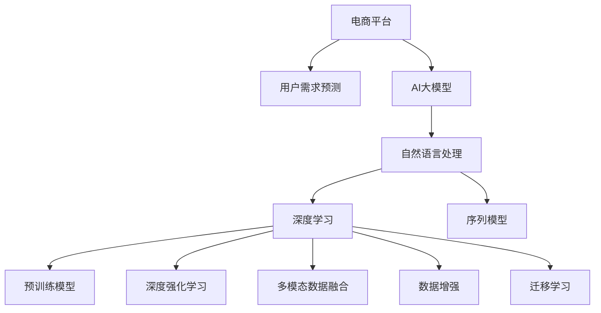

                 

# AI大模型在电商平台用户需求预测中的作用

> 关键词：电商平台,用户需求预测,大模型,自然语言处理(NLP),深度学习,序列模型,预训练模型,深度强化学习,强化学习,机器学习,多模态数据融合,数据增强,迁移学习

## 1. 背景介绍

### 1.1 问题由来
在电子商务领域，用户需求预测是至关重要的决策支持手段。通过预测用户未来的购买行为，商家可以优化库存管理，制定精准的营销策略，提升用户体验，从而实现更高的销售转化率。传统的用户需求预测方法依赖历史交易数据和统计模型，存在数据稀疏、泛化能力差、计算复杂度高等问题。近年来，随着深度学习技术的飞速发展，AI大模型，特别是预训练语言模型，在电商平台用户需求预测中展现出了强大的潜力。

## 2. 核心概念与联系

### 2.1 核心概念概述
为了更好地理解AI大模型在电商平台用户需求预测中的作用，本节将介绍几个密切相关的核心概念：

- **电商平台**：是指通过互联网平台进行商品销售和服务的模式，涵盖了B2C、B2B等多种形式。
- **用户需求预测**：是指基于历史数据和用户行为，预测用户未来的购买意向和需求，辅助商家制定精准的运营策略。
- **AI大模型**：指基于深度学习的大规模预训练模型，如BERT、GPT等，具备强大的自然语言理解和生成能力。
- **自然语言处理(NLP)**：是指计算机处理和理解人类语言的技术，是构建电商平台用户需求预测模型的基础。
- **深度学习**：是一种模拟人脑神经网络的学习方法，通过多层神经网络进行复杂数据的特征提取和模式识别。
- **序列模型**：如RNN、LSTM、GRU等，是处理序列数据（如文本、时间序列等）的深度学习模型。
- **预训练模型**：通过在大规模无标签文本数据上进行预训练，学习到丰富的语言知识，可以用于解决多种NLP任务。
- **深度强化学习**：是指通过智能体与环境的交互，逐步学习最优策略的机器学习方法，适用于用户行为动态变化的需求预测。
- **多模态数据融合**：是指将不同类型的数据（如文本、图像、音频等）结合起来，提高需求预测的准确性和全面性。
- **数据增强**：通过数据合成、变换等方式，扩大训练集多样性，减少过拟合风险。
- **迁移学习**：指利用一个领域的知识，迁移到另一个相关领域，提升需求预测的泛化能力。

这些核心概念之间的逻辑关系可以通过以下Mermaid流程图来展示：



这个流程图展示了电商平台用户需求预测的各个关键组件及其之间的关系：

1. 电商平台通过AI大模型、自然语言处理等技术进行用户需求预测。
2. 深度学习、序列模型等技术为模型提供了强大的数据处理能力。
3. 预训练模型、深度强化学习等技术提升了模型的泛化能力和动态适应性。
4. 多模态数据融合、数据增强等技术丰富了模型的输入数据。
5. 迁移学习技术促进了模型的跨领域应用和知识迁移。

## 3. 核心算法原理 & 具体操作步骤
### 3.1 算法原理概述

AI大模型在电商平台用户需求预测中，主要通过以下几个步骤实现：

1. **预训练模型选择**：选择适合的预训练模型（如BERT、GPT等），并进行微调或迁移学习，以适应电商平台的特定需求。
2. **数据准备与预处理**：收集电商平台的交易数据、用户行为数据等，并进行清洗、标注和特征提取。
3. **模型构建与训练**：基于预训练模型和电商数据，构建预测模型，进行训练和优化。
4. **预测与评估**：使用训练好的模型对新数据进行预测，并通过评估指标（如准确率、召回率、F1分数等）评估预测效果。

### 3.2 算法步骤详解

#### 3.2.1 预训练模型选择
根据电商平台的业务需求和数据特点，选择合适的预训练模型。例如：
- 对于大规模交易数据，可以选择像BERT这样的大模型。
- 对于小规模数据集，可以使用GPT等较小的模型，或使用转移学习技术。

#### 3.2.2 数据准备与预处理
1. **数据收集**：
   - 交易数据：包括用户的购买记录、订单信息、交易金额等。
   - 用户行为数据：如浏览记录、点击率、停留时间、评价等。
   - 社交媒体数据：如用户评论、社交媒体互动等。

2. **数据清洗**：去除噪声、填补缺失值、处理异常值等。

3. **特征提取**：
   - 数值特征：交易金额、停留时间、点击率等。
   - 文本特征：产品描述、用户评论、社交媒体评论等。
   - 多模态特征：结合图像、音频等多类型数据。

#### 3.2.3 模型构建与训练
1. **模型选择**：
   - 基于序列模型的预测模型：如LSTM、GRU等。
   - 基于深度学习的预测模型：如神经网络、卷积神经网络等。
   - 结合多模态数据的预测模型：如多模态深度学习模型。

2. **模型训练**：
   - 利用预训练模型进行迁移学习，初始化模型参数。
   - 使用电商数据进行模型训练，调整模型参数。
   - 使用优化算法（如Adam、SGD等）更新模型参数，最小化预测误差。

#### 3.2.4 预测与评估
1. **预测**：
   - 对新用户数据进行预测，生成购买意向。
   - 使用预测模型对电商业务进行优化，如库存管理、推荐系统等。

2. **评估**：
   - 使用评估指标（如准确率、召回率、F1分数等）评估预测效果。
   - 定期更新模型，提高预测准确性。

### 3.3 算法优缺点

AI大模型在电商平台用户需求预测中的优缺点如下：

**优点**：
- **强大的泛化能力**：大模型具备丰富的语言知识，能够处理大规模和多样化的电商数据。
- **高效的特征提取**：深度学习模型能够自动学习数据的复杂特征，提高预测准确性。
- **动态适应性**：深度强化学习模型能够处理用户行为的变化，提高预测的实时性。
- **可解释性**：大模型可以通过注意力机制等技术，提供预测结果的解释。
- **多模态融合**：结合多类型数据，提高需求预测的全面性。

**缺点**：
- **计算资源需求高**：大模型需要大量的计算资源进行训练和推理。
- **过拟合风险**：电商数据可能存在噪声和不平衡问题，大模型容易过拟合。
- **模型解释困难**：深度学习模型的决策过程复杂，难以解释。
- **模型部署复杂**：大模型需要高效的部署环境，如GPU等。

### 3.4 算法应用领域

AI大模型在电商平台用户需求预测中的应用领域包括：

- **用户行为预测**：预测用户的购买意向、浏览记录、点击率等。
- **库存管理**：预测商品的需求量，优化库存水平。
- **推荐系统**：根据用户的历史行为和偏好，推荐合适的商品。
- **客户服务**：预测用户可能提出的问题，提供智能客服解决方案。
- **价格优化**：根据市场需求和用户偏好，制定动态定价策略。

## 4. 数学模型和公式 & 详细讲解  
### 4.1 数学模型构建

AI大模型在电商平台用户需求预测中的数学模型主要包括以下几个部分：

1. **输入数据**：电商平台的交易数据、用户行为数据等。
2. **预训练模型**：如BERT、GPT等。
3. **模型结构**：包括序列模型、深度学习模型等。
4. **损失函数**：如均方误差、交叉熵等。
5. **优化算法**：如Adam、SGD等。

### 4.2 公式推导过程

以LSTM模型为例，其预测过程可以表示为：

$$
\hat{y} = \text{LSTM}(x)
$$

其中，$x$ 为输入的电商数据序列，$\hat{y}$ 为预测结果。

### 4.3 案例分析与讲解

以下是一个基于LSTM模型的用户需求预测案例：

1. **数据准备**：
   - 收集电商平台的交易数据、用户行为数据等。
   - 进行数据清洗和特征提取。

2. **模型构建**：
   - 使用LSTM模型进行用户需求预测。
   - 设定模型的超参数，如隐藏层大小、学习率等。

3. **模型训练**：
   - 使用电商数据进行模型训练。
   - 使用交叉熵损失函数进行优化。

4. **预测与评估**：
   - 对新用户数据进行预测，生成购买意向。
   - 使用准确率、召回率等评估指标评估预测效果。

## 5. 项目实践：代码实例和详细解释说明
### 5.1 开发环境搭建

在进行用户需求预测项目开发前，需要准备好开发环境。以下是使用Python进行PyTorch开发的环境配置流程：

1. 安装Anaconda：从官网下载并安装Anaconda，用于创建独立的Python环境。

2. 创建并激活虚拟环境：
```bash
conda create -n pytorch-env python=3.8 
conda activate pytorch-env
```

3. 安装PyTorch：根据CUDA版本，从官网获取对应的安装命令。例如：
```bash
conda install pytorch torchvision torchaudio cudatoolkit=11.1 -c pytorch -c conda-forge
```

4. 安装TensorBoard：
```bash
pip install tensorboard
```

5. 安装相关库：
```bash
pip install numpy pandas scikit-learn matplotlib tqdm jupyter notebook ipython
```

完成上述步骤后，即可在`pytorch-env`环境中开始用户需求预测实践。

### 5.2 源代码详细实现

下面以LSTM模型为例，给出用户需求预测的PyTorch代码实现。

首先，定义模型类：

```python
import torch
import torch.nn as nn
import torch.optim as optim

class LSTMModel(nn.Module):
    def __init__(self, input_size, hidden_size, output_size, num_layers):
        super(LSTMModel, self).__init__()
        self.hidden_size = hidden_size
        self.num_layers = num_layers
        self.lstm = nn.LSTM(input_size, hidden_size, num_layers, batch_first=True)
        self.fc = nn.Linear(hidden_size, output_size)
        self.relu = nn.ReLU()
    
    def forward(self, x):
        h0 = torch.zeros(self.num_layers, x.size(0), self.hidden_size).to(x.device)
        c0 = torch.zeros(self.num_layers, x.size(0), self.hidden_size).to(x.device)
        out, _ = self.lstm(x, (h0, c0))
        out = self.fc(out[:, -1, :])
        out = self.relu(out)
        return out
```

然后，定义训练函数：

```python
def train_model(model, train_data, test_data, epochs, batch_size, learning_rate):
    train_loader = torch.utils.data.DataLoader(train_data, batch_size=batch_size, shuffle=True)
    test_loader = torch.utils.data.DataLoader(test_data, batch_size=batch_size, shuffle=False)
    optimizer = optim.Adam(model.parameters(), lr=learning_rate)
    criterion = nn.CrossEntropyLoss()
    
    for epoch in range(epochs):
        model.train()
        for batch in train_loader:
            optimizer.zero_grad()
            x, labels = batch
            outputs = model(x)
            loss = criterion(outputs, labels)
            loss.backward()
            optimizer.step()
        model.eval()
        with torch.no_grad():
            correct = 0
            total = 0
            for batch in test_loader:
                x, labels = batch
                outputs = model(x)
                _, predicted = torch.max(outputs.data, 1)
                total += labels.size(0)
                correct += (predicted == labels).sum().item()
        print(f'Epoch {epoch+1}, Accuracy: {100 * correct / total:.2f}%')
```

最后，启动训练流程并评估模型性能：

```python
from torch.utils.data import TensorDataset

# 假设train_data和test_data已经准备就绪
train_data = TensorDataset(train_x, train_y)
test_data = TensorDataset(test_x, test_y)
train_loader = torch.utils.data.DataLoader(train_data, batch_size=32)
test_loader = torch.utils.data.DataLoader(test_data, batch_size=32)

model = LSTMModel(input_size, hidden_size, output_size, num_layers)
optimizer = optim.Adam(model.parameters(), lr=learning_rate)
criterion = nn.CrossEntropyLoss()

train_model(model, train_loader, test_loader, epochs, batch_size, learning_rate)

print('模型训练完成，开始评估')
correct = 0
total = 0
with torch.no_grad():
    for batch in test_loader:
        x, labels = batch
        outputs = model(x)
        _, predicted = torch.max(outputs.data, 1)
        total += labels.size(0)
        correct += (predicted == labels).sum().item()
print(f'测试集准确率: {100 * correct / total:.2f}%')
```

以上就是使用PyTorch对LSTM模型进行用户需求预测的完整代码实现。可以看到，使用深度学习模型进行用户需求预测的代码实现相对简单，且易于调试和优化。

### 5.3 代码解读与分析

让我们再详细解读一下关键代码的实现细节：

**LSTMModel类**：
- `__init__`方法：初始化模型的超参数，定义LSTM和全连接层。
- `forward`方法：定义模型前向传播过程，包括LSTM层的计算和全连接层的输出。

**train_model函数**：
- 创建训练和测试数据的DataLoader，用于批次化数据输入。
- 定义优化器和损失函数。
- 循环训练模型，在每个epoch内进行前向传播和反向传播。
- 在每个epoch后评估模型在测试集上的性能。

**训练流程**：
- 加载训练和测试数据集，创建DataLoader。
- 实例化LSTM模型和优化器。
- 调用train_model函数进行模型训练和评估。

可以看到，使用PyTorch进行深度学习模型的用户需求预测，代码实现相对简单，且具有高度的灵活性。开发者可以根据自己的需要，方便地调整模型的结构、超参数等。

当然，在实际应用中，还需要考虑更多因素，如模型的保存和部署、超参数的自动搜索、更多的正则化技术等。但核心的训练范式基本与此类似。

## 6. 实际应用场景
### 6.1 智能推荐系统

用户需求预测技术在智能推荐系统中发挥着重要作用。传统的推荐系统依赖历史用户行为数据，难以处理新用户或新产品的推荐问题。通过AI大模型，可以更好地理解用户的兴趣和行为模式，提供更加个性化和精准的推荐结果。

在实践中，可以使用电商平台的交易数据、用户行为数据等，训练大模型预测用户对商品的兴趣。根据预测结果，系统可以生成个性化的推荐列表，提升用户的购买体验。

### 6.2 库存管理

库存管理是电商平台运营中的关键环节，如何及时准确地预测商品需求量，优化库存水平，直接影响着企业的运营效率和利润。AI大模型可以通过分析用户的浏览、点击、购买等行为，预测商品的未来销量，帮助商家制定最优的库存策略。

例如，通过历史交易数据和用户行为数据，使用深度学习模型预测不同商品的销售量，并根据预测结果进行库存调整，可以显著降低库存成本，提升运营效率。

### 6.3 用户行为分析

用户行为分析是电商平台运营中的重要手段。通过预测用户的购买意向，商家可以更好地理解用户的偏好和需求，制定更加精准的运营策略。

例如，通过分析用户的浏览历史、购买记录等数据，使用AI大模型预测用户的未来购买意向，可以帮助商家制定更加个性化的营销活动，提升用户的购买转化率。

### 6.4 客户服务

电商平台的用户服务水平直接影响着用户满意度和留存率。通过预测用户可能提出的问题，商家可以提前准备相应的解决方案，提升客服服务的效率和质量。

例如，通过分析用户的浏览记录和评论，使用AI大模型预测用户可能提出的问题，系统可以自动提供相关的答案，提高客服的响应速度和准确性。

## 7. 工具和资源推荐
### 7.1 学习资源推荐

为了帮助开发者系统掌握AI大模型在电商平台用户需求预测的理论基础和实践技巧，这里推荐一些优质的学习资源：

1. 《深度学习理论与实践》系列博文：由深度学习领域专家撰写，深入浅出地介绍了深度学习理论、算法和实践。

2. 《自然语言处理》课程：斯坦福大学开设的NLP明星课程，有Lecture视频和配套作业，带你入门NLP领域的基本概念和经典模型。

3. 《自然语言处理与深度学习》书籍：全面介绍了NLP和深度学习的理论和方法，包括用户需求预测等实际应用。

4. PyTorch官方文档：PyTorch的官方文档，提供了丰富的深度学习模型和优化算法的实现，是学习深度学习的必备资料。

5. Kaggle平台：Kaggle上有很多用户需求预测相关的竞赛和数据集，可以通过实际项目练习，加深对模型的理解和应用。

通过对这些资源的学习实践，相信你一定能够快速掌握AI大模型在电商平台用户需求预测的精髓，并用于解决实际的业务问题。

### 7.2 开发工具推荐

高效的开发离不开优秀的工具支持。以下是几款用于AI大模型用户需求预测开发的常用工具：

1. PyTorch：基于Python的开源深度学习框架，灵活动态的计算图，适合快速迭代研究。大部分预训练语言模型都有PyTorch版本的实现。

2. TensorFlow：由Google主导开发的开源深度学习框架，生产部署方便，适合大规模工程应用。同样有丰富的预训练语言模型资源。

3. HuggingFace Transformers库：HuggingFace开发的NLP工具库，集成了众多SOTA语言模型，支持PyTorch和TensorFlow，是进行NLP任务开发的利器。

4. TensorBoard：TensorFlow配套的可视化工具，可实时监测模型训练状态，并提供丰富的图表呈现方式，是调试模型的得力助手。

5. Jupyter Notebook：一个交互式的开发环境，支持代码块、数据可视化等，方便开发者进行实验和调试。

合理利用这些工具，可以显著提升AI大模型用户需求预测的开发效率，加快创新迭代的步伐。

### 7.3 相关论文推荐

AI大模型在电商平台用户需求预测中的应用源于学界的持续研究。以下是几篇奠基性的相关论文，推荐阅读：

1. Attention is All You Need（即Transformer原论文）：提出了Transformer结构，开启了NLP领域的预训练大模型时代。

2. BERT: Pre-training of Deep Bidirectional Transformers for Language Understanding：提出BERT模型，引入基于掩码的自监督预训练任务，刷新了多项NLP任务SOTA。

3. Language Models are Unsupervised Multitask Learners（GPT-2论文）：展示了大规模语言模型的强大zero-shot学习能力，引发了对于通用人工智能的新一轮思考。

4. Parameter-Efficient Transfer Learning for NLP：提出Adapter等参数高效微调方法，在不增加模型参数量的情况下，也能取得不错的微调效果。

5. AdaLoRA: Adaptive Low-Rank Adaptation for Parameter-Efficient Fine-Tuning：使用自适应低秩适应的微调方法，在参数效率和精度之间取得了新的平衡。

这些论文代表了大语言模型用户需求预测技术的发展脉络。通过学习这些前沿成果，可以帮助研究者把握学科前进方向，激发更多的创新灵感。

## 8. 总结：未来发展趋势与挑战

### 8.1 总结

本文对AI大模型在电商平台用户需求预测中发挥的作用进行了全面系统的介绍。首先阐述了电商平台用户需求预测的重要性和大模型技术的优势，明确了AI大模型在提升预测准确性和实时性方面的独特价值。其次，从原理到实践，详细讲解了基于深度学习的大模型在电商需求预测中的模型构建、训练和预测过程，给出了代码实例和详细解释。同时，本文还探讨了AI大模型在电商平台中的应用场景，展示了其在推荐系统、库存管理、用户行为分析、客户服务等多个领域的前景。此外，本文精选了相关学习资源、开发工具和论文，力求为读者提供全方位的技术指引。

通过本文的系统梳理，可以看到，AI大模型在电商平台用户需求预测中具有广阔的应用前景，且其强大的泛化能力和动态适应性使其能够处理大规模和多样化的电商数据。AI大模型通过深度学习模型、多模态数据融合等技术，为电商平台提供了更加精准、实时、智能的用户需求预测解决方案。未来，伴随AI大模型和深度学习技术的不断发展，用户需求预测技术必将在电商行业带来深远的变革，推动产业向更高的智能化水平发展。

### 8.2 未来发展趋势

展望未来，AI大模型在电商平台用户需求预测领域的发展趋势如下：

1. **更高效的计算模型**：随着硬件计算能力的提升，深度学习模型将变得更加高效，支持更大规模数据的处理和分析。

2. **更强大的泛化能力**：通过多模态数据融合和迁移学习，大模型将能够更好地适应多种电商场景，提升预测的准确性。

3. **更高的实时性**：结合实时数据流和深度强化学习，大模型将能够实现实时预测，满足电商业务的动态需求。

4. **更高的自动化程度**：通过自动化超参数调优和模型优化，大模型将能够自动适应不同电商业务的需求，减少人工干预。

5. **更高的可解释性**：结合解释性技术（如LIME、SHAP等），大模型将能够提供更加直观和可解释的预测结果，提高业务决策的可信度。

6. **更高的安全性**：通过模型审计和数据加密技术，大模型将能够保障数据和模型的安全，避免数据泄露和模型滥用。

这些发展趋势将进一步提升AI大模型在电商平台用户需求预测中的性能和应用价值。

### 8.3 面临的挑战

尽管AI大模型在电商平台用户需求预测中展现了强大的潜力，但在实际应用中仍面临一些挑战：

1. **计算资源需求高**：大模型需要大量的计算资源进行训练和推理，可能导致成本高昂。

2. **数据质量和隐私保护**：电商数据可能存在噪声和不平衡问题，且涉及用户隐私，数据处理和保护问题亟待解决。

3. **模型解释困难**：深度学习模型的决策过程复杂，难以解释和调试。

4. **过拟合风险**：电商数据可能存在过拟合风险，模型需要在泛化能力和模型复杂度之间找到平衡。

5. **模型部署复杂**：大模型需要高效的部署环境，如GPU等，且模型部署和管理难度较大。

6. **模型更新成本高**：大模型更新需要大量的数据和计算资源，模型更新成本高昂。

这些挑战需要各方共同努力解决，才能进一步推动AI大模型在电商平台用户需求预测中的应用。

### 8.4 研究展望

面对AI大模型在电商平台用户需求预测中的挑战，未来的研究应在以下几个方面寻求新的突破：

1. **降低计算资源需求**：开发更加高效的计算模型和算法，减少计算资源消耗。

2. **提高数据质量和隐私保护**：开发数据清洗和隐私保护技术，提升数据质量和用户隐私保护。

3. **增强模型解释性**：开发可解释性技术，提高模型的透明性和可解释性。

4. **优化模型结构**：通过模型剪枝、量化等技术，优化模型结构，提高推理速度和效率。

5. **结合多模态数据**：结合图像、音频等多类型数据，提升需求预测的全面性。

6. **引入强化学习**：通过强化学习技术，提升模型的动态适应性和实时预测能力。

7. **提高模型可解释性**：结合解释性技术，提高模型的透明性和可解释性，增强业务决策的可信度。

8. **提高模型安全性和隐私保护**：开发模型审计和数据加密技术，保障模型安全和用户隐私。

这些研究方向将推动AI大模型在电商平台用户需求预测中的应用，提升电商平台的运营效率和服务质量，创造更高的业务价值。

## 9. 附录：常见问题与解答

**Q1：电商平台用户需求预测是否只依赖于历史数据？**

A: 电商平台用户需求预测不仅可以依赖历史数据，还可以通过分析用户的实时行为和社交媒体数据等，进行更精准的预测。例如，利用用户评论和社交媒体互动数据，预测用户的潜在需求和兴趣。

**Q2：用户需求预测模型是否需要定期更新？**

A: 用户需求预测模型需要定期更新，以适应新的用户行为和市场变化。通过不断收集新的数据和用户行为数据，对模型进行微调或重新训练，可以提升模型的预测准确性。

**Q3：如何处理电商平台的噪声数据？**

A: 电商平台的噪声数据可以通过数据清洗和特征选择等方法进行处理。例如，去除异常值、填补缺失值、去除重复记录等。

**Q4：如何保证电商平台的隐私和安全？**

A: 电商平台需要采取严格的隐私保护措施，如数据匿名化、加密存储等，确保用户数据的安全。同时，需要对模型进行定期审计，确保模型的公平性和安全性。

**Q5：电商平台的库存管理是否需要结合需求预测？**

A: 电商平台的库存管理需要结合需求预测，通过预测商品的需求量，优化库存水平，降低库存成本，提升运营效率。需求预测可以帮助商家制定最优的库存策略，提高客户满意度。

通过本文的系统梳理，可以看到，AI大模型在电商平台用户需求预测中具有广阔的应用前景，且其强大的泛化能力和动态适应性使其能够处理大规模和多样化的电商数据。未来，伴随AI大模型和深度学习技术的不断发展，用户需求预测技术必将在电商行业带来深远的变革，推动产业向更高的智能化水平发展。

