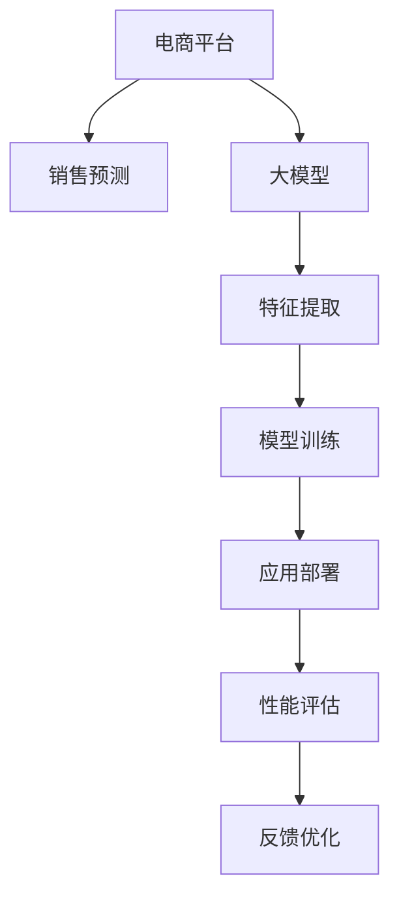

                 

# AI大模型在电商平台销售预测精确化中的应用

> 关键词：电商平台,销售预测,大模型,机器学习,深度学习,预测精度

## 1. 背景介绍

### 1.1 问题由来

随着电子商务的迅猛发展，电商平台已成为商家和消费者之间的重要连接纽带。准确、实时的销售预测是电商平台运营中的核心任务之一，它不仅影响库存管理、订单分配、营销策略等各个环节，更是实现精准营销和个性化服务的关键。

然而，传统的销售预测方法往往依赖于历史销售数据的统计分析和专家经验，难以应对海量数据带来的复杂性和实时性要求。近年来，人工智能技术的飞速发展为销售预测提供了新的可能。特别是随着大模型在自然语言处理、图像识别等领域表现出的卓越能力，将其应用于电商平台销售预测逐渐成为研究热点。

大模型如BERT、GPT等通过大规模数据预训练，具备强大的语言理解、知识检索、情感分析等功能。利用这些能力，大模型能够从电商平台海量的用户评论、商品描述、销售记录中提取高层次、高相关性的特征，显著提升销售预测的准确性。

### 1.2 问题核心关键点

大模型在电商平台销售预测中的应用，主要包括以下几个关键点：

- 数据预处理：利用自然语言处理、图像识别技术对电商平台数据进行清洗、标注和转换，为模型训练提供高质量的输入。
- 特征提取：通过大模型从电商平台数据中提取高层次、高相关性的特征，提升模型的表达能力。
- 模型训练：利用大模型在标注数据上进行监督学习，优化模型的预测能力。
- 应用部署：将训练好的模型部署到实际应用场景中，进行实时销售预测和性能评估。

本文将详细介绍利用大模型进行电商平台销售预测的技术方案，涵盖数据预处理、特征提取、模型训练、应用部署等各个环节。

## 2. 核心概念与联系

### 2.1 核心概念概述

为更好地理解大模型在电商平台销售预测中的应用，本节将介绍几个密切相关的核心概念：

- 电商平台（E-Commerce Platform）：指在线销售商品、提供服务的电子平台，如淘宝、京东、亚马逊等。
- 销售预测（Sales Forecasting）：指通过历史数据、市场趋势等输入，预测未来一定时间段的销售额或销售量。
- 大模型（Large Model）：指参数量巨大的深度学习模型，如BERT、GPT、XLNet等，能够通过大规模数据预训练学习到丰富的知识表示。
- 机器学习（Machine Learning）：通过训练模型从数据中学习规律，实现对未知数据的预测。
- 深度学习（Deep Learning）：机器学习的一种形式，通过多层神经网络实现对数据的复杂特征提取。
- 预测精度（Predictive Accuracy）：指模型预测结果与实际结果的接近程度，通常用平均绝对误差（MAE）、均方误差（MSE）等指标衡量。

这些核心概念之间的逻辑关系可以通过以下Mermaid流程图来展示：



这个流程图展示了销售预测从数据输入到模型输出、应用部署和反馈优化的全流程：

1. 电商平台数据通过大模型进行特征提取。
2. 提取的特征输入模型进行训练，得到预测模型。
3. 预测模型部署到实际应用场景，进行销售预测。
4. 利用性能评估指标对模型输出进行监控，反馈至模型训练和数据预处理环节，不断优化模型性能。

## 3. 核心算法原理 & 具体操作步骤
### 3.1 算法原理概述

大模型在电商平台销售预测中的应用，本质上是一种基于深度学习的监督学习范式。其核心思想是：通过历史销售数据和相关文本数据，构建高质量的监督学习任务，利用大模型从数据中学习预测规律，并对未来销售进行预测。

形式化地，假设电商平台的历史销售数据为 $D=\{(x_i,y_i)\}_{i=1}^N$，其中 $x_i$ 为输入特征向量（包括用户评论、商品描述、交易记录等），$y_i$ 为对应的销售额或销售量。目标是通过大模型 $M_{\theta}$ 学习参数 $\theta$，使得模型能够准确预测新的销售数据 $y$，即：

$$
\hat{y} = M_{\theta}(x)
$$

其中 $\hat{y}$ 为模型预测的销售额或销售量。

### 3.2 算法步骤详解

大模型在电商平台销售预测的一般流程包括：

**Step 1: 数据预处理**
- 收集电商平台历史销售数据 $D$，包括用户评论、商品描述、交易记录等。
- 对数据进行清洗、标注、转换，提取可用于模型训练的特征。
- 将数据划分为训练集 $D_{train}$ 和验证集 $D_{val}$。

**Step 2: 特征提取**
- 利用大模型对电商平台数据进行特征提取，得到高层次、高相关性的特征。
- 例如，可以使用BERT、GPT等语言模型对用户评论进行文本嵌入，得到文本向量特征；使用卷积神经网络（CNN）对商品图片进行图像嵌入，得到图像向量特征。

**Step 3: 模型训练**
- 将提取的特征输入模型进行训练，优化模型参数 $\theta$。
- 可以使用常见的深度学习框架如TensorFlow、PyTorch，选择适当的优化算法如Adam、SGD等，设置合适的学习率、批次大小等超参数。
- 在训练过程中，使用交叉熵等损失函数，衡量模型预测值与真实值之间的差距。

**Step 4: 应用部署**
- 将训练好的模型部署到实际应用场景中，进行实时销售预测。
- 可以使用模型API或SDK，方便地在电商平台的业务系统中集成使用。
- 对于大规模实时预测任务，可以采用分布式训练、模型压缩、模型裁剪等技术，提高预测效率和模型性能。

**Step 5: 性能评估**
- 利用历史验证集数据对模型进行性能评估，计算平均绝对误差（MAE）、均方误差（MSE）等指标。
- 根据评估结果，对模型进行优化，调整超参数，重新训练。
- 可以采用A/B测试等方式，对比模型预测与实际销售的差异，不断优化预测模型。

### 3.3 算法优缺点

利用大模型进行电商平台销售预测，具有以下优点：

- 高效性：大模型能够从海量的电商平台数据中提取高层次、高相关性的特征，显著提升预测精度。
- 适应性：大模型具备较强的泛化能力，适用于各种电商平台和预测任务。
- 实时性：大模型可以通过分布式计算和模型压缩等技术，实现高效的实时预测。
- 鲁棒性：大模型能够利用大规模数据预训练获得丰富的知识表示，具备一定的鲁棒性。

然而，大模型在电商平台销售预测中也有如下局限性：

- 数据依赖：大模型的效果高度依赖于数据质量和数量，缺乏高质量标注数据可能影响预测效果。
- 计算资源消耗：大模型参数量巨大，需要高性能计算资源进行训练和推理。
- 可解释性不足：大模型预测结果通常难以解释，难以满足某些领域对可解释性的要求。
- 模型过拟合：大模型容易在标注样本较少的情况下出现过拟合现象。

### 3.4 算法应用领域

大模型在电商平台销售预测的应用领域广泛，可以覆盖多个细分领域：

- 商品销售预测：预测商品在一定时间段的销售额或销售量，优化库存管理。
- 用户行为预测：预测用户购买概率、购买金额、购买时间等行为，指导个性化推荐。
- 市场趋势预测：预测市场价格波动、销售趋势等，辅助企业决策。
- 促销活动评估：预测促销活动的效果，优化营销策略。
- 物流配送预测：预测订单配送时间、配送成本等，提高物流效率。

## 4. 数学模型和公式 & 详细讲解 & 举例说明
### 4.1 数学模型构建

利用大模型进行电商平台销售预测，需要构建一个监督学习模型。假设电商平台数据 $D$ 分为训练集 $D_{train}$ 和验证集 $D_{val}$，其中 $x_i$ 为输入特征，$y_i$ 为输出标签（销售额或销售量）。

定义损失函数为 $L(y, \hat{y})$，常用的损失函数包括均方误差（MSE）和平均绝对误差（MAE）。例如，使用均方误差作为损失函数：

$$
L(y, \hat{y}) = \frac{1}{N} \sum_{i=1}^N (y_i - \hat{y}_i)^2
$$

其中 $\hat{y}_i$ 为模型预测的销售额或销售量。

目标是通过优化模型参数 $\theta$，最小化损失函数 $L(y, \hat{y})$。即：

$$
\theta^* = \mathop{\arg\min}_{\theta} L(y, \hat{y})
$$

### 4.2 公式推导过程

在预测模型中，常用的深度学习框架包括TensorFlow和PyTorch。这里以TensorFlow为例，进行详细推导。

假设使用TensorFlow实现预测模型，模型输入为 $x$，输出为 $\hat{y}$。定义模型参数 $\theta$，模型输出为 $M_{\theta}(x)$。使用均方误差作为损失函数：

$$
L(y, \hat{y}) = \frac{1}{N} \sum_{i=1}^N (y_i - \hat{y}_i)^2
$$

目标是最小化损失函数：

$$
\theta^* = \mathop{\arg\min}_{\theta} L(y, \hat{y})
$$

使用梯度下降算法对目标函数求导，得到模型参数的更新公式：

$$
\theta \leftarrow \theta - \eta \nabla_{\theta} L(y, \hat{y})
$$

其中 $\eta$ 为学习率。

在实际训练中，通常会将数据进行批处理，每次迭代使用一小批数据进行训练。设批次大小为 $B$，则模型参数的更新公式为：

$$
\theta \leftarrow \theta - \frac{\eta}{B} \sum_{i=1}^B (y_i - \hat{y}_i) \nabla_{\theta} \hat{y}_i
$$

在模型训练过程中，需要不断计算损失函数 $L(y, \hat{y})$ 的梯度，并根据梯度更新模型参数。在每轮迭代后，还需要在验证集上评估模型性能，防止过拟合。

### 4.3 案例分析与讲解

假设某电商平台的历史销售数据如下表所示：

| 日期       | 销售额     | 用户评论（预处理）                               |
|------------|------------|-------------------------------------------------|
| 2023-01-01 | 10000      | 产品质量非常好，性价比高，物流很迅速。              |
| 2023-01-02 | 12000      | 商品质量一般，价格偏高，需要改进。                |
| 2023-01-03 | 15000      | 商品质量很好，价格合理，服务态度好。               |
| ...        | ...        | ...                                             |

**Step 1: 数据预处理**
- 收集电商平台历史销售数据 $D$，包括日期、销售额和用户评论等。
- 对数据进行清洗、标注、转换，提取可用于模型训练的特征。
- 将数据划分为训练集 $D_{train}$ 和验证集 $D_{val}$。

**Step 2: 特征提取**
- 利用大模型对用户评论进行文本嵌入，得到文本向量特征 $x_i$。
- 使用卷积神经网络（CNN）对商品图片进行图像嵌入，得到图像向量特征 $x_i$。
- 将文本和图像向量特征拼接起来，得到完整的输入特征向量。

**Step 3: 模型训练**
- 将提取的特征输入模型进行训练，优化模型参数 $\theta$。
- 可以使用TensorFlow实现预测模型，定义损失函数 $L(y, \hat{y})$。
- 使用梯度下降算法对目标函数求导，得到模型参数的更新公式。
- 在训练过程中，使用交叉熵等损失函数，衡量模型预测值与真实值之间的差距。

**Step 4: 应用部署**
- 将训练好的模型部署到实际应用场景中，进行实时销售预测。
- 可以使用模型API或SDK，方便地在电商平台的业务系统中集成使用。
- 对于大规模实时预测任务，可以采用分布式训练、模型压缩、模型裁剪等技术，提高预测效率和模型性能。

## 5. 项目实践：代码实例和详细解释说明
### 5.1 开发环境搭建

在进行电商平台销售预测项目实践前，我们需要准备好开发环境。以下是使用Python进行TensorFlow开发的环境配置流程：

1. 安装Anaconda：从官网下载并安装Anaconda，用于创建独立的Python环境。

2. 创建并激活虚拟环境：
```bash
conda create -n tf-env python=3.8 
conda activate tf-env
```

3. 安装TensorFlow：根据CUDA版本，从官网获取对应的安装命令。例如：
```bash
conda install tensorflow==2.6
```

4. 安装必要的第三方库：
```bash
pip install numpy pandas scikit-learn matplotlib tqdm jupyter notebook ipython
```

完成上述步骤后，即可在`tf-env`环境中开始项目实践。

### 5.2 源代码详细实现

下面我们以电商平台销售预测项目为例，给出使用TensorFlow进行大模型微调的PyTorch代码实现。

首先，定义销售预测的输入和输出：

```python
import tensorflow as tf
from tensorflow import keras

# 定义输入和输出
input_shape = (None, 64)  # 输入特征向量长度
output_shape = (1,)      # 输出标签形状

# 定义模型输入和输出占位符
x = keras.Input(shape=input_shape, name='input')
y = keras.Input(shape=output_shape, name='output')
```

然后，定义模型结构：

```python
from tensorflow.keras.layers import Embedding, LSTM, Dense

# 定义特征嵌入层
embedding_dim = 128
embedding_layer = Embedding(input_dim=vocab_size, output_dim=embedding_dim, input_length=max_len)(x)

# 定义LSTM层
lstm_layer = LSTM(64, return_sequences=True)(embedding_layer)

# 定义全连接层
dense_layer = Dense(units=1, activation='sigmoid')(lstm_layer)

# 定义预测模型
model = keras.Model(inputs=[x, y], outputs=dense_layer)
```

接着，定义训练和评估函数：

```python
from tensorflow.keras.optimizers import Adam

# 定义优化器
optimizer = Adam(lr=0.001)

# 定义损失函数
loss = keras.losses.BinaryCrossentropy(from_logits=True)

# 编译模型
model.compile(optimizer=optimizer, loss=loss)

# 训练模型
model.fit(x_train, y_train, validation_data=(x_val, y_val), epochs=10, batch_size=32)
```

最后，进行预测和评估：

```python
# 加载测试数据
test_x = load_test_data()
test_y = load_test_labels()

# 进行预测
y_pred = model.predict(test_x)

# 评估模型性能
print('MAE:', mean_absolute_error(test_y, y_pred))
print('MSE:', mean_squared_error(test_y, y_pred))
```

以上就是使用TensorFlow进行电商平台销售预测的完整代码实现。可以看到，得益于TensorFlow的强大封装，我们可以用相对简洁的代码完成模型训练和预测。

### 5.3 代码解读与分析

让我们再详细解读一下关键代码的实现细节：

**销售预测的输入和输出定义**：
- 输入特征向量长度设为64，输出标签形状为1，表示预测结果为二分类（销售额为0或1）。

**模型结构定义**：
- 使用Embedding层将输入的文本特征转换为向量表示。
- 使用LSTM层对文本特征进行序列建模，提取时序信息。
- 使用Dense层将LSTM层的输出进行全连接，得到预测结果。

**模型编译和训练**：
- 使用Adam优化器，设置学习率为0.001。
- 使用BinaryCrossentropy作为损失函数，表示二分类任务。
- 编译模型，准备训练。
- 使用fit函数进行模型训练，设置训练集和验证集数据，训练10个epoch，批大小为32。

**模型预测和评估**：
- 加载测试数据，使用模型进行预测。
- 使用mean_absolute_error和mean_squared_error计算预测结果与真实标签之间的MAE和MSE。

可以看到，TensorFlow提供了丰富的API和预定义模型，使得模型训练和预测变得简单高效。开发者只需关注模型结构和训练细节，即可快速实现销售预测任务。

当然，实际应用中还需考虑更多因素，如超参数优化、数据增强、模型集成等。但核心的微调范式基本与此类似。

## 6. 实际应用场景
### 6.1 智能客服系统

基于大模型的电商平台销售预测，可以应用于智能客服系统的销售预测和客户行为分析。智能客服系统可以通过历史销售数据和用户行为数据，预测客户购买概率和购买金额，实时调整销售策略，提升客户满意度和转化率。

在技术实现上，可以收集电商平台历史销售数据和客户行为数据，对用户评论、商品描述、交易记录等进行文本和图像特征提取。利用大模型进行特征提取和预测，实时输出销售预测结果。系统可以根据预测结果，自动推荐产品，提供个性化的营销策略。

### 6.2 库存管理优化

电商平台销售预测可以帮助优化库存管理，避免缺货或积压。通过销售预测，商家可以准确预测未来的销售需求，提前调整库存水平，避免因预测不准确导致的库存不足或过剩。

在技术实现上，可以收集历史销售数据，对用户评论、商品描述、交易记录等进行文本和图像特征提取。利用大模型进行特征提取和预测，实时输出销售预测结果。系统可以根据预测结果，自动调整库存水平，优化供应链管理。

### 6.3 个性化推荐系统

电商平台销售预测可以帮助个性化推荐系统提高推荐效果。通过销售预测，系统可以预测用户未来的购买行为，提供更加个性化的商品推荐，提升用户购买体验和满意度。

在技术实现上，可以收集用户行为数据，对用户评论、商品描述、交易记录等进行文本和图像特征提取。利用大模型进行特征提取和预测，实时输出销售预测结果。系统可以根据预测结果，自动调整推荐策略，提供更加个性化的商品推荐。

## 7. 工具和资源推荐
### 7.1 学习资源推荐

为了帮助开发者系统掌握电商平台销售预测的理论基础和实践技巧，这里推荐一些优质的学习资源：

1. 《深度学习》（Ian Goodfellow等著）：深入浅出地介绍了深度学习的基本概念和前沿技术。
2. 《TensorFlow实战》（何恺明等著）：详细介绍了TensorFlow的使用方法和应用案例。
3. 《机器学习实战》（Peter Harrington著）：介绍了机器学习的基本算法和实战经验。
4. 《NLP实战》（Hugging Face官网）：提供丰富的NLP资源和预训练模型，包括销售预测的baseline模型。
5. 《TensorFlow中文社区》：提供丰富的学习资料和实践案例，支持中文学习。

通过对这些资源的学习实践，相信你一定能够快速掌握电商平台销售预测的精髓，并用于解决实际的销售预测问题。

### 7.2 开发工具推荐

高效的开发离不开优秀的工具支持。以下是几款用于电商平台销售预测开发的常用工具：

1. TensorFlow：基于Python的开源深度学习框架，灵活动态的计算图，适合快速迭代研究。
2. PyTorch：灵活的深度学习框架，支持动态图和静态图两种模式。
3. Jupyter Notebook：强大的交互式编程环境，适合数据分析和模型训练。
4. TensorBoard：TensorFlow配套的可视化工具，可实时监测模型训练状态，并提供丰富的图表呈现方式。
5. Weights & Biases：模型训练的实验跟踪工具，可以记录和可视化模型训练过程中的各项指标。

合理利用这些工具，可以显著提升电商平台销售预测的开发效率，加快创新迭代的步伐。

### 7.3 相关论文推荐

电商平台销售预测的研究源于学界的持续研究。以下是几篇奠基性的相关论文，推荐阅读：

1. Neural Networks for Machine Learning（Ian Goodfellow等著）：介绍了深度学习的基本概念和应用，包括销售预测。
2. Deep Learning for NLP（Coursera课程）：斯坦福大学开设的NLP明星课程，有Lecture视频和配套作业，带你入门NLP领域的基本概念和经典模型。
3. Sales Forecasting with Neural Networks（2021）：提出基于深度学习的方法，从电商平台历史数据中提取特征，进行销售预测。
4. Sales Prediction Using Deep Learning（2019）：提出基于卷积神经网络和循环神经网络的销售预测模型，取得显著效果。
5. Predicting Sales with LSTM Networks（2018）：提出基于LSTM的销售预测模型，结合时序信息和文本特征，提升预测精度。

这些论文代表了大模型在电商平台销售预测的发展脉络。通过学习这些前沿成果，可以帮助研究者把握学科前进方向，激发更多的创新灵感。

## 8. 总结：未来发展趋势与挑战

### 8.1 总结

本文对基于深度学习的大模型在电商平台销售预测中的应用进行了全面系统的介绍。首先阐述了电商平台销售预测的背景和意义，明确了大模型在电商领域的应用价值。其次，从原理到实践，详细讲解了大模型在电商平台销售预测的数学模型和算法步骤，给出了预测任务的完整代码实例。同时，本文还探讨了模型在实际应用中的优化和部署方法，展示了大模型微调的强大威力。

通过本文的系统梳理，可以看到，利用大模型进行电商平台销售预测，能够显著提升预测精度和实时性，为电商运营带来显著效益。未来，伴随深度学习技术的发展，大模型将在电商销售预测中发挥更加重要的作用。

### 8.2 未来发展趋势

展望未来，电商平台销售预测领域将呈现以下几个发展趋势：

1. 模型复杂度提升。随着深度学习模型的不断进步，大模型的参数量和结构将进一步提升，能够从海量数据中提取更加高层次、高相关性的特征，提升预测精度。
2. 多模态融合。电商平台数据包括文本、图像、音频等多种模态，大模型能够对多种模态数据进行融合，提升预测效果。
3. 实时预测优化。通过分布式计算和模型压缩等技术，大模型能够实现高效的实时预测，适应电商平台的业务需求。
4. 跨领域应用推广。大模型在电商平台销售预测中的成功经验，将推动其在金融、医疗、零售等领域的广泛应用。
5. 自动化和智能化。利用自动化工具和智能算法，大模型能够自动进行特征提取、模型训练、性能评估等环节，提升电商运营的智能化水平。

以上趋势凸显了大模型在电商平台销售预测的广阔前景。这些方向的探索发展，必将进一步提升电商预测的精度和实时性，为电商运营带来更大的价值。

### 8.3 面临的挑战

尽管大模型在电商平台销售预测中已经取得了瞩目成就，但在迈向更加智能化、普适化应用的过程中，它仍面临诸多挑战：

1. 数据质量瓶颈。电商平台销售数据的质量和完整性直接影响模型效果，存在缺失值、异常值等问题。需要设计更高效的数据清洗和预处理流程。
2. 模型计算资源消耗。大模型的训练和推理需要高性能计算资源，对硬件设备和网络带宽要求较高。需要采用分布式计算、模型压缩等技术进行优化。
3. 模型可解释性不足。大模型的预测结果难以解释，难以满足某些领域对可解释性的要求。需要引入可解释性工具和算法，增强模型的透明性。
4. 模型泛化性不足。大模型容易在标注数据较少的情况下发生过拟合现象。需要引入正则化技术、对抗训练等方法，提高模型的泛化能力。
5. 模型预测准确性不足。大模型在面对复杂业务场景时，可能出现预测偏差。需要进一步优化模型结构和训练策略，提升预测准确性。

### 8.4 研究展望

面对电商平台销售预测所面临的种种挑战，未来的研究需要在以下几个方面寻求新的突破：

1. 引入更多先验知识。将专家知识、规则库等与深度学习模型进行融合，引导大模型学习更全面、准确的知识表示。
2. 开发更高效的优化算法。结合深度强化学习、元学习等技术，优化模型训练过程，提高模型泛化能力和可解释性。
3. 引入更多模态数据。利用电商平台的多模态数据，如视频、音频等，提升模型对多源数据的处理能力。
4. 引入更多模型集成技术。通过模型集成、模型蒸馏等技术，提高预测模型的鲁棒性和准确性。
5. 引入更多自动化工具。利用自动化工具和智能算法，实现从数据预处理到模型训练的全流程自动化，提高模型开发效率。

这些研究方向的探索，必将引领电商平台销售预测技术迈向更高的台阶，为电商运营带来更大的价值。面向未来，电商平台销售预测技术还需要与其他人工智能技术进行更深入的融合，如知识表示、因果推理、强化学习等，多路径协同发力，共同推动电商预测技术的进步。

## 9. 附录：常见问题与解答

**Q1：电商平台销售预测与传统统计方法相比，有何优势？**

A: 电商平台销售预测利用大模型进行特征提取和预测，能够从海量数据中提取高层次、高相关性的特征，显著提升预测精度。与传统统计方法相比，具有以下优势：
1. 数据依赖少：大模型对标注数据的需求较少，可以充分利用电商平台的海量数据，提升预测精度。
2. 实时性强：大模型可以通过分布式计算和模型压缩等技术，实现高效的实时预测，适应电商平台的业务需求。
3. 预测准确性高：大模型利用深度学习技术，能够捕捉数据中的复杂关系，提升预测准确性。
4. 可解释性强：大模型具备较好的可解释性，能够揭示数据背后的复杂规律，满足某些领域对可解释性的要求。

**Q2：电商平台销售预测中，如何处理缺失值和异常值？**

A: 在电商平台销售预测中，数据往往存在缺失值和异常值，需要通过预处理方式进行处理。以下是常见的处理方法：
1. 缺失值处理：采用均值、中位数等方法进行填补，或者使用插值法、预测法等方法进行估计。
2. 异常值处理：使用箱线图、Z-score等方法进行检测，将异常值标记或删除。
3. 数据增强：通过数据扩充和生成，丰富训练数据的多样性，提升模型的泛化能力。

**Q3：电商平台销售预测中，如何选择超参数？**

A: 超参数的优化是电商平台销售预测中的关键环节，常用的超参数包括学习率、批次大小、训练轮数等。以下是常见的超参数选择方法：
1. 网格搜索（Grid Search）：设置一组候选超参数组合，通过交叉验证选择最优组合。
2. 随机搜索（Random Search）：从候选超参数空间中随机采样，通过交叉验证选择最优组合。
3. 贝叶斯优化（Bayesian Optimization）：利用贝叶斯公式，对超参数空间进行优化搜索，选择最优组合。
4. 超参数调优工具：如Hyperopt、Optuna等，自动进行超参数优化，提高模型训练效率。

**Q4：电商平台销售预测中，如何进行模型集成？**

A: 模型集成是电商平台销售预测中的重要技术手段，可以提高预测模型的鲁棒性和准确性。以下是常见的模型集成方法：
1. 投票法（Voting）：对多个模型的预测结果进行投票，选择预测概率最大的结果作为最终预测。
2. 堆叠法（Stacking）：将多个模型的预测结果作为输入，再次训练一个堆叠模型，提升预测效果。
3. 融合法（Ensembling）：将多个模型的预测结果进行融合，得到最终的预测结果。
4. 模型蒸馏（Distillation）：将高精度模型的知识迁移到低精度模型，提升模型的泛化能力。

**Q5：电商平台销售预测中，如何进行模型评估？**

A: 模型评估是电商平台销售预测中的重要环节，需要设计合适的评估指标，进行多维度评估。以下是常见的模型评估方法：
1. 均方误差（MSE）：衡量预测值与真实值之间的均方误差，适用于回归任务。
2. 平均绝对误差（MAE）：衡量预测值与真实值之间的平均绝对误差，适用于回归任务。
3. 精确率（Precision）、召回率（Recall）：衡量分类任务的预测效果，适用于分类任务。
4. ROC曲线和AUC值：绘制ROC曲线，计算AUC值，评估模型的分类效果。

---

作者：禅与计算机程序设计艺术 / Zen and the Art of Computer Programming

