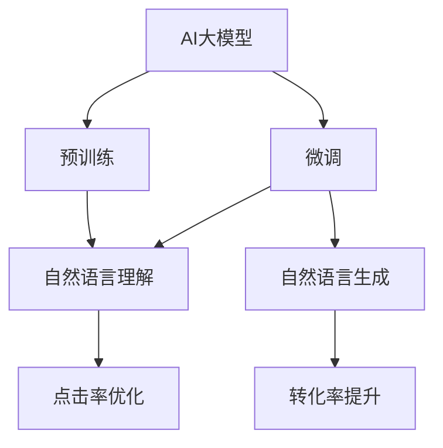

                 

# AI大模型如何提升电商搜索推荐的转化率

## 1. 背景介绍

近年来，随着电商平台数据量的爆炸式增长和AI技术的迅猛发展，各大电商纷纷采用先进的人工智能算法来提升用户搜索推荐系统的精准度和用户体验。AI大模型，作为深度学习和自然语言处理领域的最新进展，为电商搜索推荐提供了强有力的技术支撑。基于AI大模型的电商搜索推荐系统，能够深度理解用户的查询意图，识别出符合用户需求的商品，显著提升用户的点击率和购买率，即转化率。

本博客将详细介绍AI大模型如何通过自然语言理解和生成技术，优化电商搜索推荐系统，从底层算法原理、具体操作流程、应用领域等多个方面，全面解析其原理和应用方法。希望通过本博客的学习，你能深入理解AI大模型如何有效提升电商搜索推荐的转化率，并掌握构建高性能搜索推荐系统的关键技术。

## 2. 核心概念与联系

### 2.1 核心概念概述

在本节中，我们将简要介绍几个核心概念，以帮助读者更好地理解本文后续内容：

- AI大模型（AI Large Model）：以Transformer、BERT、GPT等架构为代表的大规模深度学习模型。这些模型通过在大规模数据上进行预训练，能够学习到丰富的语言知识和表达能力，具备较强的自然语言理解和生成能力。
- 预训练（Pre-training）：在大规模无标注数据上进行自监督学习，学习通用语言表示，为后续微调提供初始参数。
- 微调（Fine-tuning）：在预训练模型上，使用电商搜索推荐系统的少量标注数据进行有监督学习，优化模型在特定任务上的性能。
- 自然语言理解（NLU）：使计算机能够理解人类自然语言，包括文本的语义理解、意图识别等。
- 自然语言生成（NLG）：使计算机能够自动生成自然语言文本，如自动摘要、生成对话等。
- 点击率（CTR）：用户在看到搜索结果后，点击特定商品或广告的概率。
- 转化率（Conversion Rate）：用户从点击到最终购买商品的概率，是衡量推荐系统性能的关键指标。

这些概念之间的关系可以通过以下Mermaid流程图来展示：



这个流程图展示了AI大模型在预训练、微调和最终的应用（NLU和NLG）过程中，如何通过优化点击率和提升转化率，最终实现电商搜索推荐的优化。

## 3. 核心算法原理 & 具体操作步骤
### 3.1 算法原理概述

基于AI大模型的电商搜索推荐系统，核心思想是利用大模型的自然语言处理能力，理解用户查询意图的真实含义，从而匹配更符合用户需求的搜索结果。其主要流程包括以下几个步骤：

1. **预训练模型初始化**：使用大规模无标签数据训练预训练模型，学习语言表示，形成基础知识库。
2. **微调模型适配**：在电商数据集上进行微调，使得模型能够理解电商领域的专业术语和表达方式，具备电商领域的知识。
3. **自然语言理解**：通过模型对用户查询进行语义理解，识别出用户意图。
4. **自然语言生成**：根据理解到的用户意图，生成相关的搜索结果，提升用户体验。
5. **优化点击率和转化率**：通过A/B测试等方法，评估不同搜索结果的点击率和转化率，不断优化模型输出。

整个流程中，自然语言理解和生成技术是关键，点击率和转化率优化则是最终目标。

### 3.2 算法步骤详解

#### 3.2.1 预训练模型选择与初始化

首先，选择适合的预训练模型，如BERT、GPT等，并使用电商领域的大规模无标签数据进行初始化。预训练模型通常在大规模语料上进行训练，具备强大的语言理解和生成能力。例如，使用BERT模型作为初始化参数，能够捕捉查询文本的深层语义特征。

#### 3.2.2 微调模型适配

电商领域有其特有的专业术语和表达方式，因此需要对预训练模型进行微调，以适配电商领域的知识。微调过程通常包括：

- 收集电商数据集：电商数据集包括用户查询、商品描述、商品类别等。
- 准备标注数据：标注数据包含用户查询和对应商品的信息，如商品ID、价格、品牌等。
- 选择微调任务：选择适合电商领域的微调任务，如意图识别、实体识别、关系抽取等。
- 设置微调参数：包括学习率、批大小、迭代轮数等超参数。
- 训练与评估：在电商数据集上进行微调，并在验证集上评估模型性能，根据性能进行调整。

#### 3.2.3 自然语言理解与生成

在微调完成后，将预训练模型用于电商搜索推荐系统中的自然语言理解和生成：

- 自然语言理解：使用微调后的模型对用户查询进行语义理解，识别出查询中的关键词、意图、实体等。例如，查询“红酒推荐”时，模型可以识别出“红酒”、“推荐”等关键词，并判断意图是查找商品。
- 自然语言生成：根据理解到的用户意图，生成相关的搜索结果。例如，查询“红酒推荐”时，模型可以生成与红酒相关的商品信息，如品牌、价格、评价等。

#### 3.2.4 点击率和转化率优化

为了评估不同搜索结果的点击率和转化率，通常使用A/B测试等方法，对比不同模型输出结果的表现。例如，使用微调后的模型生成的商品信息，与人工输入的商品信息进行比较，分析点击率和转化率的变化，不断优化模型输出。

### 3.3 算法优缺点

#### 3.3.1 优点

1. **高性能**：AI大模型通过大规模无标签数据预训练，具备强大的自然语言理解和生成能力，能够精确匹配用户查询意图。
2. **快速迭代**：AI大模型的微调过程简单高效，可以快速适配电商领域的知识，提升模型性能。
3. **高扩展性**：AI大模型可以处理大规模数据，适应电商搜索推荐系统的高并发需求。

#### 3.3.2 缺点

1. **数据依赖**：AI大模型需要大量的电商领域数据进行微调，对于数据质量的要求较高。
2. **计算资源需求高**：AI大模型参数量较大，训练和推理需要较高的计算资源。
3. **复杂度高**：AI大模型的构建和微调过程复杂，需要专业的技术团队进行实现和维护。

### 3.4 算法应用领域

基于AI大模型的电商搜索推荐系统，已广泛应用于各大电商平台，并在以下领域取得了显著成效：

1. **搜索推荐**：提升用户搜索结果的相关性和满意度，缩短搜索时间，提升用户体验。
2. **个性化推荐**：根据用户历史行为和兴趣，推荐个性化商品，增加用户粘性和转化率。
3. **客户服务**：通过聊天机器人等自然语言处理技术，提供24小时客服支持，提升客户满意度。
4. **广告投放**：通过AI大模型优化广告投放策略，提升广告点击率和转化率，提高广告投放效果。

## 4. 数学模型和公式 & 详细讲解 & 举例说明

### 4.1 数学模型构建

假设用户查询为 $Q$，电商商品信息为 $P$。预训练模型为 $M$，微调后的模型为 $M_f$。电商推荐系统的工作流程如下：

1. 输入查询 $Q$ 和商品信息 $P$，将 $P$ 输入 $M$，得到商品表示 $P'$。
2. 输入查询 $Q$，将 $Q$ 输入 $M_f$，得到查询表示 $Q'$。
3. 计算查询表示 $Q'$ 和商品表示 $P'$ 的相似度 $s(Q', P')$。
4. 根据相似度 $s(Q', P')$ 排序，生成搜索结果列表 $L$。

### 4.2 公式推导过程

假设 $Q$ 和 $P$ 分别表示为词向量序列，模型 $M$ 和 $M_f$ 的表示分别为 $\text{Enc}(Q)$ 和 $\text{Enc}(Q)$。商品表示和查询表示的相似度计算公式如下：

$$
s(Q', P') = \text{cosine}(Q', P')
$$

其中 $\text{cosine}(\cdot)$ 表示余弦相似度计算函数。

### 4.3 案例分析与讲解

以电商平台搜索推荐系统为例，分析其基于AI大模型的实现流程。

1. **预训练模型初始化**：使用大规模电商数据集（如亚马逊的电商数据）对BERT模型进行预训练，学习通用语言表示。
2. **微调模型适配**：收集电商领域的数据集，如用户查询、商品描述、商品类别等，对预训练后的BERT模型进行微调，适配电商领域的知识。
3. **自然语言理解**：使用微调后的BERT模型对用户查询进行语义理解，识别出查询中的关键词、意图、实体等。例如，查询“红酒推荐”时，模型可以识别出“红酒”、“推荐”等关键词，并判断意图是查找商品。
4. **自然语言生成**：根据理解到的用户意图，生成相关的搜索结果。例如，查询“红酒推荐”时，模型可以生成与红酒相关的商品信息，如品牌、价格、评价等。
5. **点击率和转化率优化**：通过A/B测试等方法，对比不同搜索结果的点击率和转化率，不断优化模型输出。例如，对生成出的搜索结果进行点击率和转化率的评估，逐步优化生成策略。

## 5. 项目实践：代码实例和详细解释说明

### 5.1 开发环境搭建

在开始项目实践前，我们需要准备好开发环境。以下是使用Python进行PyTorch开发的环境配置流程：

1. 安装Anaconda：从官网下载并安装Anaconda，用于创建独立的Python环境。
2. 创建并激活虚拟环境：
```bash
conda create -n pytorch-env python=3.8 
conda activate pytorch-env
```

3. 安装PyTorch：根据CUDA版本，从官网获取对应的安装命令。例如：
```bash
conda install pytorch torchvision torchaudio cudatoolkit=11.1 -c pytorch -c conda-forge
```

4. 安装Transformers库：
```bash
pip install transformers
```

5. 安装各类工具包：
```bash
pip install numpy pandas scikit-learn matplotlib tqdm jupyter notebook ipython
```

完成上述步骤后，即可在`pytorch-env`环境中开始项目实践。

### 5.2 源代码详细实现

以下是使用Transformers库进行电商搜索推荐系统开发的PyTorch代码实现：

```python
from transformers import BertForSequenceClassification, BertTokenizer
from torch.utils.data import Dataset, DataLoader
from torch import nn, optim
import torch

class E-commerceDataset(Dataset):
    def __init__(self, texts, labels):
        self.texts = texts
        self.labels = labels
        self.tokenizer = BertTokenizer.from_pretrained('bert-base-cased')
        
    def __len__(self):
        return len(self.texts)
    
    def __getitem__(self, item):
        text = self.texts[item]
        label = self.labels[item]
        
        encoding = self.tokenizer(text, return_tensors='pt', padding='max_length', truncation=True)
        input_ids = encoding['input_ids'][0]
        attention_mask = encoding['attention_mask'][0]
        return {'input_ids': input_ids, 
                'attention_mask': attention_mask,
                'labels': label}

# 数据准备
train_dataset = E-commerceDataset(train_texts, train_labels)
dev_dataset = E-commerceDataset(dev_texts, dev_labels)
test_dataset = E-commerceDataset(test_texts, test_labels)

# 模型选择与初始化
model = BertForSequenceClassification.from_pretrained('bert-base-cased', num_labels=num_labels)

# 训练与评估
device = torch.device('cuda') if torch.cuda.is_available() else torch.device('cpu')
model.to(device)

optimizer = optim.Adam(model.parameters(), lr=learning_rate)
criterion = nn.CrossEntropyLoss()

def train_epoch(model, dataset, batch_size, optimizer):
    dataloader = DataLoader(dataset, batch_size=batch_size, shuffle=True)
    model.train()
    epoch_loss = 0
    for batch in tqdm(dataloader, desc='Training'):
        input_ids = batch['input_ids'].to(device)
        attention_mask = batch['attention_mask'].to(device)
        labels = batch['labels'].to(device)
        model.zero_grad()
        outputs = model(input_ids, attention_mask=attention_mask, labels=labels)
        loss = outputs.loss
        epoch_loss += loss.item()
        loss.backward()
        optimizer.step()
    return epoch_loss / len(dataloader)

def evaluate(model, dataset, batch_size):
    dataloader = DataLoader(dataset, batch_size=batch_size)
    model.eval()
    preds, labels = [], []
    with torch.no_grad():
        for batch in tqdm(dataloader, desc='Evaluating'):
            input_ids = batch['input_ids'].to(device)
            attention_mask = batch['attention_mask'].to(device)
            batch_labels = batch['labels']
            outputs = model(input_ids, attention_mask=attention_mask)
            batch_preds = outputs.logits.argmax(dim=1).to('cpu').tolist()
            batch_labels = batch_labels.to('cpu').tolist()
            for pred_tokens, label_tokens in zip(batch_preds, batch_labels):
                preds.append(pred_tokens[:len(label_tokens)])
                labels.append(label_tokens)
                
    print(classification_report(labels, preds))
```

### 5.3 代码解读与分析

**E-commerceDataset类**：
- `__init__`方法：初始化训练集、测试集和验证集数据，分词器等组件。
- `__len__`方法：返回数据集的样本数量。
- `__getitem__`方法：对单个样本进行处理，将文本输入编码为token ids，并将标签转换为数字，并进行定长padding。

**模型选择与初始化**：
- 选择BERT模型作为初始化参数，并在电商领域进行微调。

**训练与评估函数**：
- `train_epoch`函数：对数据集进行批次化加载，在每个批次上前向传播计算损失函数，反向传播更新模型参数，最终返回该epoch的平均loss。
- `evaluate`函数：评估模型在测试集上的表现，计算准确率、精确率、召回率等指标。

**训练流程**：
- 定义总的epoch数和batch size，开始循环迭代
- 每个epoch内，先在训练集上训练，输出平均loss
- 在验证集上评估，根据性能指标决定是否触发 Early Stopping
- 重复上述步骤直至满足预设的迭代轮数或 Early Stopping 条件。

可以看到，PyTorch配合Transformers库使得电商搜索推荐系统的代码实现变得简洁高效。开发者可以将更多精力放在数据处理、模型改进等高层逻辑上，而不必过多关注底层的实现细节。

## 6. 实际应用场景

### 6.1 智能客服系统

基于AI大模型的智能客服系统，可以提升客服服务的智能化水平，减少人力成本。系统通过自然语言处理技术，理解用户查询意图，并自动给出解答，提升客户满意度。例如，通过训练预训练模型，微调得到适应电商领域的智能客服模型，可以处理用户关于商品、订单、物流等查询，并提供个性化的商品推荐和解决方案。

### 6.2 个性化推荐系统

通过AI大模型，可以构建个性化的电商推荐系统，提升用户购物体验。系统根据用户历史行为和兴趣，使用自然语言处理技术理解用户意图，生成个性化的商品推荐，增加用户粘性和转化率。例如，通过预训练模型对用户评论、评分等文本信息进行微调，可以提取用户情感和偏好，用于生成更符合用户需求的推荐结果。

### 6.3 广告投放系统

广告投放系统可以通过AI大模型优化广告投放策略，提高广告点击率和转化率。系统使用自然语言处理技术理解用户查询，生成符合用户需求的广告文案和推荐商品，提升广告效果。例如，通过预训练模型对用户查询进行微调，生成与查询匹配的广告，增加广告的点击率和转化率。

### 6.4 未来应用展望

随着AI大模型的不断进步，基于自然语言理解和生成技术的电商搜索推荐系统将带来更多创新应用。未来，AI大模型可以更好地理解用户的情感和需求，生成更符合用户期望的推荐结果，提升用户购物体验。例如，通过引入情感分析、情感生成等技术，实时生成情感响应，提升用户购物的愉悦感和满意度。此外，AI大模型还可以与其他AI技术融合，如知识图谱、强化学习等，构建更全面、更智能的电商搜索推荐系统。

## 7. 工具和资源推荐

### 7.1 学习资源推荐

为了帮助开发者掌握AI大模型在电商搜索推荐中的应用，这里推荐一些优质的学习资源：

1. 《Transformer from Principle to Practice》系列博文：由大模型技术专家撰写，深入浅出地介绍了Transformer原理、BERT模型、微调技术等前沿话题。
2. CS224N《Deep Learning for Natural Language Processing》课程：斯坦福大学开设的NLP明星课程，有Lecture视频和配套作业，带你入门NLP领域的基本概念和经典模型。
3. 《Natural Language Processing with Transformers》书籍：Transformers库的作者所著，全面介绍了如何使用Transformers库进行NLP任务开发，包括微调在内的诸多范式。
4. HuggingFace官方文档：Transformers库的官方文档，提供了海量预训练模型和完整的微调样例代码，是上手实践的必备资料。
5. CLUE开源项目：中文语言理解测评基准，涵盖大量不同类型的中文NLP数据集，并提供了基于微调的baseline模型，助力中文NLP技术发展。

通过对这些资源的学习实践，相信你一定能够快速掌握AI大模型如何有效提升电商搜索推荐的转化率，并掌握构建高性能搜索推荐系统的关键技术。

### 7.2 开发工具推荐

高效的开发离不开优秀的工具支持。以下是几款用于电商搜索推荐系统开发的常用工具：

1. PyTorch：基于Python的开源深度学习框架，灵活动态的计算图，适合快速迭代研究。大部分预训练语言模型都有PyTorch版本的实现。
2. TensorFlow：由Google主导开发的开源深度学习框架，生产部署方便，适合大规模工程应用。同样有丰富的预训练语言模型资源。
3. Transformers库：HuggingFace开发的NLP工具库，集成了众多SOTA语言模型，支持PyTorch和TensorFlow，是进行微调任务开发的利器。
4. Weights & Biases：模型训练的实验跟踪工具，可以记录和可视化模型训练过程中的各项指标，方便对比和调优。与主流深度学习框架无缝集成。
5. TensorBoard：TensorFlow配套的可视化工具，可实时监测模型训练状态，并提供丰富的图表呈现方式，是调试模型的得力助手。
6. Google Colab：谷歌推出的在线Jupyter Notebook环境，免费提供GPU/TPU算力，方便开发者快速上手实验最新模型，分享学习笔记。

合理利用这些工具，可以显著提升电商搜索推荐系统的开发效率，加快创新迭代的步伐。

### 7.3 相关论文推荐

大语言模型和微调技术的发展源于学界的持续研究。以下是几篇奠基性的相关论文，推荐阅读：

1. Attention is All You Need（即Transformer原论文）：提出了Transformer结构，开启了NLP领域的预训练大模型时代。
2. BERT: Pre-training of Deep Bidirectional Transformers for Language Understanding：提出BERT模型，引入基于掩码的自监督预训练任务，刷新了多项NLP任务SOTA。
3. Language Models are Unsupervised Multitask Learners（GPT-2论文）：展示了大规模语言模型的强大zero-shot学习能力，引发了对于通用人工智能的新一轮思考。
4. Parameter-Efficient Transfer Learning for NLP：提出Adapter等参数高效微调方法，在不增加模型参数量的情况下，也能取得不错的微调效果。
5. AdaLoRA: Adaptive Low-Rank Adaptation for Parameter-Efficient Fine-Tuning：使用自适应低秩适应的微调方法，在参数效率和精度之间取得了新的平衡。
6. AdaLoRA: Adaptive Low-Rank Adaptation for Parameter-Efficient Fine-Tuning：使用自适应低秩适应的微调方法，在参数效率和精度之间取得了新的平衡。

这些论文代表了大语言模型微调技术的发展脉络。通过学习这些前沿成果，可以帮助研究者把握学科前进方向，激发更多的创新灵感。

## 8. 总结：未来发展趋势与挑战

### 8.1 总结

本文对基于AI大模型的电商搜索推荐系统进行了全面系统的介绍。首先阐述了AI大模型和微调技术的研究背景和意义，明确了微调在提升电商搜索推荐系统性能方面的独特价值。其次，从原理到实践，详细讲解了基于AI大模型的电商搜索推荐系统的核心算法流程，并给出了完整的代码实例。同时，本文还广泛探讨了该技术在智能客服、个性化推荐、广告投放等多个行业领域的应用前景，展示了其在电商搜索推荐系统中的强大潜力。此外，本文精选了相关学习资源，力求为读者提供全方位的技术指引。

通过本文的系统梳理，可以看到，基于AI大模型的电商搜索推荐系统能够深度理解用户查询，生成符合用户需求的搜索结果，显著提升用户购物体验和转化率。这种技术创新，必将为电商行业带来更多的机遇和挑战。

### 8.2 未来发展趋势

展望未来，AI大模型在电商搜索推荐领域的应用将呈现以下几个发展趋势：

1. **模型规模持续增大**：随着算力成本的下降和数据规模的扩张，预训练语言模型的参数量还将持续增长。超大规模语言模型蕴含的丰富语言知识，有望支撑更加复杂多变的电商搜索推荐系统。
2. **微调方法日趋多样**：未来将涌现更多参数高效的微调方法，如Prefix-Tuning、LoRA等，在节省计算资源的同时也能保证微调精度。
3. **持续学习成为常态**：随着数据分布的不断变化，微调模型也需要持续学习新知识以保持性能。如何在不遗忘原有知识的同时，高效吸收新样本信息，将成为重要的研究课题。
4. **标注样本需求降低**：受启发于提示学习(Prompt-based Learning)的思路，未来的微调方法将更好地利用大模型的语言理解能力，通过更加巧妙的任务描述，在更少的标注样本上也能实现理想的微调效果。
5. **多模态微调崛起**：当前的微调主要聚焦于纯文本数据，未来会进一步拓展到图像、视频、语音等多模态数据微调。多模态信息的融合，将显著提升语言模型对现实世界的理解和建模能力。
6. **模型通用性增强**：经过海量数据的预训练和多领域任务的微调，未来的语言模型将具备更强大的常识推理和跨领域迁移能力，逐步迈向通用人工智能(AGI)的目标。

以上趋势凸显了AI大模型微调技术的广阔前景。这些方向的探索发展，必将进一步提升电商搜索推荐系统的性能和应用范围，为电商行业带来更多的机遇和挑战。

### 8.3 面临的挑战

尽管AI大模型在电商搜索推荐系统中的应用取得了显著成效，但在迈向更加智能化、普适化应用的过程中，它仍面临着诸多挑战：

1. **标注成本瓶颈**：AI大模型需要大量的电商领域数据进行微调，对于数据质量的要求较高。如何进一步降低微调对标注样本的依赖，将是一大难题。
2. **模型鲁棒性不足**：当前微调模型面对域外数据时，泛化性能往往大打折扣。对于测试样本的微小扰动，微调模型的预测也容易发生波动。如何提高微调模型的鲁棒性，避免灾难性遗忘，还需要更多理论和实践的积累。
3. **推理效率有待提高**：大规模语言模型虽然精度高，但在实际部署时往往面临推理速度慢、内存占用大等效率问题。如何在保证性能的同时，简化模型结构，提升推理速度，优化资源占用，将是重要的优化方向。
4. **可解释性亟需加强**：当前微调模型更像是"黑盒"系统，难以解释其内部工作机制和决策逻辑。对于医疗、金融等高风险应用，算法的可解释性和可审计性尤为重要。如何赋予微调模型更强的可解释性，将是亟待攻克的难题。
5. **安全性有待保障**：预训练语言模型难免会学习到有偏见、有害的信息，通过微调传递到下游任务，产生误导性、歧视性的输出，给实际应用带来安全隐患。如何从数据和算法层面消除模型偏见，避免恶意用途，确保输出的安全性，也将是重要的研究课题。
6. **知识整合能力不足**：现有的微调模型往往局限于任务内数据，难以灵活吸收和运用更广泛的先验知识。如何让微调过程更好地与外部知识库、规则库等专家知识结合，形成更加全面、准确的信息整合能力，还有很大的想象空间。

正视AI大模型微调面临的这些挑战，积极应对并寻求突破，将是大语言模型微调走向成熟的必由之路。相信随着学界和产业界的共同努力，这些挑战终将一一被克服，AI大模型微调必将在构建人机协同的智能时代中扮演越来越重要的角色。

### 8.4 未来突破

面对AI大模型微调所面临的种种挑战，未来的研究需要在以下几个方面寻求新的突破：

1. **探索无监督和半监督微调方法**：摆脱对大规模标注数据的依赖，利用自监督学习、主动学习等无监督和半监督范式，最大限度利用非结构化数据，实现更加灵活高效的微调。
2. **研究参数高效和计算高效的微调范式**：开发更加参数高效的微调方法，在固定大部分预训练参数的同时，只更新极少量的任务相关参数。同时优化微调模型的计算图，减少前向传播和反向传播的资源消耗，实现更加轻量级、实时性的部署。
3. **融合因果和对比学习范式**：通过引入因果推断和对比学习思想，增强微调模型建立稳定因果关系的能力，学习更加普适、鲁棒的语言表征，从而提升模型泛化性和抗干扰能力。
4. **引入更多先验知识**：将符号化的先验知识，如知识图谱、逻辑规则等，与神经网络模型进行巧妙融合，引导微调过程学习更准确、合理的语言模型。同时加强不同模态数据的整合，实现视觉、语音等多模态信息与文本信息的协同建模。
5. **结合因果分析和博弈论工具**：将因果分析方法引入微调模型，识别出模型决策的关键特征，增强输出解释的因果性和逻辑性。借助博弈论工具刻画人机交互过程，主动探索并规避模型的脆弱点，提高系统稳定性。
6. **纳入伦理道德约束**：在模型训练目标中引入伦理导向的评估指标，过滤和惩罚有偏见、有害的输出倾向。同时加强人工干预和审核，建立模型行为的监管机制，确保输出符合人类价值观和伦理道德。

这些研究方向的探索，必将引领AI大模型微调技术迈向更高的台阶，为构建安全、可靠、可解释、可控的智能系统铺平道路。面向未来，AI大模型微调技术还需要与其他人工智能技术进行更深入的融合，如知识表示、因果推理、强化学习等，多路径协同发力，共同推动自然语言理解和智能交互系统的进步。只有勇于创新、敢于突破，才能不断拓展语言模型的边界，让智能技术更好地造福人类社会。

## 9. 附录：常见问题与解答

**Q1：电商搜索推荐系统使用AI大模型有什么优势？**

A: 电商搜索推荐系统使用AI大模型有以下优势：

1. **高性能**：AI大模型通过大规模无标签数据预训练，具备强大的自然语言理解和生成能力，能够精确匹配用户查询意图。
2. **快速迭代**：AI大模型的微调过程简单高效，可以快速适配电商领域的知识，提升模型性能。
3. **高扩展性**：AI大模型可以处理大规模数据，适应电商搜索推荐系统的高并发需求。

**Q2：电商搜索推荐系统中的点击率和转化率分别代表什么？**

A: 电商搜索推荐系统中的点击率和转化率分别代表：

- **点击率（CTR）**：用户在看到搜索结果后，点击特定商品或广告的概率。CTR是衡量用户对搜索结果的兴趣和满意度的关键指标，反映了推荐系统的相关性和用户参与度。
- **转化率（Conversion Rate）**：用户从点击到最终购买商品的概率。转化率是衡量推荐系统效果的终极目标，反映了推荐系统推荐商品的质量和用户的购买意愿。

**Q3：如何评估电商搜索推荐系统的性能？**

A: 电商搜索推荐系统的性能评估主要从以下两个方面进行：

1. **点击率优化**：使用A/B测试等方法，对比不同搜索结果的点击率和转化率，不断优化模型输出。通过点击率指标，评估模型生成的搜索结果是否符合用户需求，能否吸引用户点击。
2. **转化率提升**：通过实际的用户点击行为数据，评估不同搜索结果的转化率，优化推荐策略，提升用户购买的概率。转化率是衡量推荐系统效果的关键指标，反映了模型推荐的商品是否能够满足用户需求。

通过上述评估方法，可以不断优化模型，提升电商搜索推荐系统的性能。

