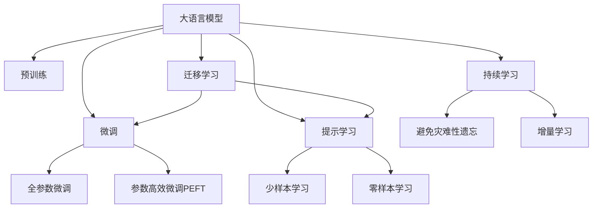

                 

# AI大模型如何提升电商搜索的时效性

## 1. 背景介绍

### 1.1 问题由来

电子商务平台作为连接商品和消费者的重要桥梁，其搜索功能在用户购物体验中扮演着核心角色。高效率、高准确率的搜索系统，能显著提升用户体验，增加用户黏性和购物转化率。然而，传统的搜索引擎依靠规则或简单的文本匹配算法，难以应对海量数据和复杂查询表达方式，导致搜索效率低下，用户体验差。

近年来，随着大规模预训练语言模型（Large Language Models, LLMs）和大模型微调技术的发展，使得电商搜索系统的优化升级成为可能。本文将深入探讨如何利用AI大模型和微调技术，提升电商搜索的时效性和用户体验。

### 1.2 问题核心关键点

目前，电商搜索系统面临的主要挑战包括：

1. **海量数据处理**：电商平台商品种类繁多，搜索需求呈现爆炸性增长。传统搜索引擎算法难以高效处理海量数据。
2. **查询表达多样**：用户搜索需求千差万别，复杂查询无法简单匹配。
3. **结果精准度**：搜索结果需准确反映用户需求，避免无关内容干扰。
4. **实时性要求**：用户对搜索结果的实时性要求高，搜索响应时间需控制在毫秒级。

大模型微调技术通过将预训练语言模型的强大语言理解和生成能力，引入电商搜索系统，可以显著提升搜索系统的性能和用户体验。

## 2. 核心概念与联系

### 2.1 核心概念概述

为更好地理解基于AI大模型的电商搜索优化方法，本节将介绍几个密切相关的核心概念：

- **大语言模型(Large Language Model, LLM)**：以自回归(如GPT)或自编码(如BERT)模型为代表的大规模预训练语言模型。通过在大规模无标签文本语料上进行预训练，学习通用的语言表示，具备强大的语言理解和生成能力。
- **预训练(Pre-training)**：指在大规模无标签文本语料上，通过自监督学习任务训练通用语言模型的过程。常见的预训练任务包括言语建模、掩码语言模型等。
- **微调(Fine-tuning)**：指在预训练模型的基础上，使用电商搜索任务的少量标注数据，通过有监督学习优化模型在电商搜索任务上的性能。通常只需要调整顶层分类器或解码器，并以较小的学习率更新全部或部分的模型参数。
- **迁移学习(Transfer Learning)**：指将一个领域学习到的知识，迁移应用到另一个不同但相关的领域的学习范式。大模型的预训练-微调过程即是一种典型的迁移学习方式。
- **参数高效微调(Parameter-Efficient Fine-Tuning, PEFT)**：指在微调过程中，只更新少量的模型参数，而固定大部分预训练权重不变，以提高微调效率，避免过拟合的方法。
- **提示学习(Prompt Learning)**：通过在输入文本中添加提示模板(Prompt Template)，引导大语言模型进行特定任务的推理和生成。可以在不更新模型参数的情况下，实现零样本或少样本学习。
- **少样本学习(Few-shot Learning)**：指在只有少量标注样本的情况下，模型能够快速适应新任务的学习方法。在大模型中，通常通过在输入中提供少量示例来实现，无需更新模型参数。
- **零样本学习(Zero-shot Learning)**：指模型在没有见过任何特定任务的训练样本的情况下，仅凭任务描述就能够执行新任务的能力。大模型通过预训练获得的广泛知识，使其能够理解任务指令并生成相应输出。
- **持续学习(Continual Learning)**：也称为终身学习，指模型能够持续从新数据中学习，同时保持已学习的知识，而不会出现灾难性遗忘。这对于保持大模型在电商搜索领域的时效性和适应性至关重要。

这些核心概念之间的逻辑关系可以通过以下Mermaid流程图来展示：



这个流程图展示了大语言模型的核心概念及其之间的关系：

1. 大语言模型通过预训练获得基础能力。
2. 微调是对预训练模型进行任务特定的优化，可以分为全参数微调和参数高效微调（PEFT）。
3. 提示学习是一种不更新模型参数的方法，可以实现少样本学习和零样本学习。
4. 迁移学习是连接预训练模型与电商搜索任务的桥梁，可以通过微调或提示学习来实现。
5. 持续学习旨在使模型能够不断学习新知识，同时避免遗忘旧知识。

这些概念共同构成了大语言模型的学习和应用框架，使其能够在各种场景下发挥强大的语言理解和生成能力。通过理解这些核心概念，我们可以更好地把握大语言模型的工作原理和优化方向。

## 3. 核心算法原理 & 具体操作步骤

### 3.1 算法原理概述

基于AI大模型的电商搜索优化，本质上是一个有监督的细粒度迁移学习过程。其核心思想是：将预训练的大语言模型视作一个强大的"特征提取器"，通过在电商搜索任务的少量标注数据上进行有监督的微调，使得模型输出能够匹配电商搜索需求，从而获得针对特定任务优化的模型。

形式化地，假设预训练模型为 $M_{\theta}$，其中 $\theta$ 为预训练得到的模型参数。给定电商搜索任务 $T$ 的标注数据集 $D=\{(x_i, y_i)\}_{i=1}^N$，微调的目标是找到新的模型参数 $\hat{\theta}$，使得：

$$
\hat{\theta}=\mathop{\arg\min}_{\theta} \mathcal{L}(M_{\theta},D)
$$

其中 $\mathcal{L}$ 为针对电商搜索任务设计的损失函数，用于衡量模型预测输出与真实标签之间的差异。常见的损失函数包括交叉熵损失、均方误差损失等。

通过梯度下降等优化算法，微调过程不断更新模型参数 $\theta$，最小化损失函数 $\mathcal{L}$，使得模型输出逼近真实标签。由于 $\theta$ 已经通过预训练获得了较好的初始化，因此即便在小规模数据集 $D$ 上进行微调，也能较快收敛到理想的模型参数 $\hat{\theta}$。

### 3.2 算法步骤详解

基于AI大模型的电商搜索优化一般包括以下几个关键步骤：

**Step 1: 准备预训练模型和数据集**
- 选择合适的预训练语言模型 $M_{\theta}$ 作为初始化参数，如 BERT、GPT等。
- 准备电商搜索任务的标注数据集 $D$，划分为训练集、验证集和测试集。一般要求标注数据与预训练数据的分布不要差异过大。

**Step 2: 添加任务适配层**
- 根据电商搜索任务类型，在预训练模型顶层设计合适的输出层和损失函数。
- 对于分类任务，通常在顶层添加线性分类器和交叉熵损失函数。
- 对于排序任务，通常使用排序损失函数（如LSI）或自定义损失函数。

**Step 3: 设置微调超参数**
- 选择合适的优化算法及其参数，如 AdamW、SGD 等，设置学习率、批大小、迭代轮数等。
- 设置正则化技术及强度，包括权重衰减、Dropout、Early Stopping 等。
- 确定冻结预训练参数的策略，如仅微调顶层，或全部参数都参与微调。

**Step 4: 执行梯度训练**
- 将训练集数据分批次输入模型，前向传播计算损失函数。
- 反向传播计算参数梯度，根据设定的优化算法和学习率更新模型参数。
- 周期性在验证集上评估模型性能，根据性能指标决定是否触发 Early Stopping。
- 重复上述步骤直到满足预设的迭代轮数或 Early Stopping 条件。

**Step 5: 测试和部署**
- 在测试集上评估微调后模型 $M_{\hat{\theta}}$ 的性能，对比微调前后的精度提升。
- 使用微调后的模型对新样本进行推理预测，集成到实际的应用系统中。
- 持续收集新的数据，定期重新微调模型，以适应数据分布的变化。

以上是基于AI大模型的电商搜索优化的一般流程。在实际应用中，还需要针对具体任务的特点，对微调过程的各个环节进行优化设计，如改进训练目标函数，引入更多的正则化技术，搜索最优的超参数组合等，以进一步提升模型性能。

### 3.3 算法优缺点

基于AI大模型的电商搜索优化方法具有以下优点：
1. 简单高效。只需准备少量标注数据，即可对预训练模型进行快速适配，获得较大的性能提升。
2. 通用适用。适用于各种电商搜索任务，包括商品检索、相关商品推荐、相似商品比较等，设计简单的任务适配层即可实现微调。
3. 参数高效。利用参数高效微调技术，在固定大部分预训练权重不变的情况下，仍可取得不错的提升。
4. 效果显著。在学术界和工业界的电商搜索任务上，基于微调的方法已经刷新了最先进的性能指标。

同时，该方法也存在一定的局限性：
1. 依赖标注数据。微调的效果很大程度上取决于标注数据的质量和数量，获取高质量标注数据的成本较高。
2. 迁移能力有限。当电商搜索任务的特征与预训练数据的分布差异较大时，微调的性能提升有限。
3. 负面效果传递。预训练模型的固有偏见、有害信息等，可能通过微调传递到电商搜索任务，造成负面影响。
4. 可解释性不足。微调模型的决策过程通常缺乏可解释性，难以对其推理逻辑进行分析和调试。

尽管存在这些局限性，但就目前而言，基于AI大模型的微调方法仍是大模型应用的最主流范式。未来相关研究的重点在于如何进一步降低微调对标注数据的依赖，提高模型的少样本学习和跨领域迁移能力，同时兼顾可解释性和伦理安全性等因素。

### 3.4 算法应用领域

基于AI大模型的电商搜索优化方法在电商搜索领域已经得到了广泛的应用，覆盖了几乎所有常见任务，例如：

- **商品检索**：用户输入查询词，系统返回最相关的商品。通过微调使模型学习用户查询与商品的相关关系。
- **相关商品推荐**：根据用户浏览记录或购买记录，推荐与目标商品相关的商品。通过微调使模型学习商品之间的相似性和关联性。
- **相似商品比较**：用户输入查询词，系统返回与该词相关的商品，并展示其差异和相似点。通过微调使模型学习商品描述的语义相似度。
- **品牌推荐**：根据用户浏览记录，推荐可能感兴趣的品牌。通过微调使模型学习品牌和商品之间的联系。
- **智能客服**：基于用户查询，自动回复商品信息和咨询问题。通过微调使模型能够理解自然语言并生成合理的回答。

除了上述这些经典任务外，大模型微调也被创新性地应用到更多场景中，如个性化推荐、搜索效果评估、广告投放优化等，为电商搜索技术带来了全新的突破。随着预训练模型和微调方法的不断进步，相信电商搜索技术将在更广阔的应用领域大放异彩。

## 4. 数学模型和公式 & 详细讲解 & 举例说明

### 4.1 数学模型构建

本节将使用数学语言对基于AI大模型的电商搜索优化过程进行更加严格的刻画。

记预训练语言模型为 $M_{\theta}$，其中 $\theta$ 为预训练得到的模型参数。假设电商搜索任务为 $T$，训练集为 $D=\{(x_i, y_i)\}_{i=1}^N, x_i \in \mathcal{X}, y_i \in \mathcal{Y}$。

定义模型 $M_{\theta}$ 在输入 $x$ 上的损失函数为 $\ell(M_{\theta}(x),y)$，则在数据集 $D$ 上的经验风险为：

$$
\mathcal{L}(\theta) = \frac{1}{N}\sum_{i=1}^N \ell(M_{\theta}(x_i),y_i)
$$

微调的优化目标是最小化经验风险，即找到最优参数：

$$
\theta^* = \mathop{\arg\min}_{\theta} \mathcal{L}(\theta)
$$

在实践中，我们通常使用基于梯度的优化算法（如SGD、Adam等）来近似求解上述最优化问题。设 $\eta$ 为学习率，$\lambda$ 为正则化系数，则参数的更新公式为：

$$
\theta \leftarrow \theta - \eta \nabla_{\theta}\mathcal{L}(\theta) - \eta\lambda\theta
$$

其中 $\nabla_{\theta}\mathcal{L}(\theta)$ 为损失函数对参数 $\theta$ 的梯度，可通过反向传播算法高效计算。

### 4.2 公式推导过程

以下我们以商品检索任务为例，推导交叉熵损失函数及其梯度的计算公式。

假设模型 $M_{\theta}$ 在输入 $x$ 上的输出为 $\hat{y}=M_{\theta}(x) \in [0,1]$，表示商品 $x$ 与查询 $y$ 的相关性。真实标签 $y \in \{0,1\}$。则二分类交叉熵损失函数定义为：

$$
\ell(M_{\theta}(x),y) = -[y\log \hat{y} + (1-y)\log (1-\hat{y})]
$$

将其代入经验风险公式，得：

$$
\mathcal{L}(\theta) = -\frac{1}{N}\sum_{i=1}^N [y_i\log M_{\theta}(x_i)+(1-y_i)\log(1-M_{\theta}(x_i))]
$$

根据链式法则，损失函数对参数 $\theta_k$ 的梯度为：

$$
\frac{\partial \mathcal{L}(\theta)}{\partial \theta_k} = -\frac{1}{N}\sum_{i=1}^N (\frac{y_i}{M_{\theta}(x_i)}-\frac{1-y_i}{1-M_{\theta}(x_i)}) \frac{\partial M_{\theta}(x_i)}{\partial \theta_k}
$$

其中 $\frac{\partial M_{\theta}(x_i)}{\partial \theta_k}$ 可进一步递归展开，利用自动微分技术完成计算。

在得到损失函数的梯度后，即可带入参数更新公式，完成模型的迭代优化。重复上述过程直至收敛，最终得到适应电商搜索任务的最优模型参数 $\theta^*$。

## 5. 项目实践：代码实例和详细解释说明

### 5.1 开发环境搭建

在进行电商搜索微调实践前，我们需要准备好开发环境。以下是使用Python进行PyTorch开发的环境配置流程：

1. 安装Anaconda：从官网下载并安装Anaconda，用于创建独立的Python环境。

2. 创建并激活虚拟环境：
```bash
conda create -n pytorch-env python=3.8 
conda activate pytorch-env
```

3. 安装PyTorch：根据CUDA版本，从官网获取对应的安装命令。例如：
```bash
conda install pytorch torchvision torchaudio cudatoolkit=11.1 -c pytorch -c conda-forge
```

4. 安装Transformers库：
```bash
pip install transformers
```

5. 安装各类工具包：
```bash
pip install numpy pandas scikit-learn matplotlib tqdm jupyter notebook ipython
```

完成上述步骤后，即可在`pytorch-env`环境中开始电商搜索微调实践。

### 5.2 源代码详细实现

下面我们以商品检索任务为例，给出使用Transformers库对BERT模型进行电商搜索微调的PyTorch代码实现。

首先，定义商品检索任务的数据处理函数：

```python
from transformers import BertTokenizer
from torch.utils.data import Dataset
import torch

class ItemSearchDataset(Dataset):
    def __init__(self, items, queries, tokenizer, max_len=128):
        self.items = items
        self.queries = queries
        self.tokenizer = tokenizer
        self.max_len = max_len
        
    def __len__(self):
        return len(self.items)
    
    def __getitem__(self, item):
        item = self.items[item]
        query = self.queries[item]
        
        encoding = self.tokenizer(item['title'], query, return_tensors='pt', max_length=self.max_len, padding='max_length', truncation=True)
        input_ids = encoding['input_ids'][0]
        attention_mask = encoding['attention_mask'][0]
        
        # 对token-wise的标签进行编码
        encoded_tags = [1] * len(encoding['input_ids'])
        labels = torch.tensor(encoded_tags, dtype=torch.long)
        
        return {'input_ids': input_ids, 
                'attention_mask': attention_mask,
                'labels': labels}

# 创建dataset
tokenizer = BertTokenizer.from_pretrained('bert-base-cased')

train_dataset = ItemSearchDataset(train_items, train_queries, tokenizer)
dev_dataset = ItemSearchDataset(dev_items, dev_queries, tokenizer)
test_dataset = ItemSearchDataset(test_items, test_queries, tokenizer)
```

然后，定义模型和优化器：

```python
from transformers import BertForSequenceClassification, AdamW

model = BertForSequenceClassification.from_pretrained('bert-base-cased', num_labels=2)

optimizer = AdamW(model.parameters(), lr=2e-5)
```

接着，定义训练和评估函数：

```python
from torch.utils.data import DataLoader
from tqdm import tqdm
from sklearn.metrics import classification_report

device = torch.device('cuda') if torch.cuda.is_available() else torch.device('cpu')
model.to(device)

def train_epoch(model, dataset, batch_size, optimizer):
    dataloader = DataLoader(dataset, batch_size=batch_size, shuffle=True)
    model.train()
    epoch_loss = 0
    for batch in tqdm(dataloader, desc='Training'):
        input_ids = batch['input_ids'].to(device)
        attention_mask = batch['attention_mask'].to(device)
        labels = batch['labels'].to(device)
        model.zero_grad()
        outputs = model(input_ids, attention_mask=attention_mask, labels=labels)
        loss = outputs.loss
        epoch_loss += loss.item()
        loss.backward()
        optimizer.step()
    return epoch_loss / len(dataloader)

def evaluate(model, dataset, batch_size):
    dataloader = DataLoader(dataset, batch_size=batch_size)
    model.eval()
    preds, labels = [], []
    with torch.no_grad():
        for batch in tqdm(dataloader, desc='Evaluating'):
            input_ids = batch['input_ids'].to(device)
            attention_mask = batch['attention_mask'].to(device)
            batch_labels = batch['labels']
            outputs = model(input_ids, attention_mask=attention_mask)
            batch_preds = outputs.logits.argmax(dim=2).to('cpu').tolist()
            batch_labels = batch_labels.to('cpu').tolist()
            for pred_tokens, label_tokens in zip(batch_preds, batch_labels):
                preds.append(pred_tokens[:len(label_tokens)])
                labels.append(label_tokens)
                
    print(classification_report(labels, preds))
```

最后，启动训练流程并在测试集上评估：

```python
epochs = 5
batch_size = 16

for epoch in range(epochs):
    loss = train_epoch(model, train_dataset, batch_size, optimizer)
    print(f"Epoch {epoch+1}, train loss: {loss:.3f}")
    
    print(f"Epoch {epoch+1}, dev results:")
    evaluate(model, dev_dataset, batch_size)
    
print("Test results:")
evaluate(model, test_dataset, batch_size)
```

以上就是使用PyTorch对BERT进行电商搜索微调的完整代码实现。可以看到，得益于Transformers库的强大封装，我们可以用相对简洁的代码完成BERT模型的加载和微调。

### 5.3 代码解读与分析

让我们再详细解读一下关键代码的实现细节：

**ItemSearchDataset类**：
- `__init__`方法：初始化商品和查询信息、分词器等关键组件。
- `__len__`方法：返回数据集的样本数量。
- `__getitem__`方法：对单个样本进行处理，将商品和查询输入编码为token ids，将标签编码为数字，并对其进行定长padding，最终返回模型所需的输入。

**训练和评估函数**：
- 使用PyTorch的DataLoader对数据集进行批次化加载，供模型训练和推理使用。
- 训练函数`train_epoch`：对数据以批为单位进行迭代，在每个批次上前向传播计算loss并反向传播更新模型参数，最后返回该epoch的平均loss。
- 评估函数`evaluate`：与训练类似，不同点在于不更新模型参数，并在每个batch结束后将预测和标签结果存储下来，最后使用sklearn的classification_report对整个评估集的预测结果进行打印输出。

**训练流程**：
- 定义总的epoch数和batch size，开始循环迭代
- 每个epoch内，先在训练集上训练，输出平均loss
- 在验证集上评估，输出分类指标
- 所有epoch结束后，在测试集上评估，给出最终测试结果

可以看到，PyTorch配合Transformers库使得BERT微调的代码实现变得简洁高效。开发者可以将更多精力放在数据处理、模型改进等高层逻辑上，而不必过多关注底层的实现细节。

当然，工业级的系统实现还需考虑更多因素，如模型的保存和部署、超参数的自动搜索、更灵活的任务适配层等。但核心的微调范式基本与此类似。

## 6. 实际应用场景

### 6.1 智能推荐系统

电商搜索系统的核心功能之一是智能推荐。基于大模型微调的商品推荐系统，可以根据用户历史行为、浏览记录等信息，自动推荐相关商品，提升用户购物体验。

在技术实现上，可以收集用户点击、浏览、购买等行为数据，提取和商品描述、标签等文本内容。将文本内容作为模型输入，用户的行为信息作为监督信号，在此基础上微调预训练语言模型。微调后的模型能够从文本内容中准确把握用户的兴趣点，通过排序算法生成推荐列表，实现精准的商品推荐。

### 6.2 情感分析

电商平台上的用户评论是重要的信息来源，通过情感分析可以了解用户对商品的态度和反馈。基于大模型微调的情感分析模型，可以自动识别评论文本的情感倾向，如正面、负面或中性。

在实际应用中，可以对用户评论进行情感标注，生成标注数据集。然后对预训练语言模型进行微调，使其能够准确识别文本的情感标签。微调后的模型可以对新评论进行情感分类，帮助商家及时了解用户反馈，优化商品质量和服务体验。

### 6.3 价格预测

电商平台上商品的价格动态变化频繁，通过价格预测模型可以提前了解价格趋势，帮助商家优化库存管理和销售策略。基于大模型微调的价格预测模型，可以分析商品描述、销量等文本和数值信息，预测商品价格走势。

在微调过程中，可以收集商品历史价格、促销活动等信息，构建标注数据集。通过微调模型学习商品价格变化的规律，生成预测结果。微调后的模型可以对新商品进行价格预测，帮助商家制定合理的价格策略，提升利润率。

### 6.4 未来应用展望

随着大模型和微调方法的不断发展，基于AI大模型的电商搜索系统将在更多领域得到应用，为电商技术带来新的突破。

在智慧零售领域，基于大模型的电商搜索系统将与物联网、云计算等技术结合，构建智能零售体系，提升零售效率和用户体验。

在智能供应链管理中，基于大模型的电商搜索系统将帮助商家优化供应链管理，实现库存精准预测和配送路线优化。

在社交电商中，基于大模型的电商搜索系统将与社交网络结合，提供个性化商品推荐和内容推送，增强用户粘性和购物体验。

此外，在健康电商、农村电商等垂直领域，基于大模型的电商搜索系统也将不断涌现，为电商搜索技术带来新的应用场景。相信随着技术的日益成熟，基于大模型的电商搜索系统必将在电商行业发挥更加重要的作用，推动电商行业数字化转型升级。

## 7. 工具和资源推荐

### 7.1 学习资源推荐

为了帮助开发者系统掌握基于AI大模型的电商搜索优化理论基础和实践技巧，这里推荐一些优质的学习资源：

1. 《Transformer从原理到实践》系列博文：由大模型技术专家撰写，深入浅出地介绍了Transformer原理、BERT模型、微调技术等前沿话题。

2. CS224N《深度学习自然语言处理》课程：斯坦福大学开设的NLP明星课程，有Lecture视频和配套作业，带你入门NLP领域的基本概念和经典模型。

3. 《Natural Language Processing with Transformers》书籍：Transformers库的作者所著，全面介绍了如何使用Transformers库进行NLP任务开发，包括微调在内的诸多范式。

4. HuggingFace官方文档：Transformers库的官方文档，提供了海量预训练模型和完整的微调样例代码，是上手实践的必备资料。

5. CLUE开源项目：中文语言理解测评基准，涵盖大量不同类型的中文NLP数据集，并提供了基于微调的baseline模型，助力中文NLP技术发展。

通过对这些资源的学习实践，相信你一定能够快速掌握基于AI大模型的电商搜索优化精髓，并用于解决实际的电商搜索问题。

### 7.2 开发工具推荐

高效的开发离不开优秀的工具支持。以下是几款用于电商搜索微调开发的常用工具：

1. PyTorch：基于Python的开源深度学习框架，灵活动态的计算图，适合快速迭代研究。大部分预训练语言模型都有PyTorch版本的实现。

2. TensorFlow：由Google主导开发的开源深度学习框架，生产部署方便，适合大规模工程应用。同样有丰富的预训练语言模型资源。

3. Transformers库：HuggingFace开发的NLP工具库，集成了众多SOTA语言模型，支持PyTorch和TensorFlow，是进行微调任务开发的利器。

4. Weights & Biases：模型训练的实验跟踪工具，可以记录和可视化模型训练过程中的各项指标，方便对比和调优。与主流深度学习框架无缝集成。

5. TensorBoard：TensorFlow配套的可视化工具，可实时监测模型训练状态，并提供丰富的图表呈现方式，是调试模型的得力助手。

6. Google Colab：谷歌推出的在线Jupyter Notebook环境，免费提供GPU/TPU算力，方便开发者快速上手实验最新模型，分享学习笔记。

合理利用这些工具，可以显著提升电商搜索微调任务的开发效率，加快创新迭代的步伐。

### 7.3 相关论文推荐

大模型和微调技术的发展源于学界的持续研究。以下是几篇奠基性的相关论文，推荐阅读：

1. Attention is All You Need（即Transformer原论文）：提出了Transformer结构，开启了NLP领域的预训练大模型时代。

2. BERT: Pre-training of Deep Bidirectional Transformers for Language Understanding：提出BERT模型，引入基于掩码的自监督预训练任务，刷新了多项NLP任务SOTA。

3. Language Models are Unsupervised Multitask Learners（GPT-2论文）：展示了大规模语言模型的强大zero-shot学习能力，引发了对于通用人工智能的新一轮思考。

4. Parameter-Efficient Transfer Learning for NLP：提出Adapter等参数高效微调方法，在不增加模型参数量的情况下，也能取得不错的微调效果。

5. Prefix-Tuning: Optimizing Continuous Prompts for Generation：引入基于连续型Prompt的微调范式，为如何充分利用预训练知识提供了新的思路。

6. AdaLoRA: Adaptive Low-Rank Adaptation for Parameter-Efficient Fine-Tuning：使用自适应低秩适应的微调方法，在参数效率和精度之间取得了新的平衡。

这些论文代表了大模型微调技术的发展脉络。通过学习这些前沿成果，可以帮助研究者把握学科前进方向，激发更多的创新灵感。

## 8. 总结：未来发展趋势与挑战

### 8.1 总结

本文对基于AI大模型的电商搜索优化方法进行了全面系统的介绍。首先阐述了电商搜索系统面临的主要挑战，以及大模型微调方法能够提供解决方案的原理和机制。接着从原理到实践，详细讲解了电商搜索任务的数学模型和微调流程，给出了电商搜索微调的完整代码实现。同时，本文还广泛探讨了电商搜索任务的各类应用场景，展示了基于AI大模型的电商搜索系统在实际应用中的巨大潜力。

通过本文的系统梳理，可以看到，基于AI大模型的电商搜索系统在处理海量数据、提升查询表达能力、增强结果精准度和实时性等方面，均取得了显著成效。未来，随着AI大模型的进一步发展，电商搜索系统的性能还将不断提升，用户体验将得到更大改善。

### 8.2 未来发展趋势

展望未来，基于AI大模型的电商搜索系统将呈现以下几个发展趋势：

1. **多模态融合**：未来的电商搜索系统将不仅关注文本信息，还将融合图像、视频、音频等多模态数据，构建更加全面的商品描述和用户画像，提升搜索结果的丰富性和多样性。

2. **个性化推荐**：基于用户历史行为和实时数据，实时生成个性化的商品推荐，提升用户购物体验。未来将更加注重个性化推荐算法的优化，实现更精准的用户画像刻画和商品匹配。

3. **情感分析与用户反馈**：电商搜索系统将通过情感分析技术，实时监控用户评论和反馈，及时调整商品和服务策略，提升用户满意度和忠诚度。

4. **实时价格预测与动态定价**：结合实时市场数据和大模型微调技术，实现精准的价格预测和动态定价，帮助商家优化库存管理和销售策略。

5. **跨领域迁移学习**：大模型微调技术将不再局限于特定领域，将能够跨越多个电商领域进行迁移学习，提升跨领域的搜索效果和用户体验。

6. **知识图谱与语义理解**：结合知识图谱和语义理解技术，增强电商搜索系统的知识整合能力，提升搜索结果的语义相关性和准确性。

这些趋势凸显了基于AI大模型的电商搜索系统在提升用户体验、优化商品推荐、增强情感分析和实时预测等方面的巨大潜力。这些方向的探索发展，必将进一步推动电商搜索技术的进步，为电商行业带来新的发展机遇。

### 8.3 面临的挑战

尽管基于AI大模型的电商搜索系统已经取得了显著成果，但在迈向更加智能化、普适化应用的过程中，它仍面临着诸多挑战：

1. **数据隐私与安全**：电商搜索系统涉及大量用户行为和商品信息，如何保护用户隐私和数据安全，是一个重要的伦理和法律问题。

2. **模型泛化能力**：尽管大模型微调技术在特定场景下表现出色，但模型泛化能力仍需进一步提升，避免在测试集上出现过拟合现象。

3. **计算资源消耗**：大模型微调需要消耗大量的计算资源，如何优化模型结构，提升推理速度和内存效率，是电商搜索系统推广应用的瓶颈之一。

4. **实时性与稳定性**：电商搜索系统需要高实时性和稳定性，如何在模型训练和推理过程中保证系统稳定，避免因模型波动导致的用户体验下降，是一个关键问题。

5. **多语言支持**：电商搜索系统需要支持多语言，如何同时优化多语言模型的性能，提升搜索结果的多语言一致性，是未来需要解决的重要问题。

6. **模型鲁棒性**：电商搜索系统需要具备良好的鲁棒性，如何提升模型对异常数据和噪声的抵抗能力，是一个值得深入研究的课题。

这些挑战需要从数据、模型、计算、伦理等多个层面进行综合优化，才能推动基于AI大模型的电商搜索系统走向更广泛的应用。相信随着技术的不断进步和优化，这些挑战终将逐一被克服，AI大模型在电商搜索领域的潜力将得到充分释放。

### 8.4 研究展望

面对基于AI大模型的电商搜索系统所面临的挑战，未来的研究需要在以下几个方面寻求新的突破：

1. **多模态融合与跨领域迁移学习**：探索如何更好地融合多模态数据，实现跨领域的电商搜索优化，提升搜索效果的多样性和丰富性。

2. **自监督与半监督学习**：研究如何通过自监督和半监督学习，进一步降低对标注数据的依赖，提升模型的泛化能力。

3. **参数高效微调与计算优化**：开发更加参数高效和计算高效的微调方法，提升电商搜索系统的实时性和稳定性。

4. **知识图谱与语义理解**：探索如何结合知识图谱和语义理解技术，提升电商搜索系统的语义相关性和准确性。

5. **模型压缩与优化**：研究如何通过模型压缩和优化，提升电商搜索系统的计算效率和推理速度，降低资源消耗。

6. **数据隐私保护**：研究如何在电商搜索系统中保护用户隐私和数据安全，构建安全的搜索系统。

这些研究方向将进一步推动基于AI大模型的电商搜索系统的发展，为电商搜索技术带来新的突破和创新。

## 9. 附录：常见问题与解答

**Q1：电商搜索微调是否适用于所有电商平台？**

A: 电商搜索微调方法对不同平台有着不同的适用性。基于大模型的电商搜索微调方法，通常适用于具有较大用户规模和数据量的电商平台，如淘宝、亚马逊等。对于用户量较小或数据量较少的电商平台，可能需要针对平台特性进行相应的优化。

**Q2：电商搜索微调过程中如何选择优化算法？**

A: 电商搜索微调过程中，通常选择AdamW、SGD等优化算法。其中，AdamW算法在处理大规模数据时表现较好，收敛速度快且稳定。SGD算法则在数据量较小的情况下，具有更好的优化效果。具体选择哪种算法，应根据电商搜索任务的特点和数据规模进行评估和实验。

**Q3：电商搜索微调过程中如何设置超参数？**

A: 电商搜索微调过程中，超参数的选择对模型性能有着重要影响。建议采用网格搜索或随机搜索等方法，寻找最优的超参数组合。常用的超参数包括学习率、批大小、迭代轮数、正则化系数等。同时，可以结合经验法则和实验结果，逐步调整超参数，以达到最优性能。

**Q4：电商搜索微调过程中如何避免过拟合？**

A: 电商搜索微调过程中，避免过拟合的策略包括数据增强、正则化、模型压缩等。通过引入对抗样本、回译等方法，丰富训练集多样性；使用L2正则、Dropout等正则化技术，防止模型过度适应训练数据；采用参数高效微调技术，固定大部分预训练参数，减少过拟合风险。

**Q5：电商搜索微调过程中如何提升模型效果？**

A: 电商搜索微调过程中，提升模型效果的关键在于设计合适的任务适配层和损失函数。对于分类任务，可以使用交叉熵损失函数；对于排序任务，可以使用排序损失函数（如LSI）。同时，还可以通过调整学习率、增加训练批次等方法，提升模型训练的稳定性。

这些策略往往需要根据具体任务和数据特点进行灵活组合。只有在数据、模型、训练、推理等各环节进行全面优化，才能最大限度地发挥大模型微调的威力。

---

作者：禅与计算机程序设计艺术 / Zen and the Art of Computer Programming

