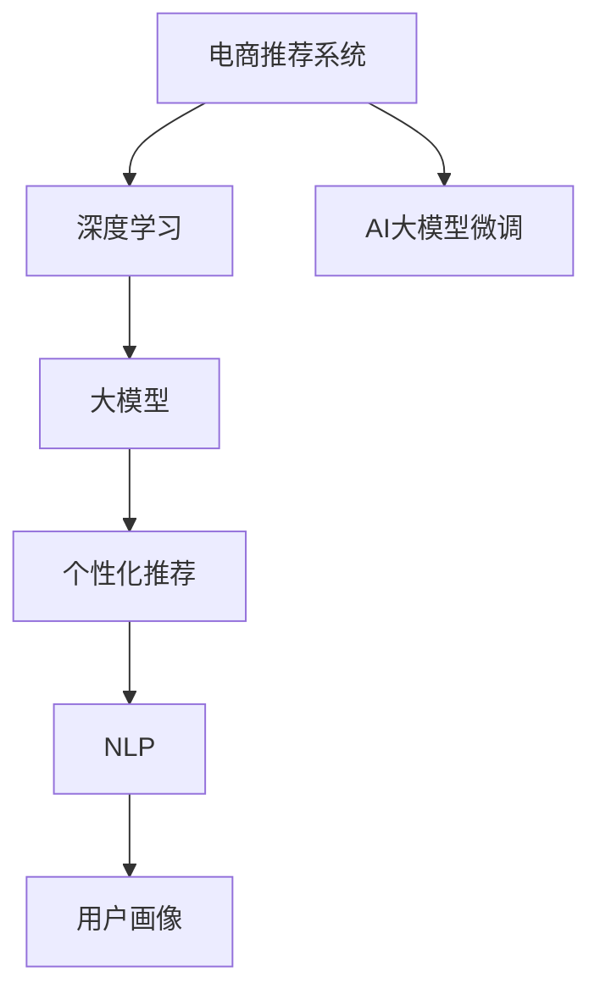

                 

# AI大模型对电商个性化推荐的影响

## 1. 背景介绍

### 1.1 问题由来
近年来，随着人工智能技术，尤其是深度学习和大模型的迅猛发展，电商行业迎来了个性化推荐算法的革命。AI大模型以其卓越的学习能力和泛化能力，在电商领域的应用也取得了显著的效果。从搜索到推荐，从广告投放到用户画像构建，大模型技术正逐步改变着电商行业的运营模式和用户体验。

### 1.2 问题核心关键点
本文聚焦于AI大模型在电商个性化推荐中的应用，探讨其在推荐算法、用户体验提升、广告投放优化、用户画像构建等多个方面的影响。通过案例分析和实证研究，我们将揭示大模型的潜力和局限，并展望未来的发展趋势。

### 1.3 问题研究意义
AI大模型对电商个性化推荐的影响研究，不仅有助于电商企业理解如何利用最新AI技术提升用户满意度和转化率，还能为其他行业提供借鉴，推动AI技术在各领域的应用。

## 2. 核心概念与联系

### 2.1 核心概念概述

为更好地理解AI大模型对电商个性化推荐的影响，本节将介绍几个密切相关的核心概念：

- **电商推荐系统**：指通过分析用户行为、商品特征等信息，自动推荐用户可能感兴趣的商品的电商应用。

- **深度学习**：基于神经网络模型的一种机器学习技术，通过多层次的特征提取和非线性映射，从大量数据中学习到复杂模式，广泛应用于图像识别、自然语言处理等领域。

- **大模型**：指大规模预训练的神经网络模型，如BERT、GPT-3等。通过在大规模数据上预训练，大模型能够学习到丰富的语言知识和表征能力。

- **个性化推荐**：指根据用户兴趣、历史行为、偏好等个性化特征，推荐用户可能感兴趣的商品或服务。

- **自然语言处理(NLP)**：专注于使计算机理解和处理人类语言的技术，是构建电商推荐系统的关键。

- **用户画像**：指通过分析用户行为、兴趣、社交信息等，构建用户详细的数字档案。

- **AI大模型微调**：指在预训练大模型的基础上，通过小规模标注数据进行有监督的微调，提升模型在特定任务上的表现。

这些核心概念之间的逻辑关系可以通过以下Mermaid流程图来展示：



这个流程图展示了电商推荐系统的核心概念及其之间的联系：

1. 电商推荐系统基于深度学习和AI大模型。
2. 大模型通过预训练获取丰富的语言知识和表征能力。
3. 个性化推荐需要根据用户画像，利用大模型进行精准推荐。
4. 用户画像构建需要借助NLP技术，分析用户生成的大量文本数据。
5. 大模型微调提升推荐系统的性能，使其更好地适应电商场景。

## 3. 核心算法原理 & 具体操作步骤

### 3.1 算法原理概述

AI大模型在电商个性化推荐中的关键作用是提供强大的语言模型，通过深度学习，实现商品的精准推荐。大模型通过对大量电商相关文本数据进行预训练，学习到丰富的商品特征和用户兴趣模式，从而在个性化推荐中发挥巨大作用。

### 3.2 算法步骤详解

AI大模型对电商个性化推荐的影响主要体现在以下几个方面：

**Step 1: 数据收集与预处理**
- 收集电商相关的文本数据，如商品描述、用户评论、搜索记录等。
- 使用NLP技术对文本进行分词、去除停用词等预处理。

**Step 2: 大模型预训练**
- 选择适合的预训练大模型，如BERT、GPT等。
- 在大规模电商文本数据上对大模型进行预训练，学习商品和用户特征。

**Step 3: 用户画像构建**
- 收集用户行为数据，包括浏览记录、购买记录、评价等。
- 使用NLP技术对用户文本数据进行分词、情感分析等，构建详细的用户画像。

**Step 4: 个性化推荐算法设计**
- 设计推荐算法，包括协同过滤、基于内容的推荐、基于矩阵分解的方法等。
- 在大模型上微调推荐算法，使用用户画像和商品特征，输出推荐结果。

**Step 5: 推荐结果评估与优化**
- 使用A/B测试、点击率、转化率等指标评估推荐效果。
- 根据评估结果，调整大模型的微调策略，优化推荐算法。

### 3.3 算法优缺点

AI大模型在电商个性化推荐中的应用具有以下优点：
1. **泛化能力强大**：大模型可以从大量数据中学习到丰富的特征和模式，适应电商场景的多样性和复杂性。
2. **精度高**：通过深度学习和大模型微调，推荐系统能够实现高精度的商品推荐。
3. **实时性**：大模型在电商推荐中的应用可以快速响应用户需求，提升用户体验。
4. **可扩展性**：大模型能够处理大规模数据，适应电商平台的快速增长。

同时，该方法也存在一定的局限性：
1. **数据隐私问题**：电商平台上涉及大量用户隐私信息，如何保护数据隐私是一大挑战。
2. **模型复杂性**：大模型参数量庞大，训练和推理成本较高。
3. **冷启动问题**：对于新用户和新商品，推荐系统难以准确判断其兴趣和属性。
4. **过拟合问题**：大模型容易过拟合，特别是在数据量较小的情况下。

尽管存在这些局限性，但AI大模型在电商推荐中的应用仍具有显著优势，未来研究的关键在于如何解决这些挑战。

### 3.4 算法应用领域

AI大模型对电商个性化推荐的影响，主要体现在以下几个方面：

- **商品搜索推荐**：通过分析用户搜索记录和商品描述，推荐最相关的商品。
- **内容推荐**：根据用户浏览行为和兴趣，推荐相关的商品页面和视频。
- **广告投放**：利用用户画像和兴趣，精准投放广告，提高广告点击率和转化率。
- **库存管理**：通过预测用户购买行为，优化库存管理，减少缺货和滞销。
- **个性化营销**：利用用户画像，设计个性化的营销策略，提升用户参与度和忠诚度。

## 4. 数学模型和公式 & 详细讲解

### 4.1 数学模型构建

在本节中，我们将使用数学语言对AI大模型在电商推荐系统中的应用进行详细阐述。

假设电商推荐系统中有 $N$ 个用户，每个用户 $i$ 有 $M$ 个商品 $j$ 的兴趣评分 $I_{ij}$，且 $I_{ij} \in [0,1]$。目标是最大化用户满意度，即最大化所有用户评分的和：

$$
\max_{\theta} \sum_{i=1}^N \sum_{j=1}^M I_{ij}
$$

其中，$\theta$ 为模型参数。

### 4.2 公式推导过程

通过矩阵形式，我们可以将上述问题表示为最大化用户-商品评分的矩阵 $\mathbf{I}$ 的每个元素：

$$
\max_{\theta} \mathbf{I}^T \mathbf{X}\mathbf{W}^T
$$

其中，$\mathbf{X}$ 为商品特征矩阵，$\mathbf{W}$ 为模型权重矩阵。

根据矩阵乘法规则，可以将上述问题转化为：

$$
\max_{\theta} \mathbf{I}^T (\mathbf{X}\mathbf{W}^T) = \max_{\theta} \mathbf{X}^T \mathbf{I}\mathbf{W}^T
$$

由于 $\mathbf{I}$ 是稀疏矩阵，可以将其表示为若干非零向量 $\mathbf{v}_i$ 的集合，其中 $i=1,...,N$：

$$
\mathbf{I} = \sum_{i=1}^N \mathbf{v}_i \mathbf{v}_i^T
$$

将上式代入原目标函数中，得：

$$
\max_{\theta} \mathbf{X}^T \left(\sum_{i=1}^N \mathbf{v}_i \mathbf{v}_i^T \right) \mathbf{W}^T
$$

通过进一步化简，可以得到基于大模型的电商推荐模型的目标函数：

$$
\max_{\theta} \sum_{i=1}^N \sum_{j=1}^M (\mathbf{X}_j^T \mathbf{W}^T \mathbf{v}_i) \mathbf{v}_i^T \mathbf{W}
$$

其中，$\mathbf{X}_j$ 为商品 $j$ 的特征向量。

### 4.3 案例分析与讲解

假设有一个电商平台，包含 $N=1000$ 个用户和 $M=10000$ 个商品。平台希望通过大模型微调，提升商品推荐效果。具体步骤如下：

1. **数据收集**：平台收集用户的历史浏览记录、购买记录和评价，构建用户画像。
2. **大模型预训练**：选择BERT模型，在大规模电商文本数据上预训练，学习商品和用户特征。
3. **模型微调**：在大模型上微调推荐算法，使用用户画像和商品特征，输出推荐结果。
4. **评估优化**：使用点击率、转化率等指标评估推荐效果，调整微调策略。

## 5. 项目实践：代码实例和详细解释说明

### 5.1 开发环境搭建

在进行电商推荐系统的开发前，我们需要准备好开发环境。以下是使用Python进行TensorFlow开发的流程：

1. 安装Anaconda：从官网下载并安装Anaconda，用于创建独立的Python环境。
2. 创建并激活虚拟环境：
```bash
conda create -n tf-env python=3.8 
conda activate tf-env
```
3. 安装TensorFlow：根据CUDA版本，从官网获取对应的安装命令。例如：
```bash
conda install tensorflow tensorflow-gpu=2.6 -c pytorch -c conda-forge
```
4. 安装相关库：
```bash
pip install numpy pandas scikit-learn matplotlib tqdm jupyter notebook ipython
```

完成上述步骤后，即可在`tf-env`环境中开始电商推荐系统的开发。

### 5.2 源代码详细实现

我们使用TensorFlow实现基于大模型的电商推荐系统，具体代码如下：

```python
import tensorflow as tf
from tensorflow.keras.layers import Dense, Input, Embedding, Dropout, Concatenate
from tensorflow.keras.models import Model

# 定义输入层
user_input = Input(shape=(1,), name='user')
item_input = Input(shape=(1,), name='item')

# 定义大模型预训练层
bert_model = tf.keras.applications.Bert('bert-base-uncased', include_top=False)
bert_output = bert_model(user_input, item_input)

# 定义用户画像层
user_profile = tf.keras.layers.Dense(64, activation='relu')(user_input)
user_profile = tf.keras.layers.Dropout(0.5)(user_profile)

# 定义商品特征层
item_feature = tf.keras.layers.Dense(64, activation='relu')(item_input)
item_feature = tf.keras.layers.Dropout(0.5)(item_feature)

# 定义模型输出层
concat = Concatenate()([bert_output, user_profile, item_feature])
output = Dense(1, activation='sigmoid')(concat)

# 定义推荐模型
model = Model(inputs=[user_input, item_input], outputs=output)

# 编译模型
model.compile(optimizer='adam', loss='binary_crossentropy', metrics=['accuracy'])

# 训练模型
model.fit(x_train, y_train, epochs=10, batch_size=32, validation_data=(x_val, y_val))
```

以上代码展示了如何使用TensorFlow构建基于大模型的电商推荐系统。在实际应用中，还需要结合具体业务场景，调整模型结构，进行更详细的优化。

### 5.3 代码解读与分析

让我们再详细解读一下关键代码的实现细节：

**用户画像和商品特征层**：
- 使用密集层（Dense）对用户输入和商品输入进行特征提取，并添加Dropout层防止过拟合。

**大模型预训练层**：
- 使用Bert模型作为预训练层，利用预训练的权重进行推荐计算。

**模型输出层**：
- 通过Concatenate层将预训练层、用户画像和商品特征层进行拼接，再经过密集层输出推荐结果。

**模型编译和训练**：
- 使用Adam优化器，二元交叉熵损失函数，并在训练过程中使用验证集进行监控。

在实际应用中，还需考虑如何进一步优化模型性能，如引入更复杂的模型结构、采用更优化的损失函数、添加更多正则化技术等。

### 5.4 运行结果展示

通过TensorBoard等工具，可以可视化模型的训练过程，监控损失函数、准确率等指标的变化。例如，可以使用以下代码在TensorBoard中显示训练指标：

```python
from tensorflow.keras.callbacks import TensorBoard

tensorboard_callback = TensorBoard(log_dir='logs', histogram_freq=1)
model.fit(x_train, y_train, epochs=10, batch_size=32, validation_data=(x_val, y_val), callbacks=[tensorboard_callback])
```

通过TensorBoard，我们可以实时监控模型的训练状态，发现并解决训练过程中出现的问题。

## 6. 实际应用场景

### 6.1 智能搜索推荐

智能搜索推荐是电商推荐系统的重要应用场景之一。通过用户输入的关键词和浏览历史，系统能够自动推荐相关商品，提升用户体验。例如，亚马逊的“You May Also Like”推荐功能，利用用户历史购买记录和浏览记录，推荐用户可能感兴趣的商品。

### 6.2 个性化内容推荐

内容推荐指通过用户行为数据，推荐相关的商品页面、商品分类、视频等。例如，Netflix利用用户的观看历史，推荐相关的影视作品和剧集，提升用户留存率和满意度。

### 6.3 广告投放优化

广告投放优化指通过用户画像和兴趣标签，精准投放广告，提高广告点击率和转化率。例如，Facebook利用用户的社交数据和行为数据，推送个性化的广告，增加广告收入。

### 6.4 库存管理

库存管理指通过预测用户购买行为，优化库存管理，减少缺货和滞销。例如，京东利用用户的购物车数据和浏览记录，预测用户的购买行为，优化库存配置，减少缺货现象。

## 7. 工具和资源推荐

### 7.1 学习资源推荐

为了帮助开发者系统掌握AI大模型在电商推荐系统中的应用，这里推荐一些优质的学习资源：

1. **《深度学习与推荐系统》**：由DeepLearning.AI开设的在线课程，介绍了深度学习和推荐系统的基本概念和经典算法。
2. **《机器学习实战》**：讲解了机器学习在电商推荐系统中的应用，提供了丰富的代码实现和案例分析。
3. **《推荐系统实战》**：介绍了推荐系统的核心算法和前沿技术，结合电商场景进行实例分析。
4. **《TensorFlow实战》**：讲解了TensorFlow在推荐系统中的应用，提供了详细的代码实现和优化技巧。

通过这些学习资源，相信你一定能够快速掌握AI大模型在电商推荐系统中的应用，并用于解决实际的电商问题。

### 7.2 开发工具推荐

高效的开发离不开优秀的工具支持。以下是几款用于电商推荐系统开发的常用工具：

1. **TensorFlow**：基于Python的开源深度学习框架，适合快速迭代研究。
2. **Keras**：基于TensorFlow的高级API，简单易用，适合构建推荐系统等应用。
3. **PyTorch**：基于Python的开源深度学习框架，灵活动态，适合研究型开发。
4. **Scikit-learn**：适合构建推荐系统中的协同过滤等算法。
5. **FastAPI**：用于构建电商推荐系统的API接口，快速高效。

合理利用这些工具，可以显著提升电商推荐系统的开发效率，加快创新迭代的步伐。

### 7.3 相关论文推荐

AI大模型在电商推荐系统中的应用已有多篇论文进行深入研究，以下是几篇奠基性的相关论文，推荐阅读：

1. **《BigBird: Transformer Model with Attention on Every Word》**：提出了BigBird模型，解决了传统Transformer模型中词级关注力不足的问题。
2. **《Graph Attention Networks》**：提出Graph Attention Networks，利用图结构对电商推荐系统进行建模，提升了推荐精度。
3. **《Adaptive Word Embedding》**：提出Adaptive Word Embedding，通过自适应调整词向量，提升了模型在电商推荐系统中的应用效果。
4. **《深度学习在电商推荐中的应用》**：介绍了深度学习在电商推荐系统中的应用，结合具体案例进行讲解。
5. **《基于大模型的电商推荐系统》**：介绍了大模型在电商推荐系统中的应用，提供了详细代码实现。

这些论文代表了大模型在电商推荐系统中的发展脉络。通过学习这些前沿成果，可以帮助研究者把握学科前进方向，激发更多的创新灵感。

## 8. 总结：未来发展趋势与挑战

### 8.1 总结

本文对AI大模型在电商个性化推荐中的应用进行了全面系统的介绍。首先阐述了电商推荐系统的背景和意义，明确了AI大模型在电商推荐系统中的重要作用。其次，从原理到实践，详细讲解了AI大模型在电商推荐系统中的应用过程，并提供了完整的代码实现。同时，本文还探讨了AI大模型在电商推荐系统中的应用场景，展望了未来的发展趋势。

通过本文的系统梳理，可以看到，AI大模型在电商推荐系统中的应用潜力巨大，能够显著提升电商平台的个性化推荐效果，提升用户满意度和转化率。未来，伴随AI技术的不断进步，电商推荐系统还将迎来更多的创新和突破。

### 8.2 未来发展趋势

展望未来，AI大模型在电商个性化推荐中的应用将呈现以下几个发展趋势：

1. **跨模态融合**：未来将更多地融合视觉、语音、文本等多种模态数据，实现更加全面和精准的推荐。
2. **实时推荐**：通过优化算法和硬件，实现实时推荐，提升用户体验。
3. **个性化增强**：结合用户心理、行为等数据，提供更加个性化的推荐。
4. **多任务学习**：通过多任务学习，提升推荐系统的泛化能力和鲁棒性。
5. **联邦学习**：通过联邦学习，保护用户隐私，提升推荐系统的安全性和可靠性。

以上趋势凸显了AI大模型在电商推荐系统中的广阔前景。这些方向的探索发展，必将进一步提升电商推荐系统的性能和应用范围，为电商平台的快速增长提供强有力的技术支持。

### 8.3 面临的挑战

尽管AI大模型在电商推荐系统中的应用已取得显著成果，但在迈向更加智能化、普适化应用的过程中，仍面临诸多挑战：

1. **数据隐私问题**：电商平台上涉及大量用户隐私信息，如何保护数据隐私是一大挑战。
2. **模型复杂性**：大模型参数量庞大，训练和推理成本较高。
3. **冷启动问题**：对于新用户和新商品，推荐系统难以准确判断其兴趣和属性。
4. **过拟合问题**：大模型容易过拟合，特别是在数据量较小的情况下。

尽管存在这些挑战，但AI大模型在电商推荐系统中的应用仍具有显著优势，未来研究的关键在于如何解决这些挑战。

### 8.4 研究展望

面对AI大模型在电商推荐系统中的应用面临的挑战，未来的研究需要在以下几个方面寻求新的突破：

1. **数据隐私保护**：研究如何在大模型微调过程中保护用户隐私，实现多方安全计算等技术。
2. **模型压缩与加速**：开发更高效的模型压缩和加速技术，提升大模型的训练和推理效率。
3. **冷启动问题**：研究如何通过用户行为数据和上下文信息，提升新用户和新商品的推荐效果。
4. **模型鲁棒性**：研究如何增强大模型的鲁棒性，防止模型在数据分布变化时的性能下降。
5. **跨模态融合**：研究如何融合多种模态数据，提升推荐系统的全面性和准确性。

这些研究方向的探索，必将引领AI大模型在电商推荐系统中的应用走向更高的台阶，为电商平台的智能推荐提供更强大的技术支持。

## 9. 附录：常见问题与解答

**Q1：电商推荐系统是否适用于所有电商平台？**

A: 电商推荐系统在大多数电商平台上都能取得不错的效果，特别是对于数据量较大的平台。但对于一些小型电商平台，推荐系统的构建和优化需要更多的时间和资源投入。

**Q2：电商推荐系统中的冷启动问题如何解决？**

A: 冷启动问题可以通过以下几种方式解决：
1. 利用用户行为数据进行推理，预测用户兴趣。
2. 引入先验知识，如知识图谱，提升推荐效果。
3. 使用基于模型的推荐算法，如协同过滤，弥补数据不足。
4. 采用混合推荐策略，结合多种推荐方法。

**Q3：大模型在电商推荐系统中的应用是否有局限？**

A: 大模型在电商推荐系统中的应用存在一定的局限性：
1. 数据隐私问题：需要确保用户隐私保护。
2. 模型复杂性：训练和推理成本较高。
3. 冷启动问题：对于新用户和新商品，推荐效果可能不佳。
4. 过拟合问题：需要防止模型在数据量较小的情况下过拟合。

**Q4：电商推荐系统如何利用大模型进行个性化推荐？**

A: 电商推荐系统利用大模型进行个性化推荐的过程如下：
1. 收集用户行为数据，构建用户画像。
2. 选择合适的大模型，在大规模电商文本数据上预训练，学习商品和用户特征。
3. 在大模型上微调推荐算法，使用用户画像和商品特征，输出推荐结果。
4. 评估推荐效果，调整微调策略，优化推荐算法。

**Q5：电商推荐系统的未来发展方向有哪些？**

A: 电商推荐系统的未来发展方向包括：
1. 跨模态融合：融合视觉、语音、文本等多种模态数据，实现更加全面和精准的推荐。
2. 实时推荐：通过优化算法和硬件，实现实时推荐，提升用户体验。
3. 个性化增强：结合用户心理、行为等数据，提供更加个性化的推荐。
4. 多任务学习：通过多任务学习，提升推荐系统的泛化能力和鲁棒性。
5. 联邦学习：通过联邦学习，保护用户隐私，提升推荐系统的安全性和可靠性。

这些发展方向将引领电商推荐系统向更加智能化、普适化方向发展，为电商平台的快速增长提供强有力的技术支持。

---

作者：禅与计算机程序设计艺术 / Zen and the Art of Computer Programming

