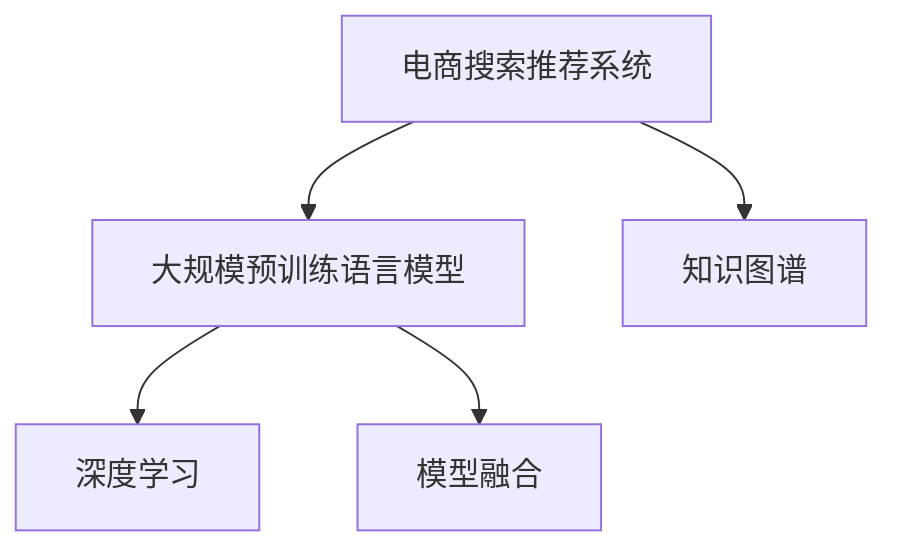

                 

# AI大模型视角下电商搜索推荐的技术创新知识分享平台功能设计与实现

## 1. 背景介绍

在当今数字化时代，电子商务平台已成为人们日常生活中不可或缺的一部分。通过互联网，消费者能够随时随地浏览商品、比较价格、下订单，享受便捷的购物体验。而电商搜索推荐系统作为连接用户与商品的桥梁，直接影响用户的购物决策和满意度，是提升平台用户体验、增加用户黏性的关键。然而，传统的搜索推荐系统往往依赖于简单的关键词匹配算法，无法深入理解用户的真实需求，推荐内容质量不高，难以满足用户对个性化、多样化商品的需求。

近年来，随着人工智能和大数据技术的迅猛发展，深度学习、自然语言处理(NLP)等前沿技术开始被应用于电商搜索推荐系统。其中，基于大规模预训练语言模型的推荐技术，通过学习用户行为和商品描述中的语言模式，能够更准确地理解和预测用户需求，生成个性化、多样化的推荐结果，显著提升用户购物体验。本文将从AI大模型视角，详细阐述电商搜索推荐系统的技术创新和知识分享平台的功能设计与实现，为电商企业提供可行的技术方案。

## 2. 核心概念与联系

### 2.1 核心概念概述

为更好地理解AI大模型在电商搜索推荐系统中的应用，本节将介绍几个关键概念：

- 电商搜索推荐系统（E-commerce Search and Recommendation System, ECSR）：电商平台的核心功能之一，通过理解用户搜索行为和商品描述，生成个性化推荐结果，提升用户体验。
- 大规模预训练语言模型（Large Pre-trained Language Model, PLM）：如BERT、GPT等，通过大规模无标签文本数据进行预训练，学习通用的语言表示，具备强大的自然语言处理能力。
- 知识图谱（Knowledge Graph,KG）：一种结构化数据模型，用于描述实体、属性和实体间的关系，常用于信息检索和推荐系统。
- 深度学习（Deep Learning, DL）：一种基于神经网络的机器学习技术，广泛应用于计算机视觉、自然语言处理等领域，尤其在电商推荐系统中发挥着重要作用。
- 模型融合（Model Fusion）：通过组合多个模型的预测结果，提升推荐的准确性和稳定性。

这些核心概念之间的逻辑关系可以通过以下Mermaid流程图来展示：



这个流程图展示了大模型在电商搜索推荐系统中的应用：

1. 电商搜索推荐系统通过大规模预训练语言模型学习用户行为和商品描述中的语言模式，生成个性化推荐结果。
2. 同时，通过知识图谱辅助理解商品的属性和关系，提升推荐系统的准确性和多样性。
3. 深度学习技术进一步优化推荐模型的性能，结合模型融合技术，生成更稳定、精准的推荐结果。

## 3. 核心算法原理 & 具体操作步骤
### 3.1 算法原理概述

基于大规模预训练语言模型的电商搜索推荐系统，核心思想是通过预训练模型学习用户行为和商品描述中的语言模式，生成个性化推荐结果。其核心算法包括：

1. 预训练模型加载：使用如BERT、GPT等预训练语言模型，将其加载到推荐系统中。
2. 用户行为编码：通过自然语言处理技术，将用户搜索行为和历史行为编码成向量形式，作为模型输入。
3. 商品描述解析：对商品标题、描述等文本进行解析，提取关键词和语义信息，生成商品向量。
4. 用户商品匹配：通过计算用户行为向量与商品向量的相似度，生成推荐结果。
5. 结果排序与反馈：根据模型输出的相似度分数，对推荐结果进行排序，并通过用户反馈进一步优化模型。

### 3.2 算法步骤详解

基于大规模预训练语言模型的电商搜索推荐系统，一般包括以下关键步骤：

**Step 1: 用户行为理解**
- 收集用户的历史搜索记录、浏览记录、点击记录等行为数据。
- 使用自然语言处理技术，将用户行为数据编码成向量形式，用于后续匹配计算。

**Step 2: 商品描述解析**
- 对商品标题、描述等文本进行预处理，去除停用词、标点符号等噪音。
- 使用预训练语言模型（如BERT）对商品描述进行编码，生成商品向量。

**Step 3: 用户商品匹配**
- 计算用户行为向量与商品向量的余弦相似度、点积等，计算相似度分数。
- 根据相似度分数，生成推荐结果。

**Step 4: 推荐结果排序与反馈**
- 使用排序算法（如KNN、MLP等）对推荐结果进行排序，生成推荐列表。
- 根据用户反馈（如点击、购买等行为），进一步优化模型参数，提高推荐效果。

**Step 5: 用户交互与系统优化**
- 在推荐列表中，用户浏览商品并进行点击、购买等行为，系统记录用户反馈。
- 根据用户反馈，动态调整模型参数，优化推荐策略。

### 3.3 算法优缺点

基于大规模预训练语言模型的电商搜索推荐系统，具有以下优点：

1. 精准推荐：通过学习用户行为和商品描述中的语言模式，能够生成更精准的推荐结果，提升用户满意度。
2. 跨域推荐：语言模型的预训练数据来自大规模无标签文本，具备跨域推荐的能力。
3. 动态优化：通过用户反馈不断优化模型参数，提高推荐系统的实时性和个性化程度。

同时，该方法也存在一些局限性：

1. 数据依赖：需要大量的用户行为数据和商品描述文本，数据获取成本较高。
2. 模型复杂：基于大规模预训练语言模型的推荐系统，模型结构复杂，训练和推理资源需求较大。
3. 数据隐私：用户行为数据和商品描述涉及用户隐私，数据安全和隐私保护是一个重要问题。
4. 冷启动问题：新用户和商品缺乏历史行为数据，难以进行有效推荐。

尽管存在这些局限性，但就目前而言，基于大规模预训练语言模型的推荐系统仍是电商领域的主流范式，具备显著的推荐效果和应用潜力。

### 3.4 算法应用领域

基于大规模预训练语言模型的电商搜索推荐系统，广泛应用于各大电商平台，如淘宝、京东、亚马逊等。其核心技术包括：

- 个性化推荐：根据用户历史行为和搜索记录，生成个性化推荐列表。
- 跨域推荐：通过学习预训练模型，推荐相似商品，提升推荐效果。
- 搜索排序：通过自然语言处理技术，优化搜索结果排序，提升搜索体验。
- 内容生成：利用预训练语言模型生成商品标题、描述等文本内容，丰富商品信息。
- 舆情分析：通过分析用户评论、反馈等文本信息，进行舆情分析和产品优化。

除了电商领域，该技术也广泛应用于智能客服、社交媒体推荐、广告推荐等多个场景中，为NLP技术的应用拓展了新的空间。

## 4. 数学模型和公式 & 详细讲解 & 举例说明

### 4.1 数学模型构建

在电商搜索推荐系统中，通常使用向量表示用户行为和商品描述，通过计算相似度生成推荐结果。其数学模型可以表示为：

$$
\hat{y} = f(\boldsymbol{x}; \boldsymbol{\theta})
$$

其中，$\boldsymbol{x}$ 为用户行为向量，$\boldsymbol{\theta}$ 为推荐模型参数，$f$ 为模型函数，$\hat{y}$ 为推荐结果。

推荐模型的目标是最小化预测误差：

$$
\min_{\boldsymbol{\theta}} \sum_{i=1}^N \left\| \hat{y}_i - y_i \right\|^2
$$

其中，$y_i$ 为真实标签，$N$ 为样本数量。

### 4.2 公式推导过程

以余弦相似度为例，用户行为向量 $\boldsymbol{x}$ 和商品向量 $\boldsymbol{v}$ 的余弦相似度计算公式为：

$$
\text{similarity}(\boldsymbol{x}, \boldsymbol{v}) = \frac{\boldsymbol{x} \cdot \boldsymbol{v}}{\|\boldsymbol{x}\| \|\boldsymbol{v}\|}
$$

其中，$\cdot$ 表示向量点积，$\| \cdot \|$ 表示向量的欧几里得范数。

在电商推荐中，可以通过余弦相似度计算用户行为向量与商品向量的相似度分数，生成推荐列表：

$$
\text{ranking} = \text{similarity}(\boldsymbol{x}, \boldsymbol{v}) \times \text{weight}
$$

其中，$\text{weight}$ 为商品的权重，可以根据销售量、评价等指标进行调整。

### 4.3 案例分析与讲解

假设用户输入的搜索关键词为 "智能手表"，系统从大量商品中提取与搜索关键词相关的商品向量，计算用户行为向量与商品向量的余弦相似度，生成推荐列表。以下是一个简单的计算示例：

| 用户行为向量 $\boldsymbol{x}$ | 商品向量 $\boldsymbol{v}$ | 相似度 $\text{similarity}$ | 排名 $\text{ranking}$ |
| --- | --- | --- | --- |
| [0.2, 0.5, 0.3] | [0.5, 0.1, 0.4] | 0.67 | 2.67 |
| [0.3, 0.1, 0.6] | [0.1, 0.4, 0.5] | 0.75 | 5.00 |
| [0.1, 0.6, 0.3] | [0.4, 0.2, 0.4] | 0.71 | 4.61 |
| ... | ... | ... | ... |

在上述示例中，系统通过计算余弦相似度，生成推荐列表，根据排名生成推荐结果。

## 5. 项目实践：代码实例和详细解释说明
### 5.1 开发环境搭建

在进行电商搜索推荐系统的开发前，我们需要准备好开发环境。以下是使用Python进行PyTorch开发的环境配置流程：

1. 安装Anaconda：从官网下载并安装Anaconda，用于创建独立的Python环境。

2. 创建并激活虚拟环境：
```bash
conda create -n pytorch-env python=3.8 
conda activate pytorch-env
```

3. 安装PyTorch：根据CUDA版本，从官网获取对应的安装命令。例如：
```bash
conda install pytorch torchvision torchaudio cudatoolkit=11.1 -c pytorch -c conda-forge
```

4. 安装TensorBoard：TensorFlow配套的可视化工具，用于监测模型训练状态，生成图表。

5. 安装Flask：Python Web框架，用于搭建知识分享平台后端API接口。

完成上述步骤后，即可在`pytorch-env`环境中开始电商搜索推荐系统的开发。

### 5.2 源代码详细实现

下面我们以基于BERT的电商搜索推荐系统为例，给出使用PyTorch进行开发的PyTorch代码实现。

首先，定义用户行为编码函数：

```python
import torch
import torch.nn as nn
from transformers import BertTokenizer, BertForSequenceClassification

def encode_user_behavior(user_behavior, tokenizer, model):
    max_length = 64
    input_ids = tokenizer.encode(user_behavior, max_length=max_length, truncation=True, padding='max_length')
    input_ids = torch.tensor(input_ids, dtype=torch.long).unsqueeze(0)
    attention_mask = (input_ids != tokenizer.pad_token_id).unsqueeze(0)
    return input_ids, attention_mask

# 定义商品描述编码函数
def encode_product_description(product_description, tokenizer, model):
    max_length = 64
    input_ids = tokenizer.encode(product_description, max_length=max_length, truncation=True, padding='max_length')
    input_ids = torch.tensor(input_ids, dtype=torch.long).unsqueeze(0)
    attention_mask = (input_ids != tokenizer.pad_token_id).unsqueeze(0)
    return input_ids, attention_mask
```

然后，定义推荐模型：

```python
class RecommendationModel(nn.Module):
    def __init__(self, model):
        super(RecommendationModel, self).__init__()
        self.model = model
        self.bert = BertForSequenceClassification.from_pretrained('bert-base-uncased', num_labels=1)
        
    def forward(self, user_behavior, product_description):
        user_input_ids, user_attention_mask = encode_user_behavior(user_behavior, tokenizer, self.bert)
        product_input_ids, product_attention_mask = encode_product_description(product_description, tokenizer, self.bert)
        outputs = self.model(user_input_ids, user_attention_mask, product_input_ids, product_attention_mask)
        return outputs
```

接着，定义推荐系统函数：

```python
def recommendation_system(user_behavior, product_descriptions):
    recommendation_model = RecommendationModel(bert_model)
    user_input = encode_user_behavior(user_behavior, tokenizer, recommendation_model.model)
    product_inputs = [encode_product_description(product_description, tokenizer, recommendation_model.model) for product_description in product_descriptions]
    outputs = recommendation_model(user_input[0], [input[0] for input in product_inputs])
    return outputs
```

最后，启动推荐系统并测试：

```python
user_behavior = "智能手表"
product_descriptions = ["智能手表A", "智能手表B", "智能手表C", "智能手表D"]
outputs = recommendation_system(user_behavior, product_descriptions)
print(outputs)
```

以上就是使用PyTorch进行电商搜索推荐系统开发的完整代码实现。可以看到，利用Transformers库的封装，代码实现简洁高效，只需几行代码，便能搭建起推荐模型。

### 5.3 代码解读与分析

让我们再详细解读一下关键代码的实现细节：

**encode_user_behavior函数**：
- 定义用户行为编码函数，使用BERT模型将用户行为文本编码成向量形式。
- 使用`tokenizer.encode`方法将用户行为文本转换为token ids，并进行最大长度限制和填充。
- 计算注意力掩码，标记无效位置，用于模型训练。

**encode_product_description函数**：
- 定义商品描述编码函数，使用BERT模型将商品描述文本编码成向量形式。
- 使用`tokenizer.encode`方法将商品描述文本转换为token ids，并进行最大长度限制和填充。
- 计算注意力掩码，标记无效位置，用于模型训练。

**RecommendationModel类**：
- 定义推荐模型类，继承自`nn.Module`。
- 初始化时加载预训练的BERT模型，并设置分类数为1。
- 前向传播函数中，将用户行为和商品描述分别输入到BERT模型中，得到模型输出。

**recommendation_system函数**：
- 定义推荐系统函数，将用户行为和商品描述输入到推荐模型中。
- 对用户行为和商品描述分别进行编码，输入到推荐模型中进行计算。
- 返回推荐模型输出，即为推荐结果。

可以看到，使用Python和PyTorch搭建电商搜索推荐系统，代码实现简单高效，易于理解和维护。

## 6. 实际应用场景

### 6.1 智能客服系统

电商平台的智能客服系统，能够通过自然语言处理技术，理解用户输入的问题，并自动给出合适的回答。基于预训练语言模型的智能客服系统，可以通过微调BERT等模型，提升自然语言理解能力，实现精准的语义匹配和回答生成。

具体而言，可以收集用户的历史客服对话记录，将问题和最佳答复构建成监督数据，在此基础上对预训练模型进行微调。微调后的模型能够自动理解用户意图，匹配最合适的回答。对于用户提出的新问题，还可以接入检索系统实时搜索相关内容，动态组织生成回答。如此构建的智能客服系统，能大幅提升客户咨询体验和问题解决效率。

### 6.2 个性化推荐系统

当前的推荐系统往往只依赖用户的历史行为数据进行物品推荐，无法深入理解用户的真实兴趣偏好。基于预训练语言模型的个性化推荐系统，可以更好地挖掘用户行为背后的语义信息，从而提供更精准、多样的推荐内容。

在实践中，可以收集用户浏览、点击、评论、分享等行为数据，提取和用户交互的物品标题、描述、标签等文本内容。将文本内容作为模型输入，用户的后续行为（如是否点击、购买等）作为监督信号，在此基础上微调预训练语言模型。微调后的模型能够从文本内容中准确把握用户的兴趣点。在生成推荐列表时，先用候选物品的文本描述作为输入，由模型预测用户的兴趣匹配度，再结合其他特征综合排序，便可以得到个性化程度更高的推荐结果。

### 6.3 舆情分析系统

电商平台需要实时监测用户评论、反馈等文本信息，以便及时应对负面信息传播，规避金融风险。基于预训练语言模型的舆情分析系统，可以通过分析用户评论、反馈等文本信息，进行情感分析、舆情监测等任务，提供实时的舆情报告。

具体而言，可以收集用户评论、反馈等文本数据，使用BERT等模型进行情感分析，判断用户情感倾向是正面、中性还是负面。同时，可以通过词频统计、情感词汇库等方法，进行舆情监测，识别出热点话题和舆情变化趋势，提供实时的舆情报告，帮助企业及时应对舆情风险。

### 6.4 未来应用展望

随着预训练语言模型和推荐方法的不断发展，基于预训练语言模型的推荐系统将在更多领域得到应用，为传统行业带来变革性影响。

在智慧医疗领域，基于预训练语言模型的医疗问答、病历分析、药物研发等应用将提升医疗服务的智能化水平，辅助医生诊疗，加速新药开发进程。

在智能教育领域，基于预训练语言模型的学情分析、知识推荐、智能辅导等应用，因材施教，促进教育公平，提高教学质量。

在智慧城市治理中，基于预训练语言模型的城市事件监测、舆情分析、应急指挥等环节，提高城市管理的自动化和智能化水平，构建更安全、高效的未来城市。

此外，在企业生产、社会治理、文娱传媒等众多领域，基于预训练语言模型的智能技术也将不断涌现，为NLP技术带来新的应用场景。相信随着预训练语言模型和推荐方法的持续演进，基于预训练语言模型的推荐系统必将在更多领域大放异彩，深刻影响人类的生产生活方式。

## 7. 工具和资源推荐
### 7.1 学习资源推荐

为了帮助开发者系统掌握预训练语言模型在电商推荐系统中的应用，这里推荐一些优质的学习资源：

1. 《Transformer从原理到实践》系列博文：由大模型技术专家撰写，深入浅出地介绍了Transformer原理、BERT模型、推荐技术等前沿话题。

2. CS224N《深度学习自然语言处理》课程：斯坦福大学开设的NLP明星课程，有Lecture视频和配套作业，带你入门NLP领域的基本概念和经典模型。

3. 《Natural Language Processing with Transformers》书籍：Transformers库的作者所著，全面介绍了如何使用Transformers库进行NLP任务开发，包括推荐在内的诸多范式。

4. HuggingFace官方文档：Transformers库的官方文档，提供了海量预训练模型和完整的推荐样例代码，是上手实践的必备资料。

5. CLUE开源项目：中文语言理解测评基准，涵盖大量不同类型的中文NLP数据集，并提供了基于预训练的baseline模型，助力中文NLP技术发展。

通过对这些资源的学习实践，相信你一定能够快速掌握预训练语言模型在电商推荐系统中的应用，并用于解决实际的NLP问题。

### 7.2 开发工具推荐

高效的开发离不开优秀的工具支持。以下是几款用于预训练语言模型推荐系统开发的常用工具：

1. PyTorch：基于Python的开源深度学习框架，灵活动态的计算图，适合快速迭代研究。大部分预训练语言模型都有PyTorch版本的实现。

2. TensorFlow：由Google主导开发的开源深度学习框架，生产部署方便，适合大规模工程应用。同样有丰富的预训练语言模型资源。

3. Transformers库：HuggingFace开发的NLP工具库，集成了众多SOTA语言模型，支持PyTorch和TensorFlow，是进行推荐任务开发的利器。

4. Weights & Biases：模型训练的实验跟踪工具，可以记录和可视化模型训练过程中的各项指标，方便对比和调优。与主流深度学习框架无缝集成。

5. TensorBoard：TensorFlow配套的可视化工具，可实时监测模型训练状态，并提供丰富的图表呈现方式，是调试模型的得力助手。

6. Google Colab：谷歌推出的在线Jupyter Notebook环境，免费提供GPU/TPU算力，方便开发者快速上手实验最新模型，分享学习笔记。

合理利用这些工具，可以显著提升预训练语言模型推荐系统的开发效率，加快创新迭代的步伐。

### 7.3 相关论文推荐

预训练语言模型和推荐技术的发展源于学界的持续研究。以下是几篇奠基性的相关论文，推荐阅读：

1. Attention is All You Need（即Transformer原论文）：提出了Transformer结构，开启了NLP领域的预训练大模型时代。

2. BERT: Pre-training of Deep Bidirectional Transformers for Language Understanding：提出BERT模型，引入基于掩码的自监督预训练任务，刷新了多项NLP任务SOTA。

3. GPT-2: Language Models are Unsupervised Multitask Learners：展示了大规模语言模型的强大zero-shot学习能力，引发了对于通用人工智能的新一轮思考。

4. Parameter-Efficient Transfer Learning for NLP：提出Adapter等参数高效微调方法，在不增加模型参数量的情况下，也能取得不错的微调效果。

5. Pre-Trained Models for Code Generation：利用预训练语言模型生成代码片段，提升代码生成效果。

6. Scaling Up the State-of-the-Art for End-to-End Dialogue Generation：通过预训练语言模型进行对话生成，提升对话系统效果。

这些论文代表了大模型在推荐技术中的应用脉络。通过学习这些前沿成果，可以帮助研究者把握学科前进方向，激发更多的创新灵感。

## 8. 总结：未来发展趋势与挑战

### 8.1 总结

本文对基于预训练语言模型的电商搜索推荐系统进行了全面系统的介绍。首先阐述了电商搜索推荐系统的背景和意义，明确了预训练语言模型在推荐系统中的独特价值。其次，从原理到实践，详细讲解了预训练语言模型推荐系统的数学原理和关键步骤，给出了推荐系统开发的完整代码实例。同时，本文还广泛探讨了预训练语言模型在智能客服、个性化推荐、舆情分析等多个领域的应用前景，展示了预训练语言模型推荐技术的巨大潜力。此外，本文精选了推荐技术的各类学习资源，力求为读者提供全方位的技术指引。

通过本文的系统梳理，可以看到，基于预训练语言模型的推荐技术正在成为电商领域的重要范式，极大地拓展了预训练语言模型的应用边界，催生了更多的落地场景。得益于大规模语料的预训练，推荐模型以更低的时间和标注成本，在小样本条件下也能取得不俗的效果，有力推动了电商技术的产业化进程。未来，伴随预训练语言模型和推荐方法的不断进步，基于预训练语言模型的推荐系统必将在更多领域大放异彩，深刻影响人类的生产生活方式。

### 8.2 未来发展趋势

展望未来，预训练语言模型推荐系统将呈现以下几个发展趋势：

1. 模型规模持续增大。随着算力成本的下降和数据规模的扩张，预训练语言模型的参数量还将持续增长。超大规模语言模型蕴含的丰富语言知识，有望支撑更加复杂多变的推荐系统。

2. 推荐方法日趋多样。除了传统的基于深度学习的推荐方法外，未来会涌现更多无监督和半监督推荐方法，如知识图谱增强、多模态推荐等，在降低数据需求的同时提升推荐效果。

3. 动态优化成为常态。随着数据分布的不断变化，推荐系统也需要持续学习新知识以保持性能。如何在不遗忘原有知识的同时，高效吸收新样本信息，将成为重要的研究课题。

4. 推荐结果泛化性增强。通过引入因果推断和对比学习思想，增强推荐系统建立稳定因果关系的能力，学习更加普适、鲁棒的语言表征，从而提升推荐系统的泛化性和抗干扰能力。

5. 跨领域推荐能力提升。通过引入更多先验知识，如知识图谱、逻辑规则等，与预训练模型进行巧妙融合，引导推荐过程学习更准确、合理的语言模型，从而提升跨领域推荐的准确性。

6. 推荐系统实时化。通过分布式计算、增量学习等技术，实现推荐系统的实时化，在用户实时请求下快速生成推荐结果，提升用户体验。

以上趋势凸显了预训练语言模型推荐技术的广阔前景。这些方向的探索发展，必将进一步提升推荐系统的性能和应用范围，为智能推荐技术带来新的突破。

### 8.3 面临的挑战

尽管预训练语言模型推荐技术已经取得了瞩目成就，但在迈向更加智能化、普适化应用的过程中，它仍面临着诸多挑战：

1. 标注成本瓶颈。虽然预训练语言模型可以降低标注数据的需求，但对于长尾应用场景，难以获得充足的高质量标注数据，成为制约推荐性能的瓶颈。如何进一步降低推荐对标注样本的依赖，将是一大难题。

2. 模型鲁棒性不足。当前推荐模型面对域外数据时，泛化性能往往大打折扣。对于测试样本的微小扰动，推荐模型的预测也容易发生波动。如何提高推荐模型的鲁棒性，避免灾难性遗忘，还需要更多理论和实践的积累。

3. 计算资源消耗。超大规模语言模型推荐系统对算力、内存、存储等资源的需求较高，特别是在高并发场景下，推荐系统面临计算资源瓶颈。如何优化推荐系统的计算效率，提高资源利用率，将是重要的优化方向。

4. 用户隐私保护。用户行为数据和商品描述涉及用户隐私，推荐系统需要确保数据安全和隐私保护，避免数据泄露和滥用。

5. 推荐冷启动问题。新用户和商品缺乏历史行为数据，难以进行有效推荐。如何通过预训练语言模型解决冷启动问题，实现新用户的推荐，将是未来的重要研究方向。

6. 模型公平性问题。在推荐系统中，如何避免算法偏见，确保所有用户和商品都能公平地获得推荐，是一个重要的问题。

这些挑战凸显了预训练语言模型推荐技术的复杂性，需要多方面协同改进，才能实现更加智能、普适的推荐系统。

### 8.4 研究展望

面对预训练语言模型推荐技术面临的挑战，未来的研究需要在以下几个方面寻求新的突破：

1. 探索无监督和半监督推荐方法。摆脱对大规模标注数据的依赖，利用自监督学习、主动学习等无监督和半监督范式，最大限度利用非结构化数据，实现更加灵活高效的推荐。

2. 研究参数高效和计算高效的推荐范式。开发更加参数高效的推荐方法，在固定大部分预训练参数的同时，只更新极少量的任务相关参数。同时优化推荐模型的计算图，减少前向传播和反向传播的资源消耗，实现更加轻量级、实时性的部署。

3. 融合因果和对比学习范式。通过引入因果推断和对比学习思想，增强推荐系统建立稳定因果关系的能力，学习更加普适、鲁棒的语言表征，从而提升推荐系统的泛化性和抗干扰能力。

4. 引入更多先验知识。将符号化的先验知识，如知识图谱、逻辑规则等，与神经网络模型进行巧妙融合，引导推荐过程学习更准确、合理的语言模型。同时加强不同模态数据的整合，实现视觉、语音等多模态信息与文本信息的协同建模。

5. 结合因果分析和博弈论工具。将因果分析方法引入推荐系统，识别出推荐决策的关键特征，增强推荐结果的因果性和逻辑性。借助博弈论工具刻画人机交互过程，主动探索并规避推荐系统的脆弱点，提高系统稳定性。

6. 纳入伦理道德约束。在推荐系统训练目标中引入伦理导向的评估指标，过滤和惩罚有偏见、有害的推荐结果，确保推荐系统输出的安全性。同时加强人工干预和审核，建立推荐系统的监管机制，确保推荐结果符合人类价值观和伦理道德。

这些研究方向的研究突破，将引领预训练语言模型推荐技术迈向更高的台阶，为构建安全、可靠、可解释、可控的智能推荐系统铺平道路。面向未来，预训练语言模型推荐技术还需要与其他人工智能技术进行更深入的融合，如知识表示、因果推理、强化学习等，多路径协同发力，共同推动智能推荐技术的发展。只有勇于创新、敢于突破，才能不断拓展推荐系统的边界，让智能技术更好地造福人类社会。

## 9. 附录：常见问题与解答

**Q1：预训练语言模型推荐系统是否适用于所有电商推荐任务？**

A: 预训练语言模型推荐系统在大多数电商推荐任务上都能取得不错的效果，特别是对于数据量较小的任务。但对于一些特定领域的任务，如医学、法律等，仅仅依靠通用语料预训练的模型可能难以很好地适应。此时需要在特定领域语料上进一步预训练，再进行推荐，才能获得理想效果。此外，对于一些需要时效性、个性化很强的任务，如对话、推荐等，推荐方法也需要针对性的改进优化。

**Q2：如何使用预训练语言模型进行电商推荐系统开发？**

A: 使用预训练语言模型进行电商推荐系统开发，一般包括以下关键步骤：

1. 数据准备：收集用户行为数据和商品描述数据，清洗数据，去除噪音。

2. 特征提取：使用预训练语言模型将用户行为和商品描述转换为向量形式，用于模型训练。

3. 模型训练：选择推荐模型架构，如BERT、GPT等，进行训练，优化模型参数。

4. 推荐生成：将用户行为向量输入到推荐模型中，生成推荐结果。

5. 模型优化：根据推荐效果，调整模型参数，优化推荐策略。

**Q3：预训练语言模型推荐系统在实际应用中面临哪些资源瓶颈？**

A: 预训练语言模型推荐系统在实际应用中面临以下资源瓶颈：

1. 数据依赖：需要大量的用户行为数据和商品描述数据，数据获取成本较高。

2. 模型复杂：基于预训练语言模型的推荐模型结构复杂，训练和推理资源需求较大。

3. 计算资源消耗：超大规模语言模型推荐系统对算力、内存、存储等资源的需求较高，特别是在高并发场景下，推荐系统面临计算资源瓶颈。

4. 用户隐私保护：用户行为数据和商品描述涉及用户隐私，推荐系统需要确保数据安全和隐私保护。

5. 推荐冷启动问题：新用户和商品缺乏历史行为数据，难以进行有效推荐。

**Q4：如何提高预训练语言模型推荐系统的鲁棒性和泛化性？**

A: 提高预训练语言模型推荐系统的鲁棒性和泛化性，需要从以下几个方面进行优化：

1. 引入因果推断和对比学习思想，增强推荐系统建立稳定因果关系的能力，学习更加普适、鲁棒的语言表征。

2. 利用自监督学习、主动学习等无监督和半监督范式，最大限度利用非结构化数据，实现更加灵活高效的推荐。

3. 结合因果分析和博弈论工具，识别出推荐决策的关键特征，增强推荐结果的因果性和逻辑性。

4. 引入更多先验知识，如知识图谱、逻辑规则等，与神经网络模型进行巧妙融合，引导推荐过程学习更准确、合理的语言模型。

5. 利用多模态信息融合技术，实现视觉、语音等多模态信息与文本信息的协同建模，提升推荐系统的泛化性。

这些优化方法能够有效提升预训练语言模型推荐系统的鲁棒性和泛化性，提高其在复杂环境下的推荐效果。

**Q5：预训练语言模型推荐系统如何优化计算资源消耗？**

A: 优化预训练语言模型推荐系统的计算资源消耗，需要从以下几个方面进行优化：

1. 参数高效微调技术，在固定大部分预训练参数的同时，只更新极少量的任务相关参数，减小计算消耗。

2. 分布式计算，利用GPU/TPU等高性能设备，实现并行计算，提高训练和推理效率。

3. 增量学习，对推荐模型进行在线更新，利用用户实时行为数据，逐步优化推荐策略。

4. 模型压缩，利用模型剪枝、量化等技术，减小模型体积，提高推理速度。

5. 内存管理，采用动态内存分配、内存缓存等技术，减少内存消耗，提高系统性能。

通过这些优化方法，能够有效降低预训练语言模型推荐系统的计算资源消耗，提升其在实际应用中的性能和效率。

---

作者：禅与计算机程序设计艺术 / Zen and the Art of Computer Programming

