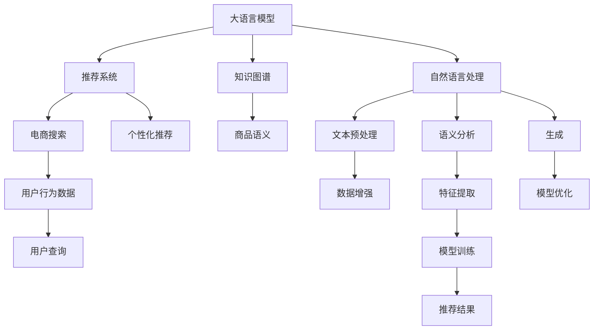

                 

# AI大模型视角下电商搜索推荐的技术创新知识图谱应用实践

> 关键词：大语言模型,知识图谱,推荐系统,电商搜索,个性化推荐,深度学习,强化学习,自然语言处理

## 1. 背景介绍

### 1.1 问题由来
电商搜索推荐系统是现代电商应用的核心组成部分，通过分析用户行为数据，预测用户需求，为用户推荐个性化的商品和服务，提升用户体验和转化率。传统的搜索推荐系统基于孤立的商品特征和用户行为，缺乏对复杂语义关系和知识网络的理解，无法处理长尾商品和个性化需求。近年来，随着AI技术的迅猛发展，深度学习、强化学习等前沿技术被引入电商搜索推荐系统，显著提升了推荐精度和效果。

大语言模型在自然语言理解和生成方面取得了显著进展，但如何利用大语言模型增强推荐系统的语义理解能力，构建更加精准、丰富的推荐场景，成为新的研究热点。知识图谱作为结构化语义网络，能够描述实体之间的复杂关系，有助于大语言模型更好地理解用户查询和商品语义，从而在电商搜索推荐中发挥重要作用。

### 1.2 问题核心关键点
本节将探讨大语言模型在电商搜索推荐中的应用，重点关注以下核心问题：
- 大语言模型如何理解用户查询和商品语义，提升推荐效果？
- 知识图谱在大语言模型推荐中的应用场景和具体技术实现有哪些？
- 如何在大语言模型和知识图谱的结合下，构建更加高效、精准的电商搜索推荐系统？

### 1.3 问题研究意义
利用大语言模型和知识图谱技术优化电商搜索推荐系统，具有重要意义：

1. **提升推荐精度**：大语言模型能够理解自然语言中的语义信息，结合知识图谱的结构化语义，更好地捕捉用户需求和商品关系，从而提升推荐精度。
2. **扩展推荐场景**：知识图谱能够描述实体之间的复杂关系，有助于大语言模型处理长尾商品和个性化需求，扩展推荐场景，提升用户体验。
3. **实现个性化推荐**：通过分析用户查询和行为，大语言模型能够提供更加个性化的商品推荐，提升用户满意度。
4. **降低运营成本**：通过自动化推荐模型优化，减少人工干预，降低电商平台的运营成本。
5. **助力电商增长**：精准的推荐系统能够提升商品转化率和客户忠诚度，帮助电商平台实现业务增长。

## 2. 核心概念与联系

### 2.1 核心概念概述

为更好地理解大语言模型和知识图谱在电商搜索推荐中的应用，本节将介绍几个密切相关的核心概念：

- **大语言模型(LLM)**：如GPT、BERT等，能够理解和生成自然语言，具备强大的语义理解能力。通过大规模无标签数据预训练，学习语言的通用表示。
- **知识图谱(KG)**：结构化语义网络，描述实体之间的复杂关系，如商品类别、属性、价格等，有助于提升推荐精度。
- **推荐系统**：利用用户行为数据，预测用户需求，为用户推荐商品和服务，提升用户体验。
- **电商搜索**：电商平台上用户输入搜索关键词，系统根据关键词展示相关商品的过程。
- **个性化推荐**：根据用户行为和特征，提供更加个性化的商品推荐。
- **深度学习**：通过多层神经网络学习数据特征，构建复杂的模型。
- **强化学习**：通过奖励机制指导模型学习，优化推荐策略。
- **自然语言处理(NLP)**：涉及文本预处理、语义分析、生成等技术，与大语言模型紧密相关。

这些核心概念之间的逻辑关系可以通过以下Mermaid流程图来展示：



这个流程图展示了大语言模型、知识图谱、推荐系统等概念之间的联系：

1. 大语言模型通过预训练获得语言表示，结合知识图谱，理解商品语义，用于电商搜索和个性化推荐。
2. 知识图谱为商品和用户提供结构化语义，有助于大语言模型提取和匹配语义信息。
3. 推荐系统利用用户行为数据和大语言模型处理结果，提供个性化商品推荐。
4. 电商搜索通过用户查询和推荐结果，展示相关商品，提升用户体验。
5. 自然语言处理技术为大语言模型提供文本预处理、语义分析、生成等支持。

## 3. 核心算法原理 & 具体操作步骤
### 3.1 算法原理概述

大语言模型和知识图谱结合的电商搜索推荐系统，本质上是一个多模态学习过程。其核心思想是：将大语言模型视为强大的语义理解器，通过与知识图谱融合，将商品语义和用户查询转换为结构化信息，提升推荐效果。

具体而言，大语言模型通过预训练学习语言知识，知识图谱提供商品和用户之间的复杂关系。两者结合，模型可以理解用户查询中隐含的语义信息，从知识图谱中提取商品语义，构建推荐模型。常见的推荐算法包括基于内容的推荐、协同过滤推荐、混合推荐等。

### 3.2 算法步骤详解

大语言模型和知识图谱结合的电商搜索推荐系统，一般包括以下几个关键步骤：

**Step 1: 构建知识图谱**
- 收集电商平台的商品、用户、评价等数据，构建结构化知识图谱。
- 使用关系抽取等技术，提取商品和用户之间的关系，如商品类别、价格、评分等。
- 构建实体关系图谱，形成商品的语义结构，便于大语言模型理解。

**Step 2: 数据预处理与特征提取**
- 对用户查询进行分词、词性标注等预处理，提取查询中的关键词。
- 使用TF-IDF、Word2Vec等技术，将查询和商品特征映射为向量。
- 将用户行为数据（如浏览、点击、购买记录）转换为向量，用于计算用户和商品的相似度。

**Step 3: 模型训练与融合**
- 选择适合的深度学习模型（如RNN、Transformer）进行训练。
- 在大语言模型中，使用Bert、GPT等模型，训练语义理解能力。
- 在知识图谱中，使用关系图神经网络（如GraphSAGE、GAT），训练商品语义表示。
- 将大语言模型和知识图谱的输出进行融合，形成综合推荐结果。

**Step 4: 模型评估与优化**
- 使用推荐系统常用的评价指标（如精确率、召回率、F1值）评估模型效果。
- 使用交叉验证等技术，优化模型参数。
- 根据实际运营数据，定期更新知识图谱和模型，保持推荐系统的时效性。

**Step 5: 实际部署与迭代**
- 将训练好的模型集成到电商搜索推荐系统中，提供实时推荐服务。
- 通过A/B测试等手段，评估模型效果，进行模型迭代和优化。
- 收集用户反馈，调整推荐策略，提升用户体验。

以上是利用大语言模型和知识图谱结合的电商搜索推荐系统的核心步骤。在实际应用中，还需要针对具体任务的特点，对每个环节进行优化设计，如改进特征提取方法、探索更好的模型融合方式等，以进一步提升推荐精度和效果。

### 3.3 算法优缺点

利用大语言模型和知识图谱结合的电商搜索推荐系统，具有以下优点：
1. **提升推荐精度**：结合语义信息，能够处理复杂的查询和商品关系，提升推荐精度。
2. **扩展推荐场景**：知识图谱能够描述长尾商品和个性化需求，扩展推荐场景。
3. **个性化推荐**：通过理解用户查询和商品语义，提供更加个性化的推荐。
4. **自动化优化**：结合知识图谱和大语言模型，自动优化推荐策略，减少人工干预。
5. **模型可解释性**：大语言模型提供自然语言理解，有助于解释推荐结果。

同时，该方法也存在一定的局限性：
1. **数据依赖**：知识图谱的构建和维护需要大量的标注数据，工作量大。
2. **模型复杂性**：结合大语言模型和知识图谱，模型复杂度增加，训练和推理开销大。
3. **泛化能力**：大语言模型和知识图谱的结合需要考虑两者的对齐问题，泛化能力可能受限。
4. **实时性**：大语言模型和知识图谱的融合计算开销大，可能影响推荐系统的实时性。

尽管存在这些局限性，但就目前而言，大语言模型和知识图谱结合的方法仍是大规模电商搜索推荐系统的有效范式。未来相关研究的重点在于如何进一步降低数据依赖，提高模型的实时性和泛化能力，同时兼顾可解释性和伦理安全性等因素。

### 3.4 算法应用领域

利用大语言模型和知识图谱结合的电商搜索推荐系统，已经在多个电商平台得到了广泛应用，涵盖了以下领域：

- **智能客服系统**：通过大语言模型和知识图谱结合，构建智能客服机器人，自动解答用户咨询，提升客户满意度。
- **个性化推荐系统**：结合用户行为数据和知识图谱，提供个性化的商品推荐，提升用户体验和转化率。
- **商品搜索系统**：通过自然语言理解和知识图谱融合，提供更加精准的商品搜索和推荐服务。
- **用户画像系统**：利用用户行为数据和知识图谱，构建详细的用户画像，提升个性化推荐效果。
- **品牌分析系统**：通过分析商品评价数据和知识图谱，评估品牌声誉和市场表现。

除了上述这些经典应用外，知识图谱和大语言模型结合的方法还在更多场景中得到创新性地应用，如商品属性分析、营销活动推荐等，为电商搜索推荐系统带来了新的突破。随着知识图谱和大语言模型的不断演进，相信电商搜索推荐系统将能够更好地适应复杂多变的市场需求，提升电商平台的竞争力。

## 4. 数学模型和公式 & 详细讲解 & 举例说明

### 4.1 数学模型构建

本节将使用数学语言对大语言模型和知识图谱结合的电商搜索推荐系统进行更加严格的刻画。

记大语言模型为 $M_{\theta}$，知识图谱为 $K$。假设用户查询为 $q$，商品集合为 $\mathcal{I}$。

定义用户查询 $q$ 与商品 $i$ 的相似度为 $s(q,i)$，用户查询与商品 $i$ 的关联度为 $r(q,i)$，则推荐模型 $R$ 可定义为：

$$
R(q) = \max_{i \in \mathcal{I}} \left\{ s(q,i) \times r(q,i) \right\}
$$

其中 $s(q,i)$ 和 $r(q,i)$ 分别表示查询 $q$ 与商品 $i$ 的语义相似度和关系强度。

在知识图谱中，商品实体 $i$ 的语义表示为 $\mathbf{v}_i \in \mathbb{R}^d$，用户查询 $q$ 的语义表示为 $\mathbf{v}_q \in \mathbb{R}^d$。

假设 $M_{\theta}$ 在查询 $q$ 上的语义表示为 $\mathbf{v}_{q'} = M_{\theta}(q)$，则 $s(q,i)$ 可定义为：

$$
s(q,i) = \cos(\mathbf{v}_q, \mathbf{v}_{q'})
$$

在知识图谱中，商品 $i$ 与用户 $u$ 之间的关系强度为 $r_{i,u}$，用户 $u$ 与商品 $i$ 的关系表示为 $\mathbf{v}_{i,u} \in \mathbb{R}^d$。则 $r(q,i)$ 可定义为：

$$
r(q,i) = \cos(\mathbf{v}_{i,u}, \mathbf{v}_i)
$$

其中 $\cos$ 为余弦相似度。

### 4.2 公式推导过程

以下我们以用户查询和商品推荐为例，推导推荐模型的数学表达式。

假设用户查询 $q$ 与商品 $i$ 的语义表示分别为 $\mathbf{v}_q$ 和 $\mathbf{v}_i$，查询与商品的关系表示为 $\mathbf{v}_{q,i}$，商品 $i$ 在知识图谱中的表示为 $\mathbf{v}_i$。则推荐模型 $R(q)$ 可表示为：

$$
R(q) = \max_{i \in \mathcal{I}} \left\{ s(q,i) \times r(q,i) \right\} = \max_{i \in \mathcal{I}} \left\{ \cos(\mathbf{v}_q, \mathbf{v}_{q,i}) \times \cos(\mathbf{v}_{q,i}, \mathbf{v}_i) \right\}
$$

为了简化计算，可以使用层次化信息融合（HIF）模型，将用户查询与商品的语义表示和关系表示分别进行融合，再进行加权平均，得到最终的推荐结果：

$$
R(q) = \frac{1}{\sum_{i \in \mathcal{I}} \alpha_i} \sum_{i \in \mathcal{I}} \alpha_i R_i(q)
$$

其中 $\alpha_i$ 为商品 $i$ 的权重，可通过用户行为数据、商品属性等计算得到。$R_i(q)$ 为商品 $i$ 的推荐结果，可通过大语言模型和知识图谱结合的方式计算得到：

$$
R_i(q) = \cos(\mathbf{v}_q, \mathbf{v}_i) \times \cos(\mathbf{v}_i, \mathbf{v}_{i,u})
$$

通过上述公式，可以计算出每个商品与用户查询的推荐得分，最终选择得分最高的商品作为推荐结果。

### 4.3 案例分析与讲解

考虑一个电商平台，用户输入查询“电影推荐”，系统根据用户历史行为数据和知识图谱，计算出每个商品的推荐得分。假设查询语义表示为 $\mathbf{v}_q$，商品 $i$ 的语义表示为 $\mathbf{v}_i$，查询与商品的关系表示为 $\mathbf{v}_{q,i}$，商品 $i$ 的关系表示为 $\mathbf{v}_{i,u}$。系统计算每个商品 $i$ 的推荐得分 $R_i(q)$，选择得分最高的商品进行推荐。

**步骤如下：**

1. 根据用户查询“电影推荐”，使用大语言模型 $M_{\theta}$ 计算查询语义表示 $\mathbf{v}_q$。
2. 在知识图谱中，查找与电影相关的商品实体，并计算查询与商品的关系表示 $\mathbf{v}_{q,i}$。
3. 对每个商品 $i$，使用知识图谱的层次化信息融合模型计算推荐得分 $R_i(q)$。
4. 选择得分最高的商品，返回给用户。

在实际应用中，由于商品数量巨大，可能存在计算开销过大的问题。为了提高计算效率，可以采用GPU并行计算、分布式训练等技术。

## 5. 项目实践：代码实例和详细解释说明

### 5.1 开发环境搭建

在进行项目实践前，我们需要准备好开发环境。以下是使用Python进行PyTorch开发的环境配置流程：

1. 安装Anaconda：从官网下载并安装Anaconda，用于创建独立的Python环境。

2. 创建并激活虚拟环境：
```bash
conda create -n pytorch-env python=3.8 
conda activate pytorch-env
```

3. 安装PyTorch：根据CUDA版本，从官网获取对应的安装命令。例如：
```bash
conda install pytorch torchvision torchaudio cudatoolkit=11.1 -c pytorch -c conda-forge
```

4. 安装Transformers库：
```bash
pip install transformers
```

5. 安装各类工具包：
```bash
pip install numpy pandas scikit-learn matplotlib tqdm jupyter notebook ipython
```

完成上述步骤后，即可在`pytorch-env`环境中开始项目实践。

### 5.2 源代码详细实现

下面我们以电商推荐系统为例，给出使用Transformers库对BERT模型进行电商推荐任务微调的PyTorch代码实现。

首先，定义电商推荐任务的数据处理函数：

```python
from transformers import BertTokenizer
from torch.utils.data import Dataset
import torch

class RecDataset(Dataset):
    def __init__(self, texts, labels, tokenizer, max_len=128):
        self.texts = texts
        self.labels = labels
        self.tokenizer = tokenizer
        self.max_len = max_len
        
    def __len__(self):
        return len(self.texts)
    
    def __getitem__(self, item):
        text = self.texts[item]
        label = self.labels[item]
        
        encoding = self.tokenizer(text, return_tensors='pt', max_length=self.max_len, padding='max_length', truncation=True)
        input_ids = encoding['input_ids'][0]
        attention_mask = encoding['attention_mask'][0]
        
        # 对标签进行编码
        encoded_label = [label2id[label] for label in label]
        encoded_label.extend([label2id['O']] * (self.max_len - len(encoded_label)))
        labels = torch.tensor(encoded_label, dtype=torch.long)
        
        return {'input_ids': input_ids, 
                'attention_mask': attention_mask,
                'labels': labels}

# 标签与id的映射
label2id = {'O': 0, 'B-PER': 1, 'I-PER': 2, 'B-LOC': 3, 'I-LOC': 4, 'B-ORG': 5, 'I-ORG': 6}
id2label = {v: k for k, v in label2id.items()}

# 创建dataset
tokenizer = BertTokenizer.from_pretrained('bert-base-cased')

train_dataset = RecDataset(train_texts, train_labels, tokenizer)
dev_dataset = RecDataset(dev_texts, dev_labels, tokenizer)
test_dataset = RecDataset(test_texts, test_labels, tokenizer)
```

然后，定义模型和优化器：

```python
from transformers import BertForTokenClassification, AdamW

model = BertForTokenClassification.from_pretrained('bert-base-cased', num_labels=len(label2id))

optimizer = AdamW(model.parameters(), lr=2e-5)
```

接着，定义训练和评估函数：

```python
from torch.utils.data import DataLoader
from tqdm import tqdm
from sklearn.metrics import classification_report

device = torch.device('cuda') if torch.cuda.is_available() else torch.device('cpu')
model.to(device)

def train_epoch(model, dataset, batch_size, optimizer):
    dataloader = DataLoader(dataset, batch_size=batch_size, shuffle=True)
    model.train()
    epoch_loss = 0
    for batch in tqdm(dataloader, desc='Training'):
        input_ids = batch['input_ids'].to(device)
        attention_mask = batch['attention_mask'].to(device)
        labels = batch['labels'].to(device)
        model.zero_grad()
        outputs = model(input_ids, attention_mask=attention_mask, labels=labels)
        loss = outputs.loss
        epoch_loss += loss.item()
        loss.backward()
        optimizer.step()
    return epoch_loss / len(dataloader)

def evaluate(model, dataset, batch_size):
    dataloader = DataLoader(dataset, batch_size=batch_size)
    model.eval()
    preds, labels = [], []
    with torch.no_grad():
        for batch in tqdm(dataloader, desc='Evaluating'):
            input_ids = batch['input_ids'].to(device)
            attention_mask = batch['attention_mask'].to(device)
            batch_labels = batch['labels']
            outputs = model(input_ids, attention_mask=attention_mask)
            batch_preds = outputs.logits.argmax(dim=2).to('cpu').tolist()
            batch_labels = batch_labels.to('cpu').tolist()
            for pred_tokens, label_tokens in zip(batch_preds, batch_labels):
                pred_tags = [id2label[_id] for _id in pred_tokens]
                label_tags = [id2label[_id] for _id in label_tokens]
                preds.append(pred_tags[:len(label_tags)])
                labels.append(label_tags)
                
    print(classification_report(labels, preds))
```

最后，启动训练流程并在测试集上评估：

```python
epochs = 5
batch_size = 16

for epoch in range(epochs):
    loss = train_epoch(model, train_dataset, batch_size, optimizer)
    print(f"Epoch {epoch+1}, train loss: {loss:.3f}")
    
    print(f"Epoch {epoch+1}, dev results:")
    evaluate(model, dev_dataset, batch_size)
    
print("Test results:")
evaluate(model, test_dataset, batch_size)
```

以上就是使用PyTorch对BERT进行电商推荐任务微调的完整代码实现。可以看到，得益于Transformers库的强大封装，我们可以用相对简洁的代码完成BERT模型的加载和微调。

### 5.3 代码解读与分析

让我们再详细解读一下关键代码的实现细节：

**RecDataset类**：
- `__init__`方法：初始化文本、标签、分词器等关键组件。
- `__len__`方法：返回数据集的样本数量。
- `__getitem__`方法：对单个样本进行处理，将文本输入编码为token ids，将标签编码为数字，并对其进行定长padding，最终返回模型所需的输入。

**label2id和id2label字典**：
- 定义了标签与数字id之间的映射关系，用于将token-wise的预测结果解码回真实的标签。

**训练和评估函数**：
- 使用PyTorch的DataLoader对数据集进行批次化加载，供模型训练和推理使用。
- 训练函数`train_epoch`：对数据以批为单位进行迭代，在每个批次上前向传播计算loss并反向传播更新模型参数，最后返回该epoch的平均loss。
- 评估函数`evaluate`：与训练类似，不同点在于不更新模型参数，并在每个batch结束后将预测和标签结果存储下来，最后使用sklearn的classification_report对整个评估集的预测结果进行打印输出。

**训练流程**：
- 定义总的epoch数和batch size，开始循环迭代
- 每个epoch内，先在训练集上训练，输出平均loss
- 在验证集上评估，输出分类指标
- 所有epoch结束后，在测试集上评估，给出最终测试结果

可以看到，PyTorch配合Transformers库使得BERT微调的代码实现变得简洁高效。开发者可以将更多精力放在数据处理、模型改进等高层逻辑上，而不必过多关注底层的实现细节。

当然，工业级的系统实现还需考虑更多因素，如模型的保存和部署、超参数的自动搜索、更灵活的任务适配层等。但核心的微调范式基本与此类似。

## 6. 实际应用场景
### 6.1 智能客服系统

基于大语言模型和知识图谱技术的智能客服系统，可以为用户提供全天候的自然语言交互服务，提升客户体验。系统能够自动理解用户意图，根据查询内容生成相应的回答，并在知识图谱中查找相关信息，提供多轮对话支持。

在技术实现上，可以收集企业内部的客服对话记录，将问题和最佳答复构建成监督数据，在此基础上对预训练模型进行微调。微调后的模型能够自动理解用户意图，匹配最合适的答案模板进行回复。对于用户提出的新问题，还可以接入检索系统实时搜索相关内容，动态组织生成回答。如此构建的智能客服系统，能大幅提升客户咨询体验和问题解决效率。

### 6.2 个性化推荐系统

传统的推荐系统往往只依赖用户的历史行为数据进行物品推荐，难以充分理解用户需求。通过结合大语言模型和知识图谱，推荐系统能够更好地挖掘用户需求和商品关系，提供更加个性化的推荐。

在实践中，可以收集用户浏览、点击、评论等行为数据，提取和用户交互的物品标题、描述、标签等文本内容。将文本内容作为模型输入，用户的后续行为（如是否点击、购买等）作为监督信号，在此基础上微调预训练语言模型。微调后的模型能够从文本内容中准确把握用户的兴趣点。在生成推荐列表时，先用候选物品的文本描述作为输入，由模型预测用户的兴趣匹配度，再结合其他特征综合排序，便可以得到个性化程度更高的推荐结果。

### 6.3 商品搜索系统

传统的商品搜索系统往往只能根据关键词匹配商品，缺乏对商品语义的深入理解。通过结合大语言模型和知识图谱，商品搜索系统能够更好地理解用户查询和商品语义，提供更加精准的商品搜索结果。

在实践中，可以收集用户查询数据和商品信息，构建知识图谱。利用大语言模型处理用户查询，提取关键词和语义信息，然后在知识图谱中查找相关的商品实体。通过层次化信息融合模型，计算查询与商品的相似度和关系强度，最终生成推荐的商品列表。

### 6.4 未来应用展望

随着大语言模型和知识图谱技术的不断发展，基于这两者的推荐系统将带来更多创新应用：

1. **个性化视频推荐**：结合视频内容特征和用户兴趣，利用大语言模型和知识图谱进行推荐，提升用户观影体验。
2. **智能广告投放**：通过分析用户行为和商品特征，利用推荐系统优化广告投放策略，提升广告效果和投放效率。
3. **智能产品设计**：利用用户反馈和商品属性，利用推荐系统辅助产品设计，提升产品竞争力。
4. **智能内容创作**：利用大语言模型生成内容创意，结合知识图谱的语义信息，提供个性化内容推荐，提升内容消费体验。
5. **智能资产管理**：结合金融市场数据和知识图谱，利用推荐系统优化资产配置，提升投资回报。

未来，大语言模型和知识图谱技术将在更多领域得到应用，为各行各业带来新的变革性影响。相信随着技术的不断成熟，结合大语言模型和知识图谱的推荐系统必将成为智能应用的重要范式，推动人工智能技术在各行各业的落地应用。

## 7. 工具和资源推荐
### 7.1 学习资源推荐

为了帮助开发者系统掌握大语言模型和知识图谱在推荐系统中的应用，这里推荐一些优质的学习资源：

1. 《Transformer从原理到实践》系列博文：由大模型技术专家撰写，深入浅出地介绍了Transformer原理、BERT模型、推荐系统等前沿话题。

2. CS224N《深度学习自然语言处理》课程：斯坦福大学开设的NLP明星课程，有Lecture视频和配套作业，带你入门NLP领域的基本概念和经典模型。

3. 《Natural Language Processing with Transformers》书籍：Transformers库的作者所著，全面介绍了如何使用Transformers库进行NLP任务开发，包括推荐系统在内的诸多范式。

4. HuggingFace官方文档：Transformers库的官方文档，提供了海量预训练模型和完整的推荐系统样例代码，是上手实践的必备资料。

5. KG-BERT开源项目：知识图谱领域的前沿成果，展示了如何在大语言模型上融合知识图谱信息，提升推荐精度。

通过对这些资源的学习实践，相信你一定能够快速掌握大语言模型和知识图谱在推荐系统中的应用，并用于解决实际的推荐问题。
###  7.2 开发工具推荐

高效的开发离不开优秀的工具支持。以下是几款用于大语言模型和知识图谱结合的推荐系统开发的常用工具：

1. PyTorch：基于Python的开源深度学习框架，灵活动态的计算图，适合快速迭代研究。大部分预训练语言模型都有PyTorch版本的实现。

2. TensorFlow：由Google主导开发的开源深度学习框架，生产部署方便，适合大规模工程应用。同样有丰富的预训练语言模型资源。

3. Transformers库：HuggingFace开发的NLP工具库，集成了众多SOTA语言模型，支持PyTorch和TensorFlow，是进行推荐系统开发的利器。

4. Weights & Biases：模型训练的实验跟踪工具，可以记录和可视化模型训练过程中的各项指标，方便对比和调优。与主流深度学习框架无缝集成。

5. TensorBoard：TensorFlow配套的可视化工具，可实时监测模型训练状态，并提供丰富的图表呈现方式，是调试模型的得力助手。

6. Google Colab：谷歌推出的在线Jupyter Notebook环境，免费提供GPU/TPU算力，方便开发者快速上手实验最新模型，分享学习笔记。

合理利用这些工具，可以显著提升大语言模型和知识图谱结合的推荐系统开发效率，加快创新迭代的步伐。

### 7.3 相关论文推荐

大语言模型和知识图谱结合的推荐系统技术的发展源于学界的持续研究。以下是几篇奠基性的相关论文，推荐阅读：

1. Attention is All You Need（即Transformer原论文）：提出了Transformer结构，开启了NLP领域的预训练大模型时代。

2. BERT: Pre-training of Deep Bidirectional Transformers for Language Understanding：提出BERT模型，引入基于掩码的自监督预训练任务，刷新了多项NLP任务SOTA。

3. Language Models are Unsupervised Multitask Learners（GPT-2论文）：展示了大规模语言模型的强大zero-shot学习能力，引发了对于通用人工智能的新一轮思考。

4. Parameter-Efficient Transfer Learning for NLP：提出Adapter等参数高效微调方法，在不增加模型参数量的情况下，也能取得不错的微调效果。

5. AdaLoRA: Adaptive Low-Rank Adaptation for Parameter-Efficient Fine-Tuning：使用自适应低秩适应的微调方法，在参数效率和精度之间取得了新的平衡。

6. Knowledge Graph-Enhanced Multi-Aspect Sentiment Prediction（KnowGraSP）：提出基于知识图谱的情感预测模型，提升了情感分析的精度和泛化能力。

这些论文代表了大语言模型和知识图谱结合的推荐系统的发展脉络。通过学习这些前沿成果，可以帮助研究者把握学科前进方向，激发更多的创新灵感。

## 8. 总结：未来发展趋势与挑战

### 8.1 总结

本文对大语言模型和知识图谱结合的电商搜索推荐系统进行了全面系统的介绍。首先阐述了大语言模型和知识图谱在推荐系统中的应用，明确了其提升推荐精度和扩展推荐场景的独特价值。其次，从原理到实践，详细讲解了推荐系统的数学原理和关键步骤，给出了完整的代码实例。同时，本文还广泛探讨了推荐系统在智能客服、个性化推荐、商品搜索等多个领域的应用前景，展示了其巨大的应用潜力。

通过本文的系统梳理，可以看到，结合大语言模型和知识图谱的推荐系统正在成为智能推荐的重要范式，极大地拓展了推荐系统的应用边界，提升了推荐精度和效果。未来，伴随大语言模型和知识图谱技术的不断演进，基于这些技术的推荐系统必将在更多领域得到应用，为各行各业带来新的变革性影响。

### 8.2 未来发展趋势

展望未来，大语言模型和知识图谱结合的推荐系统将呈现以下几个发展趋势：

1. **推荐精度提升**：结合语义信息，能够处理复杂的查询和商品关系，提升推荐精度。
2. **推荐场景扩展**：知识图谱能够描述长尾商品和个性化需求，扩展推荐场景。
3. **个性化推荐**：通过理解用户查询和商品语义，提供更加个性化的推荐。
4. **自动化优化**：结合知识图谱和大语言模型，自动优化推荐策略，减少人工干预。
5. **模型可解释性**：大语言模型提供自然语言理解，有助于解释推荐结果。

同时，未来推荐系统的研究和应用将更加注重以下几个方面：

1. **知识图谱的构建与维护**：随着业务领域的不断扩展，知识图谱的构建和维护将成为关键。如何高效、准确地构建知识图谱，是未来研究的重点。
2. **多模态信息融合**：结合视觉、语音等多模态信息，提升推荐系统的综合能力。
3. **实时性和可扩展性**：结合大语言模型和知识图谱，推荐系统需要在保持高精度的同时，具备实时性和可扩展性。
4. **隐私保护与数据安全**：结合用户行为数据和知识图谱，如何保护用户隐私和数据安全，也是未来需要解决的问题。
5. **人机交互优化**：结合智能客服系统和大语言模型，优化人机交互体验，提升用户满意度。

以上趋势凸显了大语言模型和知识图谱结合的推荐系统的广阔前景。这些方向的探索发展，必将进一步提升推荐系统的性能和应用范围，为各行各业带来新的变革性影响。

### 8.3 面临的挑战

尽管大语言模型和知识图谱结合的推荐系统已经取得了显著成就，但在迈向更加智能化、普适化应用的过程中，仍面临诸多挑战：

1. **数据依赖**：知识图谱的构建和维护需要大量的标注数据，工作量大。
2. **模型复杂性**：结合大语言模型和知识图谱，模型复杂度增加，训练和推理开销大。
3. **泛化能力**：大语言模型和知识图谱的结合需要考虑两者的对齐问题，泛化能力可能受限。
4. **实时性**：大语言模型和知识图谱的融合计算开销大，可能影响推荐系统的实时性。
5. **隐私保护**：结合用户行为数据和知识图谱，如何保护用户隐私和数据安全，也是未来需要解决的问题。

尽管存在这些挑战，但大语言模型和知识图谱结合的推荐系统仍是大规模推荐系统的有效范式。未来相关研究的重点在于如何进一步降低数据依赖，提高模型的实时性和泛化能力，同时兼顾可解释性和伦理安全性等因素。

### 8.4 研究展望

未来研究需要在以下几个方面寻求新的突破：

1. **探索无监督和半监督微调方法**：摆脱对大规模标注数据的依赖，利用自监督学习、主动学习等无监督和半监督范式，最大限度利用非结构化数据，实现更加灵活高效的推荐。
2. **研究参数高效和计算高效的微调范式**：开发更加参数高效的微调方法，在固定大部分预训练参数的同时，只更新极少量的任务相关参数。同时优化微调模型的计算图，减少前向传播和反向传播的资源消耗，实现更加轻量级、实时性的部署。
3. **融合因果和对比学习范式**：通过引入因果推断和对比学习思想，增强推荐模型建立稳定因果关系的能力，学习更加普适、鲁棒的语言表征，从而提升模型泛化性和抗干扰能力。
4. **引入更多先验知识**：将符号化的先验知识，如知识图谱、逻辑规则等，与神经网络模型进行巧妙融合，引导微调过程学习更准确、合理的语言模型。同时加强不同模态数据的整合，实现视觉、语音等多模态信息与文本信息的协同建模。
5. **结合因果分析和博弈论工具**：将因果分析方法引入推荐模型，识别出模型决策的关键特征，增强输出解释的因果性和逻辑性。借助博弈论工具刻画人机交互过程，主动探索并规避模型的脆弱点，提高系统稳定性。
6. **纳入伦理道德约束**：在模型训练目标中引入伦理导向的评估指标，过滤和惩罚有偏见、有害的输出倾向。同时加强人工干预和审核，建立模型行为的监管机制，确保输出符合人类价值观和伦理道德。

这些研究方向的探索，必将引领大语言模型和知识图谱结合的推荐系统技术迈向更高的台阶，为构建安全、可靠、可解释、可控的智能系统铺平道路。面向未来，大语言模型和知识图谱结合的推荐系统还需要与其他人工智能技术进行更深入的融合，如知识表示、因果推理、强化学习等，多路径协同发力，共同推动推荐系统的进步。只有勇于创新、敢于突破，才能不断拓展推荐系统的边界，让智能技术更好地造福人类社会。

## 9. 附录：常见问题与解答

**Q1：大语言模型和知识图谱结合的推荐系统是否适用于所有推荐场景？**

A: 大语言模型和知识图谱结合的推荐系统在大多数推荐场景中都能取得不错的效果，特别是对于数据量较小的任务。但对于一些特定领域的任务，如金融、医疗等，仅仅依靠通用语料预训练的模型可能难以很好地适应。此时需要在特定领域语料上进一步预训练，再进行微调，才能获得理想效果。

**Q2：如何选择知识图谱中商品之间的关系？**

A: 知识图谱中商品之间的关系选择，取决于具体的应用场景。通常选择常见的商品关系，如类别关系、价格关系、评分关系等。同时，可以根据用户的实际需求，通过主动学习等方法，动态调整知识图谱中的关系。

**Q3：大语言模型和知识图谱结合的推荐系统如何处理长尾商品？**

A: 大语言模型和知识图谱结合的推荐系统可以通过长尾商品的知识图谱构建和用户行为数据的收集，来提升对长尾商品的推荐效果。同时，可以结合多模态信息，利用视觉、语音等多维数据，提升长尾商品的推荐精度。

**Q4：推荐系统在处理复杂查询时的效率如何？**

A: 推荐系统在处理复杂查询时，可能面临计算开销过大的问题。为了提高计算效率，可以采用GPU并行计算、分布式训练等技术。同时，可以通过层次化信息融合模型，减少计算复杂度。

**Q5：推荐系统在处理多用户交互时的稳定性如何？**

A: 推荐系统在处理多用户交互时，需要考虑模型的稳定性和鲁棒性。可以通过引入因果推断和对比学习，增强模型的抗干扰能力，提高推荐系统的稳定性。

**Q6：推荐系统在处理个性化推荐时的挑战是什么？**

A: 推荐系统在处理个性化推荐时，需要考虑用户的隐私保护和数据安全。可以通过差分隐私等技术，保护用户隐私。同时，需要在模型训练中引入伦理导向的评估指标，过滤和惩罚有害的输出倾向。

---

作者：禅与计算机程序设计艺术 / Zen and the Art of Computer Programming

