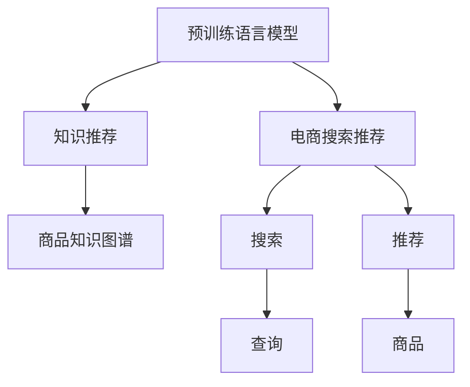

                 

# AI大模型视角下电商搜索推荐的技术创新知识推荐系统优化

## 1. 背景介绍

### 1.1 问题由来
在电子商务领域，搜索推荐系统是用户体验的重要组成部分，直接关系到用户的满意度与购物转化率。传统的搜索推荐系统依赖于基于规则或小规模特征工程的模型，随着业务复杂度的提升，越来越难以满足用户的个性化需求。近年来，大规模预训练语言模型在大规模语料上的自监督学习，获得了丰富的语言表征能力，逐步成为搜索推荐系统的核心引擎。

具体而言，预训练语言模型通过海量的无标签文本数据自监督学习，学习到语言中的通用规律和模式，可以用于下游的文本理解、生成、分类等任务。在电商搜索推荐中，可以利用预训练语言模型对用户查询和商品描述进行编码，学习其语义关系和相似度，提升推荐系统的效果和多样性。然而，如何将预训练语言模型与电商搜索推荐系统进行深度融合，仍有诸多挑战需要突破。

### 1.2 问题核心关键点
本节将聚焦于预训练语言模型在电商搜索推荐系统中的应用优化，特别是知识推荐系统的优化，提出基于大模型的推荐技术创新方案。

核心问题包括：

- 如何利用预训练语言模型提升电商搜索推荐的个性化与相关性？
- 如何优化知识推荐系统，增强商品知识图谱的表征与推荐效果？
- 如何在大模型中引入先验知识，进一步提升推荐系统的性能？
- 如何结合搜索与推荐，提升用户搜索体验和满意度？

本文将围绕这些问题，深入探讨预训练语言模型在电商搜索推荐中的应用原理与优化技术。

## 2. 核心概念与联系

### 2.1 核心概念概述

预训练语言模型在电商搜索推荐中的应用，涉及以下几个核心概念：

- 预训练语言模型(Pretrained Language Models, PLMs)：通过海量的无标签文本数据自监督学习得到的模型，如BERT、GPT等。PLMs具有强大的文本理解与生成能力，可以用于多种NLP任务。
- 搜索推荐系统：用于电商、社交媒体等场景，帮助用户发现感兴趣的商品或内容的技术系统。常见的推荐系统包括基于协同过滤、基于内容的推荐等。
- 知识图谱(Knowledge Graph)：以实体和关系为节点，构建的语义网络结构，用于表示领域内的知识结构。电商商品知识图谱包含了商品属性、关系、类别等。
- 知识推荐系统(Knowledge Recommendation System)：基于知识图谱的推荐系统，利用知识图谱中的实体与关系，提升推荐效果。
- 基于大模型的推荐：利用预训练语言模型对用户查询与商品描述进行编码，学习其语义关系与相似度，提升推荐相关性与多样性。

这些核心概念之间的联系可以通过以下Mermaid流程图来展示：



这个流程图展示了大模型在电商搜索推荐中的应用关系：

1. 预训练语言模型为电商搜索推荐提供通用的文本理解能力。
2. 知识推荐系统基于知识图谱中的商品知识，提升推荐效果。
3. 搜索系统将用户查询转化为PLMs可处理的形式。
4. 推荐系统基于用户历史行为与模型预测，推荐相关商品。

## 3. 核心算法原理 & 具体操作步骤

### 3.1 算法原理概述

基于大模型的电商搜索推荐系统，主要是通过预训练语言模型学习用户查询与商品描述的语义表示，在商品知识图谱上发现相关商品，从而提升推荐的相关性与多样性。核心思想是：

1. 对用户查询与商品描述进行编码，学习其语义表示。
2. 利用商品知识图谱，发现与查询语义相关的商品。
3. 结合搜索与推荐，提升用户搜索体验与推荐效果。

具体实现步骤包括以下几个方面：

1. 收集用户查询与商品描述，构建查询-商品样本库。
2. 利用预训练语言模型对查询与商品进行编码，学习其语义表示。
3. 在商品知识图谱上进行实体与关系的匹配，找到与查询语义相关的商品。
4. 结合搜索与推荐算法，提升用户搜索体验与推荐效果。

### 3.2 算法步骤详解

#### 步骤1：数据预处理

1. **数据收集**：收集用户历史查询、浏览、点击、购买等行为数据，以及商品描述、属性、类别等。
2. **数据清洗**：对数据进行去重、去噪、格式化等处理，保证数据质量。
3. **数据划分**：将数据划分为训练集、验证集、测试集，以便后续模型评估与优化。

#### 步骤2：模型训练

1. **选择模型**：选择预训练语言模型作为初始模型，如BERT、GPT等。
2. **定义损失函数**：定义损失函数，如交叉熵损失、均方误差损失等。
3. **训练模型**：利用训练集数据训练模型，优化参数以最小化损失函数。
4. **验证与调整**：在验证集上评估模型性能，根据评估结果调整模型参数。

#### 步骤3：知识图谱构建

1. **构建知识图谱**：利用商品描述与属性等构建商品知识图谱，包含实体、关系、类别等。
2. **添加实体与关系**：通过自然语言处理技术，将商品描述与属性转化为知识图谱的实体与关系。
3. **优化知识表示**：利用知识图谱对商品进行编码，学习其语义表示。

#### 步骤4：推荐与搜索结合

1. **搜索算法**：设计搜索算法，如倒排索引、向量空间模型等，帮助用户快速找到相关商品。
2. **推荐算法**：结合搜索结果与模型预测，推荐相关商品。
3. **多轮交互**：通过多轮交互，提升推荐效果与用户体验。

#### 步骤5：效果评估与优化

1. **评估指标**：定义评估指标，如点击率、转化率、平均推荐数等。
2. **效果评估**：在测试集上评估推荐系统效果，对比优化前后的表现。
3. **持续优化**：根据评估结果，优化模型与算法，提升推荐效果。

### 3.3 算法优缺点

基于大模型的电商搜索推荐系统具有以下优点：

1. **语义理解能力**：预训练语言模型可以学习到文本的深层次语义，提升推荐的相关性与多样性。
2. **广泛适用性**：可以应用于电商、社交媒体、新闻等各类场景，具有通用性。
3. **个性化推荐**：结合用户行为数据，提供个性化的推荐结果。

同时，该方法也存在以下缺点：

1. **数据依赖性强**：需要大量的用户行为数据与商品描述，数据获取成本较高。
2. **计算复杂度高**：大模型计算复杂度较高，需要高性能硬件支持。
3. **模型复杂度高**：需要设计复杂的算法与模型结构，容易过拟合。
4. **泛化能力有限**：模型在特定领域或数据分布上，泛化能力有限。

### 3.4 算法应用领域

基于大模型的电商搜索推荐系统，主要应用于以下领域：

1. **电商商品推荐**：帮助用户发现感兴趣的商品，提升购物体验。
2. **社交媒体内容推荐**：推荐用户感兴趣的文章、视频、评论等，增加用户粘性。
3. **新闻内容推荐**：根据用户兴趣推荐相关新闻，提升阅读体验。
4. **个性化搜索**：结合搜索与推荐，提升搜索效率与相关性。
5. **智能客服**：结合用户查询与商品描述，提供智能客服响应。

## 4. 数学模型和公式 & 详细讲解 & 举例说明

### 4.1 数学模型构建

设预训练语言模型为 $M_{\theta}$，用户查询为 $q$，商品描述为 $d$，知识图谱中的实体为 $e$，关系为 $r$。定义模型在用户查询与商品描述上的语义表示函数为 $f_{\theta}(q, d)$，在知识图谱上的实体表示函数为 $g_{\theta}(e)$。推荐系统的目标函数为 $L(q, d, e, r)$，表示用户查询与商品描述的语义相似度与知识图谱上的实体关系匹配度。

### 4.2 公式推导过程

1. **查询-商品表示**：
   $$
   f_{\theta}(q, d) = M_{\theta}(q \| d)
   $$
   其中，$M_{\theta}$ 为预训练语言模型，$\|$ 表示拼接操作。

2. **商品知识表示**：
   $$
   g_{\theta}(e) = M_{\theta}(e)
   $$

3. **推荐目标函数**：
   $$
   L(q, d, e, r) = f_{\theta}(q, d) \cdot g_{\theta}(e) + \text{regularization term}
   $$
   其中，$\cdot$ 表示点积操作，regularization term 为正则化项，防止模型过拟合。

### 4.3 案例分析与讲解

假设我们要对用户查询 "iPhone" 与商品描述 "iPhone 12 Pro 256GB" 进行编码，计算其语义相似度，并找到与之相关的商品。具体步骤如下：

1. **查询-商品表示**：
   $$
   f_{\theta}(\text{"iPhone"}, \text{"iPhone 12 Pro 256GB"}) = M_{\theta}(\text{"iPhone"} \| \text{"iPhone 12 Pro 256GB"})
   $$

2. **商品知识表示**：
   $$
   g_{\theta}(\text{"iPhone 12 Pro 256GB"}) = M_{\theta}(\text{"iPhone 12 Pro 256GB"})
   $$

3. **推荐目标函数**：
   $$
   L(\text{"iPhone"}, \text{"iPhone 12 Pro 256GB"}, \text{"iPhone 12 Pro 256GB"}, \text{"iPhone"})
   $$

4. **搜索与推荐结合**：
   $$
   \text{Search Result} = \text{Search Algorithm}(\text{"iPhone 12 Pro 256GB"})
   $$
   $$
   \text{Recommendation} = \text{Recommendation Algorithm}(\text{"iPhone 12 Pro 256GB"}, \text{"iPhone"})
   $$

5. **效果评估**：
   $$
   \text{Evaluation} = \text{Evaluation Metrics}(\text{Search Result}, \text{Recommendation})
   $$

## 5. 项目实践：代码实例和详细解释说明

### 5.1 开发环境搭建

在进行电商搜索推荐系统开发前，需要先搭建好开发环境。以下是使用Python和PyTorch开发环境的步骤：

1. **安装Anaconda**：从官网下载并安装Anaconda，创建虚拟环境。
2. **创建虚拟环境**：
   ```bash
   conda create -n e-commerce python=3.8
   conda activate e-commerce
   ```

3. **安装依赖包**：
   ```bash
   pip install torch torchvision transformers pytorch-lightning scikit-learn pandas jupyter notebook
   ```

### 5.2 源代码详细实现

以下是使用PyTorch和Hugging Face的Transformers库，对电商搜索推荐系统进行开发的代码实现。

```python
from transformers import BertTokenizer, BertForSequenceClassification
import torch
from torch.utils.data import Dataset, DataLoader

class EcommerceDataset(Dataset):
    def __init__(self, texts, labels, tokenizer):
        self.texts = texts
        self.labels = labels
        self.tokenizer = tokenizer
    
    def __len__(self):
        return len(self.texts)
    
    def __getitem__(self, item):
        text = self.texts[item]
        label = self.labels[item]
        encoding = self.tokenizer(text, return_tensors='pt', max_length=128, padding='max_length')
        input_ids = encoding['input_ids']
        attention_mask = encoding['attention_mask']
        return {'input_ids': input_ids, 'attention_mask': attention_mask, 'labels': torch.tensor(label, dtype=torch.long)}

# 加载模型
model = BertForSequenceClassification.from_pretrained('bert-base-cased', num_labels=2)

# 加载数据
tokenizer = BertTokenizer.from_pretrained('bert-base-cased')
train_dataset = EcommerceDataset(train_texts, train_labels, tokenizer)
val_dataset = EcommerceDataset(val_texts, val_labels, tokenizer)
test_dataset = EcommerceDataset(test_texts, test_labels, tokenizer)

# 定义损失函数和优化器
criterion = torch.nn.CrossEntropyLoss()
optimizer = torch.optim.AdamW(model.parameters(), lr=2e-5)

# 训练模型
def train_epoch(model, dataset, batch_size, optimizer, criterion):
    dataloader = DataLoader(dataset, batch_size=batch_size, shuffle=True)
    model.train()
    epoch_loss = 0
    for batch in dataloader:
        input_ids = batch['input_ids'].to(device)
        attention_mask = batch['attention_mask'].to(device)
        labels = batch['labels'].to(device)
        model.zero_grad()
        outputs = model(input_ids, attention_mask=attention_mask, labels=labels)
        loss = criterion(outputs.logits, labels)
        epoch_loss += loss.item()
        loss.backward()
        optimizer.step()
    return epoch_loss / len(dataloader)

# 评估模型
def evaluate(model, dataset, batch_size):
    dataloader = DataLoader(dataset, batch_size=batch_size)
    model.eval()
    preds, labels = [], []
    with torch.no_grad():
        for batch in dataloader:
            input_ids = batch['input_ids'].to(device)
            attention_mask = batch['attention_mask'].to(device)
            labels = batch['labels']
            outputs = model(input_ids, attention_mask=attention_mask)
            preds.append(outputs.logits.argmax(dim=1).cpu().tolist())
            labels.append(labels.cpu().tolist())
    print(torch.metrics.accuracy(torch.tensor(preds), torch.tensor(labels)))

# 训练与评估
epochs = 5
batch_size = 16

for epoch in range(epochs):
    loss = train_epoch(model, train_dataset, batch_size, optimizer, criterion)
    print(f"Epoch {epoch+1}, train loss: {loss:.3f}")
    
    print(f"Epoch {epoch+1}, dev accuracy: {evaluate(model, val_dataset, batch_size)}")
    
print("Test accuracy: ", evaluate(model, test_dataset, batch_size))
```

### 5.3 代码解读与分析

以上代码实现了一个基于Bert模型的电商搜索推荐系统。其关键步骤如下：

1. **定义数据集**：使用EcommerceDataset类，定义查询-商品样本库。
2. **加载模型**：使用BertForSequenceClassification类，加载预训练的Bert模型。
3. **定义损失函数和优化器**：使用CrossEntropyLoss作为损失函数，AdamW优化器进行模型训练。
4. **训练与评估**：通过定义train_epoch和evaluate函数，训练模型并在验证集与测试集上评估模型性能。

## 6. 实际应用场景

### 6.1 智能客服系统

电商智能客服系统是电商搜索推荐的重要应用场景。智能客服系统通过自然语言处理技术，理解用户意图，自动生成回复，提升用户体验。

具体实现步骤包括：

1. **数据收集**：收集用户历史对话记录、常见问题等。
2. **数据预处理**：对数据进行清洗、格式化处理。
3. **模型训练**：使用预训练语言模型对对话进行编码，学习其语义表示。
4. **模型部署**：将训练好的模型部署到电商客服系统中，实时处理用户咨询。

通过电商智能客服系统，用户可以随时获得客服响应，减少等待时间，提升购物体验。

### 6.2 商品知识推荐

商品知识推荐系统通过知识图谱，提升推荐效果，增加推荐的多样性与相关性。

具体实现步骤包括：

1. **构建知识图谱**：利用商品描述、属性、关系等构建商品知识图谱。
2. **模型训练**：使用预训练语言模型对商品进行编码，学习其语义表示。
3. **知识推荐**：结合知识图谱与模型预测，推荐相关商品。
4. **效果评估**：在测试集上评估推荐效果，根据评估结果优化模型与算法。

通过知识推荐系统，用户不仅能看到商品详情，还能了解商品属性、关系等信息，增加购物信心，提升转化率。

### 6.3 个性化搜索推荐

个性化搜索推荐系统通过结合搜索与推荐，提升搜索效果，减少用户筛选时间。

具体实现步骤包括：

1. **搜索算法**：设计倒排索引、向量空间模型等搜索算法，帮助用户快速找到相关商品。
2. **推荐算法**：结合搜索结果与模型预测，推荐相关商品。
3. **效果评估**：在测试集上评估推荐效果，根据评估结果优化模型与算法。

通过个性化搜索推荐系统，用户可以更快地找到感兴趣的商品，提升搜索体验与满意度。

## 7. 工具和资源推荐

### 7.1 学习资源推荐

为了帮助开发者掌握基于大模型的电商搜索推荐系统开发，以下是推荐的几个学习资源：

1. **《深度学习与自然语言处理》**：斯坦福大学Coursera课程，系统介绍深度学习与自然语言处理的基本概念与经典模型。
2. **《Transformer: A New Simple & Efficient Approach to Machine Learning》**：论文介绍Transformer模型，详细介绍其原理与应用。
3. **《BERT: Pre-training of Deep Bidirectional Transformers for Language Understanding》**：论文介绍BERT模型，提出预训练语言模型的新范式。
4. **《Recommender Systems: The Textbook》**：推荐系统经典教材，涵盖推荐算法与模型的基础知识与应用实践。
5. **《E-commerce Recommendation Systems: Models and User Interaction》**：学术论文综述，系统介绍电商推荐系统的算法与模型。

### 7.2 开发工具推荐

电商搜索推荐系统开发需要高效的计算工具与数据处理工具。以下是推荐的几个开发工具：

1. **PyTorch**：开源深度学习框架，灵活高效的计算图，适合快速迭代研究。
2. **Hugging Face Transformers**：预训练语言模型库，提供丰富的预训练模型资源。
3. **TensorFlow**：开源深度学习框架，生产部署方便，适合大规模工程应用。
4. **Spark**：大数据处理框架，用于数据预处理与特征工程。
5. **AWS SageMaker**：云端机器学习平台，支持模型训练、部署与优化。

### 7.3 相关论文推荐

电商搜索推荐系统的研究涉及多个领域，以下是推荐的几篇经典论文：

1. **《Deep E-commerce Recommendation with Pivotal Encodings》**：提出基于Pivotal Encodings的电商推荐模型，提升推荐效果。
2. **《Neural Collaborative Filtering for Recommendation》**：提出基于神经网络的协同过滤算法，提升推荐系统的准确性与多样性。
3. **《Graph Neural Networks for Recommendation System》**：提出基于图神经网络的推荐算法，结合商品知识图谱，提升推荐效果。
4. **《Embedded Compatibility Models for Recommendations》**：提出基于嵌入模型，结合商品属性与关系，提升推荐效果。
5. **《Unsupervised Learning of Document Representations in Multilingual Text: A Survey》**：综述多语言文本表示学习的方法，为电商搜索推荐系统提供理论基础。

## 8. 总结：未来发展趋势与挑战

### 8.1 总结

本文详细介绍了基于大模型的电商搜索推荐系统，探讨了其核心概念与优化技术。通过系统梳理，可以看到，基于大模型的推荐系统，通过利用预训练语言模型的语义理解能力，可以显著提升推荐效果与用户体验。然而，该方法仍面临诸多挑战，需要进一步研究与优化。

### 8.2 未来发展趋势

展望未来，基于大模型的电商搜索推荐系统将呈现以下趋势：

1. **模型规模持续增大**：随着算力成本的下降和数据规模的扩张，预训练语言模型的参数量还将持续增长，带来更强的语义理解能力。
2. **融合多模态数据**：将视觉、语音等多模态数据与文本数据结合，提升推荐效果与用户满意度。
3. **知识图谱与模型融合**：将商品知识图谱与预训练语言模型结合，提升推荐的多样性与相关性。
4. **强化学习与推荐结合**：通过强化学习优化推荐策略，提升推荐效果与用户体验。
5. **自适应推荐**：根据用户行为动态调整推荐策略，提升推荐系统的个性化与适应性。

### 8.3 面临的挑战

尽管基于大模型的电商搜索推荐系统取得了显著成效，但仍面临诸多挑战：

1. **数据依赖性强**：需要大量的用户行为数据与商品描述，数据获取成本较高。
2. **计算复杂度高**：大模型计算复杂度较高，需要高性能硬件支持。
3. **模型复杂度高**：需要设计复杂的算法与模型结构，容易过拟合。
4. **泛化能力有限**：模型在特定领域或数据分布上，泛化能力有限。
5. **冷启动问题**：新商品或新用户的数据较少，难以进行有效推荐。

### 8.4 研究展望

未来的研究应在以下方向寻求新的突破：

1. **无监督与半监督学习**：摆脱对大规模标注数据的依赖，利用自监督学习、主动学习等无监督和半监督范式，最大限度利用非结构化数据。
2. **融合先验知识**：结合外部知识库、规则库等专家知识，增强模型的语义理解能力。
3. **多模态融合**：将视觉、语音等多模态信息与文本信息结合，提升推荐效果。
4. **自适应推荐**：根据用户行为动态调整推荐策略，提升推荐系统的个性化与适应性。
5. **冷启动问题**：设计方法，通过用户行为与知识图谱，解决冷启动问题。

通过这些研究方向，相信基于大模型的电商搜索推荐系统将进一步提升推荐效果，为用户带来更好的购物体验。

## 9. 附录：常见问题与解答

**Q1: 电商搜索推荐系统如何处理冷启动问题？**

A: 电商搜索推荐系统面临冷启动问题时，可以从以下方面入手：

1. **利用用户已有行为**：通过用户已有行为数据，预测其可能感兴趣的商品。
2. **引入先验知识**：利用商品知识图谱中的关系与属性，推测商品的相关性。
3. **多模态融合**：结合用户输入的多种模态信息，提升推荐效果。

**Q2: 电商搜索推荐系统如何提高推荐效果与用户体验？**

A: 电商搜索推荐系统可以从以下方面提升推荐效果与用户体验：

1. **融合先验知识**：结合商品知识图谱与先验知识，提升推荐的多样性与相关性。
2. **个性化推荐**：利用用户历史行为数据，提供个性化的推荐结果。
3. **搜索与推荐结合**：结合搜索与推荐，提升用户搜索体验与满意度。
4. **多轮交互**：通过多轮交互，提升推荐效果与用户体验。

**Q3: 电商搜索推荐系统如何利用大模型提升推荐效果？**

A: 电商搜索推荐系统可以通过以下步骤利用大模型提升推荐效果：

1. **数据预处理**：收集用户查询与商品描述，构建查询-商品样本库。
2. **模型训练**：使用预训练语言模型对查询与商品进行编码，学习其语义表示。
3. **推荐目标函数**：结合商品知识图谱与用户查询，构建推荐目标函数。
4. **搜索与推荐结合**：结合搜索与推荐算法，提升推荐效果。
5. **效果评估与优化**：在测试集上评估推荐效果，优化模型与算法。

**Q4: 电商搜索推荐系统如何优化推荐模型？**

A: 电商搜索推荐系统可以从以下方面优化推荐模型：

1. **融合先验知识**：结合商品知识图谱与先验知识，提升推荐的多样性与相关性。
2. **融合多模态数据**：将视觉、语音等多模态数据与文本数据结合，提升推荐效果。
3. **自适应推荐**：根据用户行为动态调整推荐策略，提升推荐系统的个性化与适应性。
4. **无监督与半监督学习**：利用自监督学习、主动学习等无监督和半监督范式，最大限度利用非结构化数据。

通过这些优化方向，相信电商搜索推荐系统将进一步提升推荐效果，为用户带来更好的购物体验。

**Q5: 电商搜索推荐系统如何处理数据不均衡问题？**

A: 电商搜索推荐系统可以采用以下方法处理数据不均衡问题：

1. **加权处理**：对不同类别的数据赋予不同的权重，提升少数类别的数据权重。
2. **数据增强**：通过数据增强技术，扩充少数类别的数据，平衡数据分布。
3. **多任务学习**：将多任务学习与电商推荐系统结合，提升推荐效果。

通过这些方法，电商搜索推荐系统可以更好地处理数据不均衡问题，提升推荐效果与用户体验。

---

作者：禅与计算机程序设计艺术 / Zen and the Art of Computer Programming

