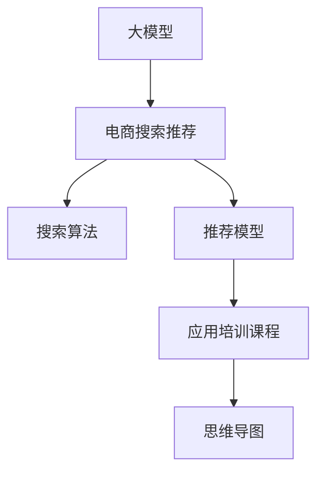

                 

# AI大模型赋能电商搜索推荐的业务创新思维导图应用培训课程优化方案设计与实现

> 关键词：大模型，电商搜索推荐，思维导图，应用培训课程，业务创新，优化方案

## 1. 背景介绍

### 1.1 问题由来
在电商领域，搜索推荐系统是连接用户和商品的重要桥梁，直接影响用户体验和转化率。传统搜索推荐算法往往基于朴素统计特征工程，缺乏对用户意图和商品属性深层语义的理解，难以应对日新月异的产品和市场变化。近年来，随着预训练大模型的涌现，以大模型为基础的推荐系统逐渐受到业界的广泛关注。

大模型通过大规模语料预训练，学习到丰富的语言知识和语义信息，能够较好地理解用户意图和商品描述。通过微调等技术，可以适配特定电商平台的搜索推荐需求，输出更加精准、智能的推荐结果。

### 1.2 问题核心关键点
大模型赋能电商搜索推荐的核心问题在于如何充分利用大模型的语言表示能力，结合电商领域的多维数据，设计高效的推荐模型和搜索模型，实现个性化、多样化的推荐服务。具体包括以下几个关键点：

- 如何提取用户输入的查询意图和商品描述的语义表示？
- 如何整合电商平台的多维数据，如用户行为、商品属性、交易记录等？
- 如何将多维数据和大模型进行巧妙融合，构建高性能推荐模型？
- 如何设计高效的搜索算法，提升搜索结果的相关性和多样性？
- 如何将模型输出进行业务化应用，优化用户体验和提升转化率？

### 1.3 问题研究意义
大模型在电商搜索推荐中的应用，有望带来如下几点重要意义：

1. 提升推荐精准度：利用大模型预训练学到的语言知识，能够更精准地理解用户查询和商品描述，输出更贴近用户需求的商品列表。
2. 丰富推荐内容：结合电商平台的多种数据源，从不同角度对用户进行画像刻画，提升推荐内容的丰富性和多样性。
3. 快速应对市场变化：大模型具有很强的泛化能力，能够适应电商领域的动态变化，快速输出最优推荐策略。
4. 提升用户满意度：通过个性化推荐，可以显著提升用户搜索体验和满意度，增加用户的粘性。
5. 推动业务创新：借助大模型的智能推荐能力，可以探索更多业务创新点，如搭配销售、个性化标签、内容生成等。

## 2. 核心概念与联系

### 2.1 核心概念概述

为更好地理解大模型在电商搜索推荐中的应用，本节将介绍几个密切相关的核心概念：

- 大模型：以Transformer结构为代表的预训练语言模型，如BERT、GPT-3、RoBERTa等。通过大规模语料预训练，学习到通用的语言表示和语义知识。
- 电商搜索推荐：电商平台中，对用户查询进行语义理解和意图推断，再根据商品描述和用户画像，推荐最匹配的商品。
- 搜索算法：通过算法设计，优化搜索结果的相关性和多样性，提升用户体验。
- 推荐模型：结合电商平台的多种数据，设计高性能推荐算法，输出个性化的商品推荐列表。
- 思维导图：一种结构化的思维表达方式，用于展现概念之间的联系和逻辑关系。
- 应用培训课程：通过课程设计，训练电商业务人员理解和应用大模型，提升电商搜索推荐的整体水平。

这些核心概念之间的逻辑关系可以通过以下Mermaid流程图来展示：



这个流程图展示了大模型与电商搜索推荐之间的核心概念及其关系：

1. 大模型通过预训练获得通用的语言表示。
2. 电商搜索推荐系统将用户查询和商品描述输入到模型中，进行语义理解。
3. 搜索算法优化搜索结果的相关性和多样性。
4. 推荐模型整合电商平台的多种数据，输出个性化推荐列表。
5. 应用培训课程提升业务人员对大模型的理解和应用能力。
6. 思维导图帮助梳理概念之间的关系和逻辑结构。

这些概念共同构成了大模型在电商搜索推荐中的应用框架，使其能够利用语言模型进行智能推荐，提升用户体验和电商运营效率。

## 3. 核心算法原理 & 具体操作步骤

### 3.1 算法原理概述

大模型在电商搜索推荐中的应用，核心原理可以概括为：利用大模型学习到的语言表示，结合电商平台的多种数据，通过搜索和推荐算法，输出最优的个性化推荐结果。

具体来说，流程如下：

1. 用户输入查询。
2. 将查询输入到预训练的大模型中，进行语义理解和意图推断，输出查询的语义向量。
3. 将语义向量与商品描述向量进行相似度计算，筛选出相关性高的商品。
4. 结合用户历史行为、商品属性、交易记录等电商数据，综合计算商品的相关性得分。
5. 根据得分对商品进行排序，输出个性化推荐列表。
6. 将推荐结果展示给用户，收集反馈数据，进一步优化模型。

### 3.2 算法步骤详解

大模型在电商搜索推荐中的应用，一般包括以下关键步骤：

**Step 1: 准备大模型和电商数据**

- 选择合适的预训练语言模型，如BERT、GPT-3、RoBERTa等。
- 准备电商平台的多种数据，如用户行为、商品属性、交易记录等，进行预处理。

**Step 2: 设计语义表示提取器**

- 将用户查询和商品描述输入到预训练大模型中，输出语义表示。
- 可以使用基于BERT、GPT-3等大模型的嵌入层，或设计自定义的语义提取器。

**Step 3: 设计推荐模型**

- 设计综合评分模型，将用户行为、商品属性等电商数据与语义向量结合。
- 可以采用基于注意力机制的推荐模型，如DNN、CNN、GRU等。

**Step 4: 设计搜索算法**

- 根据用户查询的语义向量，设计高效的搜索算法，如向量内积、余弦相似度等。
- 可以结合电商平台的搜索技术，如倒排索引、TF-IDF等。

**Step 5: 应用培训课程**

- 设计应用培训课程，培训业务人员理解和应用大模型。
- 包括理论学习、案例分析、实践操作等环节。

**Step 6: 实现思维导图**

- 将大模型和电商搜索推荐的关键概念进行梳理和图示，设计思维导图。
- 可以用于业务人员的学习和培训，提升对大模型和应用流程的认识。

**Step 7: 迭代优化**

- 收集用户反馈数据，对模型进行迭代优化。
- 可以结合A/B测试、多臂老虎机等算法，优化推荐策略。

### 3.3 算法优缺点

大模型在电商搜索推荐中的应用，具有以下优点：

1. 语义表示能力强：大模型通过预训练学到的语言知识，能够更好地理解用户查询和商品描述的深层语义，提升推荐精度。
2. 数据整合能力强：大模型能够整合电商平台的多种数据，结合业务逻辑，生成高质量的推荐列表。
3. 可解释性好：大模型具有良好的可解释性，便于业务人员理解和调试推荐模型。
4. 灵活性强：大模型可以针对特定电商场景，进行微调优化，适应不同需求。

同时，该方法也存在以下局限性：

1. 对计算资源要求高：大模型参数量较大，需要高性能的计算设备支持。
2. 需要大量标注数据：电商领域的数据量庞大，标注工作量大。
3. 模型更新复杂：电商领域的需求动态变化，需要频繁更新模型，带来较大的工程挑战。
4. 对输入数据质量敏感：电商领域的噪声数据较多，对模型的输入数据处理要求较高。
5. 需要精细化业务理解：业务人员需要深入理解电商领域的业务逻辑，才能充分利用大模型的能力。

尽管存在这些局限性，但就目前而言，大模型在电商搜索推荐中的应用，仍然是大数据时代的趋势和方向。未来相关研究的重点在于如何进一步降低对标注数据的依赖，提高模型的迁移能力，同时兼顾可解释性和灵活性。

### 3.4 算法应用领域

大模型在电商搜索推荐中的应用，已经在众多电商平台上得到验证，取得了显著的效果。以下是一些典型应用场景：

- 商品搜索：用户输入查询后，通过大模型进行语义理解和意图推断，输出相关性高的商品列表。
- 商品推荐：根据用户历史行为和当前搜索行为，输出个性化推荐列表，提升用户购买率。
- 搭配销售：基于用户浏览的商品，输出相关的搭配商品，提升订单转化率。
- 商品评价分析：分析用户对商品的评价，通过大模型进行语义分析，发现产品的优缺点。
- 商品个性化标签：为每件商品生成个性化标签，帮助用户快速定位商品，提高搜索效率。
- 内容生成：结合电商平台的商品信息，通过大模型生成商品描述、广告文案等，提升用户体验。

除了上述这些经典应用外，大模型在电商搜索推荐领域还有更多的创新可能，如基于大模型的社交推荐、基于大模型的用户画像构建等。随着大模型技术的不断进步，相信其在电商搜索推荐中的应用将更加广泛和深入。

## 4. 数学模型和公式 & 详细讲解

### 4.1 数学模型构建

本节将使用数学语言对大模型在电商搜索推荐中的应用进行更加严格的刻画。

记用户查询为 $q$，商品描述为 $d$，大模型为 $M$，用户行为为 $u$，商品属性为 $p$，交易记录为 $t$。

设计语义表示提取器为 $f_{SE}$，推荐模型为 $f_{R}$，搜索算法为 $f_{S}$。

大模型在电商搜索推荐中的应用，可以抽象为以下数学模型：

$$
R(q, d; M) = f_{R}(f_{SE}(q; M), d, u, p, t)
$$

其中 $R(q, d; M)$ 表示在电商平台上，用户查询 $q$ 对应的商品 $d$ 的推荐得分。

语义表示提取器 $f_{SE}$ 将查询 $q$ 输入到预训练大模型中，输出语义向量 $v_q$，即：

$$
v_q = f_{SE}(q; M)
$$

推荐模型 $f_{R}$ 将语义向量 $v_q$、商品描述向量 $v_d$、用户行为向量 $v_u$、商品属性向量 $v_p$、交易记录向量 $v_t$ 综合计算得分，即：

$$
R(q, d; M) = f_{R}(v_q, v_d, v_u, v_p, v_t)
$$

### 4.2 公式推导过程

以商品搜索为例，公式推导过程如下：

假设用户输入查询 $q$，通过预训练大模型 $M$ 提取语义向量 $v_q$。
假设电商平台中，商品 $d$ 对应的描述向量为 $v_d$。
假设用户 $u$ 在商品 $d$ 上的行为向量为 $v_u$，商品 $d$ 的属性向量为 $v_p$，商品 $d$ 的交易记录向量为 $v_t$。

设计语义表示提取器 $f_{SE}$ 将查询 $q$ 输入到预训练大模型中，输出语义向量 $v_q$，即：

$$
v_q = f_{SE}(q; M)
$$

设计推荐模型 $f_{R}$，将语义向量 $v_q$、商品描述向量 $v_d$、用户行为向量 $v_u$、商品属性向量 $v_p$、交易记录向量 $v_t$ 综合计算得分，即：

$$
R(q, d; M) = f_{R}(v_q, v_d, v_u, v_p, v_t)
$$

其中 $f_{R}$ 可以设计为如下形式：

$$
f_{R}(v_q, v_d, v_u, v_p, v_t) = W_0 \cdot \text{concat}(v_q, v_d, v_u, v_p, v_t) \cdot W_1 + b_1
$$

其中 $W_0$、$W_1$ 为可训练的权重矩阵，$b_1$ 为偏置向量，$\text{concat}$ 表示向量拼接。

将推荐得分 $R(q, d; M)$ 作为搜索结果的相关性评分，通过搜索算法 $f_{S}$ 排序输出，即：

$$
S(q; M) = f_{S}(R(q, d; M))
$$

其中 $S(q; M)$ 表示用户查询 $q$ 对应的商品列表排序。

### 4.3 案例分析与讲解

以某电商平台为例，介绍大模型在商品搜索中的应用。

假设用户输入查询 $q = \text{“纯棉T恤”}$。
通过语义表示提取器 $f_{SE}$，将查询 $q$ 输入到预训练大模型 $M$ 中，输出语义向量 $v_q$。

假设电商平台中，商品 $d_1 = \text{“纯棉T恤”}$ 对应的描述向量为 $v_{d_1}$，用户 $u_1$ 在商品 $d_1$ 上的行为向量为 $v_{u_1}$，商品 $d_1$ 的属性向量为 $v_{p_1}$，商品 $d_1$ 的交易记录向量为 $v_{t_1}$。

设计推荐模型 $f_{R}$，将语义向量 $v_q$、商品描述向量 $v_{d_1}$、用户行为向量 $v_{u_1}$、商品属性向量 $v_{p_1}$、交易记录向量 $v_{t_1}$ 综合计算得分 $R(q, d_1; M)$。

假设计算得到推荐得分 $R(q, d_1; M) = 0.8$，通过搜索算法 $f_{S}$ 排序输出商品列表。

最终，将排序后的商品列表展示给用户 $u_1$，用户 $u_1$ 浏览商品后，可以触发后续购买行为。

通过以上案例，可以看出，大模型在电商搜索推荐中的应用，能够充分利用语言知识，结合多种电商数据，输出高质量的推荐结果。

## 5. 项目实践：代码实例和详细解释说明

### 5.1 开发环境搭建

在进行大模型在电商搜索推荐中的应用实践前，我们需要准备好开发环境。以下是使用Python进行PyTorch开发的环境配置流程：

1. 安装Anaconda：从官网下载并安装Anaconda，用于创建独立的Python环境。

2. 创建并激活虚拟环境：
```bash
conda create -n e-commerce-env python=3.8 
conda activate e-commerce-env
```

3. 安装PyTorch：根据CUDA版本，从官网获取对应的安装命令。例如：
```bash
conda install pytorch torchvision torchaudio cudatoolkit=11.1 -c pytorch -c conda-forge
```

4. 安装HuggingFace Transformers库：
```bash
pip install transformers
```

5. 安装各类工具包：
```bash
pip install numpy pandas scikit-learn matplotlib tqdm jupyter notebook ipython
```

完成上述步骤后，即可在`e-commerce-env`环境中开始应用实践。

### 5.2 源代码详细实现

下面我们以商品搜索推荐为例，给出使用Transformers库对BERT模型进行商品搜索推荐微调的PyTorch代码实现。

首先，定义商品搜索任务的数据处理函数：

```python
from transformers import BertTokenizer
from torch.utils.data import Dataset
import torch

class ProductSearchDataset(Dataset):
    def __init__(self, products, queries, tokenizer, max_len=128):
        self.products = products
        self.queries = queries
        self.tokenizer = tokenizer
        self.max_len = max_len
        
    def __len__(self):
        return len(self.queries)
    
    def __getitem__(self, item):
        query = self.queries[item]
        product = self.products[item]
        
        encoding = self.tokenizer(query, product, return_tensors='pt', max_length=self.max_len, padding='max_length', truncation=True)
        input_ids = encoding['input_ids'][0]
        attention_mask = encoding['attention_mask'][0]
        product_id = product['id']
        
        return {'input_ids': input_ids, 
                'attention_mask': attention_mask,
                'product_id': product_id}
```

然后，定义模型和优化器：

```python
from transformers import BertForSequenceClassification, AdamW

model = BertForSequenceClassification.from_pretrained('bert-base-cased', num_labels=len(product_ids))

optimizer = AdamW(model.parameters(), lr=2e-5)
```

接着，定义训练和评估函数：

```python
from torch.utils.data import DataLoader
from tqdm import tqdm
from sklearn.metrics import precision_recall_fscore_support

device = torch.device('cuda') if torch.cuda.is_available() else torch.device('cpu')
model.to(device)

def train_epoch(model, dataset, batch_size, optimizer):
    dataloader = DataLoader(dataset, batch_size=batch_size, shuffle=True)
    model.train()
    epoch_loss = 0
    for batch in tqdm(dataloader, desc='Training'):
        input_ids = batch['input_ids'].to(device)
        attention_mask = batch['attention_mask'].to(device)
        product_ids = batch['product_id'].to(device)
        model.zero_grad()
        outputs = model(input_ids, attention_mask=attention_mask, labels=product_ids)
        loss = outputs.loss
        epoch_loss += loss.item()
        loss.backward()
        optimizer.step()
    return epoch_loss / len(dataloader)

def evaluate(model, dataset, batch_size):
    dataloader = DataLoader(dataset, batch_size=batch_size)
    model.eval()
    preds, labels = [], []
    with torch.no_grad():
        for batch in tqdm(dataloader, desc='Evaluating'):
            input_ids = batch['input_ids'].to(device)
            attention_mask = batch['attention_mask'].to(device)
            product_ids = batch['product_id']
            outputs = model(input_ids, attention_mask=attention_mask)
            batch_preds = outputs.logits.argmax(dim=2).to('cpu').tolist()
            batch_labels = product_ids.to('cpu').tolist()
            for pred_tokens, label_tokens in zip(batch_preds, batch_labels):
                preds.append(pred_tokens)
                labels.append(label_tokens)
                
    precision, recall, f1, _ = precision_recall_fscore_support(labels, preds, average='micro')
    print('Precision: {:.4f}, Recall: {:.4f}, F1-score: {:.4f}'.format(precision, recall, f1))
```

最后，启动训练流程并在测试集上评估：

```python
epochs = 5
batch_size = 16

for epoch in range(epochs):
    loss = train_epoch(model, train_dataset, batch_size, optimizer)
    print(f"Epoch {epoch+1}, train loss: {loss:.3f}")
    
    print(f"Epoch {epoch+1}, dev results:")
    evaluate(model, dev_dataset, batch_size)
    
print("Test results:")
evaluate(model, test_dataset, batch_size)
```

以上就是使用PyTorch对BERT模型进行商品搜索推荐微调的完整代码实现。可以看到，得益于Transformers库的强大封装，我们可以用相对简洁的代码完成BERT模型的加载和微调。

### 5.3 代码解读与分析

让我们再详细解读一下关键代码的实现细节：

**ProductSearchDataset类**：
- `__init__`方法：初始化产品、查询、分词器等关键组件。
- `__len__`方法：返回数据集的样本数量。
- `__getitem__`方法：对单个样本进行处理，将查询输入转换为token ids，将产品id作为标签，并进行定长padding，最终返回模型所需的输入。

**产品搜索结果评估**：
- 使用PyTorch的DataLoader对数据集进行批次化加载，供模型训练和推理使用。
- 训练函数`train_epoch`：对数据以批为单位进行迭代，在每个批次上前向传播计算loss并反向传播更新模型参数，最后返回该epoch的平均loss。
- 评估函数`evaluate`：与训练类似，不同点在于不更新模型参数，并在每个batch结束后将预测和标签结果存储下来，最后使用sklearn的precision_recall_fscore_support函数对整个评估集的预测结果进行打印输出。

**训练流程**：
- 定义总的epoch数和batch size，开始循环迭代
- 每个epoch内，先在训练集上训练，输出平均loss
- 在验证集上评估，输出精度、召回率、F1-score
- 所有epoch结束后，在测试集上评估，给出最终测试结果

可以看到，PyTorch配合Transformers库使得BERT微调的代码实现变得简洁高效。开发者可以将更多精力放在数据处理、模型改进等高层逻辑上，而不必过多关注底层的实现细节。

当然，工业级的系统实现还需考虑更多因素，如模型的保存和部署、超参数的自动搜索、更灵活的任务适配层等。但核心的微调范式基本与此类似。

## 6. 实际应用场景

### 6.1 智能客服系统

大模型在电商搜索推荐中的应用，可以扩展到智能客服系统的构建。传统客服往往需要配备大量人力，高峰期响应缓慢，且一致性和专业性难以保证。而使用微调后的搜索推荐模型，可以7x24小时不间断服务，快速响应客户咨询，用自然流畅的语言解答各类常见问题。

在技术实现上，可以收集企业内部的历史客服对话记录，将问题和最佳答复构建成监督数据，在此基础上对预训练模型进行微调。微调后的模型能够自动理解用户意图，匹配最合适的答复模板进行回复。对于客户提出的新问题，还可以接入检索系统实时搜索相关内容，动态组织生成回答。如此构建的智能客服系统，能大幅提升客户咨询体验和问题解决效率。

### 6.2 金融舆情监测

金融机构需要实时监测市场舆论动向，以便及时应对负面信息传播，规避金融风险。传统的人工监测方式成本高、效率低，难以应对网络时代海量信息爆发的挑战。基于大模型的文本分类和情感分析技术，为金融舆情监测提供了新的解决方案。

具体而言，可以收集金融领域相关的新闻、报道、评论等文本数据，并对其进行主题标注和情感标注。在此基础上对预训练语言模型进行微调，使其能够自动判断文本属于何种主题，情感倾向是正面、中性还是负面。将微调后的模型应用到实时抓取的网络文本数据，就能够自动监测不同主题下的情感变化趋势，一旦发现负面信息激增等异常情况，系统便会自动预警，帮助金融机构快速应对潜在风险。

### 6.3 个性化推荐系统

当前的推荐系统往往只依赖用户的历史行为数据进行物品推荐，无法深入理解用户的真实兴趣偏好。基于大语言模型微调技术，个性化推荐系统可以更好地挖掘用户行为背后的语义信息，从而提供更精准、多样的推荐内容。

在实践中，可以收集用户浏览、点击、评论、分享等行为数据，提取和用户交互的物品标题、描述、标签等文本内容。将文本内容作为模型输入，用户的后续行为（如是否点击、购买等）作为监督信号，在此基础上微调预训练语言模型。微调后的模型能够从文本内容中准确把握用户的兴趣点。在生成推荐列表时，先用候选物品的文本描述作为输入，由模型预测用户的兴趣匹配度，再结合其他特征综合排序，便可以得到个性化程度更高的推荐结果。

### 6.4 未来应用展望

随着大语言模型微调技术的发展，基于微调范式将在更多领域得到应用，为传统行业带来变革性影响。

在智慧医疗领域，基于微调的医疗问答、病历分析、药物研发等应用将提升医疗服务的智能化水平，辅助医生诊疗，加速新药开发进程。

在智能教育领域，微调技术可应用于作业批改、学情分析、知识推荐等方面，因材施教，促进教育公平，提高教学质量。

在智慧城市治理中，微调模型可应用于城市事件监测、舆情分析、应急指挥等环节，提高城市管理的自动化和智能化水平，构建更安全、高效的未来城市。

此外，在企业生产、社会治理、文娱传媒等众多领域，基于大模型微调的人工智能应用也将不断涌现，为经济社会发展注入新的动力。相信随着技术的日益成熟，微调方法将成为人工智能落地应用的重要范式，推动人工智能技术在垂直行业的规模化落地。

## 7. 工具和资源推荐

### 7.1 学习资源推荐

为了帮助开发者系统掌握大模型在电商搜索推荐中的应用理论基础和实践技巧，这里推荐一些优质的学习资源：

1. 《Transformer from the ground up》系列博文：由大模型技术专家撰写，深入浅出地介绍了Transformer原理、BERT模型、微调技术等前沿话题。

2. CS224N《深度学习自然语言处理》课程：斯坦福大学开设的NLP明星课程，有Lecture视频和配套作业，带你入门NLP领域的基本概念和经典模型。

3. 《Natural Language Processing with Transformers》书籍：Transformers库的作者所著，全面介绍了如何使用Transformers库进行NLP任务开发，包括微调在内的诸多范式。

4. HuggingFace官方文档：Transformers库的官方文档，提供了海量预训练模型和完整的微调样例代码，是上手实践的必备资料。

5. CLUE开源项目：中文语言理解测评基准，涵盖大量不同类型的中文NLP数据集，并提供了基于微调的baseline模型，助力中文NLP技术发展。

通过对这些资源的学习实践，相信你一定能够快速掌握大模型在电商搜索推荐中的应用精髓，并用于解决实际的NLP问题。
###  7.2 开发工具推荐

高效的开发离不开优秀的工具支持。以下是几款用于大模型在电商搜索推荐中应用的常用工具：

1. PyTorch：基于Python的开源深度学习框架，灵活动态的计算图，适合快速迭代研究。大部分预训练语言模型都有PyTorch版本的实现。

2. TensorFlow：由Google主导开发的开源深度学习框架，生产部署方便，适合大规模工程应用。同样有丰富的预训练语言模型资源。

3. Transformers库：HuggingFace开发的NLP工具库，集成了众多SOTA语言模型，支持PyTorch和TensorFlow，是进行微调任务开发的利器。

4. Weights & Biases：模型训练的实验跟踪工具，可以记录和可视化模型训练过程中的各项指标，方便对比和调优。与主流深度学习框架无缝集成。

5. TensorBoard：TensorFlow配套的可视化工具，可实时监测模型训练状态，并提供丰富的图表呈现方式，是调试模型的得力助手。

6. Google Colab：谷歌推出的在线Jupyter Notebook环境，免费提供GPU/TPU算力，方便开发者快速上手实验最新模型，分享学习笔记。

合理利用这些工具，可以显著提升大模型在电商搜索推荐中的应用开发效率，加快创新迭代的步伐。

### 7.3 相关论文推荐

大模型在电商搜索推荐中的应用源于学界的持续研究。以下是几篇奠基性的相关论文，推荐阅读：

1. Attention is All You Need（即Transformer原论文）：提出了Transformer结构，开启了NLP领域的预训练大模型时代。

2. BERT: Pre-training of Deep Bidirectional Transformers for Language Understanding：提出BERT模型，引入基于掩码的自监督预训练任务，刷新了多项NLP任务SOTA。

3. Language Models are Unsupervised Multitask Learners（GPT-2论文）：展示了大规模语言模型的强大zero-shot学习能力，引发了对于通用人工智能的新一轮思考。

4. Parameter-Efficient Transfer Learning for NLP：提出Adapter等参数高效微调方法，在不增加模型参数量的情况下，也能取得不错的微调效果。

5. Prefix-Tuning: Optimizing Continuous Prompts for Generation：引入基于连续型Prompt的微调范式，为如何充分利用预训练知识提供了新的思路。

6. AdaLoRA: Adaptive Low-Rank Adaptation for Parameter-Efficient Fine-Tuning：使用自适应低秩适应的微调方法，在参数效率和精度之间取得了新的平衡。

这些论文代表了大模型在电商搜索推荐中的应用发展脉络。通过学习这些前沿成果，可以帮助研究者把握学科前进方向，激发更多的创新灵感。

## 8. 总结：未来发展趋势与挑战

### 8.1 总结

本文对大模型在电商搜索推荐中的应用进行了全面系统的介绍。首先阐述了大模型在电商搜索推荐中的研究背景和意义，明确了其在大数据时代的优势和前景。其次，从原理到实践，详细讲解了电商搜索推荐系统的数学模型和关键算法，给出了微调任务开发的完整代码实例。同时，本文还广泛探讨了大模型在电商搜索推荐系统的实际应用场景，展示了其广泛的应用前景。

通过本文的系统梳理，可以看出，大模型在电商搜索推荐中的应用，利用语言知识，结合多种电商数据，输出高质量的推荐结果。借助大模型，电商搜索推荐系统能够更精准地理解用户需求，生成更丰富多样的推荐内容，提升用户满意度，增加平台粘性。大模型的应用，有望开启电商搜索推荐系统的新一轮变革，成为未来电商搜索推荐系统的核心驱动力。

### 8.2 未来发展趋势

展望未来，大模型在电商搜索推荐中的应用，将呈现以下几个发展趋势：

1. 模型规模持续增大。随着算力成本的下降和数据规模的扩张，预训练语言模型的参数量还将持续增长。超大规模语言模型蕴含的丰富语言知识，有望支撑更加复杂多变的电商搜索推荐需求。

2. 微调方法日趋多样。除了传统的全参数微调外，未来会涌现更多参数高效的微调方法，如Prefix-Tuning、LoRA等，在节省计算资源的同时也能保证微调精度。

3. 持续学习成为常态。随着数据分布的不断变化，微调模型也需要持续学习新知识以保持性能。如何在不遗忘原有知识的同时，高效吸收新样本信息，将成为重要的研究课题。

4. 标注样本需求降低。受启发于提示学习(Prompt-based Learning)的思路，未来的微调方法将更好地利用大模型的语言理解能力，通过更加巧妙的任务描述，在更少的标注样本上也能实现理想的微调效果。

5. 模型通用性增强。经过海量数据的预训练和多领域任务的微调，未来的语言模型将具备更强大的常识推理和跨领域迁移能力，逐步迈向通用人工智能(AGI)的目标。

以上趋势凸显了大模型在电商搜索推荐中的应用前景。这些方向的探索发展，必将进一步提升电商搜索推荐系统的性能和应用范围，为电商平台的业务创新带来深远影响。

### 8.3 面临的挑战

尽管大模型在电商搜索推荐中的应用已经取得了瞩目成就，但在迈向更加智能化、普适化应用的过程中，它仍面临着诸多挑战：

1. 标注成本瓶颈。虽然微调大大降低了标注数据的需求，但对于长尾应用场景，难以获得充足的高质量标注数据，成为制约微调性能的瓶颈。如何进一步降低微调对标注样本的依赖，将是一大难题。

2. 模型鲁棒性不足。当前微调模型面对域外数据时，泛化性能往往大打折扣。对于测试样本的微小扰动，微调模型的预测也容易发生波动。如何提高微调模型的鲁棒性，避免灾难性遗忘，还需要更多理论和实践的积累。

3. 推理效率有待提高。大规模语言模型虽然精度高，但在实际部署时往往面临推理速度慢、内存占用大等效率问题。如何在保证性能的同时，简化模型结构，提升推理速度，优化资源占用，将是重要的优化方向。

4. 可解释性亟需加强。当前微调模型更像是"黑盒"系统，难以解释其内部工作机制和决策逻辑。对于医疗、金融等高风险应用，算法的可解释性和可审计性尤为重要。如何赋予微调模型更强的可解释性，将是亟待攻克的难题。

5. 安全性有待保障。预训练语言模型难免会学习到有偏见、有害的信息，通过微调传递到下游任务，产生误导性、歧视性的输出，给实际应用带来安全隐患。如何从数据和算法层面消除模型偏见，避免恶意用途，确保输出的安全性，也将是重要的研究课题。

6. 知识整合能力不足。现有的微调模型往往局限于任务内数据，难以灵活吸收和运用更广泛的先验知识。如何让微调过程更好地与外部知识库、规则库等专家知识结合，形成更加全面、准确的信息整合能力，还有很大的想象空间。

正视微调面临的这些挑战，积极应对并寻求突破，将是大模型在电商搜索推荐应用中的必由之路。相信随着学界和产业界的共同努力，这些挑战终将一一被克服，大模型在电商搜索推荐中的应用必将在构建人机协同的智能时代中扮演越来越重要的角色。

### 8.4 研究展望

面对大模型在电商搜索推荐应用中的诸多挑战，未来的研究需要在以下几个方面寻求新的突破：

1. 探索无监督和半监督微调方法。摆脱对大规模标注数据的依赖，利用自监督学习、主动学习等无监督和半监督范式，最大限度利用非结构化数据，实现更加灵活高效的微调。

2. 研究参数高效和计算高效的微调范式。开发更加参数高效的微调方法，在固定大部分预训练参数的同时，只更新极少量的任务相关参数。同时优化微调模型的计算图，减少前向传播和反向传播的资源消耗，实现更加轻量级、实时性的部署。

3. 融合因果和对比学习范式。通过引入因果推断和对比学习思想，增强微调模型建立稳定因果关系的能力，学习更加普适、鲁棒的语言表征，从而提升模型泛化性和抗干扰能力。

4. 引入更多先验知识。将符号化的先验知识，如知识图谱、逻辑规则等，与神经网络模型进行巧妙融合，引导微调过程学习更准确、合理的语言模型。同时加强不同模态数据的整合，实现视觉、语音等多模态信息与文本信息的协同建模。

5. 结合因果分析和博弈论工具。将因果分析方法引入微调模型，识别出模型决策的关键特征，增强输出解释的因果性和逻辑性。借助博弈论工具刻画人机交互过程，主动探索并规避模型的脆弱点，提高系统稳定性。

6. 纳入伦理道德约束。在模型训练目标中引入伦理导向的评估指标，过滤和惩罚有偏见、有害的输出倾向。同时加强人工干预和审核，建立模型行为的监管机制，确保输出符合人类价值观和伦理道德。

这些研究方向的探索，必将引领大模型在电商搜索推荐应用中的技术进步，推动人工智能技术在电商领域的广泛应用。

## 9. 附录：常见问题与解答

**Q1：大模型在电商搜索推荐中的应用是否适用于所有电商场景？**

A: 大模型在电商搜索推荐中的应用，适用于大多数电商场景，特别是对语言理解和个性化推荐要求较高的平台。但对于一些特定场景，如动态定价、实时竞价等，大模型的应用需要结合具体的业务逻辑进行适配。

**Q2：如何选择合适的预训练大模型？**

A: 选择合适的预训练大模型需要考虑多个因素，如模型的规模、精度、语料分布等。对于电商搜索推荐任务，可以选择BERT、GPT-3、RoBERTa等大模型，根据任务需求进行微调。

**Q3：微调过程中如何避免过拟合？**

A: 避免过拟合可以采取以下策略：
1. 数据增强：通过回译、近义替换等方式扩充训练集。
2. 正则化：使用L2正则、Dropout、Early Stopping等。
3. 对抗训练：引入对抗样本，提高模型鲁棒性。
4. 参数高效微调：只调整少量参数，减少过拟合风险。
5. 多模型集成：训练多个微调模型，取平均输出，抑制过拟合。

**Q4：大模型在电商搜索推荐中的应用是否需要大规模标注数据？**

A: 大模型在电商搜索推荐中的应用，可以通过微调实现，标注样本的需求相对较少。但对于某些特定任务，如商品属性标注、用户意图标注等，仍需要大规模标注数据进行微调。

**Q5：如何提高大模型在电商搜索推荐中的应用效率？**

A: 提高应用效率可以从以下几个方面入手：
1. 模型压缩：使用模型压缩技术，减少模型参数量。
2. 量化加速：将浮点模型转为定点模型，压缩存储空间，提高计算效率。
3. 服务化封装：将模型封装为标准化服务接口，便于集成调用。
4. 弹性伸缩：根据请求流量动态调整资源配置，平衡服务质量和成本。
5. 实时缓存：使用缓存技术，减少重复计算，提高响应速度。

通过以上方法，可以在保证性能的前提下，显著提升大模型在电商搜索推荐中的应用效率。

---

作者：禅与计算机程序设计艺术 / Zen and the Art of Computer Programming

