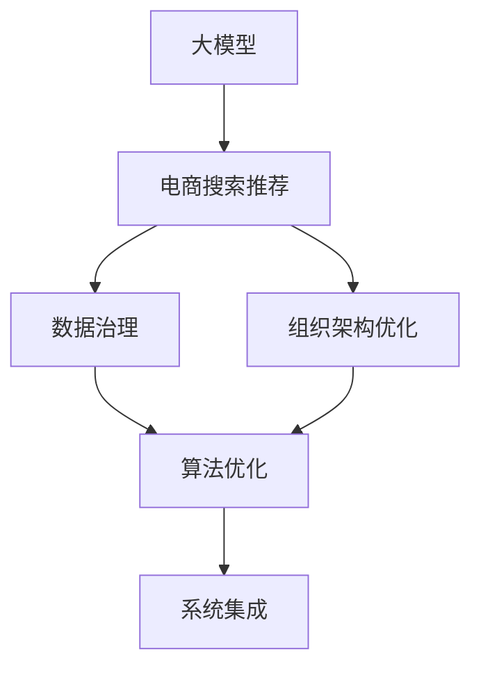

                 

# AI大模型重构电商搜索推荐的数据治理组织架构优化方案设计与实现最佳实践

> 关键词：
- 大模型重构
- 电商搜索推荐
- 数据治理
- 组织架构优化
- 算法优化
- 系统集成
- 技术评估

## 1. 背景介绍

### 1.1 问题由来
随着人工智能技术在电商行业的深入应用，搜索引擎和推荐系统成为驱动业务增长的关键引擎。然而，传统的搜索引擎和推荐系统在推荐效果、用户满意度、业务敏捷性等方面存在诸多不足，亟需通过技术创新进行优化升级。

近年来，大模型技术在自然语言处理、计算机视觉等领域的突破，为电商搜索推荐带来了新的解决方案。基于大模型的搜索推荐系统，通过预训练学习通用的语言和视觉知识，再通过少量标注数据进行微调，可以显著提升推荐效果和搜索质量。

然而，大模型技术的应用也带来了数据治理、组织架构、算法优化等方面的挑战。如何构建一套科学、高效的数据治理和组织架构体系，确保大模型的应用效果和业务价值，成为电商行业面临的重要课题。

### 1.2 问题核心关键点
本文档将聚焦于大模型技术在电商搜索推荐中的重构优化，探讨如何通过数据治理和组织架构优化，构建科学、高效、灵活的大模型应用体系，确保大模型技术在电商搜索推荐中的应用效果和业务价值。

具体来说，核心关键点包括：
- 大模型技术的应用和优势
- 数据治理和质量控制的重要性
- 组织架构优化和角色分工
- 算法优化和集成集成方案
- 技术评估和效果评估方法

本文旨在为电商行业提供一套系统、全面的优化方案，为后续技术实践提供方向性指导。

## 2. 核心概念与联系

### 2.1 核心概念概述

为更好地理解大模型重构与优化方案，本节将介绍几个关键概念：

- **大模型**：如BERT、GPT等预训练模型，通过在海量数据上进行大规模无监督学习，学习到丰富的通用语言和视觉知识。
- **电商搜索推荐**：根据用户历史行为和上下文信息，推荐最符合用户需求的商品。
- **数据治理**：确保数据的质量、安全、隐私等，为模型的训练和应用提供可靠的支撑。
- **组织架构优化**：通过合理分工和协同工作，提高项目的执行效率和效果。
- **算法优化**：结合电商场景，对预训练模型的微调参数、训练流程、评估指标等进行优化。
- **系统集成**：将大模型、数据治理、组织架构、算法优化等模块进行有机结合，构建整体应用系统。

这些概念之间的逻辑关系可以通过以下Mermaid流程图来展示：



这个流程图展示了核心概念之间的关系：

1. 大模型通过预训练学习通用知识，为电商搜索推荐提供基础能力。
2. 电商搜索推荐需要数据治理和组织架构优化，确保模型的数据安全和算法效果。
3. 算法优化是大模型在电商场景下的具体实践，通过微调等技术提升模型性能。
4. 系统集成将各个模块有机结合，构建整体应用系统，实现高效、稳定的搜索推荐服务。

## 3. 核心算法原理 & 具体操作步骤
### 3.1 算法原理概述

基于大模型的电商搜索推荐系统，通过预训练学习通用的语言和视觉知识，再通过微调适配电商场景，可以显著提升推荐效果和搜索质量。其核心思想是：

1. **预训练**：在大规模无标签数据上进行自监督学习，学习通用的语言和视觉知识。
2. **微调**：在电商场景的标注数据上进行有监督学习，使模型适应电商业务需求。
3. **数据治理**：确保数据的准确性、完整性、一致性和安全性，为模型训练和应用提供可靠支撑。
4. **组织架构优化**：通过合理的角色分工和协同工作，提高项目执行效率和效果。
5. **算法优化**：结合电商场景，对预训练模型的微调参数、训练流程、评估指标等进行优化。
6. **系统集成**：将大模型、数据治理、组织架构、算法优化等模块有机结合，构建整体应用系统。

### 3.2 算法步骤详解

基于大模型的电商搜索推荐系统构建一般包括以下几个关键步骤：

**Step 1: 数据收集与处理**

1. **收集电商数据**：收集用户行为数据、商品信息数据、交易数据等。
2. **数据清洗与标注**：清洗数据，去除噪声和异常值，标注用户意图、商品属性等。
3. **数据集划分**：将数据划分为训练集、验证集和测试集。

**Step 2: 大模型预训练**

1. **选择预训练模型**：如BERT、GPT等，使用预训练模型进行预训练。
2. **设置预训练参数**：如学习率、批大小、迭代轮数等。
3. **执行预训练**：在大规模无标签数据上进行预训练。

**Step 3: 模型微调**

1. **选择微调模型**：如使用Transformer结构的大模型。
2. **设计微调任务**：根据电商场景设计微调任务，如商品相似度计算、用户意图识别等。
3. **设置微调参数**：如学习率、批大小、正则化参数等。
4. **执行微调**：在电商数据集上进行微调。

**Step 4: 数据治理**

1. **数据质量控制**：确保数据的准确性、完整性、一致性。
2. **数据安全保护**：确保数据的安全性和隐私性，防止数据泄露和滥用。
3. **数据访问控制**：对数据进行权限管理，确保数据访问的合法性和安全性。

**Step 5: 组织架构优化**

1. **明确角色分工**：明确各团队（数据治理、算法优化、系统集成等）的职责和任务。
2. **协同工作机制**：建立跨团队协同工作机制，确保各环节无缝对接。
3. **绩效评估与反馈**：建立绩效评估机制，定期反馈项目进展和问题。

**Step 6: 算法优化与系统集成**

1. **算法优化**：根据电商场景，对预训练模型的微调参数、训练流程、评估指标等进行优化。
2. **系统集成**：将大模型、数据治理、组织架构、算法优化等模块有机结合，构建整体应用系统。

**Step 7: 系统测试与上线**

1. **系统测试**：对整体系统进行全面的测试，确保系统稳定性和可靠性。
2. **系统上线**：将系统上线到生产环境，进行监控和维护。

### 3.3 算法优缺点

基于大模型的电商搜索推荐系统具有以下优点：

1. **推荐效果显著**：通过预训练和微调，大模型可以显著提升推荐效果和搜索质量。
2. **可扩展性高**：大模型具备通用性，可以应用于各种电商场景。
3. **数据利用率高**：大模型可以从大规模数据中学习通用的语言和视觉知识，提高数据利用率。

同时，该方法也存在一定的局限性：

1. **计算资源需求高**：大模型的训练和推理需要大量的计算资源，成本较高。
2. **数据质量依赖**：模型效果高度依赖数据的准确性和完整性。
3. **模型解释性不足**：大模型通常是"黑盒"系统，难以解释其决策过程。
4. **部署复杂度高**：大模型的部署和维护需要专业的技术团队。

尽管存在这些局限性，但就目前而言，基于大模型的电商搜索推荐系统仍是一种高效、可靠、灵活的解决方案。

### 3.4 算法应用领域

基于大模型的电商搜索推荐系统，已经在电商搜索推荐、智能客服、商品个性化推荐等多个领域得到了广泛应用，具体包括：

1. **电商搜索推荐**：通过用户历史行为和上下文信息，推荐最符合用户需求的商品。
2. **智能客服**：根据用户输入的文本，提供个性化的回答和解决方案。
3. **商品个性化推荐**：根据用户画像，推荐最符合用户兴趣的商品。
4. **智能广告投放**：通过用户行为数据，推荐最符合用户需求的广告。

除了这些经典应用外，大模型技术在电商搜索推荐中的应用还在不断扩展，如智能定价、供应链优化、库存管理等，为电商行业带来了新的商业机会。

## 4. 数学模型和公式 & 详细讲解 & 举例说明

### 4.1 数学模型构建

假设电商搜索推荐系统中的搜索和推荐任务可以用公式表示为：

$$
f(x, y) = \sum_{i=1}^{n} w_i g_i(x, y) + b
$$

其中，$f(x, y)$ 为预测函数，$x$ 为输入特征（如用户行为、商品属性等），$y$ 为输出标签（如商品ID、用户满意度等），$w_i$ 为第 $i$ 个特征的权重，$g_i(x, y)$ 为第 $i$ 个特征的映射函数，$b$ 为偏置项。

在基于大模型的电商搜索推荐系统中，可以采用Transformer结构的大模型，通过预训练和微调学习$f(x, y)$。具体来说，大模型可以表示为：

$$
M_{\theta}(x) = \mathbb{E}[f(x, y)]
$$

其中，$\theta$ 为大模型的参数，$M_{\theta}(x)$ 为大模型在输入 $x$ 上的预测输出。

### 4.2 公式推导过程

根据上述公式，我们可以进行如下推导：

1. **预训练过程**：在无标签数据集 $D$ 上进行预训练，优化大模型的参数 $\theta$，使得 $M_{\theta}(x)$ 尽可能逼近数据分布 $p(x)$，即：

$$
\min_{\theta} KL(p(x)||M_{\theta}(x))
$$

2. **微调过程**：在标注数据集 $D'$ 上进行微调，优化大模型的参数 $\theta'$，使得 $M_{\theta'}(x)$ 尽可能逼近任务标签 $y$，即：

$$
\min_{\theta'} \mathcal{L}(M_{\theta'}(x), y)
$$

其中 $\mathcal{L}$ 为损失函数，通常使用交叉熵损失、均方误差损失等。

### 4.3 案例分析与讲解

以商品推荐为例，假设用户浏览了商品 $A$、$B$、$C$，我们希望根据用户的浏览历史，推荐用户最可能感兴趣的商品 $D$。可以采用以下步骤：

1. **数据预处理**：将用户浏览历史、商品属性等信息作为输入特征 $x$，商品ID作为输出标签 $y$。
2. **预训练模型选择**：选择BERT、GPT等预训练模型作为初始化参数。
3. **微调模型训练**：在标注数据集上进行微调，优化模型的参数 $\theta'$，使得 $M_{\theta'}(x)$ 能够准确预测用户最可能感兴趣的商品。
4. **推荐模型应用**：将用户当前浏览的商品作为输入特征 $x'$，输入微调后的模型，得到预测商品ID $y'$。

## 5. 项目实践：代码实例和详细解释说明

### 5.1 开发环境搭建

在进行电商搜索推荐系统开发前，我们需要准备好开发环境。以下是使用Python进行PyTorch开发的环境配置流程：

1. 安装Anaconda：从官网下载并安装Anaconda，用于创建独立的Python环境。

2. 创建并激活虚拟环境：
```bash
conda create -n pytorch-env python=3.8 
conda activate pytorch-env
```

3. 安装PyTorch：根据CUDA版本，从官网获取对应的安装命令。例如：
```bash
conda install pytorch torchvision torchaudio cudatoolkit=11.1 -c pytorch -c conda-forge
```

4. 安装Transformers库：
```bash
pip install transformers
```

5. 安装各类工具包：
```bash
pip install numpy pandas scikit-learn matplotlib tqdm jupyter notebook ipython
```

完成上述步骤后，即可在`pytorch-env`环境中开始项目实践。

### 5.2 源代码详细实现

下面我们以基于大模型的电商搜索推荐系统为例，给出使用Transformers库对BERT模型进行微调的PyTorch代码实现。

首先，定义电商搜索推荐系统中的特征处理函数：

```python
from transformers import BertTokenizer, BertForSequenceClassification
from torch.utils.data import Dataset, DataLoader
import torch

class SearchRecommendDataset(Dataset):
    def __init__(self, features, labels):
        self.features = features
        self.labels = labels
        
    def __len__(self):
        return len(self.features)
    
    def __getitem__(self, item):
        feature = self.features[item]
        label = self.labels[item]
        return {'input_ids': feature['input_ids'], 
                'attention_mask': feature['attention_mask'], 
                'labels': torch.tensor(label, dtype=torch.long)}
        
# 加载数据集
tokenizer = BertTokenizer.from_pretrained('bert-base-cased')
features = load_features('features.json')
labels = load_labels('labels.json')

train_dataset = SearchRecommendDataset(features['train'], labels['train'])
dev_dataset = SearchRecommendDataset(features['dev'], labels['dev'])
test_dataset = SearchRecommendDataset(features['test'], labels['test'])
```

然后，定义模型和优化器：

```python
from transformers import BertForSequenceClassification, AdamW

model = BertForSequenceClassification.from_pretrained('bert-base-cased', num_labels=2)

optimizer = AdamW(model.parameters(), lr=2e-5)
```

接着，定义训练和评估函数：

```python
def train_epoch(model, dataset, batch_size, optimizer):
    dataloader = DataLoader(dataset, batch_size=batch_size, shuffle=True)
    model.train()
    epoch_loss = 0
    for batch in dataloader:
        input_ids = batch['input_ids'].to(device)
        attention_mask = batch['attention_mask'].to(device)
        labels = batch['labels'].to(device)
        model.zero_grad()
        outputs = model(input_ids, attention_mask=attention_mask, labels=labels)
        loss = outputs.loss
        epoch_loss += loss.item()
        loss.backward()
        optimizer.step()
    return epoch_loss / len(dataloader)

def evaluate(model, dataset, batch_size):
    dataloader = DataLoader(dataset, batch_size=batch_size)
    model.eval()
    preds, labels = [], []
    with torch.no_grad():
        for batch in dataloader:
            input_ids = batch['input_ids'].to(device)
            attention_mask = batch['attention_mask'].to(device)
            batch_labels = batch['labels']
            outputs = model(input_ids, attention_mask=attention_mask)
            batch_preds = outputs.logits.argmax(dim=2).to('cpu').tolist()
            batch_labels = batch_labels.to('cpu').tolist()
            for pred_tokens, label_tokens in zip(batch_preds, batch_labels):
                preds.append(pred_tokens)
                labels.append(label_tokens)
    return preds, labels

# 训练模型
epochs = 5
batch_size = 16

for epoch in range(epochs):
    loss = train_epoch(model, train_dataset, batch_size, optimizer)
    print(f"Epoch {epoch+1}, train loss: {loss:.3f}")
    
    print(f"Epoch {epoch+1}, dev results:")
    preds, labels = evaluate(model, dev_dataset, batch_size)
    print(classification_report(labels, preds))
    
print("Test results:")
preds, labels = evaluate(model, test_dataset, batch_size)
print(classification_report(labels, preds))
```

以上就是使用PyTorch对BERT进行电商搜索推荐系统微调的完整代码实现。可以看到，得益于Transformers库的强大封装，我们可以用相对简洁的代码完成BERT模型的加载和微调。

### 5.3 代码解读与分析

让我们再详细解读一下关键代码的实现细节：

**SearchRecommendDataset类**：
- `__init__`方法：初始化数据集特征和标签。
- `__len__`方法：返回数据集的样本数量。
- `__getitem__`方法：对单个样本进行处理，将特征和标签转换为模型所需的输入。

**训练和评估函数**：
- 使用PyTorch的DataLoader对数据集进行批次化加载，供模型训练和推理使用。
- 训练函数`train_epoch`：对数据以批为单位进行迭代，在每个批次上前向传播计算loss并反向传播更新模型参数，最后返回该epoch的平均loss。
- 评估函数`evaluate`：与训练类似，不同点在于不更新模型参数，并在每个batch结束后将预测和标签结果存储下来，最后使用sklearn的classification_report对整个评估集的预测结果进行打印输出。

**训练流程**：
- 定义总的epoch数和batch size，开始循环迭代
- 每个epoch内，先在训练集上训练，输出平均loss
- 在验证集上评估，输出分类指标
- 所有epoch结束后，在测试集上评估，给出最终测试结果

可以看到，PyTorch配合Transformers库使得BERT微调的代码实现变得简洁高效。开发者可以将更多精力放在数据处理、模型改进等高层逻辑上，而不必过多关注底层的实现细节。

当然，工业级的系统实现还需考虑更多因素，如模型的保存和部署、超参数的自动搜索、更灵活的任务适配层等。但核心的微调范式基本与此类似。

## 6. 实际应用场景
### 6.1 智能客服系统

基于大模型技术的智能客服系统，可以通过对用户输入的自然语言进行理解，自动回答用户的问题。通过训练大模型进行意图识别、实体识别、对话管理等任务，智能客服系统可以大幅提升客户咨询体验和问题解决效率。

在技术实现上，可以收集企业的历史客服对话记录，将问题和最佳答复构建成监督数据，在此基础上对预训练大模型进行微调。微调后的模型能够自动理解用户意图，匹配最合适的答案模板进行回复。对于用户提出的新问题，还可以接入检索系统实时搜索相关内容，动态组织生成回答。如此构建的智能客服系统，能大幅提升客户咨询体验和问题解决效率。

### 6.2 金融舆情监测

金融机构需要实时监测市场舆论动向，以便及时应对负面信息传播，规避金融风险。传统的人工监测方式成本高、效率低，难以应对网络时代海量信息爆发的挑战。基于大模型技术的文本分类和情感分析技术，为金融舆情监测提供了新的解决方案。

具体而言，可以收集金融领域相关的新闻、报道、评论等文本数据，并对其进行主题标注和情感标注。在此基础上对预训练语言模型进行微调，使其能够自动判断文本属于何种主题，情感倾向是正面、中性还是负面。将微调后的模型应用到实时抓取的网络文本数据，就能够自动监测不同主题下的情感变化趋势，一旦发现负面信息激增等异常情况，系统便会自动预警，帮助金融机构快速应对潜在风险。

### 6.3 个性化推荐系统

当前的推荐系统往往只依赖用户的历史行为数据进行物品推荐，无法深入理解用户的真实兴趣偏好。基于大模型技术的个性化推荐系统，可以更好地挖掘用户行为背后的语义信息，从而提供更精准、多样的推荐内容。

在实践中，可以收集用户浏览、点击、评论、分享等行为数据，提取和用户交互的物品标题、描述、标签等文本内容。将文本内容作为模型输入，用户的后续行为（如是否点击、购买等）作为监督信号，在此基础上微调预训练语言模型。微调后的模型能够从文本内容中准确把握用户的兴趣点。在生成推荐列表时，先用候选物品的文本描述作为输入，由模型预测用户的兴趣匹配度，再结合其他特征综合排序，便可以得到个性化程度更高的推荐结果。

### 6.4 未来应用展望

随着大模型技术的发展，基于大模型的电商搜索推荐系统将在更多领域得到应用，为各行各业带来变革性影响。

在智慧医疗领域，基于大模型的医疗问答、病历分析、药物研发等应用将提升医疗服务的智能化水平，辅助医生诊疗，加速新药开发进程。

在智能教育领域，微调技术可应用于作业批改、学情分析、知识推荐等方面，因材施教，促进教育公平，提高教学质量。

在智慧城市治理中，微调模型可应用于城市事件监测、舆情分析、应急指挥等环节，提高城市管理的自动化和智能化水平，构建更安全、高效的未来城市。

此外，在企业生产、社会治理、文娱传媒等众多领域，基于大模型的微调方法也将不断涌现，为传统行业数字化转型升级提供新的技术路径。相信随着技术的日益成熟，大模型技术必将在更广阔的应用领域大放异彩，深刻影响人类的生产生活方式。

## 7. 工具和资源推荐
### 7.1 学习资源推荐

为了帮助开发者系统掌握大模型技术在电商搜索推荐中的应用，这里推荐一些优质的学习资源：

1. 《Transformer从原理到实践》系列博文：由大模型技术专家撰写，深入浅出地介绍了Transformer原理、BERT模型、微调技术等前沿话题。

2. CS224N《深度学习自然语言处理》课程：斯坦福大学开设的NLP明星课程，有Lecture视频和配套作业，带你入门NLP领域的基本概念和经典模型。

3. 《Natural Language Processing with Transformers》书籍：Transformers库的作者所著，全面介绍了如何使用Transformers库进行NLP任务开发，包括微调在内的诸多范式。

4. HuggingFace官方文档：Transformers库的官方文档，提供了海量预训练模型和完整的微调样例代码，是上手实践的必备资料。

5. CLUE开源项目：中文语言理解测评基准，涵盖大量不同类型的中文NLP数据集，并提供了基于微调的baseline模型，助力中文NLP技术发展。

通过对这些资源的学习实践，相信你一定能够快速掌握大模型技术在电商搜索推荐中的应用精髓，并用于解决实际的NLP问题。

### 7.2 开发工具推荐

高效的开发离不开优秀的工具支持。以下是几款用于大模型技术应用开发的常用工具：

1. PyTorch：基于Python的开源深度学习框架，灵活动态的计算图，适合快速迭代研究。大部分预训练语言模型都有PyTorch版本的实现。

2. TensorFlow：由Google主导开发的开源深度学习框架，生产部署方便，适合大规模工程应用。同样有丰富的预训练语言模型资源。

3. Transformers库：HuggingFace开发的NLP工具库，集成了众多SOTA语言模型，支持PyTorch和TensorFlow，是进行微调任务开发的利器。

4. Weights & Biases：模型训练的实验跟踪工具，可以记录和可视化模型训练过程中的各项指标，方便对比和调优。与主流深度学习框架无缝集成。

5. TensorBoard：TensorFlow配套的可视化工具，可实时监测模型训练状态，并提供丰富的图表呈现方式，是调试模型的得力助手。

6. Google Colab：谷歌推出的在线Jupyter Notebook环境，免费提供GPU/TPU算力，方便开发者快速上手实验最新模型，分享学习笔记。

合理利用这些工具，可以显著提升大模型技术应用开发的效率，加快创新迭代的步伐。

### 7.3 相关论文推荐

大模型技术和大模型应用的研究源于学界的持续研究。以下是几篇奠基性的相关论文，推荐阅读：

1. Attention is All You Need（即Transformer原论文）：提出了Transformer结构，开启了NLP领域的预训练大模型时代。

2. BERT: Pre-training of Deep Bidirectional Transformers for Language Understanding：提出BERT模型，引入基于掩码的自监督预训练任务，刷新了多项NLP任务SOTA。

3. Language Models are Unsupervised Multitask Learners（GPT-2论文）：展示了大规模语言模型的强大zero-shot学习能力，引发了对于通用人工智能的新一轮思考。

4. Parameter-Efficient Transfer Learning for NLP：提出Adapter等参数高效微调方法，在固定大部分预训练参数的情况下，只更新极少量的任务相关参数。

5. Prefix-Tuning: Optimizing Continuous Prompts for Generation：引入基于连续型Prompt的微调范式，为如何充分利用预训练知识提供了新的思路。

6. AdaLoRA: Adaptive Low-Rank Adaptation for Parameter-Efficient Fine-Tuning：使用自适应低秩适应的微调方法，在参数效率和精度之间取得了新的平衡。

这些论文代表了大模型技术和大模型应用的发展脉络。通过学习这些前沿成果，可以帮助研究者把握学科前进方向，激发更多的创新灵感。

## 8. 总结：未来发展趋势与挑战

### 8.1 总结

本文对基于大模型的电商搜索推荐系统的重构优化进行了全面系统的介绍。首先阐述了大模型技术的应用和优势，明确了其在电商搜索推荐中的应用场景。其次，从数据治理和组织架构优化两个角度，探讨了如何构建科学、高效、灵活的大模型应用体系，确保大模型技术在电商搜索推荐中的应用效果和业务价值。

通过本文的系统梳理，可以看到，基于大模型的电商搜索推荐系统在大模型预训练、数据治理、组织架构优化、算法优化和系统集成等方面，具有显著优势和广阔应用前景。未来，伴随大模型技术和大模型应用的持续演进，基于大模型的电商搜索推荐系统必将在电商行业乃至更广泛的领域发挥更大作用。

### 8.2 未来发展趋势

展望未来，大模型技术和大模型应用将在更多领域得到广泛应用，带来新的突破和机遇：

1. **规模化和标准化**：大模型技术将向更广泛的应用场景渗透，形成标准化、体系化的应用解决方案，提升各行业智能化水平。

2. **多模态融合**：大模型技术将结合图像、语音、文本等多种数据形态，提升对复杂场景的理解和建模能力。

3. **智能化和自动化**：大模型技术将与人工智能其他分支（如因果推理、强化学习等）进行深入融合，提升系统智能化水平和自动化能力。

4. **业务价值和市场化**：大模型技术将与电商、金融、医疗、教育等多个行业进行深度结合，带来显著的业务价值和经济效益。

5. **伦理和隐私保护**：随着大模型技术的普及，伦理和隐私保护问题将受到更多关注，相关技术也将不断成熟和完善。

### 8.3 面临的挑战

尽管大模型技术和大模型应用在电商搜索推荐系统中取得了显著成效，但在实际应用中也面临诸多挑战：

1. **数据隐私和安全**：大模型技术需要大量的标注数据进行训练，如何保护用户隐私，防止数据泄露，仍是一大难题。

2. **计算资源消耗**：大模型技术的计算资源消耗巨大，如何降低计算成本，提高模型训练和推理效率，是一大挑战。

3. **模型解释性和可控性**：大模型技术通常是"黑盒"系统，难以解释其决策过程，如何提升模型解释性和可控性，是一大难题。

4. **业务适配性**：大模型技术需要结合具体业务场景进行优化，如何设计合理的模型结构，提升业务适配性，是一大挑战。

5. **系统集成和协作**：大模型技术的系统集成和跨团队协作需要高效的支持，如何建立高效的协作机制，是一大挑战。

尽管存在这些挑战，但大模型技术和大模型应用在电商搜索推荐系统中的应用前景广阔，相信随着技术的发展和创新，相关挑战也将逐步得到解决。

### 8.4 研究展望

面向未来，大模型技术和大模型应用的研究方向如下：

1. **可解释性和透明性**：提升模型的可解释性和透明性，增强用户对模型决策的理解和信任。

2. **跨模态融合**：结合多模态数据，提升模型对复杂场景的理解和建模能力。

3. **泛化性和鲁棒性**：提升模型的泛化能力和鲁棒性，防止模型在特定数据分布下出现灾难性遗忘。

4. **模型压缩和加速**：通过模型压缩、量化加速等技术，降低大模型技术的计算资源消耗。

5. **伦理和隐私保护**：结合伦理和隐私保护技术，提升大模型技术的应用安全性和可靠性。

6. **系统集成和优化**：提升系统的集成能力和优化水平，提高大模型技术的业务适配性和用户满意度。

通过这些研究方向的不断探索，相信大模型技术和大模型应用将迎来新的突破，为各行业带来更多的创新和变革。

## 9. 附录：常见问题与解答

**Q1：大模型技术在电商搜索推荐中的应用效果如何？**

A: 大模型技术在电商搜索推荐中的应用效果显著。通过预训练和微调，大模型可以显著提升推荐效果和搜索质量。具体来说，大模型技术可以在以下几个方面提升电商搜索推荐的效果：

1. **商品相似度计算**：大模型可以学习到商品之间的语义关系，提高商品相似度计算的准确性。
2. **用户意图识别**：大模型可以学习到用户输入的自然语言，提高用户意图的理解准确性。
3. **对话管理**：大模型可以学习到对话上下文，提高对话管理的效果和用户体验。

**Q2：大模型技术在电商搜索推荐中是否需要大量的标注数据？**

A: 大模型技术在电商搜索推荐中需要大量的标注数据进行微调。标注数据质量越高，微调效果越好。然而，标注数据的获取成本较高，如何高效获取和利用标注数据，是一大挑战。

在实际应用中，可以采用以下策略来优化标注数据的获取和利用：

1. **主动学习**：通过主动学习算法，从少量标注数据中挖掘有价值的样本，提高标注数据的质量和数量。
2. **半监督学习**：结合大量无标签数据和少量标注数据，进行半监督学习，提高模型的泛化能力和鲁棒性。
3. **迁移学习**：结合小规模标注数据和预训练模型，进行迁移学习，利用预训练模型的知识，提升微调效果。

**Q3：如何提高大模型技术的计算资源消耗？**

A: 大模型技术的计算资源消耗较大，主要集中在模型训练和推理阶段。为了降低计算成本，可以采用以下策略：

1. **模型压缩和量化**：通过模型压缩和量化技术，降低模型的大小和计算资源消耗。
2. **混合精度训练**：采用混合精度训练技术，降低计算精度要求，提高训练效率。
3. **模型并行和分布式训练**：采用模型并行和分布式训练技术，加速模型训练和推理。

**Q4：大模型技术在电商搜索推荐中的模型解释性如何？**

A: 大模型技术通常是"黑盒"系统，难以解释其决策过程。然而，提升模型的解释性和透明性，可以增强用户对模型的信任和理解。

在实际应用中，可以采用以下策略来提升模型的解释性和透明性：

1. **可解释模型**：选择可解释性强的模型，如线性模型、决策树等，提升模型的解释性。
2. **模型可视化**：通过模型可视化技术，展示模型的内部结构和特征重要性，增强用户对模型的理解。
3. **解释模型输出**：通过解释模型输出的技术，如因果推断、对抗样本等，提高模型的可解释性和透明性。

通过这些策略的不断探索和优化，相信大模型技术在电商搜索推荐中的解释性和透明性将不断提升，更好地服务于电商业务。

**Q5：大模型技术在电商搜索推荐中的业务适配性如何？**

A: 大模型技术在电商搜索推荐中的业务适配性需要结合具体业务场景进行优化。以下是一些优化策略：

1. **模型结构设计**：根据电商搜索推荐的具体需求，设计合理的模型结构，提升模型的业务适配性。
2. **特征工程**：结合电商业务特点，进行特征工程，提取有价值的特征，提升模型的表现。
3. **数据增强**：结合电商业务特点，进行数据增强，提升模型的泛化能力和鲁棒性。

通过这些优化策略的不断探索和优化，相信大模型技术在电商搜索推荐中的业务适配性将不断提升，更好地服务于电商业务。

**Q6：大模型技术在电商搜索推荐中的数据隐私和安全如何保障？**

A: 大模型技术在电商搜索推荐中的数据隐私和安全保障是一大挑战，需要从数据获取、存储、处理等多个环节进行保护。以下是一些保护策略：

1. **数据脱敏**：对用户数据进行脱敏处理，保护用户隐私。
2. **数据加密**：对用户数据进行加密存储和传输，防止数据泄露。
3. **访问控制**：对用户数据进行权限管理，确保数据访问的合法性和安全性。
4. **差分隐私**：采用差分隐私技术，保护用户数据隐私，防止数据泄露和滥用。

通过这些保护策略的不断探索和优化，相信大模型技术在电商搜索推荐中的数据隐私和安全将不断提升，更好地服务于电商业务。

---

作者：禅与计算机程序设计艺术 / Zen and the Art of Computer Programming

