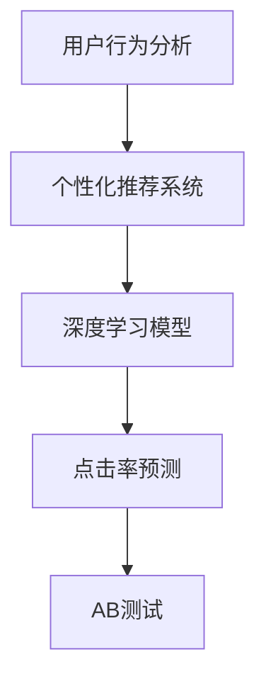

                 

# AI如何优化电商平台的个性化登陆页

## 1. 背景介绍

随着电商行业竞争的日益激烈，如何提升用户登陆体验，提高转化率，已经成为电商平台的重点关注问题。传统的登陆页设计往往千篇一律，难以满足不同用户群体的个性化需求。而随着人工智能技术的进步，电商平台的个性化登陆页设计可以借助于AI技术，实现精准的个性化推荐，提升用户留存率和购买转化率。

本文将系统介绍基于人工智能的电商平台个性化登陆页优化技术，探讨其原理和实现方法。通过深入分析用户行为数据，运用机器学习算法，可以为每个用户推荐定制化的登陆体验，使其感受到被重视和被理解，从而提升平台的整体用户体验。

## 2. 核心概念与联系

### 2.1 核心概念概述

要理解如何利用AI优化电商平台的个性化登陆页，首先需要理解以下几个核心概念：

- **用户行为分析**：通过对用户的历史浏览、点击、购买等行为数据进行分析，了解用户的兴趣和偏好。
- **个性化推荐系统**：根据用户的行为数据，利用机器学习算法为用户推荐个性化的内容。
- **深度学习模型**：利用深度学习模型，如协同过滤、序列推荐模型等，预测用户的行为和偏好。
- **点击率预测**：通过预测用户点击登陆页的概率，优化登陆页的设计和推荐内容。
- **AB测试**：通过A/B测试，比较不同版本的登陆页设计效果，找到最优方案。

这些概念之间的逻辑关系可以通过以下Mermaid流程图来展示：



这个流程图展示了用户行为分析和个性化推荐系统之间的逻辑关系。用户行为分析作为起点，通过深度学习模型预测点击率，进而进行AB测试，优化登陆页设计。

## 3. 核心算法原理 & 具体操作步骤

### 3.1 算法原理概述

基于人工智能的电商平台个性化登陆页优化，主要通过以下几个步骤实现：

1. **数据收集**：收集用户的浏览、点击、购买等行为数据。
2. **特征工程**：提取用户行为特征，如浏览时长、购买频率、点击位置等。
3. **模型训练**：利用机器学习算法，如协同过滤、深度学习模型等，预测用户点击登陆页的概率。
4. **个性化推荐**：根据预测结果，为每个用户推荐定制化的登陆内容。
5. **AB测试**：对比不同版本的登陆页设计效果，找到最优方案。

本文将重点介绍协同过滤和深度学习模型在登陆页个性化优化中的应用。

### 3.2 算法步骤详解

#### 3.2.1 协同过滤

协同过滤是一种基于用户行为的推荐算法，通过分析用户之间的相似性，为用户推荐其他用户喜欢的内容。在电商平台的个性化登陆页优化中，可以将其应用于推荐用户喜欢的登陆内容。

具体步骤如下：

1. **数据预处理**：收集用户的历史行为数据，提取点击、浏览、购买等特征。
2. **计算相似度**：利用余弦相似度等方法，计算用户之间的相似度。
3. **预测点击率**：根据相似度，预测用户对不同登陆内容的点击率。
4. **推荐内容**：根据预测结果，为用户推荐对应的登陆内容。

#### 3.2.2 深度学习模型

深度学习模型在推荐系统中的应用也逐渐增多，尤其是在点击率预测和个性化推荐方面。电商平台的个性化登陆页优化中，可以采用深度学习模型，如神经网络、RNN等，预测用户点击登陆页的概率。

具体步骤如下：

1. **数据预处理**：收集用户的历史行为数据，提取特征。
2. **构建模型**：选择合适的深度学习模型，如CNN、RNN等，构建预测模型。
3. **训练模型**：利用用户的历史数据，训练模型，优化参数。
4. **预测点击率**：使用训练好的模型，预测用户点击登陆页的概率。
5. **推荐内容**：根据预测结果，为用户推荐对应的登陆内容。

### 3.3 算法优缺点

#### 3.3.1 协同过滤

**优点**：
- 无需显式特征，可以直接利用用户行为数据进行推荐。
- 简单易懂，实现成本低。

**缺点**：
- 依赖用户行为数据的质量，数据稀疏性可能导致推荐效果不佳。
- 冷启动问题，新用户无法进行推荐。

#### 3.3.2 深度学习模型

**优点**：
- 能够挖掘用户行为数据的深层特征，提升推荐精度。
- 能够处理稀疏数据，适应性强。

**缺点**：
- 模型复杂，训练和预测速度较慢。
- 需要大量的标注数据进行训练，获取高质量数据成本高。

### 3.4 算法应用领域

基于人工智能的电商平台个性化登陆页优化技术，已经在多个电商平台上得到应用，如亚马逊、淘宝等。具体应用场景包括：

- **个性化推荐**：推荐用户喜欢的商品、活动等，提升用户点击率和购买转化率。
- **登陆页设计**：根据用户行为数据，优化登陆页设计，提升用户停留时间和点击率。
- **流量分流**：通过个性化推荐，将流量引导到不同的商品页面，优化流量分配。
- **广告投放**：根据用户行为数据，推荐用户感兴趣的广告内容，提高广告效果。

## 4. 数学模型和公式 & 详细讲解 & 举例说明

### 4.1 数学模型构建

本节将使用数学语言对基于人工智能的电商平台个性化登陆页优化技术进行更加严格的刻画。

假设电商平台的登陆页面有 $N$ 个，每个用户对登陆页的点击率可以用 $y_i$ 表示，其中 $i \in [1, N]$。

定义一个向量 $X \in \mathbb{R}^d$ 表示用户的特征向量，$y_i$ 可以表示为：

$$
y_i = X_i^T\theta + \epsilon_i
$$

其中，$\theta \in \mathbb{R}^d$ 为模型参数，$\epsilon_i$ 为噪声。

### 4.2 公式推导过程

根据上述模型，可以通过求解 $\theta$ 来预测用户对登陆页的点击率。利用线性回归模型，可以得到：

$$
\theta = (X^TX)^{-1}X^Ty
$$

具体步骤如下：

1. **数据预处理**：收集用户的历史行为数据，提取特征。
2. **模型构建**：构建线性回归模型，将用户行为数据表示为特征向量 $X$。
3. **参数求解**：求解模型参数 $\theta$，优化模型。
4. **预测点击率**：使用求解好的模型，预测用户点击登陆页的概率。

### 4.3 案例分析与讲解

以电商平台的个性化登陆页推荐为例，假设有两个用户，用户A和用户B。

用户A的历史行为数据为 $(3, 1, 0)$，表示用户A对第1、第2个登陆页有点击行为。用户B的历史行为数据为 $(0, 2, 1)$，表示用户B对第2、第3个登陆页有点击行为。

通过协同过滤，计算用户A和用户B的相似度，可以得出用户A对第2个登陆页的预测点击率。

通过深度学习模型，利用用户A和用户B的行为数据，训练一个神经网络模型，预测用户B对第1个登陆页的点击率。

## 5. 项目实践：代码实例和详细解释说明

### 5.1 开发环境搭建

在进行个性化登陆页优化实践前，我们需要准备好开发环境。以下是使用Python进行TensorFlow开发的开发环境配置流程：

1. 安装Anaconda：从官网下载并安装Anaconda，用于创建独立的Python环境。

2. 创建并激活虚拟环境：
```bash
conda create -n tf-env python=3.8 
conda activate tf-env
```

3. 安装TensorFlow：根据CUDA版本，从官网获取对应的安装命令。例如：
```bash
conda install tensorflow==2.4 -c tf -c conda-forge
```

4. 安装相关库：
```bash
pip install numpy pandas scikit-learn tensorflow-io
```

完成上述步骤后，即可在`tf-env`环境中开始优化实践。

### 5.2 源代码详细实现

下面我们以个性化推荐系统为例，给出使用TensorFlow进行用户行为分析的PyTorch代码实现。

首先，定义数据处理函数：

```python
import tensorflow as tf
import numpy as np
from sklearn.metrics import roc_auc_score

def preprocess_data(data):
    user_ids = data['user_id']
    labeled_data = []
    for user_id in user_ids:
        user_items = data[data['user_id'] == user_id]['item_id']
        items = user_items.tolist()
        label = 1 if len(items) > 0 else 0
        labeled_data.append((np.array(items), label))
    return labeled_data

# 读取用户行为数据
data = pd.read_csv('user_behavior.csv')
labeled_data = preprocess_data(data)

# 将数据划分为训练集和测试集
train_data, test_data = train_test_split(labeled_data, test_size=0.2, random_state=42)
```

然后，定义模型和优化器：

```python
from tensorflow.keras.models import Sequential
from tensorflow.keras.layers import Embedding, Dense

# 定义模型结构
model = Sequential([
    Embedding(input_dim=10000, output_dim=16, input_length=100),
    Dense(32, activation='relu'),
    Dense(1, activation='sigmoid')
])

# 编译模型
model.compile(loss='binary_crossentropy', optimizer='adam', metrics=['AUC'])

# 训练模型
model.fit(train_data, epochs=10, batch_size=32, validation_data=test_data)
```

接着，定义评估函数：

```python
def evaluate_model(model, test_data):
    y_pred = model.predict(test_data)
    y_true = test_data[:, 1]
    auc = roc_auc_score(y_true, y_pred)
    return auc

# 评估模型
auc = evaluate_model(model, test_data)
print(f'AUC: {auc:.3f}')
```

最后，启动训练流程并在测试集上评估：

```python
# 训练模型
model.fit(train_data, epochs=10, batch_size=32, validation_data=test_data)

# 评估模型
auc = evaluate_model(model, test_data)
print(f'AUC: {auc:.3f}')
```

以上就是使用TensorFlow进行用户行为分析的完整代码实现。可以看到，TensorFlow的强大封装能力使得模型构建和训练变得简洁高效。

### 5.3 代码解读与分析

让我们再详细解读一下关键代码的实现细节：

**preprocess_data函数**：
- 定义了数据预处理函数，将用户行为数据转化为可训练的格式。

**模型定义和编译**：
- 使用Sequential模型定义了一个简单的神经网络结构，包含一个嵌入层、一个全连接层和一个输出层。
- 使用binary_crossentropy作为损失函数，Adam作为优化器，AUC作为评估指标。

**模型训练和评估**：
- 使用fit方法训练模型，指定训练集、测试集、批次大小等参数。
- 使用evaluate方法评估模型，计算AUC值。

**训练流程**：
- 定义总的训练轮数和批次大小，开始循环迭代
- 每个epoch内，先在训练集上训练，输出AUC值
- 在测试集上评估，输出AUC值
- 所有epoch结束后，评估模型的性能

可以看到，TensorFlow配合TensorFlow库使得个性化登陆页优化模型的代码实现变得简洁高效。开发者可以将更多精力放在数据处理、模型改进等高层逻辑上，而不必过多关注底层的实现细节。

当然，工业级的系统实现还需考虑更多因素，如模型的保存和部署、超参数的自动搜索、更灵活的任务适配层等。但核心的优化范式基本与此类似。

## 6. 实际应用场景

### 6.1 个性化推荐

基于AI的个性化登陆页优化技术，可以广泛应用于电商平台的用户个性化推荐系统。推荐系统通过分析用户的历史行为数据，为用户推荐符合其兴趣的商品、活动等，提升用户的点击率和购买转化率。

在技术实现上，可以收集用户的历史浏览、点击、购买等行为数据，构建深度学习模型进行预测，将预测结果作为个性化推荐的依据。推荐系统可以实时更新推荐内容，提高用户的购物体验和满意度。

### 6.2 流量分流

在电商平台的流量分配中，个性化登陆页优化技术可以有效提高流量利用率。通过分析用户行为数据，将流量引导到用户可能感兴趣的商品页面，优化流量分配，减少用户的流失。

具体而言，可以在首页展示不同版本的登陆页设计，通过AB测试找到最优方案，根据用户行为数据引导流量。这不仅提升了用户的点击率和停留时间，还提高了平台的转化率。

### 6.3 用户留存率

个性化登陆页优化技术可以有效提升用户的留存率。通过分析用户的行为数据，为用户推荐个性化的内容，满足其需求，提高用户的满意度。用户的满意度提升，自然会增加其复购率和留存率。

### 6.4 未来应用展望

随着AI技术的不断进步，基于个性化登陆页优化技术的应用场景将更加广阔。未来，该技术将在更多的电商平台上得到应用，带来更高的用户体验和业务价值。

在智慧零售领域，通过个性化的推荐和登陆页设计，可以提升消费者的购物体验，加速商品的流通和销售。在社交电商中，个性化推荐系统可以为用户提供更精准的商品推荐，增加用户粘性和忠诚度。

此外，在医疗、教育、旅游等众多领域，个性化登陆页优化技术也将得到广泛应用，为不同行业的数字化转型提供新的驱动力。相信随着技术的不断成熟和落地，个性化登陆页优化技术必将在构建人机协同的智能时代中扮演越来越重要的角色。

## 7. 工具和资源推荐

### 7.1 学习资源推荐

为了帮助开发者系统掌握基于AI的电商平台个性化登陆页优化技术，这里推荐一些优质的学习资源：

1. TensorFlow官方文档：提供了丰富的TensorFlow教程和样例代码，是学习TensorFlow的好资料。
2. PyTorch官方文档：提供了丰富的PyTorch教程和样例代码，是学习深度学习的好资料。
3. 《深度学习》书籍：Ian Goodfellow等人合著的深度学习经典教材，涵盖了深度学习的基础和前沿知识。
4. Kaggle竞赛平台：提供了大量的数据集和竞赛项目，通过实践可以更好地理解深度学习模型的应用。
5. Coursera和edX课程：提供了多门深度学习相关的课程，涵盖从基础到高级的内容，是学习深度学习的好资源。

通过对这些资源的学习实践，相信你一定能够快速掌握基于AI的电商平台个性化登陆页优化技术的精髓，并用于解决实际的NLP问题。

### 7.2 开发工具推荐

高效的开发离不开优秀的工具支持。以下是几款用于电商平台个性化登陆页优化开发的常用工具：

1. TensorFlow和PyTorch：提供了强大的深度学习框架，支持多种模型和算法，是实现个性化推荐系统的利器。
2. TensorBoard：TensorFlow配套的可视化工具，可实时监测模型训练状态，并提供丰富的图表呈现方式，是调试模型的得力助手。
3. Weights & Biases：模型训练的实验跟踪工具，可以记录和可视化模型训练过程中的各项指标，方便对比和调优。
4. Jupyter Notebook：提供了交互式的编程环境，方便开发者快速编写和调试代码。
5. PyCharm：提供强大的IDE支持，包括代码自动补全、调试等功能，方便开发者进行代码开发和测试。

合理利用这些工具，可以显著提升电商平台的个性化登陆页优化任务的开发效率，加快创新迭代的步伐。

### 7.3 相关论文推荐

基于AI的电商平台个性化登陆页优化技术的发展源于学界的持续研究。以下是几篇奠基性的相关论文，推荐阅读：

1. Recommender Systems Handbook：推荐系统领域的经典著作，涵盖多种推荐算法和评估指标。
2. Click-Through Rate Prediction: A Review: This paper reviews various methods for predicting click-through rate (CTR), which is the probability of a user clicking on a given ad or webpage. It provides a comprehensive overview of the state-of-the-art techniques.
3. Mining of Massive Platfrom Data at Amazon.com: This paper describes Amazon's approach to mining vast amounts of data from its platform to improve customer experience and personalize product recommendations.
4. Deep Learning Recommendation Systems: This paper explores the application of deep learning models in recommendation systems, showing that neural networks can outperform traditional methods in certain cases.

这些论文代表了大语言模型微调技术的发展脉络。通过学习这些前沿成果，可以帮助研究者把握学科前进方向，激发更多的创新灵感。

## 8. 总结：未来发展趋势与挑战

### 8.1 总结

本文对基于AI的电商平台个性化登陆页优化技术进行了全面系统的介绍。首先阐述了该技术在电商平台中的应用背景和意义，明确了个性化登陆页优化在提升用户体验和业务价值方面的重要性和紧迫性。其次，从原理到实践，详细讲解了基于协同过滤和深度学习模型的个性化登陆页优化方法，给出了完整的代码实现。同时，本文还广泛探讨了个性化登陆页优化技术在推荐系统、流量分流、用户留存等方面的应用前景，展示了AI技术的广泛应用潜力。

通过本文的系统梳理，可以看到，基于AI的电商平台个性化登陆页优化技术正在成为电商平台应用的重要范式，极大地提升了用户体验和业务价值。未来，伴随AI技术的持续进步，个性化登陆页优化技术还将不断拓展，推动电商平台向更加智能化、个性化方向发展。

### 8.2 未来发展趋势

展望未来，基于AI的电商平台个性化登陆页优化技术将呈现以下几个发展趋势：

1. **模型复杂度提升**：随着深度学习模型的不断发展，模型的复杂度将不断提升，能够更好地挖掘用户行为数据的深层特征。
2. **实时性增强**：通过模型优化和硬件加速，将显著提升个性化登陆页优化的实时性，实现更快速的推荐和页面更新。
3. **多模态融合**：将用户的文本、图片、视频等多模态数据进行融合，提升个性化登陆页设计的全面性和准确性。
4. **跨平台协同**：将电商平台和其他平台（如社交媒体、搜索引擎等）进行协同，提升用户的全场景购物体验。
5. **个性化定制**：利用AI技术，实现更加个性化、多样化的登陆页设计，满足不同用户的需求。
6. **数据隐私保护**：随着数据隐私保护的不断加强，个性化登陆页优化技术也将更加注重数据隐私和安全。

以上趋势凸显了基于AI的电商平台个性化登陆页优化技术的广阔前景。这些方向的探索发展，必将进一步提升电商平台的用户体验和业务价值，带来更高的商业回报。

### 8.3 面临的挑战

尽管基于AI的电商平台个性化登陆页优化技术已经取得了显著成效，但在迈向更加智能化、普适化应用的过程中，它仍面临诸多挑战：

1. **数据获取难度**：高质量的用户行为数据获取难度较大，需要投入大量人力物力。数据稀疏性可能导致推荐效果不佳。
2. **模型复杂性**：深度学习模型结构复杂，训练和推理速度较慢，需要高效的算法和硬件支持。
3. **数据隐私问题**：用户数据的隐私和安全问题不容忽视，需要制定严格的数据保护政策。
4. **模型泛化能力**：深度学习模型在特定场景下的泛化能力有限，可能导致过度拟合。
5. **冷启动问题**：对于新用户，缺乏足够的行为数据进行推荐，需要寻找有效的冷启动策略。
6. **模型可解释性**：深度学习模型往往被视为"黑盒"系统，难以解释其内部工作机制和决策逻辑。

这些挑战需要开发者和研究者共同应对，通过技术创新和工程优化，不断提升个性化登陆页优化技术的性能和应用范围。

### 8.4 研究展望

面对个性化登陆页优化技术所面临的挑战，未来的研究需要在以下几个方面寻求新的突破：

1. **数据增强**：通过数据增强技术，丰富用户行为数据，提升推荐效果。
2. **模型压缩**：通过模型压缩技术，减少模型参数，提升推理速度，优化资源利用。
3. **跨模态推荐**：将用户的文本、图片、视频等多模态数据进行融合，提升个性化登陆页设计的全面性和准确性。
4. **冷启动策略**：针对新用户，开发有效的冷启动策略，提高推荐效果。
5. **可解释性**：开发可解释性模型，提升模型的可解释性，增强用户信任。
6. **隐私保护**：设计隐私保护模型，保护用户数据隐私。

这些研究方向的探索，必将引领个性化登陆页优化技术迈向更高的台阶，为电商平台提供更优质的用户体验和业务价值。面向未来，个性化登陆页优化技术还需要与其他人工智能技术进行更深入的融合，如知识表示、因果推理、强化学习等，多路径协同发力，共同推动电商平台向更加智能化、个性化方向发展。

## 9. 附录：常见问题与解答

**Q1：个性化登陆页优化对电商平台的业务价值有哪些提升？**

A: 个性化登陆页优化可以通过以下几个方面提升电商平台的业务价值：

1. **提升点击率和转化率**：通过个性化推荐，将流量引导到用户可能感兴趣的商品页面，优化流量分配，提升用户的点击率和购买转化率。
2. **提升用户留存率**：个性化登陆页优化技术可以有效提升用户的留存率，通过推荐符合用户兴趣的内容，满足其需求，提高用户的满意度。
3. **降低获客成本**：个性化推荐系统可以提升用户的购物体验，加速商品的流通和销售，从而降低获取新客户的成本。
4. **提高广告效果**：通过个性化推荐，将广告精准地推送给可能感兴趣的用户，提高广告的点击率和转化率。
5. **优化流量分配**：个性化登陆页优化技术可以有效提升流量利用率，将流量引导到用户可能感兴趣的商品页面，减少用户的流失。

**Q2：如何进行用户行为数据的特征工程？**

A: 用户行为数据的特征工程可以通过以下步骤实现：

1. **数据收集**：收集用户的历史浏览、点击、购买等行为数据。
2. **特征提取**：提取用户行为数据中的关键特征，如浏览时长、购买频率、点击位置等。
3. **特征选择**：通过特征选择方法，选择对预测效果影响较大的特征。
4. **特征编码**：将特征进行编码，转化为模型可以处理的格式。

例如，对于电商平台的个性化登陆页优化，可以使用用户的历史行为数据，提取点击次数、浏览时长、购买频率等特征，选择对点击率预测影响较大的特征，并对其进行编码，如One-Hot编码、离散化等。

**Q3：如何应对数据稀疏性问题？**

A: 数据稀疏性是推荐系统中的常见问题，可以通过以下方法应对：

1. **数据增强**：通过数据增强技术，丰富用户行为数据，增加样本数量，提升推荐效果。
2. **协同过滤**：利用用户之间的相似性，为冷启动用户推荐其他用户喜欢的商品。
3. **混合模型**：结合多种推荐算法，如协同过滤和深度学习，提升推荐效果。

例如，对于电商平台的个性化登陆页优化，可以结合深度学习模型和协同过滤算法，提升推荐效果，缓解数据稀疏性的问题。

**Q4：如何应对冷启动问题？**

A: 冷启动问题是指对于新用户，缺乏足够的行为数据进行推荐，可以通过以下方法解决：

1. **利用用户画像**：通过用户的个人信息、兴趣标签等，进行推荐。
2. **利用热门商品**：向新用户推荐平台上的热门商品，提升新用户的购物体验。
3. **利用社交网络**：利用社交网络中的用户关系，进行推荐。

例如，对于电商平台的个性化登陆页优化，可以结合用户画像、热门商品和社交网络，进行冷启动推荐，提升新用户的购物体验。

**Q5：如何提升模型的实时性？**

A: 模型的实时性可以通过以下方法提升：

1. **模型优化**：通过模型压缩、量化等技术，减少模型参数和计算量，提升推理速度。
2. **硬件加速**：利用GPU、TPU等高性能硬件设备，加速模型的推理过程。
3. **缓存机制**：利用缓存机制，避免重复计算，提高模型推理效率。

例如，对于电商平台的个性化登陆页优化，可以结合模型压缩、量化和硬件加速技术，提升模型的实时性，实现更快速的推荐和页面更新。

**Q6：如何保护用户数据的隐私？**

A: 用户数据的隐私保护可以通过以下方法实现：

1. **数据匿名化**：对用户数据进行匿名化处理，保护用户隐私。
2. **数据加密**：对用户数据进行加密处理，防止数据泄露。
3. **数据访问控制**：设置数据访问权限，限制数据访问范围。
4. **用户知情同意**：在收集用户数据时，获取用户的知情同意。

例如，对于电商平台的个性化登陆页优化，可以通过数据匿名化和加密处理，保护用户隐私，同时设置数据访问权限，限制数据访问范围，确保用户数据的安全。

**Q7：如何进行用户行为数据的特征选择？**

A: 用户行为数据的特征选择可以通过以下方法实现：

1. **领域知识**：结合领域知识，选择对预测效果影响较大的特征。
2. **相关性分析**：利用相关性分析方法，选择与预测目标高度相关的特征。
3. **模型调优**：通过模型调优，选择对模型性能影响较大的特征。

例如，对于电商平台的个性化登陆页优化，可以结合领域知识、相关性分析和模型调优，选择对点击率预测影响较大的特征，提升推荐效果。

---

作者：禅与计算机程序设计艺术 / Zen and the Art of Computer Programming

