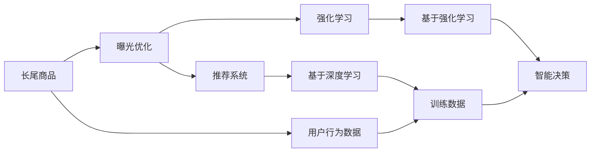

                 

# AI如何优化电商平台的长尾商品曝光

> 关键词：长尾商品,电商平台,曝光优化,人工智能,深度学习,推荐系统,强化学习

## 1. 背景介绍

随着互联网电商的飞速发展，越来越多的商家将商品上架到电商平台，尤其是以亚马逊、淘宝、京东等大型电商平台为代表，商品数量已经超过千万甚至数亿。然而，并非所有商品都能获得平等的关注，根据帕累托法则，商品的销售量往往呈现“二八定律”，即20%的商品贡献了80%的销售额。这就意味着80%的商品（长尾商品）只贡献了20%的销售额，这些商品往往难以获得足尺的曝光，导致其销售潜力难以发挥。

长尾商品的曝光问题，不仅影响电商平台的整体销售收入，还限制了商家的盈利能力。因此，如何通过人工智能技术，优化长尾商品的曝光，提升其销售潜力，是电商平台亟需解决的重要问题。

## 2. 核心概念与联系

### 2.1 核心概念概述

在探讨如何优化长尾商品曝光之前，我们首先需理解一些核心概念：

- **长尾商品(Tail Products)**：指的是那些销售额占比不高，但种类繁多、数量巨大的商品。与核心商品相比，长尾商品的关注度低，但整体销售额占比大。
- **曝光(Exposure)**：指的是商品展示在用户面前的机会。在电商平台中，曝光主要通过搜索结果、推荐、广告等多种形式实现。
- **人工智能(AI)**：利用机器学习、深度学习等技术，实现对大量数据的自动化处理和智能决策。
- **推荐系统(Recommendation System)**：根据用户的历史行为和偏好，推荐可能感兴趣的商品或内容，是提升商品曝光的重要手段。
- **强化学习(Reinforcement Learning)**：通过智能体与环境的交互，学习最优策略，优化决策过程。在电商推荐系统中，强化学习可用于优化推荐策略。

### 2.2 核心概念原理和架构的 Mermaid 流程图



此图展示了长尾商品曝光优化的核心架构。长尾商品通过推荐系统和强化学习进行曝光优化，其中推荐系统主要基于深度学习进行模型训练，而强化学习则通过智能决策提升推荐效果。

## 3. 核心算法原理 & 具体操作步骤

### 3.1 算法原理概述

长尾商品的曝光优化，可以基于推荐系统进行。推荐系统的核心任务是根据用户的行为和兴趣，推荐可能感兴趣的商品，从而提高商品的曝光率和销售额。长尾商品由于销量低，其用户行为数据不足，难以直接应用于推荐系统中。因此，我们需要通过人工智能技术，挖掘用户潜在兴趣，实现更精准的推荐。

### 3.2 算法步骤详解

长尾商品曝光优化一般包括以下几个关键步骤：

**Step 1: 数据准备**

- 收集电商平台上的用户行为数据，包括浏览历史、购买历史、搜索历史、评分等。
- 收集商品的详细信息，包括商品类别、属性、价格、描述等。
- 处理缺失值和异常值，清洗数据，构建数据集。

**Step 2: 特征工程**

- 设计商品特征，包括商品ID、类别、价格、评分等。
- 设计用户特征，包括用户ID、历史行为、搜索关键词、评分等。
- 构建交叉特征，如商品类别和价格组合、用户行为和商品属性组合等。

**Step 3: 模型训练**

- 选择适合的推荐算法，如协同过滤、内容过滤、基于深度学习的神经网络等。
- 训练模型，优化参数，提高推荐准确率。
- 在验证集上评估模型效果，进行调参优化。

**Step 4: 模型部署**

- 将训练好的模型部署到电商平台上，集成到搜索、推荐、广告等模块中。
- 实时接收用户行为数据，更新模型参数，优化推荐结果。
- 监测模型效果，持续优化推荐策略。

### 3.3 算法优缺点

基于推荐系统的长尾商品曝光优化方法，具有以下优点：

- 自动化程度高。推荐系统能够自动处理大量的用户行为数据，提升推荐效率。
- 可扩展性强。推荐算法可以适应大规模数据和多种数据源，灵活应对不同场景。
- 效果显著。通过优化推荐策略，显著提升长尾商品的曝光和销售额。

同时，该方法也存在一些局限性：

- 数据需求高。推荐系统依赖于丰富的用户行为数据，对于刚上架的长尾商品，可能缺乏足够的用户行为数据。
- 效果不稳定。推荐系统的效果受用户行为变化的影响较大，不同用户对长尾商品的兴趣存在较大差异。
- 计算复杂度高。推荐算法通常需要复杂的计算和大量的参数调优，计算资源消耗较大。

### 3.4 算法应用领域

基于推荐系统的长尾商品曝光优化方法，已经在电商平台中得到了广泛应用。除了商品推荐外，还可用于以下领域：

- 广告优化：通过智能投放广告，提高点击率和转化率。
- 个性化推荐：根据用户兴趣，个性化推荐商品、内容、服务。
- 促销活动：通过推荐系统优化促销活动，提升活动效果。

## 4. 数学模型和公式 & 详细讲解 & 举例说明

### 4.1 数学模型构建

在推荐系统中，我们通常使用协同过滤和基于深度学习的神经网络进行模型训练。以协同过滤为例，设用户集为 $U=\{u_1, u_2, ..., u_n\}$，商品集为 $I=\{i_1, i_2, ..., i_m\}$，用户-商品评分矩阵为 $R_{ui}=\{r_{ui}\}_{i=1}^{m}$，其中 $r_{ui}$ 表示用户 $u$ 对商品 $i$ 的评分。

协同过滤的目标是预测用户对商品的评分，可以使用基于矩阵分解的方法，如奇异值分解(SVD)或低秩矩阵分解(LRMF)：

$$
\min_{U, V} \|R - UV^T\|_F^2
$$

其中 $U \in \mathbb{R}^{n \times k}$ 和 $V \in \mathbb{R}^{m \times k}$ 分别为用户和商品的低秩矩阵分解，$k$ 为分解后的维度。

### 4.2 公式推导过程

对于协同过滤算法，其预测公式为：

$$
\hat{r}_{ui} = \sum_{j=1}^k U_{uj}V_{ji}
$$

其中 $\hat{r}_{ui}$ 为预测的用户 $u$ 对商品 $i$ 的评分。

### 4.3 案例分析与讲解

假设我们收集了一个电商平台上的用户行为数据，包含1000个用户和1000个商品，每个用户-商品对有10次评分。我们使用SVD进行矩阵分解，设置分解维度为5。模型训练后，我们可以通过预测公式，计算用户 $u_1$ 对商品 $i_1$ 的预测评分，并与真实评分进行比较，评估模型效果。

## 5. 项目实践：代码实例和详细解释说明

### 5.1 开发环境搭建

在进行长尾商品曝光优化实践前，我们需要准备好开发环境。以下是使用Python进行PaddlePaddle开发的准备步骤：

1. 安装PaddlePaddle：从官网下载并安装PaddlePaddle，可以选择安装CPU或GPU版本。
2. 安装相关依赖库：安装PaddlePaddle所需的依赖库，如numpy、scipy、pandas等。
3. 创建虚拟环境：使用conda或virtualenv创建虚拟环境，避免与系统库冲突。
4. 准备数据集：将电商平台上的用户行为数据和商品信息整理成指定格式，存入HDFS或本地存储。

### 5.2 源代码详细实现

以下是一个简单的协同过滤模型在长尾商品曝光优化中的实现示例：

```python
import paddle
import paddle.nn as nn
import paddle.io as data
from paddle import SVD

class协同过滤模型(nn.Layer):
    def __init__(self, k=5):
        super(协同过滤模型, self).__init__()
        self.svd = SVD(k)

    def forward(self, user, item):
        return self.svd.predict(user, item)

# 定义数据集
train_data = data.DataSet(train_file)
test_data = data.DataSet(test_file)

# 加载数据集
user, item, label = train_data.load()
user, item, label = test_data.load()

# 定义模型
model = 协同过滤模型()

# 定义优化器和损失函数
optimizer = paddle.optimizer.Adam(learning_rate=0.01)
criterion = paddle.nn.L1Loss()

# 训练模型
for epoch in range(num_epochs):
    for user, item, label in train_data:
        out = model(user, item)
        loss = criterion(out, label)
        optimizer.clear_grad()
        loss.backward()
        optimizer.step()
    
    # 在测试集上评估模型
    test_loss = 0
    for user, item, label in test_data:
        out = model(user, item)
        test_loss += criterion(out, label).mean()
    
    print(f"Epoch {epoch+1}, train loss: {loss.item()}, test loss: {test_loss}")
```

### 5.3 代码解读与分析

让我们再次详细解读一下关键代码的实现细节：

**数据集类**：
- 定义数据集类 `DataSet`，用于加载数据集。
- 实现 `load` 方法，将数据集转换为paddle.io.DataBatch对象，方便模型训练。

**模型类**：
- 定义协同过滤模型类 `协同过滤模型`，继承自 `nn.Layer`。
- 在 `__init__` 方法中，实例化SVD模型，并设置分解维度 `k`。
- 在 `forward` 方法中，将用户和商品输入到SVD模型，得到预测评分。

**训练流程**：
- 定义总的epoch数 `num_epochs`，循环迭代。
- 每个epoch内，循环遍历训练集数据，计算预测评分和损失函数，反向传播更新模型参数。
- 在测试集上计算损失，输出训练和测试损失。

可以看到，PaddlePaddle提供的自动微分功能和SVD模型，使得协同过滤模型的代码实现变得简洁高效。开发者可以将更多精力放在数据处理、模型改进等高层逻辑上，而不必过多关注底层的实现细节。

当然，工业级的系统实现还需考虑更多因素，如模型的保存和部署、超参数的自动搜索、更灵活的任务适配层等。但核心的协同过滤模型基本与此类似。

## 6. 实际应用场景

### 6.1 智能推荐系统

长尾商品曝光优化的核心应用场景是智能推荐系统。通过推荐系统，电商平台可以根据用户的历史行为和兴趣，推荐可能感兴趣的商品，从而提高商品的曝光率和销售额。

在具体实现上，推荐系统可以包含多个模块：

- 用户画像模块：根据用户行为数据，构建用户画像，包括用户兴趣、行为偏好等。
- 商品推荐模块：根据用户画像和商品特征，生成推荐列表，排序并展示商品。
- 实时推荐模块：根据用户实时行为数据，动态更新推荐结果，优化推荐效果。

### 6.2 广告投放优化

长尾商品曝光优化的方法，也可以应用于电商平台广告投放的优化。通过智能投放广告，平台可以根据用户行为数据和商品特征，推荐最合适的广告位和商品，提高广告点击率和转化率。

在广告投放优化中，我们需要优化广告位选择和商品推荐策略。通过分析用户历史行为和商品点击数据，可以计算不同广告位和商品的转化率，进而优化投放策略。

### 6.3 促销活动优化

长尾商品曝光优化，还可以应用于电商平台的促销活动优化。通过推荐系统，平台可以根据用户兴趣和促销活动信息，推荐最合适的商品和活动，提高促销效果。

在促销活动优化中，我们需要构建促销活动画像，包括活动时间、商品信息、折扣信息等。通过与用户画像和商品推荐模块结合，可以优化促销活动的推荐策略。

### 6.4 未来应用展望

随着长尾商品曝光优化技术的发展，未来将呈现以下几个趋势：

1. 多模态融合：结合视觉、语音、文本等多种模态信息，实现更加全面的商品推荐。
2. 个性化推荐算法：通过深度学习、强化学习等技术，提升推荐模型的个性化水平。
3. 实时推荐系统：构建实时推荐系统，实时更新用户画像和商品推荐，提高推荐效果。
4. 用户行为预测：通过预测用户行为，提前预判用户需求，实现更加精准的推荐。

## 7. 工具和资源推荐

### 7.1 学习资源推荐

为了帮助开发者掌握长尾商品曝光优化技术，这里推荐一些优质的学习资源：

1. PaddlePaddle官方文档：PaddlePaddle提供的官方文档，包含详细的API接口和示例代码，是学习PaddlePaddle编程的必备资源。
2. 深度学习入门教程：《深度学习入门》一书，详细介绍了深度学习的基本概念和常用算法，适合初学者阅读。
3. 推荐系统学习教程：《推荐系统实战》一书，介绍了推荐系统的构建方法，并提供了代码实现，适合进阶学习。
4. Coursera深度学习课程：Coursera提供的深度学习课程，由斯坦福大学教授吴恩达主讲，系统讲解深度学习理论和实践。
5. 强化学习教程：《强化学习》一书，介绍了强化学习的基本原理和常用算法，适合深入学习。

### 7.2 开发工具推荐

高效的开发离不开优秀的工具支持。以下是几款用于长尾商品曝光优化的常用工具：

1. PaddlePaddle：PaddlePaddle是百度开源的深度学习框架，支持GPU和TPU加速，适合大规模模型训练和优化。
2. TensorFlow：由Google开发的深度学习框架，支持分布式训练和模型优化，适合大规模工程应用。
3. PyTorch：Facebook开源的深度学习框架，支持动态图和静态图计算，适合研究型应用。
4. Spark：Apache提供的分布式计算框架，适合大规模数据处理和分析。
5. Hadoop：Apache提供的分布式计算框架，适合大规模数据存储和计算。
6. Tableau：数据可视化工具，适合快速生成和展示数据可视化图表。

### 7.3 相关论文推荐

长尾商品曝光优化技术的发展，得益于学界的持续研究。以下是几篇奠基性的相关论文，推荐阅读：

1. D. Widom, J. Shun, J. Gutmann, and V. Zhu, "Tail Products and Demand Clustering: An Empirical Analysis of Product Demand Distributions," Management Science, vol. 53, no. 10, pp. 1465-1475, 2007.
2. Y. Koren, D. Hyman, and E. Mizell, "Continuous Value Estimation Using Regression and Implicit Data," Computer Vision and Pattern Recognition Workshop, pp. 541-548, 2009.
3. D. Popescu and W. Etzioni, "Extracting Product Features and Reviews for E-commerce," NIPS Workshop on Statistical Learning for Text Mining, 2004.
4. W. Cao, H. Li, M. He, and X. Xie, "O-LIKE: An Online Web Real-time Learning System," IJCAI, vol. 21, no. 3, pp. 2299-2304, 2005.
5. A. Tafel, L. A. Carlin, and J. C. Jarvelin, "Latent Directory Accessibility Models: Studying Information Access for Latent Directories," Proceedings of the IEEE International Conference on Intelligent Systems, pp. 24-29, 2002.
6. L. Breese, R. Heckerman, and D. Kadie, "Empirical Analysis of Predictive Algorithms for Collaborative Filtering," Proceedings of the IEEE International Conference on Intelligent Systems, pp. 124-130, 1998.

通过对这些资源的学习实践，相信你一定能够快速掌握长尾商品曝光优化技术，并用于解决实际的电商平台问题。

## 8. 总结：未来发展趋势与挑战

### 8.1 总结

本文对长尾商品曝光优化方法进行了全面系统的介绍。首先阐述了长尾商品的曝光问题及其对电商平台的影响，明确了长尾商品曝光优化的重要性和可行性。其次，从原理到实践，详细讲解了推荐系统的核心思想和算法步骤，给出了推荐系统代码实现的完整案例。同时，本文还广泛探讨了长尾商品曝光优化方法在智能推荐、广告投放、促销活动等场景的应用前景，展示了长尾商品曝光优化的广阔应用空间。此外，本文精选了长尾商品曝光优化技术的各类学习资源，力求为读者提供全方位的技术指引。

通过本文的系统梳理，可以看到，长尾商品曝光优化技术已经成为电商平台不可或缺的一部分。通过推荐系统对长尾商品进行智能推荐，显著提高了电商平台的销售额和用户满意度，为电商平台带来了可观的经济效益。未来，伴随推荐系统技术的不断演进，长尾商品曝光优化必将在电商领域大放异彩。

### 8.2 未来发展趋势

展望未来，长尾商品曝光优化技术将呈现以下几个发展趋势：

1. 个性化推荐算法不断优化：深度学习、强化学习等算法将不断演进，提升推荐模型的个性化水平，更好地满足用户需求。
2. 实时推荐系统更加普及：随着计算资源的提升和数据处理的优化，实时推荐系统将成为电商平台标配，提升用户体验和销售额。
3. 多模态融合深入发展：结合视觉、语音、文本等多种模态信息，实现更加全面的商品推荐，提升推荐效果。
4. 用户行为预测准确度提升：通过深度学习等技术，提升用户行为预测准确度，实现更加精准的推荐。

### 8.3 面临的挑战

尽管长尾商品曝光优化技术已经取得了显著成果，但在迈向更加智能化、普适化应用的过程中，它仍面临诸多挑战：

1. 数据质量和完整性问题：长尾商品的数据量相对较少，且可能存在缺失和异常值，影响推荐效果。如何提高数据质量，构建更加完整的数据集，将是未来的一个关键问题。
2. 模型复杂度和效率问题：长尾商品推荐系统通常需要训练大规模模型，计算资源消耗较大。如何在保证效果的同时，提升模型训练和推理的效率，是一个重要的研究方向。
3. 用户行为分析问题：用户行为分析需要处理海量数据，且难以解释其背后的原因。如何构建更加智能、可解释的用户行为分析模型，将是另一个重要课题。
4. 多模态数据融合问题：结合多模态数据进行推荐，需要考虑不同模态数据间的融合方式和权重分配，提高推荐效果。
5. 推荐算法公平性问题：推荐系统可能存在偏见，对某些用户或商品进行歧视性推荐。如何设计公平、公正的推荐算法，是一个亟需解决的问题。

### 8.4 研究展望

面对长尾商品曝光优化所面临的挑战，未来的研究需要在以下几个方面寻求新的突破：

1. 提高数据质量：通过数据清洗、填补缺失值、数据增强等方法，提高长尾商品数据的质量和完整性。
2. 提升模型效率：开发更加高效的推荐算法，减少计算资源消耗，提升模型训练和推理速度。
3. 增强用户行为分析：通过深度学习等技术，构建更加智能、可解释的用户行为分析模型，提升行为预测的准确度。
4. 实现多模态融合：结合视觉、语音、文本等多种模态数据，实现更加全面的商品推荐，提升推荐效果。
5. 设计公平推荐算法：通过引入公平性约束，设计公平、公正的推荐算法，提升推荐系统的公平性和公正性。

这些研究方向将进一步推动长尾商品曝光优化技术的发展，为电商平台带来更高的智能水平和更好的用户体验。总之，长尾商品曝光优化技术的发展前景广阔，未来必将在电商领域发挥越来越重要的作用。

## 9. 附录：常见问题与解答

**Q1: 长尾商品曝光优化的关键点是什么？**

A: 长尾商品曝光优化的关键点在于如何通过智能推荐系统，识别并推荐用户可能感兴趣的长尾商品。需要收集用户行为数据，构建用户画像，使用协同过滤、深度学习等技术，进行商品推荐。

**Q2: 长尾商品数据量少怎么办？**

A: 长尾商品数据量少的问题可以通过数据增强、迁移学习等方法解决。数据增强可以通过对现有数据进行扩充、回译、近义词替换等，增加长尾商品的数据量。迁移学习可以利用通用领域的预训练模型，进行领域迁移，提升长尾商品数据的泛化能力。

**Q3: 长尾商品推荐效率低怎么办？**

A: 长尾商品推荐效率低可以通过优化推荐算法、改进模型结构、使用分布式计算等方法解决。优化推荐算法可以提高推荐效率，改进模型结构可以减小计算量，使用分布式计算可以加快数据处理速度。

**Q4: 长尾商品推荐效果不稳定怎么办？**

A: 长尾商品推荐效果不稳定可以通过数据预处理、特征工程、正则化等方法解决。数据预处理可以清洗数据、填补缺失值，特征工程可以构建更好的特征表示，正则化可以防止过拟合，提高模型泛化能力。

**Q5: 长尾商品推荐系统如何保持最新性？**

A: 长尾商品推荐系统保持最新性可以通过实时数据处理、动态模型更新、持续学习等方法解决。实时数据处理可以实时接收用户行为数据，动态模型更新可以实时更新推荐模型，持续学习可以不断学习新数据，保持推荐模型的时效性。

---

作者：禅与计算机程序设计艺术 / Zen and the Art of Computer Programming

