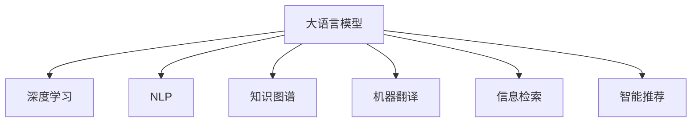

                 

## 1. 背景介绍

### 1.1 问题由来
随着信息技术的高速发展，AI技术的广泛应用，人们获取和处理信息的方式正在发生革命性的变化。从传统的基于文本的搜索和阅读，到多媒体信息的快速处理，再到复杂的自然语言理解和生成，AI技术正在深刻改变人类与信息交互的方式。

### 1.2 问题核心关键点
AI技术特别是大语言模型和深度学习技术的发展，使得信息处理变得更加智能和高效。核心关键点包括：

- **信息获取**：AI技术可以自动抓取和分析网络上的海量信息，为人类提供实时、准确的信息服务。
- **信息处理**：深度学习模型能够从结构化数据中提取丰富的特征，支持自然语言处理、计算机视觉、语音识别等。
- **信息生成**：AI技术能够基于大规模数据集进行内容生成，支持自动摘要、自动翻译、智能创作等应用。
- **信息交互**：通过聊天机器人、智能客服等形式，AI技术实现了更加智能和自然的用户交互。

这些核心关键点共同构成了AI改变信息处理方式的基础。

## 2. 核心概念与联系

### 2.1 核心概念概述

为了更好地理解AI如何改变信息处理方式，本节将介绍几个关键核心概念：

- **大语言模型(Large Language Model, LLM)**：指能够理解和生成自然语言的深度学习模型，如BERT、GPT等，通过大规模无标签文本数据进行预训练，具有强大的语言理解能力。
- **深度学习(Deep Learning)**：基于神经网络模型进行学习和推理的AI技术，具有层次化的特征提取和表示能力。
- **自然语言处理(Natural Language Processing, NLP)**：涉及计算机对自然语言文字的理解、处理和生成，是大规模语言模型的主要应用领域。
- **知识图谱(Knowledge Graph)**：以图的形式表示实体及其关系的数据结构，支持结构化信息管理和推理。
- **机器翻译(Machine Translation, MT)**：将一种语言自动翻译成另一种语言的技术，是大规模语言模型的重要应用之一。
- **信息检索(Information Retrieval, IR)**：从大量文档集合中查找和返回与查询最相关的信息，是大规模语言模型的另一重要应用。
- **智能推荐(Recommendation System, RS)**：基于用户行为数据，推荐个性化的信息，是大规模语言模型的重要应用领域。

这些核心概念之间的逻辑关系可以通过以下Mermaid流程图来展示：



这个流程图展示了大语言模型与深度学习、NLP、知识图谱、机器翻译、信息检索、智能推荐等核心概念之间的联系。

## 3. 核心算法原理 & 具体操作步骤

### 3.1 算法原理概述

AI改变信息处理方式的核心算法原理是深度学习特别是大语言模型的预训练-微调机制。大语言模型通过在海量无标签文本数据上进行预训练，学习到语言的通用表示，然后通过微调使其适应特定任务，如文本分类、机器翻译、智能推荐等。

具体而言，大语言模型在预训练阶段，通过自监督任务（如语言模型预测、掩码语言模型预测）学习语言的通用知识。在微调阶段，根据特定任务的需求，调整模型参数，使其具备解决特定问题的能力。

### 3.2 算法步骤详解

基于大语言模型的信息处理，主要包括以下几个关键步骤：

1. **数据准备**：收集与任务相关的数据，并进行清洗、标注等预处理，确保数据的质量和多样性。
2. **模型选择**：选择合适的预训练模型，如BERT、GPT、T5等，作为信息处理的初始化参数。
3. **模型微调**：在预训练模型的基础上，使用下游任务的标注数据，通过有监督学习优化模型参数，使其适应特定任务。
4. **结果评估**：在测试集上评估微调后模型的性能，对比微调前后的效果提升。
5. **模型部署**：将微调后的模型集成到实际应用系统中，支持用户信息获取、处理和交互。

### 3.3 算法优缺点

基于大语言模型的信息处理具有以下优点：

- **高效性**：利用预训练模型的通用知识，在大规模数据上进行微调，可以快速适应新任务。
- **泛化能力**：预训练模型在大规模无标签数据上学习到语言知识的泛化能力，使得微调模型具有较强的泛化能力。
- **灵活性**：通过微调，可以根据任务需求灵活调整模型参数，适应不同的应用场景。
- **可解释性**：预训练模型通常具有可解释性，微调后的模型也可以借助任务适配层提供更直观的推理过程。

同时，该方法也存在一定的局限性：

- **依赖标注数据**：微调效果很大程度上依赖于标注数据的质量和数量，获取高质量标注数据的成本较高。
- **模型复杂度**：大语言模型参数量庞大，计算和存储成本较高。
- **过拟合风险**：微调模型可能出现过拟合，尤其是标注数据较少的情况下。
- **动态变化问题**：随着数据和用户需求的动态变化，模型需要不断更新，以保持性能。

### 3.4 算法应用领域

大语言模型的信息处理技术在多个领域得到了广泛应用，例如：

- **搜索引擎**：利用预训练语言模型进行信息检索和摘要生成，提高搜索引擎的智能化程度。
- **问答系统**：通过微调大语言模型，构建智能问答系统，支持用户自然语言查询和知识库检索。
- **新闻推荐**：利用深度学习模型对用户行为数据进行分析和建模，实现个性化新闻推荐。
- **金融分析**：通过预训练语言模型进行情感分析、舆情监测、新闻分类等任务，辅助金融决策。
- **医疗健康**：利用自然语言处理技术，对患者病历、医学文献进行分析和处理，辅助医生诊断和治疗。

除了上述这些经典应用外，大语言模型的信息处理技术还在更多领域得到了创新性的应用，如智能家居、智能城市、智能客服等，为各行各业带来了新的变革和机遇。

## 4. 数学模型和公式 & 详细讲解

### 4.1 数学模型构建

本节将使用数学语言对基于大语言模型的信息处理过程进行更加严格的刻画。

记预训练语言模型为 $M_{\theta}$，其中 $\theta$ 为预训练得到的模型参数。假设信息处理任务为文本分类，训练集为 $D=\{(x_i,y_i)\}_{i=1}^N, x_i \in \mathcal{X}, y_i \in \{0,1\}$，其中 $\mathcal{X}$ 为输入空间，$\{0,1\}$ 为输出空间。

定义模型 $M_{\theta}$ 在输入 $x$ 上的损失函数为 $\ell(M_{\theta}(x),y)$，则在数据集 $D$ 上的经验风险为：

$$
\mathcal{L}(\theta) = \frac{1}{N} \sum_{i=1}^N \ell(M_{\theta}(x_i),y_i)
$$

微调的优化目标是最小化经验风险，即找到最优参数：

$$
\theta^* = \mathop{\arg\min}_{\theta} \mathcal{L}(\theta)
$$

在实践中，我们通常使用基于梯度的优化算法（如SGD、Adam等）来近似求解上述最优化问题。设 $\eta$ 为学习率，$\lambda$ 为正则化系数，则参数的更新公式为：

$$
\theta \leftarrow \theta - \eta \nabla_{\theta}\mathcal{L}(\theta) - \eta\lambda\theta
$$

其中 $\nabla_{\theta}\mathcal{L}(\theta)$ 为损失函数对参数 $\theta$ 的梯度，可通过反向传播算法高效计算。

### 4.2 公式推导过程

以下我们以文本分类任务为例，推导交叉熵损失函数及其梯度的计算公式。

假设模型 $M_{\theta}$ 在输入 $x$ 上的输出为 $\hat{y}=M_{\theta}(x) \in [0,1]$，表示样本属于正类的概率。真实标签 $y \in \{0,1\}$。则二分类交叉熵损失函数定义为：

$$
\ell(M_{\theta}(x),y) = -[y\log \hat{y} + (1-y)\log (1-\hat{y})]
$$

将其代入经验风险公式，得：

$$
\mathcal{L}(\theta) = -\frac{1}{N}\sum_{i=1}^N [y_i\log M_{\theta}(x_i)+(1-y_i)\log(1-M_{\theta}(x_i))]
$$

根据链式法则，损失函数对参数 $\theta_k$ 的梯度为：

$$
\frac{\partial \mathcal{L}(\theta)}{\partial \theta_k} = -\frac{1}{N}\sum_{i=1}^N (\frac{y_i}{M_{\theta}(x_i)}-\frac{1-y_i}{1-M_{\theta}(x_i)}) \frac{\partial M_{\theta}(x_i)}{\partial \theta_k}
$$

其中 $\frac{\partial M_{\theta}(x_i)}{\partial \theta_k}$ 可进一步递归展开，利用自动微分技术完成计算。

### 4.3 案例分析与讲解

我们以新闻推荐系统为例，展示基于大语言模型的信息处理流程：

1. **数据准备**：收集用户的历史阅读行为数据，包括浏览过的新闻标题、阅读时间、评论内容等，并进行清洗、标注等预处理。
2. **模型选择**：选择合适的预训练模型，如BERT、GPT等，作为新闻推荐的初始化参数。
3. **模型微调**：在预训练模型的基础上，使用新闻标题和内容数据，通过有监督学习优化模型参数，使其具备新闻推荐能力。
4. **结果评估**：在测试集上评估微调后模型的性能，对比微调前后的效果提升。
5. **模型部署**：将微调后的模型集成到推荐系统中，根据用户的历史行为数据和实时新闻数据，生成个性化的新闻推荐。

以上基于BERT的文本分类和新闻推荐系统的案例，展示了大语言模型在信息处理中的高效性和灵活性。通过预训练和微调，模型可以充分利用大规模无标签数据，学习语言的通用知识，然后根据特定任务进行调整，适应新的信息处理需求。

## 5. 项目实践：代码实例和详细解释说明

### 5.1 开发环境搭建

在进行信息处理实践前，我们需要准备好开发环境。以下是使用Python进行PyTorch开发的环境配置流程：

1. 安装Anaconda：从官网下载并安装Anaconda，用于创建独立的Python环境。

2. 创建并激活虚拟环境：
```bash
conda create -n pytorch-env python=3.8 
conda activate pytorch-env
```

3. 安装PyTorch：根据CUDA版本，从官网获取对应的安装命令。例如：
```bash
conda install pytorch torchvision torchaudio cudatoolkit=11.1 -c pytorch -c conda-forge
```

4. 安装Transformers库：
```bash
pip install transformers
```

5. 安装各类工具包：
```bash
pip install numpy pandas scikit-learn matplotlib tqdm jupyter notebook ipython
```

完成上述步骤后，即可在`pytorch-env`环境中开始信息处理实践。

### 5.2 源代码详细实现

下面我们以新闻推荐系统为例，给出使用Transformers库对BERT模型进行新闻推荐任务微调的PyTorch代码实现。

首先，定义新闻推荐任务的数据处理函数：

```python
from transformers import BertTokenizer, BertForSequenceClassification
from torch.utils.data import Dataset
import torch

class NewsRecommendationDataset(Dataset):
    def __init__(self, texts, labels, tokenizer, max_len=128):
        self.texts = texts
        self.labels = labels
        self.tokenizer = tokenizer
        self.max_len = max_len
        
    def __len__(self):
        return len(self.texts)
    
    def __getitem__(self, item):
        text = self.texts[item]
        label = self.labels[item]
        
        encoding = self.tokenizer(text, return_tensors='pt', max_length=self.max_len, padding='max_length', truncation=True)
        input_ids = encoding['input_ids'][0]
        attention_mask = encoding['attention_mask'][0]
        
        # 将标签转换为数字
        encoded_labels = [1 if label == 'positive' else 0 for label in labels] 
        encoded_labels.extend([0] * (self.max_len - len(encoded_labels)))
        labels = torch.tensor(encoded_labels, dtype=torch.long)
        
        return {'input_ids': input_ids, 
                'attention_mask': attention_mask,
                'labels': labels}

# 标签与数字的映射
label2id = {'negative': 0, 'positive': 1}
id2label = {v: k for k, v in label2id.items()}

# 创建dataset
tokenizer = BertTokenizer.from_pretrained('bert-base-cased')

train_dataset = NewsRecommendationDataset(train_texts, train_labels, tokenizer)
dev_dataset = NewsRecommendationDataset(dev_texts, dev_labels, tokenizer)
test_dataset = NewsRecommendationDataset(test_texts, test_labels, tokenizer)
```

然后，定义模型和优化器：

```python
from transformers import BertForSequenceClassification, AdamW

model = BertForSequenceClassification.from_pretrained('bert-base-cased', num_labels=2)

optimizer = AdamW(model.parameters(), lr=2e-5)
```

接着，定义训练和评估函数：

```python
from torch.utils.data import DataLoader
from tqdm import tqdm
from sklearn.metrics import classification_report

device = torch.device('cuda') if torch.cuda.is_available() else torch.device('cpu')
model.to(device)

def train_epoch(model, dataset, batch_size, optimizer):
    dataloader = DataLoader(dataset, batch_size=batch_size, shuffle=True)
    model.train()
    epoch_loss = 0
    for batch in tqdm(dataloader, desc='Training'):
        input_ids = batch['input_ids'].to(device)
        attention_mask = batch['attention_mask'].to(device)
        labels = batch['labels'].to(device)
        model.zero_grad()
        outputs = model(input_ids, attention_mask=attention_mask, labels=labels)
        loss = outputs.loss
        epoch_loss += loss.item()
        loss.backward()
        optimizer.step()
    return epoch_loss / len(dataloader)

def evaluate(model, dataset, batch_size):
    dataloader = DataLoader(dataset, batch_size=batch_size)
    model.eval()
    preds, labels = [], []
    with torch.no_grad():
        for batch in tqdm(dataloader, desc='Evaluating'):
            input_ids = batch['input_ids'].to(device)
            attention_mask = batch['attention_mask'].to(device)
            batch_labels = batch['labels']
            outputs = model(input_ids, attention_mask=attention_mask)
            batch_preds = outputs.logits.argmax(dim=2).to('cpu').tolist()
            batch_labels = batch_labels.to('cpu').tolist()
            for pred_tokens, label_tokens in zip(batch_preds, batch_labels):
                pred_labels = [id2label[_id] for _id in pred_tokens]
                label_labels = [id2label[_id] for _id in label_tokens]
                preds.append(pred_labels[:len(label_labels)])
                labels.append(label_labels)
                
    print(classification_report(labels, preds))
```

最后，启动训练流程并在测试集上评估：

```python
epochs = 5
batch_size = 16

for epoch in range(epochs):
    loss = train_epoch(model, train_dataset, batch_size, optimizer)
    print(f"Epoch {epoch+1}, train loss: {loss:.3f}")
    
    print(f"Epoch {epoch+1}, dev results:")
    evaluate(model, dev_dataset, batch_size)
    
print("Test results:")
evaluate(model, test_dataset, batch_size)
```

以上就是使用PyTorch对BERT进行新闻推荐任务微调的完整代码实现。可以看到，得益于Transformers库的强大封装，我们可以用相对简洁的代码完成BERT模型的加载和微调。

### 5.3 代码解读与分析

让我们再详细解读一下关键代码的实现细节：

**NewsRecommendationDataset类**：
- `__init__`方法：初始化文本、标签、分词器等关键组件。
- `__len__`方法：返回数据集的样本数量。
- `__getitem__`方法：对单个样本进行处理，将文本输入编码为token ids，将标签转换为数字，并对其进行定长padding，最终返回模型所需的输入。

**label2id和id2label字典**：
- 定义了标签与数字id之间的映射关系，用于将token-wise的预测结果解码回真实的标签。

**训练和评估函数**：
- 使用PyTorch的DataLoader对数据集进行批次化加载，供模型训练和推理使用。
- 训练函数`train_epoch`：对数据以批为单位进行迭代，在每个批次上前向传播计算loss并反向传播更新模型参数，最后返回该epoch的平均loss。
- 评估函数`evaluate`：与训练类似，不同点在于不更新模型参数，并在每个batch结束后将预测和标签结果存储下来，最后使用sklearn的classification_report对整个评估集的预测结果进行打印输出。

**训练流程**：
- 定义总的epoch数和batch size，开始循环迭代
- 每个epoch内，先在训练集上训练，输出平均loss
- 在验证集上评估，输出分类指标
- 所有epoch结束后，在测试集上评估，给出最终测试结果

可以看到，PyTorch配合Transformers库使得BERT微调的新闻推荐系统的代码实现变得简洁高效。开发者可以将更多精力放在数据处理、模型改进等高层逻辑上，而不必过多关注底层的实现细节。

当然，工业级的系统实现还需考虑更多因素，如模型的保存和部署、超参数的自动搜索、更灵活的任务适配层等。但核心的微调范式基本与此类似。

## 6. 实际应用场景

### 6.1 智能客服系统

基于大语言模型的信息处理技术，可以广泛应用于智能客服系统的构建。传统客服往往需要配备大量人力，高峰期响应缓慢，且一致性和专业性难以保证。而使用信息处理技术的客服系统，可以7x24小时不间断服务，快速响应客户咨询，用自然流畅的语言解答各类常见问题。

在技术实现上，可以收集企业内部的历史客服对话记录，将问题和最佳答复构建成监督数据，在此基础上对预训练语言模型进行微调。微调后的语言模型能够自动理解用户意图，匹配最合适的答案模板进行回复。对于客户提出的新问题，还可以接入检索系统实时搜索相关内容，动态组织生成回答。如此构建的智能客服系统，能大幅提升客户咨询体验和问题解决效率。

### 6.2 金融舆情监测

金融机构需要实时监测市场舆论动向，以便及时应对负面信息传播，规避金融风险。传统的人工监测方式成本高、效率低，难以应对网络时代海量信息爆发的挑战。基于大语言模型的信息处理技术，为金融舆情监测提供了新的解决方案。

具体而言，可以收集金融领域相关的新闻、报道、评论等文本数据，并对其进行主题标注和情感标注。在此基础上对预训练语言模型进行微调，使其能够自动判断文本属于何种主题，情感倾向是正面、中性还是负面。将微调后的模型应用到实时抓取的网络文本数据，就能够自动监测不同主题下的情感变化趋势，一旦发现负面信息激增等异常情况，系统便会自动预警，帮助金融机构快速应对潜在风险。

### 6.3 个性化推荐系统

当前的推荐系统往往只依赖用户的历史行为数据进行物品推荐，无法深入理解用户的真实兴趣偏好。基于大语言模型的信息处理技术，个性化推荐系统可以更好地挖掘用户行为背后的语义信息，从而提供更精准、多样的推荐内容。

在实践中，可以收集用户浏览、点击、评论、分享等行为数据，提取和用户交互的物品标题、描述、标签等文本内容。将文本内容作为模型输入，用户的后续行为（如是否点击、购买等）作为监督信号，在此基础上微调预训练语言模型。微调后的模型能够从文本内容中准确把握用户的兴趣点。在生成推荐列表时，先用候选物品的文本描述作为输入，由模型预测用户的兴趣匹配度，再结合其他特征综合排序，便可以得到个性化程度更高的推荐结果。

### 6.4 未来应用展望

随着大语言模型和信息处理技术的发展，基于微调范式将在更多领域得到应用，为传统行业带来变革性影响。

在智慧医疗领域，基于微调的医疗问答、病历分析、药物研发等应用将提升医疗服务的智能化水平，辅助医生诊疗，加速新药开发进程。

在智能教育领域，信息处理技术可应用于作业批改、学情分析、知识推荐等方面，因材施教，促进教育公平，提高教学质量。

在智慧城市治理中，信息处理技术可应用于城市事件监测、舆情分析、应急指挥等环节，提高城市管理的自动化和智能化水平，构建更安全、高效的未来城市。

此外，在企业生产、社会治理、文娱传媒等众多领域，基于大语言模型的信息处理技术也将不断涌现，为NLP技术带来新的突破。相信随着预训练语言模型和信息处理方法的持续演进，未来AI技术必将在更广阔的应用领域大放异彩，深刻影响人类的生产生活方式。

## 7. 工具和资源推荐

### 7.1 学习资源推荐

为了帮助开发者系统掌握大语言模型信息处理技术的基础理论和实践技巧，这里推荐一些优质的学习资源：

1. 《深度学习》（Ian Goodfellow、Yoshua Bengio和Aaron Courville著）：深度学习领域的经典教材，详细介绍了深度学习的基本概念和算法原理。

2. 《自然语言处理综论》（Daniel Jurafsky和James H. Martin著）：自然语言处理领域的经典教材，涵盖NLP的各种技术和应用。

3. 《Transformers》书籍：HuggingFace公司出版的关于Transformer模型及其应用的权威书籍，全面介绍了大语言模型的预训练-微调机制。

4. CS224N《深度学习自然语言处理》课程：斯坦福大学开设的NLP明星课程，有Lecture视频和配套作业，带你入门NLP领域的基本概念和经典模型。

5. PyTorch官方文档：PyTorch框架的官方文档，提供了丰富的API文档和教程，帮助开发者快速上手使用。

通过对这些资源的学习实践，相信你一定能够快速掌握大语言模型信息处理技术的精髓，并用于解决实际的NLP问题。

### 7.2 开发工具推荐

高效的开发离不开优秀的工具支持。以下是几款用于大语言模型信息处理开发的常用工具：

1. PyTorch：基于Python的开源深度学习框架，灵活动态的计算图，适合快速迭代研究。大部分预训练语言模型都有PyTorch版本的实现。

2. TensorFlow：由Google主导开发的开源深度学习框架，生产部署方便，适合大规模工程应用。同样有丰富的预训练语言模型资源。

3. Transformers库：HuggingFace开发的NLP工具库，集成了众多SOTA语言模型，支持PyTorch和TensorFlow，是进行信息处理任务开发的利器。

4. Weights & Biases：模型训练的实验跟踪工具，可以记录和可视化模型训练过程中的各项指标，方便对比和调优。与主流深度学习框架无缝集成。

5. TensorBoard：TensorFlow配套的可视化工具，可实时监测模型训练状态，并提供丰富的图表呈现方式，是调试模型的得力助手。

6. Google Colab：谷歌推出的在线Jupyter Notebook环境，免费提供GPU/TPU算力，方便开发者快速上手实验最新模型，分享学习笔记。

合理利用这些工具，可以显著提升大语言模型信息处理任务的开发效率，加快创新迭代的步伐。

### 7.3 相关论文推荐

大语言模型和信息处理技术的发展源于学界的持续研究。以下是几篇奠基性的相关论文，推荐阅读：

1. Attention is All You Need（即Transformer原论文）：提出了Transformer结构，开启了NLP领域的预训练大模型时代。

2. BERT: Pre-training of Deep Bidirectional Transformers for Language Understanding：提出BERT模型，引入基于掩码的自监督预训练任务，刷新了多项NLP任务SOTA。

3. Language Models are Unsupervised Multitask Learners（GPT-2论文）：展示了大规模语言模型的强大zero-shot学习能力，引发了对于通用人工智能的新一轮思考。

4. Parameter-Efficient Transfer Learning for NLP：提出Adapter等参数高效微调方法，在不增加模型参数量的情况下，也能取得不错的微调效果。

5. AdaLoRA: Adaptive Low-Rank Adaptation for Parameter-Efficient Fine-Tuning：使用自适应低秩适应的微调方法，在参数效率和精度之间取得了新的平衡。

6. Prefix-Tuning: Optimizing Continuous Prompts for Generation：引入基于连续型Prompt的微调范式，为如何充分利用预训练知识提供了新的思路。

这些论文代表了大语言模型信息处理技术的发展脉络。通过学习这些前沿成果，可以帮助研究者把握学科前进方向，激发更多的创新灵感。

## 8. 总结：未来发展趋势与挑战

### 8.1 总结

本文对基于大语言模型的信息处理技术进行了全面系统的介绍。首先阐述了AI技术特别是大语言模型在信息处理中的广泛应用，明确了信息处理在提升人类认知智能水平、优化信息获取和交互方式方面的重要价值。其次，从原理到实践，详细讲解了预训练-微调机制的核心算法原理和关键步骤，给出了信息处理任务开发的完整代码实例。同时，本文还广泛探讨了信息处理技术在智能客服、金融舆情、个性化推荐等多个领域的应用前景，展示了信息处理技术的巨大潜力。此外，本文精选了信息处理技术的各类学习资源，力求为读者提供全方位的技术指引。

通过本文的系统梳理，可以看到，基于大语言模型的信息处理技术正在成为AI落地应用的重要范式，极大地拓展了预训练语言模型的应用边界，催生了更多的落地场景。受益于大规模语料的预训练，信息处理技术以更低的时间和标注成本，在小样本条件下也能取得理想的性能，有力推动了NLP技术的产业化进程。未来，伴随预训练语言模型和信息处理方法的持续演进，相信NLP技术必将在更广阔的应用领域大放异彩，深刻影响人类的生产生活方式。

### 8.2 未来发展趋势

展望未来，基于大语言模型的信息处理技术将呈现以下几个发展趋势：

1. **模型规模持续增大**：随着算力成本的下降和数据规模的扩张，预训练语言模型的参数量还将持续增长。超大规模语言模型蕴含的丰富语言知识，有望支撑更加复杂多变的下游信息处理任务。

2. **微调方法日趋多样**：除了传统的全参数微调外，未来会涌现更多参数高效的微调方法，如Adapter、Prefix等，在固定大部分预训练参数的同时，只更新极少量的任务相关参数，以提高微调效率，避免过拟合。

3. **持续学习成为常态**：随着数据分布的不断变化，信息处理模型也需要不断学习新知识以保持性能。如何在不遗忘原有知识的同时，高效吸收新样本信息，将成为重要的研究课题。

4. **标注样本需求降低**：受启发于提示学习(Prompt-based Learning)的思路，未来的信息处理方法将更好地利用大模型的语言理解能力，通过更加巧妙的任务描述，在更少的标注样本上也能实现理想的信息处理效果。

5. **多模态信息处理崛起**：当前的模型通常只处理文本信息，未来会进一步拓展到图像、视频、语音等多模态数据信息处理。多模态信息的融合，将显著提升语言模型对现实世界的理解和建模能力。

6. **知识图谱的广泛应用**：知识图谱以图的形式表示实体及其关系的数据结构，支持结构化信息管理和推理，与语言模型的结合将进一步提升信息处理的准确性和全面性。

以上趋势凸显了基于大语言模型的信息处理技术的广阔前景。这些方向的探索发展，必将进一步提升NLP系统的性能和应用范围，为人类认知智能的进化带来深远影响。

### 8.3 面临的挑战

尽管基于大语言模型的信息处理技术已经取得了瞩目成就，但在迈向更加智能化、普适化应用的过程中，它仍面临着诸多挑战：

1. **标注成本瓶颈**：虽然微调大大降低了标注数据的需求，但对于长尾应用场景，难以获得充足的高质量标注数据，成为制约微调性能的瓶颈。如何进一步降低微调对标注样本的依赖，将是一大难题。

2. **模型鲁棒性不足**：当前信息处理模型面对域外数据时，泛化性能往往大打折扣。对于测试样本的微小扰动，模型容易发生波动。如何提高信息处理模型的鲁棒性，避免灾难性遗忘，还需要更多理论和实践的积累。

3. **推理效率有待提高**：大规模语言模型虽然精度高，但在实际部署时往往面临推理速度慢、内存占用大等效率问题。如何在保证性能的同时，简化模型结构，提升推理速度，优化资源占用，将是重要的优化方向。

4. **可解释性亟需加强**：当前信息处理模型更像是"黑盒"系统，难以解释其内部工作机制和决策逻辑。对于医疗、金融等高风险应用，算法的可解释性和可审计性尤为重要。如何赋予信息处理模型更强的可解释性，将是亟待攻克的难题。

5. **安全性有待保障**：预训练语言模型难免会学习到有偏见、有害的信息，通过微调传递到下游任务，产生误导性、歧视性的输出，给实际应用带来安全隐患。如何从数据和算法层面消除模型偏见，避免恶意用途，确保输出的安全性，也将是重要的研究课题。

6. **动态变化问题**：随着数据和用户需求的动态变化，模型需要不断更新，以保持性能。如何在动态变化的环境下，保证模型的长期稳定性和鲁棒性，将是一大挑战。

7. **多语言支持不足**：当前的信息处理技术大多聚焦于英语等主流语言，对于多语言环境下的信息处理支持不足。如何提升模型的多语言处理能力，扩展其在全球范围内的应用范围，将是未来需要解决的重要问题。

面对这些挑战，信息处理技术需要在数据、算法、工程、业务等多个维度协同发力，不断突破技术瓶颈，以实现更高的性能和更广的应用范围。

### 8.4 未来突破

面对基于大语言模型的信息处理技术所面临的种种挑战，未来的研究需要在以下几个方面寻求新的突破：

1. **探索无监督和半监督信息处理方法**：摆脱对大规模标注数据的依赖，利用自监督学习、主动学习等无监督和半监督范式，最大限度利用非结构化数据，实现更加灵活高效的信息处理。

2. **研究参数高效和计算高效的信息处理范式**：开发更加参数高效的微调方法，如Adapter、Prefix等，在固定大部分预训练参数的同时，只更新极少量的任务相关参数，以提高信息处理效率。同时优化信息处理模型的计算图，减少前向传播和反向传播的资源消耗，实现更加轻量级、实时性的部署。

3. **融合因果和对比学习范式**：通过引入因果推断和对比学习思想，增强信息处理模型建立稳定因果关系的能力，学习更加普适、鲁棒的语言表征，从而提升模型泛化性和抗干扰能力。

4. **引入更多先验知识**：将符号化的先验知识，如知识图谱、逻辑规则等，与神经网络模型进行巧妙融合，引导信息处理过程学习更准确、合理的语言模型。同时加强不同模态数据的整合，实现视觉、语音等多模态信息与文本信息的协同建模。

5. **结合因果分析和博弈论工具**：将因果分析方法引入信息处理模型，识别出模型决策的关键特征，增强输出解释的因果性和逻辑性。借助博弈论工具刻画人机交互过程，主动探索并规避模型的脆弱点，提高系统稳定性。

6. **纳入伦理道德约束**：在模型训练目标中引入伦理导向的评估指标，过滤和惩罚有偏见、有害的输出倾向。同时加强人工干预和审核，建立模型行为的监管机制，确保输出符合人类价值观和伦理道德。

这些研究方向的探索，必将引领基于大语言模型的信息处理技术迈向更高的台阶，为构建安全、可靠、可解释、可控的智能系统铺平道路。面向未来，基于大语言模型的信息处理技术还需要与其他AI技术进行更深入的融合，如知识表示、因果推理、强化学习等，多路径协同发力，共同推动自然语言理解和智能交互系统的进步。只有勇于创新、敢于突破，才能不断拓展语言模型的边界，让智能技术更好地造福人类社会。

## 9. 附录：常见问题与解答

**Q1：大语言模型信息处理是否适用于所有信息类型？**

A: 大语言模型在处理文本信息方面表现出色，但对于非文本信息如图像、音频等，其能力仍有待提升。未来需要发展多模态信息处理技术，综合利用各种信息类型的优势，以提升信息处理能力。

**Q2：信息处理模型是否适合多语言环境？**

A: 当前的信息处理模型大多聚焦于英语等主流语言，对于多语言环境下的信息处理支持不足。未来需要发展多语言信息处理技术，增强模型的语言适应能力，扩展其在全球范围内的应用范围。

**Q3：如何提升信息处理模型的鲁棒性？**

A: 提升信息处理模型的鲁棒性，可以通过数据增强、对抗训练、正则化等方法。数据增强可以引入噪声、扰动等，增强模型的泛化能力。对抗训练可以在训练过程中引入对抗样本，提升模型的鲁棒性。正则化可以通过L2正则、Dropout等方法，避免过拟合。

**Q4：如何提高信息处理模型的可解释性？**

A: 提高信息处理模型的可解释性，可以从模型架构、训练目标、输出方式等多个角度入手。例如，设计可解释的模型架构，明确模型的决策路径；在训练目标中引入伦理导向的评估指标；输出方式上，可以通过解释工具如SHAP、LIME等，对模型的决策过程进行可视化。

**Q5：信息处理模型如何处理动态变化的数据？**

A: 处理动态变化的数据，可以采用增量学习和持续学习的方法。增量学习可以在新数据到来时，只更新模型的一部分参数，保持模型的历史知识。持续学习可以在动态变化的环境下，不断更新模型，保持性能。同时，可以使用自适应学习率、早停等策略，避免模型在动态变化中过拟合。

通过本文的系统梳理，可以看到，基于大语言模型的信息处理技术正在成为AI落地应用的重要范式，极大地拓展了预训练语言模型的应用边界，催生了更多的落地场景。受益于大规模语料的预训练，信息处理技术以更低的时间和标注成本，在小样本条件下也能取得理想的性能，有力推动了NLP技术的产业化进程。未来，伴随预训练语言模型和信息处理方法的持续演进，相信NLP技术必将在更广阔的应用领域大放异彩，深刻影响人类的生产生活方式。

---

作者：禅与计算机程序设计艺术 / Zen and the Art of Computer Programming

