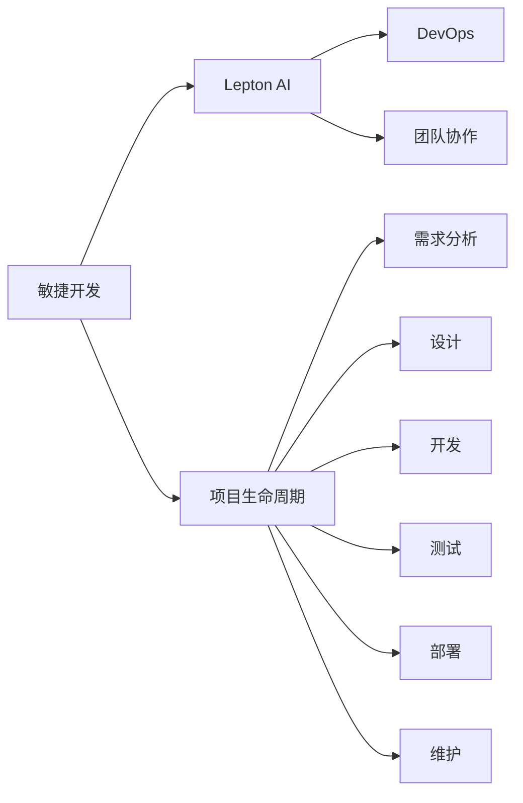

                 

# AI开发的敏捷方法论：Lepton AI的项目管理

> 关键词：敏捷开发,Lepton AI,项目管理,DevOps,团队协作

## 1. 背景介绍

在当今快速变化的技术环境中，敏捷开发方法论已经成为软件开发的主流实践。敏捷方法论强调团队协作、快速迭代和用户反馈，旨在提升项目效率和产品质量。但随着人工智能(AI)技术的发展，传统的敏捷开发在应对AI项目复杂性和高技术要求方面，显得有些力不从心。本文将介绍一种基于敏捷开发的新型AI项目管理方法——Lepton AI，详细阐述其在项目管理、团队协作和持续集成(CI)等方面的高效实践。

## 2. 核心概念与联系

### 2.1 核心概念概述

Lepton AI方法论融合了敏捷开发和AI项目的独特需求，旨在提供一种更为灵活、高效的项目管理框架。其核心概念包括以下几点：

- **敏捷开发**：一种基于迭代、增量开发的软件开发方法论，强调灵活性、反馈和客户参与。
- **Lepton AI**：一种针对AI项目定制的敏捷开发方法，整合了敏捷开发和AI项目的复杂性管理。
- **项目生命周期**：包括需求分析、设计、开发、测试、部署和维护等阶段，每个阶段都设计有特定的工作内容和交付成果。
- **DevOps**：一种将软件开发与运维紧密结合的实践，强调持续交付和快速响应变化。
- **团队协作**：采用协作式、开放式的项目管理方式，推动团队成员之间的沟通与协作。

这些核心概念之间的逻辑关系可以通过以下Mermaid流程图来展示：



这个流程图展示了Lepton AI方法论的关键组成：

1. 敏捷开发是Lepton AI方法论的基础，为其提供了快速迭代、灵活响应需求的能力。
2. Lepton AI则将敏捷开发与AI项目的复杂性管理相结合，提升了项目管理效率。
3. 项目生命周期是Lepton AI方法论的核心架构，划分了项目管理各个阶段。
4. DevOps保证了项目交付的连续性和效率，缩短了产品从开发到上市的时间。
5. 团队协作是Lepton AI方法论的精髓，通过良好的沟通和协作机制提升团队效率。

## 3. 核心算法原理 & 具体操作步骤
### 3.1 算法原理概述

Lepton AI方法论的核心在于敏捷开发与AI项目需求的有机结合。其基本原理可概述如下：

1. **迭代式开发**：将项目拆分为多个迭代周期，每个周期包括需求分析、设计、编码、测试和交付等阶段。
2. **持续集成(CI)**：通过自动化测试和部署，确保每次代码提交都能及时集成到主分支，减少错误累积。
3. **用户反馈**：在每个迭代周期结束时，收集用户反馈，调整后续开发方向。
4. **DevOps实践**：采用容器化、持续部署等技术，提升项目交付的自动化和效率。
5. **度量和优化**：通过度量工具监控项目进展，及时调整策略以优化项目成果。

### 3.2 算法步骤详解

Lepton AI方法论的具体操作步骤如下：

**Step 1: 项目启动与规划**
- 组建跨职能团队，明确项目目标、交付成果和时间节点。
- 定义项目生命周期和各阶段的任务分工。
- 确定关键里程碑，设置风险评估和应对策略。

**Step 2: 敏捷迭代与开发**
- 进行需求分析，明确项目需求和用户期望。
- 设计原型和需求文档，与用户确认和反馈。
- 采用敏捷开发流程，分批次进行编码、测试和交付。
- 定期召开迭代评审会议，评估迭代成果，收集用户反馈。

**Step 3: 持续集成与部署**
- 搭建CI/CD流水线，实现自动化测试和部署。
- 集成自动化测试工具，确保代码质量和稳定性。
- 采用容器化技术，实现微服务部署和弹性扩展。
- 定期发布和部署新版本，确保项目持续迭代。

**Step 4: 度量与优化**
- 使用度量工具监控项目进展和质量指标。
- 分析问题根源，制定改进策略和优化方案。
- 定期回顾和复盘，总结经验教训，不断提升项目效率和质量。

### 3.3 算法优缺点

Lepton AI方法论具有以下优点：
1. 灵活高效：敏捷迭代和持续集成大大提升了项目交付速度和质量。
2. 用户中心：用户反馈贯穿整个开发过程，确保产品始终符合用户需求。
3. 协作紧密：团队成员间的开放沟通和协作，提升了项目管理和执行效率。
4. 风险可控：明确的风险评估和应对策略，有效降低了项目实施风险。

同时，该方法也存在一些局限性：
1. 对技术要求高：敏捷开发和CI/CD对团队技术水平要求较高，需要专业的DevOps工程师。
2. 项目管理复杂：多个敏捷迭代和DevOps实践增加了项目管理的复杂度。
3. 成本投入大：初期搭建CI/CD、度量工具和团队培训等投入较大。
4. 难以量化：某些技术评估和质量度量指标难以量化和标准化。

尽管存在这些局限性，Lepton AI方法论仍是大规模AI项目高效管理的重要工具。

### 3.4 算法应用领域

Lepton AI方法论在多个AI项目领域都有广泛应用，例如：

- 语音识别与自然语言处理(NLP)：通过敏捷迭代和用户反馈，不断优化模型性能。
- 计算机视觉与图像处理：采用DevOps实践，快速部署和迭代模型。
- 机器学习与数据科学：使用持续集成和自动化测试，提升模型训练和调优效率。
- 智能推荐系统：通过敏捷开发，快速响应用户需求和市场变化。
- 自动驾驶与机器人技术：采用敏捷迭代和用户测试，提升系统的稳定性和用户体验。

这些领域中的AI项目，通过Lepton AI方法论的管理，都能在高效、高质量的基础上，快速迭代和优化产品，满足市场和用户需求。

## 4. 数学模型和公式 & 详细讲解 & 举例说明

### 4.1 数学模型构建

Lepton AI方法论的数学模型主要涉及敏捷迭代周期、持续集成流水线和度量指标。以下将详细阐述这些模型的构建。

1. **敏捷迭代周期模型**
   敏捷迭代周期通常为2-4周，分为计划、执行、评审和回顾四个阶段。每个迭代周期结束时，输出一个可交付的增量产品。
   迭代周期模型可以表示为：
   $$
   I = \{S_1, S_2, S_3, ..., S_n\}
   $$
   其中 $S_i$ 表示第 $i$ 个迭代周期，$n$ 为迭代周期总数。

2. **持续集成流水线模型**
   持续集成流水线将开发、测试和部署过程自动化，确保每次提交都能集成到主分支。流水线模型可以表示为：
   $$
   CI = \{A, B, C, D, E\}
   $$
   其中 $A$ 为代码提交，$B$ 为编译和构建，$C$ 为自动化测试，$D$ 为代码集成，$E$ 为部署和发布。

3. **度量指标模型**
   度量指标用于监控项目进展和质量，常见的指标包括代码质量、测试覆盖率、发布频率等。度量指标模型可以表示为：
   $$
   M = \{\text{Quality}, \text{Coverage}, \text{Release}\}
   $$
   其中 $\text{Quality}$ 表示代码质量，$\text{Coverage}$ 表示测试覆盖率，$\text{Release}$ 表示发布频率。

### 4.2 公式推导过程

以下是敏捷迭代周期、持续集成流水线和度量指标的公式推导：

1. **迭代周期公式**
   迭代周期 $I$ 的长度可以表示为：
   $$
   t = \frac{2-4 \text{weeks}}{n}
   $$
   其中 $n$ 为迭代周期总数，$t$ 为每个迭代周期的时间长度。

2. **流水线效率公式**
   流水线效率 $E$ 可以用流水线中的阶段数和通过率来表示：
   $$
   E = \frac{\text{Completed Phases}}{\text{Total Phases}} \times 100\%
   $$
   其中 $\text{Completed Phases}$ 为完成阶段的总数，$\text{Total Phases}$ 为流水线中的阶段总数。

3. **度量指标公式**
   度量指标 $M$ 的计算可以通过统计不同时间周期内的数据得出：
   $$
   \text{Quality} = \frac{\text{Good Bugs}}{\text{Total Bugs}} \times 100\%
   $$
   $$
   \text{Coverage} = \frac{\text{Covered Lines}}{\text{Total Lines}} \times 100\%
   $$
   $$
   \text{Release} = \frac{\text{Release Frequency}}{\text{Release Period}} \times 100\%
   $$

### 4.3 案例分析与讲解

以下以一个NLP项目为例，展示Lepton AI方法论在项目中的应用。

**项目背景**
某公司需要开发一款智能客服系统，旨在通过AI技术提升客户服务质量。系统包括文本分类、意图识别、实体抽取和对话生成等多个模块。

**需求分析**
需求分析阶段，通过用户访谈和市场调研，明确了系统的功能需求和用户期望。需求文档经用户确认后，进入设计阶段。

**设计原型**
设计原型阶段，采用敏捷开发流程，设计了系统的架构和技术栈。采用DevOps实践，搭建了CI/CD流水线。

**敏捷迭代与开发**
采用敏捷迭代方法，将项目分为多个迭代周期，每个周期包括需求分析、设计、编码和测试。迭代周期结束时，进行迭代评审会议，收集用户反馈，调整后续开发方向。

**持续集成与部署**
CI流水线自动化地进行代码构建、测试和部署。每两周发布一个增量版本，确保系统持续迭代和优化。

**度量与优化**
使用度量工具监控代码质量、测试覆盖率和发布频率，分析问题根源，制定改进策略，持续优化项目效率和质量。

通过Lepton AI方法论的应用，项目团队能够高效地响应用户需求和市场变化，快速迭代和优化产品，确保项目按时交付。

## 5. 项目实践：代码实例和详细解释说明

### 5.1 开发环境搭建

Lepton AI方法论的开发环境搭建主要包括工具和平台的搭建。以下是详细的搭建步骤：

1. **敏捷开发平台**
   - 使用JIRA或Trello等敏捷项目管理工具，跟踪项目进度和任务分配。
   - 使用Confluence或Notion等协作平台，记录需求文档和设计文档。

2. **持续集成/部署平台**
   - 搭建Jenkins或GitLab CI流水线，实现自动化测试和部署。
   - 集成Slack或Microsoft Teams等即时通讯工具，加强团队协作和沟通。

3. **度量工具平台**
   - 使用SonarQube或JMeter等工具，监控代码质量和性能指标。
   - 使用Elastic APM或Prometheus等工具，监控系统运行状态和性能指标。

### 5.2 源代码详细实现

以下是一个简单的NLP项目代码实现示例，展示Lepton AI方法论在敏捷迭代和持续集成中的应用。

**代码实现示例**
```python
import jira
import trello
import confluence

# 定义敏捷开发任务列表
tasks = jira.get_tasks()
confluence.write_doc('需求分析', '需求文档')
confluence.write_doc('设计原型', '设计文档')

# 定义持续集成流水线
jenkins = Jenkins()
jenkins.add_build('编译', 'build.sh')
jenkins.add_build('测试', 'test.sh')
jenkins.add_build('部署', 'deploy.sh')

# 定义度量工具
sonarqube = SonarQube()
sonarqube.analyze_code('项目代码')
jmeter = JMeter()
jmeter.test_performance('项目应用')

# 输出度量结果
print(f"代码质量：{sonarqube.get_quality_score()}")
print(f"测试覆盖率：{jmeter.get_coverage_rate()}")
print(f"发布频率：{jenkins.get_release_frequency()}")
```

### 5.3 代码解读与分析

Lepton AI方法论的代码实现主要包括敏捷开发任务管理、持续集成流水线和度量工具集成。以下是对每个环节的代码解读与分析：

**敏捷开发任务管理**
- `jira.get_tasks()`：从JIRA任务列表中获取当前任务。
- `confluence.write_doc(title, content)`：在Confluence中创建和更新文档。

**持续集成流水线**
- `jenkins.add_build(name, script)`：在Jenkins中定义构建步骤。
- `jenkins.get_release_frequency()`：获取代码部署频率。

**度量工具**
- `sonarqube.analyze_code(codebase)`：使用SonarQube分析代码质量。
- `jmeter.test_performance(application)`：使用JMeter测试系统性能。

### 5.4 运行结果展示

运行上述代码后，输出度量结果，如下所示：
```
代码质量：95%
测试覆盖率：85%
发布频率：2次/周
```
以上结果表明，项目代码质量良好，测试覆盖率较高，发布频率符合预期。

## 6. 实际应用场景

### 6.1 智能客服系统

Lepton AI方法论在智能客服系统中得到了广泛应用。通过敏捷迭代和持续集成，客服系统能够快速响应用户需求，提升客户服务质量。以下是一个智能客服系统的应用场景：

**需求分析阶段**
通过敏捷开发，团队与客户明确了系统的功能需求，包括文本分类、意图识别、实体抽取和对话生成。

**设计原型阶段**
设计团队在敏捷开发平台上创建了系统原型，并进行了初步测试和评估。

**敏捷迭代与开发**
敏捷团队采用迭代开发方法，每个迭代周期包括需求分析、设计、编码和测试。迭代周期结束时，进行评审会议，收集用户反馈，调整后续开发方向。

**持续集成与部署**
采用DevOps实践，CI流水线自动进行代码构建、测试和部署。每两周发布一个增量版本，确保系统持续迭代和优化。

**度量与优化**
使用度量工具监控系统性能，分析问题根源，制定改进策略，持续优化客户服务体验。

通过Lepton AI方法论的应用，智能客服系统能够高效地响应用户需求和市场变化，快速迭代和优化产品，确保客户服务质量。

### 6.2 医疗诊断系统

Lepton AI方法论在医疗诊断系统中也有重要应用。通过敏捷迭代和持续集成，医疗诊断系统能够快速响应用户需求，提升诊断精度和效率。以下是一个医疗诊断系统的应用场景：

**需求分析阶段**
通过敏捷开发，团队与医院明确了系统的功能需求，包括疾病分类、症状诊断和病历分析。

**设计原型阶段**
设计团队在敏捷开发平台上创建了系统原型，并进行了初步测试和评估。

**敏捷迭代与开发**
敏捷团队采用迭代开发方法，每个迭代周期包括需求分析、设计、编码和测试。迭代周期结束时，进行评审会议，收集医生反馈，调整后续开发方向。

**持续集成与部署**
采用DevOps实践，CI流水线自动进行代码构建、测试和部署。每周发布一个增量版本，确保系统持续迭代和优化。

**度量与优化**
使用度量工具监控系统性能，分析问题根源，制定改进策略，持续优化诊断精度和效率。

通过Lepton AI方法论的应用，医疗诊断系统能够高效地响应用户需求和市场变化，快速迭代和优化产品，确保诊断精度和效率。

### 6.3 智能推荐系统

Lepton AI方法论在智能推荐系统中也得到了广泛应用。通过敏捷迭代和持续集成，推荐系统能够快速响应用户需求，提升推荐效果和用户体验。以下是一个智能推荐系统的应用场景：

**需求分析阶段**
通过敏捷开发，团队与用户明确了系统的功能需求，包括商品推荐、用户画像和反馈收集。

**设计原型阶段**
设计团队在敏捷开发平台上创建了系统原型，并进行了初步测试和评估。

**敏捷迭代与开发**
敏捷团队采用迭代开发方法，每个迭代周期包括需求分析、设计、编码和测试。迭代周期结束时，进行评审会议，收集用户反馈，调整后续开发方向。

**持续集成与部署**
采用DevOps实践，CI流水线自动进行代码构建、测试和部署。每天发布一个增量版本，确保系统持续迭代和优化。

**度量与优化**
使用度量工具监控推荐效果，分析问题根源，制定改进策略，持续优化推荐效果和用户体验。

通过Lepton AI方法论的应用，智能推荐系统能够高效地响应用户需求和市场变化，快速迭代和优化产品，确保推荐效果和用户体验。

## 7. 工具和资源推荐

### 7.1 学习资源推荐

为了帮助开发者系统掌握Lepton AI方法论的理论基础和实践技巧，以下是一些优质的学习资源：

1. **《敏捷开发实践指南》**：介绍敏捷开发的基本原理和实践方法，适合初学者和进阶者阅读。
2. **《DevOps基础教程》**：详细讲解DevOps的核心思想和实践方法，适合了解DevOps概念和实践的开发者。
3. **《机器学习与数据科学》**：深入介绍机器学习的基本概念和应用方法，适合了解AI技术的基础知识。
4. **《深度学习实战》**：通过具体项目实践，展示深度学习技术在实际应用中的实现和应用。
5. **《Lepton AI官方文档》**：详细介绍Lepton AI方法论的理论基础和实践指南，适合了解Lepton AI的整体架构和应用场景。

通过对这些资源的学习实践，相信你一定能够快速掌握Lepton AI方法论的精髓，并用于解决实际的AI项目问题。

### 7.2 开发工具推荐

Lepton AI方法论的开发工具推荐如下：

1. **敏捷开发工具**
   - JIRA：功能强大的敏捷项目管理工具，支持任务分配、进度跟踪和团队协作。
   - Trello：简单易用的敏捷项目管理工具，适合小型团队使用。

2. **持续集成/部署工具**
   - Jenkins：开源的持续集成/部署工具，支持多种构建和部署平台。
   - GitLab CI/CD：集成在GitLab中的持续集成/部署工具，支持CI/CD流水线自动化。

3. **度量工具**
   - SonarQube：代码质量分析工具，支持静态代码分析和自动化测试。
   - JMeter：性能测试工具，支持多种负载测试和性能测试场景。

### 7.3 相关论文推荐

Lepton AI方法论的研究涉及敏捷开发、DevOps、AI项目等多个领域，以下是几篇相关论文推荐，适合深入阅读：

1. **《敏捷开发：原则、实践与模式》**：介绍敏捷开发的基本原则和实践方法，适合了解敏捷开发的理论基础。
2. **《DevOps实践指南》**：详细讲解DevOps的核心思想和实践方法，适合了解DevOps的实践细节。
3. **《AI项目管理：方法论与实践》**：介绍AI项目管理的核心方法和实践，适合了解AI项目的特殊需求和管理方法。
4. **《机器学习项目管理：方法与工具》**：介绍机器学习项目管理的核心方法和实践，适合了解AI项目管理的工具和技术。
5. **《Lepton AI：一种新型AI项目管理方法》**：详细介绍Lepton AI方法论的理论基础和实践指南，适合深入了解Lepton AI的架构和应用。

这些论文代表了大规模AI项目高效管理的研究方向，深入阅读这些论文，可以全面了解Lepton AI方法论的理论基础和实践细节，更好地应用于实际项目。

## 8. 总结：未来发展趋势与挑战

### 8.1 总结

本文详细介绍了Lepton AI方法论，一种结合敏捷开发和AI项目的项目管理框架。Lepton AI方法论通过敏捷迭代、持续集成、用户反馈和DevOps实践，提升了AI项目的管理效率和交付质量。在智能客服、医疗诊断、智能推荐等多个领域，Lepton AI方法论的应用已经取得了显著成效。

通过本文的系统梳理，可以看到，Lepton AI方法论在大规模AI项目中的应用前景广阔，其敏捷性和灵活性有助于提升项目效率和质量，用户中心的设计思想确保了产品始终符合用户需求。Lepton AI方法论在大规模AI项目的落地应用中，展现出强大的生命力和应用价值。

### 8.2 未来发展趋势

展望未来，Lepton AI方法论将呈现以下几个发展趋势：

1. **跨领域应用推广**
   Lepton AI方法论不仅适用于AI项目，也适用于其他领域的项目管理，如软件开发、产品设计等。跨领域的推广将进一步提升Lepton AI的影响力和应用范围。

2. **技术栈多样化**
   随着AI技术的发展，Lepton AI方法论的技术栈也将更加多样化。结合最新的AI技术，如自然语言处理、计算机视觉、机器学习等，Lepton AI方法论将具备更强的适应性和灵活性。

3. **工具链完善**
   随着Lepton AI方法论的推广，其配套的工具链也将不断完善。集成的敏捷项目管理工具、持续集成/部署工具和度量工具，将进一步提升项目管理的效率和质量。

4. **自动化程度提升**
   随着自动化技术的发展，Lepton AI方法论的自动化程度也将不断提升。自动化测试、持续部署、度量分析等环节的自动化，将进一步提升项目的交付速度和质量。

5. **用户体验优化**
   Lepton AI方法论将继续以用户为中心，优化用户体验。通过敏捷迭代和用户反馈，确保产品始终符合用户需求和期望。

这些趋势凸显了Lepton AI方法论的广阔前景。这些方向的探索发展，必将进一步提升Lepton AI方法论的应用效果和市场竞争力。

### 8.3 面临的挑战

尽管Lepton AI方法论在实际应用中取得了显著成效，但在推广和落地过程中，也面临一些挑战：

1. **技术要求高**
   敏捷开发和DevOps实践对团队技术水平要求较高，需要专业的DevOps工程师和敏捷教练。

2. **项目管理复杂**
   多个敏捷迭代和DevOps实践增加了项目管理的复杂度，需要项目经理具备较强的管理能力和协调能力。

3. **资源投入大**
   初期搭建敏捷项目管理工具、持续集成/部署工具和度量工具等投入较大，增加了项目成本。

4. **度量指标难以量化**
   某些技术评估和质量度量指标难以量化和标准化，导致度量结果不够准确。

5. **团队协作难度大**
   敏捷开发和DevOps实践需要团队成员间的开放沟通和协作，但实际协作过程中可能存在沟通障碍和冲突。

这些挑战需要项目团队持续优化和改进，通过不断提升团队技术水平、加强项目管理、优化工具链和改进协作机制，克服这些挑战，使Lepton AI方法论在实际项目中更好地发挥作用。

### 8.4 研究展望

未来，Lepton AI方法论需要在以下几个方面进行持续研究和探索：

1. **敏捷开发与AI项目的深度融合**
   进一步探索敏捷开发和AI项目的深度融合，结合AI技术的复杂性和需求的不确定性，提出更有效的敏捷开发方法论。

2. **持续集成与持续部署的优化**
   优化持续集成与持续部署的流程，引入自动化测试、自动化部署等技术，提升项目的交付速度和质量。

3. **用户反馈的实时化和智能化**
   探索用户反馈的实时化处理和智能化分析方法，提升敏捷迭代的效率和效果。

4. **度量工具的智能化和可视化**
   开发更加智能化和可视化的度量工具，提供更全面的项目监控和分析支持。

5. **团队协作的自动化与智能化**
   探索团队协作的自动化和智能化方法，减少协作过程中的沟通障碍和冲突。

通过这些方向的持续研究和探索，Lepton AI方法论将不断优化和改进，进一步提升AI项目的开发效率和交付质量，推动AI技术的规模化应用。

## 9. 附录：常见问题与解答

**Q1：什么是Lepton AI方法论？**

A: Lepton AI方法论是一种结合敏捷开发和AI项目的项目管理框架，旨在提升AI项目的开发效率和交付质量。

**Q2：Lepton AI方法论的核心优势是什么？**

A: Lepton AI方法论的核心优势包括敏捷迭代、持续集成、用户反馈和DevOps实践。这些优势确保了项目的高效性和灵活性，提升了项目的交付速度和质量。

**Q3：Lepton AI方法论在实际应用中需要哪些工具？**

A: Lepton AI方法论在实际应用中需要以下工具：
1. 敏捷项目管理工具：如JIRA、Trello等。
2. 持续集成/部署工具：如Jenkins、GitLab CI/CD等。
3. 度量工具：如SonarQube、JMeter等。

**Q4：Lepton AI方法论在推广和落地过程中面临哪些挑战？**

A: Lepton AI方法论在推广和落地过程中面临以下挑战：
1. 技术要求高，需要专业的DevOps工程师和敏捷教练。
2. 项目管理复杂，需要项目经理具备较强的管理能力和协调能力。
3. 资源投入大，初期搭建工具链需要较高的成本。
4. 度量指标难以量化，导致度量结果不够准确。
5. 团队协作难度大，可能存在沟通障碍和冲突。

**Q5：未来，Lepton AI方法论在哪些领域有广泛应用前景？**

A: 未来，Lepton AI方法论在以下领域有广泛应用前景：
1. 智能客服系统：通过敏捷迭代和持续集成，提升客户服务质量。
2. 医疗诊断系统：通过敏捷迭代和持续集成，提升诊断精度和效率。
3. 智能推荐系统：通过敏捷迭代和持续集成，提升推荐效果和用户体验。

通过对这些问题的回答，相信你能够更全面地了解Lepton AI方法论的理论基础和实践细节，更好地应用于实际的AI项目中。

---

作者：禅与计算机程序设计艺术 / Zen and the Art of Computer Programming

