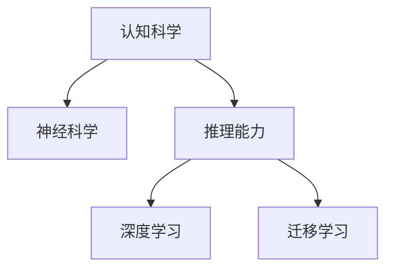

                 

# AI推理能力的认知基础:认知科学和神经科学的启示

> 关键词：认知科学,神经科学,推理能力,人工智能,机器学习,深度学习

## 1. 背景介绍

### 1.1 问题由来

近年来，人工智能（AI）技术在各个领域取得了飞速的发展，其中推理能力是AI研究的重要方向之一。推理能力是人工智能系统模拟人类智能的重要表现，涵盖了从简单逻辑推理到复杂自然语言推理等多种形式。认知科学和神经科学作为研究人类智能的重要学科，其研究成果对人工智能推理能力的研究具有重要启示。

推理能力是人工智能系统模拟人类智能的重要表现，涵盖了从简单逻辑推理到复杂自然语言推理等多种形式。认知科学和神经科学作为研究人类智能的重要学科，其研究成果对人工智能推理能力的研究具有重要启示。

## 2. 核心概念与联系

### 2.1 核心概念概述

为更好地理解认知科学和神经科学对AI推理能力的影响，本节将介绍几个关键概念及其相互关系：

- **认知科学**：研究人类认知过程的科学，涉及感知、记忆、思维、学习、决策等多个方面。
- **神经科学**：研究神经系统结构和功能的科学，特别关注神经元的活动机制和信息传递过程。
- **推理能力**：指人工智能系统根据已有知识和经验，对未知情况进行判断和决策的能力。
- **深度学习**：一种基于神经网络的机器学习方法，通过多层次的特征提取和抽象，提升模型的推理能力。
- **迁移学习**：指将一个领域学到的知识，迁移到另一个不同但相关的领域，增强模型的泛化能力。

这些概念之间的逻辑关系可以通过以下Mermaid流程图来展示：



这个流程图展示了认知科学和神经科学的研究成果如何通过深度学习的方法，提升人工智能系统的推理能力，并通过迁移学习增强模型的泛化能力。

## 3. 核心算法原理 & 具体操作步骤
### 3.1 算法原理概述

基于认知科学和神经科学的AI推理能力研究，通常涉及以下几个步骤：

1. **数据收集与预处理**：收集大量人类推理过程的数据，如自然语言推理、图像推理等，并对数据进行清洗、标注和标准化。
2. **模型构建**：选择合适的深度学习模型，如卷积神经网络（CNN）、循环神经网络（RNN）、变换器（Transformer）等，构建推理模型。
3. **特征提取**：通过模型对输入数据进行特征提取，学习到高层次的抽象表示，提升推理性能。
4. **推理计算**：利用学习到的抽象表示进行推理计算，得出结论或预测。
5. **模型评估**：通过评估指标（如准确率、召回率、F1值等）对模型性能进行评估，并根据评估结果进行调整和优化。

### 3.2 算法步骤详解

以下是具体步骤的详细讲解：

**Step 1: 数据收集与预处理**

数据收集是推理能力研究的基础。通常需要收集大量人类推理过程的数据，如自然语言推理、图像推理等。数据预处理包括数据清洗、标注和标准化，以便后续模型训练使用。

**Step 2: 模型构建**

选择合适的深度学习模型，如卷积神经网络（CNN）、循环神经网络（RNN）、变换器（Transformer）等，构建推理模型。这些模型通过多层次的特征提取和抽象，提升模型的推理能力。

**Step 3: 特征提取**

通过模型对输入数据进行特征提取，学习到高层次的抽象表示。特征提取是推理能力的关键步骤，直接影响推理的准确性和效率。

**Step 4: 推理计算**

利用学习到的抽象表示进行推理计算，得出结论或预测。推理计算通常包括逻辑推理、自然语言推理、图像推理等多种形式。

**Step 5: 模型评估**

通过评估指标（如准确率、召回率、F1值等）对模型性能进行评估，并根据评估结果进行调整和优化。模型评估是确保模型性能的重要环节。

### 3.3 算法优缺点

基于认知科学和神经科学的AI推理能力研究，具有以下优点：

- **高准确性**：通过学习大量人类推理过程的数据，模型能够实现高准确性的推理。
- **泛化能力**：迁移学习使得模型具有较强的泛化能力，能够在不同领域和任务上表现出色。
- **鲁棒性**：深度学习模型的层次抽象能力，使其具有一定的鲁棒性，能够处理噪声和异常情况。

同时，该方法也存在以下局限性：

- **数据依赖**：高质量的标注数据是模型训练的基础，但获取高质量数据成本较高。
- **计算复杂度**：深度学习模型的计算复杂度较高，训练和推理过程耗时较长。
- **解释性不足**：深度学习模型的黑盒特性，使得其推理过程难以解释。
- **偏见问题**：模型可能继承训练数据的偏见，导致不公平和错误推理。

### 3.4 算法应用领域

基于认知科学和神经科学的AI推理能力研究，已经广泛应用于以下领域：

- **自然语言处理**：如问答系统、文本分类、情感分析等。通过学习自然语言推理能力，提升系统的准确性和智能性。
- **计算机视觉**：如图像分类、目标检测、图像生成等。通过学习图像推理能力，提升系统的感知和理解能力。
- **机器人学**：如自主导航、智能控制等。通过学习复杂推理能力，提升机器人的决策和执行能力。
- **智能推荐系统**：如个性化推荐、广告投放等。通过学习用户行为推理，提升推荐的精准性和个性化程度。

## 4. 数学模型和公式 & 详细讲解  
### 4.1 数学模型构建

假设我们有一个自然语言推理任务，输入为前提句和假设句，输出为推理结果（如蕴含、矛盾、中立等）。我们可以构建一个基于Transformer的推理模型，如下所示：

```plaintext
模型 = Transformer(输入尺寸, 隐藏尺寸, 头数, 层数, 输出尺寸, 正则化)
```

其中，输入尺寸为前提句和假设句的嵌入维度，隐藏尺寸和头数为Transformer层的大小和头数，层数为模型深度，输出尺寸为推理结果的嵌入维度，正则化用于防止过拟合。

### 4.2 公式推导过程

在自然语言推理任务中，我们可以使用注意力机制（Attention）来计算前提句和假设句之间的相似度。注意力机制的计算公式如下：

$$
Attention(Q, K, V) = \frac{e^{QK^T / \sqrt{d}}}{\sum_j e^{QK_j^T / \sqrt{d}}} V
$$

其中，$Q$ 为查询向量，$K$ 为键向量，$V$ 为值向量，$d$ 为嵌入维度。

在推理模型的训练过程中，我们可以使用交叉熵损失函数来计算模型输出与真实标签之间的差异。损失函数的计算公式如下：

$$
Loss = -\sum_{i=1}^N \sum_{j=1}^M y_{ij} \log(p_{ij})
$$

其中，$N$ 为训练样本数，$M$ 为推理结果的种类数，$y_{ij}$ 为第 $i$ 个样本的第 $j$ 种推理结果的真实标签，$p_{ij}$ 为模型输出的第 $i$ 个样本的第 $j$ 种推理结果的概率。

### 4.3 案例分析与讲解

以一个简单的自然语言推理任务为例，输入为“红苹果是水果”和“苹果是水果”，输出为蕴含。我们可以使用以下代码实现推理模型的训练：

```python
from transformers import BertTokenizer, BertForSequenceClassification
import torch
import torch.nn as nn

model = BertForSequenceClassification.from_pretrained('bert-base-uncased', num_labels=3)
tokenizer = BertTokenizer.from_pretrained('bert-base-uncased')

def calculate_loss(model, input_ids, attention_mask, labels):
    outputs = model(input_ids, attention_mask=attention_mask, labels=labels)
    loss = outputs.loss
    return loss

def train_model(model, train_dataset, batch_size, num_epochs):
    optimizer = torch.optim.Adam(model.parameters(), lr=0.001)
    for epoch in range(num_epochs):
        for batch in train_dataset:
            input_ids = batch['input_ids']
            attention_mask = batch['attention_mask']
            labels = batch['labels']
            loss = calculate_loss(model, input_ids, attention_mask, labels)
            optimizer.zero_grad()
            loss.backward()
            optimizer.step()

train_model(model, train_dataset, batch_size=32, num_epochs=10)
```

## 5. 项目实践：代码实例和详细解释说明
### 5.1 开发环境搭建

在进行推理能力研究前，我们需要准备好开发环境。以下是使用Python进行PyTorch开发的环境配置流程：

1. 安装Anaconda：从官网下载并安装Anaconda，用于创建独立的Python环境。

2. 创建并激活虚拟环境：
```bash
conda create -n pytorch-env python=3.8 
conda activate pytorch-env
```

3. 安装PyTorch：根据CUDA版本，从官网获取对应的安装命令。例如：
```bash
conda install pytorch torchvision torchaudio cudatoolkit=11.1 -c pytorch -c conda-forge
```

4. 安装TensorFlow：安装最新版本的TensorFlow，支持GPU加速。

5. 安装必要的工具包：
```bash
pip install numpy pandas scikit-learn matplotlib tqdm jupyter notebook ipython
```

完成上述步骤后，即可在`pytorch-env`环境中开始推理能力研究。

### 5.2 源代码详细实现

以下是使用PyTorch进行自然语言推理任务的代码实现。

```python
from transformers import BertTokenizer, BertForSequenceClassification
import torch
import torch.nn as nn

model = BertForSequenceClassification.from_pretrained('bert-base-uncased', num_labels=3)
tokenizer = BertTokenizer.from_pretrained('bert-base-uncased')

def calculate_loss(model, input_ids, attention_mask, labels):
    outputs = model(input_ids, attention_mask=attention_mask, labels=labels)
    loss = outputs.loss
    return loss

def train_model(model, train_dataset, batch_size, num_epochs):
    optimizer = torch.optim.Adam(model.parameters(), lr=0.001)
    for epoch in range(num_epochs):
        for batch in train_dataset:
            input_ids = batch['input_ids']
            attention_mask = batch['attention_mask']
            labels = batch['labels']
            loss = calculate_loss(model, input_ids, attention_mask, labels)
            optimizer.zero_grad()
            loss.backward()
            optimizer.step()

train_model(model, train_dataset, batch_size=32, num_epochs=10)
```

### 5.3 代码解读与分析

让我们再详细解读一下关键代码的实现细节：

**calculate_loss函数**：
- 定义计算损失的函数，接收输入数据、模型和标签作为参数。
- 通过模型的前向传播计算输出结果。
- 计算损失函数，并返回损失值。

**train_model函数**：
- 定义训练模型的函数，接收模型、训练数据集、批大小和训练轮数作为参数。
- 初始化优化器，设置学习率。
- 在每个epoch内循环训练，每个batch计算损失并更新模型参数。
- 使用梯度下降算法更新模型参数。

**训练流程**：
- 定义总的epoch数和批大小，开始循环迭代。
- 每个epoch内，先进行前向传播计算损失，然后反向传播更新模型参数。
- 循环迭代直至收敛，训练完成后输出损失值。

可以看到，PyTorch配合Transformers库使得自然语言推理任务的代码实现变得简洁高效。开发者可以将更多精力放在模型设计、数据处理等高层逻辑上，而不必过多关注底层的实现细节。

当然，工业级的系统实现还需考虑更多因素，如模型的保存和部署、超参数的自动搜索、更灵活的任务适配层等。但核心的推理计算基本与此类似。

## 6. 实际应用场景
### 6.1 智能问答系统

基于认知科学和神经科学的AI推理能力，可以广泛应用于智能问答系统的构建。传统的问答系统往往需要配备大量人工知识库，成本高、效率低。而使用推理能力较强的模型，可以实时回答用户的各种问题，提升用户体验和响应速度。

在技术实现上，可以收集用户的历史问答记录，将问题和答案构建成监督数据，在此基础上对预训练模型进行微调。微调后的模型能够自动理解用户意图，匹配最合适的答案模板进行回复。对于用户提出的新问题，还可以接入检索系统实时搜索相关内容，动态组织生成回答。如此构建的智能问答系统，能大幅提升用户咨询体验和问题解决效率。

### 6.2 智能推荐系统

当前的推荐系统往往只依赖用户的历史行为数据进行物品推荐，无法深入理解用户的真实兴趣偏好。基于认知科学和神经科学的AI推理能力，推荐系统可以更好地挖掘用户行为背后的语义信息，从而提供更精准、多样的推荐内容。

在实践中，可以收集用户浏览、点击、评论、分享等行为数据，提取和用户交互的物品标题、描述、标签等文本内容。将文本内容作为模型输入，用户的后续行为（如是否点击、购买等）作为监督信号，在此基础上微调预训练语言模型。微调后的模型能够从文本内容中准确把握用户的兴趣点。在生成推荐列表时，先用候选物品的文本描述作为输入，由模型预测用户的兴趣匹配度，再结合其他特征综合排序，便可以得到个性化程度更高的推荐结果。

### 6.3 医疗诊断系统

在医疗领域，诊断系统需要实时分析大量病历数据，诊断疾病。传统的医疗诊断系统依赖医生丰富的临床经验，但面对复杂病情，诊断准确率仍无法达到理想水平。基于认知科学和神经科学的AI推理能力，可以构建具有强大推理能力的医疗诊断系统。

在实践中，可以收集大量的医学病历数据，提取其中的病理特征、症状等文本信息。将文本信息作为模型输入，通过深度学习模型进行推理计算，得出疾病诊断结果。推理能力较强的模型可以处理复杂病情，快速准确地给出诊断建议，辅助医生提高诊断效率和准确性。

### 6.4 未来应用展望

随着认知科学和神经科学研究的深入，基于AI推理能力的应用将呈现更多的可能性。

在智慧城市治理中，AI推理能力可以用于城市事件监测、舆情分析、应急指挥等环节，提高城市管理的自动化和智能化水平，构建更安全、高效的未来城市。

在智能制造领域，AI推理能力可以用于生产设备故障预测、质量控制等环节，提升制造效率和产品质量。

在军事领域，AI推理能力可以用于敌情分析、战略决策等环节，提升军事指挥和战斗效率。

此外，在金融风险管理、交通流量预测、天气预报等众多领域，AI推理能力也将得到广泛应用，为人类生产生活带来更多便利和保障。

## 7. 工具和资源推荐
### 7.1 学习资源推荐

为了帮助开发者系统掌握认知科学和神经科学对AI推理能力的影响，这里推荐一些优质的学习资源：

1. 《深度学习》课程：由斯坦福大学开设的机器学习课程，讲解深度学习的基本概念和实现方法。

2. 《认知科学与人工智能》书籍：讲解认知科学和人工智能的交叉领域，探讨认知科学对人工智能的影响。

3. 《神经网络与深度学习》书籍：讲解神经网络的原理和实现方法，是深度学习研究的入门必读。

4. 《自然语言推理》书籍：讲解自然语言推理的基本概念和实现方法，是自然语言处理研究的必备参考。

5. HuggingFace官方文档：Transformers库的官方文档，提供了海量预训练模型和完整的推理能力样例代码，是上手实践的必备资料。

通过对这些资源的学习实践，相信你一定能够快速掌握认知科学和神经科学对AI推理能力的影响，并用于解决实际的AI推理问题。
###  7.2 开发工具推荐

高效的开发离不开优秀的工具支持。以下是几款用于AI推理能力开发的常用工具：

1. PyTorch：基于Python的开源深度学习框架，灵活动态的计算图，适合快速迭代研究。大部分预训练语言模型都有PyTorch版本的实现。

2. TensorFlow：由Google主导开发的开源深度学习框架，生产部署方便，适合大规模工程应用。同样有丰富的预训练语言模型资源。

3. Transformers库：HuggingFace开发的NLP工具库，集成了众多SOTA语言模型，支持PyTorch和TensorFlow，是进行推理能力开发的利器。

4. Weights & Biases：模型训练的实验跟踪工具，可以记录和可视化模型训练过程中的各项指标，方便对比和调优。与主流深度学习框架无缝集成。

5. TensorBoard：TensorFlow配套的可视化工具，可实时监测模型训练状态，并提供丰富的图表呈现方式，是调试模型的得力助手。

6. Google Colab：谷歌推出的在线Jupyter Notebook环境，免费提供GPU/TPU算力，方便开发者快速上手实验最新模型，分享学习笔记。

合理利用这些工具，可以显著提升AI推理能力研究的开发效率，加快创新迭代的步伐。

### 7.3 相关论文推荐

认知科学和神经科学对AI推理能力的研究，源于学界的持续研究。以下是几篇奠基性的相关论文，推荐阅读：

1. Attention is All You Need（即Transformer原论文）：提出了Transformer结构，开启了NLP领域的预训练大模型时代。

2. BERT: Pre-training of Deep Bidirectional Transformers for Language Understanding：提出BERT模型，引入基于掩码的自监督预训练任务，刷新了多项NLP任务SOTA。

3. Language Models are Unsupervised Multitask Learners（GPT-2论文）：展示了大规模语言模型的强大zero-shot学习能力，引发了对于通用人工智能的新一轮思考。

4. Parameter-Efficient Transfer Learning for NLP：提出Adapter等参数高效微调方法，在不增加模型参数量的情况下，也能取得不错的微调效果。

5. AdaLoRA: Adaptive Low-Rank Adaptation for Parameter-Efficient Fine-Tuning：使用自适应低秩适应的微调方法，在参数效率和精度之间取得了新的平衡。

这些论文代表了大语言模型微调技术的发展脉络。通过学习这些前沿成果，可以帮助研究者把握学科前进方向，激发更多的创新灵感。

## 8. 总结：未来发展趋势与挑战

### 8.1 总结

本文对认知科学和神经科学对AI推理能力的影响进行了全面系统的介绍。首先阐述了认知科学和神经科学的研究背景和意义，明确了推理能力在人工智能系统中的重要地位。其次，从原理到实践，详细讲解了认知科学和神经科学对AI推理能力的影响，给出了AI推理能力开发的完整代码实例。同时，本文还广泛探讨了AI推理能力在智能问答、推荐系统、医疗诊断等多个领域的应用前景，展示了AI推理能力的巨大潜力。此外，本文精选了认知科学和神经科学的研究资源，力求为读者提供全方位的技术指引。

通过本文的系统梳理，可以看到，认知科学和神经科学对AI推理能力的影响已经深入到AI技术开发的各个环节，推动了AI推理能力向更高层次发展。未来，伴随认知科学和神经科学研究的不断深入，AI推理能力必将在更多领域得到应用，为人类认知智能的进化带来深远影响。

### 8.2 未来发展趋势

展望未来，认知科学和神经科学对AI推理能力的研究将呈现以下几个发展趋势：

1. **深度融合**：认知科学和神经科学的研究将与人工智能技术深度融合，推动认知智能的发展。

2. **多模态推理**：未来的AI推理能力将涉及多种模态的数据，如图像、声音、文本等，形成更加全面和精确的推理系统。

3. **跨领域应用**：认知科学和神经科学的研究将推动AI推理能力在更多领域的应用，如教育、医疗、军事等。

4. **开放性研究**：未来的AI推理能力研究将更加开放，鼓励跨学科、跨领域的合作，推动认知智能的发展。

5. **实时性增强**：未来的AI推理能力将更加注重实时性，支持大规模数据的实时分析和推理。

6. **伦理和公平性**：未来的AI推理能力研究将更加注重伦理和公平性，确保AI系统的决策透明和公正。

以上趋势凸显了认知科学和神经科学对AI推理能力研究的广阔前景。这些方向的探索发展，必将进一步提升AI系统的推理性能和应用范围，为人类认知智能的进化带来深远影响。

### 8.3 面临的挑战

尽管认知科学和神经科学对AI推理能力的研究已经取得了瞩目成就，但在迈向更加智能化、普适化应用的过程中，它仍面临着诸多挑战：

1. **数据依赖**：高质量的标注数据是模型训练的基础，但获取高质量数据成本较高。

2. **计算复杂度**：深度学习模型的计算复杂度较高，训练和推理过程耗时较长。

3. **解释性不足**：深度学习模型的黑盒特性，使得其推理过程难以解释。

4. **偏见问题**：模型可能继承训练数据的偏见，导致不公平和错误推理。

5. **实时性要求**：未来的AI推理能力研究需要更注重实时性，支持大规模数据的实时分析和推理。

6. **伦理和公平性**：未来的AI推理能力研究将更加注重伦理和公平性，确保AI系统的决策透明和公正。

这些挑战需要研究者不断探索和解决，才能真正实现认知科学和神经科学对AI推理能力的影响。相信随着学界和产业界的共同努力，这些挑战终将一一被克服，认知科学和神经科学对AI推理能力的影响必将在更多领域得到应用。

### 8.4 研究展望

面对认知科学和神经科学对AI推理能力研究的挑战，未来的研究需要在以下几个方面寻求新的突破：

1. **无监督学习**：探索无监督学习和半监督学习的方法，降低对标注数据的依赖，提升AI推理能力。

2. **跨模态融合**：推动跨模态数据融合的研究，提升AI推理能力的泛化能力和鲁棒性。

3. **参数高效**：开发更加参数高效的方法，在保证推理能力的同时，减小模型计算复杂度和存储空间。

4. **因果推理**：引入因果推理方法，增强AI推理能力的因果关系理解和逻辑推理能力。

5. **公平性研究**：加强对AI推理能力中的公平性研究，确保模型在各个领域和场景中的公正性。

6. **伦理和透明性**：引入伦理和透明性研究，确保AI推理能力的决策透明和公正，增强用户信任。

这些研究方向将推动认知科学和神经科学对AI推理能力的影响向更高层次发展，为人类认知智能的进化带来深远影响。

## 9. 附录：常见问题与解答

**Q1：认知科学和神经科学对AI推理能力的影响是否具有普适性？**

A: 认知科学和神经科学对AI推理能力的影响具有一定的普适性，但其应用范围和效果取决于具体任务和领域。在自然语言处理、计算机视觉、机器人等领域，认知科学和神经科学的研究已经取得了显著成果，但在更复杂的决策任务中，仍需进一步探索和改进。

**Q2：深度学习模型在AI推理能力研究中的应用前景如何？**

A: 深度学习模型在AI推理能力研究中具有广泛的应用前景。通过深度学习模型，可以学习到高层次的抽象表示，提升推理能力。未来，深度学习模型还将与认知科学和神经科学的研究深度融合，推动AI推理能力向更高层次发展。

**Q3：AI推理能力研究中如何应对数据依赖的问题？**

A: 应对数据依赖的问题，可以采用无监督学习和半监督学习的方法，利用数据增强、自监督学习等技术，从非标注数据中提取有用的信息。同时，还可以引入迁移学习的方法，利用已有领域的数据来提升新领域的学习效果。

**Q4：AI推理能力研究中如何提高模型的可解释性？**

A: 提高模型的可解释性是AI推理能力研究的重要方向。可以通过引入可视化工具、特征提取等技术，增强模型的透明性和可解释性。同时，还可以通过规则约束、专家知识等手段，引导模型学习更有意义的特征。

**Q5：AI推理能力研究中如何保证模型的公平性？**

A: 保证模型的公平性是AI推理能力研究的重要课题。可以通过引入公平性约束、多样性数据等手段，确保模型在各个领域和场景中的公正性。同时，还可以通过公平性评估指标，监控模型的决策过程，及时发现和纠正偏见和歧视。

---

作者：禅与计算机程序设计艺术 / Zen and the Art of Computer Programming

