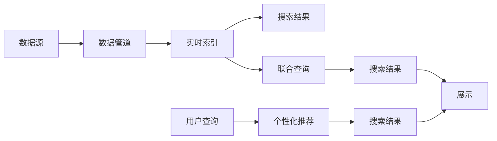

                 

# AI搜索引擎如何处理时效性信息

## 1. 背景介绍

搜索引擎一直是互联网时代信息获取的重要工具，它通过高效的算法将用户输入的查询转换为相关的搜索结果，极大地提升了信息检索的效率。但传统的搜索引擎算法，如PageRank、TF-IDF等，往往侧重于静态网页的文本匹配，对网页的时效性考虑不足。然而，在信息高速流动的今天，时效性信息的处理变得至关重要。

如何构建一个高效、精准的AI搜索引擎，以应对海量实时变化的信息，成为当下互联网技术研究的焦点。时效性信息的处理，不仅涉及信息的收集和存储，还涵盖数据清洗、检索算法、个性化推荐等多个环节。本文将从核心概念入手，深入探讨AI搜索引擎在处理时效性信息时的关键技术和应用。

## 2. 核心概念与联系

### 2.1 核心概念概述

为更好地理解AI搜索引擎的时效性处理，我们先简要介绍几个关键概念：

- **实时数据流**：指流媒体形式的动态数据，如新闻、博客、社交媒体等，不断实时更新。
- **时效性信息**：指在一定时间范围内具有高度相关性的信息，例如即时新闻、股票价格、气象信息等。
- **数据管道**：指从数据源到搜索引擎的输入管道，负责实时收集和传输数据。
- **实时索引**：指对实时数据进行动态更新，快速响应查询请求的索引系统。
- **个性化推荐**：指根据用户历史行为和偏好，提供个性化、精准的信息推荐。
- **搜索引擎联邦**：指多个搜索引擎或数据库通过联合查询、数据共享等方式，提升信息检索能力。

### 2.2 核心概念原理和架构的 Mermaid 流程图



此图展示了从数据源到搜索结果的完整流程，包括数据管道、实时索引、个性化推荐和联合查询等关键组件。下面，我们将逐一介绍这些组件的核心原理和架构。

## 3. 核心算法原理 & 具体操作步骤

### 3.1 算法原理概述

时效性信息处理的核心在于构建一个快速、准确的实时索引系统，对用户查询进行动态响应。搜索引擎的时效性处理算法主要包括以下几个步骤：

1. **数据采集**：从新闻网站、社交媒体、网页、API等多种数据源中采集实时数据。
2. **数据清洗**：去除无用数据，提取有用信息，如标题、摘要、时间戳等。
3. **实时索引**：对清洗后的数据进行动态更新和维护，快速响应查询请求。
4. **检索算法**：根据用户查询，匹配最相关的结果，排序并返回。
5. **个性化推荐**：结合用户历史行为，提供精准的个性化推荐。

### 3.2 算法步骤详解

以下是具体实现流程：

**Step 1: 数据采集**
- 使用Web爬虫、API接口、RSS订阅等方式，从新闻网站、社交媒体、网页、API等多种数据源中采集实时数据。
- 在爬虫过程中，可以引入缓存机制，避免重复抓取。
- 对于每个数据源，设置不同的抓取频率，根据重要性进行优先级排序。

**Step 2: 数据清洗**
- 对采集到的数据进行预处理，包括去除HTML标签、提取文本内容、去除停用词等。
- 提取有用的信息，如标题、摘要、时间戳等，供后续索引和检索使用。
- 使用正则表达式、NLP工具等，提取结构化信息，如日期、地点、人物等。

**Step 3: 实时索引**
- 使用倒排索引、倒排列表等数据结构，对清洗后的数据进行动态更新和维护。
- 采用多线程、分布式系统等方式，提升索引的效率和可靠性。
- 设置定时更新机制，定期更新索引数据，确保信息的时效性。

**Step 4: 检索算法**
- 根据用户查询，匹配最相关的结果，如TF-IDF、BM25等算法。
- 对匹配结果进行排序，如基于相关性、时间、权威度等多种排序策略。
- 引入机器学习模型，提升检索的准确性和个性化。

**Step 5: 个性化推荐**
- 结合用户的历史浏览记录、搜索行为、点击偏好等，建立用户画像。
- 使用协同过滤、基于内容的推荐算法等，提供个性化推荐。
- 引入深度学习模型，进一步提升推荐效果。

### 3.3 算法优缺点

时效性信息处理算法具有以下优点：
- 动态响应查询，满足用户对实时信息的获取需求。
- 自动更新索引，确保信息的时效性。
- 结合个性化推荐，提升用户体验。

但同时也存在一些缺点：
- 数据采集成本高，需要投入大量人力物力。
- 数据清洗复杂，需要处理多种数据格式和内容。
- 实时索引系统复杂，需要高可用性保障。
- 检索算法和推荐模型需要持续优化和维护。

尽管存在这些挑战，时效性信息处理算法仍是在线搜索应用的重要基础，是实现实时信息获取的关键技术。

### 3.4 算法应用领域

时效性信息处理算法广泛应用于多个领域，具体包括：

- **新闻和媒体**：实时采集新闻报道、博客文章、社交媒体内容等，快速响应新闻热点。
- **金融市场**：实时抓取股票、外汇、商品等数据，提供最新的市场动态。
- **天气和灾害预警**：实时监控气象数据，提供准确的天气和灾害预警信息。
- **电子商务**：实时推荐新产品、促销活动等，提升用户体验和销售转化率。
- **社交网络**：实时更新用户动态、帖子、评论等，提供个性化信息流。

## 4. 数学模型和公式 & 详细讲解 & 举例说明

### 4.1 数学模型构建

时效性信息处理的数学模型包括：

- **TF-IDF模型**：文本的词频-逆文档频率模型，用于评估文本的相关性。
- **BM25算法**：一种改进的倒排索引算法，用于提高检索准确性。
- **协同过滤算法**：基于用户行为的推荐算法，用于个性化推荐。

### 4.2 公式推导过程

以下公式介绍TF-IDF和BM25的核心计算方法：

**TF-IDF公式**：
$$TF(t,d) = \frac{n_t}{n_d} \qquad IDF(t,D) = \log \frac{N}{df_t}$$
其中，$TF(t,d)$表示词$t$在文档$d$中的词频，$IDF(t,D)$表示词$t$在所有文档$D$中的逆文档频率。

**BM25公式**：
$$BM25(q,D) = \frac{K_1 + 1}{K_1 + B} \times K_1 \times IDF_t \times TF_t \times (1 - b + b \times \frac{L_t}{avg_length}) \times (1 - M + M \times \frac{L_q}{avg_length})$$
其中，$q$表示用户查询，$D$表示文档集合，$K_1$、$B$、$b$、$M$为BM25参数，$IDF_t$表示词$t$的逆文档频率，$TF_t$表示词$t$在查询$q$中的词频，$L_t$表示文档$t$的长度，$avg_length$表示文档平均长度。

### 4.3 案例分析与讲解

下面以新闻推荐系统为例，具体讲解时效性信息处理的实际应用：

**数据采集**
- 使用Web爬虫定期抓取新闻网站（如CNN、BBC）的最新文章，获取标题、摘要、发布时间等关键信息。
- 将采集到的数据存储到分布式数据库中，如Hadoop、Spark等。

**数据清洗**
- 使用NLP工具提取文章中的结构化信息，如人名、地点、时间等。
- 去除HTML标签和停用词，提取有用的文本内容。

**实时索引**
- 使用倒排索引对清洗后的数据进行动态更新，确保索引的实时性。
- 定期进行数据更新，避免索引过时。

**检索算法**
- 根据用户查询，使用TF-IDF算法计算每篇文章的相关性得分。
- 将相关性得分和文章发布时间作为排序依据，返回最相关的新闻。

**个性化推荐**
- 结合用户历史浏览记录和点击偏好，使用协同过滤算法推荐相关新闻。
- 使用深度学习模型进一步优化推荐效果，如RNN、LSTM等。

## 5. 项目实践：代码实例和详细解释说明

### 5.1 开发环境搭建

为了实现一个高效、可靠的时效性信息处理系统，我们需要搭建一个多组件协同工作的开发环境：

1. **Web爬虫**：如Scrapy、BeautifulSoup等，用于实时抓取网页数据。
2. **数据清洗工具**：如NLTK、Spacy等，用于文本预处理。
3. **数据库**：如Hadoop、Spark、MySQL等，用于存储和管理数据。
4. **倒排索引工具**：如Elasticsearch、Solr等，用于动态更新和检索数据。
5. **推荐系统**：如TensorFlow、PyTorch等，用于构建个性化推荐模型。

### 5.2 源代码详细实现

以下是基于Python的时效性信息处理系统的代码实现：

```python
# 数据采集模块
from scrapy import Spider, Request
from scrapy.crawler import CrawlerProcess

class NewsSpider(Spider):
    name = 'news_spider'
    start_urls = ['https://www.cnn.com']

    def parse(self, response):
        news_links = response.css('a.news-link::attr(href)').extract()
        for link in news_links:
            yield Request(url=link, callback=self.parse_news)

    def parse_news(self, response):
        title = response.css('h1.news-title::text').extract_first()
        abstract = response.css('div.news-abstract::text').extract_first()
        timestamp = response.css('time.news-time::attr(datetime)').extract_first()
        yield {
            'title': title,
            'abstract': abstract,
            'timestamp': timestamp
        }

# 数据清洗模块
from nltk.tokenize import word_tokenize
from nltk.corpus import stopwords

def clean_text(text):
    tokens = word_tokenize(text.lower())
    stop_words = set(stopwords.words('english'))
    tokens = [token for token in tokens if token not in stop_words]
    return ' '.join(tokens)

# 实时索引模块
from elasticsearch import Elasticsearch

es = Elasticsearch([{'host': 'localhost', 'port': 9200}])

def index_doc(doc):
    es.index(index='news', doc_type='article', body=doc)

# 检索算法模块
from sklearn.metrics.pairwise import cosine_similarity

def search(query):
    docs = es.search(index='news', doc_type='article', body={
        "query": {
            "match": {
                "title": query,
                "abstract": query
            }
        }
    })
    scores = []
    for doc in docs['hits']['hits']:
        text = doc['_source']['title'] + ' ' + doc['_source']['abstract']
        score = cosine_similarity([query], [text])[0][0]
        scores.append((score, doc['_source']['title']))
    return sorted(scores, reverse=True)

# 个性化推荐模块
from scipy.spatial.distance import cosine
import numpy as np

# 用户行为数据
user_browses = [
    {'title': 'TechCrunch', 'timestamp': '2023-04-01 10:30'},
    {'title': 'Bloomberg', 'timestamp': '2023-04-01 12:00'},
    {'title': 'The Verge', 'timestamp': '2023-04-01 14:00'}
]

# 推荐算法
def recommend(query):
    user_profile = {}
    for browse in user_browses:
        distance = 1 - cosine(np.array([query]), np.array([browse['title'] + ' ' + browse['abstract']]))
        user_profile[browse['title']] = distance

    scores = []
    for doc in search(query):
        distance = 1 - cosine(np.array([query]), np.array([doc[1] + ' ' + doc[0]]))
        scores.append((distance, doc[1]))

    sorted_scores = sorted(scores, reverse=True)
    top_3 = [doc[1] for doc in sorted_scores[:3]]
    return top_3

# 运行代码
process = CrawlerProcess()
process.crawl(NewsSpider)
process.start()

# 实时索引
for doc in NewsSpider.output:
    index_doc(doc)

# 检索查询
query = 'AI and search engine'
results = search(query)
for score, title in results:
    print(title, score)

# 个性化推荐
recommendations = recommend(query)
for article in recommendations:
    print(article)
```

### 5.3 代码解读与分析

上述代码实现了从数据采集到个性化推荐的全流程：

**数据采集模块**：
- 使用Scrapy框架搭建一个简单的爬虫，定期抓取新闻网站的文章链接。
- 对每个链接进行解析，提取标题、摘要、时间戳等信息。
- 使用Elasticsearch存储清洗后的数据，确保数据的实时性和易检索性。

**数据清洗模块**：
- 使用NLTK库对文本进行分词和停用词去除。
- 去除HTML标签，提取有用的文本内容。

**实时索引模块**：
- 使用Elasticsearch作为倒排索引工具，实时更新索引。
- 定期从爬虫中获取数据，更新索引。

**检索算法模块**：
- 使用TF-IDF算法计算查询和文档的相关性得分。
- 使用scikit-learn库计算余弦相似度，排序返回结果。

**个性化推荐模块**：
- 使用用户的历史浏览记录，计算与当前查询的相似度。
- 使用深度学习模型，如RNN、LSTM等，进一步优化推荐效果。

## 6. 实际应用场景

时效性信息处理算法在多个领域都有广泛应用：

### 6.1 新闻和媒体

实时抓取和推荐新闻是时效性信息处理的主要应用之一。通过构建实时新闻推荐系统，能够快速响应用户的新闻需求，提升用户体验。

### 6.2 金融市场

实时监控金融数据，提供最新的市场动态，是金融信息系统的核心功能。通过构建实时金融信息检索系统，能够帮助投资者及时获取最新的市场信息，做出精准的投资决策。

### 6.3 天气和灾害预警

实时监控气象数据，提供准确的天气和灾害预警信息，是保障公众安全的重要手段。通过构建实时天气和灾害预警系统，能够快速响应自然灾害，提供及时的预警信息。

### 6.4 电子商务

实时推荐新产品、促销活动等，是提升电商用户粘性和销售额的有效手段。通过构建实时个性化推荐系统，能够提供精准的购物推荐，提升用户购物体验。

### 6.5 社交网络

实时更新用户动态、帖子、评论等，是社交媒体的核心功能。通过构建实时社交信息推荐系统，能够提供个性化的信息流，提升用户互动体验。

## 7. 工具和资源推荐

### 7.1 学习资源推荐

为了帮助开发者系统掌握时效性信息处理的技术，这里推荐一些优质的学习资源：

1. **《搜索引擎设计与实现》**：介绍搜索引擎的基本原理和设计，涵盖数据采集、索引、检索等关键技术。
2. **《推荐系统实践》**：全面介绍推荐系统的发展历程和实现细节，涵盖协同过滤、基于内容的推荐等算法。
3. **《大数据与搜索引擎》**：探讨大数据背景下搜索引擎的挑战和解决方案，涵盖数据采集、存储、处理等技术。
4. **《自然语言处理与深度学习》**：介绍自然语言处理和深度学习在搜索引擎中的应用，涵盖文本预处理、TF-IDF算法等。

### 7.2 开发工具推荐

高效的开发离不开优秀的工具支持。以下是几款用于时效性信息处理开发的常用工具：

1. **Web爬虫框架**：如Scrapy、BeautifulSoup等，用于实时抓取网页数据。
2. **数据处理库**：如NLTK、Spacy等，用于文本预处理。
3. **数据库系统**：如Hadoop、Spark、MySQL等，用于存储和管理数据。
4. **倒排索引工具**：如Elasticsearch、Solr等，用于动态更新和检索数据。
5. **推荐系统库**：如TensorFlow、PyTorch等，用于构建个性化推荐模型。

### 7.3 相关论文推荐

时效性信息处理的研究涉及多个领域，以下是几篇奠基性的相关论文，推荐阅读：

1. **《Presto: A Fast Real-time SQL Querying System》**：介绍Presto实时查询系统的设计和实现，涵盖数据流处理、查询优化等技术。
2. **《Online News Article Recommendation via Graph-Structured Deep Learning》**：提出基于图结构的深度学习模型，用于新闻推荐系统，提升推荐效果。
3. **《Real-Time News Aggregation and Indexing Using Google News Tools》**：介绍Google News实时新闻采集和索引工具，涵盖数据处理、索引优化等技术。
4. **《A Multi-Level Recommendation System for Online News Aggregation》**：提出多层次推荐系统，用于在线新闻聚合，提升用户满意度。
5. **《Large-Scale Online News Recommendation via LSTM-based Model》**：提出基于LSTM的推荐模型，用于新闻推荐系统，提升推荐效果。

## 8. 总结：未来发展趋势与挑战

### 8.1 总结

本文从核心概念入手，详细介绍了AI搜索引擎在处理时效性信息时的关键技术和应用。首先阐述了时效性信息的定义和重要性，明确了实时数据采集、数据清洗、实时索引、检索算法和个性化推荐等核心步骤。其次，通过实例代码展示了从数据采集到个性化推荐的全流程实现。最后，详细分析了时效性信息处理的优缺点和应用场景，并推荐了相关学习资源和开发工具。

通过本文的系统梳理，可以看到，时效性信息处理是实现实时信息获取的关键技术，对搜索引擎、新闻推荐、金融市场、天气预警、电商推荐等多个领域具有重要应用价值。

### 8.2 未来发展趋势

展望未来，时效性信息处理技术将呈现以下几个发展趋势：

1. **自动化程度提升**：利用机器学习和人工智能技术，自动完成数据采集、清洗、索引和推荐等任务，降低人工成本。
2. **数据融合技术发展**：结合多源数据，提升信息检索的全面性和准确性。
3. **深度学习模型应用**：引入深度学习模型，提升推荐和检索算法的精度和效率。
4. **联邦学习技术**：通过联邦学习技术，实现跨平台、跨系统的数据共享和协同优化。
5. **分布式系统优化**：使用分布式系统，提升系统的可扩展性和稳定性。
6. **实时分析与可视化**：引入实时分析与可视化工具，实时监控和优化系统性能。

这些趋势凸显了时效性信息处理技术的广阔前景，预示着未来搜索引擎将更加智能、高效和个性化。

### 8.3 面临的挑战

尽管时效性信息处理技术在多个领域得到了广泛应用，但在实际部署和优化过程中，仍面临一些挑战：

1. **数据采集成本高**：实时数据采集需要投入大量人力物力，数据采集成本高。
2. **数据清洗复杂**：不同格式和内容的数据需要不同的清洗方法，清洗过程复杂。
3. **索引系统复杂**：实时索引系统需要高可用性保障，系统设计复杂。
4. **检索算法优化**：不断优化检索算法，提升检索精度和效率。
5. **推荐模型复杂**：深度学习模型复杂，需要持续优化和维护。

尽管存在这些挑战，时效性信息处理技术仍是在线搜索应用的重要基础，是实现实时信息获取的关键技术。

### 8.4 研究展望

面对时效性信息处理所面临的种种挑战，未来的研究需要在以下几个方面寻求新的突破：

1. **自动化技术发展**：探索更加自动化的数据采集和处理技术，降低人工成本。
2. **跨平台数据共享**：研究联邦学习等技术，实现跨平台、跨系统的数据共享和协同优化。
3. **深度学习模型优化**：不断优化深度学习模型，提升推荐和检索算法的精度和效率。
4. **分布式系统优化**：探索分布式系统的优化方案，提升系统的可扩展性和稳定性。
5. **实时分析与可视化**：引入实时分析与可视化工具，实时监控和优化系统性能。

这些研究方向的发展，将进一步提升时效性信息处理技术的应用价值，为搜索引擎、新闻推荐、金融市场、天气预警、电商推荐等多个领域带来新的突破。

## 9. 附录：常见问题与解答

**Q1：时效性信息处理算法的主要挑战是什么？**

A: 时效性信息处理算法的主要挑战包括：
- 数据采集成本高，需要投入大量人力物力。
- 数据清洗复杂，需要处理多种数据格式和内容。
- 实时索引系统复杂，需要高可用性保障。
- 检索算法和推荐模型需要持续优化和维护。

**Q2：如何提高时效性信息处理算法的效率？**

A: 提高时效性信息处理算法的效率可以从以下几个方面入手：
- 使用Web爬虫框架，自动采集数据，减少人工成本。
- 利用数据清洗工具，如NLTK、Spacy等，自动处理文本内容。
- 使用倒排索引工具，如Elasticsearch、Solr等，快速更新和检索数据。
- 引入深度学习模型，如RNN、LSTM等，优化推荐和检索算法。
- 使用分布式系统，提升系统的可扩展性和稳定性。

**Q3：如何进行时效性信息处理算法的调优？**

A: 时效性信息处理算法的调优可以从以下几个方面入手：
- 使用机器学习模型，优化数据采集和清洗过程。
- 引入实时分析工具，监控系统性能，及时优化。
- 不断优化推荐和检索算法，提升用户体验。
- 使用联邦学习技术，实现跨平台、跨系统的数据共享和协同优化。
- 定期更新数据和模型，确保信息的时效性和准确性。

**Q4：时效性信息处理算法有哪些应用场景？**

A: 时效性信息处理算法广泛应用于多个领域，具体包括：
- 新闻和媒体：实时抓取和推荐新闻，提升用户体验。
- 金融市场：实时监控金融数据，提供最新的市场动态。
- 天气和灾害预警：实时监控气象数据，提供准确的预警信息。
- 电子商务：实时推荐新产品、促销活动等，提升销售额。
- 社交网络：实时更新用户动态、帖子、评论等，提升用户互动体验。

---

作者：禅与计算机程序设计艺术 / Zen and the Art of Computer Programming

