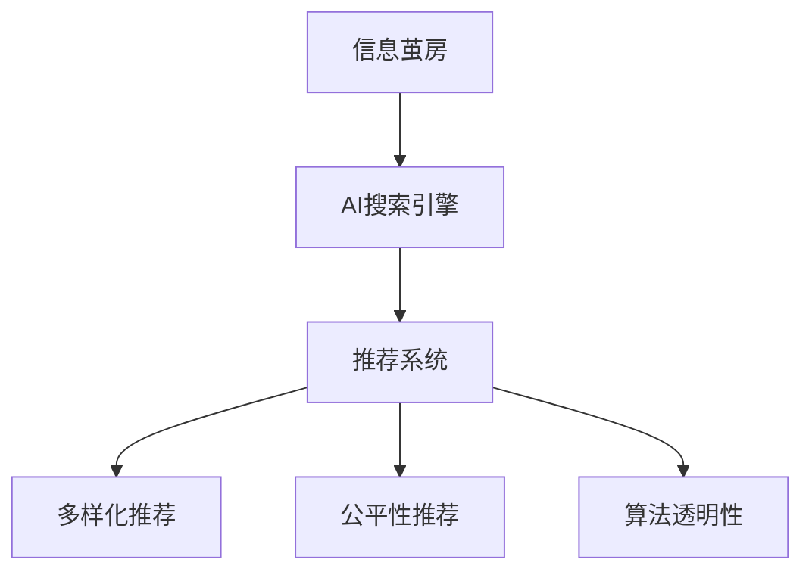

                 

# AI搜索引擎如何应对信息茧房问题

## 1. 背景介绍

### 1.1 问题由来
随着互联网的普及和社交媒体的兴起，“信息茧房”现象日益严重。用户长期沉浸在单一的信息流中，难以接触到不同的观点和信息，这不仅影响了个人的认知广度和深度，还可能加剧社会的撕裂和对立。信息茧房问题已经引起了全社会的高度关注，需要从多个角度进行系统性应对。

### 1.2 问题核心关键点
信息茧房问题本质上是由用户的行为习惯、算法推荐机制和社交网络结构共同作用的结果。针对这一问题，需要从技术、心理、社会等维度进行综合治理。本文聚焦于搜索引擎这一核心应用场景，探讨如何通过AI技术应对信息茧房，提升信息传播的公平性和多样性。

## 2. 核心概念与联系

### 2.1 核心概念概述

为更好地理解AI搜索引擎如何应对信息茧房，本节将介绍几个密切相关的核心概念：

- **信息茧房**：指用户在互联网中只接触到与自身兴趣、观点相符的信息，而无法接触其他内容的现象。信息茧房可能导致用户认知局限、社会撕裂。

- **AI搜索引擎**：基于人工智能技术，通过自然语言理解和信息检索算法，快速获取用户所需信息的搜索工具。AI搜索引擎通过算法推荐机制对搜索结果进行排序，影响用户接触信息的多样性。

- **推荐系统**：基于用户的过往行为、兴趣、社交关系等信息，通过算法推荐系统提供个性化的信息服务。推荐系统的核心目标是提升用户体验和满意度。

- **多样化推荐**：指推荐系统不仅推荐用户感兴趣的内容，还推荐不同领域、观点的信息，丰富用户的信息接触面，避免信息茧房。

- **公平性推荐**：指推荐系统在推荐内容时不偏向特定用户群体，保证所有用户都有平等接触各类信息的机会，避免信息歧视。

- **算法透明性**：指推荐算法的决策过程透明可解释，用户可以理解其背后的逻辑和机制，增强对推荐结果的信任。

这些核心概念之间的逻辑关系可以通过以下Mermaid流程图来展示：



这个流程图展示了几大核心概念及其之间的关系：

1. 信息茧房是AI搜索引擎面临的挑战之一。
2. AI搜索引擎通过推荐系统对搜索结果进行排序。
3. 推荐系统需要实现多样化推荐、公平性推荐和算法透明性，以应对信息茧房。

## 3. 核心算法原理 & 具体操作步骤

### 3.1 算法原理概述

AI搜索引擎通过推荐系统对搜索结果进行排序，以提升用户体验和满意度。推荐系统的核心目标是最大化用户满意度，同时保证推荐的个性化和多样性。针对信息茧房问题，推荐系统需要同时满足多样性和公平性的要求。

具体来说，推荐算法需要在以下几方面进行优化：

1. **多样化推荐**：在推荐时不仅要考虑用户的历史行为，还要引入外部知识，如新闻热度和多元兴趣，确保用户接触到更多样的内容。
2. **公平性推荐**：在推荐时不仅要考虑用户兴趣，还要考虑内容的多样性，避免过度偏向某一类内容，保证所有内容都有平等的曝光机会。
3. **算法透明性**：在推荐过程中，推荐算法应提供一定的透明度，让用户了解推荐的逻辑和依据，增强用户对系统的信任。

### 3.2 算法步骤详解

以下是推荐系统应对信息茧房的详细步骤：

**Step 1: 收集用户兴趣和行为数据**

- 通过爬虫、用户日志等方式收集用户的历史搜索记录、浏览记录、点击记录等数据。
- 将用户兴趣和行为数据存储到推荐系统的知识库中，用于后续的推荐计算。

**Step 2: 构建内容库和主题模型**

- 收集大量的新闻、文章、视频等多媒体内容，并标注其主题、类别等信息。
- 使用文本挖掘和机器学习技术构建内容库，并训练主题模型，以捕捉内容的多样性和相关性。

**Step 3: 设计推荐算法**

- **多样化推荐算法**：使用基于内容的推荐算法，如协同过滤、矩阵分解等，引入内容的多样性特征，如话题热度、情感极性等。
- **公平性推荐算法**：设计公平性推荐算法，如随机抽取、多元兴趣等，确保所有内容都有平等的曝光机会。
- **算法透明性算法**：开发算法透明性工具，如模型可视化、解释性AI等，增强推荐算法的可解释性。

**Step 4: 训练推荐模型**

- 使用收集到的用户兴趣和行为数据，训练推荐模型。
- 在训练过程中，平衡个性化和多样化、公平性的目标，确保推荐结果的合理性。

**Step 5: 实时推荐和反馈优化**

- 将训练好的推荐模型部署到搜索引擎中，实时对用户进行个性化推荐。
- 收集用户的反馈数据，如点击率、满意度等，用于不断优化推荐模型。

**Step 6: 持续监控和调整**

- 实时监控推荐效果，确保推荐内容的多样性和公平性。
- 根据监控结果，不断调整推荐算法，提升用户体验。

### 3.3 算法优缺点

AI搜索引擎的推荐系统在应对信息茧房问题上，具有以下优点：

1. **提升多样性**：通过多样化推荐算法，引入更多样化的内容，避免信息茧房。
2. **保证公平性**：通过公平性推荐算法，确保所有内容都有平等的曝光机会。
3. **增强透明性**：通过算法透明性算法，增强用户对推荐结果的信任和理解。

同时，该方法也存在一定的局限性：

1. **个性化与多样性矛盾**：个性化推荐往往导致内容的同质化，难以兼顾多样性。
2. **资源消耗较大**：需要构建大规模的内容库和主题模型，对计算资源和存储资源的要求较高。
3. **动态变化难处理**：用户兴趣和行为的变化，导致推荐模型难以及时更新，效果可能受限。
4. **算法复杂度高**：多目标优化的问题，使得推荐算法的设计和实现较为复杂。

尽管存在这些局限性，但AI搜索引擎通过推荐系统，可以在一定程度上缓解信息茧房问题，提升信息传播的公平性和多样性。

### 3.4 算法应用领域

AI搜索引擎的推荐系统在新闻、娱乐、电商等多个领域中广泛应用，具体应用场景包括：

- **新闻网站**：通过多样化推荐算法，展示多领域、多角度的新闻内容，避免信息茧房。
- **视频平台**：利用公平性推荐算法，均衡不同类型和长度视频的内容曝光，提升用户体验。
- **电商网站**：通过推荐算法，展示多样化的商品信息，避免用户陷入单一消费模式。
- **社交媒体**：利用算法透明性工具，提高用户对推荐内容的信任，增强平台的用户粘性。

除了上述这些经典应用场景，AI搜索引擎的推荐系统还在医疗、金融、教育等多个领域中发挥着重要作用，为人们的信息获取提供了更多样化、公平化的选择。

## 4. 数学模型和公式 & 详细讲解 & 举例说明

### 4.1 数学模型构建

为了更好地理解推荐系统的数学模型，本节将详细介绍推荐系统的基本框架和常用算法。

记用户集合为 $U$，内容集合为 $I$，用户对内容的评分矩阵为 $R \in \mathbb{R}^{m \times n}$，其中 $m$ 为用户数，$n$ 为内容数。设用户 $u$ 对内容 $i$ 的评分 $r_{ui}$，$u \in U, i \in I$。

假设推荐系统为目标函数 $f$ 的最小化问题：

$$
\min_{\theta} \sum_{u=1}^m \sum_{i=1}^n r_{ui}f(r_{ui})
$$

其中 $\theta$ 为模型参数，$f(\cdot)$ 为损失函数，用于衡量推荐效果。常见的损失函数包括均方误差损失、对数损失等。

### 4.2 公式推导过程

以下是推荐系统常用的几种算法的公式推导过程：

**协同过滤推荐算法**

协同过滤算法基于用户和内容的相似性，进行推荐。设 $X \in \mathbb{R}^{m \times n}$ 为用户对内容的评分矩阵，$W \in \mathbb{R}^{n \times k}$ 为内容的主题表示，$H \in \mathbb{R}^{m \times k}$ 为用户的主题表示，其中 $k$ 为嵌入维度。推荐公式为：

$$
\hat{r}_{ui} = \langle H_u, W_i \rangle
$$

其中 $\langle \cdot, \cdot \rangle$ 为向量点乘运算。

**矩阵分解推荐算法**

矩阵分解算法将评分矩阵 $R$ 分解为两个低秩矩阵的乘积，进行推荐。设 $P \in \mathbb{R}^{m \times k}$ 为用户的低秩矩阵，$Q \in \mathbb{R}^{k \times n}$ 为内容的低秩矩阵。推荐公式为：

$$
\hat{r}_{ui} = \langle P_u, Q_i \rangle
$$

**深度学习推荐算法**

深度学习算法使用多层神经网络进行推荐，引入非线性关系。设 $H \in \mathbb{R}^{m \times k}$ 为用户嵌入，$W \in \mathbb{R}^{k \times n}$ 为内容嵌入，$F \in \mathbb{R}^{n}$ 为输出层。推荐公式为：

$$
\hat{r}_{ui} = \sigma(WH_u + b_u)
$$

其中 $\sigma$ 为激活函数，$b_u$ 为偏置项。

### 4.3 案例分析与讲解

以协同过滤推荐算法为例，详细解释其工作原理和应用场景。

**协同过滤算法**

协同过滤算法基于用户和内容的相似性，进行推荐。假设用户 $u$ 和用户 $v$ 的评分向量分别为 $R_u$ 和 $R_v$，内容 $i$ 和内容 $j$ 的评分向量分别为 $R_i$ 和 $R_j$。假设用户 $u$ 和内容 $i$ 的评分 $r_{ui}$ 和用户 $v$ 和内容 $j$ 的评分 $r_{vj}$ 的余弦相似度为 $sim(v,j)$，则用户 $u$ 和内容 $i$ 的相似度为：

$$
sim(u,i) = \frac{\sum_{j=1}^n r_{ui}sim(v,j)}{\sqrt{\sum_{j=1}^n r_{ui}^2} \cdot \sqrt{\sum_{j=1}^n r_{vj}^2}}
$$

用户 $u$ 对内容 $j$ 的预测评分 $r_{uj}$ 为：

$$
\hat{r}_{uj} = \sum_{i=1}^n r_{ui}sim(u,i) \cdot r_{vj}
$$

通过计算用户与内容的相似度，协同过滤算法可以实现推荐。在实际应用中，由于数据稀疏性问题，协同过滤算法需要使用邻域等技术进行改进。

## 5. 项目实践：代码实例和详细解释说明

### 5.1 开发环境搭建

在进行推荐系统开发前，我们需要准备好开发环境。以下是使用Python进行TensorFlow开发的环境配置流程：

1. 安装Anaconda：从官网下载并安装Anaconda，用于创建独立的Python环境。

2. 创建并激活虚拟环境：
```bash
conda create -n tf-env python=3.8 
conda activate tf-env
```

3. 安装TensorFlow：根据CUDA版本，从官网获取对应的安装命令。例如：
```bash
conda install tensorflow -c tf
```

4. 安装Pandas、NumPy等常用工具包：
```bash
pip install pandas numpy
```

完成上述步骤后，即可在`tf-env`环境中开始推荐系统开发。

### 5.2 源代码详细实现

这里我们以协同过滤推荐算法为例，给出使用TensorFlow实现协同过滤推荐系统的PyTorch代码实现。

首先，定义协同过滤推荐算法的核心函数：

```python
import tensorflow as tf

def collaborative_filtering(X, W, H):
    P = tf.linalg.matmul(X, W)
    Q = tf.linalg.matmul(P, H, transpose_b=True)
    return Q
```

然后，加载数据集并进行预处理：

```python
import pandas as pd

# 加载评分矩阵
X = pd.read_csv('ratings.csv')

# 数据预处理
X = X[X.sum(axis=1) > 0].values
X = (X - X.mean(axis=0)) / X.std(axis=0)
```

接着，定义模型和优化器：

```python
# 定义低秩矩阵的维度和嵌入维度
k = 10

# 初始化用户和内容的主题表示
W = tf.random.normal([X.shape[1], k])
H = tf.random.normal([X.shape[0], k])

# 定义优化器和损失函数
optimizer = tf.keras.optimizers.Adam(learning_rate=0.001)
loss_fn = tf.keras.losses.MeanSquaredError()
```

最后，训练模型并在测试集上评估：

```python
# 定义训练和评估函数
def train_step(X):
    with tf.GradientTape() as tape:
        P = collaborative_filtering(X, W, H)
        loss = loss_fn(X, P)
    grads = tape.gradient(loss, [W, H])
    optimizer.apply_gradients(zip(grads, [W, H]))

def evaluate_step(X_test):
    P = collaborative_filtering(X_test, W, H)
    mse = loss_fn(X_test, P).numpy()
    return mse

# 定义训练和评估流程
for epoch in range(100):
    train_step(X)
    mse = evaluate_step(X_test)
    print(f'Epoch {epoch+1}, MSE: {mse:.4f}')

# 打印推荐结果
print('Recommendations:')
for i in range(X_test.shape[0]):
    P = collaborative_filtering(X_test[i:i+1], W, H)
    idx = np.argsort(P, axis=0)[-10:]
    print(f'User {i+1}: {idx[:10]}')
```

以上就是使用TensorFlow实现协同过滤推荐算法的完整代码实现。可以看到，通过TensorFlow的API，我们可以非常方便地实现协同过滤算法，并对模型进行训练和评估。

### 5.3 代码解读与分析

让我们再详细解读一下关键代码的实现细节：

**Collaborative Filtering函数**：
- `collaborative_filtering`函数接收评分矩阵 $X$、内容的主题表示 $W$ 和用户的主题表示 $H$，通过矩阵乘法计算用户对内容的预测评分。

**数据预处理**：
- 使用Pandas加载评分矩阵数据，并将其转换为TensorFlow可以处理的格式。
- 对数据进行标准化处理，以提升模型的训练效果。

**模型和优化器**：
- 定义低秩矩阵的维度和嵌入维度。
- 使用TensorFlow的随机数生成器初始化用户和内容的主题表示。
- 定义Adam优化器和均方误差损失函数。

**训练和评估函数**：
- `train_step`函数计算梯度并更新模型参数。
- `evaluate_step`函数计算测试集上的均方误差，评估模型性能。
- 训练和评估流程中，我们每轮训练一次模型，并在测试集上评估一次性能，最终输出推荐结果。

通过TensorFlow的代码实现，我们可以看到协同过滤推荐算法的基本原理和实现步骤，从而更好地理解其工作机制。

当然，工业级的系统实现还需考虑更多因素，如模型的保存和部署、超参数的自动搜索、模型的可解释性等。但核心的推荐算法基本与此类似。

## 6. 实际应用场景

### 6.1 推荐系统的广泛应用

推荐系统在多个行业领域中广泛应用，具体应用场景包括：

- **电商**：电商网站通过推荐系统，向用户展示个性化商品推荐，提升用户体验和销售额。
- **视频平台**：视频平台通过推荐系统，向用户推荐感兴趣的视频内容，提升用户粘性和平台流量。
- **新闻**：新闻网站通过推荐系统，向用户展示多领域、多角度的新闻内容，避免信息茧房。
- **社交媒体**：社交媒体平台通过推荐系统，向用户推荐多样化的内容，增强用户粘性和平台活跃度。

除了上述这些经典应用场景，推荐系统还在金融、医疗、教育等多个领域中发挥着重要作用，为人们的信息获取提供了更多样化、公平化的选择。

### 6.2 推荐系统的未来展望

随着推荐算法的不断进步，推荐系统将在更多领域得到应用，为传统行业带来变革性影响。

在智慧医疗领域，推荐系统可以应用于病历推荐、药品推荐、治疗方案推荐等环节，提升医疗服务的智能化水平，辅助医生诊疗，加速新药开发进程。

在智能教育领域，推荐系统可应用于作业批改、学情分析、知识推荐等方面，因材施教，促进教育公平，提高教学质量。

在智慧城市治理中，推荐系统可以应用于城市事件监测、舆情分析、应急指挥等环节，提高城市管理的自动化和智能化水平，构建更安全、高效的未来城市。

此外，在企业生产、社会治理、文娱传媒等众多领域，推荐系统也将不断涌现，为经济社会发展注入新的动力。相信随着推荐算法的日益成熟，推荐系统必将在构建人机协同的智能时代中扮演越来越重要的角色。

## 7. 工具和资源推荐

### 7.1 学习资源推荐

为了帮助开发者系统掌握推荐系统的理论基础和实践技巧，这里推荐一些优质的学习资源：

1. 《推荐系统实战》系列博文：由推荐系统专家撰写，深入浅出地介绍了推荐系统的基本概念、经典算法和实际应用。

2. 《协同过滤推荐系统》课程：斯坦福大学开设的推荐系统课程，详细讲解了协同过滤推荐系统的原理和应用。

3. 《深度学习推荐系统》书籍：深度学习领域的经典书籍，全面介绍了深度学习在推荐系统中的应用。

4. 《推荐系统算法与应用》书籍：推荐系统领域的经典书籍，介绍了多种推荐算法的实现和应用。

5. KDD-Cup 2021推荐系统竞赛：由Kaggle主办的推荐系统竞赛，提供大量实际数据集和算法实现参考。

通过对这些资源的学习实践，相信你一定能够快速掌握推荐系统的精髓，并用于解决实际的推荐问题。

### 7.2 开发工具推荐

高效的开发离不开优秀的工具支持。以下是几款用于推荐系统开发的常用工具：

1. TensorFlow：基于Python的开源深度学习框架，灵活动态的计算图，适合快速迭代研究。推荐系统的多种算法都有TensorFlow的实现。

2. PyTorch：基于Python的开源深度学习框架，动态图机制，易于构建和调试复杂模型。推荐系统的高效实现多使用PyTorch。

3. Spark：基于Apache Spark的推荐系统框架，支持大规模分布式计算，适用于处理大规模数据集。

4. Hadoop：基于Apache Hadoop的推荐系统框架，支持大规模集群计算，适用于海量数据的处理。

5. MLflow：推荐系统的实验跟踪工具，可以记录和可视化模型训练过程中的各项指标，方便对比和调优。

6. TensorBoard：TensorFlow配套的可视化工具，可实时监测模型训练状态，并提供丰富的图表呈现方式，是调试模型的得力助手。

合理利用这些工具，可以显著提升推荐系统的开发效率，加快创新迭代的步伐。

### 7.3 相关论文推荐

推荐系统的发展源于学界的持续研究。以下是几篇奠基性的相关论文，推荐阅读：

1. BPR: Bayesian Personalized Ranking from Implicit Feedback：提出了基于贝叶斯方法的双重损失推荐算法，刷新了推荐系统的SOTA。

2. CF: Collaborative Filtering for Implicit Feedback Datasets：提出了协同过滤推荐算法的基本框架，成为推荐系统的主流范式。

3. CNNMF: A Scalable Probabilistic Model for Matrix Factorization：提出了基于CP分解的概率模型，提高了推荐系统的可解释性和可扩展性。

4. DeepFM: A Scalable and General Approach for Ad Click Prediction：提出了深度学习和特征工程的结合方式，提升了推荐系统的预测准确率。

5. Attention is All You Need：提出了Transformer结构，开启了NLP领域的预训练大模型时代，同时对推荐系统产生了深远影响。

这些论文代表了大语言模型微调技术的发展脉络。通过学习这些前沿成果，可以帮助研究者把握学科前进方向，激发更多的创新灵感。

## 8. 总结：未来发展趋势与挑战

### 8.1 总结

本文对推荐系统应对信息茧房问题进行了全面系统的介绍。首先阐述了信息茧房问题及其对社会的影响，明确了推荐系统在解决信息茧房问题中的重要意义。其次，从原理到实践，详细讲解了推荐系统的基本框架和核心算法，给出了推荐系统开发的完整代码实例。同时，本文还广泛探讨了推荐系统在新闻、视频、电商等多个行业领域的应用前景，展示了推荐系统的巨大潜力。

通过本文的系统梳理，可以看到，推荐系统通过多样化推荐、公平性推荐和算法透明性，可以在一定程度上缓解信息茧房问题，提升信息传播的公平性和多样性。推荐系统已经广泛应用于多个行业，为人们的信息获取提供了更多样化、公平化的选择。

### 8.2 未来发展趋势

展望未来，推荐系统将呈现以下几个发展趋势：

1. **个性化与多样性的平衡**：推荐系统需要在个性化推荐和多样性推荐之间找到平衡点，提升用户满意度。
2. **深度学习与传统算法的结合**：深度学习算法在推荐系统中的应用将更加广泛，同时传统算法（如协同过滤）仍将在某些场景中发挥重要作用。
3. **推荐系统的可解释性**：推荐算法的决策过程透明可解释，增强用户对推荐结果的信任。
4. **跨领域推荐系统**：推荐系统将更多地应用于跨领域场景，如社交网络、移动设备等，提升用户体验。
5. **推荐系统的公平性**：推荐系统将更多地关注公平性问题，避免对特定用户群体产生偏见。
6. **实时推荐系统**：推荐系统将实时更新，及时响应用户需求，提升用户体验。

以上趋势凸显了推荐系统的广阔前景。这些方向的探索发展，必将进一步提升推荐系统的性能和应用范围，为人们的信息获取提供更加智能化、公平化的选择。

### 8.3 面临的挑战

尽管推荐系统已经在信息茧房问题上取得了显著进展，但在迈向更加智能化、公平化的应用过程中，仍面临诸多挑战：

1. **数据隐私问题**：推荐系统需要处理大量用户数据，如何保护用户隐私，避免数据泄露，是一个重要问题。
2. **数据质量和偏差**：推荐系统的性能很大程度上取决于数据质量和多样性，如何获取高质量、多样化的数据，是一个复杂任务。
3. **推荐算法复杂性**：推荐算法的复杂性高，难以进行精细化调整，如何优化推荐算法，提升推荐效果，是一个重要问题。
4. **推荐系统鲁棒性**：推荐系统对输入数据的变化敏感，如何提升系统的鲁棒性，是一个挑战。
5. **用户行为多样性**：用户行为具有多样性，如何更好地捕捉用户需求，是一个复杂任务。
6. **跨领域推荐**：不同领域的数据具有不同特征，如何构建跨领域的推荐系统，是一个挑战。

正视推荐系统面临的这些挑战，积极应对并寻求突破，将使推荐系统更好地服务于用户，提升信息传播的公平性和多样性。

### 8.4 研究展望

面对推荐系统面临的挑战，未来的研究需要在以下几个方面寻求新的突破：

1. **深度学习推荐系统的优化**：开发更加高效、可解释的深度学习推荐算法，提升推荐系统的性能。
2. **跨领域推荐系统的构建**：开发跨领域的推荐算法，实现不同领域数据的高效融合。
3. **推荐系统的公平性研究**：设计更加公平、透明的推荐算法，避免对特定用户群体产生偏见。
4. **推荐系统的实时化**：开发实时推荐的算法和系统，及时响应用户需求。
5. **推荐系统的隐私保护**：研究数据隐私保护技术，确保用户数据的隐私和安全。
6. **推荐系统的多样性增强**：提升推荐系统的多样性，避免用户陷入单一的推荐模式。

这些研究方向的探索，必将引领推荐系统向更高的台阶迈进，为用户提供更加智能化、公平化的推荐服务。总之，推荐系统需要在个性化与多样性、公平性、可解释性等方面进行全面优化，方能真正实现其价值，提升用户的信息获取体验。

## 9. 附录：常见问题与解答

**Q1：推荐系统如何应对信息茧房问题？**

A: 推荐系统通过多样化推荐、公平性推荐和算法透明性，可以在一定程度上缓解信息茧房问题，提升信息传播的公平性和多样性。

**Q2：推荐系统在实际应用中需要注意哪些问题？**

A: 推荐系统在实际应用中需要注意数据隐私、数据质量和偏差、推荐算法复杂性、推荐系统鲁棒性、用户行为多样性、跨领域推荐等问题。

**Q3：推荐系统的未来发展方向是什么？**

A: 推荐系统的未来发展方向包括个性化与多样性的平衡、深度学习与传统算法的结合、推荐系统的可解释性、跨领域推荐系统、推荐系统的公平性、实时推荐系统等。

**Q4：如何提升推荐系统的性能？**

A: 提升推荐系统的性能，需要优化推荐算法，提升数据质量和多样性，增强推荐系统的鲁棒性和可解释性，提升推荐系统的实时性和公平性。

通过本文的系统梳理，可以看到，推荐系统通过多样化推荐、公平性推荐和算法透明性，可以在一定程度上缓解信息茧房问题，提升信息传播的公平性和多样性。推荐系统已经广泛应用于多个行业，为人们的信息获取提供了更多样化、公平化的选择。相信随着推荐算法的不断进步，推荐系统必将在构建人机协同的智能时代中扮演越来越重要的角色。

作者：禅与计算机程序设计艺术 / Zen and the Art of Computer Programming

