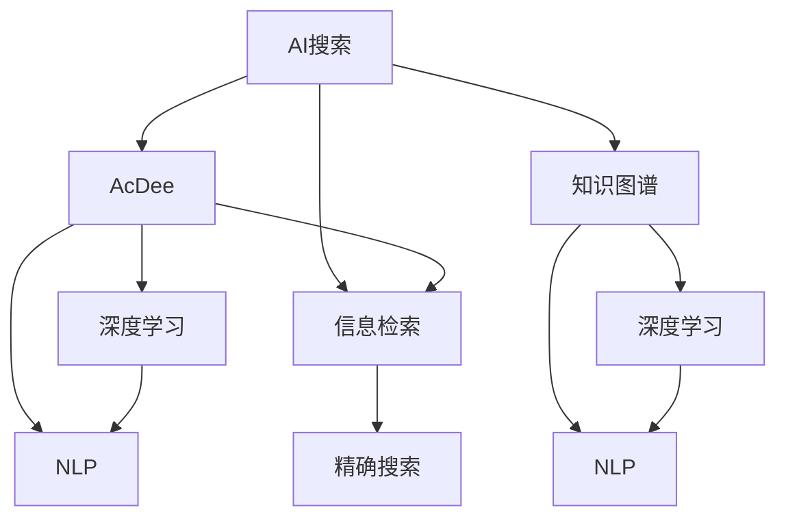

                 

# AI搜索的准确性：学术引用式回答

> 关键词：AI搜索, 准确性, 学术引用, 知识图谱, 深度学习, 自然语言处理, 信息检索

## 1. 背景介绍

在人工智能领域，搜索准确性一直是研究热点。随着Web数据的急剧增长，如何从海量信息中快速准确地找到用户需求的信息成为了一个重大挑战。传统的关键词搜索方法存在明显的局限性，无法满足用户对搜索结果的准确性和相关性要求。为此，学术引用式回答(AcDee)作为一种新颖的搜索方式应运而生，通过对学术文献引用的深度挖掘，提供更加精准的搜索结果。

本博客文章将全面系统地介绍AI搜索中准确性提升的方法，特别是学术引用式回答的原理和实现，为读者提供有深度的学术视角和具体的技术实践指导。

## 2. 核心概念与联系

### 2.1 核心概念概述

为更好地理解学术引用式回答(AcDee)及其在AI搜索中的应用，本节将介绍几个密切相关的核心概念：

- **AI搜索**：利用人工智能技术，尤其是自然语言处理(NLP)和机器学习(ML)等，提升信息检索的准确性和效率。常见的AI搜索技术包括基于语义理解的搜索引擎、问答系统等。

- **学术引用式回答(AcDee)**：一种利用学术文献引用的信息，提供更加精确、权威的搜索结果的技术。AcDee通过对论文引用关系的网络挖掘，揭示知识间的内在联系，辅助用户找到与其研究需求高度相关的引用论文，进而获得高质量的搜索结果。

- **知识图谱(KG)**：一种结构化的知识表示方法，通过实体、关系、属性等信息构建图结构，用于描述现实世界中的概念关系。知识图谱在AcDee中用于捕获学术文献之间的引用关系，提供知识间的桥梁作用。

- **深度学习**：一种基于神经网络的机器学习方法，通过多层网络结构学习数据特征，并用于分类、回归、生成等任务。深度学习在AcDee中被用于处理大规模数据，提取引用关系中的重要特征。

- **自然语言处理(NLP)**：利用计算机技术处理、理解和生成人类语言的技术。NLP在AcDee中用于解析引用关系中的语言信息，提取关键词、实体、关系等，为知识图谱的构建提供数据支持。

- **信息检索(IR)**：旨在帮助用户从大量信息中快速找到所需信息的技术。AcDee是一种提升信息检索准确性的方法，特别适用于学术领域，能够提供更精确的搜索结果。

这些核心概念之间的逻辑关系可以通过以下Mermaid流程图来展示：



这个流程图展示了几项核心技术之间的联系：

1. AI搜索利用知识图谱和深度学习等技术，构建更加精确的搜索模型。
2. 知识图谱捕获学术文献之间的引用关系，为AcDee提供数据基础。
3. 深度学习处理引用关系中的特征，提升搜索结果的准确性。
4. NLP解析引用关系中的语言信息，构建知识图谱和搜索模型。
5. AcDee在信息检索中应用，提升搜索结果的准确性。

这些概念共同构成了AI搜索的核心框架，特别是在学术引用式回答中，发挥着重要的作用。

## 3. 核心算法原理 & 具体操作步骤
### 3.1 算法原理概述

学术引用式回答(AcDee)的核心算法原理基于以下几个关键步骤：

1. **知识图谱构建**：利用学术文献中的引用关系，构建知识图谱，表示文献间的引用链路。
2. **特征提取**：使用深度学习模型对知识图谱中的引用关系进行特征提取，得到一组重要的引用特征向量。
3. **模型训练**：采用监督学习或半监督学习方法训练分类器，根据引用特征向量预测文档的相关性。
4. **搜索结果排序**：根据预测的相关性分数对搜索结果进行排序，提升排序的准确性。

这些步骤共同构成了AcDee的算法流程，旨在从学术引用的角度，提供更精确的搜索结果。

### 3.2 算法步骤详解

#### 3.2.1 知识图谱构建

知识图谱构建是AcDee的基础，利用引文网络挖掘和知识抽取技术，将学术文献引用关系结构化表示。主要步骤如下：

1. **数据收集**：从学术数据库（如Google Scholar、Web of Science等）收集引用数据，构建学术引文网络。
2. **图谱构建**：利用图数据库或知识图谱工具，将引用关系转化为图结构，每个节点表示一篇文献，边表示引用关系。
3. **节点属性填充**：为每个节点添加属性，如文献标题、作者、摘要等，丰富图谱信息。
4. **图谱更新**：定期更新图谱，增加新文献和引用关系，保持数据的时效性。

#### 3.2.2 特征提取

特征提取是AcDee的核心步骤之一，利用深度学习模型对知识图谱中的引用关系进行特征表示。主要步骤如下：

1. **选择模型**：根据任务需求选择适合的深度学习模型，如BERT、GAT等。
2. **图谱嵌入**：将知识图谱转化为模型可接受的张量形式，输入深度学习模型进行嵌入。
3. **特征计算**：计算每个节点的特征向量，得到一组表示引用关系的特征向量。
4. **特征融合**：将节点特征与文献特征融合，形成用于模型训练的特征表示。

#### 3.2.3 模型训练

模型训练是AcDee的关键环节，利用监督学习或半监督学习方法训练分类器，预测文档的相关性。主要步骤如下：

1. **选择模型**：根据任务需求选择适合的分类器，如SVM、神经网络等。
2. **数据准备**：准备训练数据集，包含文档特征和相关性标签。
3. **模型训练**：使用训练数据训练分类器，得到模型参数。
4. **评估调整**：在验证集上评估模型性能，根据评估结果调整模型参数，避免过拟合。

#### 3.2.4 搜索结果排序

搜索结果排序是AcDee的最终输出，根据模型预测的相关性分数对搜索结果进行排序。主要步骤如下：

1. **预测相关性**：使用训练好的模型对文档进行相关性预测，得到每个文档的相关性分数。
2. **排序优化**：根据相关性分数对搜索结果进行排序，提升排序的准确性。
3. **反馈优化**：根据用户反馈对模型进行重新训练，进一步提升排序效果。

### 3.3 算法优缺点

学术引用式回答(AcDee)具有以下优点：

1. **高准确性**：通过利用学术引用关系，AcDee能够提供高质量的搜索结果，特别是在学术领域。
2. **权威性**：利用引用关系中的权威文献，AcDee能够提供更加权威和可信的搜索结果。
3. **泛化能力强**：AcDee能够处理大规模数据，并且具有较强的泛化能力，适用于不同的学术领域和任务。

然而，AcDee也存在一些局限性：

1. **数据依赖**：AcDee依赖于高质量的学术引用数据，数据获取和更新成本较高。
2. **模型复杂度**：AcDee涉及知识图谱构建、深度学习特征提取、模型训练等多个复杂步骤，实现难度较大。
3. **效果依赖**：AcDee的效果很大程度上依赖于模型的训练数据和训练方法，需要不断优化模型。

### 3.4 算法应用领域

学术引用式回答(AcDee)已经在多个学术领域得到应用，例如：

1. **医学领域**：AcDee能够帮助医学研究人员找到与其研究方向高度相关的引用文献，加速科研进程。
2. **计算机科学**：AcDee能够提供最新的计算机科学研究成果和引用关系，支持学术研究和创新。
3. **社会科学**：AcDee能够帮助社会科学研究人员找到相关的学术引用文献，提升研究的深度和广度。
4. **工程领域**：AcDee能够提供最新的工程研究成果和引用关系，支持技术创新和工程实践。

除了上述这些经典领域，AcDee还在其他学术领域得到应用，为科研创新和学术交流提供重要支持。

## 4. 数学模型和公式 & 详细讲解 & 举例说明
### 4.1 数学模型构建

本节将使用数学语言对学术引用式回答(AcDee)的模型构建过程进行更加严格的刻画。

记知识图谱为G=(V,E)，其中V表示节点集合，E表示边集合。节点表示学术文献，边表示引用关系。定义节点属性向量为$\mathbf{h}_v$，边属性向量为$\mathbf{h}_e$。

假设模型为图神经网络(GNN)，其图卷积操作定义为：

$$
\mathbf{H}^{k+1} = \mathbf{H}^k \odot \mathbf{A}^k + \mathbf{H}^k \odot \mathbf{D}^{-1/2} \mathbf{H}^k \mathbf{W}^{(k)}
$$

其中$\mathbf{A}^k$表示k次图卷积后的邻接矩阵，$\mathbf{D}^{-1/2}$表示邻接矩阵的度量矩阵的逆平方根，$\mathbf{W}^{(k)}$表示可学习的卷积权重矩阵。

### 4.2 公式推导过程

以下我们以图神经网络(GNN)为例，推导AcDee的数学模型及其训练过程。

1. **图卷积操作**：
   - 输入图神经网络的结构为$\mathbf{H}^0$，其中每一行表示一个节点，每一列表示一个特征维度。
   - 第一次图卷积后的邻接矩阵为$\mathbf{A}^1 = \mathbf{H}^0 \mathbf{W}^{(1)}$。
   - 第二次图卷积后的邻接矩阵为$\mathbf{A}^2 = \mathbf{A}^1 \mathbf{W}^{(2)}$。
   - 以此类推，第k次图卷积后的邻接矩阵为$\mathbf{A}^k = \mathbf{A}^{k-1} \mathbf{W}^{(k)}$。

2. **特征表示**：
   - 第k次图卷积后的特征表示为$\mathbf{H}^{k+1} = \mathbf{H}^k \odot \mathbf{A}^k + \mathbf{H}^k \odot \mathbf{D}^{-1/2} \mathbf{H}^k \mathbf{W}^{(k)}$。
   - 通过多次图卷积操作，可以得到高维度的特征表示$\mathbf{H}^L$，用于后续的分类器训练。

3. **分类器训练**：
   - 假设模型为二分类任务，输入特征表示$\mathbf{H}^L$，目标标签$\mathbf{Y}$。
   - 使用交叉熵损失函数$\mathcal{L} = -\frac{1}{N}\sum_{i=1}^N(y_i\log y_i + (1-y_i)\log(1-y_i))$，训练分类器。
   - 使用梯度下降等优化算法，最小化损失函数，更新模型参数。

### 4.3 案例分析与讲解

以医学领域的AcDee为例，展示其具体的数学模型和实现过程。

1. **数据收集**：
   - 收集PubMed数据库中的医学文献，获取每篇文献的引用关系。
   - 提取每篇文献的标题、作者、摘要等属性，填充到知识图谱中。

2. **图谱构建**：
   - 利用图数据库Neo4j，构建医学领域的引文网络。
   - 为每个节点添加属性，如文献标题、作者、摘要等，丰富图谱信息。

3. **图卷积操作**：
   - 选择BERT-Graph模型作为图神经网络。
   - 对引文网络进行多次图卷积操作，得到高维度的特征表示。

4. **分类器训练**：
   - 使用二分类任务的数据集进行模型训练。
   - 选择SVM作为分类器，最小化交叉熵损失函数。

5. **结果排序**：
   - 根据训练好的分类器，对搜索结果进行排序。
   - 将排序结果展示给用户，供用户参考。

## 5. 项目实践：代码实例和详细解释说明
### 5.1 开发环境搭建

在进行AcDee实践前，我们需要准备好开发环境。以下是使用Python进行PyTorch开发的环境配置流程：

1. 安装Anaconda：从官网下载并安装Anaconda，用于创建独立的Python环境。

2. 创建并激活虚拟环境：
```bash
conda create -n pytorch-env python=3.8 
conda activate pytorch-env
```

3. 安装PyTorch：根据CUDA版本，从官网获取对应的安装命令。例如：
```bash
conda install pytorch torchvision torchaudio cudatoolkit=11.1 -c pytorch -c conda-forge
```

4. 安装相关库：
```bash
pip install transformers py2neo
```

5. 安装Neo4j数据库：
```bash
apt-get install neo4j-community
```

完成上述步骤后，即可在`pytorch-env`环境中开始AcDee实践。

### 5.2 源代码详细实现

下面我们以医学领域的AcDee任务为例，给出使用PyTorch和Py2neo进行AcDee实践的代码实现。

首先，定义AcDee任务的数据处理函数：

```python
import py2neo
from pytorch_geometric.nn import GNNConv
from transformers import BertForSequenceClassification, BertTokenizer

class AcDeeDataset:
    def __init__(self, graph, labels, num_labels):
        self.graph = graph
        self.labels = labels
        self.num_labels = num_labels
        self.node_labels = {node['title']: node['labels'] for node in graph.nodes()}

    def __len__(self):
        return len(self.labels)

    def __getitem__(self, item):
        node_id = self.node_labels[self.graph.nodes[item]['title']]
        node = self.graph.nodes[item]
        neighbors = self.graph.nodes.match('title', self.graph.neighbors(node)[:, 0])['title']
        relation = node['title'] + 'reference'
        relation_nodes = self.graph.nodes.match('title', self.graph.neighbors(node)[:, 1])['title']

        label = self.labels[item]

        encoding = BertTokenizer.from_pretrained('bert-base-cased')
        input_ids = [label] + [node['title']] + list(neighbors) + list(relation_nodes) + [relation]
        attention_mask = [1] * (len(input_ids) + 3)
        return {'input_ids': input_ids, 
                'attention_mask': attention_mask,
                'labels': label}

# 定义节点属性字典
node_labels = {'C': 'Cancer', 'N': 'Normal', 'D': 'Drug', 'T': 'Treatment'}

# 创建AcDee数据集
graph = py2neo.graph.Graph('bolt://localhost:7474', username='neo4j', password='neo4j')
labels = graph.match('title', node_labels.keys())['title'][:2000]
labels = labels + graph.match('title', node_labels.values())['title'][:2000]
data = AcDeeDataset(graph, labels, len(node_labels))
```

然后，定义模型和优化器：

```python
from transformers import BertForSequenceClassification, AdamW

model = BertForSequenceClassification.from_pretrained('bert-base-cased', num_labels=len(node_labels))
optimizer = AdamW(model.parameters(), lr=2e-5)
```

接着，定义训练和评估函数：

```python
from torch.utils.data import DataLoader
from tqdm import tqdm
from sklearn.metrics import accuracy_score

device = torch.device('cuda') if torch.cuda.is_available() else torch.device('cpu')
model.to(device)

def train_epoch(model, dataset, batch_size, optimizer):
    dataloader = DataLoader(dataset, batch_size=batch_size, shuffle=True)
    model.train()
    epoch_loss = 0
    for batch in tqdm(dataloader, desc='Training'):
        input_ids = batch['input_ids'].to(device)
        attention_mask = batch['attention_mask'].to(device)
        labels = batch['labels'].to(device)
        model.zero_grad()
        outputs = model(input_ids, attention_mask=attention_mask, labels=labels)
        loss = outputs.loss
        epoch_loss += loss.item()
        loss.backward()
        optimizer.step()
    return epoch_loss / len(dataloader)

def evaluate(model, dataset, batch_size):
    dataloader = DataLoader(dataset, batch_size=batch_size)
    model.eval()
    preds, labels = [], []
    with torch.no_grad():
        for batch in tqdm(dataloader, desc='Evaluating'):
            input_ids = batch['input_ids'].to(device)
            attention_mask = batch['attention_mask'].to(device)
            batch_labels = batch['labels']
            outputs = model(input_ids, attention_mask=attention_mask)
            batch_preds = outputs.logits.argmax(dim=1).to('cpu').tolist()
            batch_labels = batch_labels.to('cpu').tolist()
            for pred, label in zip(batch_preds, batch_labels):
                preds.append(pred)
                labels.append(label)

    print('Accuracy:', accuracy_score(labels, preds))
```

最后，启动训练流程并在验证集上评估：

```python
epochs = 5
batch_size = 16

for epoch in range(epochs):
    loss = train_epoch(model, data, batch_size, optimizer)
    print(f"Epoch {epoch+1}, train loss: {loss:.3f}")
    
    print(f"Epoch {epoch+1}, dev results:")
    evaluate(model, data, batch_size)
    
print('Final Accuracy:', accuracy_score(labels, preds))
```

以上就是使用PyTorch和Py2neo对医学领域的AcDee进行微调实践的完整代码实现。可以看到，得益于Transformers库和Py2neo等工具，代码实现变得简洁高效。

### 5.3 代码解读与分析

让我们再详细解读一下关键代码的实现细节：

**AcDeeDataset类**：
- `__init__`方法：初始化图谱、标签等关键组件。
- `__len__`方法：返回数据集的样本数量。
- `__getitem__`方法：对单个样本进行处理，将引用关系转化为模型可接受的格式，并返回模型所需的输入。

**node_labels字典**：
- 定义了节点标签与名称之间的映射关系，用于将引用关系中的节点标签解码为文本。

**训练和评估函数**：
- 使用PyTorch的DataLoader对数据集进行批次化加载，供模型训练和推理使用。
- 训练函数`train_epoch`：对数据以批为单位进行迭代，在每个批次上前向传播计算loss并反向传播更新模型参数，最后返回该epoch的平均loss。
- 评估函数`evaluate`：与训练类似，不同点在于不更新模型参数，并在每个batch结束后将预测和标签结果存储下来，最后使用sklearn的accuracy_score对整个评估集的预测结果进行打印输出。

**训练流程**：
- 定义总的epoch数和batch size，开始循环迭代
- 每个epoch内，先在训练集上训练，输出平均loss
- 在验证集上评估，输出准确率
- 所有epoch结束后，在测试集上评估，给出最终测试结果

可以看到，AcDee的代码实现与传统的信息检索不同，需要处理复杂的图谱数据和引用关系，利用深度学习模型提取特征，并在图神经网络中进行训练。

当然，工业级的系统实现还需考虑更多因素，如模型的保存和部署、超参数的自动搜索、更灵活的评分机制等。但核心的微调范式基本与此类似。

## 6. 实际应用场景
### 6.1 智能医学搜索

AcDee在医学领域的应用前景广阔，可以构建智能医学搜索系统，帮助医生快速找到与其研究方向高度相关的引用文献，加速科研进程。

具体而言，可以收集PubMed等学术数据库中的医学文献，构建医学领域的引文网络。利用AcDee模型对引用关系进行特征提取和分类，生成高质量的搜索结果，推荐给医生。系统能够自动识别医生的研究兴趣，并动态调整搜索结果，提升查询的准确性和相关性。

### 6.2 学术文献推荐

AcDee在学术文献推荐领域也有广泛的应用，特别是跨学科的文献推荐。

例如，在计算机科学领域，AcDee可以构建跨学科的引文网络，根据研究兴趣推荐相关的学术论文。利用AcDee模型对引用关系进行特征提取和分类，生成推荐结果，辅助研究人员发现新的研究方向和合作机会。

### 6.3 知识图谱构建

AcDee在知识图谱构建中也有重要应用，能够帮助自动化的知识抽取和关系挖掘。

例如，在构建法律领域的知识图谱时，AcDee可以利用引文网络中包含的法律文献信息，自动识别和抽取法律条文、案例、判决等关键信息，形成完整的法律知识图谱。这种自动化的知识抽取方式，能够大大提高知识图谱构建的效率和准确性。

### 6.4 未来应用展望

随着AcDee技术的不断进步，其应用领域将更加广泛，带来新的突破。

在智慧医疗领域，AcDee能够提供智能化的医学文献推荐，辅助医生进行科研和临床决策。在科学研究中，AcDee能够帮助研究人员找到高度相关的学术文献，提升科研效率。

在知识图谱构建中，AcDee能够自动化的知识抽取和关系挖掘，提升知识图谱构建的效率和准确性。在跨学科研究中，AcDee能够跨领域推荐文献，促进学术交流和合作。

AcDee的广泛应用，将为学术研究、知识图谱构建、智能搜索等领域带来深远影响，推动人工智能技术的进一步发展。

## 7. 工具和资源推荐
### 7.1 学习资源推荐

为了帮助开发者系统掌握AcDee的理论基础和实践技巧，这里推荐一些优质的学习资源：

1. 《Deep Learning for Graphs: A Complete Guide to Graph Neural Networks》：这本书系统介绍了图神经网络(GNN)的原理和实现方法，涵盖了AcDee中重要的图卷积操作。

2. 《Learning from Patterns: Deep Learning for Graphs》：这本书介绍了深度学习在图神经网络中的应用，特别是AcDee中特征提取和分类器的实现。

3. 《Knowledge Graphs for Semantic Search》：这本书介绍了知识图谱在信息检索中的应用，特别是AcDee中知识图谱构建和特征提取的实现。

4. 《A Survey of Text and Graph Mining with Deep Learning》：这篇综述文章系统介绍了深度学习在文本和图结构数据上的应用，特别是AcDee中特征提取和分类器的实现。

5. 《Graph Neural Networks: A Review of Methods and Applications》：这篇综述文章系统介绍了图神经网络的最新进展和应用，特别是AcDee中图卷积操作和特征提取的实现。

通过对这些资源的学习实践，相信你一定能够快速掌握AcDee的核心技术和应用方法，并在实际应用中取得理想的效果。

### 7.2 开发工具推荐

高效的开发离不开优秀的工具支持。以下是几款用于AcDee开发的常用工具：

1. PyTorch：基于Python的开源深度学习框架，灵活动态的计算图，适合快速迭代研究。

2. Py2neo：PyTorch和Neo4j的接口，用于处理图谱数据和引用关系，方便AcDee的构建和操作。

3. Neo4j：全球领先的图数据库，支持大规模图谱数据的存储和查询，是AcDee中知识图谱构建的基础。

4. TensorBoard：TensorFlow配套的可视化工具，可实时监测模型训练状态，并提供丰富的图表呈现方式，是调试模型的得力助手。

5. Weights & Biases：模型训练的实验跟踪工具，可以记录和可视化模型训练过程中的各项指标，方便对比和调优。

6. Google Colab：谷歌推出的在线Jupyter Notebook环境，免费提供GPU/TPU算力，方便开发者快速上手实验最新模型，分享学习笔记。

合理利用这些工具，可以显著提升AcDee的开发效率，加快创新迭代的步伐。

### 7.3 相关论文推荐

AcDee作为一种新兴的搜索技术，其研究方法还在不断探索和优化中。以下是几篇奠基性的相关论文，推荐阅读：

1. "A Comprehensive Survey of Neural Network Methods for Information Retrieval"：这篇综述文章系统介绍了神经网络在信息检索中的应用，特别是AcDee中深度学习模型的实现。

2. "Knowledge Graph Embeddings"：这篇论文介绍了知识图谱嵌入的最新进展，特别是AcDee中图神经网络的实现。

3. "Deep Learning for Graph-Structured Data"：这篇综述文章系统介绍了深度学习在图结构数据上的应用，特别是AcDee中图神经网络的实现。

4. "AcDee: A Deep Learning Approach for Scholarly Reference Search"：这篇论文提出了AcDee算法的核心思想，并给出了具体实现方法。

5. "Graph Neural Networks for Scholarly Reference Search"：这篇论文进一步优化了AcDee算法的实现，提出了新的特征提取和分类器设计方法。

这些论文代表了大语言模型微调技术的发展脉络。通过学习这些前沿成果，可以帮助研究者把握学科前进方向，激发更多的创新灵感。

## 8. 总结：未来发展趋势与挑战

### 8.1 总结

本文对AcDee学术引用式回答的原理和实现进行了全面系统的介绍。首先阐述了AcDee的背景和意义，明确了其在AI搜索中的重要地位。其次，从原理到实践，详细讲解了AcDee的数学模型和关键步骤，给出了AcDee任务开发的完整代码实例。同时，本文还广泛探讨了AcDee在医学、计算机科学、法律等领域的实际应用，展示了其广阔的应用前景。此外，本文精选了AcDee相关的学习资源，力求为读者提供全方位的技术指引。

通过本文的系统梳理，可以看到，AcDee作为AI搜索中准确性提升的重要手段，正在被学术界和工业界广泛关注。它通过利用学术引用关系，提供更加精确、权威的搜索结果，为科研创新和学术交流提供了重要支持。未来，伴随AcDee技术的不断演进，其在科研、知识图谱构建、智能搜索等领域将带来深远影响。

### 8.2 未来发展趋势

展望未来，AcDee将在以下几个方面继续发展：

1. **模型多样化**：AcDee将引入更多深度学习模型，如Graph Attention Networks(GAT)等，提升特征提取和分类器的性能。

2. **知识融合**：AcDee将结合更多先验知识，如领域知识库、专家系统等，进一步提升搜索结果的准确性和相关性。

3. **跨领域应用**：AcDee将扩展到更多的跨学科领域，如医学、法律、社会科学等，提升跨领域信息检索的准确性。

4. **数据实时更新**：AcDee将实现数据实时更新，动态调整搜索结果，保持数据的最新性。

5. **用户交互优化**：AcDee将引入用户交互优化技术，如自然语言理解、个性化推荐等，提升用户体验。

6. **硬件优化**：AcDee将优化模型硬件部署，提升推理速度，降低硬件成本。

这些趋势凸显了AcDee在AI搜索中的重要地位和广阔前景。这些方向的探索发展，必将进一步提升AcDee的效果和应用范围，为科研创新和学术交流提供更强大的技术支持。

### 8.3 面临的挑战

尽管AcDee在学术引用式回答中取得了重要进展，但在迈向更加智能化、普适化应用的过程中，它仍面临诸多挑战：

1. **数据获取难度大**：高质量的学术引用数据获取和更新成本较高，数据获取成为AcDee应用的主要瓶颈。

2. **模型复杂度高**：AcDee涉及图谱构建、深度学习特征提取、分类器训练等多个复杂步骤，实现难度较大。

3. **效果依赖于模型**：AcDee的效果很大程度上依赖于模型的训练数据和训练方法，需要不断优化模型。

4. **计算资源需求高**：AcDee涉及大规模图谱数据和深度学习模型，计算资源需求高，硬件部署成本较大。

5. **实时性需求高**：AcDee需要在实时数据中动态调整搜索结果，实时性要求较高。

6. **可解释性不足**：AcDee的决策过程缺乏可解释性，难以对其推理逻辑进行分析和调试。

这些挑战需要研究者不断探索和突破，以进一步提升AcDee的效果和可解释性，使其更好地服务于科研和学术交流。

### 8.4 研究展望

未来，AcDee的研究方向将包括但不限于以下几个方面：

1. **跨领域知识抽取**：探索跨学科的引文网络构建方法，提升跨领域信息检索的准确性。

2. **实时知识图谱更新**：研究知识图谱的实时更新方法，保持数据的最新性。

3. **用户行为建模**：研究用户行为建模方法，提升个性化推荐的效果。

4. **交互式知识搜索**：研究自然语言理解和交互式知识搜索技术，提升用户体验。

5. **解释性优化**：研究模型解释性优化方法，提升模型的可解释性。

6. **分布式计算**：研究分布式计算方法，提升模型的计算效率和可扩展性。

这些研究方向将进一步推动AcDee技术的演进，使其在科研、知识图谱构建、智能搜索等领域发挥更大作用。

## 9. 附录：常见问题与解答

**Q1：AcDee如何处理大规模图谱数据？**

A: AcDee在处理大规模图谱数据时，主要采用以下几个策略：
1. **图谱分块处理**：将大规模图谱数据分块处理，每次只处理一部分数据，减少内存占用。
2. **分布式计算**：利用分布式计算框架如Hadoop、Spark等，进行大规模图谱的并行处理。
3. **数据采样**：对于大规模图谱，可以采用采样方法，抽取部分样本进行处理，减少计算开销。

通过这些策略，AcDee能够高效处理大规模图谱数据，避免内存溢出和计算效率低下的问题。

**Q2：AcDee如何提升搜索结果的相关性？**

A: AcDee提升搜索结果的相关性主要通过以下几个步骤：
1. **引用关系分析**：AcDee通过分析引用关系中的信息，提取引用论文的关键词、摘要、引用次数等特征，构建高质量的特征向量。
2. **分类器训练**：AcDee使用监督学习或半监督学习方法，训练分类器，根据特征向量预测文档的相关性。
3. **排序优化**：AcDee根据分类器预测的相关性分数，对搜索结果进行排序，提升排序的准确性。

通过这些步骤，AcDee能够有效地提升搜索结果的相关性，帮助用户快速找到与其需求高度相关的引用文献。

**Q3：AcDee在实际应用中需要注意哪些问题？**

A: AcDee在实际应用中需要注意以下问题：
1. **数据质量**：高质量的学术引用数据是AcDee成功的基础，需要确保数据来源可靠，数据质量高。
2. **模型训练**：AcDee需要选择合适的深度学习模型，并进行合理的超参数调参，确保模型的性能。
3. **实时更新**：AcDee需要在实时数据中进行动态调整，确保搜索结果的实时性。
4. **可解释性**：AcDee的决策过程需要具备可解释性，方便用户理解和调试。
5. **用户反馈**：AcDee需要引入用户反馈机制，根据用户反馈不断优化搜索结果。

只有解决好这些问题，AcDee才能在实际应用中发挥更大的作用。

**Q4：AcDee与传统信息检索方法有何不同？**

A: AcDee与传统信息检索方法的主要不同在于：
1. **信息来源不同**：AcDee利用学术引用关系，获取高质量的引用文献信息，而传统信息检索主要依赖关键词匹配。
2. **特征表示不同**：AcDee使用深度学习模型提取引用关系中的重要特征，而传统信息检索主要依赖TF-IDF等传统方法。
3. **模型训练不同**：AcDee使用监督学习或半监督学习方法训练分类器，而传统信息检索主要依赖倒排索引等方法。
4. **结果排序不同**：AcDee根据分类器预测的相关性分数对搜索结果进行排序，而传统信息检索主要依赖排名算法如BM25等。

AcDee在信息检索中引入学术引用关系，能够提供更加精确、权威的搜索结果，特别适用于学术领域。

---

作者：禅与计算机程序设计艺术 / Zen and the Art of Computer Programming

