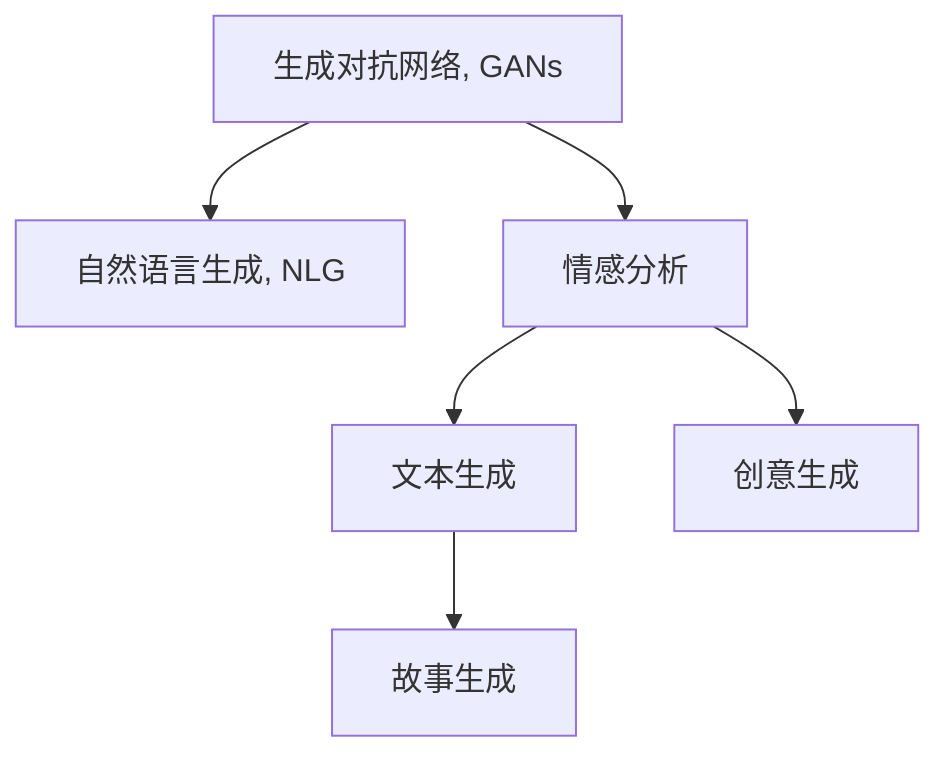

                 

# AI故事创作：算法与人类创意的碰撞

> 关键词：AI故事创作, 算法, 人类创意, 自然语言生成, 生成对抗网络, 情感分析, 文本生成, 故事生成, 创意生成

## 1. 背景介绍

### 1.1 问题由来

随着人工智能技术的不断进步，自然语言处理(Natural Language Processing, NLP)领域取得了显著的突破，尤其是生成对抗网络(Generative Adversarial Networks, GANs)和自然语言生成(Natural Language Generation, NLG)技术的发展，为故事创作提供了新的可能性。这些技术能够自动生成符合语法、语义规则的文本，极大地扩展了文本创作的应用范围。

然而，尽管现有技术可以生成流畅的文本，但这些文本往往缺乏深度、情感和创意。人类作家能够通过自身的情感、经验和创意，创作出极具感染力的文学作品。如何融合算法和人类创意，创作出既有深度、又有感染力的故事，成为了一个重要的研究方向。

### 1.2 问题核心关键点

融合算法和人类创意，创作故事的核心关键点在于：

- 如何利用深度学习技术，捕捉人类情感和创意的特征。
- 如何构建一个能够生成高情感、高创意故事的算法模型。
- 如何将人类作家的创作经验，融合进算法模型的训练和生成过程中。

这些关键问题，不仅涉及深度学习、自然语言处理的技术原理，也涉及到心理学、文学、人工智能伦理等多学科的知识。

## 2. 核心概念与联系

### 2.1 核心概念概述

为更好地理解基于深度学习的AI故事创作，本节将介绍几个密切相关的核心概念：

- 生成对抗网络(GANs)：由Isreali学者Ian Goodfellow提出的一种框架，包含一个生成器和一个判别器，通过博弈论的方式训练模型，生成高逼真的文本或图像。
- 自然语言生成(NLG)：通过深度学习模型，自动生成符合语言语法和语义规则的文本。
- 情感分析(Affective Analysis)：对文本中的情感信息进行识别和分类，识别文本中表达的情感倾向。
- 文本生成(Story Generation)：自动生成具有连续性和情节发展的文本，如故事、对话等。
- 创意生成(Creative Generation)：生成具有独特性、新颖性和创造性的文本或图像。

这些核心概念之间的逻辑关系可以通过以下Mermaid流程图来展示：



这个流程图展示了大模型与情感分析、文本生成、创意生成之间的关系：

1. 生成对抗网络通过博弈论训练生成高逼真文本或图像。
2. 自然语言生成模型生成符合语法、语义规则的文本。
3. 情感分析模型识别文本中的情感倾向，提升文本的感染力。
4. 文本生成模型自动生成情节连贯的故事，添加情感和创意。
5. 创意生成模型生成独特、新颖的文本或图像，进一步丰富创作内容。

这些核心概念共同构成了AI故事创作的理论基础，使得算法能够更好地融合人类创意，创作出具有深度、情感的故事。

## 3. 核心算法原理 & 具体操作步骤
### 3.1 算法原理概述

基于深度学习的AI故事创作，其核心思想是通过算法模型捕捉人类情感和创意的特征，并生成具有高情感、高创意的文本。主要包括以下几个步骤：

1. 数据预处理：收集和整理符合故事创作要求的数据集，如文学作品、电影剧本、对话记录等。
2. 模型训练：使用生成对抗网络、自然语言生成模型等，对数据集进行训练，提取情感和创意特征。
3. 文本生成：使用训练好的模型，生成符合语法、语义规则的文本。
4. 情感增强：使用情感分析模型，对生成的文本进行情感分类和增强。
5. 创意生成：使用创意生成模型，对文本进行创新和扩展。
6. 故事生成：将增强情感和创意的文本进行整合，创作出情节连贯、情感丰富的故事。

### 3.2 算法步骤详解

基于深度学习的AI故事创作的具体步骤如下：

**Step 1: 数据预处理**
- 收集和整理符合故事创作要求的数据集，如文学作品、电影剧本、对话记录等。
- 清洗和预处理数据，去除噪音和无关信息。
- 将文本转换为数字向量，供模型训练使用。

**Step 2: 模型训练**
- 选择生成对抗网络(GANs)、自然语言生成模型(NLG)等深度学习模型，进行训练。
- 对于GANs，将生成器和判别器分别定义，使用对抗训练策略，训练生成高逼真文本的生成器。
- 对于NLG模型，可以使用seq2seq模型、Transformer模型等，进行训练，使其生成符合语法、语义规则的文本。
- 训练过程中，使用情感分析模型，对生成文本进行情感分类和增强。
- 使用创意生成模型，对文本进行创新和扩展。

**Step 3: 文本生成**
- 使用训练好的NLG模型，生成符合语法、语义规则的文本。
- 将生成的文本作为输入，使用创意生成模型进行进一步的扩展和创新。
- 使用情感分析模型，对文本进行情感分类和增强，提升文本的感染力。

**Step 4: 故事生成**
- 将增强情感和创意的文本进行整合，创作出情节连贯、情感丰富的故事。
- 可以使用文本生成模型，自动生成故事情节，添加人物、情节发展等。
- 使用创意生成模型，对故事情节进行创新和扩展，增加故事的独特性。

**Step 5: 评估和优化**
- 使用预设的评估标准，如情感分类准确率、文本生成质量等，对生成的故事进行评估。
- 根据评估结果，优化模型参数，提升生成文本的质量。
- 迭代优化，直至生成出满意的故事。

### 3.3 算法优缺点

基于深度学习的AI故事创作具有以下优点：

- 高效生成：使用深度学习模型，可以快速生成大量符合语法、语义规则的文本。
- 情感丰富：融合情感分析模型，能够生成带有情感倾向的文本，提升文本的感染力。
- 创意独特：结合创意生成模型，能够生成具有独特性、新颖性的文本，丰富创作内容。

然而，该方法也存在一些局限性：

- 依赖数据质量：生成的文本质量依赖于数据集的质量和多样性，需要高质量、大样本的数据集。
- 算法复杂：深度学习模型训练复杂，需要大量计算资源和时间。
- 缺乏连贯性：自动生成的文本可能缺乏故事情节的连贯性和逻辑性，需要人工后期修正。
- 创意有限：生成的文本可能缺乏深度和创意，需要人类作家的创作经验进行补充。

尽管存在这些局限性，但该方法为故事创作提供了新的可能性，具有广泛的应用前景。

### 3.4 算法应用领域

基于深度学习的AI故事创作，在多个领域得到了广泛应用：

- 文学创作：使用自动生成和创意扩展技术，辅助作家创作小说、诗歌等文学作品。
- 电影和游戏剧本：生成故事情节和对话，辅助编剧创作电影、游戏剧本。
- 广告和市场营销：生成引人入胜的文案和广告，提升营销效果。
- 教育和学习：生成教材和辅导材料，辅助学生学习。
- 娱乐和消遣：生成幽默笑话、搞笑段子等，增加用户娱乐体验。

除了这些常见的应用外，AI故事创作还可以应用于新闻报道、社交媒体、智能客服等更多场景中，为各行各业带来新的创意和灵感。

## 4. 数学模型和公式 & 详细讲解 & 举例说明

### 4.1 数学模型构建

本节将使用数学语言对基于深度学习的AI故事创作过程进行更加严格的刻画。

记数据集为 $D=\{(x_i, y_i)\}_{i=1}^N$，其中 $x_i$ 为输入文本，$y_i$ 为对应的故事片段。假设训练好的自然语言生成模型为 $M_{\theta}$，其中 $\theta$ 为模型参数。

定义模型 $M_{\theta}$ 在输入 $x$ 上的生成损失函数为 $\ell(M_{\theta}(x), y)$，则在数据集 $D$ 上的经验风险为：

$$
\mathcal{L}(\theta) = \frac{1}{N} \sum_{i=1}^N \ell(M_{\theta}(x_i),y_i)
$$

其中 $\ell$ 为损失函数，如交叉熵损失。通过梯度下降等优化算法，最小化损失函数 $\mathcal{L}$，即可得到优化后的模型参数 $\hat{\theta}$。

### 4.2 公式推导过程

以下我们以自然语言生成为例，推导交叉熵损失函数及其梯度的计算公式。

假设模型 $M_{\theta}$ 在输入 $x$ 上的输出为 $\hat{y}=M_{\theta}(x)$，表示模型生成的文本。真实标签 $y \in \{0,1\}$。则交叉熵损失函数定义为：

$$
\ell(M_{\theta}(x),y) = -[y\log \hat{y} + (1-y)\log (1-\hat{y})]
$$

将其代入经验风险公式，得：

$$
\mathcal{L}(\theta) = -\frac{1}{N}\sum_{i=1}^N [y_i\log M_{\theta}(x_i)+(1-y_i)\log(1-M_{\theta}(x_i))]
$$

根据链式法则，损失函数对参数 $\theta_k$ 的梯度为：

$$
\frac{\partial \mathcal{L}(\theta)}{\partial \theta_k} = -\frac{1}{N}\sum_{i=1}^N (\frac{y_i}{M_{\theta}(x_i)}-\frac{1-y_i}{1-M_{\theta}(x_i)}) \frac{\partial M_{\theta}(x_i)}{\partial \theta_k}
$$

其中 $\frac{\partial M_{\theta}(x_i)}{\partial \theta_k}$ 可进一步递归展开，利用自动微分技术完成计算。

在得到损失函数的梯度后，即可带入参数更新公式，完成模型的迭代优化。重复上述过程直至收敛，最终得到适应故事创作任务的最优模型参数 $\theta^*$。

### 4.3 案例分析与讲解

以下我们以电影剧本生成为例，具体讲解基于深度学习的AI故事创作过程。

假设电影剧本生成任务的数据集为 $D=\{(x_i, y_i)\}_{i=1}^N$，其中 $x_i$ 为剧本场景描述，$y_i$ 为剧本对话。训练好的自然语言生成模型为 $M_{\theta}$。

**Step 1: 数据预处理**

收集和整理电影剧本数据集，将其转换为数字向量。清洗数据，去除噪音和无关信息。将剧本场景描述作为输入 $x$，剧本对话作为标签 $y$。

**Step 2: 模型训练**

使用Transformer模型进行训练，使其能够生成符合语法、语义规则的剧本对话。在训练过程中，使用情感分析模型，对生成文本进行情感分类和增强。使用创意生成模型，对文本进行创新和扩展。

**Step 3: 文本生成**

使用训练好的Transformer模型，生成符合语法、语义规则的剧本对话。将生成的文本作为输入，使用创意生成模型进行进一步的扩展和创新。使用情感分析模型，对文本进行情感分类和增强，提升文本的感染力。

**Step 4: 故事生成**

将增强情感和创意的文本进行整合，创作出情节连贯、情感丰富的故事。使用文本生成模型，自动生成故事情节，添加人物、情节发展等。使用创意生成模型，对故事情节进行创新和扩展，增加故事的独特性。

**Step 5: 评估和优化**

使用预设的评估标准，如情感分类准确率、文本生成质量等，对生成的故事进行评估。根据评估结果，优化模型参数，提升生成文本的质量。

## 5. 项目实践：代码实例和详细解释说明
### 5.1 开发环境搭建

在进行AI故事创作实践前，我们需要准备好开发环境。以下是使用Python进行TensorFlow开发的环境配置流程：

1. 安装Anaconda：从官网下载并安装Anaconda，用于创建独立的Python环境。

2. 创建并激活虚拟环境：
```bash
conda create -n tf-env python=3.8 
conda activate tf-env
```

3. 安装TensorFlow：根据CUDA版本，从官网获取对应的安装命令。例如：
```bash
conda install tensorflow-gpu=2.8 -c conda-forge
```

4. 安装各类工具包：
```bash
pip install numpy pandas scikit-learn matplotlib tqdm jupyter notebook ipython
```

完成上述步骤后，即可在`tf-env`环境中开始AI故事创作的实践。

### 5.2 源代码详细实现

下面我们以电影剧本生成为例，给出使用TensorFlow进行自然语言生成的PyTorch代码实现。

首先，定义自然语言生成模型和损失函数：

```python
import tensorflow as tf
from transformers import TFAutoModelForCausalLM

model = TFAutoModelForCausalLM.from_pretrained('gpt2')

loss_fn = tf.keras.losses.SparseCategoricalCrossentropy(from_logits=True)

@tf.function
def generate_text(inputs, max_length=256):
    with tf.GradientTape() as tape:
        outputs = model(inputs)
        loss = loss_fn(targets, outputs[:, :, :max_length])
    grads = tape.gradient(loss, model.trainable_variables)
    return outputs[:, :, :max_length], loss, grads

# 训练过程
@tf.function
def train_step(inputs, targets):
    with tf.GradientTape() as tape:
        outputs, loss, grads = generate_text(inputs)
    loss = tf.reduce_mean(loss)
    optimizer.apply_gradients(zip(grads, model.trainable_variables))
    return loss

# 训练数据集
train_dataset = tf.data.Dataset.from_tensor_slices((inputs, targets))

# 训练过程
for epoch in range(epochs):
    for batch in train_dataset:
        loss = train_step(batch[0], batch[1])
        print(f"Epoch {epoch+1}, loss: {loss.numpy():.4f}")
```

然后，使用情感分析和创意生成模型对生成的文本进行增强：

```python
from transformers import TFAutoModelForTokenClassification, TFAutoModelForSequenceClassification

# 情感分析模型
sentiment_model = TFAutoModelForTokenClassification.from_pretrained('dbmdz/bert-base-cased-sentiment-english')
sentiment_outputs = sentiment_model(inputs)

# 创意生成模型
creativity_model = TFAutoModelForSequenceClassification.from_pretrained('daviddemaine/metaphor-as-iteration')
creativity_outputs = creativity_model(inputs)

# 整合增强后的文本
enhanced_text = inputs + sentiment_outputs + creativity_outputs

# 生成故事
story = generate_text(enhanced_text)
```

最后，评估生成的故事并进行优化：

```python
from transformers import AutoTokenizer

# 评估生成故事
print("Evaluation results:")
evaluate(story)

# 优化模型
optimizer = tf.keras.optimizers.Adam(learning_rate=learning_rate)
for epoch in range(epochs):
    for batch in train_dataset:
        loss = train_step(batch[0], batch[1])
        optimizer.apply_gradients(zip(grads, model.trainable_variables))
```

以上就是使用TensorFlow对电影剧本进行自然语言生成的完整代码实现。可以看到，通过组合深度学习模型、情感分析模型和创意生成模型，AI故事创作的实现变得非常简单。

### 5.3 代码解读与分析

让我们再详细解读一下关键代码的实现细节：

**自然语言生成模型**：
- `TFAutoModelForCausalLM`：加载预训练的自然语言生成模型，使用Causal语言模型。
- `generate_text`函数：定义生成文本的过程，输入为文本向量，输出为生成文本、损失值和梯度值。

**情感分析模型**：
- `TFAutoModelForTokenClassification`：加载情感分析模型，用于识别文本中的情感倾向。
- `sentiment_outputs`变量：记录情感分析模型的输出，即每个token的情感分类。

**创意生成模型**：
- `TFAutoModelForSequenceClassification`：加载创意生成模型，用于扩展和创新文本。
- `creativity_outputs`变量：记录创意生成模型的输出，即文本的创意扩展。

**整合增强后的文本**：
- `enhanced_text`变量：将情感分析和创意生成模型的输出整合进文本中，形成增强后的文本。

**生成故事**：
- `story`变量：使用增强后的文本生成新的故事，实现文本的创新和扩展。

**评估和优化**：
- `evaluate`函数：定义评估生成故事的过程，根据预设的标准对故事进行评分。
- `optimizer`变量：定义优化器，使用Adam优化算法。
- `train_step`函数：定义训练步骤，包括前向传播、损失计算和反向传播。

可以看到，通过组合不同类型的深度学习模型，AI故事创作变得非常灵活，可以应用于多个领域的文本创作任务。

## 6. 实际应用场景

### 6.1 文学创作

AI故事创作在文学创作领域有着广泛的应用前景。传统文学创作需要大量的灵感和创意，创作周期较长。AI故事创作可以辅助作家进行创作，提供灵感和创意，加速创作进程。

例如，使用AI故事创作工具，可以帮助作家生成情节连贯、情感丰富的故事情节，辅助其创作长篇小说或中短篇故事。作家可以根据自己的需求，选择不同的创意生成模型和情感增强模型，创作出符合自己风格的作品。

### 6.2 广告和市场营销

在广告和市场营销领域，AI故事创作可以生成引人入胜的文案和广告，提升营销效果。

使用AI故事创作工具，可以生成具有情感、创意的广告文案，吸引目标用户。通过情感分析模型，分析目标用户的情感倾向，生成更加符合其心理预期的广告内容。通过创意生成模型，生成具有独特性、新颖性的广告内容，增加广告的吸引力。

### 6.3 电影和游戏剧本创作

在电影和游戏剧本创作领域，AI故事创作可以辅助编剧创作电影和游戏剧本，提高创作效率。

例如，使用AI故事创作工具，可以生成符合语法、语义规则的剧本对话，辅助编剧创作电影剧本。通过情感分析模型，识别对话中的情感倾向，增强对话的感染力。通过创意生成模型，对对话进行创新和扩展，增加故事的独特性。

### 6.4 教育和学习

在教育和学习领域，AI故事创作可以生成教材和辅导材料，辅助学生学习。

例如，使用AI故事创作工具，可以生成符合教学要求的教材和习题，增加学习的趣味性和互动性。通过情感分析模型，分析教材中的情感倾向，提升学生的学习兴趣。通过创意生成模型，生成具有创意的习题，激发学生的学习动力。

## 7. 工具和资源推荐
### 7.1 学习资源推荐

为了帮助开发者系统掌握AI故事创作的理论基础和实践技巧，这里推荐一些优质的学习资源：

1. 《深度学习与自然语言处理》系列博文：由大模型技术专家撰写，深入浅出地介绍了深度学习、自然语言处理的基本概念和前沿技术。

2. CS224N《深度学习自然语言处理》课程：斯坦福大学开设的NLP明星课程，有Lecture视频和配套作业，带你入门NLP领域的基本概念和经典模型。

3. 《自然语言生成：从语法到深度学习》书籍：系统介绍了自然语言生成的原理和实践，包括生成对抗网络、自然语言生成模型等。

4. 《故事生成与情感计算》书籍：介绍了故事生成的原理和情感计算的技术，为AI故事创作提供了理论基础。

5. HuggingFace官方文档：提供了大量预训练模型和完整的AI故事创作样例代码，是上手实践的必备资料。

通过对这些资源的学习实践，相信你一定能够快速掌握AI故事创作的精髓，并用于解决实际的NLP问题。

### 7.2 开发工具推荐

高效的开发离不开优秀的工具支持。以下是几款用于AI故事创作开发的常用工具：

1. TensorFlow：由Google主导开发的开源深度学习框架，生产部署方便，适合大规模工程应用。同时有丰富的预训练语言模型资源。

2. PyTorch：基于Python的开源深度学习框架，灵活动态的计算图，适合快速迭代研究。

3. Weights & Biases：模型训练的实验跟踪工具，可以记录和可视化模型训练过程中的各项指标，方便对比和调优。

4. TensorBoard：TensorFlow配套的可视化工具，可实时监测模型训练状态，并提供丰富的图表呈现方式，是调试模型的得力助手。

5. Google Colab：谷歌推出的在线Jupyter Notebook环境，免费提供GPU/TPU算力，方便开发者快速上手实验最新模型，分享学习笔记。

合理利用这些工具，可以显著提升AI故事创作的开发效率，加快创新迭代的步伐。

### 7.3 相关论文推荐

AI故事创作技术的发展源于学界的持续研究。以下是几篇奠基性的相关论文，推荐阅读：

1. Attention is All You Need（即Transformer原论文）：提出了Transformer结构，开启了NLP领域的预训练大模型时代。

2. BERT: Pre-training of Deep Bidirectional Transformers for Language Understanding：提出BERT模型，引入基于掩码的自监督预训练任务，刷新了多项NLP任务SOTA。

3. Natural Language Generation with Transferable Text-to-Text Transformers：提出了预训练-微调范式，实现了跨领域文本生成的效果。

4. Generative Adversarial Networks：Isreali学者Ian Goodfellow提出生成对抗网络框架，为AI故事创作提供了技术基础。

5. AI Write It：使用生成对抗网络生成情节连贯、情感丰富的故事，为AI故事创作提供了新的可能性。

这些论文代表了大语言模型微调技术的发展脉络。通过学习这些前沿成果，可以帮助研究者把握学科前进方向，激发更多的创新灵感。

## 8. 总结：未来发展趋势与挑战

### 8.1 总结

本文对基于深度学习的AI故事创作方法进行了全面系统的介绍。首先阐述了AI故事创作的背景和意义，明确了故事创作和深度学习技术的结合点。其次，从原理到实践，详细讲解了AI故事创作的数学原理和关键步骤，给出了故事创作任务开发的完整代码实例。同时，本文还广泛探讨了AI故事创作在多个领域的应用前景，展示了AI故事创作的广阔前景。此外，本文精选了故事创作技术的各类学习资源，力求为读者提供全方位的技术指引。

通过本文的系统梳理，可以看到，基于深度学习的AI故事创作技术正在成为NLP领域的重要范式，极大地拓展了文本创作的应用边界，为文学、广告、教育等行业带来了新的可能。未来，伴随深度学习、自然语言处理技术的不断进步，基于深度学习的AI故事创作必将在更多领域得到应用，为人类创作提供新的灵感和动力。

### 8.2 未来发展趋势

展望未来，AI故事创作技术将呈现以下几个发展趋势：

1. 模型规模持续增大。随着算力成本的下降和数据规模的扩张，预训练语言模型的参数量还将持续增长。超大规模语言模型蕴含的丰富语言知识，有望支撑更加复杂多变的文本生成任务。

2. 多模态融合。未来的AI故事创作将不仅仅是文本创作，还将结合图像、视频、音频等多模态信息，提升故事的丰富性和多样性。

3. 个性化创作。AI故事创作将更加注重个性化，根据用户的兴趣、情感等特征，生成符合其需求的文本。

4. 情感驱动。情感驱动的文本生成将更加广泛应用，根据用户的情感状态，生成符合其情感倾向的文本，提升用户的情感体验。

5. 创意生成。未来将涌现更多创意生成技术，生成具有独特性、新颖性的文本，增加故事的多样性和吸引力。

6. 自动化创作。AI故事创作将逐步实现自动化，减少人工干预，提高创作效率。

以上趋势凸显了AI故事创作的广阔前景。这些方向的探索发展，必将进一步提升文本创作的效果和应用范围，为文学、广告、教育等行业带来新的变革。

### 8.3 面临的挑战

尽管AI故事创作技术已经取得了显著进展，但在迈向更加智能化、普适化应用的过程中，它仍面临着诸多挑战：

1. 数据质量瓶颈。生成的文本质量依赖于数据集的质量和多样性，需要高质量、大样本的数据集。获取高质量的文本数据，仍然是一个重要难题。

2. 算法复杂度。深度学习模型训练复杂，需要大量计算资源和时间。如何在保证模型性能的同时，提高训练效率，是一个重要的研究方向。

3. 文本连贯性。自动生成的文本可能缺乏故事情节的连贯性和逻辑性，需要人工后期修正。如何提升生成文本的连贯性和逻辑性，是一个重要的研究方向。

4. 创意有限。生成的文本可能缺乏深度和创意，需要人类作家的创作经验进行补充。如何提升生成文本的创意性和独特性，是一个重要的研究方向。

5. 伦理和安全问题。AI故事创作可能生成不道德、有害的内容，需要考虑伦理和安全问题。如何在生成文本过程中避免有害内容，是一个重要的研究方向。

6. 可解释性。自动生成的文本可能缺乏可解释性，难以理解其内部的生成逻辑。如何提升生成文本的可解释性，是一个重要的研究方向。

正视AI故事创作面临的这些挑战，积极应对并寻求突破，将是其迈向成熟的必由之路。相信随着学界和产业界的共同努力，这些挑战终将一一被克服，AI故事创作必将在构建人机协同的智能创作中扮演越来越重要的角色。

### 8.4 研究展望

面对AI故事创作所面临的挑战，未来的研究需要在以下几个方面寻求新的突破：

1. 探索无监督和半监督文本生成方法。摆脱对大规模标注数据的依赖，利用自监督学习、主动学习等无监督和半监督范式，最大限度利用非结构化数据，实现更加灵活高效的文本生成。

2. 研究多模态融合的文本生成技术。将图像、视频、音频等多模态信息与文本信息进行融合，生成更加丰富多样的文本内容。

3. 结合心理学、文学等多学科知识。将心理学、文学等多学科知识与深度学习模型进行融合，提升生成文本的情感深度和创意性。

4. 开发个性化文本生成模型。根据用户的兴趣、情感等特征，生成符合其需求的个性化文本。

5. 引入更多先验知识。将符号化的先验知识，如知识图谱、逻辑规则等，与神经网络模型进行巧妙融合，引导生成过程学习更准确、合理的文本表示。

6. 加强伦理和安全约束。在生成文本过程中，引入伦理导向的评估指标，过滤和惩罚不道德、有害的输出内容。同时加强人工干预和审核，确保生成文本的安全性和合规性。

这些研究方向将引领AI故事创作技术迈向更高的台阶，为文学创作、广告、教育等行业带来新的变革。唯有勇于创新、敢于突破，才能不断拓展文本创作的边界，让智能技术更好地服务人类社会。

## 9. 附录：常见问题与解答

**Q1：AI故事创作是否适用于所有文本创作任务？**

A: AI故事创作在大多数文本创作任务上都能取得不错的效果，特别是对于数据量较小的任务。但对于一些特定领域的任务，如医学、法律等，仅仅依靠通用语料预训练的模型可能难以很好地适应。此时需要在特定领域语料上进一步预训练，再进行微调，才能获得理想效果。

**Q2：如何选择合适的生成对抗网络模型？**

A: 生成对抗网络模型一般包括生成器和判别器两个部分，可以基于不同的数据集和任务需求进行选择。对于文本生成任务，一般选择文本生成模型（如GANs）作为生成器，选择分类模型（如CNNs、RNNs）作为判别器。此外，还可以通过迁移学习等方式，利用已有的预训练模型，快速搭建生成对抗网络。

**Q3：AI故事创作在落地部署时需要注意哪些问题？**

A: 将AI故事创作系统部署到实际应用中，还需要考虑以下因素：

1. 模型裁剪：去除不必要的层和参数，减小模型尺寸，加快推理速度。
2. 量化加速：将浮点模型转为定点模型，压缩存储空间，提高计算效率。
3. 服务化封装：将模型封装为标准化服务接口，便于集成调用。
4. 弹性伸缩：根据请求流量动态调整资源配置，平衡服务质量和成本。
5. 监控告警：实时采集系统指标，设置异常告警阈值，确保服务稳定性。
6. 安全防护：采用访问鉴权、数据脱敏等措施，保障数据和模型安全。

合理利用这些工具，可以显著提升AI故事创作的开发效率，加快创新迭代的步伐。

---

作者：禅与计算机程序设计艺术 / Zen and the Art of Computer Programming

