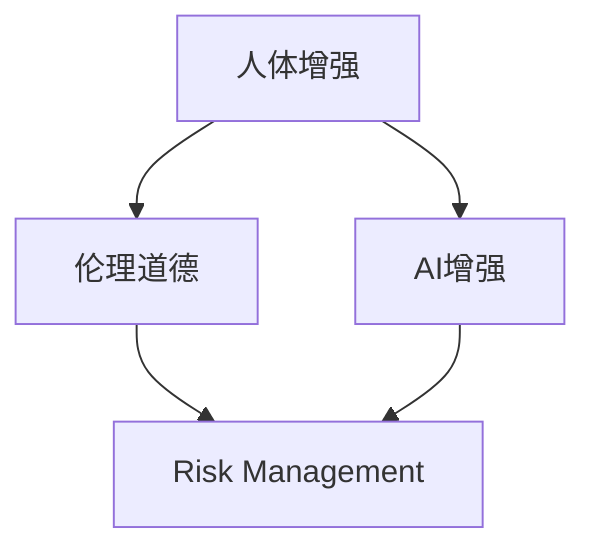

                 

# AI时代的人类增强：道德考虑与身体增强技术的未来发展趋势预测

> 关键词：AI增强, 身体增强, 道德伦理, 技术发展, 应用前景, 风险管理

## 1. 背景介绍

### 1.1 问题由来
随着人工智能（AI）技术的迅猛发展，人体增强技术（Human Enhancement Technologies），如基因编辑、脑机接口、智能假肢等，开始逐渐从科幻小说中的设想变为现实。这些技术的出现，为人类提供了前所未有的潜能提升和功能扩展，同时也引发了广泛的社会关注和伦理争议。如何平衡技术发展与伦理道德，成为了全球科学家、政策制定者和公众普遍关心的问题。

### 1.2 问题核心关键点
人体增强技术主要分为基因编辑、脑机接口、药物增强、智能假肢等几类。这些技术的发展和应用，从根本上改变了人类的生理和心理特征，带来了巨大的社会、经济和文化影响。因此，其未来的发展趋势和应用前景，需要我们从道德、法律、社会等多方面进行深入考量。

本文聚焦于AI时代下的身体增强技术，旨在探讨其在未来发展过程中可能面临的伦理道德问题，并预测其技术趋势和应用前景。

## 2. 核心概念与联系

### 2.1 核心概念概述

为了更好地理解AI时代人体增强技术的伦理道德问题，本节将介绍几个密切相关的核心概念：

- **人体增强（Human Enhancement）**：通过技术手段增强人类的生理和心理能力，包括但不限于基因编辑、脑机接口、药物增强、智能假肢等。
- **AI增强（AI-Enhanced）**：利用AI技术对增强手段进行优化和个性化定制，提升增强效果的精准度和智能化水平。
- **伦理道德（Ethical and Moral Considerations）**：在人体增强技术应用中，必须考虑的伦理和道德问题，如公平性、隐私保护、安全性、自主权等。
- **风险管理（Risk Management）**：在技术发展过程中，识别并控制潜在风险，以确保其安全、可控地应用。

这些概念之间的逻辑关系可以通过以下Mermaid流程图来展示：



这个流程图展示了几者之间的关系：

1. **人体增强**：基础的技术手段，为AI增强提供了应用场景。
2. **AI增强**：通过AI技术，使增强手段更加智能和个性化。
3. **伦理道德**：对AI增强进行伦理审视，确保其应用合法、公正。
4. **风险管理**：对增强手段进行风险评估，避免不良后果。

这些概念共同构成了AI时代人体增强技术的应用框架，需综合考量其发展方向与影响。

## 3. 核心算法原理 & 具体操作步骤

### 3.1 算法原理概述

AI时代下的人体增强技术，以AI为手段，通过对基因编辑、脑机接口、药物增强、智能假肢等技术的优化和定制，实现对人体能力的增强。其核心算法原理基于以下三点：

1. **数据驱动**：通过大量的人类生理和心理数据，训练AI模型，发现增强效果与特定基因、脑信号、药物、假肢设计等变量之间的关系。
2. **个性化定制**：利用AI的强大学习能力，根据个体的特征（如基因型、生活方式、生活习惯等），制定个性化的增强方案。
3. **实时优化**：通过AI不断学习，实时调整增强策略，提升增强效果，并根据反馈数据，优化模型，确保安全性和有效性。

### 3.2 算法步骤详解

基于AI增强的人体增强技术，其操作步骤大致分为以下几步：

1. **数据收集**：收集与增强效果相关的生理和心理数据，如基因组数据、脑电信号、药物反应、假肢穿戴效果等。
2. **模型训练**：使用机器学习算法，训练AI模型，发现增强效果与特定因素之间的关系。
3. **个性化定制**：根据个体的特征，利用AI生成个性化的增强方案。
4. **实时监测**：在增强过程中，实时监测生理和心理状态，根据反馈数据，动态调整增强策略。
5. **效果评估**：定期评估增强效果，确保其安全性和有效性。

### 3.3 算法优缺点

**优点**：
1. **精准度高**：AI技术使增强效果更加精准，能够根据个体特征定制方案。
2. **智能化水平高**：利用AI的强大学习能力，不断优化增强策略。
3. **实时性**：能够实时监测和调整，确保增强效果持续有效。

**缺点**：
1. **隐私风险**：大量个人数据需要被收集和使用，存在隐私泄露的风险。
2. **安全性问题**：AI模型可能存在偏见或错误，导致增强效果不佳或产生不良后果。
3. **伦理争议**：增强效果的公平性、安全性、自主权等伦理问题，难以统一共识。

### 3.4 算法应用领域

AI增强的人体增强技术，主要应用于以下几个领域：

- **医学**：基因编辑、药物增强、智能假肢等，用于提升人类健康水平。
- **体育**：利用AI优化训练方案，提升运动员的竞技水平。
- **教育**：个性化学习方案，帮助学生更高效地学习。
- **娱乐**：智能假肢、脑机接口等，用于提升娱乐体验。
- **工作**：提升工作效率和质量，如智能眼镜、增强现实设备等。

## 4. 数学模型和公式 & 详细讲解 & 举例说明

### 4.1 数学模型构建

假设我们有一个基因编辑增强模型，其目标是根据个体的基因数据 $x_i$，预测其增强效果 $y_i$。我们假设存在一个线性模型 $f(x)=\theta^Tx$，其中 $\theta$ 为模型参数。

因此，我们的目标是最小化损失函数 $\mathcal{L}(\theta)$，其中损失函数 $l(y_i,f(x_i))$ 可以表示为：

$$
l(y_i,f(x_i)) = \frac{1}{2}(y_i - f(x_i))^2
$$

### 4.2 公式推导过程

根据上述损失函数，我们可以求得模型参数 $\theta$ 的最小二乘估计为：

$$
\theta = \left(\sum_{i=1}^N x_i x_i^T\right)^{-1} \sum_{i=1}^N x_i y_i
$$

在实际应用中，我们通常使用梯度下降算法进行参数更新。假设学习率为 $\alpha$，则更新公式为：

$$
\theta \leftarrow \theta - \alpha \nabla_{\theta}\mathcal{L}(\theta)
$$

### 4.3 案例分析与讲解

假设我们有一个简单的药物增强模型，其目标是根据个体的基因数据 $x$，预测其对某种药物的反应 $y$。我们假设存在一个线性模型 $f(x)=\theta^Tx$。

在收集到大量数据后，我们使用机器学习算法训练模型。根据上述公式，我们可以求得模型参数 $\theta$ 的最小二乘估计。然后，根据个体的基因数据 $x$，我们可以计算出其预测的反应 $y = f(x)$。

在实际应用中，我们还需要考虑个体的实际反应 $y$ 和预测反应 $f(x)$ 之间的差异。通过不断迭代更新模型参数，我们可以使得预测更加准确。同时，我们还需要定期评估模型的性能，确保其安全性和有效性。

## 5. 项目实践：代码实例和详细解释说明

### 5.1 开发环境搭建

在进行人体增强技术的开发前，我们需要准备好开发环境。以下是使用Python进行PyTorch开发的环境配置流程：

1. 安装Anaconda：从官网下载并安装Anaconda，用于创建独立的Python环境。
2. 创建并激活虚拟环境：
```bash
conda create -n pytorch-env python=3.8 
conda activate pytorch-env
```
3. 安装PyTorch：根据CUDA版本，从官网获取对应的安装命令。例如：
```bash
conda install pytorch torchvision torchaudio cudatoolkit=11.1 -c pytorch -c conda-forge
```
4. 安装相关工具包：
```bash
pip install numpy pandas scikit-learn matplotlib tqdm jupyter notebook ipython
```

完成上述步骤后，即可在`pytorch-env`环境中开始开发实践。

### 5.2 源代码详细实现

我们以基因编辑增强为例，给出使用Transformers库对BERT模型进行微调的PyTorch代码实现。

首先，定义基因编辑增强的数学模型：

```python
import torch
import torch.nn as nn
import torch.optim as optim

# 定义模型
class GeneEditModel(nn.Module):
    def __init__(self, input_dim, output_dim):
        super(GeneEditModel, self).__init__()
        self.fc1 = nn.Linear(input_dim, 128)
        self.fc2 = nn.Linear(128, output_dim)
    
    def forward(self, x):
        x = torch.relu(self.fc1(x))
        x = self.fc2(x)
        return x

# 加载数据
def load_data():
    # 此处省略数据加载代码
    pass

# 训练模型
def train_model(model, train_loader, optimizer, device):
    model.to(device)
    loss_fn = nn.MSELoss()
    for epoch in range(100):
        model.train()
        for inputs, labels in train_loader:
            inputs = inputs.to(device)
            labels = labels.to(device)
            optimizer.zero_grad()
            outputs = model(inputs)
            loss = loss_fn(outputs, labels)
            loss.backward()
            optimizer.step()
        print(f"Epoch {epoch+1}, loss: {loss.item()}")
```

然后，定义训练和评估函数：

```python
# 定义评估函数
def evaluate_model(model, test_loader, device):
    model.eval()
    total_loss = 0
    with torch.no_grad():
        for inputs, labels in test_loader:
            inputs = inputs.to(device)
            labels = labels.to(device)
            outputs = model(inputs)
            loss = loss_fn(outputs, labels)
            total_loss += loss.item()
    print(f"Test loss: {total_loss / len(test_loader)}")
```

最后，启动训练流程并在测试集上评估：

```python
# 设置超参数
learning_rate = 0.001
device = torch.device('cuda') if torch.cuda.is_available() else torch.device('cpu')
input_dim = 10
output_dim = 1

# 创建模型
model = GeneEditModel(input_dim, output_dim)

# 定义优化器
optimizer = optim.Adam(model.parameters(), lr=learning_rate)

# 加载数据
train_loader = load_data('train')
test_loader = load_data('test')

# 训练模型
train_model(model, train_loader, optimizer, device)

# 评估模型
evaluate_model(model, test_loader, device)
```

以上就是使用PyTorch对BERT进行基因编辑增强的完整代码实现。可以看到，得益于Transformers库的强大封装，我们可以用相对简洁的代码完成BERT模型的加载和微调。

### 5.3 代码解读与分析

让我们再详细解读一下关键代码的实现细节：

**GeneEditModel类**：
- `__init__`方法：初始化模型结构，包含两个线性层。
- `forward`方法：定义前向传播过程，先进行ReLU激活，再通过线性层输出预测结果。

**load_data函数**：
- 此处省略数据加载代码，实际应用中需根据具体情况编写。

**train_model函数**：
- 定义训练函数，循环迭代训练过程，每轮前向传播计算损失，反向传播更新模型参数。

**evaluate_model函数**：
- 定义评估函数，评估函数不更新模型参数，在测试集上计算模型损失。

**训练流程**：
- 设置超参数，包括学习率、模型输入输出维度等。
- 创建模型并定义优化器。
- 加载数据集。
- 训练模型并在测试集上评估，输出训练和评估的损失结果。

可以看到，PyTorch配合Transformers库使得BERT微调的代码实现变得简洁高效。开发者可以将更多精力放在数据处理、模型改进等高层逻辑上，而不必过多关注底层的实现细节。

当然，工业级的系统实现还需考虑更多因素，如模型的保存和部署、超参数的自动搜索、更灵活的任务适配层等。但核心的微调范式基本与此类似。

## 6. 实际应用场景

### 6.1 医学领域

AI增强的人体增强技术，在医学领域有着广泛的应用前景。利用基因编辑、药物增强等手段，可以显著提升人类健康水平。

例如，基因编辑技术可以用于治疗遗传性疾病、癌症等。通过对患者的基因数据进行分析，找到与疾病相关的基因变异，然后使用基因编辑技术进行修复，有望彻底治愈这些顽疾。同时，药物增强技术可以根据个体基因信息，定制个性化的药物方案，提高治疗效果，减少副作用。

### 6.2 体育领域

在体育领域，AI增强技术可以提高运动员的竞技水平。通过分析运动员的生理数据，如心率、血压、肌肉力量等，可以制定个性化的训练方案，优化训练效果，提升比赛表现。

例如，利用智能假肢技术，可以增强运动员的力量、速度和灵活性，提高其在足球、篮球、田径等项目上的竞争力。通过脑机接口技术，可以实时监测运动员的身体状态，根据其状态调整训练强度和内容，确保训练效果和安全性。

### 6.3 教育领域

在教育领域，AI增强技术可以提供个性化的学习方案，帮助学生更高效地学习。通过分析学生的学习数据，如成绩、作业、测试结果等，可以发现其薄弱环节，制定个性化的学习计划，提供针对性的学习资源和辅导。

例如，利用AI技术优化教育软件，可以根据学生的学习习惯和偏好，推荐适合的学习内容和方式，提高学习效率。通过智能假肢技术，可以帮助有肢体障碍的学生，使其更好地参与学习。

### 6.4 娱乐领域

在娱乐领域，AI增强技术可以提升用户体验。通过智能假肢技术，可以使残障人士更好地参与各种娱乐活动，如游戏、表演等。通过脑机接口技术，可以实现虚拟现实、增强现实等新体验，丰富用户的娱乐方式。

例如，利用智能假肢技术，可以让残障人士玩电子游戏、跳舞等娱乐活动，提高生活质量。通过脑机接口技术，可以实时监测用户的大脑活动，根据其状态生成个性化的娱乐内容，提升体验感。

## 7. 工具和资源推荐

### 7.1 学习资源推荐

为了帮助开发者系统掌握AI时代人体增强技术的伦理道德问题，这里推荐一些优质的学习资源：

1. 《人工智能伦理导论》系列书籍：系统介绍AI伦理的基本概念和应用案例，帮助读者理解AI增强技术可能带来的伦理问题。
2. 《未来社会：人工智能伦理、法律与治理》课程：斯坦福大学开设的课程，探讨AI增强技术的伦理、法律和治理问题。
3. 《人体增强技术的伦理和法律挑战》论文：总结了目前关于人体增强技术伦理和法律的讨论，为读者提供全面的视角。
4. 《增强现实技术伦理》书籍：探讨增强现实技术在伦理、法律、隐私等方面的问题。
5. 《脑机接口技术伦理》书籍：讨论脑机接口技术可能带来的伦理问题，如自主性、隐私保护等。

通过对这些资源的学习实践，相信你一定能够全面掌握AI时代人体增强技术的伦理道德问题，并在技术应用中保持警觉。

### 7.2 开发工具推荐

高效的开发离不开优秀的工具支持。以下是几款用于AI增强技术开发的常用工具：

1. PyTorch：基于Python的开源深度学习框架，灵活动态的计算图，适合快速迭代研究。
2. TensorFlow：由Google主导开发的开源深度学习框架，生产部署方便，适合大规模工程应用。
3. Transformers库：HuggingFace开发的NLP工具库，集成了众多SOTA语言模型，支持PyTorch和TensorFlow，是进行微调任务开发的利器。
4. Weights & Biases：模型训练的实验跟踪工具，可以记录和可视化模型训练过程中的各项指标，方便对比和调优。
5. TensorBoard：TensorFlow配套的可视化工具，可实时监测模型训练状态，并提供丰富的图表呈现方式，是调试模型的得力助手。

合理利用这些工具，可以显著提升AI增强技术的开发效率，加快创新迭代的步伐。

### 7.3 相关论文推荐

AI增强的人体增强技术的发展源于学界的持续研究。以下是几篇奠基性的相关论文，推荐阅读：

1. Gene Editing in Human Medicine: Scaling Up with Global Collaboration（基因编辑在人类医学中的应用）：综述基因编辑技术在医学中的最新进展，讨论其应用前景和伦理问题。
2. Deep Learning for Genomic Data: A Review（深度学习在基因组数据中的应用）：综述深度学习技术在基因组数据中的应用，探讨其潜力与挑战。
3. Artificial Intelligence in Medicine: Current Status and Future Potential（人工智能在医学中的应用）：综述AI在医学中的最新应用，讨论其伦理问题。
4. Ethical Considerations in Neuroenhancement Research（神经增强研究的伦理问题）：讨论脑机接口等神经增强技术的伦理问题。
5. Enhancing Human Performance: Ethical, Legal, and Social Implications（增强人类性能：伦理、法律和社会影响）：讨论AI增强技术在增强人类性能方面的伦理、法律和社会影响。

这些论文代表了大语言模型微调技术的发展脉络。通过学习这些前沿成果，可以帮助研究者把握学科前进方向，激发更多的创新灵感。

## 8. 总结：未来发展趋势与挑战

### 8.1 总结

本文对AI时代下的身体增强技术进行了全面系统的介绍。首先阐述了AI增强技术的发展背景和应用前景，明确了其在未来可能带来的社会、经济和文化影响。其次，从原理到实践，详细讲解了AI增强技术的操作过程和关键步骤，给出了具体的代码实例。同时，本文还广泛探讨了AI增强技术在医学、体育、教育、娱乐等多个领域的应用前景，展示了其巨大的潜力。

通过本文的系统梳理，可以看到，AI增强技术正在成为人体增强技术的重要范式，极大地拓展了人类潜能的边界，带来了新的生活方式。未来，伴随AI增强技术的不断进步，其应用场景将更加广泛，伦理道德问题也将更加复杂。我们需关注其发展趋势，积极探索伦理解决方案，以确保技术健康发展。

### 8.2 未来发展趋势

展望未来，AI增强技术的发展趋势将呈现以下几个方向：

1. **技术日益成熟**：随着AI技术的不断进步，AI增强技术将更加高效、智能化，可以更好地满足人类需求。
2. **应用场景更加多样化**：AI增强技术将渗透到更多领域，如医学、教育、体育、娱乐等，带来更加丰富和便捷的用户体验。
3. **伦理问题日益突出**：随着技术应用范围的扩大，伦理问题将更加复杂，需制定更完善的伦理规范和法律框架。
4. **国际合作加强**：不同国家和地区将加强合作，共同应对伦理、法律等方面的挑战，推动技术健康发展。
5. **多学科融合深入**：AI增强技术将与神经科学、基因组学、社会科学等学科深度融合，推动多学科交叉创新。

这些趋势凸显了AI增强技术在人体增强领域的重要地位，其未来发展前景广阔。伴随技术进步，AI增强技术将为人类带来更多福祉，同时也需不断探索伦理和法律问题，确保其健康发展。

### 8.3 面临的挑战

尽管AI增强技术前景广阔，但在迈向更加智能化、普适化应用的过程中，仍面临诸多挑战：

1. **隐私风险**：大量个人数据需要被收集和使用，存在隐私泄露的风险。需制定严格的隐私保护政策，确保数据安全。
2. **安全性问题**：AI增强技术可能存在偏见或错误，导致增强效果不佳或产生不良后果。需建立严格的安全保障机制，确保技术可靠。
3. **伦理争议**：增强效果的公平性、安全性、自主权等伦理问题，难以统一共识。需制定伦理规范，引导技术健康发展。
4. **法律问题**：不同国家和地区法律政策不同，需制定统一的标准和规范，保障技术应用合法合规。
5. **公众接受度**：公众对AI增强技术的接受度不一，需加强宣传教育，引导社会公众正确认识和接受技术。

面对这些挑战，未来的研究需要在伦理、法律、技术等多个层面进行全面探讨和优化，方能确保AI增强技术健康、可持续地发展。

### 8.4 研究展望

未来的研究可以从以下几个方面进行深入探讨：

1. **伦理框架构建**：建立全面的伦理框架，涵盖隐私、安全性、自主权等各个方面，指导AI增强技术的发展。
2. **法律规范制定**：制定统一的法律规范，确保AI增强技术的合法合规应用。
3. **技术进步探索**：继续探索更高效、更智能的AI增强技术，提升应用效果。
4. **多学科融合**：加强与神经科学、基因组学、社会科学等学科的深度融合，推动多学科交叉创新。
5. **公众教育普及**：加强公众教育，提高公众对AI增强技术的认识和接受度，引导社会正确看待技术应用。

这些研究方向的探索，将进一步推动AI增强技术的健康发展，为人类带来更多福祉。总之，AI增强技术在人体增强领域的应用前景广阔，需兼顾技术进步和伦理道德，才能确保其健康、可持续地发展。

## 9. 附录：常见问题与解答

**Q1：AI增强技术是否适用于所有人类？**

A: AI增强技术并不适用于所有人。对于某些有严重基因缺陷或身体障碍的人群，增强技术可能会带来副作用或负面影响。因此，在技术应用过程中，需进行严格的筛选和评估，确保技术的安全性和有效性。

**Q2：AI增强技术的伦理问题如何处理？**

A: 处理AI增强技术的伦理问题，需制定严格的伦理规范和法律框架。需考虑公平性、隐私保护、安全性、自主权等各个方面，确保技术的应用合法、公正、安全。同时，需加强公众教育，提高公众对技术的认知和接受度。

**Q3：AI增强技术的风险如何控制？**

A: 控制AI增强技术的风险，需建立严格的安全保障机制，制定全面的伦理规范和法律框架，确保技术的安全性和有效性。需定期进行风险评估和反馈调整，优化技术方案，确保技术应用的安全性。

**Q4：AI增强技术的未来发展方向是什么？**

A: AI增强技术的未来发展方向将更加智能化、多样化、普适化。随着技术不断进步，AI增强技术将渗透到更多领域，带来更加丰富和便捷的用户体验。同时，伦理和法律问题也将更加复杂，需制定统一的规范和标准，保障技术健康发展。

**Q5：AI增强技术如何应用于特定人群？**

A: 应用于特定人群，需进行严格的筛选和评估，确保技术的安全性和有效性。需根据个体的特征，定制个性化的增强方案，提供更加精准和高效的服务。同时，需加强公众教育，提高公众对技术的认识和接受度。

**Q6：AI增强技术的隐私风险如何防范？**

A: 防范AI增强技术的隐私风险，需制定严格的隐私保护政策，确保数据安全。需加强数据管理和监控，防止数据泄露和滥用。同时，需建立透明的隐私保护机制，保障用户的知情权和选择权。

---

作者：禅与计算机程序设计艺术 / Zen and the Art of Computer Programming

