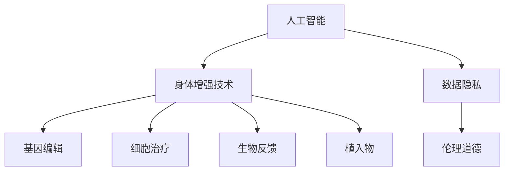

                 

# AI时代的人类增强：道德考虑与身体增强技术的融合发展

> 关键词：人工智能, 增强技术, 道德伦理, 生物工程, 健康管理, 数据隐私

## 1. 背景介绍

### 1.1 问题由来
随着科技的飞速进步，人类社会的方方面面都受到了深刻的影响。人工智能（AI）作为其中的代表，不仅在各行各业中得到了广泛的应用，也引发了人们对未来生活的无限想象。其中，人工智能与生物技术结合产生的身体增强技术，更是吸引了全世界的目光。然而，随着技术的不断发展，关于身体增强技术的伦理问题也日益凸显。如何在AI时代实现人类的全面增强，同时兼顾伦理道德的考量，成为摆在人类面前的重大挑战。

### 1.2 问题核心关键点
身体增强技术通常包括基因编辑、细胞治疗、生物反馈、植入物等，其核心目标在于提升人类的身体机能、延长寿命、改善生活质量等。而AI技术的引入，则使身体增强技术具备了更高的智能化水平，能够通过数据分析、预测模型等方式，更好地实现上述目标。

AI与身体增强技术的融合，不仅包括技术层面的创新，还包括伦理道德、法律法规等方面的探讨。如何确保技术的安全性、有效性，同时兼顾公平性、隐私性等问题，成为AI时代人类增强技术发展的关键。

## 2. 核心概念与联系

### 2.1 核心概念概述

为更好地理解AI时代的人类增强技术，本节将介绍几个密切相关的核心概念：

- 人工智能（AI）：指模拟人类智能行为的计算机技术，包括机器学习、深度学习、自然语言处理等。
- 身体增强技术（Biotechnology Enhancement）：指利用生物技术手段，提升人类身体机能和寿命的技术，如基因编辑、细胞治疗等。
- 基因编辑（Genome Editing）：指通过CRISPR、TALEN等技术，对生物体的基因组进行精确修改，以修复疾病、增强身体机能。
- 细胞治疗（Cell Therapy）：指利用干细胞、免疫细胞等，通过细胞移植、基因修饰等方式，治疗或改善疾病。
- 生物反馈（Biofeedback）：指通过传感器采集人体生理信号，反馈给用户进行行为调整，以达到身心平衡的目的。
- 植入物（Implantable Device）：指通过手术植入体内的电子、机械装置，用于监测、治疗或增强身体功能。
- 数据隐私（Data Privacy）：指个人数据在采集、存储、使用等过程中，保护个人隐私不被泄露的原则。
- 伦理道德（Ethics and Morality）：指在技术应用过程中，遵循人类价值观和社会规范，确保技术发展的正当性和公正性。

这些核心概念之间的逻辑关系可以通过以下Mermaid流程图来展示：



这个流程图展示了大语言模型的核心概念及其之间的关系：

1. 人工智能与身体增强技术的结合，带来了新的应用可能。
2. 通过基因编辑、细胞治疗等方式，可以提升人类的身体机能。
3. 生物反馈和植入物技术，可以帮助用户更好地监测和管理自身健康。
4. 数据隐私和伦理道德问题，是技术应用中必须考虑的重要因素。

## 3. 核心算法原理 & 具体操作步骤
### 3.1 算法原理概述

AI与身体增强技术的融合，通常涉及以下几个关键步骤：

1. 数据收集：通过传感器、穿戴设备等方式，收集用户的生理数据、行为数据等，用于后续分析和建模。
2. 数据分析：利用机器学习、深度学习等算法，对收集到的数据进行分析，识别出影响健康的关键因素。
3. 模型训练：基于分析结果，构建预测模型，预测用户的健康状态和疾病风险。
4. 决策支持：将预测结果反馈给用户，提供个性化的健康管理建议和治疗方案。
5. 效果评估：根据用户反馈和实际健康状况，不断优化模型，提升其预测和建议的准确性。

### 3.2 算法步骤详解

**Step 1: 数据收集**
- 选择合适的数据采集设备，如智能手表、可穿戴传感器、便携式监测仪等。
- 设计数据收集方案，确保数据的全面性和准确性。
- 在用户知情同意的基础上，开始采集数据。

**Step 2: 数据分析**
- 将采集到的数据进行预处理，包括清洗、去噪、归一化等。
- 选择合适的算法和模型，如时间序列分析、分类模型、回归模型等，对数据进行特征提取和模式识别。
- 利用深度学习框架，如TensorFlow、PyTorch等，构建和训练模型。

**Step 3: 模型训练**
- 在训练集上训练模型，不断调整参数，优化模型性能。
- 使用交叉验证等技术，防止过拟合。
- 保存训练好的模型，以便后续使用。

**Step 4: 决策支持**
- 利用训练好的模型，对新数据进行预测和分析。
- 根据预测结果，生成个性化的健康管理建议，如饮食建议、运动方案、药物调整等。
- 将建议反馈给用户，并通过APP等界面展示。

**Step 5: 效果评估**
- 收集用户反馈和实际健康数据，评估模型的准确性和有效性。
- 根据评估结果，对模型进行微调，不断改进。

### 3.3 算法优缺点

AI与身体增强技术的融合，具有以下优点：
1. 精准度高：通过数据分析和模型训练，能够提供更为精准的健康预测和建议。
2. 个性化强：能够根据用户的个体差异，提供定制化的健康管理方案。
3. 实时性：通过传感器实时采集数据，能够及时发现健康问题并采取措施。
4. 智能化：利用AI技术，提升健康管理的智能化水平，减少人工干预。

同时，也存在一些缺点：
1. 数据隐私：采集大量个人生理数据，存在隐私泄露的风险。
2. 技术复杂：需要专业知识和技能，普通用户难以掌握。
3. 伦理争议：技术应用可能引发伦理道德问题，如基因编辑引发的争议。
4. 设备依赖：依赖于高性能传感器和智能设备，设备成本较高。

### 3.4 算法应用领域

AI与身体增强技术的融合，主要应用于以下几个领域：

- 健康管理：利用AI技术，对用户的健康状态进行监测和预测，提供个性化健康管理方案。
- 疾病预防：通过数据分析，识别出潜在疾病风险，提前进行预防和治疗。
- 运动优化：通过生物反馈技术，监测用户的运动状态，提供科学的运动建议。
- 心理疏导：通过AI技术，对用户的心理状态进行分析和干预，缓解压力和焦虑。
- 医疗辅助：在医疗机构中，利用AI技术辅助医生进行诊断和治疗，提高医疗效率。

此外，AI与身体增强技术的结合，还应用于体育训练、儿童健康管理、老年健康监测等多个场景，为人类健康和福祉带来了新的可能。

## 4. 数学模型和公式 & 详细讲解 & 举例说明

### 4.1 数学模型构建

假设收集到的用户生理数据为 $X = [x_1, x_2, ..., x_n]$，其中 $x_i$ 表示第 $i$ 天的生理指标，如心率、血压、血糖等。目标是构建一个模型 $M$，根据用户的历史数据 $X$，预测未来的健康状态 $Y$。

定义模型 $M$ 在给定输入 $X$ 下的输出为 $Y = M(X)$，其中 $Y$ 表示用户的健康状态。模型的目标是最小化预测误差 $E$，即：

$$
E = \mathop{\arg\min}_{M} \sum_{i=1}^n |M(x_i) - y_i|^2
$$

其中 $y_i$ 表示第 $i$ 天的实际健康状态。

### 4.2 公式推导过程

通过最小二乘法，我们可以求得模型 $M$ 的参数 $\theta$：

$$
\theta = \mathop{\arg\min}_{\theta} \frac{1}{2} \sum_{i=1}^n (M(x_i, \theta) - y_i)^2
$$

根据梯度下降算法，每次迭代更新参数 $\theta$ 的公式为：

$$
\theta \leftarrow \theta - \alpha \nabla_{\theta} \frac{1}{2} \sum_{i=1}^n (M(x_i, \theta) - y_i)^2
$$

其中 $\alpha$ 为学习率，$\nabla_{\theta} \frac{1}{2} \sum_{i=1}^n (M(x_i, \theta) - y_i)^2$ 为损失函数关于 $\theta$ 的梯度。

### 4.3 案例分析与讲解

假设我们收集到用户一周的心率数据 $x_1, x_2, ..., x_7$，并将其输入到模型中进行训练。模型的输出为该用户一周内的平均心率 $y$，我们希望最小化预测误差 $E$。

将数据带入公式，可以得到：

$$
E = \mathop{\arg\min}_{M} \frac{1}{2} \sum_{i=1}^7 (M(x_i) - y)^2
$$

通过梯度下降算法，不断调整模型参数 $\theta$，直至误差最小。最终，模型能够准确预测用户未来的心率变化，提供个性化的健康管理建议。

## 5. 项目实践：代码实例和详细解释说明
### 5.1 开发环境搭建

在进行AI与身体增强技术融合的实践前，我们需要准备好开发环境。以下是使用Python进行TensorFlow开发的环境配置流程：

1. 安装Anaconda：从官网下载并安装Anaconda，用于创建独立的Python环境。

2. 创建并激活虚拟环境：
```bash
conda create -n tf-env python=3.8 
conda activate tf-env
```

3. 安装TensorFlow：根据CUDA版本，从官网获取对应的安装命令。例如：
```bash
conda install tensorflow -c conda-forge
```

4. 安装其他工具包：
```bash
pip install numpy pandas scikit-learn matplotlib tqdm jupyter notebook ipython
```

完成上述步骤后，即可在`tf-env`环境中开始实践。

### 5.2 源代码详细实现

这里我们以运动优化为例，给出使用TensorFlow进行AI与身体增强技术融合的Python代码实现。

首先，定义模型和优化器：

```python
import tensorflow as tf
from tensorflow.keras.layers import Input, Dense
from tensorflow.keras.models import Model

# 定义输入层和输出层
input_layer = Input(shape=(7,))
output_layer = Dense(1)(input_layer)

# 定义模型
model = Model(inputs=input_layer, outputs=output_layer)

# 定义优化器
optimizer = tf.keras.optimizers.Adam(learning_rate=0.01)
```

接着，定义训练和评估函数：

```python
def train_epoch(model, dataset, batch_size, optimizer):
    model.compile(optimizer=optimizer, loss='mse')
    model.fit(dataset.train, dataset.train_labels, batch_size=batch_size, epochs=1, verbose=0)

def evaluate(model, dataset, batch_size):
    model.compile(optimizer=optimizer, loss='mse')
    test_loss = model.evaluate(dataset.test, dataset.test_labels, batch_size=batch_size, verbose=0)
    return test_loss
```

最后，启动训练流程并在测试集上评估：

```python
epochs = 10
batch_size = 32

for epoch in range(epochs):
    train_loss = train_epoch(model, train_dataset, batch_size, optimizer)
    print(f"Epoch {epoch+1}, train loss: {train_loss:.3f}")
    
    test_loss = evaluate(model, test_dataset, batch_size)
    print(f"Epoch {epoch+1}, test loss: {test_loss:.3f}")
```

以上就是使用TensorFlow进行AI与身体增强技术融合的完整代码实现。可以看到，TensorFlow提供了强大的工具支持，可以方便快捷地搭建模型和进行训练。

### 5.3 代码解读与分析

让我们再详细解读一下关键代码的实现细节：

**模型定义**：
- `Input`层：定义输入数据的维度，这里为7维，对应一周的心率数据。
- `Dense`层：定义输出层，将输入数据映射为单个数值，表示用户的平均心率。
- `Model`层：将输入层和输出层组合成完整的模型。

**优化器定义**：
- `Adam`优化器：定义了学习率为0.01的Adam优化器，用于最小化预测误差。

**训练函数**：
- `train_epoch`函数：对数据集进行批次化训练，使用Adam优化器更新模型参数。
- `evaluate`函数：在测试集上评估模型的预测误差。

**训练流程**：
- 定义总的epoch数和batch size，开始循环迭代
- 每个epoch内，先在训练集上训练，输出平均训练误差
- 在测试集上评估，输出测试误差
- 所有epoch结束后，输出最终的测试误差

可以看到，TensorFlow提供了简单易用的API，使得AI与身体增强技术的融合实践变得简单高效。开发者可以将更多精力放在数据处理、模型改进等高层逻辑上，而不必过多关注底层的实现细节。

当然，工业级的系统实现还需考虑更多因素，如模型的保存和部署、超参数的自动搜索、更灵活的任务适配层等。但核心的融合范式基本与此类似。

## 6. 实际应用场景
### 6.1 智能健康管理
AI与身体增强技术的融合，在智能健康管理领域具有广阔的应用前景。传统健康管理往往依赖医生的经验判断，难以做到个性化和实时性。利用AI技术，可以实现对用户健康数据的深度分析和预测，提供个性化的健康管理方案。

在技术实现上，可以收集用户的心率、血压、血糖等生理数据，以及运动、饮食等生活习惯数据，利用机器学习模型进行分析和预测。微调后的模型能够根据用户的历史数据和实时数据，生成个性化的健康建议，如饮食、运动、用药等。

### 6.2 疾病预防
AI与身体增强技术的结合，还可以在疾病预防方面发挥重要作用。通过数据分析，可以识别出用户可能患病的风险，提前进行预防和治疗。

具体而言，可以收集用户的遗传信息、生活习惯、环境因素等数据，利用机器学习模型预测其患病的概率。在预测到高风险后，系统可以及时提醒用户进行体检、调整生活习惯、进行基因检测等，从而降低患病风险。

### 6.3 运动优化
在运动优化方面，AI与身体增强技术的结合可以显著提高运动效果。通过生物反馈技术，实时监测用户的运动状态，提供科学的运动建议。

具体而言，可以收集用户的运动数据、生理数据等，利用机器学习模型分析运动对健康的影响。系统可以根据用户的运动数据，提供个性化的运动建议，如运动强度、运动时间、休息间隔等，从而帮助用户达到更好的运动效果。

### 6.4 未来应用展望
随着AI与身体增强技术的不断发展，其在健康管理、疾病预防、运动优化等方面的应用将日益广泛。未来，该技术还可能在以下几个方面得到进一步的探索和应用：

- 心理健康监测：通过AI技术，实时监测用户的情绪和心理状态，提供心理疏导和干预。
- 基因编辑辅助：利用AI技术，辅助设计基因编辑方案，提高基因编辑的安全性和有效性。
- 智能康复：通过AI技术，辅助康复师制定个性化的康复方案，提升康复效果。
- 药物开发：利用AI技术，辅助药物研发，加速新药的发现和验证。

## 7. 工具和资源推荐
### 7.1 学习资源推荐

为了帮助开发者系统掌握AI与身体增强技术的融合，这里推荐一些优质的学习资源：

1. 《TensorFlow实战深度学习》系列博文：由TensorFlow官方社区撰写，深入浅出地介绍了TensorFlow的高级用法和实践案例。
2. CS231n《卷积神经网络》课程：斯坦福大学开设的经典课程，讲解深度学习在计算机视觉中的应用，包括运动分析、人脸识别等。
3. 《深度学习入门》书籍：北京大学出版社出版的经典教材，适合初学者入门，内容全面且实用。
4. HuggingFace官方文档：提供丰富的预训练模型和代码示例，是进行深度学习实践的必备资料。
5. DeepMind AI Lab博客：由DeepMind团队撰写，分享深度学习在健康管理、运动优化等领域的研究进展。

通过对这些资源的学习实践，相信你一定能够快速掌握AI与身体增强技术的精髓，并用于解决实际的NLP问题。

### 7.2 开发工具推荐

高效的开发离不开优秀的工具支持。以下是几款用于AI与身体增强技术融合开发的常用工具：

1. TensorFlow：由Google主导开发的开源深度学习框架，生产部署方便，适合大规模工程应用。
2. PyTorch：基于Python的开源深度学习框架，灵活动态的计算图，适合快速迭代研究。
3. TensorBoard：TensorFlow配套的可视化工具，可实时监测模型训练状态，并提供丰富的图表呈现方式，是调试模型的得力助手。
4. Weights & Biases：模型训练的实验跟踪工具，可以记录和可视化模型训练过程中的各项指标，方便对比和调优。
5. Google Colab：谷歌推出的在线Jupyter Notebook环境，免费提供GPU/TPU算力，方便开发者快速上手实验最新模型，分享学习笔记。

合理利用这些工具，可以显著提升AI与身体增强技术的开发效率，加快创新迭代的步伐。

### 7.3 相关论文推荐

AI与身体增强技术的融合源于学界的持续研究。以下是几篇奠基性的相关论文，推荐阅读：

1. "Genetic Algorithm-Based Machine Learning for Predictive Maintenance in Healthcare"：探讨使用遗传算法优化机器学习模型，用于预测性健康维护。
2. "A Deep Learning Approach for Wearable Device-Based User Engagement and Health Monitoring"：介绍深度学习在可穿戴设备健康监测中的应用，以及个性化健康管理。
3. "A Survey on Machine Learning Applications in Sports Science"：综述了机器学习在体育训练中的应用，包括运动优化、运动预测等。
4. "Deep Learning for Personalized Health and Predictive Analytics"：讨论了深度学习在个性化健康管理和预测分析中的应用，以及相关的伦理问题。

这些论文代表了大语言模型微调技术的发展脉络。通过学习这些前沿成果，可以帮助研究者把握学科前进方向，激发更多的创新灵感。

## 8. 总结：未来发展趋势与挑战

### 8.1 总结

本文对AI与身体增强技术的融合发展进行了全面系统的介绍。首先阐述了AI时代人类增强技术的研究背景和意义，明确了融合技术在提升人类身体机能、延长寿命、改善生活质量等方面的独特价值。其次，从原理到实践，详细讲解了融合技术的数学模型和操作步骤，给出了具体的代码实现。同时，本文还广泛探讨了融合技术在智能健康管理、疾病预防、运动优化等多个行业领域的应用前景，展示了技术的广泛潜力。此外，本文精选了融合技术的各类学习资源，力求为读者提供全方位的技术指引。

通过本文的系统梳理，可以看到，AI与身体增强技术的融合为人类增强技术带来了新的突破，为人类健康和福祉带来了新的可能。未来，伴随AI技术的不断演进，融合技术必将在更广阔的领域得到应用，为人类社会带来深远的影响。

### 8.2 未来发展趋势

展望未来，AI与身体增强技术的融合将呈现以下几个发展趋势：

1. 智能化程度提高：随着AI技术的不断发展，融合技术将具备更高的智能化水平，能够更好地理解用户的健康状况，提供更为精准的健康管理建议。
2. 数据融合增强：通过融合多模态数据（如生理数据、基因数据、环境数据等），能够更全面地理解用户的健康状况，提供个性化的健康管理方案。
3. 跨领域应用拓展：融合技术将不仅应用于健康管理，还将在体育训练、运动康复、疾病预防等多个领域得到应用。
4. 伦理道德重视：随着技术的普及，融合技术的应用也将面临更多伦理道德问题的考量，如何在技术应用中平衡伦理、法律和安全问题，将成为重要的研究方向。
5. 国际合作加强：全球化的趋势下，各国在AI与身体增强技术的融合方面也将加强合作，共同推动技术的发展和应用。

以上趋势凸显了AI与身体增强技术的广阔前景。这些方向的探索发展，必将进一步提升技术的应用范围和效果，为人类社会的全面进步提供新的动力。

### 8.3 面临的挑战

尽管AI与身体增强技术的融合技术已经取得了瞩目成就，但在迈向更加智能化、普适化应用的过程中，它仍面临着诸多挑战：

1. 数据隐私：融合技术需要收集大量的个人生理数据，存在隐私泄露的风险。如何在保护隐私的前提下，充分利用数据，将是一大难题。
2. 技术复杂：融合技术涉及AI、生物工程、医学等多个领域的知识，技术复杂性较高，普通用户难以掌握。
3. 伦理争议：技术应用可能引发伦理道德问题，如基因编辑引发的争议。如何在技术应用中平衡伦理、法律和安全问题，还需要更多的探讨和实践。
4. 设备依赖：融合技术依赖于高性能传感器和智能设备，设备成本较高。如何降低设备成本，提高技术普及度，将是重要的研究方向。
5. 安全性问题：融合技术的安全性问题，如数据篡改、系统崩溃等，需要更多的技术手段和法律保障。

### 8.4 研究展望

面对AI与身体增强技术融合所面临的挑战，未来的研究需要在以下几个方面寻求新的突破：

1. 数据隐私保护：研究如何在保护隐私的前提下，充分利用个人生理数据，防止数据泄露和滥用。
2. 技术普及化：研究如何降低技术使用的门槛，使普通用户能够轻松应用融合技术，提高技术普及度。
3. 伦理道德约束：研究如何在技术应用中平衡伦理、法律和安全问题，确保技术发展的正当性和公正性。
4. 设备小型化：研究如何降低高性能设备的使用成本，实现设备的微型化，提高技术的普及性和可访问性。
5. 安全性提升：研究如何提升融合技术的鲁棒性和安全性，防止数据篡改和系统崩溃等问题。

这些研究方向的探索，必将引领AI与身体增强技术融合技术迈向更高的台阶，为人类社会的全面进步提供新的动力。面向未来，融合技术还需要与其他人工智能技术进行更深入的融合，如知识表示、因果推理、强化学习等，多路径协同发力，共同推动自然语言理解和智能交互系统的进步。只有勇于创新、敢于突破，才能不断拓展身体增强技术的边界，让人工智能更好地造福人类社会。

## 9. 附录：常见问题与解答

**Q1：AI与身体增强技术的融合是否适用于所有人群？**

A: AI与身体增强技术的融合，适用于大多数人群，特别是对于长期健康管理需求的人群。然而，对于部分人群，如儿童、老年人、孕妇等，需要在应用时更加谨慎，确保技术的适用性和安全性。

**Q2：AI与身体增强技术的融合是否会带来隐私泄露的风险？**

A: 融合技术需要收集大量的个人生理数据，存在隐私泄露的风险。为保护用户隐私，应该在数据收集、存储、使用等各个环节采取严格的隐私保护措施，如数据加密、访问控制、匿名化处理等。

**Q3：AI与身体增强技术的融合是否会带来伦理道德问题？**

A: 融合技术的应用可能会引发伦理道德问题，如基因编辑的争议。因此，在技术应用中，需要严格遵循伦理道德准则，确保技术的正当性和公正性。

**Q4：AI与身体增强技术的融合是否会带来健康风险？**

A: 融合技术的应用需要严格控制，避免技术误用或数据错误导致健康风险。在使用融合技术时，应该充分了解其工作原理和风险，确保技术的可靠性和安全性。

**Q5：AI与身体增强技术的融合是否会带来社会不公？**

A: 融合技术的应用需要考虑社会公平性，确保技术对所有人群的平等可及。需要确保技术普及过程中，不会加剧社会不平等，反而能带来更多的好处。

这些问题的探讨，将有助于我们更好地理解AI与身体增强技术的融合，确保技术的安全、可靠、公正地应用。总之，AI与身体增强技术的融合，将为人类健康和福祉带来新的可能，但同时也需要在技术、伦理、法律等方面进行全面的考量。只有科学合理地应用这些技术，才能真正实现人类的全面增强。

---

作者：禅与计算机程序设计艺术 / Zen and the Art of Computer Programming

